# Autonomous Observability Intelligence Report

| | |
| :--- | :--- |
| **Playbook** | `overview` |
| **Time Range** | `2000-01-01 00:00:00 to 2026-02-28 07:00:00` |
| **Datastore ID** | `logging` |
| **Table ID** | `agent_events_demo` |
| **Trace ID** | `N/A` |
| **Generated** | `2026-02-28 06:21:55 UTC` |
| **Agent Version** | `0.0.1` |

---

## Executive Summary

This report provides a comprehensive performance overview of the agentic system. The analysis reveals significant performance issues, primarily centered around the **`knowledge_qa_supervisor`** root agent, which is in a **critical state 🔴**. It has breached both its latency and error rate Service Level Objectives (SLOs), with a P95.5 latency of **57.13s** (against a 10.0s target) and an error rate of **19.35%** (against a 5.0% target).

Multiple downstream components contribute to this degradation:
*   **High-Error Agents**: Several delegate agents exhibit unacceptable error rates, including **`config_test_agent_wrong_max_tokens` (100%)**, **`config_test_agent_wrong_max_output_tokens_count_config` (100%)**, **`adk_documentation_agent` (37.5%)**, and **`ai_observability_agent` (26.39%)**. The test agents are failing due to explicit misconfigurations (e.g., invalid `max_output_tokens`), while other failures stem from timeouts and downstream tool errors.
*   **High-Latency Agents**: The **`bigquery_data_agent`** is the primary latency offender, with a P95.5 latency of **84.88s**, massively exceeding its 8.0s target.
*   **Tool & Model Performance**: The **`flaky_tool_simulation`** tool shows a high error rate of **22.22%**, breaching its 5.0% target. At the model level, **`gemini-3-pro-preview`** and **`gemini-2.5-pro`** are both breaching their error rate targets, contributing to overall system instability.

The predominant error across the system is a 5-minute timeout, indicating that agents or tools are getting stuck or are engaged in unexpectedly long-running processes. Immediate investigation into the workflow of **`knowledge_qa_supervisor`**, its interaction with high-latency agents like **`bigquery_data_agent`**, and the root causes of tool and model errors is strongly recommended.

---

## Performance

### End to End

This section shows the overall user-facing performance from the beginning to the end of an invocation, as measured at the root agent level.

**Overall KPI Status (Root Agents)**

| Name | Requests | % | Mean (s) | P95.5 (s) | Target (s) | Status | Err % | Target (%) | Status | Input Tok (Avg/P95) | Output Tok (Avg/P95) | Thought Tok (Avg/P95) | Tokens Consumed (Avg/P95) | Overall |
| :--- | :--- | :--- | :--- | :--- | :--- | :--- | :--- | :--- | :--- | :--- | :--- | :--- | :--- | :--- |
| **`knowledge_qa_supervisor`** | 279 | 100.0% | 25.551 | 57.130 | 10.0 | 🔴 | 19.35% | 5.0% | 🔴 | 6071 / 15772 | 106 / 675 | 356 / 1405 | 6551 / 16047 | 🔴 |

<br>

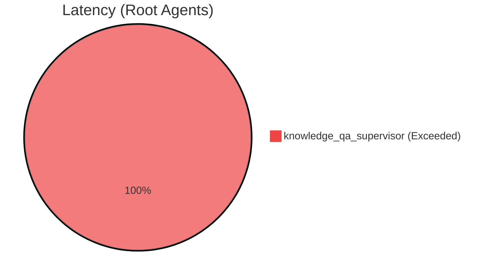

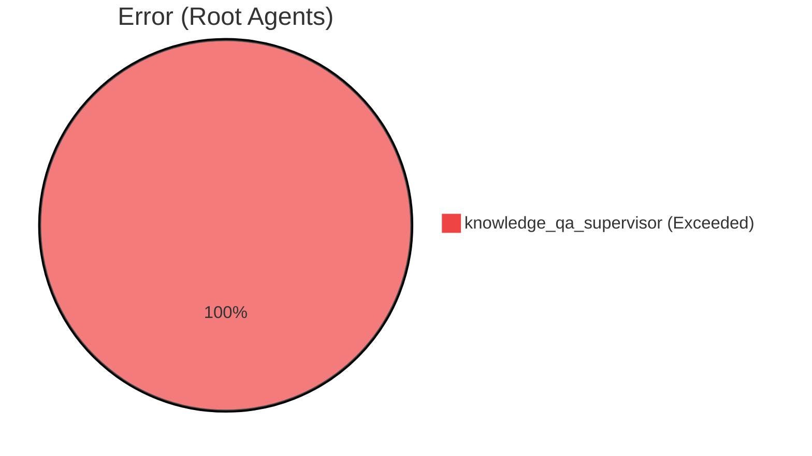

---

### Agent level

This section details the performance of internal delegate agents called by the root agent.

**KPI Compliance Per Agent**

| Name | Requests | % | Mean (s) | P95.5 (s) | Target (s) | Status | Err % | Target (%) | Status | Input Tok (Avg/P95) | Output Tok (Avg/P95) | Thought Tok (Avg/P95) | Tokens Consumed (Avg/P95) | Overall |
| :--- | :--- | :--- | :--- | :--- | :--- | :--- | :--- | :--- | :--- | :--- | :--- | :--- | :--- | :--- |
| **`bigquery_data_agent`** | 45 | 13.9% | 26.348 | 84.880 | 8.0 | 🔴 | 2.22% | 5.0% | 🟢 | 23177 / 105450 | 42 / 101 | 326 / 1272 | 23545 / 105612 | 🔴 |
| **`adk_documentation_agent`** | 48 | 14.8% | 24.035 | 48.521 | 8.0 | 🔴 | 37.50% | 5.0% | 🔴 | 894 / 1480 | 574 / 1263 | 1231 / 2170 | 3026 / 5366 | 🔴 |
| **`unreliable_tool_agent`** | 21 | 6.5% | 15.352 | 93.167 | 8.0 | 🔴 | 33.33% | 5.0% | 🔴 | 2438 / 7131 | 18 / 41 | 233 / 562 | 2650 / 7156 | 🔴 |
| **`ai_observability_agent`** | 72 | 22.2% | 23.019 | 47.203 | 8.0 | 🔴 | 26.39% | 5.0% | 🔴 | 358 / 803 | 592 / 1042 | 819 / 1838 | 1717 / 2896 | 🔴 |
| **`config_test_agent_wrong_max_output_tokens_count_config`** | 10 | 3.1% | - | - | 8.0 | 🔴 | 100.00% | 5.0% | 🔴 | - / - | - / - | - / - | - / - | 🔴 |
| **`config_test_agent_wrong_max_tokens`** | 1 | 0.3% | - | - | 8.0 | 🔴 | 100.00% | 5.0% | 🔴 | - / - | - / - | - / - | - / - | 🔴 |
| **`parallel_db_lookup`** | 29 | 9.0% | 21.990 | 37.641 | 8.0 | 🔴 | 3.45% | 5.0% | 🟢 | - / - | - / - | - / - | - / - | 🔴 |
| **`config_test_agent_wrong_candidate_count_config`** | 9 | 2.8% | 11.887 | 38.328 | 8.0 | 🔴 | 0.00% | 5.0% | 🟢 | 1602 / 4789 | 352 / 3185 | 1362 / 5625 | 2862 / 9390 | 🔴 |
| **`google_search_agent`** | 39 | 12.0% | 14.211 | 34.549 | 8.0 | 🔴 | 0.00% | 5.0% | 🟢 | 728 / 4143 | 592 / 1317 | 457 / 1646 | 1888 / 5916 | 🔴 |
| **`lookup_worker_1`** | 29 | 9.0% | 15.734 | 30.677 | 8.0 | 🔴 | 3.45% | 5.0% | 🟢 | 256 / 693 | 34 / 60 | 234 / 960 | 512 / 1157 | 🔴 |
| **`lookup_worker_3`** | 30 | 9.3% | 16.717 | 26.397 | 8.0 | 🔴 | 3.33% | 5.0% | 🟢 | 574 / 1041 | 35 / 54 | 362 / 743 | 951 / 9470 | 🔴 |
| **`lookup_worker_2`** | 29 | 9.0% | 14.685 | 24.341 | 8.0 | 🔴 | 3.45% | 5.0% | 🟢 | 309 / 453 | 32 / 54 | 274 / 642 | 607 / 1017 | 🔴 |
| **`config_test_agent_high_temp`** | 9 | 2.8% | 9.225 | 13.593 | 8.0 | 🔴 | 0.00% | 5.0% | 🟢 | 1159 / 1182 | 42 / 82 | 255 / 442 | 1456 / 1620 | 🔴 |
| **`config_test_agent_wrong_candidates`** | 1 | 0.3% | 5.899 | 5.899 | 8.0 | 🟢 | 0.00% | 5.0% | 🟢 | 1187 / 1257 | 73 / 115 | 600 / 600 | 1560 / 1747 | 🟢 |

<br>

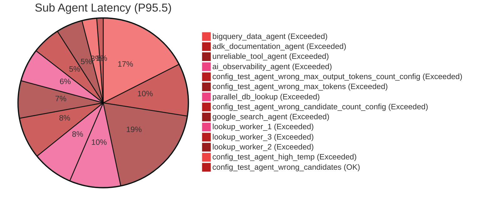

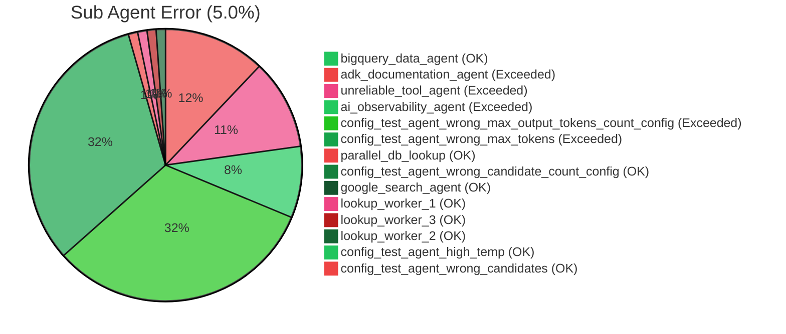

---

### Tool Level

This section breaks down the performance of each individual tool called by agents.

**KPI Compliance Per Tool**

| Name | Requests | % | Mean (s) | P95.5 (s) | Target (s) | Status | Err % | Target (%) | Status | Overall |
| :--- | :--- | :--- | :--- | :--- | :--- | :--- | :--- | :--- | :--- | :--- |
| **`flaky_tool_simulation`** | 18 | 4.8% | 3.342 | 6.306 | 3.0 | 🔴 | 22.22% | 5.0% | 🔴 | 🔴 |
| **`simulated_db_lookup`** | 179 | 47.9% | 1.023 | 4.120 | 3.0 | 🔴 | 0.00% | 5.0% | 🟢 | 🔴 |
| **`complex_calculation`** | 12 | 3.2% | 1.886 | 2.739 | 3.0 | 🟢 | 0.00% | 5.0% | 🟢 | 🟢 |
| **`execute_sql`** | 59 | 15.8% | 0.892 | 1.511 | 3.0 | 🟢 | 0.00% | 5.0% | 🟢 | 🟢 |
| **`list_table_ids`** | 31 | 8.3% | 0.360 | 0.547 | 3.0 | 🟢 | 0.00% | 5.0% | 🟢 | 🟢 |
| **`list_dataset_ids`** | 7 | 1.9% | 0.330 | 0.456 | 3.0 | 🟢 | 0.00% | 5.0% | 🟢 | 🟢 |
| **`get_table_info`** | 34 | 9.1% | 0.289 | 0.420 | 3.0 | 🟢 | 0.00% | 5.0% | 🟢 | 🟢 |

<br>

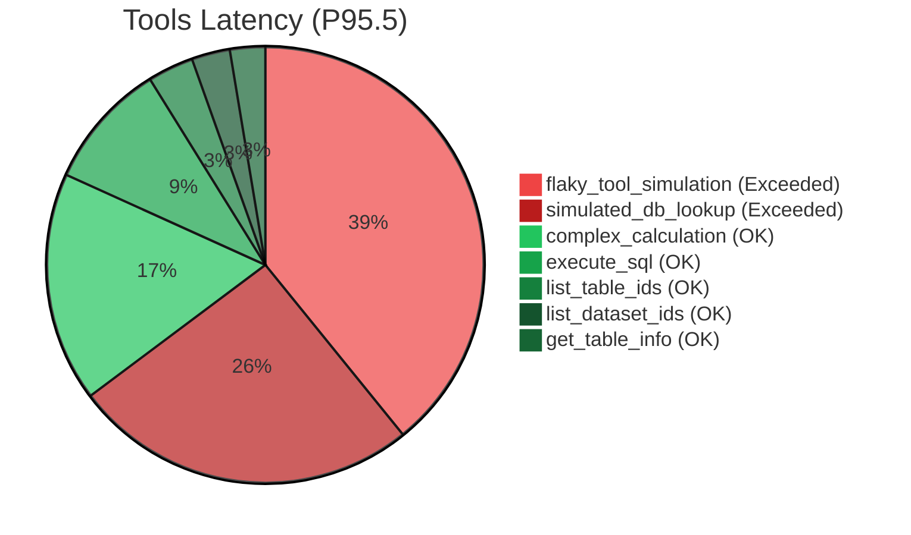

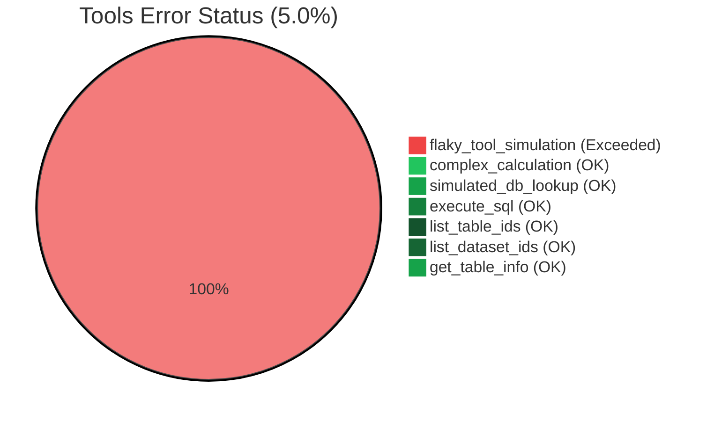

---

### Model Level

This section isolates the performance of the underlying Large Language Models, excluding agent and tool overhead.

**KPI Compliance Per Model**

| Name | Requests | % | Mean (s) | P95.5 (s) | Target (s) | Status | Err % | Target (%) | Status | Input Tok (Avg/P95) | Output Tok (Avg/P95) | Thought Tok (Avg/P95) | Tokens Consumed (Avg/P95) | Overall |
| :--- | :--- | :--- | :--- | :--- | :--- | :--- | :--- | :--- | :--- | :--- | :--- | :--- | :--- | :--- |
| **`gemini-3-pro-preview`** | 154 | 17.7% | 12.660 | 36.700 | 5.0 | 🔴 | 11.69% | 5.0% | 🔴 | 3994 / 13315 | 184 / 1042 | 632 / 1726 | 4811 / 13707 | 🔴 |
| **`gemini-2.5-pro`** | 264 | 30.4% | 8.153 | 22.076 | 5.0 | 🔴 | 6.82% | 5.0% | 🔴 | 4673 / 14945 | 86 / 578 | 320 / 850 | 5130 / 15571 | 🔴 |
| **`gemini-3.1-pro-preview`** | 187 | 21.5% | 8.870 | 34.090 | 5.0 | 🔴 | 0.53% | 5.0% | 🟢 | 1806 / 13307 | 105 / 622 | 363 / 1569 | 2269 / 13491 | 🔴 |
| **`gemini-2.5-flash`** | 264 | 30.4% | 3.697 | 11.938 | 5.0 | 🔴 | 4.55% | 5.0% | 🟢 | 11706 / 105211 | 82 / 440 | 228 / 633 | 12038 / 105325 | 🔴 |

<br>

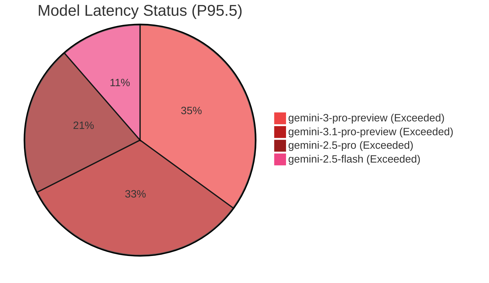

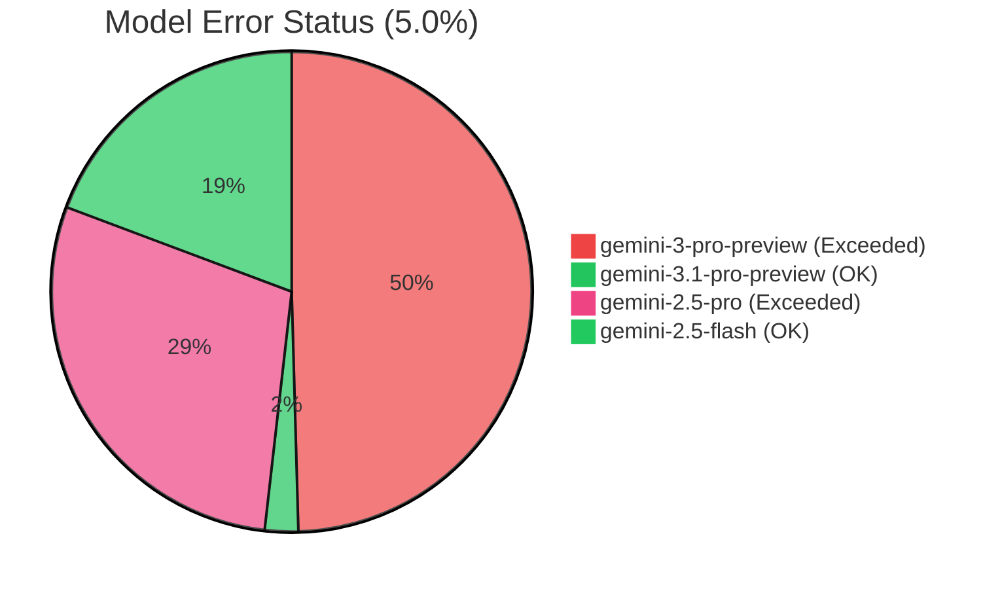

---

## Agent Composition

### Distribution

| Name | Requests | % |
| :--- | :--- | :--- |
| `ai_observability_agent` | 72 | 22.2% |
| `adk_documentation_agent` | 48 | 14.8% |
| `bigquery_data_agent` | 45 | 13.9% |
| `google_search_agent` | 39 | 12.0% |
| `lookup_worker_3` | 30 | 9.3% |
| `parallel_db_lookup` | 29 | 9.0% |
| `lookup_worker_1` | 29 | 9.0% |
| `lookup_worker_2` | 29 | 9.0% |
| `unreliable_tool_agent` | 21 | 6.5% |
| `config_test_agent_wrong_max_output_tokens_count_config` | 10 | 3.1% |
| `config_test_agent_wrong_candidate_count_config` | 9 | 2.8% |
| `config_test_agent_high_temp` | 9 | 2.8% |
| `config_test_agent_wrong_max_tokens` | 1 | 0.3% |
| `config_test_agent_wrong_candidates` | 1 | 0.3% |

---

### Model Traffic

This table shows the volume of requests routed to each model per agent.

| Agent Name | gemini-3.1-pro-preview | gemini-3-pro-preview | gemini-2.5-pro | gemini-2.5-flash |
| :--- | :--- | :--- | :--- | :--- |
| `bigquery_data_agent` | 2 (4.4%) | 10 (22.2%) | 11 (24.4%) | 31 (68.9%) |
| `adk_documentation_agent` | 8 (16.7%) | 10 (20.8%) | 18 (37.5%) | 12 (25.0%) |
| `ai_observability_agent` | 9 (12.5%) | 32 (44.4%) | 28 (38.9%) | 2 (2.8%) |
| `lookup_worker_3` | 17 (56.7%) | 1 (3.3%) | 8 (26.7%) | 3 (10.0%) |
| `lookup_worker_1` | 17 (58.6%) | 1 (3.4%) | 8 (27.6%) | 3 (10.3%) |
| `unreliable_tool_agent` | - | - | 19 (90.5%) | 8 (38.1%) |
| `lookup_worker_2` | 17 (58.6%) | 1 (3.4%) | 9 (31.0%) | 2 (6.9%) |
| `google_search_agent` | 3 (7.7%) | 9 (23.1%) | 10 (25.6%) | 17 (43.6%) |
| `config_test_agent_wrong_candidate_count_config` | - | 2 (22.2%) | 1 (11.1%) | 7 (77.8%) |
| `config_test_agent_high_temp` | 9 (100.0%) | - | - | - |
| `config_test_agent_wrong_candidates` | - | - | - | 1 (100.0%) |
| `config_test_agent_wrong_max_tokens` | - | - | - | 1 (100.0%) |
| `config_test_agent_wrong_max_output_tokens_count_config` | 1 (10.0%) | - | - | 9 (90.0%) |

---

### Model Performance

This table compares how specific agents perform when running on different models, highlighting optimal model choices.

| Agent Name | gemini-3.1-pro-preview | gemini-3-pro-preview | gemini-2.5-pro | gemini-2.5-flash |
| :--- | :--- | :--- | :--- | :--- |
| `bigquery_data_agent` | 84.88s (0.0%) 🔴 | 120.422s (0.0%) 🔴 | 73.714s (0.0%) 🔴 | 31.36s (3.23%) 🔴 |
| `adk_documentation_agent` | 38.374s (0.0%) 🔴 | 51.512s (0.0%) 🔴 | 7.458s (88.89%) 🔴 | 21.558s (16.67%) 🔴 |
| `ai_observability_agent` | 47.203s (0.0%) 🔴 | 51.174s (50.0%) 🔴 | 46.519s (7.14%) 🔴 | 5.862s (0.0%) 🟢 |
| `lookup_worker_3` | 16.358s (0.0%) 🔴 | - (100.0%) 🔴 | 116.662s (0.0%) 🔴 | 12.05s (0.0%) 🔴 |
| `lookup_worker_1` | 30.677s (0.0%) 🔴 | - (100.0%) 🔴 | 37.64s (0.0%) 🔴 | 12.924s (0.0%) 🔴 |
| `unreliable_tool_agent` | - | - | 93.167s (31.58%) 🔴 | 13.268s (12.5%) 🔴 |
| `lookup_worker_2` | 18.785s (0.0%) 🔴 | - (100.0%) 🔴 | 24.341s (0.0%) 🔴 | 29.304s (0.0%) 🔴 |
| `google_search_agent` | 37.116s (0.0%) 🔴 | 21.61s (0.0%) 🔴 | 32.579s (0.0%) 🔴 | 16.471s (0.0%) 🔴 |
| `config_test_agent_wrong_candidate_count_config` | - | 24.945s (50.0%) 🔴 | 38.328s (0.0%) 🔴 | 7.004s (0.0%) 🟢 |
| `config_test_agent_high_temp` | 13.593s (0.0%) 🔴 | - | - | - |
| `config_test_agent_wrong_candidates` | - | - | - | 5.899s (0.0%) 🟢 |
| `config_test_agent_wrong_max_tokens` | - | - | - | - (100.0%) 🔴 |
| `config_test_agent_wrong_max_output_tokens_count_config` | - (100.0%) 🔴 | - | - | - (100.0%) 🔴 |

---

## Token Statistics

### **bigquery_data_agent**
| Metric | gemini-3.1-pro-preview | gemini-3-pro-preview | gemini-2.5-pro | gemini-2.5-flash |
| :--- | :--- | :--- | :--- | :--- |
| Mean Output Tokens | 63 | 51 | 44 | 36 |
| Median Output Tokens | 65 | 32 | 39 | 28 |
| Min/Max Output Tokens | 17 / 125 | 17 / 161 | 20 / 156 | 13 / 189 |
| Latency vs Output | 🟧 **Strong** -1.0 | 🟧 **Strong** -0.821 | -0.627 | -0.631 |
| Latency vs Output+Thought | 🟧 **Strong** 1.0 | 🟧 **Strong** 0.927 | 0.372 | 0.523 |
| Latency vs Total Tokens | 🟧 **Strong** 1.0 | 🟧 **Strong** 0.965 | 0.185 | 0.618 |

### **adk_documentation_agent**
| Metric | gemini-3.1-pro-preview | gemini-3-pro-preview | gemini-2.5-pro | gemini-2.5-flash |
| :--- | :--- | :--- | :--- | :--- |
| Mean Output Tokens | 559 | 980 | 39 | 285 |
| Median Output Tokens | 548 | 1039 | 38 | 53 |
| Min/Max Output Tokens | 511 / 644 | 463 / 1280 | 38 / 39 | 40 / 908 |
| Latency vs Output | 🟧 **Strong** -0.936 | -0.645 | 🟧 **Strong** -1.0 | 🟧 **Strong** -0.887 |
| Latency vs Output+Thought | -0.38 | 🟧 **Strong** 0.903 | 🟧 **Strong** 1.0 | 🟧 **Strong** 0.825 |
| Latency vs Total Tokens | 🟧 **Strong** 0.88 | 0.309 | 🟧 **Strong** 1.0 | 🟧 **Strong** 0.989 |

### **ai_observability_agent**
| Metric | gemini-3.1-pro-preview | gemini-3-pro-preview | gemini-2.5-pro | gemini-2.5-flash |
| :--- | :--- | :--- | :--- | :--- |
| Mean Output Tokens | 635 | 665 | 356 | 164 |
| Median Output Tokens | 648 | 414 | 453 | 101 |
| Min/Max Output Tokens | 583 / 675 | 266 / 1186 | 38 / 578 | 101 / 227 |
| Latency vs Output | -0.441 | 0.202 | 0.257 | 🟧 **Strong** 1.0 |
| Latency vs Output+Thought | -0.379 | 🟧 **Strong** 0.705 | 🟧 **Strong** 0.939 | 🟧 **Strong** 1.0 |
| Latency vs Total Tokens | 0.279 | 🟧 **Strong** 0.812 | 0.241 | 🟧 **Strong** 1.0 |

### **lookup_worker_3**
| Metric | gemini-3.1-pro-preview | gemini-3-pro-preview | gemini-2.5-pro | gemini-2.5-flash |
| :--- | :--- | :--- | :--- | :--- |
| Mean Output Tokens | 48 | 20 | 21 | 30 |
| Median Output Tokens | 48 | 19 | 17 | 31 |
| Min/Max Output Tokens | 32 / 59 | 19 / 20 | 12 / 53 | 20 / 36 |
| Latency vs Output | -0.379 | - | 🟧 **Strong** -0.993 | -0.539 |
| Latency vs Output+Thought | 0.184 | - | 0.287 | -0.615 |
| Latency vs Total Tokens | 🟧 **Strong** 0.829 | - | 🟧 **Strong** 0.992 | 0.372 |

### **lookup_worker_1**
| Metric | gemini-3.1-pro-preview | gemini-3-pro-preview | gemini-2.5-pro | gemini-2.5-flash |
| :--- | :--- | :--- | :--- | :--- |
| Mean Output Tokens | 48 | 20 | 15 | 35 |
| Median Output Tokens | 48 | 19 | 14 | 36 |
| Min/Max Output Tokens | 32 / 63 | 19 / 20 | 7 / 26 | 19 / 61 |
| Latency vs Output | 🟧 **Strong** -0.723 | - | 🟧 **Strong** -0.893 | 🟧 **Strong** -0.944 |
| Latency vs Output+Thought | 0.523 | - | 0.133 | 🟧 **Strong** 0.939 |
| Latency vs Total Tokens | 🟧 **Strong** 0.802 | - | 🟧 **Strong** 0.907 | 🟧 **Strong** 0.944 |

### **unreliable_tool_agent**
| Metric | gemini-2.5-pro | gemini-2.5-flash |
| :--- | :--- | :--- |
| Mean Output Tokens | 17 | 19 |
| Median Output Tokens | 14 | 19 |
| Min/Max Output Tokens | 6 / 44 | 12 / 26 |
| Latency vs Output | -0.086 | 0.381 |
| Latency vs Output+Thought | 0.215 | -0.24 |
| Latency vs Total Tokens | 0.048 | -0.445 |

### **lookup_worker_2**
| Metric | gemini-3.1-pro-preview | gemini-3-pro-preview | gemini-2.5-pro | gemini-2.5-flash |
| :--- | :--- | :--- | :--- | :--- |
| Mean Output Tokens | 48 | 24 | 17 | 34 |
| Median Output Tokens | 48 | 24 | 14 | 34 |
| Min/Max Output Tokens | 32 / 60 | 24 / 24 | 11 / 38 | 12 / 53 |
| Latency vs Output | -0.587 | - | -0.193 | 🟧 **Strong** -1.0 |
| Latency vs Output+Thought | 0.432 | - | -0.619 | 🟧 **Strong** -1.0 |
| Latency vs Total Tokens | 🟧 **Strong** 0.912 | - | 0.366 | 🟧 **Strong** 1.0 |

### **google_search_agent**
| Metric | gemini-3.1-pro-preview | gemini-3-pro-preview | gemini-2.5-pro | gemini-2.5-flash |
| :--- | :--- | :--- | :--- | :--- |
| Mean Output Tokens | 734 | 119 | 987 | 586 |
| Median Output Tokens | 732 | 51 | 1040 | 145 |
| Min/Max Output Tokens | 535 / 936 | 48 / 650 | 122 / 1317 | 28 / 1425 |
| Latency vs Output | 🟧 **Strong** -0.98 | 🟧 **Strong** -0.845 | 0.238 | 0.681 |
| Latency vs Output+Thought | 🟧 **Strong** 0.916 | 🟧 **Strong** 0.897 | 🟧 **Strong** 0.781 | 🟧 **Strong** 0.954 |
| Latency vs Total Tokens | 🟧 **Strong** -0.988 | 🟧 **Strong** 0.892 | 0.69 | 🟧 **Strong** 0.991 |

### **config_test_agent_wrong_candidate_count_config**
| Metric | gemini-3-pro-preview | gemini-2.5-pro | gemini-2.5-flash |
| :--- | :--- | :--- | :--- |
| Mean Output Tokens | 303 | 1981 | 126 |
| Median Output Tokens | 85 | 776 | 50 |
| Min/Max Output Tokens | 85 / 520 | 776 / 3185 | 30 / 440 |
| Latency vs Output | - | - | -0.399 |
| Latency vs Output+Thought | - | - | -0.242 |
| Latency vs Total Tokens | - | - | 0.103 |

### **config_test_agent_high_temp**
| Metric | gemini-3.1-pro-preview |
| :--- | :--- |
| Mean Output Tokens | 42 |
| Median Output Tokens | 33 |
| Min/Max Output Tokens | 10 / 82 |
| Latency vs Output | -0.195 |
| Latency vs Output+Thought | 🟧 **Strong** -0.74 |
| Latency vs Total Tokens | 🟧 **Strong** 0.9 |

### **config_test_agent_wrong_candidates**
| Metric | gemini-2.5-flash |
| :--- | :--- |
| Mean Output Tokens | 73 |
| Median Output Tokens | 30 |
| Min/Max Output Tokens | 30 / 115 |
| Latency vs Output | - |
| Latency vs Output+Thought | - |
| Latency vs Total Tokens | - |

---

## Model Composition

### Model Performance

| Metric | gemini-3.1-pro-preview | gemini-3-pro-preview | gemini-2.5-pro | gemini-2.5-flash |
| :--- | :--- | :--- | :--- | :--- |
| **Total Requests** | 187 | 154 | 264 | 264 |
| **Mean Latency (s)** | 8.828 | 11.972 | 8.065 | 3.644 |
| **Std Deviation (s)** | 8.882 | 10.753 | 14.344 | 3.339 |
| **Median Latency (s)** | 5.714 | 7.250 | 4.943 | 2.499 |
| **P95 Latency (s)** | 33.095 | 36.625 | 21.399 | 11.200 |
| **P99 Latency (s)** | 40.647 | 51.172 | 89.067 | 20.440 |
| **Max Latency (s)** | 47.201 | 51.509 | 172.517 | 27.263 |
| **Outliers (>3σ)** | 2.7% | 2.6% | 1.5% | 2.3% |

---

### Performance Distribution

**gemini-3.1-pro-preview**

| Bucket | Count | Percent |
| :--- | :--- | :--- |
| < 1s | 1 | 0.5% |
| 1-2s | 0 | 0.0% |
| 2-3s | 3 | 1.6% |
| 3-5s | 60 | 32.1% |
| 5-8s | 84 | 44.9% |
| > 8s | 39 | 20.9% |

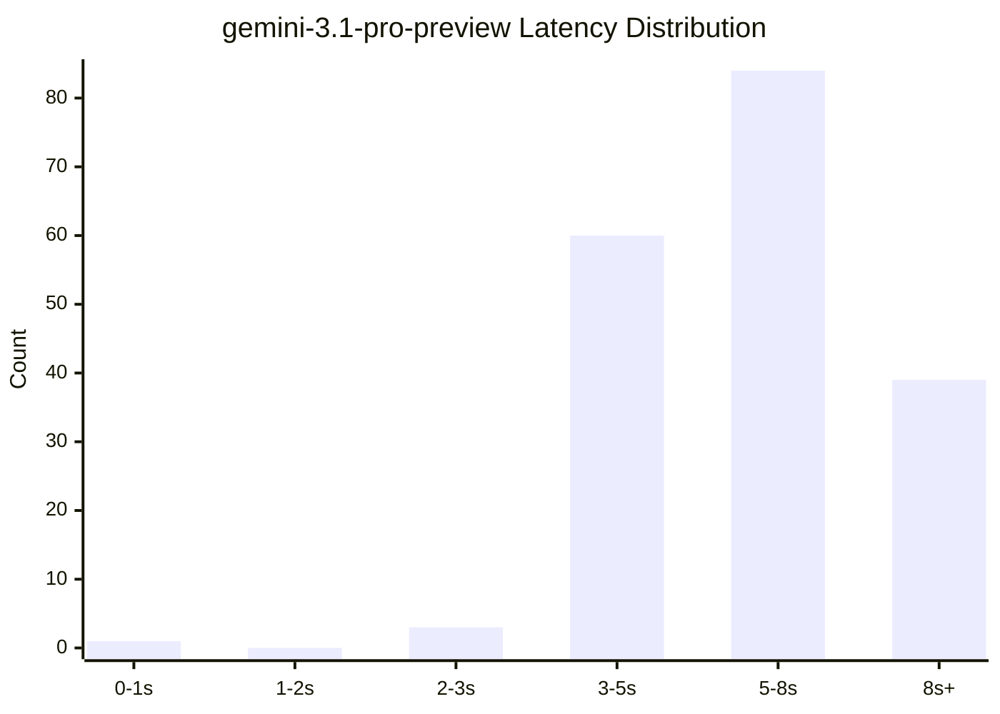

**gemini-3-pro-preview**

| Bucket | Count | Percent |
| :--- | :--- | :--- |
| < 1s | 0 | 0.0% |
| 1-2s | 1 | 0.6% |
| 2-3s | 1 | 0.6% |
| 3-5s | 28 | 18.2% |
| 5-8s | 52 | 33.8% |
| > 8s | 72 | 46.8% |

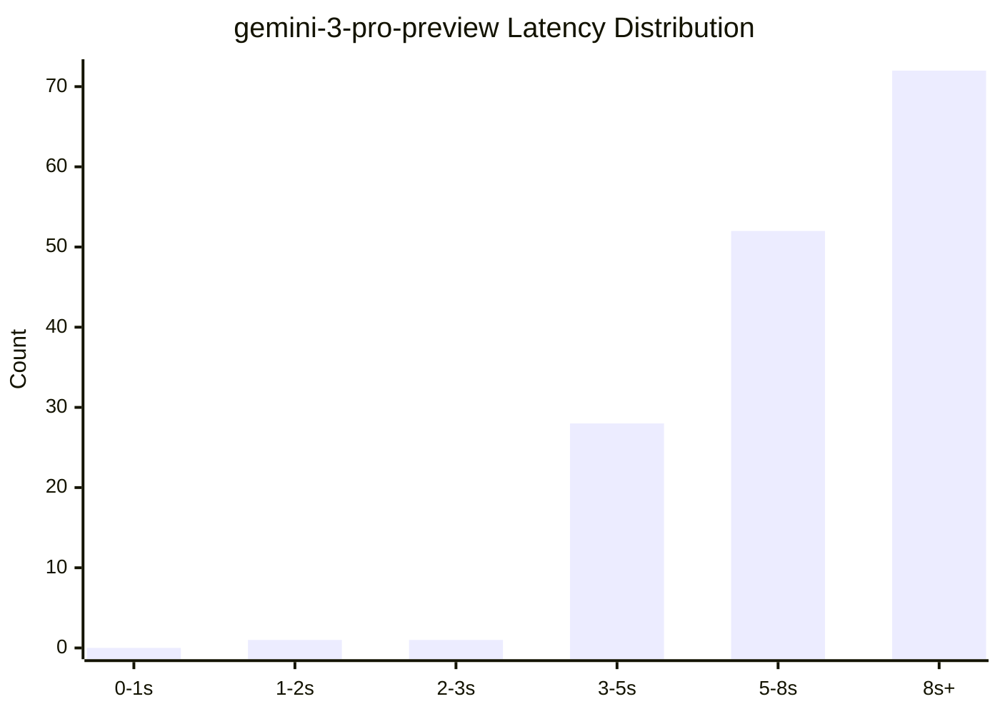

**gemini-2.5-pro**

| Bucket | Count | Percent |
| :--- | :--- | :--- |
| < 1s | 0 | 0.0% |
| 1-2s | 0 | 0.0% |
| 2-3s | 47 | 17.8% |
| 3-5s | 86 | 32.6% |
| 5-8s | 77 | 29.2% |
| > 8s | 54 | 20.5% |

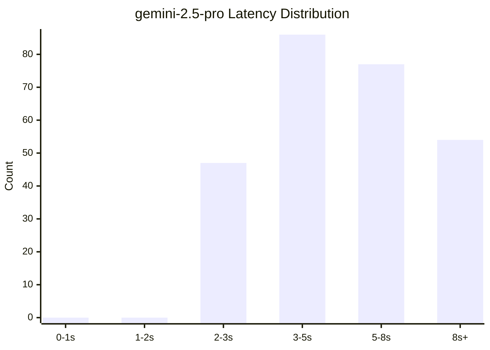

**gemini-2.5-flash**

| Bucket | Count | Percent |
| :--- | :--- | :--- |
| < 1s | 2 | 0.8% |
| 1-2s | 65 | 24.6% |
| 2-3s | 97 | 36.7% |
| 3-5s | 61 | 23.1% |
| 5-8s | 20 | 7.6% |
| > 8s | 19 | 7.2% |

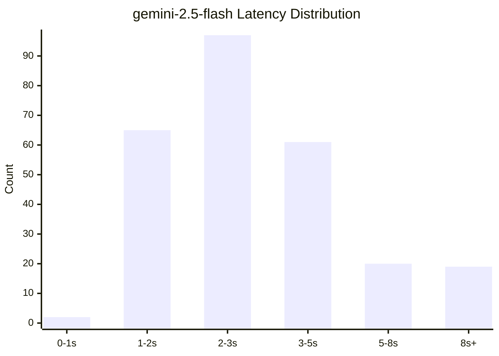

---

### Token Statistics (Global Model Comparison)

| Metric | gemini-3.1-pro-preview | gemini-3-pro-preview | gemini-2.5-pro | gemini-2.5-flash |
| :--- | :--- | :--- | :--- | :--- |
| **Mean Output Tokens** | 105.0 | 184.4 | 86.1 | 82.1 |
| **Median Output Tokens** | 48.0 | 24.0 | 14.0 | 25.0 |
| **Min Output Tokens** | 10.0 | 17.0 | 6.0 | 12.0 |
| **Max Output Tokens** | 936.0 | 1280.0 | 3185.0 | 1425.0 |
| **Latency vs Output Corr.** | 0.924 | 0.894 | 0.299 | 0.645 |
| **Latency vs Output+Thinking Corr.** | 0.959 | 0.851 | 0.472 | 0.911 |
| **Correlation Strength** | Strong (vs Thought) 🟧 | Strong (vs Output) 🟧 | Weak | Strong (vs Thought) 🟧 |

---

## System Bottlenecks & Impact

### Top Bottlenecks

| Rank | Timestamp | Type | Latency (s) | Name | Details (Trunk) | RCA | Session ID | Trace ID | Span ID |
| :--- | :--- | :--- | :--- | :--- | :--- | :--- | :--- | :--- | :--- |
| 1 | 2026-02-24T17:48:56.790197 | Invocation | 176.677 | **`knowledge_qa_supervisor`** | Explain the benefits of AI agent tracing. | The `knowledge_qa_supervisor` agent experienced a delay, indicated by a `duration_ms` of 176677, which translates to approximately 177 seconds. This delay occurred while processing the prompt "Explain the benefits of AI agent tracing.". The agent status is "OK", and there is no error message, indicating successful completion but with a noticeable processing duration. | `0211bbc5-c4e0-4f44-9c32-7515b43ae0b0` | [`844d33bab4c069bf005ece6b9c112f12`](https://console.cloud.google.com/traces/explorer;traceId=844d33bab4c069bf005ece6b9c112f12?project=agent-operations-ek-01) | [`e-eba986bf-08c3-419c-a636-7a4ac4264139`](https://console.cloud.google.com/traces/explorer;traceId=844d33bab4c069bf005ece6b9c112f12;spanId=e-eba986bf-08c3-419c-a636-7a4ac4264139?project=agent-operations-ek-01) |
| 2 | 2026-02-24T17:49:00.941242 | LLM | 172.517 | **`ai_observability_agent`** | [LARGE PAYLOAD: 3473 chars. Use batch_analyze_root_cause(span_ids='...') to analyze full content instead of fetching it here.] | The `ai_observability_agent` experienced a long duration of 172517 ms. The `time_to_first_token_ms` was equal to the total duration, indicating the entire duration was spent waiting for the first token. The prompt contained 803 tokens, and the total tokens used was 1438. There was no error reported. The long duration is likely due to the model processing the 803 token prompt. | `0211bbc5-c4e0-4f44-9c32-7515b43ae0b0` | [`844d33bab4c069bf005ece6b9c112f12`](https://console.cloud.google.com/traces/explorer;traceId=844d33bab4c069bf005ece6b9c112f12?project=agent-operations-ek-01) | [`5f1efe0671a78fb7`](https://console.cloud.google.com/traces/explorer;traceId=844d33bab4c069bf005ece6b9c112f12;spanId=5f1efe0671a78fb7?project=agent-operations-ek-01) |
| 3 | 2026-02-24T08:15:52.301306 | Invocation | 127.054 | **`knowledge_qa_supervisor`** | First, get the top 5 most recent BigQuery errors. Then, search for solutions for the most frequent error online. | - | `5be5fd3f-f0fe-4533-8348-956e96f6a0bf` | [`c9f325d3ea9bddccb75a164ffc5fd14a`](https://console.cloud.google.com/traces/explorer;traceId=c9f325d3ea9bddccb75a164ffc5fd14a?project=agent-operations-ek-01) | [`e-5054b4e8-e7f7-4c7e-a8a0-a9e2ad2aa459`](https://console.cloud.google.com/traces/explorer;traceId=c9f325d3ea9bddccb75a164ffc5fd14a;spanId=e-5054b4e8-e7f7-4c7e-a8a0-a9e2ad2aa459?project=agent-operations-ek-01) |
| 4 | 2026-02-24T17:46:53.873369 | Invocation | 122.414 | **`knowledge_qa_supervisor`** | Get item_1, large_record_F. | - | `0211bbc5-c4e0-4f44-9c32-7515b43ae0b0` | [`7ea524f3af9eb39fb531333ceb19b7cd`](https://console.cloud.google.com/traces/explorer;traceId=7ea524f3af9eb39fb531333ceb19b7cd?project=agent-operations-ek-01) | [`e-00a22c0c-da69-413c-8ff9-778265fb6933`](https://console.cloud.google.com/traces/explorer;traceId=7ea524f3af9eb39fb531333ceb19b7cd;spanId=e-00a22c0c-da69-413c-8ff9-778265fb6933?project=agent-operations-ek-01) |
| 5 | 2026-02-24T18:11:33.494775 | Invocation | 105.971 | **`knowledge_qa_supervisor`** | Get item_1, large_record_F. | - | `32bada90-68fc-41b8-bf26-25dda1f25587` | [`da2332ca93b91bac6cf7afc54a31c848`](https://console.cloud.google.com/traces/explorer;traceId=da2332ca93b91bac6cf7afc54a31c848?project=agent-operations-ek-01) | [`e-c018b69c-8011-45fc-947f-e20f61da2b30`](https://console.cloud.google.com/traces/explorer;traceId=da2332ca93b91bac6cf7afc54a31c848;spanId=e-c018b69c-8011-45fc-947f-e20f61da2b30?project=agent-operations-ek-01) |

---

### Tool Bottlenecks

| Rank | Timestamp | Tool (s) | Tool Name | Tool Status | Tool Args | Impact % | RCA | Agent | Agent (s) | Agent Status | Root Agent | E2E (s) | Root Status | User Msg | Sess ID | Trace ID | Span ID |
| :--- | :--- | :--- | :--- | :--- | :--- | :--- | :--- | :--- | :--- | :--- | :--- | :--- | :--- | :--- | :--- | :--- | :--- |
| 1 | 2026-02-24T18:08:47.351911+00:00 | 6.222 | `flaky_tool_simulation` | 🟢 | `{"query":"very_slow_topic"}` | 47.57% | - | `unreliable_tool_agent` | 10.159 | 🟢 | `knowledge_qa_supervisor` | 13.081 | 🟢 | Try the unreliable tool with very_slow_topic input. | `8a2023d6-8b63-4a7a-8855-d6ee7def251f` | [`3b8c10c1fd8f88b341a1d5966c706c07`](https://console.cloud.google.com/traces/explorer;traceId=3b8c10c1fd8f88b341a1d5966c706c07?project=agent-operations-ek-01) | [`dd451a6d489f21a6`](https://console.cloud.google.com/traces/explorer;traceId=3b8c10c1fd8f88b341a1d5966c706c07;spanId=dd451a6d489f21a6?project=agent-operations-ek-01) |
| 2 | 2026-02-24T17:44:20.112676+00:00 | 6.306 | `flaky_tool_simulation` | 🟢 | `{"query":"very_slow_topic"}` | 41.86% | - | `unreliable_tool_agent` | 13.268 | 🟢 | `knowledge_qa_supervisor` | 15.064 | 🟢 | Try the unreliable tool with very_slow_topic input. | `6fbf143d-81aa-4463-b1db-57e25e979085` | [`81609a6be7bf2b1f6e170df45a76a266`](https://console.cloud.google.com/traces/explorer;traceId=81609a6be7bf2b1f6e170df45a76a266?project=agent-operations-ek-01) | [`1e738ab3bfbe0c05`](https://console.cloud.google.com/traces/explorer;traceId=81609a6be7bf2b1f6e170df45a76a266;spanId=1e738ab3bfbe0c05?project=agent-operations-ek-01) |
| 3 | 2026-02-24T18:17:57.819530+00:00 | 5.975 | `flaky_tool_simulation` | 🔴 | `{"query":"Simulate a flaky action for 'test case...` | 21.65% | - | `unreliable_tool_agent` | 0.000 | 🔴 | `knowledge_qa_supervisor` | 27.600 | 🟢 | Describe event logging in AI agents. | `7f22ec4f-15c2-45e3-9f2f-30950f9a82c3` | [`c1a31dc41240d3f36d968c9a340b4e78`](https://console.cloud.google.com/traces/explorer;traceId=c1a31dc41240d3f36d968c9a340b4e78?project=agent-operations-ek-01) | [`df8428b97374a906`](https://console.cloud.google.com/traces/explorer;traceId=c1a31dc41240d3f36d968c9a340b4e78;spanId=df8428b97374a906?project=agent-operations-ek-01) |
| 4 | 2026-02-24T18:17:57.819530+00:00 | 5.975 | `flaky_tool_simulation` | 🔴 | `{"query":"Simulate a flaky action for 'test case...` | 0.00% | - | `unreliable_tool_agent` | 0.000 | 🔴 | `knowledge_qa_supervisor` | 0.000 | 🔴 | Simulate a flaky action for 'test case 1'. | `7f22ec4f-15c2-45e3-9f2f-30950f9a82c3` | [`c1a31dc41240d3f36d968c9a340b4e78`](https://console.cloud.google.com/traces/explorer;traceId=c1a31dc41240d3f36d968c9a340b4e78?project=agent-operations-ek-01) | [`df8428b97374a906`](https://console.cloud.google.com/traces/explorer;traceId=c1a31dc41240d3f36d968c9a340b4e78;spanId=df8428b97374a906?project=agent-operations-ek-01) |
| 5 | 2026-02-24T18:09:24.281613+00:00 | 9.416 | `flaky_tool_simulation` | 🔴 | `{"query":"very_slow_topic"}` | 0.00% | - | `unreliable_tool_agent` | 0.000 | 🔴 | `knowledge_qa_supervisor` | 0.000 | 🔴 | Try the unreliable tool with very_slow_topic input. | `9ec1a54f-52c9-4659-906e-15e7e0380fed` | [`bf46dbf39dc20547ec31b2e3ae73c6be`](https://console.cloud.google.com/traces/explorer;traceId=bf46dbf39dc20547ec31b2e3ae73c6be?project=agent-operations-ek-01) | [`8f579c4071f0b24a`](https://console.cloud.google.com/traces/explorer;traceId=bf46dbf39dc20547ec31b2e3ae73c6be;spanId=8f579c4071f0b24a?project=agent-operations-ek-01) |

---

### LLM Bottlenecks

| Rank | Timestamp | LLM (s) | TTFT (s) | Model | LLM Status | Input | Output | Thought | Total Tokens | Impact % | RCA | Agent | Agent (s) | Agent Status | Root Agent | E2E (s) | Root Status | User Msg | Sess ID | Trace ID | Span ID |
| :--- | :--- | :--- | :--- | :--- | :--- | :--- | :--- | :--- | :--- | :--- | :--- | :--- | :--- | :--- | :--- | :--- | :--- | :--- | :--- | :--- | :--- |
| 1 | 2026-02-24T17:49:00.941242+00:00 | 172.517 | 172.517 | `gemini-2.5-pro` | 🟢 | 803 | 0 | 257 | 1438 | 97.65% | The `ai_observability_agent` experienced a long dura... | `ai_observability_agent` | 172.527 | 🟢 | `knowledge_qa_supervisor` | 176.677 | 🟢 | Explain the benefits of AI agent tracing. | `0211bbc5-c4e0-4f44-9c32-7515b43ae0b0` | [`844d33bab4c069bf005ece6b9c112f12`](https://console.cloud.google.com/traces/explorer;traceId=844d33bab4c069bf005ece6b9c112f12?project=agent-operations-ek-01) | [`5f1efe0671a78fb7`](https://console.cloud.google.com/traces/explorer;traceId=844d33bab4c069bf005ece6b9c112f12;spanId=5f1efe0671a78fb7?project=agent-operations-ek-01) |
| 2 | 2026-02-24T17:46:59.625342+00:00 | 98.609 | 98.609 | `gemini-2.5-pro` | 🟢 | 140 | 14 | 9316 | 9470 | 80.55% | - | `lookup_worker_3` | 116.662 | 🟢 | `knowledge_qa_supervisor` | 122.414 | 🟢 | Get item_1, large_record_F. | `0211bbc5-c4e0-4f44-9c32-7515b43ae0b0` | [`7ea524f3af9eb39fb531333ceb19b7cd`](https://console.cloud.google.com/traces/explorer;traceId=7ea524f3af9eb39fb531333ceb19b7cd?project=agent-operations-ek-01) | [`b359b5b4a187f790`](https://console.cloud.google.com/traces/explorer;traceId=7ea524f3af9eb39fb531333ceb19b7cd;spanId=b359b5b4a187f790?project=agent-operations-ek-01) |
| 3 | 2026-02-24T18:17:54.853779+00:00 | 89.067 | 89.067 | `gemini-2.5-pro` | 🟢 | 1194 | 11 | 128 | 1333 | 92.50% | - | `unreliable_tool_agent` | 93.167 | 🟢 | `knowledge_qa_supervisor` | 96.284 | 🟢 | Simulate a flaky action for 'test case 1'. | `a90aa3a5-4cda-4496-bae5-568b438ed53a` | [`2cf2baefdda0e144915410461a4feaba`](https://console.cloud.google.com/traces/explorer;traceId=2cf2baefdda0e144915410461a4feaba?project=agent-operations-ek-01) | [`4d9f939b30b330d8`](https://console.cloud.google.com/traces/explorer;traceId=2cf2baefdda0e144915410461a4feaba;spanId=4d9f939b30b330d8?project=agent-operations-ek-01) |
| 4 | 2026-02-24T18:11:33.496235+00:00 | 68.323 | 68.323 | `gemini-2.5-pro` | 🟢 | 1401 | 13 | 460 | 1874 | 64.47% | - | `knowledge_qa_supervisor` | 105.970 | 🟢 | `knowledge_qa_supervisor` | 105.971 | 🟢 | Get item_1, large_record_F. | `32bada90-68fc-41b8-bf26-25dda1f25587` | [`da2332ca93b91bac6cf7afc54a31c848`](https://console.cloud.google.com/traces/explorer;traceId=da2332ca93b91bac6cf7afc54a31c848?project=agent-operations-ek-01) | [`f44babdce1635b31`](https://console.cloud.google.com/traces/explorer;traceId=da2332ca93b91bac6cf7afc54a31c848;spanId=f44babdce1635b31?project=agent-operations-ek-01) |
| 5 | 2026-02-24T18:11:33.496235+00:00 | 68.323 | 68.323 | `gemini-2.5-pro` | 🟢 | 1401 | 13 | 460 | 1874 | 64.47% | - | `knowledge_qa_supervisor` | 105.970 | 🟢 | `knowledge_qa_supervisor` | 105.971 | 🟢 | Get item_1, large_record_F. | `32bada90-68fc-41b8-bf26-25dda1f25587` | [`da2332ca93b91bac6cf7afc54a31c848`](https://console.cloud.google.com/traces/explorer;traceId=da2332ca93b91bac6cf7afc54a31c848?project=agent-operations-ek-01) | [`f44babdce1635b31`](https://console.cloud.google.com/traces/explorer;traceId=da2332ca93b91bac6cf7afc54a31c848;spanId=f44babdce1635b31?project=agent-operations-ek-01) |

---

## Error Analysis

This section traces errors from their origin, showing how they ripple through the system.

### Root Agent Errors

| Rank | Timestamp | Root Agent | Error Message | User Message | Trace ID | Invocation ID |
| :--- | :--- | :--- | :--- | :--- | :--- | :--- |
| 1 | 2026-02-26 05:48:24.739113+00:00 | `knowledge_qa_supervisor` | Invocation PENDING for > 5 minutes (Timed Out) | Explain real-time monitoring for AI agents. | [`c5e16c4e51ff3e77cdc3b359a34ef634`](https://console.cloud.google.com/traces/explorer;traceId=c5e16c4e51ff3e77cdc3b359a34ef634?project=agent-operations-ek-01) | `e-2a1acb7f-69e8-46c4-99dd-7bb23cfb311b` |
| 2 | 2026-02-26 05:48:08.790323+00:00 | `knowledge_qa_supervisor` | Invocation PENDING for > 5 minutes (Timed Out) | What are the key metrics for AI agent health? | [`c5e16c4e51ff3e77cdc3b359a34ef634`](https://console.cloud.google.com/traces/explorer;traceId=c5e16c4e51ff3e77cdc3b359a34ef634?project=agent-operations-ek-01) | `e-7a394b56-f4e3-43ce-bfca-3ddcb05a6a42` |
| 3 | 2026-02-26 05:41:01.047727+00:00 | `knowledge_qa_supervisor` | Invocation PENDING for > 5 minutes (Timed Out) | Using config WRONG_MAX_TOKENS, calculate for 'tes... | [`41f0a355df19436af557b9ba2b493a55`](https://console.cloud.google.com/traces/explorer;traceId=41f0a355df19436af557b9ba2b493a55?project=agent-operations-ek-01) | `e-b5651877-39ab-4e8f-b728-070c79526897` |
| 4 | 2026-02-24 18:30:40.380936+00:00 | `knowledge_qa_supervisor` | Invocation PENDING for > 5 minutes (Timed Out) | Explain real-time monitoring for AI agents. | [`34092d5ff289565a8c24785995906ed6`](https://console.cloud.google.com/traces/explorer;traceId=34092d5ff289565a8c24785995906ed6?project=agent-operations-ek-01) | `e-6ce539c9-8cc1-4b0c-8ff1-45019ee3d958` |
| 5 | 2026-02-24 18:30:25.216074+00:00 | `knowledge_qa_supervisor` | Invocation PENDING for > 5 minutes (Timed Out) | What are the key metrics for AI agent health? | [`34092d5ff289565a8c24785995906ed6`](https://console.cloud.google.com/traces/explorer;traceId=34092d5ff289565a8c24785995906ed6?project=agent-operations-ek-01) | `e-d55b11c7-ad1b-487f-acda-630a43bea877` |

### Agent Errors

| Rank | Timestamp | Agent Name | Error Message | Root Agent | Root Status | User Message | Trace ID | Span ID |
| :--- | :--- | :--- | :--- | :--- | :--- | :--- | :--- | :--- |
| 1 | 2026-02-26 05:48:30.866123+00:00 | `ai_observability_agent` | Agent span PENDING for > 5 minutes (Timed Out) | `knowledge_qa_supervisor` | ❓ | None | [`05580145e839b7acc31f7720ea565aff`](https://console.cloud.google.com/traces/explorer;traceId=05580145e839b7acc31f7720ea565aff?project=agent-operations-ek-01) | [`beca51663da1ccbc`](https://console.cloud.google.com/traces/explorer;traceId=05580145e839b7acc31f7720ea565aff;spanId=beca51663da1ccbc?project=agent-operations-ek-01) |
| 2 | 2026-02-26 05:48:24.739302+00:00 | `knowledge_qa_supervisor` | Agent span PENDING for > 5 minutes (Timed Out) | `knowledge_qa_supervisor` | ❓ | None | [`05580145e839b7acc31f7720ea565aff`](https://console.cloud.google.com/traces/explorer;traceId=05580145e839b7acc31f7720ea565aff?project=agent-operations-ek-01) | [`c8029bc6c07595fd`](https://console.cloud.google.com/traces/explorer;traceId=05580145e839b7acc31f7720ea565aff;spanId=c8029bc6c07595fd?project=agent-operations-ek-01) |
| 3 | 2026-02-26 05:48:14.847577+00:00 | `ai_observability_agent` | Agent span PENDING for > 5 minutes (Timed Out) | `knowledge_qa_supervisor` | 🔴 | Explain real-time monitoring for AI agents. | [`c5e16c4e51ff3e77cdc3b359a34ef634`](https://console.cloud.google.com/traces/explorer;traceId=c5e16c4e51ff3e77cdc3b359a34ef634?project=agent-operations-ek-01) | [`db072cc19fa45aa5`](https://console.cloud.google.com/traces/explorer;traceId=c5e16c4e51ff3e77cdc3b359a34ef634;spanId=db072cc19fa45aa5?project=agent-operations-ek-01) |
| 4 | 2026-02-26 05:48:14.847577+00:00 | `ai_observability_agent` | Agent span PENDING for > 5 minutes (Timed Out) | `knowledge_qa_supervisor` | 🔴 | What are the key metrics for AI agent health? | [`c5e16c4e51ff3e77cdc3b359a34ef634`](https://console.cloud.google.com/traces/explorer;traceId=c5e16c4e51ff3e77cdc3b359a34ef634?project=agent-operations-ek-01) | [`db072cc19fa45aa5`](https://console.cloud.google.com/traces/explorer;traceId=c5e16c4e51ff3e77cdc3b359a34ef634;spanId=db072cc19fa45aa5?project=agent-operations-ek-01) |
| 5 | 2026-02-26 05:48:08.790665+00:00 | `knowledge_qa_supervisor` | Agent span PENDING for > 5 minutes (Timed Out) | `knowledge_qa_supervisor` | 🔴 | What are the key metrics for AI agent health? | [`c5e16c4e51ff3e77cdc3b359a34ef634`](https://console.cloud.google.com/traces/explorer;traceId=c5e16c4e51ff3e77cdc3b359a34ef634?project=agent-operations-ek-01) | [`6be46623ba4e61bc`](https://console.cloud.google.com/traces/explorer;traceId=c5e16c4e51ff3e77cdc3b359a34ef634;spanId=6be46623ba4e61bc?project=agent-operations-ek-01) |

### Tool Errors

| Rank | Timestamp | Tool Name | Tool Args | Error Message | Parent Agent | Agent Status | Root Agent | Root Status | User Message | Trace ID | Span ID |
| :--- | :--- | :--- | :--- | :--- | :--- | :--- | :--- | :--- | :--- | :--- | :--- |
| 1 | 2026-02-24 18:17:57.819530+00:00 | `flaky_tool_simulation` | `{"query":"Simulate a flaky action for 'test case 1'"}` | unreliable_tool timed out for query: Simulate a flaky action for 'test case 1' | `unreliable_tool_agent` | 🔴 | `knowledge_qa_supervisor` | 🟢 | Describe event logging in AI agents. | [`c1a31dc41240d3f36d968c9a340b4e78`](https://console.cloud.google.com/traces/explorer;traceId=c1a31dc41240d3f36d968c9a340b4e78?project=agent-operations-ek-01) | [`df8428b97374a906`](https://console.cloud.google.com/traces/explorer;traceId=c1a31dc41240d3f36d968c9a340b4e78;spanId=df8428b97374a906?project=agent-operations-ek-01) |
| 2 | 2026-02-24 18:17:57.819530+00:00 | `flaky_tool_simulation` | `{"query":"Simulate a flaky action for 'test case 1'"}` | unreliable_tool timed out for query: Simulate a flaky action for 'test case 1' | `unreliable_tool_agent` | 🔴 | `knowledge_qa_supervisor` | 🔴 | Simulate a flaky action for 'test case 1'. | [`c1a31dc41240d3f36d968c9a340b4e78`](https://console.cloud.google.com/traces/explorer;traceId=c1a31dc41240d3f36d968c9a340b4e78?project=agent-operations-ek-01) | [`df8428b97374a906`](https://console.cloud.google.com/traces/explorer;traceId=c1a31dc41240d3f36d968c9a340b4e78;spanId=df8428b97374a906?project=agent-operations-ek-01) |
| 3 | 2026-02-24 18:11:39.412537+00:00 | `flaky_tool_simulation` | `{"query":"test case 1"}` | Quota exceeded for unreliable_tool for query: test case 1 | `unreliable_tool_agent` | 🔴 | `knowledge_qa_supervisor` | 🔴 | Simulate a flaky action for 'test case 1'. | [`244f62b8d272474da0d455e47757aa67`](https://console.cloud.google.com/traces/explorer;traceId=244f62b8d272474da0d455e47757aa67?project=agent-operations-ek-01) | [`5fc340627c95ab89`](https://console.cloud.google.com/traces/explorer;traceId=244f62b8d272474da0d455e47757aa67;spanId=5fc340627c95ab89?project=agent-operations-ek-01) |
| 4 | 2026-02-24 18:11:39.412537+00:00 | `flaky_tool_simulation` | `{"query":"test case 1"}` | Quota exceeded for unreliable_tool for query: test case 1 | `unreliable_tool_agent` | 🔴 | `knowledge_qa_supervisor` | 🟢 | Describe event logging in AI agents. | [`244f62b8d272474da0d455e47757aa67`](https://console.cloud.google.com/traces/explorer;traceId=244f62b8d272474da0d455e47757aa67?project=agent-operations-ek-01) | [`5fc340627c95ab89`](https://console.cloud.google.com/traces/explorer;traceId=244f62b8d272474da0d455e47757aa67;spanId=5fc340627c95ab89?project=agent-operations-ek-01) |
| 5 | 2026-02-24 18:09:24.281613+00:00 | `flaky_tool_simulation` | `{"query":"very_slow_topic"}` | unreliable_tool timed out for query: very_slow_topic | `unreliable_tool_agent` | 🔴 | `knowledge_qa_supervisor` | 🔴 | Try the unreliable tool with very_slow_topic input. | [`bf46dbf39dc20547ec31b2e3ae73c6be`](https://console.cloud.google.com/traces/explorer;traceId=bf46dbf39dc20547ec31b2e3ae73c6be?project=agent-operations-ek-01) | [`8f579c4071f0b24a`](https://console.cloud.google.com/traces/explorer;traceId=bf46dbf39dc20547ec31b2e3ae73c6be;spanId=8f579c4071f0b24a?project=agent-operations-ek-01) |

### LLM Errors

| Rank | Timestamp | Model Name | LLM Config | Error Message | Parent Agent | Agent Status | Root Agent | Root Status | User Message | Trace ID | Span ID |
| :--- | :--- | :--- | :--- | :--- | :--- | :--- | :--- | :--- | :--- | :--- | :--- |
| 1 | 2026-02-26 05:48:30.867129+00:00 | `gemini-3-pro-preview` | None | 404 NOT_FOUND. {'error': {'code': 404, 'message': 'DataStore projects/424825313914/locations/global/collections/default_collection/dataStores/invalid-obs-ds not found.', 'status': 'NOT_FOUND'}} | `ai_observability_agent` | 🔴 | `None` | ❓ | None | [`05580145e839b7acc31f7720ea565aff`](https://console.cloud.google.com/traces/explorer;traceId=05580145e839b7acc31f7720ea565aff?project=agent-operations-ek-01) | [`0273351b84f4a612`](https://console.cloud.google.com/traces/explorer;traceId=05580145e839b7acc31f7720ea565aff;spanId=0273351b84f4a612?project=agent-operations-ek-01) |
| 2 | 2026-02-26 05:48:14.848655+00:00 | `gemini-3-pro-preview` | None | 404 NOT_FOUND. {'error': {'code': 404, 'message': 'DataStore projects/424825313914/locations/global/collections/default_collection/dataStores/invalid-obs-ds not found.', 'status': 'NOT_FOUND'}} | `ai_observability_agent` | 🔴 | `knowledge_qa_supervisor` | 🔴 | Explain real-time monitoring for AI agents. | [`c5e16c4e51ff3e77cdc3b359a34ef634`](https://console.cloud.google.com/traces/explorer;traceId=c5e16c4e51ff3e77cdc3b359a34ef634?project=agent-operations-ek-01) | [`15f0c4d8d1c910f6`](https://console.cloud.google.com/traces/explorer;traceId=c5e16c4e51ff3e77cdc3b359a34ef634;spanId=15f0c4d8d1c910f6?project=agent-operations-ek-01) |
| 3 | 2026-02-26 05:48:14.848655+00:00 | `gemini-3-pro-preview` | None | 404 NOT_FOUND. {'error': {'code': 404, 'message': 'DataStore projects/424825313914/locations/global/collections/default_collection/dataStores/invalid-obs-ds not found.', 'status': 'NOT_FOUND'}} | `ai_observability_agent` | 🔴 | `knowledge_qa_supervisor` | 🔴 | What are the key metrics for AI agent health? | [`c5e16c4e51ff3e77cdc3b359a34ef634`](https://console.cloud.google.com/traces/explorer;traceId=c5e16c4e51ff3e77cdc3b359a34ef634?project=agent-operations-ek-01) | [`15f0c4d8d1c910f6`](https://console.cloud.google.com/traces/explorer;traceId=c5e16c4e51ff3e77cdc3b359a34ef634;spanId=15f0c4d8d1c910f6?project=agent-operations-ek-01) |
| 4 | 2026-02-26 05:41:03.028616+00:00 | `gemini-2.5-flash` | `{"candidate_count":1,"max_output_tokens":100000,"presence_penalty":0.1,"top_k":5,"top_p":0.1}` | 400 INVALID_ARGUMENT. {'error': {'code': 400, 'message': 'Unable to submit request because it has a maxOutputTokens value of 100000 but the supported range is from 1 (inclusive) to 65537 (exclusive). Upd... | `config_test_agent_wrong_max_tokens` | 🔴 | `knowledge_qa_supervisor` | 🔴 | Using config WRONG_MAX_TOKENS, calculate for 'tes... | [`41f0a355df19436af557b9ba2b493a55`](https://console.cloud.google.com/traces/explorer;traceId=41f0a355df19436af557b9ba2b493a55?project=agent-operations-ek-01) | [`0a85410bb3c7b1f6`](https://console.cloud.google.com/traces/explorer;traceId=41f0a355df19436af557b9ba2b493a55;spanId=0a85410bb3c7b1f6?project=agent-operations-ek-01) |
| 5 | 2026-02-24 18:30:44.609619+00:00 | `gemini-3-pro-preview` | None | [TRUNCATED: 14007 chars. Use batch_analyze_root_cause(span_ids='...') to see full content.] | `ai_observability_agent` | 🔴 | `None` | ❓ | None | [`6e722d2ee482472a74d9774b994a0453`](https://console.cloud.google.com/traces/explorer;traceId=6e722d2ee482472a74d9774b994a0453?project=agent-operations-ek-01) | [`966edba3aa76d176`](https://console.cloud.google.com/traces/explorer;traceId=6e722d2ee482472a74d9774b994a0453;spanId=966edba3aa76d176?project=agent-operations-ek-01) |

---

## Empty LLM Responses

### Summary

| Model Name | Agent Name | Empty Response Count |
| :--- | :--- | :--- |
| `gemini-2.5-pro` | `ai_observability_agent` | 25 |
| `gemini-3-pro-preview` | `ai_observability_agent` | 16 |
| `gemini-2.5-pro` | `adk_documentation_agent` | 16 |
| `gemini-2.5-flash` | `config_test_agent_wrong_max_output_tokens_count_config` | 9 |
| `gemini-3.1-pro-preview` | `lookup_worker_2` | 5 |
| `gemini-3.1-pro-preview` | `lookup_worker_3` | 3 |
| `gemini-2.5-flash` | `adk_documentation_agent` | 2 |
| `gemini-2.5-flash` | `config_test_agent_wrong_max_tokens` | 1 |
| `gemini-3.1-pro-preview` | `config_test_agent_wrong_max_output_tokens_count_config` | 1 |
| `gemini-3-pro-preview` | `knowledge_qa_supervisor` | 1 |
| `gemini-3-pro-preview` | `lookup_worker_1` | 1 |
| `gemini-3.1-pro-preview` | `lookup_worker_1` | 1 |

### Details

| Rank | Timestamp | Model Name | Agent Name | User Message | Prompt Tokens | Latency (s) | Trace ID | Span ID |
| :--- | :--- | :--- | :--- | :--- | :--- | :--- | :--- | :--- |
| 1 | 2026-02-26T05:49:35.231212+00:00 | `gemini-3.1-pro-preview` | `lookup_worker_2` | Retrieve customer_ID_123, order_ID_456 simultan... | 147 | 8.790 | [`0f7502e7ff8105ba196c841f6af11b50`](https://console.cloud.google.com/traces/explorer;traceId=0f7502e7ff8105ba196c841f6af11b50?project=agent-operations-ek-01) | [`c61935b531556778`](https://console.cloud.google.com/traces/explorer;traceId=0f7502e7ff8105ba196c841f6af11b50;spanId=c61935b531556778?project=agent-operations-ek-01) |
| 2 | 2026-02-26T05:48:30.867129+00:00 | `gemini-3-pro-preview` | `ai_observability_agent` | null | 0 | 8.147 | [`05580145e839b7acc31f7720ea565aff`](https://console.cloud.google.com/traces/explorer;traceId=05580145e839b7acc31f7720ea565aff?project=agent-operations-ek-01) | [`0273351b84f4a612`](https://console.cloud.google.com/traces/explorer;traceId=05580145e839b7acc31f7720ea565aff;spanId=0273351b84f4a612?project=agent-operations-ek-01) |
| 3 | 2026-02-26T05:48:14.848655+00:00 | `gemini-3-pro-preview` | `ai_observability_agent` | Explain real-time monitoring for AI agents. | 0 | 9.380 | [`c5e16c4e51ff3e77cdc3b359a34ef634`](https://console.cloud.google.com/traces/explorer;traceId=c5e16c4e51ff3e77cdc3b359a34ef634?project=agent-operations-ek-01) | [`15f0c4d8d1c910f6`](https://console.cloud.google.com/traces/explorer;traceId=c5e16c4e51ff3e77cdc3b359a34ef634;spanId=15f0c4d8d1c910f6?project=agent-operations-ek-01) |
| 4 | 2026-02-26T05:48:14.848655+00:00 | `gemini-3-pro-preview` | `ai_observability_agent` | What are the key metrics for AI agent health? | 0 | 9.380 | [`c5e16c4e51ff3e77cdc3b359a34ef634`](https://console.cloud.google.com/traces/explorer;traceId=c5e16c4e51ff3e77cdc3b359a34ef634?project=agent-operations-ek-01) | [`15f0c4d8d1c910f6`](https://console.cloud.google.com/traces/explorer;traceId=c5e16c4e51ff3e77cdc3b359a34ef634;spanId=15f0c4d8d1c910f6?project=agent-operations-ek-01) |
| 5 | 2026-02-26T05:47:46.826210+00:00 | `gemini-2.5-pro` | `ai_observability_agent` | Describe event logging in AI agents. | 397 | 4.161 | [`81bccf84b751b8f70d881c8cb058cc16`](https://console.cloud.google.com/traces/explorer;traceId=81bccf84b751b8f70d881c8cb058cc16?project=agent-operations-ek-01) | [`0bf6a8c2253e3a9e`](https://console.cloud.google.com/traces/explorer;traceId=81bccf84b751b8f70d881c8cb058cc16;spanId=0bf6a8c2253e3a9e?project=agent-operations-ek-01) |

---

## Recommendations

1.  **Critical: Investigate `knowledge_qa_supervisor` Latency and Errors.**
    *   **Observation**: This root agent is failing on **19.35%** of requests and its P95.5 latency is **57.13s**, far exceeding the **10.0s** target. The primary failure reason is "Invocation PENDING for > 5 minutes (Timed Out)".
    *   **Recommendation**: Conduct a detailed trace analysis of the slowest and failed requests for **`knowledge_qa_supervisor`**. The workflow appears to have severe bottlenecks. Identify if tool calls are sequential and could be parallelized. The agent is responsible for orchestrating other high-latency and high-error agents (**`bigquery_data_agent`**, **`ai_observability_agent`**), so its logic is the most critical point of failure.

2.  **Address Agent-Level Performance Breaches.**
    *   **Observation**: **`bigquery_data_agent`** (84.88s P95.5 latency), **`adk_documentation_agent`** (37.5% error), and **`ai_observability_agent`** (26.39% error) are significantly underperforming.
    *   **Recommendation**:
        *   For **`bigquery_data_agent`**, analyze the SQL queries being generated. High latency with low error rates often points to inefficient queries or large data scans.
        *   For **`adk_documentation_agent`** and **`ai_observability_agent`**, the high error rates (often linked to timeouts and `404 NOT_FOUND` datastore errors) suggest problems with tool reliability or configuration. Verify that the tools and datastores they are calling are correctly configured and available.

3.  **Fix Agent and Tool Configurations.**
    *   **Observation**: **`config_test_agent_wrong_max_tokens`**, **`config_test_agent_wrong_max_output_tokens_count_config`** have a 100% error rate due to invalid model parameters. The **`flaky_tool_simulation`** tool has a 22.22% error rate from timeouts and quota issues.
    *   **Recommendation**: While the test agents are likely intentional, the LLM error "Unable to submit request because it has a maxOutputTokens value of 100000" confirms misconfiguration is a real failure mode. Review all agent configurations to ensure they use valid parameters. For the flaky tool, implement more robust error handling, retries with exponential backoff, or increase quotas if the failures are not simulated.

4.  **Optimize Model Selection.**
    *   **Observation**: The **`ai_observability_agent`** performs significantly better with **`gemini-2.5-flash`** (5.8s P95.5 latency) compared to other models (>46s). Conversely, for **`adk_documentation_agent`**, **`gemini-2.5-pro`** is faster, but has an 88% error rate, making it unusable.
    *   **Recommendation**: Re-evaluate the model routing logic. Route **`ai_observability_agent`** traffic to **`gemini-2.5-flash`**. For **`adk_documentation_agent`**, a more stable model like **`gemini-3.1-pro-preview`** should be used, despite its higher latency, until the `gemini-2.5-pro` errors are resolved.

---

## Configuration

```json
{
  "time_period": "all",
  "playbook": "overview",
  "kpis": {
    "end_to_end": {
      "latency_target": 10.0,
      "percentile_target": 95.5,
      "error_target": 5.0
    },
    "agent": {
      "latency_target": 8.0,
      "percentile_target": 95.5,
      "error_target": 5.0
    },
    "llm": {
      "latency_target": 5.0,
      "percentile_target": 95.5,
      "error_target": 5.0
    },
    "tool": {
      "latency_target": 3.0,
      "percentile_target": 95.5,
      "error_target": 5.0
    }
  },
  "num_slowest_queries": 5,
  "num_error_queries": 5,
  "num_queries_to_analyze_rca": 1
}
```