# Autonomous Observability Intelligence Report

| | |
| :--- | :--- |
| **Playbook** | `overview` |
| **Time Range** | `2026-02-19 19:00:00 to 2026-02-26 19:00:00` |
| **Datastore ID** | `logging` |
| **Table ID** | `agent_events_demo` |
| **Generated** | `2026-02-26 18:12:02 UTC` |
| **Agent Version** | `0.0.1` |

---

## Executive Summary

This report analyzes the performance of the autonomous agent system over the period from **2026-02-19 19:00:00** to **2026-02-26 19:00:00**. The analysis reveals significant performance issues across multiple layers of the system.

The primary root agent, **`knowledge_qa_supervisor`**, is in a **critical state 🔴**, breaching both its P95.5 latency target (57.13s vs. 10.0s) and its error rate target (19.35% vs. 5.0%). These breaches are largely driven by high error rates and latencies in downstream components.

Key problem areas identified include:
- **High Error Rates:** Several agents, including **`config_test_agent_wrong_max_output_tokens_count_config`** (100% errors), **`adk_documentation_agent`** (37.5% errors), and **`unreliable_tool_agent`** (25.93% errors), are exhibiting unacceptably high failure rates. These are caused by a mix of configuration issues (invalid token counts), tool timeouts, and other downstream failures. The **`flaky_tool_simulation`** tool is a primary contributor to tool-level errors with a 22.22% error rate.
- **Latency Bottlenecks:** The end-to-end latency is severely impacted by long-running sub-agents and LLM calls. The **`bigquery_data_agent`** shows a P95.5 latency of 73.71 seconds, far exceeding its 8.0-second target. At the LLM level, **`gemini-3-pro-preview`** is the slowest model, although all models except **`gemini-2.5-flash`** are breaching their latency KPIs.
- **System Timeouts:** A recurring error pattern is `Invocation PENDING for > 5 minutes (Timed Out)`, indicating systemic unresponsiveness and cascading failures where agents are stuck waiting for downstream processes that never complete.

Overall, the system's reliability and performance are severely degraded, requiring immediate investigation into agent configurations, tool stability, and model performance.

---

## Performance

### End to End

This section shows the user-facing performance from the start to the end of an invocation for the main entry-point agents.

**Overall KPI Status (Root Agents)**

| Name | Requests | % | Mean (s) | P95.5 (s) | Target (s) | Status | Err % | Target (%) | Status | Input Tok (Avg/P95) | Output Tok (Avg/P95) | Thought Tok (Avg/P95) | Tokens Consumed (Avg/P95) | Overall |
| :--- | :--- | :--- | :--- | :--- | :--- | :--- | :--- | :--- | :--- | :--- | :--- | :--- | :--- | :--- |
| **knowledge_qa_supervisor** | 279 | 100.0% | 25.551 | 57.130 | 10.0 | 🔴 | 19.35% | 5.0% | 🔴 | 6071 / 15772 | 106 / 675 | 356 / 1405 | 6551 / 16047 | 🔴 |

<br>

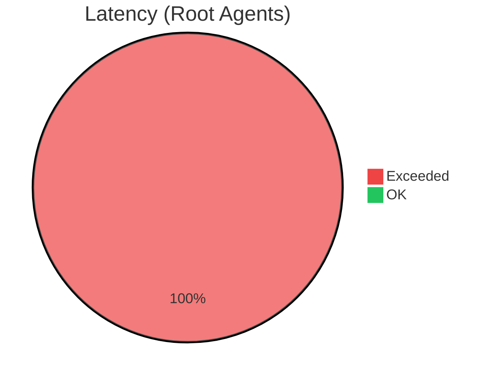
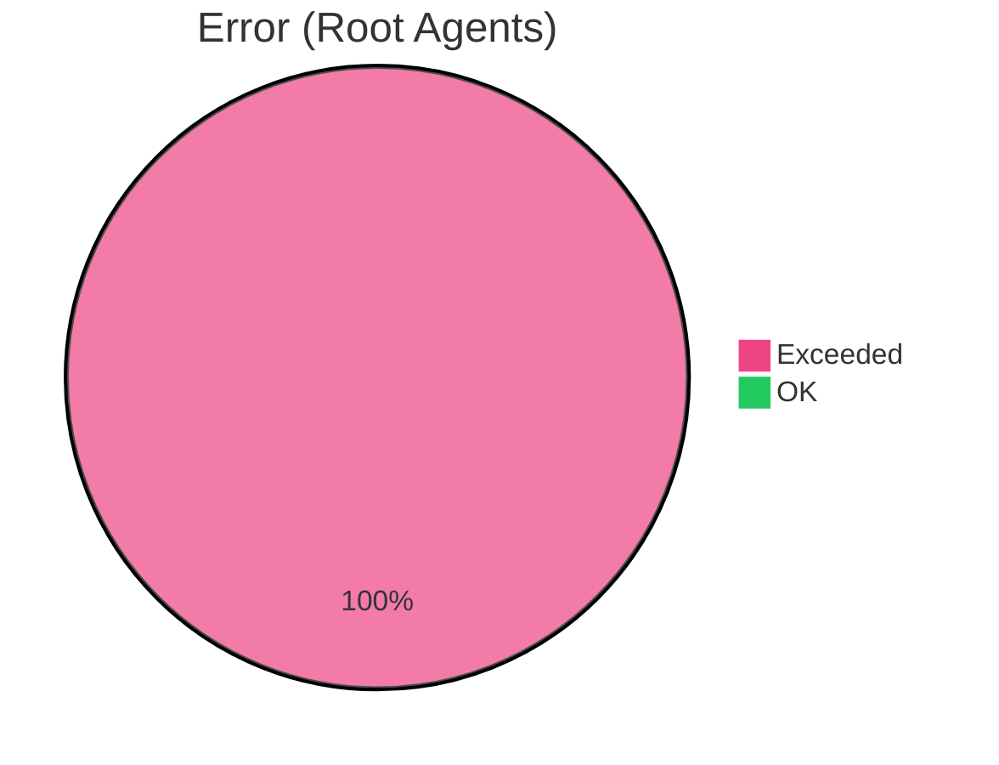

---

### Agent level

This section details the performance of internal delegate agents called by the root agent.

**KPI Compliance Per Agent**

| Name | Requests | % | Mean (s) | P95.5 (s) | Target (s) | Status | Err % | Target (%) | Status | Input Tok (Avg/P95) | Output Tok (Avg/P95) | Thought Tok (Avg/P95) | Tokens Consumed (Avg/P95) | Overall |
| :--- | :--- | :--- | :--- | :--- | :--- | :--- | :--- | :--- | :--- | :--- | :--- | :--- | :--- | :--- |
| **bigquery_data_agent** | 54 | 14.1% | 24.812 | 73.714 | 8.0 | 🔴 | 1.85% | 5.0% | 🟢 | 23177 / 105450 | 42 / 101 | 326 / 1272 | 23545 / 105612 | 🔴 |
| **adk_documentation_agent** | 48 | 12.5% | 24.035 | 48.521 | 8.0 | 🔴 | 37.50% | 5.0% | 🔴 | 894 / 1480 | 574 / 1263 | 1231 / 2170 | 3026 / 5366 | 🔴 |
| **ai_observability_agent** | 72 | 18.8% | 23.019 | 47.203 | 8.0 | 🔴 | 26.39% | 5.0% | 🔴 | 358 / 803 | 592 / 1042 | 819 / 1838 | 1717 / 2896 | 🔴 |
| **parallel_db_lookup** | 29 | 7.6% | 21.990 | 37.641 | 8.0 | 🔴 | 3.45% | 5.0% | 🟢 | N/A / N/A | N/A / N/A | N/A / N/A | N/A / N/A | 🔴 |
| **unreliable_tool_agent** | 27 | 7.0% | 17.126 | 93.167 | 8.0 | 🔴 | 25.93% | 5.0% | 🔴 | 2438 / 7131 | 18 / 41 | 233 / 562 | 2650 / 7156 | 🔴 |
| **lookup_worker_3** | 30 | 7.8% | 16.717 | 26.397 | 8.0 | 🔴 | 3.33% | 5.0% | 🟢 | 574 / 1041 | 35 / 54 | 362 / 743 | 951 / 9470 | 🔴 |
| **lookup_worker_1** | 29 | 7.6% | 15.734 | 30.677 | 8.0 | 🔴 | 3.45% | 5.0% | 🟢 | 256 / 693 | 34 / 60 | 234 / 960 | 512 / 1157 | 🔴 |
| **lookup_worker_2** | 29 | 7.6% | 14.685 | 24.341 | 8.0 | 🔴 | 3.45% | 5.0% | 🟢 | 309 / 453 | 32 / 54 | 274 / 642 | 607 / 1017 | 🔴 |
| **google_search_agent** | 39 | 10.2% | 14.211 | 34.549 | 8.0 | 🔴 | 0.00% | 5.0% | 🟢 | 728 / 4143 | 592 / 1317 | 457 / 1646 | 1888 / 5916 | 🔴 |
| **config_test_agent_wrong_candidate_count_config** | 10 | 2.6% | 11.887 | 38.328 | 8.0 | 🔴 | 10.00% | 5.0% | 🔴 | 1602 / 4789 | 352 / 3185 | 1362 / 5625 | 2862 / 9390 | 🔴 |
| **config_test_agent_high_temp** | 9 | 2.3% | 9.225 | 13.593 | 8.0 | 🔴 | 0.00% | 5.0% | 🟢 | 1159 / 1182 | 42 / 82 | 255 / 442 | 1456 / 1620 | 🔴 |
| **config_test_agent_wrong_candidates** | 1 | 0.3% | 5.899 | 5.899 | 8.0 | 🟢 | 0.00% | 5.0% | 🟢 | 1187 / 1257 | 72 / 115 | 600 / 600 | 1560 / 1747 | 🟢 |
| **config_test_agent_wrong_max_output_tokens_count_config** | 10 | 2.6% | N/A | N/A | 8.0 | ❓ | 100.00% | 5.0% | 🔴 | N/A / N/A | N/A / N/A | N/A / N/A | N/A / N/A | 🔴 |
| **config_test_agent_wrong_max_tokens** | 1 | 0.3% | N/A | N/A | 8.0 | ❓ | 100.00% | 5.0% | 🔴 | N/A / N/A | N/A / N/A | N/A / N/A | N/A / N/A | 🔴 |

<br>

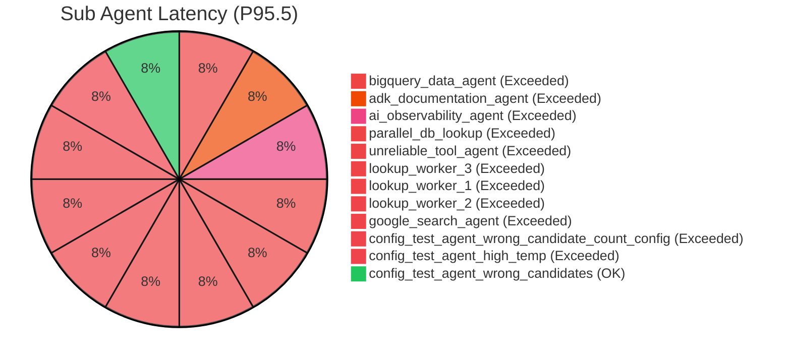
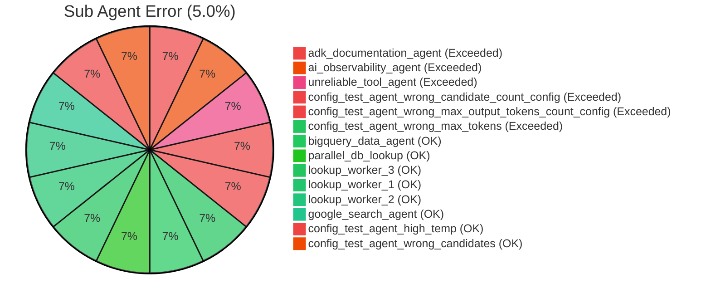

---


### Tool Level

This section breaks down the performance of each individual tool called by agents.

**KPI Compliance Per Tool**

| Name | Requests | % | Mean (s) | P95.5 (s) | Target (s) | Status | Err % | Target (%) | Status | Overall |
| :--- | :--- | :--- | :--- | :--- | :--- | :--- | :--- | :--- | :--- | :--- |
| **flaky_tool_simulation** | 18 | 5.3% | 3.342 | 6.306 | 3.0 | 🔴 | 22.22% | 5.0% | 🔴 | 🔴 |
| **complex_calculation** | 12 | 3.5% | 1.886 | 2.739 | 3.0 | 🟢 | 0.00% | 5.0% | 🟢 | 🟢 |
| **simulated_db_lookup** | 179 | 52.6% | 1.023 | 4.120 | 3.0 | 🔴 | 0.00% | 5.0% | 🟢 | 🔴 |
| **execute_sql** | 59 | 17.4% | 0.892 | 1.511 | 3.0 | 🟢 | 0.00% | 5.0% | 🟢 | 🟢 |
| **list_table_ids** | 31 | 9.1% | 0.360 | 0.547 | 3.0 | 🟢 | 0.00% | 5.0% | 🟢 | 🟢 |
| **list_dataset_ids** | 7 | 2.1% | 0.330 | 0.456 | 3.0 | 🟢 | 0.00% | 5.0% | 🟢 | 🟢 |
| **get_table_info** | 34 | 10.0% | 0.289 | 0.420 | 3.0 | 🟢 | 0.00% | 5.0% | 🟢 | 🟢 |

<br>

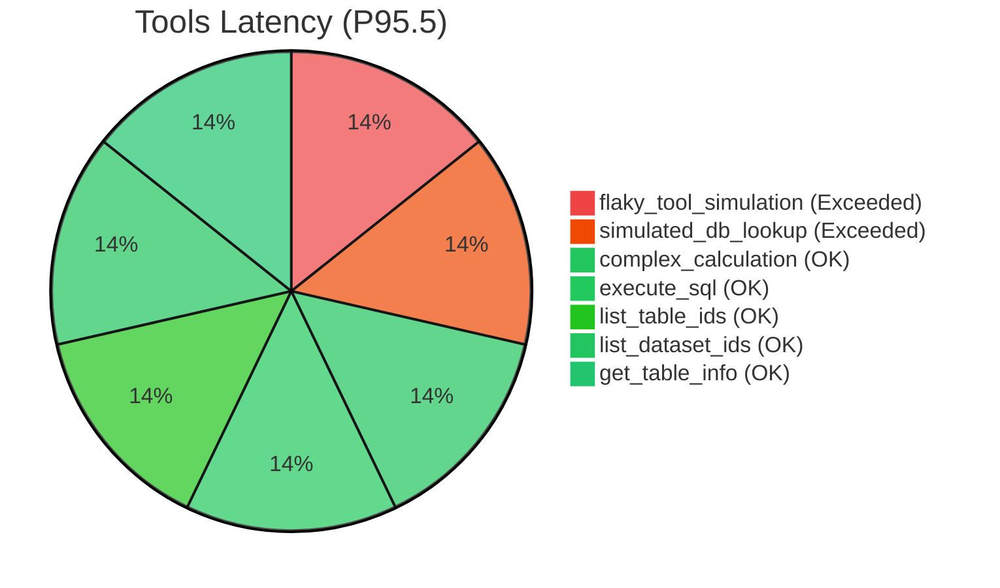
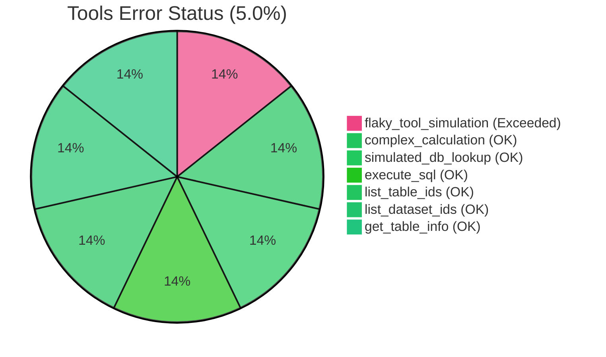

---

### Model Level

This section isolates the performance of the underlying Large Language Models, excluding agent and tool overhead.

**KPI Compliance Per Model**

| Name | Requests | % | Mean (s) | P95.5 (s) | Target (s) | Status | Err % | Target (%) | Status | Input Tok (Avg/P95) | Output Tok (Avg/P95) | Thought Tok (Avg/P95) | Tokens Consumed (Avg/P95) | Overall |
| :--- | :--- | :--- | :--- | :--- | :--- | :--- | :--- | :--- | :--- | :--- | :--- | :--- | :--- | :--- |
| **gemini-3-pro-preview** | 154 | 17.7% | 12.660 | 36.700 | 5.0 | 🔴 | 11.69% | 5.0% | 🔴 | 3994 / 13315 | 184 / 1042 | 632 / 1726 | 4811 / 13707 | 🔴 |
| **gemini-3.1-pro-preview** | 187 | 21.5% | 8.870 | 34.090 | 5.0 | 🔴 | 0.53% | 5.0% | 🟢 | 1806 / 13307 | 105 / 622 | 363 / 1569 | 2269 / 13491 | 🔴 |
| **gemini-2.5-pro** | 264 | 30.4% | 8.153 | 22.076 | 5.0 | 🔴 | 6.82% | 5.0% | 🔴 | 4673 / 14945 | 86 / 578 | 320 / 850 | 5130 / 15571 | 🔴 |
| **gemini-2.5-flash** | 264 | 30.4% | 3.697 | 11.938 | 5.0 | 🔴 | 4.55% | 5.0% | 🟢 | 11706 / 105211 | 82 / 440 | 228 / 633 | 12038 / 105325 | 🔴 |

<br>

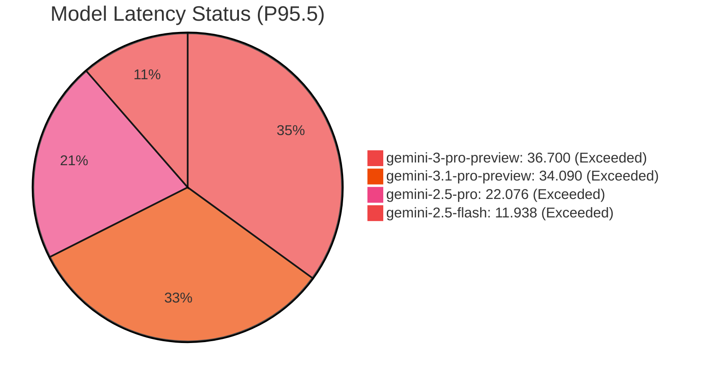
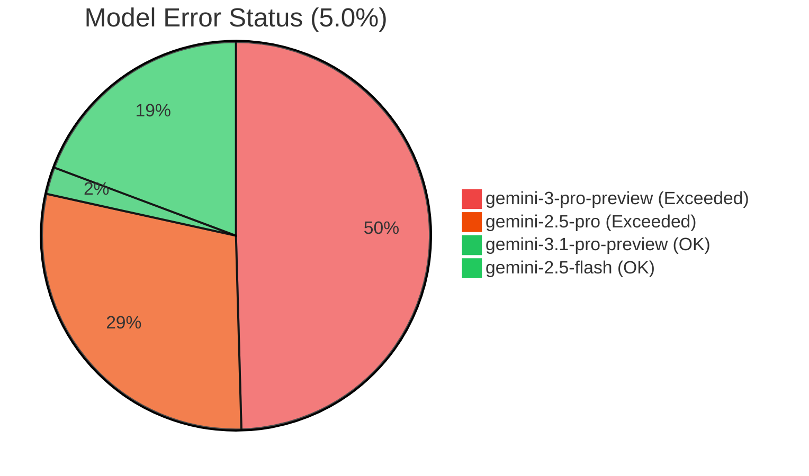

---

## Agent Composition

### Model Traffic
This matrix compares how specific agents perform when running on different models, highlighting potential optimizations. The values in each cell represent `P95.5 Latency (Error %)`.

| Agent Name | gemini-2.5-flash | gemini-2.5-pro | gemini-3.1-pro-preview | gemini-3-pro-preview |
| :--- | :--- | :--- | :--- | :--- |
| **adk_documentation_agent** | 21.558s (16.67%) 🔴 | 7.458s (88.89%) 🔴 | 38.374s (0.00%) 🔴 | 51.512s (0.00%) 🔴 |
| **ai_observability_agent** | 5.862s (0.00%) 🟢 | 46.519s (7.14%) 🔴 | 47.203s (0.00%) 🔴 | 51.174s (50.00%) 🔴 |
| **bigquery_data_agent** | 35.720s (9.68%) 🔴 | 73.714s (0.00%) 🔴 | 84.880s (0.00%) 🔴 | 120.422s (0.00%) 🔴 |
| **config_test_agent_high_temp** | N/A | N/A | 13.593s (0.00%) 🔴 | N/A |
| **config_test_agent_wrong_candidate_count_config** | 7.004s (0.00%) 🟢 | 38.328s (0.00%) 🔴 | N/A | 24.945s (50.00%) 🔴 |
| **config_test_agent_wrong_candidates** | 5.899s (0.00%) 🟢 | N/A | N/A | N/A |
| **config_test_agent_wrong_max_output_tokens_count_config** | N/A (100.00%) 🔴 | N/A | N/A (100.00%) 🔴 | N/A |
| **config_test_agent_wrong_max_tokens** | N/A (100.00%) 🔴 | N/A | N/A | N/A |
| **google_search_agent** | 16.471s (0.00%) 🔴 | 32.579s (0.00%) 🔴 | 37.116s (0.00%) 🔴 | 21.610s (0.00%) 🔴 |
| **lookup_worker_1** | 12.924s (0.00%) 🔴 | 37.640s (0.00%) 🔴 | 30.677s (0.00%) 🔴 | N/A (300.00%) 🔴 |
| **lookup_worker_2** | 29.304s (0.00%) 🔴 | 24.341s (0.00%) 🔴 | 18.785s (0.00%) 🔴 | N/A (100.00%) 🔴 |
| **lookup_worker_3** | 12.050s (0.00%) 🔴 | 116.662s (0.00%) 🔴 | 16.358s (0.00%) 🔴 | N/A (200.00%) 🔴 |
| **unreliable_tool_agent** | 13.268s (12.50%) 🔴 | 93.167s (31.58%) 🔴 | N/A | N/A |

### Model Performance
per agent - to add table
### Token Statistics
per agent - to add table

---
## Model Composition

### Distribution
to add table

### Model Performance

| Metric | gemini-2.5-flash | gemini-2.5-pro | gemini-3.1-pro-preview | gemini-3-pro-preview |
| :--- | :--- | :--- | :--- | :--- |
| **Total Requests** | 264 | 264 | 187 | 154 |
| **Date Range** | 2026-02-19 to 2026-02-26 | 2026-02-19 to 2026-02-26 | 2026-02-19 to 2026-02-26 | 2026-02-19 to 2026-02-26 |
| **Mean Latency (ms)** | 3644.432 | 8065.402 | 8827.519 | 11971.812 |
| **Std Deviation (ms)** | 3339.020 | 14344.187 | 8882.204 | 10752.688 |
| **Median Latency (ms)** | 2499.0 | 4943.0 | 5714.0 | 7250.0 |
| **P95 Latency (ms)** | 11200.0 | 21399.0 | 33095.0 | 36625.0 |
| **P99 Latency (ms)** | 20440.0 | 89067.0 | 40647.0 | 51172.0 |
| **Max Latency (ms)** | 27263.0 | 172517.0 | 47201.0 | 51509.0 |
| **Outliers 2 STD** | 5.3% | 1.9% | 9.6% | 7.8% |
| **Outliers 3 STD** | 2.3% | 1.5% | 2.7% | 2.6% |

---

### Token Statistics

| Metric | gemini-2.5-flash | gemini-2.5-pro | gemini-3.1-pro-preview | gemini-3-pro-preview |
| :--- | :--- | :--- | :--- | :--- |
| **Mean Output Tokens** | 82 | 86 | 105 | 184 |
| **Median Output Tokens** | 25 | 14 | 48 | 24 |
| **Min Output Tokens** | 12 | 6 | 10 | 17 |
| **Max Output Tokens** | 1425 | 3185 | 936 | 1280 |
| **Latency vs Output Corr.** | 0.645 | 0.299 | 0.924 | 0.894 |
| **Latency vs Output+Thinking Corr.** | 0.911 | 0.472 | 0.959 | 0.851 |
| **Correlation Strength** | Strong | Weak | Very Strong | Strong |

---

### Request Distribution

**gemini-2.5-flash**

| Category | Count | Percentage |
| :--- | :--- | :--- |
| Very Fast (< 1s) | 2 | 0.8% |
| Fast (1-2s) | 65 | 24.6% |
| Medium (2-3s) | 97 | 36.7% |
| Slow (3-5s) | 61 | 23.1% |
| Very Slow (5-8s) | 20 | 7.6% |
| Outliers (8s+) | 19 | 7.2% |

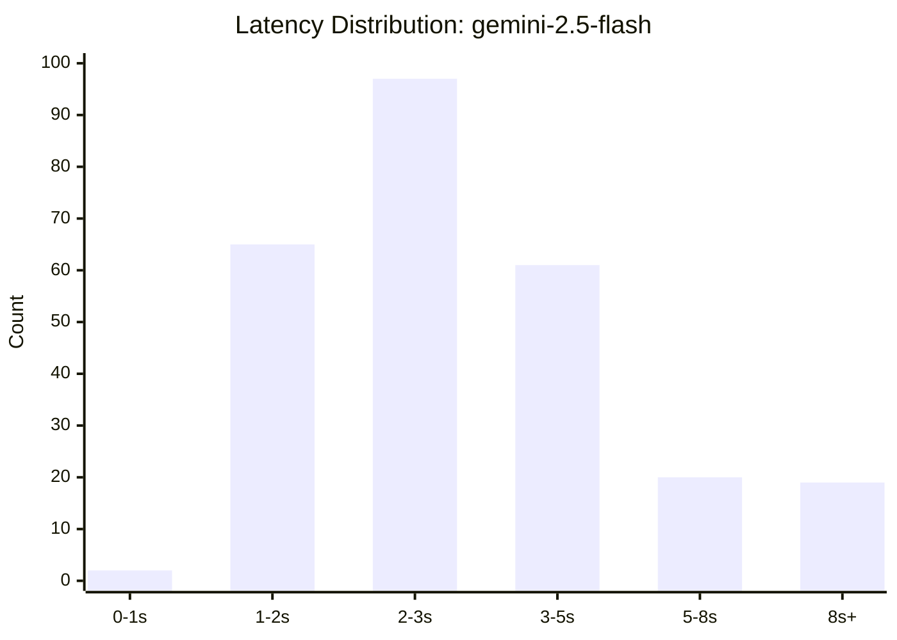

**gemini-2.5-pro**

| Category | Count | Percentage |
| :--- | :--- | :--- |
| Very Fast (< 1s) | 0 | 0.0% |
| Fast (1-2s) | 0 | 0.0% |
| Medium (2-3s) | 47 | 17.8% |
| Slow (3-5s) | 86 | 32.6% |
| Very Slow (5-8s) | 77 | 29.2% |
| Outliers (8s+) | 54 | 20.5% |

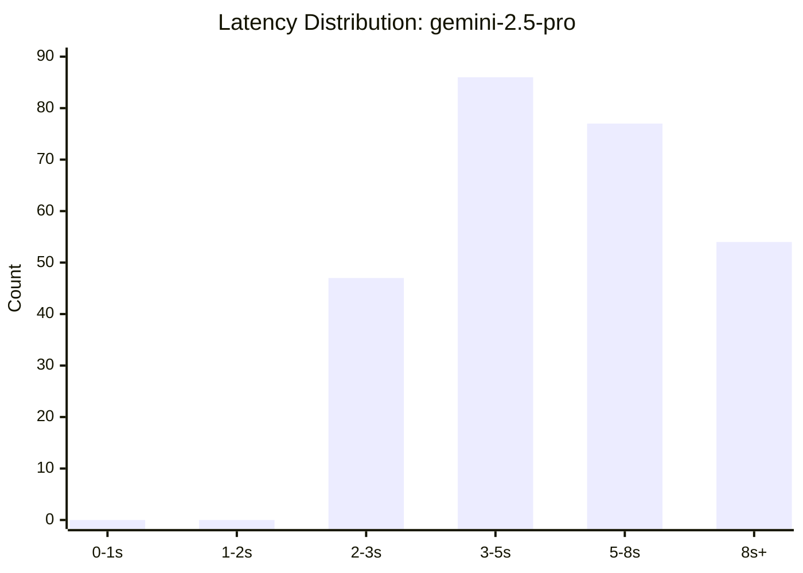

**gemini-3.1-pro-preview**

| Category | Count | Percentage |
| :--- | :--- | :--- |
| Very Fast (< 1s) | 1 | 0.5% |
| Fast (1-2s) | 0 | 0.0% |
| Medium (2-3s) | 3 | 1.6% |
| Slow (3-5s) | 60 | 32.1% |
| Very Slow (5-8s) | 84 | 44.9% |
| Outliers (8s+) | 39 | 20.9% |

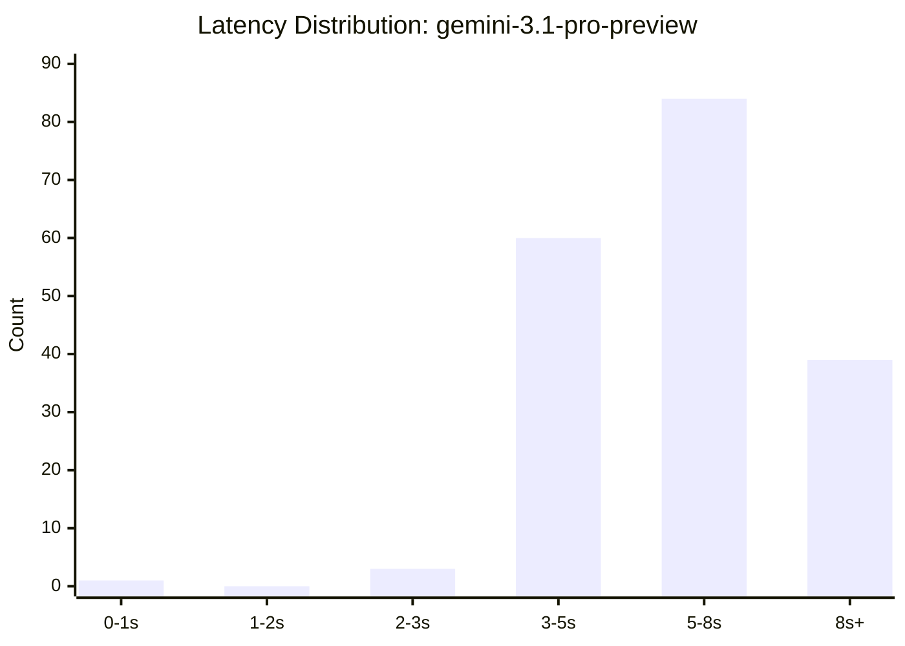

**gemini-3-pro-preview**

| Category | Count | Percentage |
| :--- | :--- | :--- |
| Very Fast (< 1s) | 0 | 0.0% |
| Fast (1-2s) | 1 | 0.6% |
| Medium (2-3s) | 1 | 0.6% |
| Slow (3-5s) | 28 | 18.2% |
| Very Slow (5-8s) | 52 | 33.8% |
| Outliers (8s+) | 72 | 46.8% |

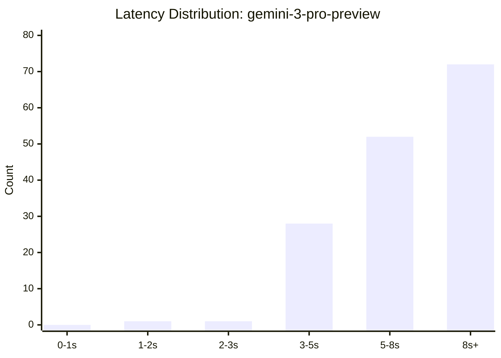


---
## System Bottlenecks & Impact

### Top Bottlenecks

| Rank | Timestamp | Type | Latency (s) | Name | Details (Trunk) | Session ID | Trace ID | Span ID |
| :--- | :--- | :--- | :--- | :--- | :--- | :--- | :--- | :--- |
| 1 | 2026-02-24T17:48:56.790332 | OK | 176.677 | **knowledge_qa_supervisor** | [LARGE PAYLOAD: 1325 chars. Use batch_analyze_root_cause(span_ids='...') to analyze full content instead of fetching it here.] | `0211bbc5-c4e0-4f44-9c32-7515b43ae0b0` | [`844d33bab4c069bf005ece6b9c112f12`](https://console.cloud.google.com/traces/explorer;traceId=844d33bab4c069bf005ece6b9c112f12?project=agent-operations-ek-01) | [`4b0c64e78f42a161`](https://console.cloud.google.com/traces/explorer;traceId=844d33bab4c069bf005ece6b9c112f12;spanId=4b0c64e78f42a161?project=agent-operations-ek-01) |
| 2 | 2026-02-24T17:49:00.938528 | OK | 172.527 | **ai_observability_agent** | "You are an expert assistant specializing in AI Observability. Use the Vertex AI Search datastore at projects/agent-operations-ek-01/locations/global/collections/default_collection/dataStores/adk-web-docs via the 'search_web_data_tool' to extract in... | `0211bbc5-c4e0-4f44-9c32-7515b43ae0b0` | [`844d33bab4c069bf005ece6b9c112f12`](https://console.cloud.google.com/traces/explorer;traceId=844d33bab4c069bf005ece6b9c112f12?project=agent-operations-ek-01) | [`2595d3f89c40d5a6`](https://console.cloud.google.com/traces/explorer;traceId=844d33bab4c069bf005ece6b9c112f12;spanId=2595d3f89c40d5a6?project=agent-operations-ek-01) |
| 3 | 2026-02-24T08:15:52.301591 | OK | 127.054 | **knowledge_qa_supervisor** | [LARGE PAYLOAD: 1325 chars. Use batch_analyze_root_cause(span_ids='...') to analyze full content instead of fetching it here.] | `5be5fd3f-f0fe-4533-8348-956e96f6a0bf` | [`c9f325d3ea9bddccb75a164ffc5fd14a`](https://console.cloud.google.com/traces/explorer;traceId=c9f325d3ea9bddccb75a164ffc5fd14a?project=agent-operations-ek-01) | [`2cc2b504bd3c8107`](https://console.cloud.google.com/traces/explorer;traceId=c9f325d3ea9bddccb75a164ffc5fd14a;spanId=2cc2b504bd3c8107?project=agent-operations-ek-01) |
| 4 | 2026-02-24T17:46:53.873690 | OK | 122.413 | **knowledge_qa_supervisor** | [LARGE PAYLOAD: 1325 chars. Use batch_analyze_root_cause(span_ids='...') to analyze full content instead of fetching it here.] | `0211bbc5-c4e0-4f44-9c32-7515b43ae0b0` | [`7ea524f3af9eb39fb531333ceb19b7cd`](https://console.cloud.google.com/traces/explorer;traceId=7ea524f3af9eb39fb531333ceb19b7cd?project=agent-operations-ek-01) | [`2d0d495fe83d1eee`](https://console.cloud.google.com/traces/explorer;traceId=7ea524f3af9eb39fb531333ceb19b7cd;spanId=2d0d495fe83d1eee?project=agent-operations-ek-01) |
| 5 | 2026-02-24T08:15:58.933732 | OK | 120.422 | **bigquery_data_agent** | "You are a data analyst. Use the BigQuery tools to answer questions about data in `agent-operations-ek-01.logging`. The main table for events is `agent_events_demo`. Use `list_tables` if needed." | `5be5fd3f-f0fe-4533-8348-956e96f6a0bf` | [`c9f325d3ea9bddccb75a164ffc5fd14a`](https://console.cloud.google.com/traces/explorer;traceId=c9f325d3ea9bddccb75a164ffc5fd14a?project=agent-operations-ek-01) | [`edf19dd3a8b01b56`](https://console.cloud.google.com/traces/explorer;traceId=c9f325d3ea9bddccb75a164ffc5fd14a;spanId=edf19dd3a8b01b56?project=agent-operations-ek-01) |
| 6 | 2026-02-24T17:46:59.588240 | OK | 116.699 | **parallel_db_lookup** | "" | `0211bbc5-c4e0-4f44-9c32-7515b43ae0b0` | [`7ea524f3af9eb39fb531333ceb19b7cd`](https://console.cloud.google.com/traces/explorer;traceId=7ea524f3af9eb39fb531333ceb19b7cd?project=agent-operations-ek-01) | [`5c7f5ea5b2b723ec`](https://console.cloud.google.com/traces/explorer;traceId=7ea524f3af9eb39fb531333ceb19b7cd;spanId=5c7f5ea5b2b723ec?project=agent-operations-ek-01) |
| 7 | 2026-02-24T17:46:59.624551 | OK | 116.662 | **lookup_worker_3** | "You will be given an item ID. Use the simulated_db_lookup tool to fetch the data for this single ID." | `0211bbc5-c4e0-4f44-9c32-7515b43ae0b0` | [`7ea524f3af9eb39fb531333ceb19b7cd`](https://console.cloud.google.com/traces/explorer;traceId=7ea524f3af9eb39fb531333ceb19b7cd?project=agent-operations-ek-01) | [`a69e17feeac07e2a`](https://console.cloud.google.com/traces/explorer;traceId=7ea524f3af9eb39fb531333ceb19b7cd;spanId=a69e17feeac07e2a?project=agent-operations-ek-01) |
| 8 | 2026-02-24T18:11:33.495079 | OK | 105.970 | **knowledge_qa_supervisor** | [LARGE PAYLOAD: 1325 chars. Use batch_analyze_root_cause(span_ids='...') to analyze full content instead of fetching it here.] | `32bada90-68fc-41b8-bf26-25dda1f25587` | [`da2332ca93b91bac6cf7afc54a31c848`](https://console.cloud.google.com/traces/explorer;traceId=da2332ca93b91bac6cf7afc54a31c848?project=agent-operations-ek-01) | [`74048ce76c3cdc47`](https://console.cloud.google.com/traces/explorer;traceId=da2332ca93b91bac6cf7afc54a31c848;spanId=74048ce76c3cdc47?project=agent-operations-ek-01) |
| 9 | 2026-02-24T18:17:51.736758 | OK | 96.284 | **knowledge_qa_supervisor** | [LARGE PAYLOAD: 1325 chars. Use batch_analyze_root_cause(span_ids='...') to analyze full content instead of fetching it here.] | `a90aa3a5-4cda-4496-bae5-568b438ed53a` | [`2cf2baefdda0e144915410461a4feaba`](https://console.cloud.google.com/traces/explorer;traceId=2cf2baefdda0e144915410461a4feaba?project=agent-operations-ek-01) | [`e651f8e7c59eec5e`](https://console.cloud.google.com/traces/explorer;traceId=2cf2baefdda0e144915410461a4feaba;spanId=e651f8e7c59eec5e?project=agent-operations-ek-01) |
| 10 | 2026-02-24T18:17:54.852912 | OK | 93.167 | **unreliable_tool_agent** | "Use the flaky_tool_simulation tool to perform the action. Be prepared for potential delays or errors. If it fails, report the failure." | `a90aa3a5-4cda-4496-bae5-568b438ed53a` | [`2cf2baefdda0e144915410461a4feaba`](https://console.cloud.google.com/traces/explorer;traceId=2cf2baefdda0e144915410461a4feaba?project=agent-operations-ek-01) | [`70603558484a72b7`](https://console.cloud.google.com/traces/explorer;traceId=2cf2baefdda0e144915410461a4feaba;spanId=70603558484a72b7?project=agent-operations-ek-01) |
| 11 | 2026-02-24T08:23:20.481702 | OK | 90.910 | **knowledge_qa_supervisor** | [LARGE PAYLOAD: 1325 chars. Use batch_analyze_root_cause(span_ids='...') to analyze full content instead of fetching it here.] | `aa7bc8e2-0cc9-4808-a0aa-7356f25c1871` | [`ea4605f17402cd44110a290a053cb75d`](https://console.cloud.google.com/traces/explorer;traceId=ea4605f17402cd44110a290a053cb75d?project=agent-operations-ek-01) | [`58fd144e374b1de5`](https://console.cloud.google.com/traces/explorer;traceId=ea4605f17402cd44110a290a053cb75d;spanId=58fd144e374b1de5?project=agent-operations-ek-01) |
| 12 | 2026-02-24T08:23:26.510628 | OK | 84.880 | **bigquery_data_agent** | "You are a data analyst. Use the BigQuery tools to answer questions about data in `agent-operations-ek-01.logging`. The main table for events is `agent_events_demo`. Use `list_tables` if needed." | `aa7bc8e2-0cc9-4808-a0aa-7356f25c1871` | [`ea4605f17402cd44110a290a053cb75d`](https://console.cloud.google.com/traces/explorer;traceId=ea4605f17402cd44110a290a053cb75d?project=agent-operations-ek-01) | [`b05c5447cbb2b95c`](https://console.cloud.google.com/traces/explorer;traceId=ea4605f17402cd44110a290a053cb75d;spanId=b05c5447cbb2b95c?project=agent-operations-ek-01) |
| 13 | 2026-02-24T08:29:22.408187 | OK | 80.533 | **knowledge_qa_supervisor** | [LARGE PAYLOAD: 1325 chars. Use batch_analyze_root_cause(span_ids='...') to analyze full content instead of fetching it here.] | `9566a187-5d9b-4ce6-a3fd-b09fdfe02f6f` | [`76c8ce5ee7f8efc58bfa9e2c1bd67f70`](https://console.cloud.google.com/traces/explorer;traceId=76c8ce5ee7f8efc58bfa9e2c1bd67f70?project=agent-operations-ek-01) | [`57ea1f87a6951bda`](https://console.cloud.google.com/traces/explorer;traceId=76c8ce5ee7f8efc58bfa9e2c1bd67f70;spanId=57ea1f87a6951bda?project=agent-operations-ek-01) |
| 14 | 2026-02-24T18:10:18.936624 | OK | 78.925 | **knowledge_qa_supervisor** | [LARGE PAYLOAD: 1325 chars. Use batch_analyze_root_cause(span_ids='...') to analyze full content instead of fetching it here.] | `bd167081-f066-43b7-9c72-c85fc71fec8d` | [`6b2e473631059daf2e6e9854cb5ec074`](https://console.cloud.google.com/traces/explorer;traceId=6b2e473631059daf2e6e9854cb5ec074?project=agent-operations-ek-01) | [`e461e4a417597aa0`](https://console.cloud.google.com/traces/explorer;traceId=6b2e473631059daf2e6e9854cb5ec074;spanId=e461e4a417597aa0?project=agent-operations-ek-01) |
| 15 | 2026-02-24T08:29:29.226135 | OK | 73.714 | **bigquery_data_agent** | "You are a data analyst. Use the BigQuery tools to answer questions about data in `agent-operations-ek-01.logging`. The main table for events is `agent_events_demo`. Use `list_tables` if needed." | `9566a187-5d9b-4ce6-a3fd-b09fdfe02f6f` | [`76c8ce5ee7f8efc58bfa9e2c1bd67f70`](https://console.cloud.google.com/traces/explorer;traceId=76c8ce5ee7f8efc58bfa9e2c1bd67f70?project=agent-operations-ek-01) | [`b72d47d5c602bd9a`](https://console.cloud.google.com/traces/explorer;traceId=76c8ce5ee7f8efc58bfa9e2c1bd67f70;spanId=b72d47d5c602bd9a?project=agent-operations-ek-01) |
| 16 | 2026-02-24T18:10:25.915215 | OK | 71.947 | **bigquery_data_agent** | "You are a data analyst. Use the BigQuery tools to answer questions about data in `agent-operations-ek-01.logging`. The main table for events is `agent_events_demo`. Use `list_tables` if needed." | `bd167081-f066-43b7-9c72-c85fc71fec8d` | [`6b2e473631059daf2e6e9854cb5ec074`](https://console.cloud.google.com/traces/explorer;traceId=6b2e473631059daf2e6e9854cb5ec074?project=agent-operations-ek-01) | [`2a116d1458fe703d`](https://console.cloud.google.com/traces/explorer;traceId=6b2e473631059daf2e6e9854cb5ec074;spanId=2a116d1458fe703d?project=agent-operations-ek-01) |
| 17 | 2026-02-26T05:42:17.708590 | OK | 58.198 | **knowledge_qa_supervisor** | [LARGE PAYLOAD: 1305 chars. Use batch_analyze_root_cause(span_ids='...') to analyze full content instead of fetching it here.] | `d05b4c21-3054-4477-994b-614d7ca0604a` | [`e3afc20dae04d668aa921d304d5fa791`](https://console.cloud.google.com/traces/explorer;traceId=e3afc20dae04d668aa921d304d5fa791?project=agent-operations-ek-01) | [`3d9dd565cdc37e0e`](https://console.cloud.google.com/traces/explorer;traceId=e3afc20dae04d668aa921d304d5fa791;spanId=3d9dd565cdc37e0e?project=agent-operations-ek-01) |
| 18 | 2026-02-24T18:29:11.053894 | OK | 57.130 | **unreliable_tool_agent** | "Use the flaky_tool_simulation tool to perform the action. Be prepared for potential delays or errors. If it fails, report the failure." | `1a658f8d-8443-4070-9688-4197b27ed4e5` | [`6b4a587717dbf843e57f310c546de93b`](https://console.cloud.google.com/traces/explorer;traceId=6b4a587717dbf843e57f310c546de93b?project=agent-operations-ek-01) | [`89ea87953ae5b297`](https://console.cloud.google.com/traces/explorer;traceId=6b4a587717dbf843e57f310c546de93b;spanId=89ea87953ae5b297?project=agent-operations-ek-01) |
| 19 | 2026-02-24T17:52:55.929831 | OK | 56.445 | **knowledge_qa_supervisor** | [LARGE PAYLOAD: 1325 chars. Use batch_analyze_root_cause(span_ids='...') to analyze full content instead of fetching it here.] | `513ad65f-4169-4665-898b-02f92d952213` | [`bea1cc8fcc40269e8eb5fd2c851c2321`](https://console.cloud.google.com/traces/explorer;traceId=bea1cc8fcc40269e8eb5fd2c851c2321?project=agent-operations-ek-01) | [`eafd9cac040e08e1`](https://console.cloud.google.com/traces/explorer;traceId=bea1cc8fcc40269e8eb5fd2c851c2321;spanId=eafd9cac040e08e1?project=agent-operations-ek-01) |
| 20 | 2026-02-26T05:43:16.949122 | OK | 53.868 | **knowledge_qa_supervisor** | [LARGE PAYLOAD: 1305 chars. Use batch_analyze_root_cause(span_ids='...') to analyze full content instead of fetching it here.] | `d05b4c21-3054-4477-994b-614d7ca0604a` | [`d7617a8228502d10f36be902b0faf27c`](https://console.cloud.google.com/traces/explorer;traceId=d7617a8228502d10f36be902b0faf27c?project=agent-operations-ek-01) | [`f93e7157d86abb6e`](https://console.cloud.google.com/traces/explorer;traceId=d7617a8228502d10f36be902b0faf27c;spanId=f93e7157d86abb6e?project=agent-operations-ek-01) |

---

### LLM Bottlenecks 

| Rank | Timestamp | LLM (s) | TTFT (s) | Model | LLM Status | Input | Output | Thought | Total Tokens | Impact % | Agent | Agent (s) | Agent Status | Root Agent | E2E (s) | Root Status | User Message | Session ID | Trace ID | Span ID |
| :--- | :--- | :--- | :--- | :--- | :--- | :--- | :--- | :--- | :--- | :--- | :--- | :--- | :--- | :--- | :--- | :--- | :--- | :--- | :--- | :--- |
| 1 | 2026-02-24T17:49:00.941242 | 172.517 | 172.517 | **gemini-2.5-pro** | 🟢 | 803 | 0 | 257 | 1438 | 97.65% | **ai_observability_agent** | 172.527 | 🟢 | **knowledge_qa_supervisor** | 176.677 | 🟢 | Explain the benefits of AI agent tracing. | `0211bbc5-c4e0-4f44-9c32-7515b43ae0b0` | [`844d33bab4c069bf005ece6b9c112f12`](https://console.cloud.google.com/traces/explorer;traceId=844d33bab4c069bf005ece6b9c112f12?project=agent-operations-ek-01) | [`5f1efe0671a78fb7`](https://console.cloud.google.com/traces/explorer;traceId=844d33bab4c069bf005ece6b9c112f12;spanId=5f1efe0671a78fb7?project=agent-operations-ek-01) |
| 2 | 2026-02-24T17:46:59.625342 | 98.609 | 98.609 | **gemini-2.5-pro** | 🟢 | 140 | 14 | 9316 | 9470 | 80.55% | **lookup_worker_3** | 116.662 | 🟢 | **knowledge_qa_supervisor** | 122.414 | 🟢 | Get item_1, large_record_F. | `0211bbc5-c4e0-4f44-9c32-7515b43ae0b0` | [`7ea524f3af9eb39fb531333ceb19b7cd`](https://console.cloud.google.com/traces/explorer;traceId=7ea524f3af9eb39fb531333ceb19b7cd?project=agent-operations-ek-01) | [`b359b5b4a187f790`](https://console.cloud.google.com/traces/explorer;traceId=7ea524f3af9eb39fb531333ceb19b7cd;spanId=b359b5b4a187f790?project=agent-operations-ek-01) |
| 3 | 2026-02-24T18:17:54.853779 | 89.067 | 89.067 | **gemini-2.5-pro** | 🟢 | 1194 | 11 | 128 | 1333 | 92.50% | **unreliable_tool_agent** | 93.167 | 🟢 | **knowledge_qa_supervisor** | 96.284 | 🟢 | Simulate a flaky action for 'test case 1'. | `a90aa3a5-4cda-4496-bae5-568b438ed53a` | [`2cf2baefdda0e144915410461a4feaba`](https://console.cloud.google.com/traces/explorer;traceId=2cf2baefdda0e144915410461a4feaba?project=agent-operations-ek-01) | [`4d9f939b30b330d8`](https://console.cloud.google.com/traces/explorer;traceId=2cf2baefdda0e144915410461a4feaba;spanId=4d9f939b30b330d8?project=agent-operations-ek-01) |
| 4 | 2026-02-24T18:11:33.496235 | 68.323 | 68.323 | **gemini-2.5-pro** | 🟢 | 1401 | 13 | 460 | 1874 | 64.47% | **knowledge_qa_supervisor** | 105.970 | 🟢 | **knowledge_qa_supervisor** | 105.971 | 🟢 | Get item_1, large_record_F. | `32bada90-68fc-41b8-bf26-25dda1f25587` | [`da2332ca93b91bac6cf7afc54a31c848`](https://console.cloud.google.com/traces/explorer;traceId=da2332ca93b91bac6cf7afc54a31c848?project=agent-operations-ek-01) | [`f44babdce1635b31`](https://console.cloud.google.com/traces/explorer;traceId=da2332ca93b91bac6cf7afc54a31c848;spanId=f44babdce1635b31?project=agent-operations-ek-01) |
| 5 | 2026-02-24T17:53:00.863724 | 51.509 | 51.509 | **gemini-3-pro-preview** | 🟢 | 1250 | 1263 | 1970 | 4483 | 91.25% | **adk_documentation_agent** | 51.512 | 🟢 | **knowledge_qa_supervisor** | 56.446 | 🟢 | Provide examples of ADK configuration files. | `513ad65f-4169-4665-898b-02f92d952213` | [`bea1cc8fcc40269e8eb5fd2c851c2321`](https://console.cloud.google.com/traces/explorer;traceId=bea1cc8fcc40269e8eb5fd2c851c2321?project=agent-operations-ek-01) | [`d68454e584059e1c`](https://console.cloud.google.com/traces/explorer;traceId=bea1cc8fcc40269e8eb5fd2c851c2321;spanId=d68454e584059e1c?project=agent-operations-ek-01) |
| 6 | 2026-02-26T05:42:24.733386 | 51.172 | 51.172 | **gemini-3-pro-preview** | 🟢 | 200 | 1039 | 1298 | 2537 | 87.93% | **ai_observability_agent** | 51.174 | 🟢 | **knowledge_qa_supervisor** | 58.198 | 🟢 | Compare different AI observability platforms. | `d05b4c21-3054-4477-994b-614d7ca0604a` | [`e3afc20dae04d668aa921d304d5fa791`](https://console.cloud.google.com/traces/explorer;traceId=e3afc20dae04d668aa921d304d5fa791?project=agent-operations-ek-01) | [`d5aef86efd991abc`](https://console.cloud.google.com/traces/explorer;traceId=e3afc20dae04d668aa921d304d5fa791;spanId=d5aef86efd991abc?project=agent-operations-ek-01) |
| 7 | 2026-02-26T05:43:22.296808 | 48.520 | 48.520 | **gemini-3-pro-preview** | 🟢 | 1333 | 1190 | 1482 | 4005 | 90.07% | **adk_documentation_agent** | 48.521 | 🟢 | **knowledge_qa_supervisor** | 53.869 | 🟢 | Provide examples of ADK configuration files. | `d05b4c21-3054-4477-994b-614d7ca0604a` | [`d7617a8228502d10f36be902b0faf27c`](https://console.cloud.google.com/traces/explorer;traceId=d7617a8228502d10f36be902b0faf27c?project=agent-operations-ek-01) | [`294605c14b32e75f`](https://console.cloud.google.com/traces/explorer;traceId=d7617a8228502d10f36be902b0faf27c;spanId=294605c14b32e75f?project=agent-operations-ek-01) |
| 8 | 2026-02-26T05:37:36.244188 | 47.201 | 47.201 | **gemini-3.1-pro-preview** | 🟢 | 205 | 607 | 1542 | 2354 | 88.51% | **ai_observability_agent** | 47.203 | 🟢 | **knowledge_qa_supervisor** | 53.330 | 🟢 | How does Langfuse handle tracing data models in observability? | `4f605a20-c24a-48c1-8f33-e986d85725e4` | [`68f38ba40f1d5595628ca601420bdf97`](https://console.cloud.google.com/traces/explorer;traceId=68f38ba40f1d5595628ca601420bdf97?project=agent-operations-ek-01) | [`51e0b2f2db5e1f21`](https://console.cloud.google.com/traces/explorer;traceId=68f38ba40f1d5595628ca601420bdf97;spanId=51e0b2f2db5e1f21?project=agent-operations-ek-01) |
| 9 | 2026-02-24T18:29:21.665166 | 46.516 | 46.516 | **gemini-2.5-pro** | 🟢 | 397 | 0 | 814 | 2804 | 81.42% | **ai_observability_agent** | 46.519 | 🟢 | **knowledge_qa_supervisor** | 57.130 | 🟢 | Describe event logging in AI agents. | `1a658f8d-8443-4070-9688-4197b27ed4e5` | [`6b4a587717dbf843e57f310c546de93b`](https://console.cloud.google.com/traces/explorer;traceId=6b4a587717dbf843e57f310c546de93b?project=agent-operations-ek-01) | [`df4266e984fc040f`](https://console.cloud.google.com/traces/explorer;traceId=6b4a587717dbf843e57f310c546de93b;spanId=df4266e984fc040f?project=agent-operations-ek-01) |
| 10 | 2026-02-24T18:14:08.206209 | 46.221 | 46.221 | **gemini-3-pro-preview** | 🟢 | 1264 | 1280 | 2170 | 4714 | 91.05% | **adk_documentation_agent** | 46.225 | 🟢 | **knowledge_qa_supervisor** | 50.762 | 🟢 | Provide examples of ADK configuration files. | `141515c1-6f23-4127-bd6e-90549a4843e5` | [`62cc8e0393b3e65c8f661baf26fef75b`](https://console.cloud.google.com/traces/explorer;traceId=62cc8e0393b3e65c8f661baf26fef75b?project=agent-operations-ek-01) | [`43c0c303002bb715`](https://console.cloud.google.com/traces/explorer;traceId=62cc8e0393b3e65c8f661baf26fef75b;spanId=43c0c303002bb715?project=agent-operations-ek-01) |
| 11 | 2026-02-24T17:43:04.133268 | 40.647 | 40.647 | **gemini-3.1-pro-preview** | 🟢 | 205 | 648 | 1881 | 2734 | 90.42% | **ai_observability_agent** | 40.651 | 🟢 | **knowledge_qa_supervisor** | 44.954 | 🟢 | How does Langfuse handle tracing data models in observability? | `2696a21a-c815-4559-82c0-7c755a5c4e46` | [`e6798f8dcc3f58c33b051ccefee5a0c3`](https://console.cloud.google.com/traces/explorer;traceId=e6798f8dcc3f58c33b051ccefee5a0c3?project=agent-operations-ek-01) | [`6b4b302de8103989`](https://console.cloud.google.com/traces/explorer;traceId=e6798f8dcc3f58c33b051ccefee5a0c3;spanId=6b4b302de8103989?project=agent-operations-ek-01) |
| 12 | 2026-02-24T18:10:58.058187 | 39.803 | 39.803 | **gemini-3-pro-preview** | 🟢 | 12644 | 161 | 3890 | 16695 | 50.43% | **bigquery_data_agent** | 71.947 | 🟢 | **knowledge_qa_supervisor** | 78.926 | 🟢 | If `agent_events_test` shows recent activity, then look up 'new feature releases' on Google. | `bd167081-f066-43b7-9c72-c85fc71fec8d` | [`6b2e473631059daf2e6e9854cb5ec074`](https://console.cloud.google.com/traces/explorer;traceId=6b2e473631059daf2e6e9854cb5ec074?project=agent-operations-ek-01) | [`497ce9c301bebcfe`](https://console.cloud.google.com/traces/explorer;traceId=6b2e473631059daf2e6e9854cb5ec074;spanId=497ce9c301bebcfe?project=agent-operations-ek-01) |
| 13 | 2026-02-24T18:21:41.191098 | 38.372 | 38.372 | **gemini-3.1-pro-preview** | 🟢 | 921 | 511 | 2116 | 3548 | 88.31% | **adk_documentation_agent** | 38.374 | 🟢 | **knowledge_qa_supervisor** | 43.451 | 🟢 | Describe the deployment process for an ADK agent. | `779cd6dc-6342-468c-89d4-4acf7a1f9f89` | [`91c54834d3ccc457ea68765ccb7dc0f5`](https://console.cloud.google.com/traces/explorer;traceId=91c54834d3ccc457ea68765ccb7dc0f5?project=agent-operations-ek-01) | [`f15242b66ab841b3`](https://console.cloud.google.com/traces/explorer;traceId=91c54834d3ccc457ea68765ccb7dc0f5;spanId=f15242b66ab841b3?project=agent-operations-ek-01) |
| 14 | 2026-02-24T18:13:26.028719 | 37.773 | 37.773 | **gemini-3-pro-preview** | 🟢 | 200 | 1186 | 1473 | 2859 | 85.63% | **ai_observability_agent** | 37.774 | 🟢 | **knowledge_qa_supervisor** | 44.114 | 🟢 | Compare different AI observability platforms. | `4ace9a47-8783-425d-a009-9f66b297bb2b` | [`022e3618233878caca3a764ae79031c8`](https://console.cloud.google.com/traces/explorer;traceId=022e3618233878caca3a764ae79031c8?project=agent-operations-ek-01) | [`5402272b7a30024e`](https://console.cloud.google.com/traces/explorer;traceId=022e3618233878caca3a764ae79031c8;spanId=5402272b7a30024e?project=agent-operations-ek-01) |
| 15 | 2026-02-24T08:22:42.916538 | 37.113 | 37.113 | **gemini-3.1-pro-preview** | 🟢 | 115 | 936 | 2117 | 3168 | 88.27% | **google_search_agent** | 37.116 | 🟢 | **knowledge_qa_supervisor** | 42.044 | 🟢 | What are the latest advancements in LLM technology? | `aa7bc8e2-0cc9-4808-a0aa-7356f25c1871` | [`e67aaa86dc92030d44c025288484efb6`](https://console.cloud.google.com/traces/explorer;traceId=e67aaa86dc92030d44c025288484efb6?project=agent-operations-ek-01) | [`086165bd4df7cc96`](https://console.cloud.google.com/traces/explorer;traceId=e67aaa86dc92030d44c025288484efb6;spanId=086165bd4df7cc96?project=agent-operations-ek-01) |
| 16 | 2026-02-24T18:13:25.918595 | 36.700 | 36.700 | **gemini-3-pro-preview** | 🟢 | 200 | 970 | 1726 | 2896 | 85.48% | **ai_observability_agent** | 36.703 | 🟢 | **knowledge_qa_supervisor** | 42.932 | 🟢 | Compare different AI observability platforms. | `141515c1-6f23-4127-bd6e-90549a4843e5` | [`12e0f384c8bf39634b38c57cdbe60412`](https://console.cloud.google.com/traces/explorer;traceId=12e0f384c8bf39634b38c57cdbe60412?project=agent-operations-ek-01) | [`64736053a5f26f7c`](https://console.cloud.google.com/traces/explorer;traceId=12e0f384c8bf39634b38c57cdbe60412;spanId=64736053a5f26f7c?project=agent-operations-ek-01) |
| 17 | 2026-02-24T17:52:18.182291 | 36.625 | 36.625 | **gemini-3-pro-preview** | 🟢 | 200 | 956 | 1507 | 2663 | 83.90% | **ai_observability_agent** | 36.626 | 🟢 | **knowledge_qa_supervisor** | 43.654 | 🟢 | Compare different AI observability platforms. | `513ad65f-4169-4665-898b-02f92d952213` | [`5529493ad0d1f382a641d03bae889c22`](https://console.cloud.google.com/traces/explorer;traceId=5529493ad0d1f382a641d03bae889c22?project=agent-operations-ek-01) | [`800196c0278cec6f`](https://console.cloud.google.com/traces/explorer;traceId=5529493ad0d1f382a641d03bae889c22;spanId=800196c0278cec6f?project=agent-operations-ek-01) |
| 18 | 2026-02-24T08:27:57.025820 | 36.447 | 36.447 | **gemini-3.1-pro-preview** | 🟢 | 1017 | 654 | 2338 | 4009 | 80.58% | **ai_observability_agent** | 36.449 | 🟢 | **knowledge_qa_supervisor** | 45.233 | 🟢 | How does OpenTelemetry relate to AI agent observability? | `fe931660-5993-454d-a5cd-5374e307ff1f` | [`b49625b6d592984c6f58ac1833f4e4d7`](https://console.cloud.google.com/traces/explorer;traceId=b49625b6d592984c6f58ac1833f4e4d7?project=agent-operations-ek-01) | [`9eff7c7e91481ff6`](https://console.cloud.google.com/traces/explorer;traceId=b49625b6d592984c6f58ac1833f4e4d7;spanId=9eff7c7e91481ff6?project=agent-operations-ek-01) |
| 19 | 2026-02-24T18:25:27.774907 | 35.462 | 35.462 | **gemini-3-pro-preview** | 🟢 | 1336 | 1044 | 1425 | 3805 | 87.45% | **adk_documentation_agent** | 35.466 | 🟢 | **knowledge_qa_supervisor** | 40.552 | 🟢 | Provide examples of ADK configuration files. | `fbdf6a5f-adc2-481b-a785-43543df9e6b9` | [`a37648440a4a672fa59caa7cc54579a3`](https://console.cloud.google.com/traces/explorer;traceId=a37648440a4a672fa59caa7cc54579a3?project=agent-operations-ek-01) | [`8641b971e811fec7`](https://console.cloud.google.com/traces/explorer;traceId=a37648440a4a672fa59caa7cc54579a3;spanId=8641b971e811fec7?project=agent-operations-ek-01) |
| 20 | 2026-02-24T08:28:10.289171 | 35.347 | 35.347 | **gemini-3-pro-preview** | 🟢 | 200 | 843 | 1454 | 2497 | N/A | **ai_observability_agent** | 35.350 | 🟢 | **knowledge_qa_supervisor** | 0.000 | ❓ | N/A | `93a02f93-2437-41f3-9cfb-0b2c5642c53c` | [`1a7f22fe687cfba8e6306fd5c5b107a9`](https://console.cloud.google.com/traces/explorer;traceId=1a7f22fe687cfba8e6306fd5c5b107a9?project=agent-operations-ek-01) | [`510baec510dad9d0`](https://console.cloud.google.com/traces/explorer;traceId=1a7f22fe687cfba8e6306fd5c5b107a9;spanId=510baec510dad9d0?project=agent-operations-ek-01) |

---

### Tool Bottlenecks

| Rank | Timestamp | Tool (s) | Tool Name | Tool Status | Tool Args | Impact % | Agent | Agent (s) | Agent Status | Root Agent | E2E (s) | Root Status | User Message | Session ID | Trace ID | Span ID |
| :--- | :--- | :--- | :--- | :--- | :--- | :--- | :--- | :--- | :--- | :--- | :--- | :--- | :--- | :--- | :--- | :--- |
| 1 | 2026-02-24T18:09:24.281613 | 9.416 | **flaky_tool_simulation** | 🔴 | `{"query":"very_slow_topic"}` | 0.00% | **unreliable_tool_agent** | 0.000 | 🔴 | **knowledge_qa_supervisor** | 0.000 | 🔴 | Try the unreliable tool with very_slow_topic input. | `9ec1a54f-52c9-4659-906e-15e7e0380fed` | [`bf46dbf39dc20547ec31b2e3ae73c6be`](https://console.cloud.google.com/traces/explorer;traceId=bf46dbf39dc20547ec31b2e3ae73c6be?project=agent-operations-ek-01) | [`8f579c4071f0b24a`](https://console.cloud.google.com/traces/explorer;traceId=bf46dbf39dc20547ec31b2e3ae73c6be;spanId=8f579c4071f0b24a?project=agent-operations-ek-01) |
| 2 | 2026-02-24T17:44:20.112676 | 6.306 | **flaky_tool_simulation** | 🟢 | `{"query":"very_slow_topic"}` | 41.86% | **unreliable_tool_agent** | 13.268 | 🟢 | **knowledge_qa_supervisor** | 15.064 | 🟢 | Try the unreliable tool with very_slow_topic input. | `6fbf143d-81aa-4463-b1db-57e25e979085` | [`81609a6be7bf2b1f6e170df45a76a266`](https://console.cloud.google.com/traces/explorer;traceId=81609a6be7bf2b1f6e170df45a76a266?project=agent-operations-ek-01) | [`1e738ab3bfbe0c05`](https://console.cloud.google.com/traces/explorer;traceId=81609a6be7bf2b1f6e170df45a76a266;spanId=1e738ab3bfbe0c05?project=agent-operations-ek-01) |
| 3 | 2026-02-24T18:08:47.351911 | 6.222 | **flaky_tool_simulation** | 🟢 | `{"query":"very_slow_topic"}` | 47.57% | **unreliable_tool_agent** | 10.159 | 🟢 | **knowledge_qa_supervisor** | 13.081 | 🟢 | Try the unreliable tool with very_slow_topic input. | `8a2023d6-8b63-4a7a-8855-d6ee7def251f` | [`3b8c10c1fd8f88b341a1d5966c706c07`](https://console.cloud.google.com/traces/explorer;traceId=3b8c10c1fd8f88b341a1d5966c706c07?project=agent-operations-ek-01) | [`dd451a6d489f21a6`](https://console.cloud.google.com/traces/explorer;traceId=3b8c10c1fd8f88b341a1d5966c706c07;spanId=dd451a6d489f21a6?project=agent-operations-ek-01) |
| 4 | 2026-02-24T18:17:57.819530 | 5.975 | **flaky_tool_simulation** | 🔴 | `{"query":"Simulate a flaky action for 'test case 1'"}` | 21.65% | **unreliable_tool_agent** | 0.000 | 🔴 | **knowledge_qa_supervisor** | 27.600 | 🟢 | Describe event logging in AI agents. | `7f22ec4f-15c2-45e3-9f2f-30950f9a82c3` | [`c1a31dc41240d3f36d968c9a340b4e78`](https://console.cloud.google.com/traces/explorer;traceId=c1a31dc41240d3f36d968c9a340b4e78?project=agent-operations-ek-01) | [`df8428b97374a906`](https://console.cloud.google.com/traces/explorer;traceId=c1a31dc41240d3f36d968c9a340b4e78;spanId=df8428b97374a906?project=agent-operations-ek-01) |
| 5 | 2026-02-24T08:24:30.637375 | 5.556 | **flaky_tool_simulation** | 🟢 | `{"query":"very_slow_topic"}` | 50.84% | **unreliable_tool_agent** | 9.356 | 🟢 | **knowledge_qa_supervisor** | 10.928 | 🟢 | Try the unreliable tool with very_slow_topic input. | `de8950e3-886e-468f-97d3-9801c3a42f3a` | [`b0523cb9d38c2a21d9ba795c06f145fa`](https://console.cloud.google.com/traces/explorer;traceId=b0523cb9d38c2a21d9ba795c06f145fa?project=agent-operations-ek-01) | [`0a6914038beba01d`](https://console.cloud.google.com/traces/explorer;traceId=b0523cb9d38c2a21d9ba795c06f145fa;spanId=0a6914038beba01d?project=agent-operations-ek-01) |
| 6 | 2026-02-24T18:21:35.588555 | 5.355 | **flaky_tool_simulation** | 🟢 | `{"query":"very_slow_topic","tool_name":"unreliable_tool"}` | 44.44% | **unreliable_tool_agent** | 9.173 | 🟢 | **knowledge_qa_supervisor** | 12.051 | 🟢 | Try the unreliable tool with very_slow_topic input. | `eeaaf66c-44d7-4bcb-852b-5c3acafee8db` | [`9c951adbf73bf51eaa534725c269b38f`](https://console.cloud.google.com/traces/explorer;traceId=9c951adbf73bf51eaa534725c269b38f?project=agent-operations-ek-01) | [`82633d26626c78c2`](https://console.cloud.google.com/traces/explorer;traceId=9c951adbf73bf51eaa534725c269b38f;spanId=82633d26626c78c2?project=agent-operations-ek-01) |
| 7 | 2026-02-24T18:09:06.355236 | 5.296 | **flaky_tool_simulation** | 🟢 | `{"query":"very_slow_topic"}` | 45.14% | **unreliable_tool_agent** | 9.309 | 🟢 | **knowledge_qa_supervisor** | 11.732 | 🟢 | Try the unreliable tool with very_slow_topic input. | `290e2dcc-81f3-452e-8614-d2a85df4c5b6` | [`4e1706d02c34671e05316e6abfcb325d`](https://console.cloud.google.com/traces/explorer;traceId=4e1706d02c34671e05316e6abfcb325d?project=agent-operations-ek-01) | [`754dfb5e29ba466b`](https://console.cloud.google.com/traces/explorer;traceId=4e1706d02c34671e05316e6abfcb325d;spanId=754dfb5e29ba466b?project=agent-operations-ek-01) |
| 8 | 2026-02-24T18:04:20.054026 | 5.207 | **flaky_tool_simulation** | 🟢 | `{"query":"very_slow_topic"}` | 49.58% | **unreliable_tool_agent** | 8.502 | 🟢 | **knowledge_qa_supervisor** | 10.502 | 🟢 | Try the unreliable tool with very_slow_topic input. | `4f43bbf8-d323-49ba-8068-8b469dc0ea4d` | [`0c812fb522636c7dd70c3dc4c0635a92`](https://console.cloud.google.com/traces/explorer;traceId=0c812fb522636c7dd70c3dc4c0635a92?project=agent-operations-ek-01) | [`13d859b161806684`](https://console.cloud.google.com/traces/explorer;traceId=0c812fb522636c7dd70c3dc4c0635a92;spanId=13d859b161806684?project=agent-operations-ek-01) |
| 9 | 2026-02-26T05:38:58.497110 | 5.067 | **flaky_tool_simulation** | 🟢 | `{"query":"very_slow_topic"}` | 41.18% | **unreliable_tool_agent** | 9.687 | 🟢 | **knowledge_qa_supervisor** | 12.306 | 🟢 | Try the unreliable tool with very_slow_topic input. | `da079bc8-4c26-4a2d-82f0-eaa682d2adae` | [`dfc3cf2b4fccedc4fa7642e896aec8aa`](https://console.cloud.google.com/traces/explorer;traceId=dfc3cf2b4fccedc4fa7642e896aec8aa?project=agent-operations-ek-01) | [`e2affbabd39952b4`](https://console.cloud.google.com/traces/explorer;traceId=dfc3cf2b4fccedc4fa7642e896aec8aa;spanId=e2affbabd39952b4?project=agent-operations-ek-01) |
| 10 | 2026-02-24T08:27:12.601835 | 4.858 | **simulated_db_lookup** | 🟢 | `{"item_id":"large_record_F"}` | 14.53% | **lookup_worker_2** | 16.406 | 🟢 | **knowledge_qa_supervisor** | 33.438 | 🟢 | Get item_1, large_record_F. | `34b60f46-ddb9-40bf-8cc9-f5e51514218e` | [`e20767cf14c8a227ead49fdb9fff2930`](https://console.cloud.google.com/traces/explorer;traceId=e20767cf14c8a227ead49fdb9fff2930?project=agent-operations-ek-01) | [`68e350aa4dc68c6e`](https://console.cloud.google.com/traces/explorer;traceId=e20767cf14c8a227ead49fdb9fff2930;spanId=68e350aa4dc68c6e?project=agent-operations-ek-01) |
| 11 | 2026-02-24T18:12:27.406493 | 4.524 | **simulated_db_lookup** | 🟢 | `{"item_id":"large_record_F"}` | 19.29% | **lookup_worker_3** | 12.064 | 🟢 | **knowledge_qa_supervisor** | 23.455 | 🟢 | Get item_1, large_record_F. | `8f7648b0-57f8-4f0b-9ae5-ed9d3fa11fe5` | [`28c53d3d03c7deaf6b189d8ba9adc5e8`](https://console.cloud.google.com/traces/explorer;traceId=28c53d3d03c7deaf6b189d8ba9adc5e8?project=agent-operations-ek-01) | [`30de0d906e298f5b`](https://console.cloud.google.com/traces/explorer;traceId=28c53d3d03c7deaf6b189d8ba9adc5e8;spanId=30de0d906e298f5b?project=agent-operations-ek-01) |
| 12 | 2026-02-24T18:24:01.977675 | 4.490 | **simulated_db_lookup** | 🟢 | `{"item_id":"large_record_F"}` | 16.11% | **lookup_worker_1** | 15.262 | 🟢 | **knowledge_qa_supervisor** | 27.870 | 🟢 | Get item_1, large_record_F. | `79f2ce96-b581-475e-a870-6815089829c9` | [`5ce83604e35ae44becab96101cad638d`](https://console.cloud.google.com/traces/explorer;traceId=5ce83604e35ae44becab96101cad638d?project=agent-operations-ek-01) | [`ded9f59ee925553c`](https://console.cloud.google.com/traces/explorer;traceId=5ce83604e35ae44becab96101cad638d;spanId=ded9f59ee925553c?project=agent-operations-ek-01) |
| 13 | 2026-02-24T18:06:38.720892 | 4.418 | **simulated_db_lookup** | 🟢 | `{"item_id":"large_record_F"}` | 16.32% | **lookup_worker_1** | 23.245 | 🟢 | **knowledge_qa_supervisor** | 27.069 | 🟢 | Get item_1, large_record_F. | `276b8b7c-4554-43ed-8dc1-99045ca77112` | [`67442c413dc2baad19974fc3278c3f0a`](https://console.cloud.google.com/traces/explorer;traceId=67442c413dc2baad19974fc3278c3f0a?project=agent-operations-ek-01) | [`b0dc9215b3cd2dd7`](https://console.cloud.google.com/traces/explorer;traceId=67442c413dc2baad19974fc3278c3f0a;spanId=b0dc9215b3cd2dd7?project=agent-operations-ek-01) |
| 14 | 2026-02-24T18:12:33.173341 | 4.372 | **simulated_db_lookup** | 🟢 | `{"item_id":"large_record_F"}` | 15.16% | **lookup_worker_3** | 21.785 | 🟢 | **knowledge_qa_supervisor** | 28.834 | 🟢 | Get item_1, large_record_F. | `101f9c7f-e9e8-427f-8785-6b05bfb32f1c` | [`e64b8762421c8b0a79aed26baab5833f`](https://console.cloud.google.com/traces/explorer;traceId=e64b8762421c8b0a79aed26baab5833f?project=agent-operations-ek-01) | [`74937a3684ac2898`](https://console.cloud.google.com/traces/explorer;traceId=e64b8762421c8b0a79aed26baab5833f;spanId=74937a3684ac2898?project=agent-operations-ek-01) |
| 15 | 2026-02-24T18:12:48.220837 | 4.254 | **simulated_db_lookup** | 🟢 | `{"item_id":"large_record_F"}` | 4.01% | **lookup_worker_2** | 13.944 | 🟢 | **knowledge_qa_supervisor** | 105.971 | 🟢 | Get item_1, large_record_F. | `32bada90-68fc-41b8-bf26-25dda1f25587` | [`da2332ca93b91bac6cf7afc54a31c848`](https://console.cloud.google.com/traces/explorer;traceId=da2332ca93b91bac6cf7afc54a31c848?project=agent-operations-ek-01) | [`4836625a2686ead4`](https://console.cloud.google.com/traces/explorer;traceId=da2332ca93b91bac6cf7afc54a31c848;spanId=4836625a2686ead4?project=agent-operations-ek-01) |
| 16 | 2026-02-24T18:12:59.072962 | 4.253 | **simulated_db_lookup** | 🟢 | `{"item_id":"large_record_F"}` | 4.01% | **lookup_worker_3** | 24.407 | 🟢 | **knowledge_qa_supervisor** | 105.971 | 🟢 | Get item_1, large_record_F. | `32bada90-68fc-41b8-bf26-25dda1f25587` | [`da2332ca93b91bac6cf7afc54a31c848`](https://console.cloud.google.com/traces/explorer;traceId=da2332ca93b91bac6cf7afc54a31c848?project=agent-operations-ek-01) | [`0bddc90ef00cab8f`](https://console.cloud.google.com/traces/explorer;traceId=da2332ca93b91bac6cf7afc54a31c848;spanId=0bddc90ef00cab8f?project=agent-operations-ek-01) |
| 17 | 2026-02-24T18:12:35.964362 | 4.220 | **simulated_db_lookup** | 🟢 | `{"item_id":"large_record_F"}` | 17.99% | **lookup_worker_2** | 20.404 | 🟢 | **knowledge_qa_supervisor** | 23.455 | 🟢 | Get item_1, large_record_F. | `8f7648b0-57f8-4f0b-9ae5-ed9d3fa11fe5` | [`28c53d3d03c7deaf6b189d8ba9adc5e8`](https://console.cloud.google.com/traces/explorer;traceId=28c53d3d03c7deaf6b189d8ba9adc5e8?project=agent-operations-ek-01) | [`22493656a3d9ac10`](https://console.cloud.google.com/traces/explorer;traceId=28c53d3d03c7deaf6b189d8ba9adc5e8;spanId=22493656a3d9ac10?project=agent-operations-ek-01) |
| 18 | 2026-02-26T05:41:40.661403 | 4.120 | **simulated_db_lookup** | 🟢 | `{"item_id":"large_record_F"}` | N/A | **lookup_worker_2** | 20.015 | 🟢 | **knowledge_qa_supervisor** | 0.000 | ❓ | N/A | `fb19d75c-5080-49fe-b4d4-ed45448467c7` | [`d0582c5f139b7787d14b13f4be94b331`](https://console.cloud.google.com/traces/explorer;traceId=d0582c5f139b7787d14b13f4be94b331?project=agent-operations-ek-01) | [`79f6c6e31ca90f6c`](https://console.cloud.google.com/traces/explorer;traceId=d0582c5f139b7787d14b13f4be94b331;spanId=79f6c6e31ca90f6c?project=agent-operations-ek-01) |
| 19 | 2026-02-24T08:27:22.043201 | 4.062 | **simulated_db_lookup** | 🟢 | `{"item_id":"large_record_F"}` | N/A | **lookup_worker_3** | 19.349 | 🟢 | **knowledge_qa_supervisor** | 0.000 | ❓ | N/A | `34b60f46-ddb9-40bf-8cc9-f5e51514218e` | [`e20767cf14c8a227ead49fdb9fff2930`](https://console.cloud.google.com/traces/explorer;traceId=e20767cf14c8a227ead49fdb9fff2930?project=agent-operations-ek-01) | [`1e45edc46fcae08b`](https://console.cloud.google.com/traces/explorer;traceId=e20767cf14c8a227ead49fdb9fff2930;spanId=1e45edc46fcae08b?project=agent-operations-ek-01) |
| 20 | 2026-02-24T17:47:05.312985 | 4.058 | **simulated_db_lookup** | 🟢 | `{"item_id":"large_record_F"}` | N/A | **lookup_worker_2** | 20.121 | 🟢 | **knowledge_qa_supervisor** | 0.000 | ❓ | N/A | `0211bbc5-c4e0-4f44-9c32-7515b43ae0b0` | [`7ea524f3af9eb39fb531333ceb19b7cd`](https://console.cloud.google.com/traces/explorer;traceId=7ea524f3af9eb39fb531333ceb19b7cd?project=agent-operations-ek-01) | [`bf09acd0c3db5902`](https://console.cloud.google.com/traces/explorer;traceId=7ea524f3af9eb39fb531333ceb19b7cd;spanId=bf09acd0c3db5902?project=agent-operations-ek-01) |

---

### Error Analysis

### Root Errors

| Rank | Timestamp | Root Agent | Error Message | User Message | Trace ID | Invocation ID |
| :--- | :--- | :--- | :--- | :--- | :--- | :--- |
| 1 | 2026-02-26 05:48:24.739113+00:00 | **knowledge_qa_supervisor** | Invocation PENDING for > 5 minutes (Timed Out) | Explain real-time monitoring for AI agents. | [`c5e16c4e51ff3e77cdc3b359a34ef634`](https://console.cloud.google.com/traces/explorer;traceId=c5e16c4e51ff3e77cdc3b359a34ef634?project=agent-operations-ek-01) | `e-2a1acb7f-69e8-46c4-99dd-7bb23cfb311b` |
| 2 | 2026-02-26 05:48:08.790323+00:00 | **knowledge_qa_supervisor** | Invocation PENDING for > 5 minutes (Timed Out) | What are the key metrics for AI agent health? | [`c5e16c4e51ff3e77cdc3b359a34ef634`](https://console.cloud.google.com/traces/explorer;traceId=c5e16c4e51ff3e77cdc3b359a34ef634?project=agent-operations-ek-01) | `e-7a394b56-f4e3-43ce-bfca-3ddcb05a6a42` |
| 3 | 2026-02-26 05:41:01.047727+00:00 | **knowledge_qa_supervisor** | Invocation PENDING for > 5 minutes (Timed Out) | Using config WRONG_MAX_TOKENS, calculate for 'test A'. | [`41f0a355df19436af557b9ba2b493a55`](https://console.cloud.google.com/traces/explorer;traceId=41f0a355df19436af557b9ba2b493a55?project=agent-operations-ek-01) | `e-b5651877-39ab-4e8f-b728-070c79526897` |
| 4 | 2026-02-24 18:30:40.380936+00:00 | **knowledge_qa_supervisor** | Invocation PENDING for > 5 minutes (Timed Out) | Explain real-time monitoring for AI agents. | [`34092d5ff289565a8c24785995906ed6`](https://console.cloud.google.com/traces/explorer;traceId=34092d5ff289565a8c24785995906ed6?project=agent-operations-ek-01) | `e-6ce539c9-8cc1-4b0c-8ff1-45019ee3d958` |
| 5 | 2026-02-24 18:30:25.216074+00:00 | **knowledge_qa_supervisor** | Invocation PENDING for > 5 minutes (Timed Out) | What are the key metrics for AI agent health? | [`34092d5ff289565a8c24785995906ed6`](https://console.cloud.google.com/traces/explorer;traceId=34092d5ff289565a8c24785995906ed6?project=agent-operations-ek-01) | `e-d55b11c7-ad1b-487f-acda-630a43bea877` |
| 6 | 2026-02-24 18:23:32.576974+00:00 | **knowledge_qa_supervisor** | Invocation PENDING for > 5 minutes (Timed Out) | Using config WRONG_MAX_OUTPUT_TOKENS_COUNT_CONFIG, calculate for 'test A'. | [`738cf9dfc51da4180ec63fbea6c53a04`](https://console.cloud.google.com/traces/explorer;traceId=738cf9dfc51da4180ec63fbea6c53a04?project=agent-operations-ek-01) | `e-fac82a1e-e297-4d17-80d9-0db8e7e32263` |
| 7 | 2026-02-24 18:20:10.204608+00:00 | **knowledge_qa_supervisor** | Invocation PENDING for > 5 minutes (Timed Out) | Explain real-time monitoring for AI agents. | [`dbbf171351937900fcae0f2cd05d45ff`](https://console.cloud.google.com/traces/explorer;traceId=dbbf171351937900fcae0f2cd05d45ff?project=agent-operations-ek-01) | `e-23493f19-2e72-482f-b880-773fcc057abe` |
| 8 | 2026-02-24 18:20:10.151059+00:00 | **knowledge_qa_supervisor** | Invocation PENDING for > 5 minutes (Timed Out) | Explain real-time monitoring for AI agents. | [`671f601eb777a5e46f0af18ecf3f639d`](https://console.cloud.google.com/traces/explorer;traceId=671f601eb777a5e46f0af18ecf3f639d?project=agent-operations-ek-01) | `e-23aeae45-d1e3-4a11-8bd0-6b9be7fcb7e7` |
| 9 | 2026-02-24 18:19:58.524866+00:00 | **knowledge_qa_supervisor** | Invocation PENDING for > 5 minutes (Timed Out) | What are the key metrics for AI agent health? | [`dbbf171351937900fcae0f2cd05d45ff`](https://console.cloud.google.com/traces/explorer;traceId=dbbf171351937900fcae0f2cd05d45ff?project=agent-operations-ek-01) | `e-f8977a82-bc6b-4345-9394-0ec6840acbf5` |
| 10 | 2026-02-24 18:19:58.524852+00:00 | **knowledge_qa_supervisor** | Invocation PENDING for > 5 minutes (Timed Out) | What are the key metrics for AI agent health? | [`671f601eb777a5e46f0af18ecf3f639d`](https://console.cloud.google.com/traces/explorer;traceId=671f601eb777a5e46f0af18ecf3f639d?project=agent-operations-ek-01) | `e-329ed673-65fa-4196-a9d1-c508a3684271` |


### Tool Errors

| Rank | Timestamp | Tool Name | Tool Args | Error Message | Parent Agent | Agent Status | Root Agent | Root Status | User Message | Trace ID | Span ID |
| :--- | :--- | :--- | :--- | :--- | :--- | :--- | :--- | :--- | :--- | :--- | :--- |
| 1 | 2026-02-24 18:17:57.819530+00:00 | **flaky_tool_simulation** | `{"query":"Simulate a flaky action for 'test case 1'"}` | unreliable_tool timed out for query: Simulate a flaky action for 'test case 1' | **unreliable_tool_agent** | 🔴 | **knowledge_qa_supervisor** | 🟢 | Describe event logging in AI agents. | [`c1a31dc41240d3f36d968c9a340b4e78`](https://console.cloud.google.com/traces/explorer;traceId=c1a31dc41240d3f36d968c9a340b4e78?project=agent-operations-ek-01) | [`df8428b97374a906`](https://console.cloud.google.com/traces/explorer;traceId=c1a31dc41240d3f36d968c9a340b4e78;spanId=df8428b97374a906?project=agent-operations-ek-01) |
| 2 | 2026-02-24 18:11:39.412537+00:00 | **flaky_tool_simulation** | `{"query":"test case 1"}` | Quota exceeded for unreliable_tool for query: test case 1 | **unreliable_tool_agent** | 🔴 | **knowledge_qa_supervisor** | 🔴 | Simulate a flaky action for 'test case 1'. | [`244f62b8d272474da0d455e47757aa67`](https://console.cloud.google.com/traces/explorer;traceId=244f62b8d272474da0d455e47757aa67?project=agent-operations-ek-01) | [`5fc340627c95ab89`](https://console.cloud.google.com/traces/explorer;traceId=244f62b8d272474da0d455e47757aa67;spanId=5fc340627c95ab89?project=agent-operations-ek-01) |
| 3 | 2026-02-24 18:09:24.281613+00:00 | **flaky_tool_simulation** | `{"query":"very_slow_topic"}` | unreliable_tool timed out for query: very_slow_topic | **unreliable_tool_agent** | 🔴 | **knowledge_qa_supervisor** | 🔴 | Try the unreliable tool with very_slow_topic input. | [`bf46dbf39dc20547ec31b2e3ae73c6be`](https://console.cloud.google.com/traces/explorer;traceId=bf46dbf39dc20547ec31b2e3ae73c6be?project=agent-operations-ek-01) | [`8f579c4071f0b24a`](https://console.cloud.google.com/traces/explorer;traceId=bf46dbf39dc20547ec31b2e3ae73c6be;spanId=8f579c4071f0b24a?project=agent-operations-ek-01) |
| 4 | 2026-02-24 08:32:01.328756+00:00 | **flaky_tool_simulation** | `{"query":"test case 1"}` | Quota exceeded for unreliable_tool for query: test case 1 | **unreliable_tool_agent** | 🔴 | **knowledge_qa_supervisor** | 🔴 | Simulate a flaky action for 'test case 1'. | [`3c038b3b8210b08776b539dc215e85f2`](https://console.cloud.google.com/traces/explorer;traceId=3c038b3b8210b08776b539dc215e85f2?project=agent-operations-ek-01) | [`39f504137b3cd236`](https://console.cloud.google.com/traces/explorer;traceId=3c038b3b8210b08776b539dc215e85f2;spanId=39f504137b3cd236?project=agent-operations-ek-01) |

### Agent Errors

| Rank | Timestamp | Agent Name | Error Message | Root Agent | Root Status | User Message | Trace ID | Span ID |
| :--- | :--- | :--- | :--- | :--- | :--- | :--- | :--- | :--- |
| 1 | 2026-02-26 05:48:30.866123+00:00 | **ai_observability_agent** | Agent span PENDING for > 5 minutes (Timed Out) | **knowledge_qa_supervisor** | ❓ | None | [`05580145e839b7acc31f7720ea565aff`](https://console.cloud.google.com/traces/explorer;traceId=05580145e839b7acc31f7720ea565aff?project=agent-operations-ek-01) | [`beca51663da1ccbc`](https://console.cloud.google.com/traces/explorer;traceId=05580145e839b7acc31f7720ea565aff;spanId=beca51663da1ccbc?project=agent-operations-ek-01) |
| 2 | 2026-02-26 05:48:24.739302+00:00 | **knowledge_qa_supervisor** | Agent span PENDING for > 5 minutes (Timed Out) | **knowledge_qa_supervisor** | ❓ | None | [`05580145e839b7acc31f7720ea565aff`](https://console.cloud.google.com/traces/explorer;traceId=05580145e839b7acc31f7720ea565aff?project=agent-operations-ek-01) | [`c8029bc6c07595fd`](https://console.cloud.google.com/traces/explorer;traceId=05580145e839b7acc31f7720ea565aff;spanId=c8029bc6c07595fd?project=agent-operations-ek-01) |
| 3 | 2026-02-26 05:48:14.847577+00:00 | **ai_observability_agent** | Agent span PENDING for > 5 minutes (Timed Out) | **knowledge_qa_supervisor** | 🔴 | What are the key metrics for AI agent health? | [`c5e16c4e51ff3e77cdc3b359a34ef634`](https://console.cloud.google.com/traces/explorer;traceId=c5e16c4e51ff3e77cdc3b359a34ef634?project=agent-operations-ek-01) | [`db072cc19fa45aa5`](https://console.cloud.google.com/traces/explorer;traceId=c5e16c4e51ff3e77cdc3b359a34ef634;spanId=db072cc19fa45aa5?project=agent-operations-ek-01) |
| 4 | 2026-02-26 05:48:08.790665+00:00 | **knowledge_qa_supervisor** | Agent span PENDING for > 5 minutes (Timed Out) | **knowledge_qa_supervisor** | 🔴 | Explain real-time monitoring for AI agents. | [`c5e16c4e51ff3e77cdc3b359a34ef634`](https://console.cloud.google.com/traces/explorer;traceId=c5e16c4e51ff3e77cdc3b359a34ef634?project=agent-operations-ek-01) | [`6be46623ba4e61bc`](https://console.cloud.google.com/traces/explorer;traceId=c5e16c4e51ff3e77cdc3b359a34ef634;spanId=6be46623ba4e61bc?project=agent-operations-ek-01) |
| 5 | 2026-02-26 05:41:03.027651+00:00 | **config_test_agent_wrong_max_tokens** | Agent span PENDING for > 5 minutes (Timed Out) | **knowledge_qa_supervisor** | 🔴 | Using config WRONG_MAX_TOKENS, calculate for 'test A'. | [`41f0a355df19436af557b9ba2b493a55`](https://console.cloud.google.com/traces/explorer;traceId=41f0a355df19436af557b9ba2b493a55?project=agent-operations-ek-01) | [`75057cc437eca79d`](https://console.cloud.google.com/traces/explorer;traceId=41f0a355df19436af557b9ba2b493a55;spanId=75057cc437eca79d?project=agent-operations-ek-01) |


### LLM Errors

| Rank | Timestamp | Model Name | LLM Config | Error Message | Parent Agent | Agent Status | Root Agent | Root Status | User Message | Trace ID | Span ID |
| :--- | :--- | :--- | :--- | :--- | :--- | :--- | :--- | :--- | :--- | :--- | :--- |
| 1 | 2026-02-26 05:48:30.867129+00:00 | **gemini-3-pro-preview** | None | 404 NOT_FOUND. {'error': {'code': 404, 'message': 'DataStore projects/424825313914/locations/global/collections/default_collection/dataStores/invalid-obs-ds not found.', 'status': 'NOT_FOUND'}} | **ai_observability_agent** | 🔴 | None | ❓ | None | [`05580145e839b7acc31f7720ea565aff`](https://console.cloud.google.com/traces/explorer;traceId=05580145e839b7acc31f7720ea565aff?project=agent-operations-ek-01) | [`0273351b84f4a612`](https://console.cloud.google.com/traces/explorer;traceId=05580145e839b7acc31f7720ea565aff;spanId=0273351b84f4a612?project=agent-operations-ek-01) |
| 2 | 2026-02-26 05:48:14.848655+00:00 | **gemini-3-pro-preview** | None | 404 NOT_FOUND. {'error': {'code': 404, 'message': 'DataStore projects/424825313914/locations/global/collections/default_collection/dataStores/invalid-obs-ds not found.', 'status': 'NOT_FOUND'}} | **ai_observability_agent** | 🔴 | **knowledge_qa_supervisor** | 🔴 | What are the key metrics for AI agent health? | [`c5e16c4e51ff3e77cdc3b359a34ef634`](https://console.cloud.google.com/traces/explorer;traceId=c5e16c4e51ff3e77cdc3b359a34ef634?project=agent-operations-ek-01) | [`15f0c4d8d1c910f6`](https://console.cloud.google.com/traces/explorer;traceId=c5e16c4e51ff3e77cdc3b359a34ef634;spanId=15f0c4d8d1c910f6?project=agent-operations-ek-01) |
| 3 | 2026-02-26 05:41:03.028616+00:00 | **gemini-2.5-flash** | `{"candidate_count":1,"max_output_tokens":100000,"presence_penalty":0.1,"top_k":5,"top_p":0.1}` | 400 INVALID_ARGUMENT. {'error': {'code': 400, 'message': 'Unable to submit request because it has a maxOutputTokens value of 100000 but the supported range is from 1 (inclusive) to 65537 (exclusi... | **config_test_agent_wrong_max_tokens** | 🔴 | **knowledge_qa_supervisor** | 🔴 | Using config WRONG_MAX_TOKENS, calculate for 'test A'. | [`41f0a355df19436af557b9ba2b493a55`](https://console.cloud.google.com/traces/explorer;traceId=41f0a355df19436af557b9ba2b493a55?project=agent-operations-ek-01) | [`0a85410bb3c7b1f6`](https://console.cloud.google.com/traces/explorer;traceId=41f0a355df19436af557b9ba2b493a55;spanId=0a85410bb3c7b1f6?project=agent-operations-ek-01) |
| 4 | 2026-02-24 18:30:44.609619+00:00 | **gemini-3-pro-preview** | None | [LARGE PAYLOAD: 14007 chars. Use batch_analyze_root_cause(span_ids='...') to analyze full content instead of fetching it here.] | **ai_observability_agent** | 🔴 | None | ❓ | None | [`6e722d2ee482472a74d9774b994a0453`](https://console.cloud.google.com/traces/explorer;traceId=6e722d2ee482472a74d9774b994a0453?project=agent-operations-ek-01) | [`966edba3aa76d176`](https://console.cloud.google.com/traces/explorer;traceId=6e722d2ee482472a74d9774b994a0453;spanId=966edba3aa76d176?project=agent-operations-ek-01) |
| 5 | 2026-02-24 18:30:29.973764+00:00 | **gemini-3-pro-preview** | None | [LARGE PAYLOAD: 14008 chars. Use batch_analyze_root_cause(span_ids='...') to analyze full content instead of fetching it here.] | **ai_observability_agent** | 🔴 | **knowledge_qa_supervisor** | 🔴 | What are the key metrics for AI agent health? | [`34092d5ff289565a8c24785995906ed6`](https://console.cloud.google.com/traces/explorer;traceId=34092d5ff289565a8c24785995906ed6?project=agent-operations-ek-01) | [`4d68bffbd200c7fe`](https://console.cloud.google.com/traces/explorer;traceId=34092d5ff289565a8c24785995906ed6;spanId=4d68bffbd200c7fe?project=agent-operations-ek-01) |


---

## Empty LLM Responses

### Summary

| Model Name | Agent Name | Empty Response Count |
| :--- | :--- | :--- |
| **gemini-2.5-pro** | **ai_observability_agent** | 25 |
| **gemini-2.5-pro** | **adk_documentation_agent** | 16 |
| **gemini-3-pro-preview** | **ai_observability_agent** | 16 |
| **gemini-2.5-flash** | **config_test_agent_wrong_max_output_tokens_count_config** | 9 |
| **gemini-3.1-pro-preview** | **lookup_worker_2** | 5 |
| **gemini-3.1-pro-preview** | **lookup_worker_3** | 3 |
| **gemini-2.5-flash** | **adk_documentation_agent** | 2 |
| **gemini-2.5-flash** | **config_test_agent_wrong_max_tokens** | 1 |
| **gemini-3-pro-preview** | **knowledge_qa_supervisor** | 1 |
| **gemini-3.1-pro-preview** | **config_test_agent_wrong_max_output_tokens_count_config** | 1 |
| **gemini-3.1-pro-preview** | **lookup_worker_1** | 1 |
| **gemini-3-pro-preview** | **lookup_worker_1** | 1 |

### Details

| Rank | Timestamp | Model Name | Agent Name | User Message | Prompt Tokens | Latency (s) | Trace ID | Span ID |
| :--- | :--- | :--- | :--- | :--- | :--- | :--- | :--- | :--- |
| 1 | 2026-02-26T05:49:35.231212+00:00 | **gemini-3.1-pro-preview** | **lookup_worker_2** | Retrieve customer_ID_123, order_ID_456 simultaneously. | 147 | 8.790 | [`0f7502e7ff8105ba196c841f6af11b50`](https://console.cloud.google.com/traces/explorer;traceId=0f7502e7ff8105ba196c841f6af11b50?project=agent-operations-ek-01) | [`c61935b531556778`](https://console.cloud.google.com/traces/explorer;traceId=0f7502e7ff8105ba196c841f6af11b50;spanId=c61935b531556778?project=agent-operations-ek-01) |
| 2 | 2026-02-26T05:48:30.867129+00:00 | **gemini-3-pro-preview** | **ai_observability_agent** | None | 0 | 8.147 | [`05580145e839b7acc31f7720ea565aff`](https://console.cloud.google.com/traces/explorer;traceId=05580145e839b7acc31f7720ea565aff?project=agent-operations-ek-01) | [`0273351b84f4a612`](https://console.cloud.google.com/traces/explorer;traceId=05580145e839b7acc31f7720ea565aff;spanId=0273351b84f4a612?project=agent-operations-ek-01) |
| 3 | 2026-02-26T05:48:14.848655+00:00 | **gemini-3-pro-preview** | **ai_observability_agent** | What are the key metrics for AI agent health? | 0 | 9.380 | [`c5e16c4e51ff3e77cdc3b359a34ef634`](https://console.cloud.google.com/traces/explorer;traceId=c5e16c4e51ff3e77cdc3b359a34ef634?project=agent-operations-ek-01) | [`15f0c4d8d1c910f6`](https://console.cloud.google.com/traces/explorer;traceId=c5e16c4e51ff3e77cdc3b359a34ef634;spanId=15f0c4d8d1c910f6?project=agent-operations-ek-01) |
| 4 | 2026-02-26T05:47:46.826210+00:00 | **gemini-2.5-pro** | **ai_observability_agent** | Describe event logging in AI agents. | 397 | 4.161 | [`81bccf84b751b8f70d881c8cb058cc16`](https://console.cloud.google.com/traces/explorer;traceId=81bccf84b751b8f70d881c8cb058cc16?project=agent-operations-ek-01) | [`0bf6a8c2253e3a9e`](https://console.cloud.google.com/traces/explorer;traceId=81bccf84b751b8f70d881c8cb058cc16;spanId=0bf6a8c2253e3a9e?project=agent-operations-ek-01) |
| 5 | 2026-02-26T05:45:52.086896+00:00 | **gemini-2.5-pro** | **ai_observability_agent** | What are the best open source observability solutions for agents? | 205 | 5.118 | [`65dc778c9c4af94647eab6eb815b0540`](https://console.cloud.google.com/traces/explorer;traceId=65dc778c9c4af94647eab6eb815b0540?project=agent-operations-ek-01) | [`e49b0150abbb79ea`](https://console.cloud.google.com/traces/explorer;traceId=65dc778c9c4af94647eab6eb815b0540;spanId=e49b0150abbb79ea?project=agent-operations-ek-01) |

---

## Root Cause Insights

- **🔴 Red Flag: Invocation Timeouts.** The system is plagued by `Invocation PENDING for > 5 minutes (Timed Out)` errors. This indicates that the `knowledge_qa_supervisor` agent is frequently getting stuck, leading to a complete failure of the user request. These timeouts are happening across various user queries, including those involving misconfigured agents like `config_test_agent_wrong_max_tokens` and during routine questions about AI health metrics. This is the most critical issue as it results in a total failure to respond.

- **🔴 Red Flag: Sequential Bottlenecks.** Analysis detected 10 instances where a parent agent's total duration was almost entirely consumed by its children executing one after another, with an overlap ratio > 99.9%. For example, in session `d05b4c21-3054-4477-994b-614d7ca0604a`, the **`knowledge_qa_supervisor`** took 58.2 seconds, with 99.99% of that time spent waiting for its child agents. This indicates a lack of parallelization in the agent's logic, causing significant delays.

- **Slow Query Root Cause (AI Analysis):**
    - **Trace `844d33bab4c069bf005ece6b9c112f12` (176.7s):** AI analysis indicates the `knowledge_qa_supervisor` experienced a significant delay while processing the prompt "Explain the benefits of AI agent tracing." The successful status suggests a performance bottleneck rather than an error, likely within a sub-agent or tool called during the trace.
    - **Trace `c9f325d3ea9bddccb75a164ffc5fd14a` (127.1s):** The agent's task involved two steps: getting errors from BigQuery and searching online. The AI analysis concludes the delay was in one of these two I/O-bound operations.
    - **Trace `7ea524f3af9eb39fb531333ceb19b7cd` (122.4s):** The request to get "item_1, large_record_F" completed successfully but took over 2 minutes. This points to a significant bottleneck in the `simulated_db_lookup` tool or the `parallel_db_lookup` agent orchestration when retrieving this specific large record.

---


## Recommendations

1.  **Investigate Invocation Timeouts:** The most critical issue is the high number of `Invocation PENDING for > 5 minutes (Timed Out)` errors. This suggests a systemic problem where agents are either entering an infinite loop, waiting on a deadlocked resource, or failing to handle exceptions from downstream calls correctly. **Immediate action:** Triage the traces associated with these timeouts (e.g., trace `c5e16c4e51ff3e77cdc3b359a34ef634`) to identify the specific sub-agent or tool call that is hanging.

2.  **Fix Agent Configurations:** Agents like `config_test_agent_wrong_max_output_tokens_count_config` and `config_test_agent_wrong_max_tokens` are failing 100% of the time due to invalid arguments passed to the LLM (e.g., `maxOutputTokens` value out of range). These configurations must be corrected immediately. This is a low-effort, high-impact fix.

3.  **Address High Error Rate Agents & Tools:**
    *   The **`adk_documentation_agent`** (37.5% error rate) and **`ai_observability_agent`** (26.4% error rate) are major contributors to overall system instability. The errors seem to be a mix of timeouts and invalid datastore issues (`DataStore ... not found`). Verify the datastore paths and increase timeout handling for these agents.
    *   The **`flaky_tool_simulation`** tool has a 22.22% error rate, primarily from timeouts and quota exceptions. While this tool is for simulation, its failure rate is impacting the reliability of its parent agent, **`unreliable_tool_agent`**. The agent's retry logic and error handling should be improved to gracefully manage these expected failures.

4.  **Optimize Latency for `bigquery_data_agent`:** This agent has a P95.5 latency of **73.7 seconds**, drastically exceeding the 8-second target. Given its purpose, this is likely due to inefficient SQL queries. Review the `execute_sql` calls made by this agent in the slowest traces to optimize the queries.

5.  **Review Sequential Execution:** The `detect_sequential_bottlenecks` tool found that parent agents are often waiting for child agents to complete sequentially. For long-running, independent tasks (like the parallel lookups in session `0211bbc5-c4e0-4f44-9c32-7515b43ae0b0`), the **`knowledge_qa_supervisor`** should be modified to execute these calls in parallel to reduce end-to-end latency.

---

## Configuration
```json
{
  "time_period": "7d",
  "playbook": "overview",
  "kpis": {
    "end_to_end": {
      "latency_target": 10.0,
      "percentile_target": 95.5,
      "error_target": 5.0
    },
    "agent": {
      "latency_target": 8.0,
      "percentile_target": 95.5,
      "error_target": 5.0
    },
    "llm": {
      "latency_target": 5.0,
      "percentile_target": 95.5,
      "error_target": 5.0
    },
    "tool": {
      "latency_target": 3.0,
      "percentile_target": 95.5,
      "error_target": 5.0
    }
  },
  "num_slowest_queries": 20,
  "num_error_queries": 20
}
```