# Agents Observability Report

| **Property**        | **Value**                                        |
|:--------------------|:-------------------------------------------------|
| **Playbook**        | `overview`                                       |
| **Time Range**      | `all`                                            |
| **Analysis Window** | `2026-02-26 19:49:02 to 2026-03-05 19:49:02 UTC` |
| **Datastore ID**    | `logging`                                        |
| **Table ID**        | `agent_events_demo`                              |
| **Generated**       | `2026-03-05 19:49:02 UTC`                        |
| **Agent Version**   | `0.0.1`                                          |

---


## Executive Summary


The system is in a critical state, marked by widespread, severe breaches of latency and error rate SLOs across all operational levels. The primary root agent, `knowledge_qa_supervisor`, demonstrates catastrophic performance with a P95.5 latency of 57.13s against a 10s target and an error rate of 19.35% against a 5% target. The most significant issues stem from systemic high latency in all models and agents, critical configuration errors leading to 100% failure rates in agents like `config_test_agent_wrong_max_tokens`, and orchestration failures causing numerous requests to time out in a pending state. The single greatest bottleneck was an `ai_observability_agent` invocation that hung for 172.5s, indicating severe model-side or agent logic issues.


---


## Performance


Overall performance is critical (🔴). End-to-end user-facing latency and error rates are well outside of acceptable SLOs. At a granular level, the Agent, Tool, and LLM tiers are all in a critical (🔴) state, failing to meet their respective latency and error targets. No component category is performing within its defined operational window.

This section provides a high-level scorecard for End to End, Sub Agent, Tool, and LLM levels, assessing compliance against defined Service Level Objectives (SLOs).


---


### End to End


The root agent `knowledge_qa_supervisor` is the primary driver of poor user experience, exhibiting a P95.5 latency of **57.13s**, which is over 5.7 times the **10s** target. Its error rate of **19.35%** is nearly 4 times the **5%** target. The latency trend chart shows consistent high latency with frequent, extreme spikes exceeding 100 seconds, indicating systemic and persistent performance degradation.

This shows user-facing performance from start to end of an invocation.

| **Name**                    |   **Requests** | **%**   |   **Mean (s)** |   **P95.5 (s)** |   **Target (s)** | **Status**   |   **Err %** |   **Target (%)** | **Status**   | **Input Tok (Avg/P95)**   | **Output Tok (Avg/P95)**   | **Thought Tok (Avg/P95)**   | **Tokens Consumed (Avg/P95)**   | **Overall**   |
|:----------------------------|---------------:|:--------|---------------:|----------------:|-----------------:|:-------------|------------:|-----------------:|:-------------|:--------------------------|:---------------------------|:----------------------------|:--------------------------------|:--------------|
| **knowledge_qa_supervisor** |            279 | 100.0%  |         25.551 |           57.13 |               10 | 🔴           |       19.35 |                5 | 🔴           | 6071 / 15772              | 106 / 675                  | 356 / 1405                  | 6551 / 16047                    | 🔴            |

<br>


**Root Agent Execution**

The following charts display the end-to-end execution latency for each top-level Root Agent over the course of the test run, plotted in the order the requests were received. This helps identify degradation in overall system performance over time.


**knowledge_qa_supervisor Latency (Request Order)**<br>

[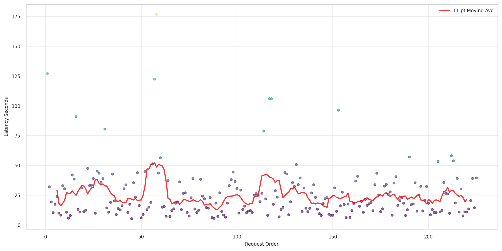](report_assets_20260305_194902/e2e_sequence_knowledge_qa_supervisor_4K.png)
<br>


**knowledge_qa_supervisor Latency Histogram**<br>

[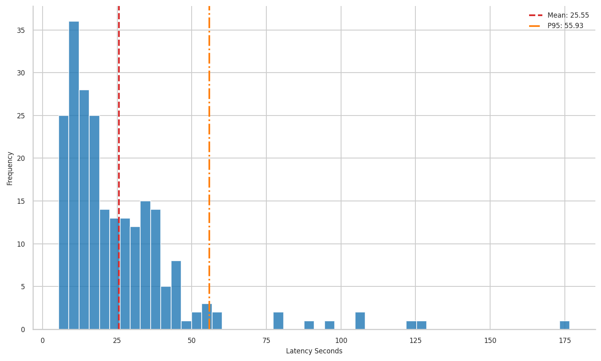](report_assets_20260305_194902/e2e_histogram_knowledge_qa_supervisor_4K.png)
<br>


---


### Agent Level


Agent performance is extremely poor, with nearly all agents failing their latency SLOs. The agents `config_test_agent_wrong_max_output_tokens_count_config` and `config_test_agent_wrong_max_tokens` are completely non-functional with a **100% Error Rate**. Other significant failures include `adk_documentation_agent` (37.5% error rate), `ai_observability_agent` (26.39% error rate), and `unreliable_tool_agent` (25.93% error rate), all drastically exceeding the 5% error target. The slowest agent is `bigquery_data_agent`, with a P95.5 latency of **73.714s** against an 8s target.

| Name                                                       |   Requests | %     | Mean (s)   | P95.5 (s)   |   Target (s) | Status   |   Err % |   Target (%) | Err Status   | Overall   |
|:-----------------------------------------------------------|-----------:|:------|:-----------|:------------|-------------:|:---------|--------:|-------------:|:-------------|:----------|
| **bigquery_data_agent**                                    |         54 | 13.9% | 24.812     | 73.714      |            8 | 🔴       |    1.85 |            5 | 🟢           | 🔴        |
| **adk_documentation_agent**                                |         48 | 12.4% | 24.035     | 48.521      |            8 | 🔴       |   37.5  |            5 | 🔴           | 🔴        |
| **ai_observability_agent**                                 |         72 | 18.6% | 23.019     | 47.203      |            8 | 🔴       |   26.39 |            5 | 🔴           | 🔴        |
| **parallel_db_lookup**                                     |         29 | 7.5%  | 21.99      | 37.641      |            8 | 🔴       |    3.45 |            5 | 🟢           | 🔴        |
| **unreliable_tool_agent**                                  |         27 | 7.0%  | 17.126     | 93.167      |            8 | 🔴       |   25.93 |            5 | 🔴           | 🔴        |
| **lookup_worker_3**                                        |         30 | 7.7%  | 16.717     | 26.397      |            8 | 🔴       |    3.33 |            5 | 🟢           | 🔴        |
| **lookup_worker_1**                                        |         29 | 7.5%  | 15.734     | 30.677      |            8 | 🔴       |    3.45 |            5 | 🟢           | 🔴        |
| **lookup_worker_2**                                        |         29 | 7.5%  | 14.685     | 24.341      |            8 | 🔴       |    3.45 |            5 | 🟢           | 🔴        |
| **google_search_agent**                                    |         39 | 10.1% | 14.211     | 34.549      |            8 | 🔴       |    0    |            5 | 🟢           | 🔴        |
| **config_test_agent_wrong_candidate_count_config**         |         10 | 2.6%  | 11.887     | 38.328      |            8 | 🔴       |   10    |            5 | 🔴           | 🔴        |
| **config_test_agent_high_temp**                            |          9 | 2.3%  | 9.225      | 13.593      |            8 | 🔴       |    0    |            5 | 🟢           | 🔴        |
| **config_test_agent_wrong_candidates**                     |          1 | 0.3%  | 5.899      | 5.899       |            8 | 🟢       |    0    |            5 | 🟢           | 🟢        |
| **config_test_agent_wrong_max_tokens**                     |          1 | 0.3%  | -          | -           |            8 | ⚪       |  100    |            5 | 🔴           | 🔴        |
| **config_test_agent_wrong_max_output_tokens_count_config** |         10 | 2.6%  | -          | -           |            8 | ⚪       |  100    |            5 | 🔴           | 🔴        |

<br>


**Agent Level Usage**<br>

[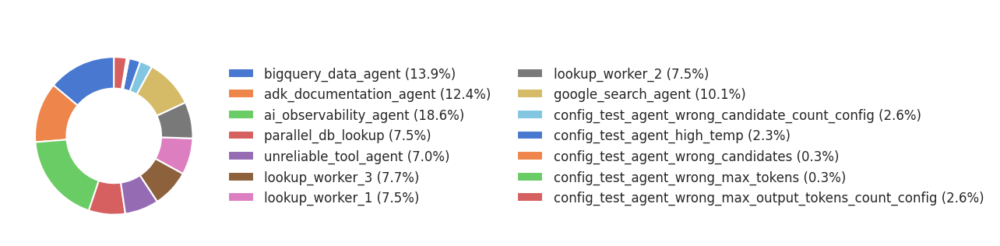](report_assets_20260305_194902/agent__usage_4K.png)
<br>


**Agent Level Latency (Target: 8.0s)**<br>

[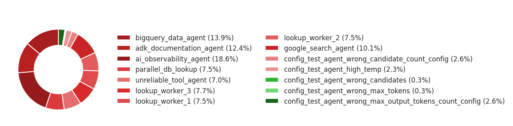](report_assets_20260305_194902/agent__lat_status_4K.png)
<br>


**Agent Level Error (Target: 5.0%)**<br>

[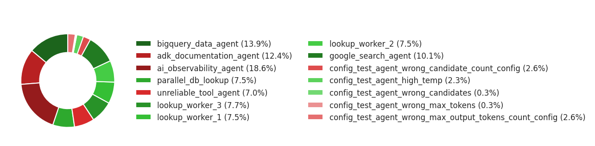](report_assets_20260305_194902/agent__err_status_4K.png)
<br>


---


### Tool Level


Tool performance is a key contributor to overall latency. The `flaky_tool_simulation` tool is the most problematic, with a high error rate of **22.22%** (vs 5% target) and a P95.5 latency of **6.306s** (vs 3s target). Additionally, the most frequently used tool, `simulated_db_lookup` (52.6% of requests), breaches its P95.5 latency target with **4.12s** versus the 3s goal, indicating a significant bottleneck due to its high usage.

| Name                      |   Requests | %     |   Mean (s) |   P95.5 (s) |   Target (s) | Status   |   Err % |   Target (%) | Err Status   | Overall   |
|:--------------------------|-----------:|:------|-----------:|------------:|-------------:|:---------|--------:|-------------:|:-------------|:----------|
| **flaky_tool_simulation** |         18 | 5.3%  |      3.342 |       6.306 |            3 | 🔴       |   22.22 |            5 | 🔴           | 🔴        |
| **complex_calculation**   |         12 | 3.5%  |      1.886 |       2.739 |            3 | 🟢       |    0    |            5 | 🟢           | 🟢        |
| **simulated_db_lookup**   |        179 | 52.6% |      1.023 |       4.12  |            3 | 🔴       |    0    |            5 | 🟢           | 🔴        |
| **execute_sql**           |         59 | 17.4% |      0.892 |       1.511 |            3 | 🟢       |    0    |            5 | 🟢           | 🟢        |
| **list_table_ids**        |         31 | 9.1%  |      0.36  |       0.547 |            3 | 🟢       |    0    |            5 | 🟢           | 🟢        |
| **list_dataset_ids**      |          7 | 2.1%  |      0.33  |       0.456 |            3 | 🟢       |    0    |            5 | 🟢           | 🟢        |
| **get_table_info**        |         34 | 10.0% |      0.289 |       0.42  |            3 | 🟢       |    0    |            5 | 🟢           | 🟢        |

<br>


**Tool Level Usage**<br>

[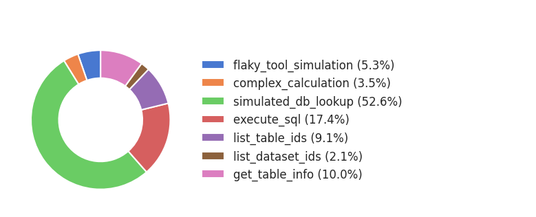](report_assets_20260305_194902/tool__usage_4K.png)
<br>


**Tool Level Latency (Target: 3.0s)**<br>

[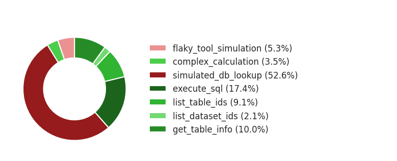](report_assets_20260305_194902/tool__lat_status_4K.png)
<br>


**Tool Level Error (Target: 5.0%)**<br>

[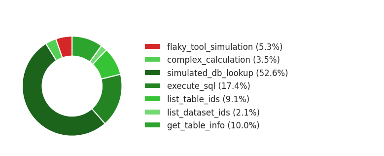](report_assets_20260305_194902/tool__err_status_4K.png)
<br>


---


### Model Level


All models are underperforming and failing their latency SLOs. The most heavily used models are `gemini-2.5-pro` and `gemini-2.5-flash`, each handling 30.4% of requests. The slowest model by mean latency is `gemini-3-pro-preview` at **12.66s**, more than double the 5s target. `gemini-2.5-flash` is the fastest on average (3.7s) but still fails its P95.5 latency target at **11.938s**. `gemini-3-pro-preview` also has the highest error rate at 11.69%.

| Name                       |   Requests | %     |   Mean (s) |   P95.5 (s) |   Target (s) | Status   |   Err % |   Target (%) | Err Status   | Input Tok (Avg/P95)   | Output Tok (Avg/P95)   | Thought Tok (Avg/P95)   | Tokens Consumed (Avg/P95)   | Overall   |
|:---------------------------|-----------:|:------|-----------:|------------:|-------------:|:---------|--------:|-------------:|:-------------|:----------------------|:-----------------------|:------------------------|:----------------------------|:----------|
| **gemini-3-pro-preview**   |        154 | 17.7% |     12.66  |      36.7   |            5 | 🔴       |   11.69 |            5 | 🔴           | 3993 / 13315          | 184 / 1042             | 632 / 1726              | 4810 / 13707                | 🔴        |
| **gemini-3.1-pro-preview** |        187 | 21.5% |      8.87  |      34.09  |            5 | 🔴       |    0.53 |            5 | 🟢           | 1806 / 13307          | 104 / 622              | 362 / 1569              | 2268 / 13491                | 🔴        |
| **gemini-2.5-pro**         |        264 | 30.4% |      8.153 |      22.076 |            5 | 🔴       |    6.82 |            5 | 🔴           | 4672 / 14945          | 86 / 578               | 320 / 850               | 5130 / 15571                | 🔴        |
| **gemini-2.5-flash**       |        264 | 30.4% |      3.697 |      11.938 |            5 | 🔴       |    4.55 |            5 | 🟢           | 11705 / 105211        | 82 / 440               | 227 / 633               | 12038 / 105325              | 🔴        |

<br>


**Model Level Usage**<br>

[](report_assets_20260305_194902/model__usage_4K.png)
<br>


**Model Level Latency (Target: 5.0s)**<br>

[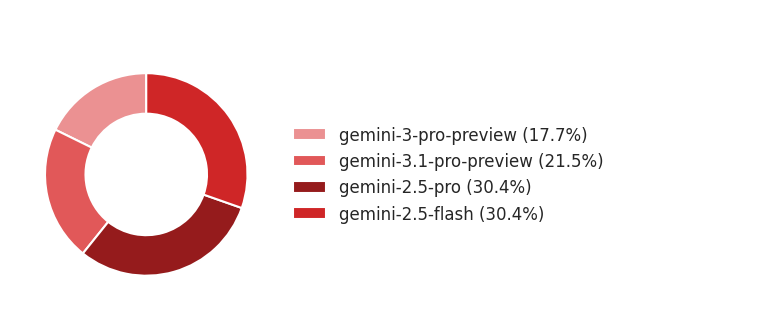](report_assets_20260305_194902/model__lat_status_4K.png)
<br>


**Model Level Error (Target: 5.0%)**<br>

[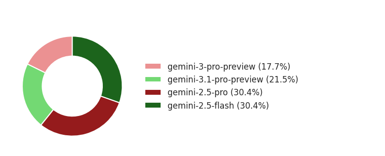](report_assets_20260305_194902/model__err_status_4K.png)
<br>


---


## Agent Details


Model routing shows significant specialization. `bigquery_data_agent` overwhelmingly uses `gemini-2.5-flash` for 56% of its 184 calls, likely for processing large contexts. In contrast, `ai_observability_agent` prefers `gemini-3-pro-preview` (45% of calls). The parallel `lookup_worker` agents demonstrate a clear preference for `gemini-3.1-pro-preview` and `gemini-2.5-pro`, suggesting these models are better suited for their specific lookup and reasoning tasks.


### Distribution

**Total Requests:** 388

| **Name**                                                   |   **Requests** |   **%** |
|:-----------------------------------------------------------|---------------:|--------:|
| **bigquery_data_agent**                                    |             54 |   13.92 |
| **adk_documentation_agent**                                |             48 |   12.37 |
| **ai_observability_agent**                                 |             72 |   18.56 |
| **parallel_db_lookup**                                     |             29 |    7.47 |
| **unreliable_tool_agent**                                  |             27 |    6.96 |
| **lookup_worker_3**                                        |             30 |    7.73 |
| **lookup_worker_1**                                        |             29 |    7.47 |
| **lookup_worker_2**                                        |             29 |    7.47 |
| **google_search_agent**                                    |             39 |   10.05 |
| **config_test_agent_wrong_candidate_count_config**         |             10 |    2.58 |
| **config_test_agent_high_temp**                            |              9 |    2.32 |
| **config_test_agent_wrong_candidates**                     |              1 |    0.26 |
| **config_test_agent_wrong_max_tokens**                     |              1 |    0.26 |
| **config_test_agent_wrong_max_output_tokens_count_config** |             10 |    2.58 |

<br>


**Agent Composition**<br>

[](report_assets_20260305_194902/agent_composition_pie_4K.png)
<br>


**Total LLM Calls per Agent**<br>

[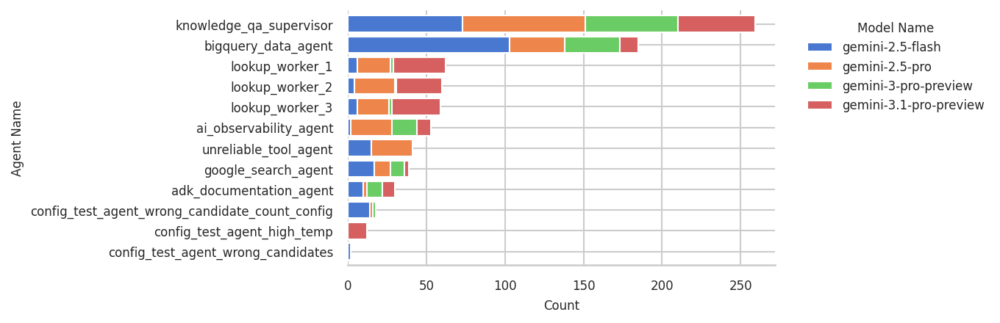](report_assets_20260305_194902/agent_calls_stacked_4K.png)
<br>


### Model Traffic

| **Agent Name**                                             | **gemini-2.5-flash**   | **gemini-2.5-pro**   | **gemini-3-pro-preview**   | **gemini-3.1-pro-preview**   |
|:-----------------------------------------------------------|:-----------------------|:---------------------|:---------------------------|:-----------------------------|
| **adk_documentation_agent**                                | 12 (25%)               | 18 (38%)             | 10 (21%)                   | 8 (17%)                      |
| **ai_observability_agent**                                 | 2 (3%)                 | 28 (39%)             | 32 (45%)                   | 9 (13%)                      |
| **bigquery_data_agent**                                    | 103 (56%)              | 35 (19%)             | 35 (19%)                   | 12 (6%)                      |
| **config_test_agent_high_temp**                            | -                      | -                    | -                          | 12 (100%)                    |
| **config_test_agent_wrong_candidate_count_config**         | 14 (78%)               | 2 (11%)              | 2 (11%)                    | -                            |
| **config_test_agent_wrong_candidates**                     | 2 (100%)               | -                    | -                          | -                            |
| **config_test_agent_wrong_max_output_tokens_count_config** | 9 (90%)                | -                    | -                          | 1 (10%)                      |
| **config_test_agent_wrong_max_tokens**                     | 1 (100%)               | -                    | -                          | -                            |
| **google_search_agent**                                    | 17 (44%)               | 10 (26%)             | 9 (23%)                    | 3 (8%)                       |
| **knowledge_qa_supervisor**                                | 73 (28%)               | 78 (30%)             | 60 (23%)                   | 49 (19%)                     |
| **lookup_worker_1**                                        | 6 (10%)                | 21 (33%)             | 3 (5%)                     | 33 (52%)                     |
| **lookup_worker_2**                                        | 4 (7%)                 | 26 (43%)             | 1 (2%)                     | 29 (48%)                     |
| **lookup_worker_3**                                        | 6 (10%)                | 20 (34%)             | 2 (3%)                     | 31 (53%)                     |
| **unreliable_tool_agent**                                  | 15 (37%)               | 26 (63%)             | -                          | -                            |

<br>


### Model Performance (Agent End-to-End)

This table compares how specific agents perform when running on different models. **Values represent Agent End-to-End Latency** (including tool execution and overhead), not just LLM generation time.

> [!NOTE]
> **KPI Settings:** Latency Target = `8.0s`, Error Target = `5.0%`
> **Cell Format:** `[Status] [P95.5 Latency]s ([Error Rate]%)`. For example, `🔴 21.558s (16.67%)` means the Agent had a P95.5 latency of 21.558 seconds and an error rate of 16.67%, and received a failing 🔴 status because it breached either the latency or error target.

| **Agent Name**                                             | **gemini-2.5-flash**   | **gemini-2.5-pro**   | **gemini-3-pro-preview**   | **gemini-3.1-pro-preview**   |
|:-----------------------------------------------------------|:-----------------------|:---------------------|:---------------------------|:-----------------------------|
| **adk_documentation_agent**                                | 🔴 21.558s (16.67%)    | 🔴 7.458s (88.89%)   | 🔴 51.512s (0.0%)          | 🔴 38.374s (0.0%)            |
| **ai_observability_agent**                                 | 🟢 5.862s (0.0%)       | 🔴 46.519s (7.14%)   | 🔴 51.174s (50.0%)         | 🔴 47.203s (0.0%)            |
| **bigquery_data_agent**                                    | 🔴 31.36s (3.23%)      | 🔴 73.714s (0.0%)    | 🔴 120.422s (0.0%)         | 🔴 84.88s (0.0%)             |
| **config_test_agent_high_temp**                            |                        |                      |                            | 🔴 13.593s (0.0%)            |
| **config_test_agent_wrong_candidate_count_config**         | 🟢 7.004s (0.0%)       | 🔴 38.328s (0.0%)    | 🔴 24.945s (50.0%)         |                              |
| **config_test_agent_wrong_candidates**                     | 🟢 5.899s (0.0%)       |                      |                            |                              |
| **config_test_agent_wrong_max_output_tokens_count_config** | -                      |                      |                            | -                            |
| **config_test_agent_wrong_max_tokens**                     | -                      |                      |                            |                              |
| **google_search_agent**                                    | 🔴 16.471s (0.0%)      | 🔴 32.579s (0.0%)    | 🔴 21.61s (0.0%)           | 🔴 37.116s (0.0%)            |
| **knowledge_qa_supervisor**                                | 🔴 29.334s (17.81%)    | 🔴 105.97s (26.92%)  | 🔴 78.925s (30.0%)         | 🔴 45.233s (6.12%)           |
| **lookup_worker_1**                                        | 🔴 12.924s (0.0%)      | 🔴 37.64s (0.0%)     | -                          | 🔴 30.677s (0.0%)            |
| **lookup_worker_2**                                        | 🔴 29.304s (0.0%)      | 🔴 24.341s (0.0%)    | -                          | 🔴 18.785s (0.0%)            |
| **lookup_worker_3**                                        | 🔴 12.05s (0.0%)       | 🔴 116.662s (0.0%)   | -                          | 🔴 16.358s (0.0%)            |
| **unreliable_tool_agent**                                  | 🔴 13.268s (12.5%)     | 🔴 93.167s (31.58%)  |                            |                              |

<br>


### LLM Generation Performance

This table compares the raw LLM generation time for specific agents and models. **Values represent Pure LLM Latency** (excluding agent overhead).

> [!NOTE]
> **KPI Settings:** Latency Target = `5.0s`, Error Target = `5.0%`
> **Cell Format:** `[Status] [P95.5 Latency]s ([Error Rate]%)`.

| **Agent Name**                                             | **gemini-2.5-flash**   | **gemini-2.5-pro**   | **gemini-3-pro-preview**   | **gemini-3.1-pro-preview**   |
|:-----------------------------------------------------------|:-----------------------|:---------------------|:---------------------------|:-----------------------------|
| **adk_documentation_agent**                                | 🔴 21.556s (16.67%)    | 🔴 7.456s (88.89%)   | 🔴 51.509s (0.0%)          | 🔴 38.372s (0.0%)            |
| **ai_observability_agent**                                 | 🔴 5.861s (0.0%)       | 🔴 46.516s (7.14%)   | 🔴 51.172s (50.0%)         | 🔴 47.201s (0.0%)            |
| **bigquery_data_agent**                                    | 🔴 6.477s (0.0%)       | 🔴 18.558s (0.0%)    | 🔴 16.485s (0.0%)          | 🔴 21.405s (0.0%)            |
| **config_test_agent_high_temp**                            |                        |                      |                            | 🔴 9.051s (0.0%)             |
| **config_test_agent_wrong_candidate_count_config**         | 🟢 2.527s (0.0%)       | 🔴 18.704s (0.0%)    | 🔴 24.943s (0.0%)          |                              |
| **config_test_agent_wrong_candidates**                     | 🟢 2.577s (0.0%)       |                      |                            |                              |
| **config_test_agent_wrong_max_output_tokens_count_config** | -                      |                      |                            | -                            |
| **config_test_agent_wrong_max_tokens**                     | -                      |                      |                            |                              |
| **google_search_agent**                                    | 🔴 16.468s (0.0%)      | 🔴 32.576s (0.0%)    | 🔴 21.605s (0.0%)          | 🔴 37.113s (0.0%)            |
| **knowledge_qa_supervisor**                                | 🟢 4.234s (0.0%)       | 🔴 6.812s (0.0%)     | 🔴 9.989s (1.67%)          | 🔴 8.778s (0.0%)             |
| **lookup_worker_1**                                        | 🔴 9.233s (0.0%)       | 🔴 20.403s (0.0%)    | 🔴 16.478s (33.33%)        | 🔴 16.989s (0.0%)            |
| **lookup_worker_2**                                        | 🔴 27.263s (0.0%)      | 🔴 8.21s (0.0%)      | 🔴 24.734s (0.0%)          | 🔴 12.655s (0.0%)            |
| **lookup_worker_3**                                        | 🔴 6.201s (0.0%)       | 🔴 98.609s (0.0%)    | 🔴 14.804s (0.0%)          | 🔴 10.481s (0.0%)            |
| **unreliable_tool_agent**                                  | 🟢 4.831s (0.0%)       | 🔴 10.606s (0.0%)    |                            |                              |

<br>


### Agent Overhead Analysis

This chart breaks down the internal execution time of an Agent into **LLM Time**, **Tool Time**, and its own **Code Overhead** (the remaining time).

> [!NOTE]
> The data below is calculated using the **P95.5 execution latency** metrics across all events for each agent to illustrate worst-case internal overheads.


#### Overhead Data Summary

| **Agent Name**                                     | **Total Agent Latency (s)**   | **Pure LLM Latency (s)**   | **Agent Overhead (s)**   |
|:---------------------------------------------------|:------------------------------|:---------------------------|:-------------------------|
| **bigquery_data_agent**                            | 120.422s                      | 14.083s                    | 106.339s                 |
| **unreliable_tool_agent**                          | 75.689s                       | 8.845s                     | 66.844s                  |
| **lookup_worker_3**                                | 61.6s                         | 11.151s                    | 50.449s                  |
| **adk_documentation_agent**                        | 47.821s                       | 47.819s                    | 0.002s                   |
| **ai_observability_agent**                         | 46.97s                        | 46.968s                    | 0.002s                   |
| **config_test_agent_wrong_candidate_count_config** | 38.328s                       | 22.165s                    | 16.163s                  |
| **google_search_agent**                            | 33.15s                        | 33.147s                    | 0.003s                   |
| **lookup_worker_1**                                | 33.079s                       | 16.608s                    | 16.471s                  |
| **lookup_worker_2**                                | 24.341s                       | 12.91s                     | 11.431s                  |
| **config_test_agent_high_temp**                    | 13.593s                       | 9.042s                     | 4.551s                   |

<br>


**Agent Overhead Comparison**<br>

[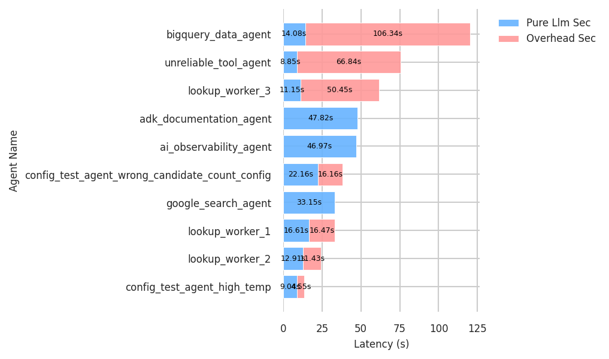](report_assets_20260305_194902/agent_overhead_composition_4K.png)
<br>


---


### Agent Execution Latency (Request Order)

The following charts display the end-to-end latency for each specific Agent over time, highlighting performance trends and potential internal degradation.


**adk_documentation_agent Execution Latency Sequence (Request Order)**<br>

[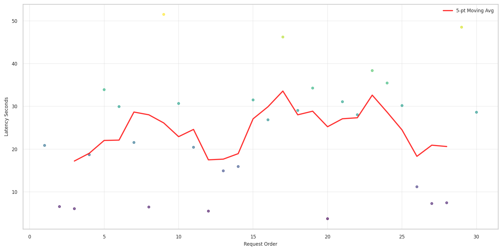](report_assets_20260305_194902/seq_agent_overall_adk_documentation_agent_4K.png)
<br>


**ai_observability_agent Execution Latency Sequence (Request Order)**<br>

[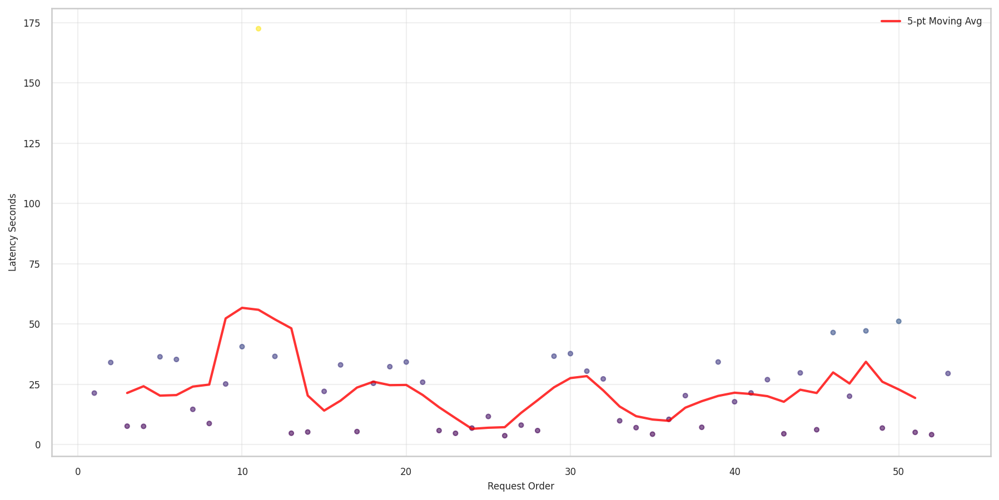](report_assets_20260305_194902/seq_agent_overall_ai_observability_agent_4K.png)
<br>


**bigquery_data_agent Execution Latency Sequence (Request Order)**<br>

[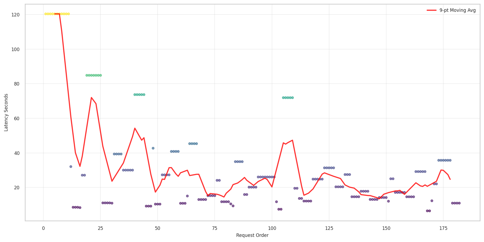](report_assets_20260305_194902/seq_agent_overall_bigquery_data_agent_4K.png)
<br>


**config_test_agent_high_temp Execution Latency Sequence (Request Order)**<br>

[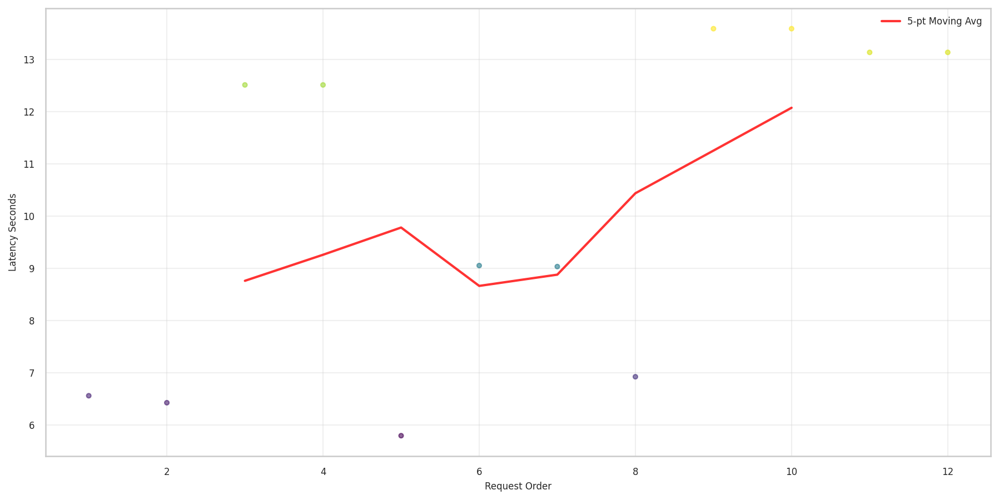](report_assets_20260305_194902/seq_agent_overall_config_test_agent_high_temp_4K.png)
<br>


**config_test_agent_wrong_candidate_count_config Execution Latency Sequence (Request Order)**<br>

[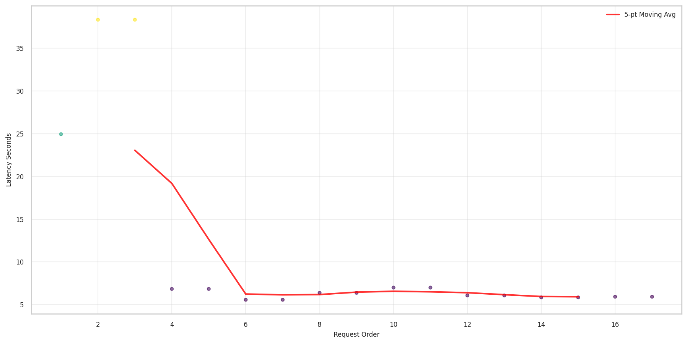](report_assets_20260305_194902/seq_agent_overall_config_test_agent_wrong_candidate_count_config_4K.png)
<br>


**config_test_agent_wrong_candidates Execution Latency Sequence (Request Order)**<br>

[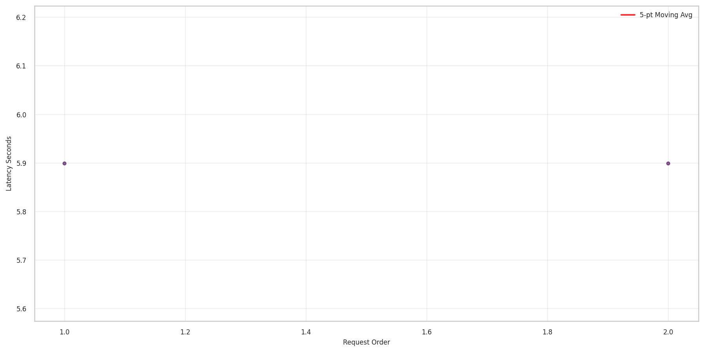](report_assets_20260305_194902/seq_agent_overall_config_test_agent_wrong_candidates_4K.png)
<br>


**google_search_agent Execution Latency Sequence (Request Order)**<br>

[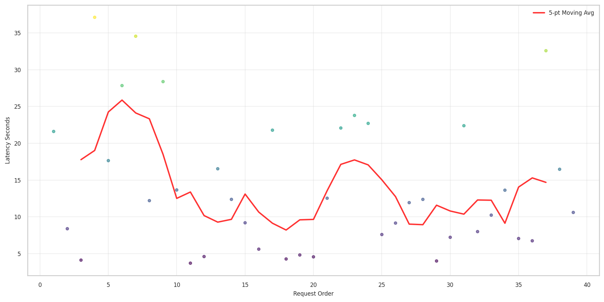](report_assets_20260305_194902/seq_agent_overall_google_search_agent_4K.png)
<br>


**lookup_worker_1 Execution Latency Sequence (Request Order)**<br>

[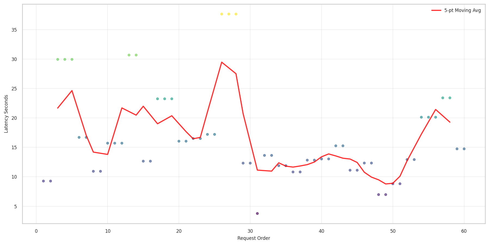](report_assets_20260305_194902/seq_agent_overall_lookup_worker_1_4K.png)
<br>


**lookup_worker_2 Execution Latency Sequence (Request Order)**<br>

[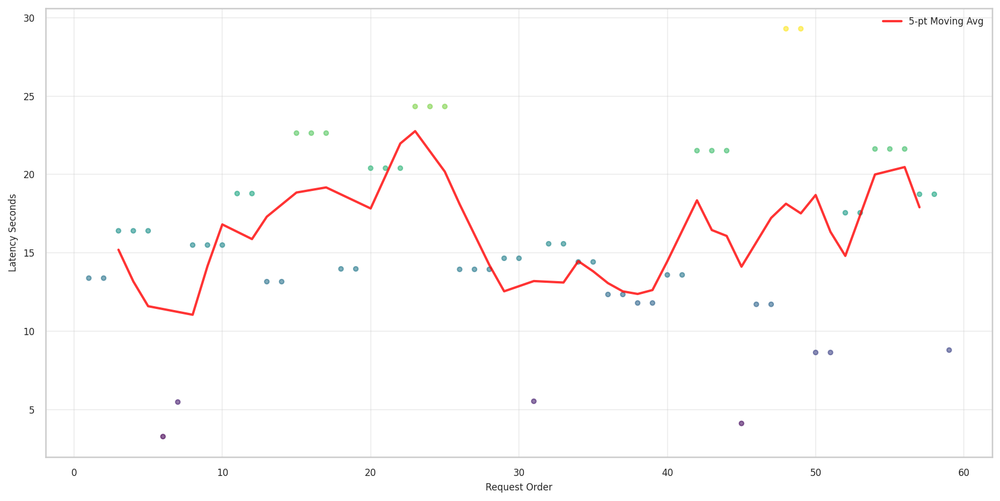](report_assets_20260305_194902/seq_agent_overall_lookup_worker_2_4K.png)
<br>


**lookup_worker_3 Execution Latency Sequence (Request Order)**<br>

[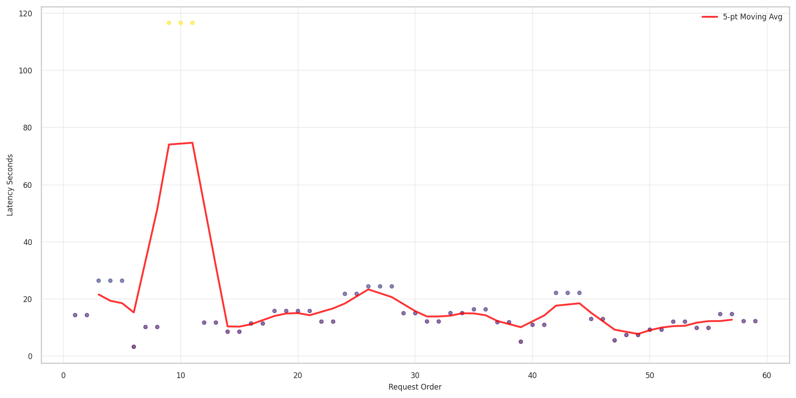](report_assets_20260305_194902/seq_agent_overall_lookup_worker_3_4K.png)
<br>


**parallel_db_lookup Execution Latency Sequence (Request Order)**<br>

[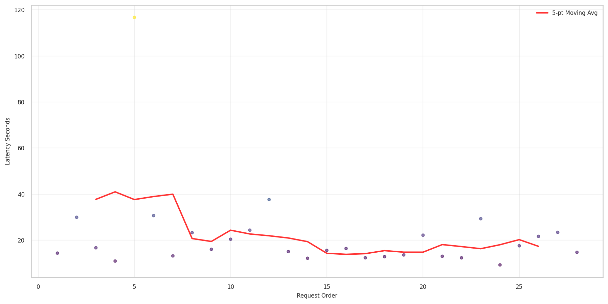](report_assets_20260305_194902/seq_agent_overall_parallel_db_lookup_4K.png)
<br>


**unreliable_tool_agent Execution Latency Sequence (Request Order)**<br>

[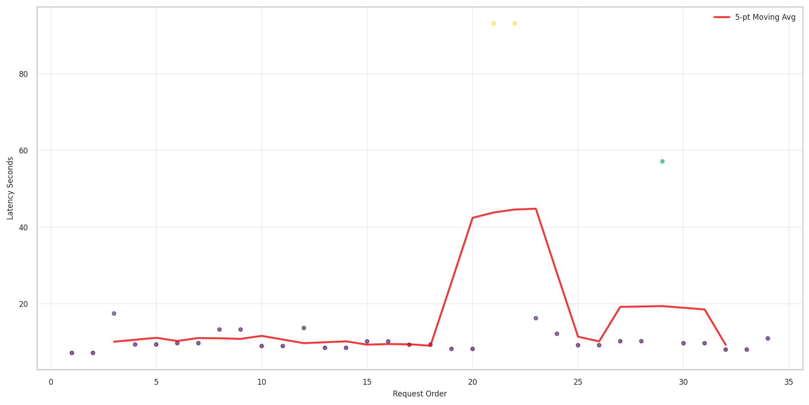](report_assets_20260305_194902/seq_agent_overall_unreliable_tool_agent_4K.png)
<br>


---


### Token Statistics


**adk_documentation_agent**

| **Metric**                           | **gemini-3-pro-preview**   | **gemini-3.1-pro-preview**   | **gemini-2.5-flash**   | **gemini-2.5-pro**   |
|:-------------------------------------|:---------------------------|:-----------------------------|:-----------------------|:---------------------|
| **Amount of Requests**               | 10                         | 8                            | 12                     | 18                   |
| **Mean Input Tokens**                | 1565.30                    | 814.75                       | 410.00                 | 273.50               |
| **P95 Input Tokens**                 | 4977.00                    | 922.00                       | 590.00                 | 327.00               |
| **Mean Thought Tokens**              | 1334.50                    | 1514.50                      | 1056.50                | 448.50               |
| **P95 Thought Tokens**               | 2170.00                    | 2116.00                      | 2341.00                | 499.00               |
| **Mean Output Tokens**               | 980.40                     | 559.38                       | 285.00                 | 38.50                |
| **P95 Output Tokens**                | 1280.00                    | 644.00                       | 908.00                 | 39.00                |
| **Median Output Tokens**             | 1039.00                    | 548.00                       | 53.00                  | 38.00                |
| **Min Output Tokens**                | 463.00                     | 511.00                       | 40.00                  | 38.00                |
| **Max Output Tokens**                | 1280.00                    | 644.00                       | 908.00                 | 39.00                |
| **Mean Total Tokens**                | 3880.20                    | 2888.62                      | 2722.20                | 826.50               |
| **Latency vs Output Corr.**          | 0.903                      | -0.380                       | 0.825                  | 1.000                |
| **Latency vs Output+Thinking Corr.** | 0.927                      | 0.912                        | 0.977                  | 1.000                |
| **Correlation Strength**             | 🟧 **Strong**              | 🟧 **Strong**                | 🟧 **Strong**          | 🟧 **Strong**        |

<br>


**ai_observability_agent**

| **Metric**                           | **gemini-3.1-pro-preview**   | **gemini-3-pro-preview**   | **gemini-2.5-pro**   | **gemini-2.5-flash**   |
|:-------------------------------------|:-----------------------------|:---------------------------|:---------------------|:-----------------------|
| **Amount of Requests**               | 9                            | 32                         | 28                   | 2                      |
| **Mean Input Tokens**                | 295.22                       | 268.06                     | 447.08               | 204.00                 |
| **P95 Input Tokens**                 | 1017.00                      | 345.00                     | 803.00               | 204.00                 |
| **Mean Thought Tokens**              | 1518.78                      | 1215.12                    | 364.62               | 410.00                 |
| **P95 Thought Tokens**               | 2338.00                      | 1726.00                    | 1065.00              | 453.00                 |
| **Mean Output Tokens**               | 635.11                       | 664.75                     | 356.33               | 164.00                 |
| **P95 Output Tokens**                | 675.00                       | 1186.00                    | 578.00               | 227.00                 |
| **Median Output Tokens**             | 648.00                       | 414.00                     | 453.00               | 101.00                 |
| **Min Output Tokens**                | 583.00                       | 266.00                     | 38.00                | 101.00                 |
| **Max Output Tokens**                | 675.00                       | 1186.00                    | 578.00               | 227.00                 |
| **Mean Total Tokens**                | 2449.11                      | 2147.94                    | 1270.42              | 778.00                 |
| **Latency vs Output Corr.**          | -0.379                       | 0.705                      | 0.014                | 1.000                  |
| **Latency vs Output+Thinking Corr.** | 0.382                        | 0.819                      | 0.095                | 1.000                  |
| **Correlation Strength**             | 🟦 **Weak**                  | 🟨 **Moderate**            | 🟦 **Weak**          | 🟧 **Strong**          |

<br>


**bigquery_data_agent**

| **Metric**                           | **gemini-3-pro-preview**   | **gemini-2.5-pro**   | **gemini-3.1-pro-preview**   | **gemini-2.5-flash**   |
|:-------------------------------------|:---------------------------|:---------------------|:-----------------------------|:-----------------------|
| **Amount of Requests**               | 35                         | 35                   | 12                           | 103                    |
| **Mean Input Tokens**                | 12060.74                   | 26539.43             | 16806.00                     | 26553.80               |
| **P95 Input Tokens**                 | 13900.00                   | 106307.00            | 27223.00                     | 105502.00              |
| **Mean Thought Tokens**              | 596.97                     | 487.00               | 500.08                       | 158.66                 |
| **P95 Thought Tokens**               | 1472.00                    | 1691.00              | 2170.00                      | 384.00                 |
| **Mean Output Tokens**               | 51.43                      | 43.74                | 63.42                        | 35.83                  |
| **P95 Output Tokens**                | 151.00                     | 82.00                | 125.00                       | 67.00                  |
| **Median Output Tokens**             | 32.00                      | 39.00                | 65.00                        | 28.00                  |
| **Min Output Tokens**                | 17.00                      | 20.00                | 17.00                        | 13.00                  |
| **Max Output Tokens**                | 161.00                     | 156.00               | 125.00                       | 189.00                 |
| **Mean Total Tokens**                | 12709.14                   | 27070.17             | 17369.50                     | 26748.28               |
| **Latency vs Output Corr.**          | 0.573                      | -0.144               | -0.001                       | 0.197                  |
| **Latency vs Output+Thinking Corr.** | 0.974                      | 0.909                | 0.998                        | 0.591                  |
| **Correlation Strength**             | 🟧 **Strong**              | 🟧 **Strong**        | 🟧 **Strong**                | 🟨 **Moderate**        |

<br>


**config_test_agent_high_temp**

| **Metric**                           | **gemini-3.1-pro-preview**   |
|:-------------------------------------|:-----------------------------|
| **Amount of Requests**               | 12                           |
| **Mean Input Tokens**                | 1158.67                      |
| **P95 Input Tokens**                 | 1182.00                      |
| **Mean Thought Tokens**              | 255.00                       |
| **P95 Thought Tokens**               | 442.00                       |
| **Mean Output Tokens**               | 42.25                        |
| **P95 Output Tokens**                | 82.00                        |
| **Median Output Tokens**             | 33.00                        |
| **Min Output Tokens**                | 10.00                        |
| **Max Output Tokens**                | 82.00                        |
| **Mean Total Tokens**                | 1455.92                      |
| **Latency vs Output Corr.**          | 0.049                        |
| **Latency vs Output+Thinking Corr.** | 0.651                        |
| **Correlation Strength**             | 🟨 **Moderate**              |

<br>


**config_test_agent_wrong_candidate_count_config**

| **Metric**                           | **gemini-3-pro-preview**   | **gemini-2.5-pro**   | **gemini-2.5-flash**   |
|:-------------------------------------|:---------------------------|:---------------------|:-----------------------|
| **Amount of Requests**               | 2                          | 2                    | 14                     |
| **Mean Input Tokens**                | 1233.00                    | 4646.00              | 1220.00                |
| **P95 Input Tokens**                 | 1294.00                    | 4789.00              | 1269.00                |
| **Mean Thought Tokens**              | 5000.00                    | 1673.50              | 375.00                 |
| **P95 Thought Tokens**               | 5625.00                    | 1931.00              | 390.00                 |
| **Mean Output Tokens**               | 302.50                     | 1980.50              | 126.07                 |
| **P95 Output Tokens**                | 520.00                     | 3185.00              | 440.00                 |
| **Median Output Tokens**             | 85.00                      | 776.00               | 50.00                  |
| **Min Output Tokens**                | 85.00                      | 776.00               | 30.00                  |
| **Max Output Tokens**                | 520.00                     | 3185.00              | 440.00                 |
| **Mean Total Tokens**                | 6535.50                    | 8300.00              | 1560.36                |
| **Latency vs Output Corr.**          | 1.000                      | -1.000               | 0.341                  |
| **Latency vs Output+Thinking Corr.** | -1.000                     | -1.000               | 0.226                  |
| **Correlation Strength**             | 🟧 **Strong**              | 🟧 **Strong**        | 🟦 **Weak**            |

<br>


**config_test_agent_wrong_candidates**

| **Metric**                           | **gemini-2.5-flash**   |
|:-------------------------------------|:-----------------------|
| **Amount of Requests**               | 2                      |
| **Mean Input Tokens**                | 1187.00                |
| **P95 Input Tokens**                 | 1257.00                |
| **Mean Thought Tokens**              | 600.00                 |
| **P95 Thought Tokens**               | 600.00                 |
| **Mean Output Tokens**               | 72.50                  |
| **P95 Output Tokens**                | 115.00                 |
| **Median Output Tokens**             | 30.00                  |
| **Min Output Tokens**                | 30.00                  |
| **Max Output Tokens**                | 115.00                 |
| **Mean Total Tokens**                | 1559.50                |
| **Latency vs Output Corr.**          | -1.000                 |
| **Latency vs Output+Thinking Corr.** | 1.000                  |
| **Correlation Strength**             | 🟧 **Strong**          |

<br>


**config_test_agent_wrong_max_output_tokens_count_config**

| **Metric**                           | **gemini-2.5-flash**   | **gemini-3.1-pro-preview**   |
|:-------------------------------------|:-----------------------|:-----------------------------|
| **Amount of Requests**               | 9                      | 1                            |
| **Mean Input Tokens**                | N/A                    | N/A                          |
| **P95 Input Tokens**                 | N/A                    | N/A                          |
| **Mean Thought Tokens**              | N/A                    | N/A                          |
| **P95 Thought Tokens**               | N/A                    | N/A                          |
| **Mean Output Tokens**               | N/A                    | N/A                          |
| **P95 Output Tokens**                | N/A                    | N/A                          |
| **Median Output Tokens**             | N/A                    | N/A                          |
| **Min Output Tokens**                | N/A                    | N/A                          |
| **Max Output Tokens**                | N/A                    | N/A                          |
| **Mean Total Tokens**                | N/A                    | N/A                          |
| **Latency vs Output Corr.**          | N/A                    | N/A                          |
| **Latency vs Output+Thinking Corr.** | N/A                    | N/A                          |
| **Correlation Strength**             | N/A                    | N/A                          |

<br>


**config_test_agent_wrong_max_tokens**

| **Metric**                           | **gemini-2.5-flash**   |
|:-------------------------------------|:-----------------------|
| **Amount of Requests**               | 1                      |
| **Mean Input Tokens**                | N/A                    |
| **P95 Input Tokens**                 | N/A                    |
| **Mean Thought Tokens**              | N/A                    |
| **P95 Thought Tokens**               | N/A                    |
| **Mean Output Tokens**               | N/A                    |
| **P95 Output Tokens**                | N/A                    |
| **Median Output Tokens**             | N/A                    |
| **Min Output Tokens**                | N/A                    |
| **Max Output Tokens**                | N/A                    |
| **Mean Total Tokens**                | N/A                    |
| **Latency vs Output Corr.**          | N/A                    |
| **Latency vs Output+Thinking Corr.** | N/A                    |
| **Correlation Strength**             | N/A                    |

<br>


**google_search_agent**

| **Metric**                           | **gemini-3.1-pro-preview**   | **gemini-2.5-pro**   | **gemini-3-pro-preview**   | **gemini-2.5-flash**   |
|:-------------------------------------|:-----------------------------|:---------------------|:---------------------------|:-----------------------|
| **Amount of Requests**               | 3                            | 10                   | 9                          | 17                     |
| **Mean Input Tokens**                | 5878.67                      | 375.80               | 559.89                     | 114.41                 |
| **P95 Input Tokens**                 | 17407.00                     | 2518.00              | 4143.00                    | 116.00                 |
| **Mean Thought Tokens**              | 1550.33                      | 495.70               | 254.44                     | 349.53                 |
| **P95 Thought Tokens**               | 2117.00                      | 1405.00              | 1123.00                    | 1054.00                |
| **Mean Output Tokens**               | 734.33                       | 987.40               | 118.56                     | 585.88                 |
| **P95 Output Tokens**                | 936.00                       | 1317.00              | 650.00                     | 1425.00                |
| **Median Output Tokens**             | 732.00                       | 1040.00              | 51.00                      | 145.00                 |
| **Min Output Tokens**                | 535.00                       | 122.00               | 48.00                      | 28.00                  |
| **Max Output Tokens**                | 936.00                       | 1317.00              | 650.00                     | 1425.00                |
| **Mean Total Tokens**                | 8163.33                      | 2215.40              | 932.89                     | 1094.29                |
| **Latency vs Output Corr.**          | 0.916                        | 0.781                | 0.897                      | 0.954                  |
| **Latency vs Output+Thinking Corr.** | 0.954                        | 0.896                | 0.891                      | 0.991                  |
| **Correlation Strength**             | 🟧 **Strong**                | 🟧 **Strong**        | 🟧 **Strong**              | 🟧 **Strong**          |

<br>


**knowledge_qa_supervisor**

| **Metric**                           | **gemini-3-pro-preview**   | **gemini-3.1-pro-preview**   | **gemini-2.5-pro**   | **gemini-2.5-flash**   |
|:-------------------------------------|:---------------------------|:-----------------------------|:---------------------|:-----------------------|
| **Amount of Requests**               | 60                         | 49                           | 78                   | 73                     |
| **Mean Input Tokens**                | 1553.71                    | 1556.80                      | 1517.86              | 1600.86                |
| **P95 Input Tokens**                 | 2476.00                    | 2173.00                      | 2165.00              | 2840.00                |
| **Mean Thought Tokens**              | 257.53                     | 224.45                       | 164.87               | 125.67                 |
| **P95 Thought Tokens**               | 523.00                     | 333.00                       | 460.00               | 380.00                 |
| **Mean Output Tokens**               | 17.98                      | 18.39                        | 13.74                | 15.75                  |
| **P95 Output Tokens**                | 18.00                      | 21.00                        | 14.00                | 25.00                  |
| **Median Output Tokens**             | 18.00                      | 18.00                        | 14.00                | 14.00                  |
| **Min Output Tokens**                | 17.00                      | 17.00                        | 13.00                | 13.00                  |
| **Max Output Tokens**                | 25.00                      | 29.00                        | 14.00                | 25.00                  |
| **Mean Total Tokens**                | 1829.22                    | 1799.63                      | 1696.47              | 1742.29                |
| **Latency vs Output Corr.**          | 0.283                      | -0.220                       | -0.170               | 0.004                  |
| **Latency vs Output+Thinking Corr.** | 0.734                      | 0.470                        | 0.400                | 0.761                  |
| **Correlation Strength**             | 🟨 **Moderate**            | 🟦 **Weak**                  | 🟦 **Weak**          | 🟨 **Moderate**        |

<br>


**lookup_worker_1**

| **Metric**                           | **gemini-3-pro-preview**   | **gemini-2.5-pro**   | **gemini-3.1-pro-preview**   | **gemini-2.5-flash**   |
|:-------------------------------------|:---------------------------|:---------------------|:-----------------------------|:-----------------------|
| **Amount of Requests**               | 3                          | 21                   | 33                           | 6                      |
| **Mean Input Tokens**                | 391.00                     | 340.95               | 187.85                       | 289.33                 |
| **P95 Input Tokens**                 | 408.00                     | 706.00               | 235.00                       | 693.00                 |
| **Mean Thought Tokens**              | 747.50                     | 279.33               | 175.82                       | 208.67                 |
| **P95 Thought Tokens**               | 1293.00                    | 745.00               | 546.00                       | 469.00                 |
| **Mean Output Tokens**               | 19.50                      | 14.52                | 48.03                        | 34.83                  |
| **P95 Output Tokens**                | 20.00                      | 20.00                | 61.00                        | 61.00                  |
| **Median Output Tokens**             | 19.00                      | 14.00                | 48.00                        | 36.00                  |
| **Min Output Tokens**                | 19.00                      | 7.00                 | 32.00                        | 19.00                  |
| **Max Output Tokens**                | 20.00                      | 26.00                | 63.00                        | 61.00                  |
| **Mean Total Tokens**                | 1158.00                    | 634.81               | 410.24                       | 428.50                 |
| **Latency vs Output Corr.**          | 1.000                      | -0.424               | 0.031                        | 0.024                  |
| **Latency vs Output+Thinking Corr.** | 1.000                      | 0.876                | 0.787                        | 0.965                  |
| **Correlation Strength**             | 🟧 **Strong**              | 🟧 **Strong**        | 🟨 **Moderate**              | 🟧 **Strong**          |

<br>


**lookup_worker_2**

| **Metric**                           | **gemini-3-pro-preview**   | **gemini-2.5-flash**   | **gemini-3.1-pro-preview**   | **gemini-2.5-pro**   |
|:-------------------------------------|:---------------------------|:-----------------------|:-----------------------------|:---------------------|
| **Amount of Requests**               | 1                          | 4                      | 29                           | 26                   |
| **Mean Input Tokens**                | 374.00                     | 1256.25                | 183.28                       | 300.15               |
| **P95 Input Tokens**                 | 374.00                     | 4433.00                | 235.00                       | 478.00               |
| **Mean Thought Tokens**              | 2029.00                    | 1466.00                | 202.38                       | 148.88               |
| **P95 Thought Tokens**               | 2029.00                    | 4261.00                | 503.00                       | 312.00               |
| **Mean Output Tokens**               | 24.00                      | 33.75                  | 47.50                        | 17.27                |
| **P95 Output Tokens**                | 24.00                      | 53.00                  | 57.00                        | 36.00                |
| **Median Output Tokens**             | 24.00                      | 34.00                  | 48.00                        | 14.00                |
| **Min Output Tokens**                | 24.00                      | 12.00                  | 32.00                        | 11.00                |
| **Max Output Tokens**                | 24.00                      | 53.00                  | 60.00                        | 38.00                |
| **Mean Total Tokens**                | 2427.00                    | 2389.50                | 424.97                       | 466.31               |
| **Latency vs Output Corr.**          | N/A                        | -0.898                 | 0.011                        | 0.019                |
| **Latency vs Output+Thinking Corr.** | N/A                        | 0.991                  | 0.843                        | 0.750                |
| **Correlation Strength**             | N/A                        | 🟧 **Strong**          | 🟨 **Moderate**              | 🟨 **Moderate**      |

<br>


**lookup_worker_3**

| **Metric**                           | **gemini-3-pro-preview**   | **gemini-2.5-pro**   | **gemini-3.1-pro-preview**   | **gemini-2.5-flash**   |
|:-------------------------------------|:---------------------------|:---------------------|:-----------------------------|:-----------------------|
| **Amount of Requests**               | 2                          | 20                   | 31                           | 6                      |
| **Mean Input Tokens**                | 391.00                     | 1298.50              | 186.10                       | 226.83                 |
| **P95 Input Tokens**                 | 408.00                     | 9485.00              | 235.00                       | 316.00                 |
| **Mean Thought Tokens**              | 665.50                     | 668.90               | 170.52                       | 84.00                  |
| **P95 Thought Tokens**               | 1302.00                    | 743.00               | 431.00                       | 92.00                  |
| **Mean Output Tokens**               | 19.50                      | 21.20                | 47.79                        | 30.33                  |
| **P95 Output Tokens**                | 20.00                      | 40.00                | 59.00                        | 36.00                  |
| **Median Output Tokens**             | 19.00                      | 17.00                | 48.00                        | 31.00                  |
| **Min Output Tokens**                | 19.00                      | 12.00                | 32.00                        | 20.00                  |
| **Max Output Tokens**                | 20.00                      | 53.00                | 59.00                        | 36.00                  |
| **Mean Total Tokens**                | 1076.00                    | 1988.60              | 399.77                       | 299.17                 |
| **Latency vs Output Corr.**          | 1.000                      | -0.190               | -0.042                       | 0.535                  |
| **Latency vs Output+Thinking Corr.** | 1.000                      | 0.996                | 0.883                        | 0.683                  |
| **Correlation Strength**             | 🟧 **Strong**              | 🟧 **Strong**        | 🟧 **Strong**                | 🟨 **Moderate**        |

<br>


**unreliable_tool_agent**

| **Metric**                           | **gemini-2.5-pro**   | **gemini-2.5-flash**   |
|:-------------------------------------|:---------------------|:-----------------------|
| **Amount of Requests**               | 26                   | 15                     |
| **Mean Input Tokens**                | 1385.50              | 4263.53                |
| **P95 Input Tokens**                 | 1769.00              | 7807.00                |
| **Mean Thought Tokens**              | 272.19               | 107.62                 |
| **P95 Thought Tokens**               | 562.00               | 182.00                 |
| **Mean Output Tokens**               | 17.19                | 18.60                  |
| **P95 Output Tokens**                | 43.00                | 26.00                  |
| **Median Output Tokens**             | 14.00                | 19.00                  |
| **Min Output Tokens**                | 6.00                 | 12.00                  |
| **Max Output Tokens**                | 44.00                | 26.00                  |
| **Mean Total Tokens**                | 1674.88              | 4339.53                |
| **Latency vs Output Corr.**          | -0.158               | -0.183                 |
| **Latency vs Output+Thinking Corr.** | -0.046               | 0.146                  |
| **Correlation Strength**             | 🟦 **Weak**          | 🟦 **Weak**            |

<br>

<br>

---


## Model Details


Model performance comparison reveals `gemini-2.5-flash` is the fastest model by mean (3.7s) and median (2.5s) latency, but suffers from high P95 latency (11.9s). `gemini-3-pro-preview` is the slowest overall with a mean latency of 12.66s and has the highest percentage of outlier requests over 8 seconds (48.5%). The latency vs. token correlation analysis shows a strong positive correlation for most models, indicating that larger generations directly lead to higher latency, a key factor in overall performance degradation.


### Distribution

**Total Requests:** 869

| **Name**                   |   **Requests** |   **%** |
|:---------------------------|---------------:|--------:|
| **gemini-3-pro-preview**   |            154 |   17.72 |
| **gemini-3.1-pro-preview** |            187 |   21.52 |
| **gemini-2.5-pro**         |            264 |   30.38 |
| **gemini-2.5-flash**       |            264 |   30.38 |

<br>


**Model Usage**<br>

[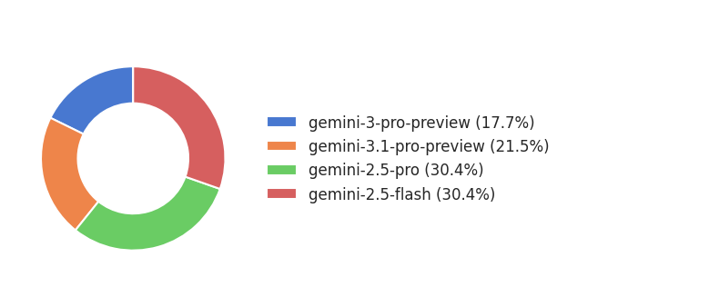](report_assets_20260305_194902/model_usage_pie_4K.png)
<br>


**Latency Distribution by Category**<br>

[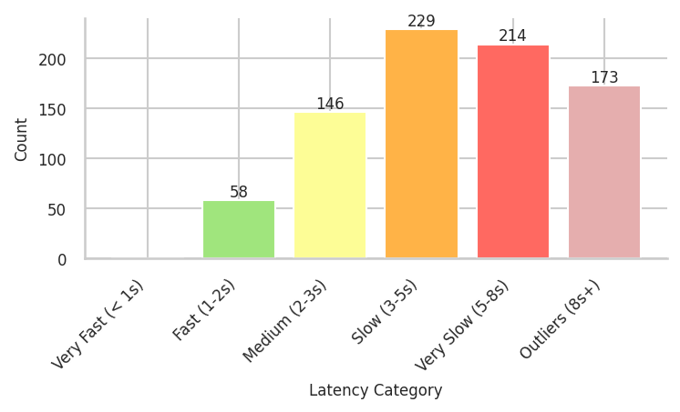](report_assets_20260305_194902/latency_category_dist_4K.png)
<br>


### Model Performance

| **Metric**                     | **gemini-3-pro-preview**   | **gemini-3.1-pro-preview**   | **gemini-2.5-pro**   | **gemini-2.5-flash**   |
|:-------------------------------|:---------------------------|:-----------------------------|:---------------------|:-----------------------|
| Total Requests                 | 154                        | 187                          | 264                  | 264                    |
| Mean Latency (s)               | 12.66                      | 8.87                         | 8.153                | 3.697                  |
| Std Deviation (s)              | 11.215                     | 8.887                        | 14.836               | 3.353                  |
| Median Latency (s)             | 7.604                      | 5.714                        | 4.528                | 2.527                  |
| P95 Latency (s)                | 36.7                       | 33.095                       | 21.783               | 11.519                 |
| P99 Latency (s)                | 51.172                     | 40.647                       | 89.067               | 20.44                  |
| Max Latency (s)                | 51.509                     | 47.201                       | 172.517              | 27.263                 |
| Outliers 2 STD Count (Percent) | 10 (6.5%)                  | 18 (9.6%)                    | 5 (1.9%)             | 14 (5.3%)              |
| Outliers 3 STD Count (Percent) | 3 (1.9%)                   | 5 (2.7%)                     | 4 (1.5%)             | 6 (2.3%)               |

<br>


### Model Latency Sequences

The following charts display the pure LLM execution latency (excluding agent overhead) for each generated response throughout the test run.


**gemini-2.5-flash LLM Latency Sequence (Request Order)**<br>

[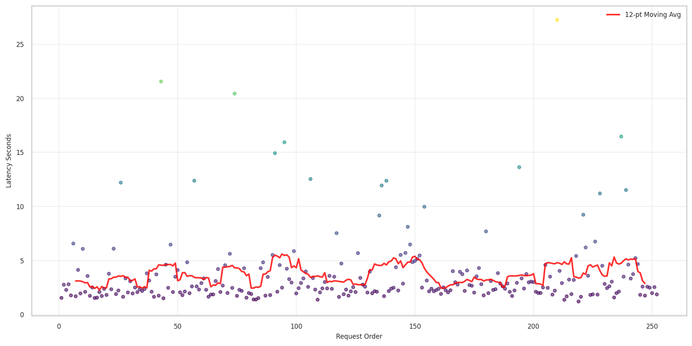](report_assets_20260305_194902/seq_model_gemini-2_5-flash_4K.png)
<br>


**gemini-2.5-pro LLM Latency Sequence (Request Order)**<br>

[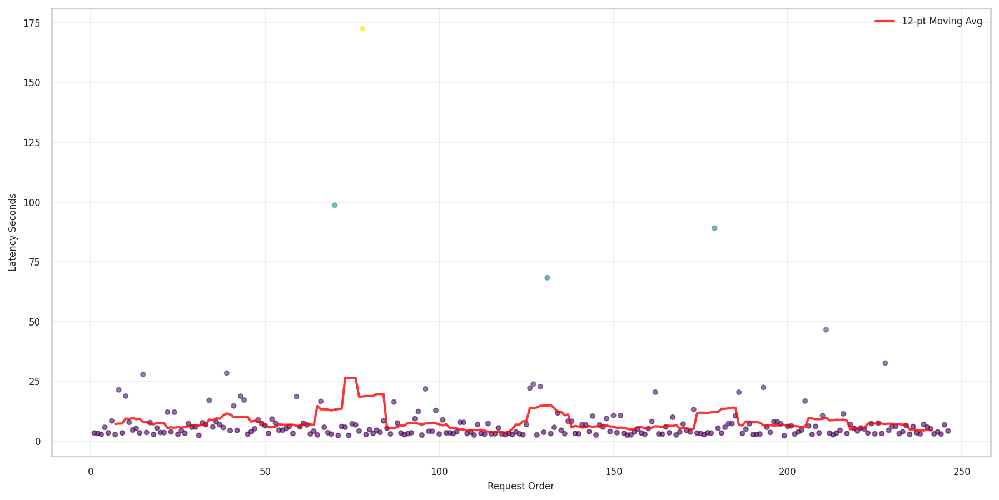](report_assets_20260305_194902/seq_model_gemini-2_5-pro_4K.png)
<br>


**gemini-3-pro-preview LLM Latency Sequence (Request Order)**<br>

[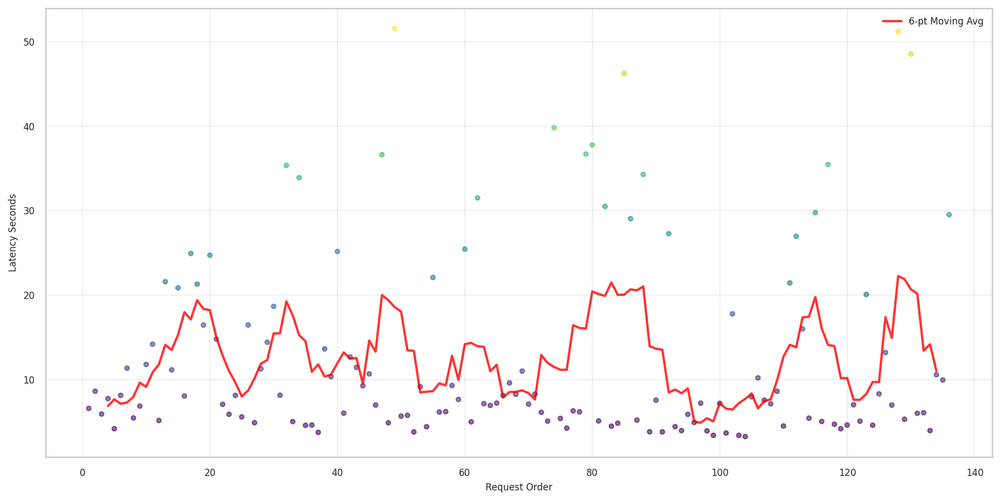](report_assets_20260305_194902/seq_model_gemini-3-pro-preview_4K.png)
<br>


**gemini-3.1-pro-preview LLM Latency Sequence (Request Order)**<br>

[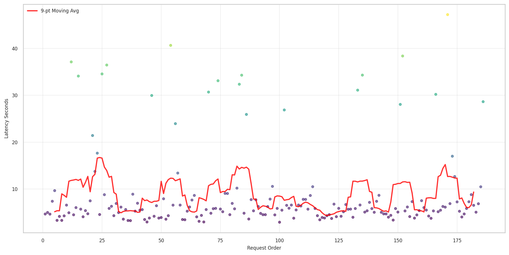](report_assets_20260305_194902/seq_model_gemini-3_1-pro-preview_4K.png)
<br>


### Token Statistics

| **Metric**                           | **gemini-3-pro-preview**   | **gemini-3.1-pro-preview**   | **gemini-2.5-pro**   | **gemini-2.5-flash**   |
|:-------------------------------------|:---------------------------|:-----------------------------|:---------------------|:-----------------------|
| **Amount of Requests**               | 154                        | 187                          | 264                  | 264                    |
| **Mean Input Tokens**                | 3993.97                    | 1806.20                      | 4672.57              | 11705.90               |
| **P95 Input Tokens**                 | 13315.00                   | 13307.00                     | 14945.00             | 105211.00              |
| **Mean Thought Tokens**              | 632.50                     | 362.65                       | 320.24               | 227.62                 |
| **P95 Thought Tokens**               | 1726.00                    | 1569.00                      | 850.00               | 633.00                 |
| **Mean Output Tokens**               | 184.38                     | 104.96                       | 86.14                | 82.12                  |
| **P95 Output Tokens**                | 1042.00                    | 622.00                       | 578.00               | 440.00                 |
| **Median Output Tokens**             | 24.00                      | 48.00                        | 14.00                | 25.00                  |
| **Min Output Tokens**                | 17.00                      | 10.00                        | 6.00                 | 12.00                  |
| **Max Output Tokens**                | 1280.00                    | 936.00                       | 3185.00              | 1425.00                |
| **Mean Total Tokens**                | 4810.85                    | 2268.73                      | 5130.05              | 12038.18               |
| **Latency vs Output Corr.**          | 0.894                      | 0.924                        | 0.299                | 0.645                  |
| **Latency vs Output+Thinking Corr.** | 0.851                      | 0.959                        | 0.695                | 0.927                  |
| **Correlation Strength**             | 🟧 **Strong**              | 🟧 **Strong**                | 🟨 **Moderate**      | 🟧 **Strong**          |

<br>


### Token Usage Breakdown per Model

The charts below display the average token consumption per request, broken down by **Input**, **Thought**, and **Output** tokens for each Agent using a specific Model.

> [!NOTE]
> This data is aggregated by calculating the mean token counts across all raw LLM events for the given Agent and Model combination.


**Token Breakdown for gemini-2.5-flash**<br>

[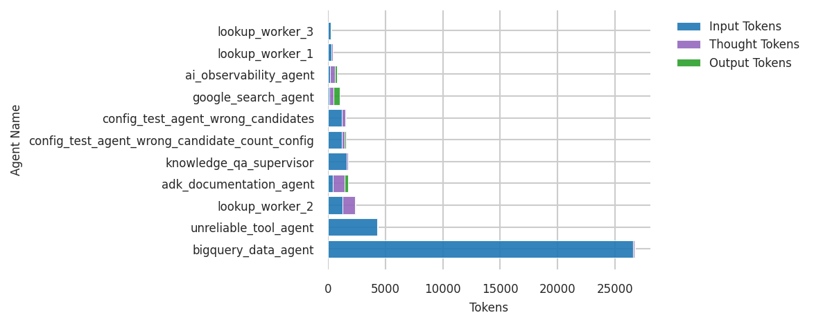](report_assets_20260305_194902/token_usage_gemini-2_5-flash_4K.png)
<br>


**Token Breakdown for gemini-2.5-pro**<br>

[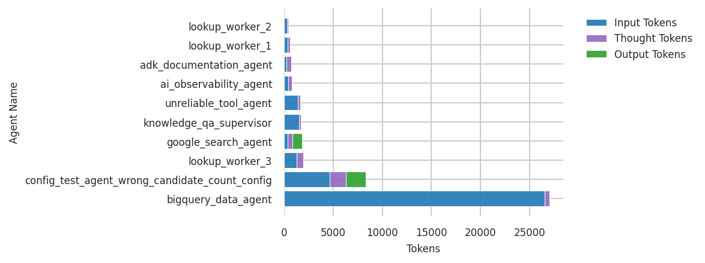](report_assets_20260305_194902/token_usage_gemini-2_5-pro_4K.png)
<br>


**Token Breakdown for gemini-3-pro-preview**<br>

[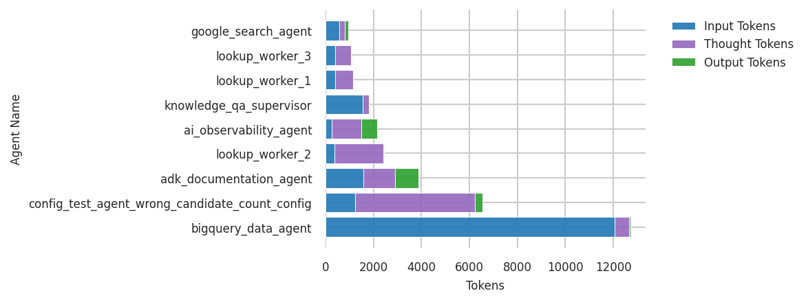](report_assets_20260305_194902/token_usage_gemini-3-pro-preview_4K.png)
<br>


**Token Breakdown for gemini-3.1-pro-preview**<br>

[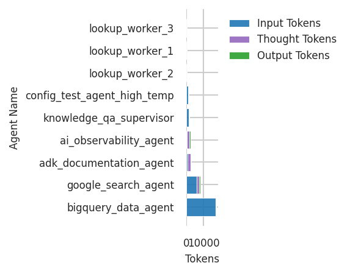](report_assets_20260305_194902/token_usage_gemini-3_1-pro-preview_4K.png)
<br>


### Requests Distribution


**gemini-2.5-flash**

| **Category**         |   **Count** | **Percentage**   |
|:---------------------|------------:|:-----------------|
| **Very Fast (< 1s)** |           0 | 0.0%             |
| **Fast (1-2s)**      |          58 | 23.0%            |
| **Medium (2-3s)**    |          97 | 38.5%            |
| **Slow (3-5s)**      |          60 | 23.8%            |
| **Very Slow (5-8s)** |          19 | 7.5%             |
| **Outliers (8s+)**   |          18 | 7.1%             |


<pre><code class="language-mermaid">xychart-beta
    title "Latency Distribution: gemini-2.5-flash"
    x-axis ["0-1s", "1-2s", "2-3s", "3-5s", "5-8s", "8s+"]
    y-axis "Count" 0 --> 98
    bar [0, 58, 97, 60, 19, 18]
</code></pre>


<br>


**gemini-2.5-pro**

| **Category**         |   **Count** | **Percentage**   |
|:---------------------|------------:|:-----------------|
| **Very Fast (< 1s)** |           0 | 0.0%             |
| **Fast (1-2s)**      |           0 | 0.0%             |
| **Medium (2-3s)**    |          46 | 18.7%            |
| **Slow (3-5s)**      |          82 | 33.3%            |
| **Very Slow (5-8s)** |          68 | 27.6%            |
| **Outliers (8s+)**   |          50 | 20.3%            |


<pre><code class="language-mermaid">xychart-beta
    title "Latency Distribution: gemini-2.5-pro"
    x-axis ["0-1s", "1-2s", "2-3s", "3-5s", "5-8s", "8s+"]
    y-axis "Count" 0 --> 83
    bar [0, 0, 46, 82, 68, 50]
</code></pre>


<br>


**gemini-3-pro-preview**

| **Category**         |   **Count** | **Percentage**   |
|:---------------------|------------:|:-----------------|
| **Very Fast (< 1s)** |           0 | 0.0%             |
| **Fast (1-2s)**      |           0 | 0.0%             |
| **Medium (2-3s)**    |           0 | 0.0%             |
| **Slow (3-5s)**      |          27 | 19.9%            |
| **Very Slow (5-8s)** |          43 | 31.6%            |
| **Outliers (8s+)**   |          66 | 48.5%            |


<pre><code class="language-mermaid">xychart-beta
    title "Latency Distribution: gemini-3-pro-preview"
    x-axis ["0-1s", "1-2s", "2-3s", "3-5s", "5-8s", "8s+"]
    y-axis "Count" 0 --> 67
    bar [0, 0, 0, 27, 43, 66]
</code></pre>


<br>


**gemini-3.1-pro-preview**

| **Category**         |   **Count** | **Percentage**   |
|:---------------------|------------:|:-----------------|
| **Very Fast (< 1s)** |           0 | 0.0%             |
| **Fast (1-2s)**      |           0 | 0.0%             |
| **Medium (2-3s)**    |           3 | 1.6%             |
| **Slow (3-5s)**      |          60 | 32.3%            |
| **Very Slow (5-8s)** |          84 | 45.2%            |
| **Outliers (8s+)**   |          39 | 21.0%            |


<pre><code class="language-mermaid">xychart-beta
    title "Latency Distribution: gemini-3.1-pro-preview"
    x-axis ["0-1s", "1-2s", "2-3s", "3-5s", "5-8s", "8s+"]
    y-axis "Count" 0 --> 85
    bar [0, 0, 3, 60, 84, 39]
</code></pre>


<br>


---


## System Bottlenecks & Impact


The #1 bottleneck identified is a single invocation of the `ai_observability_agent` which took **172.5 seconds** as seen in trace [`844d33bab4c069bf005ece6b9c112f12`](https://console.cloud.google.com/traces/explorer;traceId=844d33bab4c069bf005ece6b9c112f12?project=agent-operations-ek-01). This single agent call, dominated by a `gemini-2.5-pro` model hang, consumed 97.7% of the total 176.7s end-to-end transaction time, representing a critical point of failure.


### Slowest Invocations

| Rank                 | Timestamp           | Root Agent                  |   Duration (s) | Status   | User Message                                                                                                     | Session ID                           | Trace ID                                                                                                                                                       |
|:---------------------|:--------------------|:----------------------------|---------------:|:---------|:-----------------------------------------------------------------------------------------------------------------|:-------------------------------------|:---------------------------------------------------------------------------------------------------------------------------------------------------------------|
| **[1](#rca-root-1)** | 2026-02-24 17:48:56 | **knowledge_qa_supervisor** |        176.677 | 🟢       | Explain the benefits of AI agent tracing.                                                                        | 0211bbc5-c4e0-4f44-9c32-7515b43ae0b0 | [`844d33bab4c069bf005ece6b9c112f12`](https://console.cloud.google.com/traces/explorer;traceId=844d33bab4c069bf005ece6b9c112f12?project=agent-operations-ek-01) |
| **[2](#rca-root-2)** | 2026-02-24 08:15:52 | **knowledge_qa_supervisor** |        127.054 | 🟢       | First, get the top 5 most recent BigQuery errors. Then, search for solutions for the most frequent error online. | 5be5fd3f-f0fe-4533-8348-956e96f6a0bf | [`c9f325d3ea9bddccb75a164ffc5fd14a`](https://console.cloud.google.com/traces/explorer;traceId=c9f325d3ea9bddccb75a164ffc5fd14a?project=agent-operations-ek-01) |
| **[3](#rca-root-3)** | 2026-02-24 17:46:53 | **knowledge_qa_supervisor** |        122.414 | 🟢       | Get item_1, large_record_F.                                                                                      | 0211bbc5-c4e0-4f44-9c32-7515b43ae0b0 | [`7ea524f3af9eb39fb531333ceb19b7cd`](https://console.cloud.google.com/traces/explorer;traceId=7ea524f3af9eb39fb531333ceb19b7cd?project=agent-operations-ek-01) |
| **[4](#rca-root-4)** | 2026-02-24 18:11:33 | **knowledge_qa_supervisor** |        105.971 | 🟢       | Get item_1, large_record_F.                                                                                      | 32bada90-68fc-41b8-bf26-25dda1f25587 | [`da2332ca93b91bac6cf7afc54a31c848`](https://console.cloud.google.com/traces/explorer;traceId=da2332ca93b91bac6cf7afc54a31c848?project=agent-operations-ek-01) |
| **[5](#rca-root-5)** | 2026-02-24 18:11:33 | **knowledge_qa_supervisor** |        105.971 | 🟢       | Get item_1, large_record_F.                                                                                      | 32bada90-68fc-41b8-bf26-25dda1f25587 | [`da2332ca93b91bac6cf7afc54a31c848`](https://console.cloud.google.com/traces/explorer;traceId=da2332ca93b91bac6cf7afc54a31c848?project=agent-operations-ek-01) |

<br>

**Detailed RCA Analysis:**

- <a id="rca-root-1"></a>**Rank 1**: The trace status is 'OK', but the excessive duration of ~177 seconds for a QA task indicates a severe performance bottleneck or an internal loop, causing a functional timeout or user-perceived failure despite the agent eventually completing its task.

- <a id="rca-root-2"></a>**Rank 2**: The supervisor agent's excessive duration (127s) for a status 'OK' trace indicates it performed a long-running, monolithic execution instead of delegating tasks. This architectural misapplication blocks the orchestration layer, causing severe performance degradation and risk of upstream timeouts.

- <a id="rca-root-3"></a>**Rank 3**: The request to retrieve 'large_record_F' experienced a performance failure by exceeding the likely 120-second timeout, as shown by the 122.4s duration. The root cause is the system's inability to process and return the large payload within the configured timeout window, resulting in a critical latency bottleneck.

- <a id="rca-root-4"></a>**Rank 4**: The request to retrieve a large data object (`large_record_F`) took an excessive amount of time (~106 seconds), indicating a severe performance issue in the data retrieval or processing layer. Although the operation completed with an 'OK' status, this extreme latency constitutes a practical failure, likely causing a user-perceived timeout or system unresponsiveness.

- <a id="rca-root-5"></a>**Rank 5**: RCA Generation failed.

<br>


### Slowest Agent queries

| **Rank**              | **Timestamp**       | **Name**                   |   **Latency (s)** | **Status**   | **User Message**                                                                                                 | **Root Agent**              |   **E2E (s)** | **Root Status**   | **Impact (%)**   | **Session ID**                       | **Trace ID**                                                                                                                                                   | **Span ID**                                                                                                                                                            |
|:----------------------|:--------------------|:---------------------------|------------------:|:-------------|:-----------------------------------------------------------------------------------------------------------------|:----------------------------|--------------:|:------------------|:-----------------|:-------------------------------------|:---------------------------------------------------------------------------------------------------------------------------------------------------------------|:-----------------------------------------------------------------------------------------------------------------------------------------------------------------------|
| **[1](#rca-agent-1)** | 2026-02-24 17:49:00 | **ai_observability_agent** |           172.527 | 🟢           | Explain the benefits of AI agent tracing.                                                                        | **knowledge_qa_supervisor** |       176.677 | 🟢                | 97.7%            | 0211bbc5-c4e0-4f44-9c32-7515b43ae0b0 | [`844d33bab4c069bf005ece6b9c112f12`](https://console.cloud.google.com/traces/explorer;traceId=844d33bab4c069bf005ece6b9c112f12?project=agent-operations-ek-01) | [`2595d3f89c40d5a6`](https://console.cloud.google.com/traces/explorer;traceId=844d33bab4c069bf005ece6b9c112f12;spanId=2595d3f89c40d5a6?project=agent-operations-ek-01) |
| **[2](#rca-agent-2)** | 2026-02-24 08:15:58 | **bigquery_data_agent**    |           120.422 | 🟢           | First, get the top 5 most recent BigQuery errors. Then, search for solutions for the most frequent error online. | **knowledge_qa_supervisor** |       127.054 | 🟢                | 94.8%            | 5be5fd3f-f0fe-4533-8348-956e96f6a0bf | [`c9f325d3ea9bddccb75a164ffc5fd14a`](https://console.cloud.google.com/traces/explorer;traceId=c9f325d3ea9bddccb75a164ffc5fd14a?project=agent-operations-ek-01) | [`edf19dd3a8b01b56`](https://console.cloud.google.com/traces/explorer;traceId=c9f325d3ea9bddccb75a164ffc5fd14a;spanId=edf19dd3a8b01b56?project=agent-operations-ek-01) |
| **[3](#rca-agent-3)** | 2026-02-24 17:46:59 | **parallel_db_lookup**     |           116.699 | 🟢           | Get item_1, large_record_F.                                                                                      | **knowledge_qa_supervisor** |       122.414 | 🟢                | 95.3%            | 0211bbc5-c4e0-4f44-9c32-7515b43ae0b0 | [`7ea524f3af9eb39fb531333ceb19b7cd`](https://console.cloud.google.com/traces/explorer;traceId=7ea524f3af9eb39fb531333ceb19b7cd?project=agent-operations-ek-01) | [`5c7f5ea5b2b723ec`](https://console.cloud.google.com/traces/explorer;traceId=7ea524f3af9eb39fb531333ceb19b7cd;spanId=5c7f5ea5b2b723ec?project=agent-operations-ek-01) |
| **[4](#rca-agent-4)** | 2026-02-24 17:46:59 | **lookup_worker_3**        |           116.662 | 🟢           | Get item_1, large_record_F.                                                                                      | **knowledge_qa_supervisor** |       122.414 | 🟢                | 95.3%            | 0211bbc5-c4e0-4f44-9c32-7515b43ae0b0 | [`7ea524f3af9eb39fb531333ceb19b7cd`](https://console.cloud.google.com/traces/explorer;traceId=7ea524f3af9eb39fb531333ceb19b7cd?project=agent-operations-ek-01) | [`a69e17feeac07e2a`](https://console.cloud.google.com/traces/explorer;traceId=7ea524f3af9eb39fb531333ceb19b7cd;spanId=a69e17feeac07e2a?project=agent-operations-ek-01) |
| **[5](#rca-agent-5)** | 2026-02-24 18:17:54 | **unreliable_tool_agent**  |            93.167 | 🟢           | Simulate a flaky action for 'test case 1'.                                                                       | **knowledge_qa_supervisor** |        96.284 | 🟢                | 96.8%            | a90aa3a5-4cda-4496-bae5-568b438ed53a | [`2cf2baefdda0e144915410461a4feaba`](https://console.cloud.google.com/traces/explorer;traceId=2cf2baefdda0e144915410461a4feaba?project=agent-operations-ek-01) | [`70603558484a72b7`](https://console.cloud.google.com/traces/explorer;traceId=2cf2baefdda0e144915410461a4feaba;spanId=70603558484a72b7?project=agent-operations-ek-01) |

<br>

**Detailed RCA Analysis:**

- <a id="rca-agent-1"></a>**Rank 1**: RCA Generation failed.

- <a id="rca-agent-2"></a>**Rank 2**: The span's excessive duration of 120.4 seconds indicates a severe performance bottleneck or an unhandled timeout that breached an execution SLO; this functional failure occurred despite the 'OK' status being reported, likely due to an inefficient Big...

- <a id="rca-agent-3"></a>**Rank 3**: The `parallel_db_lookup` agent received an empty `instruction` from the parent `knowledge_qa_supervisor`, causing the agent to stall for ~117 seconds due to a lack of input validation or a faulty default behavior. This state propagation failure from ...

- <a id="rca-agent-4"></a>**Rank 4**: RCA Generation failed.

- <a id="rca-agent-5"></a>**Rank 5**: RCA Generation failed.

<br>


### Slowest LLM queries

| **Rank**            | **Timestamp**       |   **LLM (s)** |   **TTFT (s)** | **Model Name**     | **LLM Status**   |   **Input** |   **Output** |   **Thought** |   **Total Tokens** | **Response Text**           | **Agent Name**              |   **Agent (s)** | **Agent Status impact**   | **Root Agent Name**         |   **E2E (s)** | **Root Status**   | **Impact %**   | **User Message**                           | **Session ID**                       | **Trace ID**                                                                                                                                                   | **Span ID**                                                                                                                                                            |
|:--------------------|:--------------------|--------------:|---------------:|:-------------------|:-----------------|------------:|-------------:|--------------:|-------------------:|:----------------------------|:----------------------------|----------------:|:--------------------------|:----------------------------|--------------:|:------------------|:---------------|:-------------------------------------------|:-------------------------------------|:---------------------------------------------------------------------------------------------------------------------------------------------------------------|:-----------------------------------------------------------------------------------------------------------------------------------------------------------------------|
| **[1](#rca-llm-1)** | 2026-02-24 17:49:00 |       172.517 |        172.517 | **gemini-2.5-pro** | 🟢               |         803 |            0 |           257 |               1060 | other                       | **ai_observability_agent**  |         172.527 | 🟢                        | **knowledge_qa_supervisor** |       176.677 | 🟢                | 97.6%          | Explain the benefits of AI agent tracing.  | 0211bbc5-c4e0-4f44-9c32-7515b43ae0b0 | [`844d33bab4c069bf005ece6b9c112f12`](https://console.cloud.google.com/traces/explorer;traceId=844d33bab4c069bf005ece6b9c112f12?project=agent-operations-ek-01) | [`5f1efe0671a78fb7`](https://console.cloud.google.com/traces/explorer;traceId=844d33bab4c069bf005ece6b9c112f12;spanId=5f1efe0671a78fb7?project=agent-operations-ek-01) |
| **[2](#rca-llm-2)** | 2026-02-24 17:46:59 |        98.609 |         98.609 | **gemini-2.5-pro** | 🟢               |         140 |           14 |          9316 |               9470 | call: simulated_db_lookup   | **lookup_worker_3**         |         116.662 | 🟢                        | **knowledge_qa_supervisor** |       122.414 | 🟢                | 80.6%          | Get item_1, large_record_F.                | 0211bbc5-c4e0-4f44-9c32-7515b43ae0b0 | [`7ea524f3af9eb39fb531333ceb19b7cd`](https://console.cloud.google.com/traces/explorer;traceId=7ea524f3af9eb39fb531333ceb19b7cd?project=agent-operations-ek-01) | [`b359b5b4a187f790`](https://console.cloud.google.com/traces/explorer;traceId=7ea524f3af9eb39fb531333ceb19b7cd;spanId=b359b5b4a187f790?project=agent-operations-ek-01) |
| **[3](#rca-llm-3)** | 2026-02-24 18:17:54 |        89.067 |         89.067 | **gemini-2.5-pro** | 🟢               |        1194 |           11 |           128 |               1333 | call: flaky_tool_simulation | **unreliable_tool_agent**   |          93.167 | 🟢                        | **knowledge_qa_supervisor** |        96.284 | 🟢                | 92.5%          | Simulate a flaky action for 'test case 1'. | a90aa3a5-4cda-4496-bae5-568b438ed53a | [`2cf2baefdda0e144915410461a4feaba`](https://console.cloud.google.com/traces/explorer;traceId=2cf2baefdda0e144915410461a4feaba?project=agent-operations-ek-01) | [`4d9f939b30b330d8`](https://console.cloud.google.com/traces/explorer;traceId=2cf2baefdda0e144915410461a4feaba;spanId=4d9f939b30b330d8?project=agent-operations-ek-01) |
| **[4](#rca-llm-4)** | 2026-02-24 18:11:33 |        68.323 |         68.323 | **gemini-2.5-pro** | 🟢               |        1401 |           13 |           460 |               1874 | call: transfer_to_agent     | **knowledge_qa_supervisor** |         105.97  | 🟢                        | **knowledge_qa_supervisor** |       105.971 | 🟢                | 64.5%          | Get item_1, large_record_F.                | 32bada90-68fc-41b8-bf26-25dda1f25587 | [`da2332ca93b91bac6cf7afc54a31c848`](https://console.cloud.google.com/traces/explorer;traceId=da2332ca93b91bac6cf7afc54a31c848?project=agent-operations-ek-01) | [`f44babdce1635b31`](https://console.cloud.google.com/traces/explorer;traceId=da2332ca93b91bac6cf7afc54a31c848;spanId=f44babdce1635b31?project=agent-operations-ek-01) |
| **[5](#rca-llm-5)** | 2026-02-24 18:11:33 |        68.323 |         68.323 | **gemini-2.5-pro** | 🟢               |        1401 |           13 |           460 |               1874 | call: transfer_to_agent     | **knowledge_qa_supervisor** |         105.97  | 🟢                        | **knowledge_qa_supervisor** |       105.971 | 🟢                | 64.5%          | Get item_1, large_record_F.                | 32bada90-68fc-41b8-bf26-25dda1f25587 | [`da2332ca93b91bac6cf7afc54a31c848`](https://console.cloud.google.com/traces/explorer;traceId=da2332ca93b91bac6cf7afc54a31c848?project=agent-operations-ek-01) | [`f44babdce1635b31`](https://console.cloud.google.com/traces/explorer;traceId=da2332ca93b91bac6cf7afc54a31c848;spanId=f44babdce1635b31?project=agent-operations-ek-01) |

<br>

**Detailed RCA Analysis:**

- <a id="rca-llm-1"></a>**Rank 1**: The LLM call experienced a service-side timeout or internal processing hang, as evidenced by the time-to-first-token (172.5s) being identical to the total span duration. This caused a non-generative, default response ('other') to be returned instead of a valid answer, leading to functional failure of the agent's task.

- <a id="rca-llm-2"></a>**Rank 2**: The LLM call experienced severe latency (98.6s TTFT) due to the model generating an excessive number of internal "thought" tokens (9,316) before producing a simple 14-token output. This disproportionate internal monologue created a significant generation bottleneck, likely due to an inefficient prompt or model configuration, despite the span's functional status being "OK".

- <a id="rca-llm-3"></a>**Rank 3**: The `gemini-2.5-pro` model call for the `unreliable_tool_agent` took 89.067 seconds to generate the first token, as evidenced by `time_to_first_token_ms` equaling `duration_ms`. This indicates a severe model-side performance issue or hang during the agent's thought process, causing a functional timeout before any tool execution could be initiated.

- <a id="rca-llm-4"></a>**Rank 4**: The LLM call to `gemini-2.5-pro` experienced extreme generation latency, with the Time To First Token (TTFT) of 68.3 seconds consuming the entire span duration. This indicates a severe performance issue or 'cold start' within the model provider's infrastructure, which critically delayed the agent's routing decision despite the request eventually completing with an OK status.

- <a id="rca-llm-5"></a>**Rank 5**: The `knowledge_qa_supervisor` agent's LLM call exhibited a 68-second Time-To-First-Token, indicating the entire duration was spent processing an excessively long and complex routing prompt before generating a response. This severe latency on a simple routing task was caused by prompt complexity, not an external tool failure, leading to a user-facing performance degradation.

<br>


### Slowest Tools Queries

| **Rank**             | **Timestamp**       |   **Tool (s)** | **Tool Name**             | **Tool Status**   | **Arguments**                                           | **Result**                                                                                                             | **Agent Name**            |   **Agent (s)** | **Agent Status**   |   **Impact %** | **Root Agent**          |   **E2E (s)** | **Root Status**   |   **Impact %** | **User Message**                                    | **Session ID**                       | **Trace ID**                                                                                                                                                   | **Span ID**                                                                                                                                                            |
|:---------------------|:--------------------|---------------:|:--------------------------|:------------------|:--------------------------------------------------------|:-----------------------------------------------------------------------------------------------------------------------|:--------------------------|----------------:|:-------------------|---------------:|:------------------------|--------------:|:------------------|---------------:|:----------------------------------------------------|:-------------------------------------|:---------------------------------------------------------------------------------------------------------------------------------------------------------------|:-----------------------------------------------------------------------------------------------------------------------------------------------------------------------|
| **[1](#rca-tool-1)** | 2026-02-24 18:09:24 |          9.416 | **flaky_tool_simulation** | 🔴                | `{"query":"very_slow_topic"}`                           | N/A                                                                                                                    | **unreliable_tool_agent** |         nan     | 🔴                 |           0    | knowledge_qa_supervisor |       nan     | 🔴                |           0    | Try the unreliable tool with very_slow_topic input. | 9ec1a54f-52c9-4659-906e-15e7e0380fed | [`bf46dbf39dc20547ec31b2e3ae73c6be`](https://console.cloud.google.com/traces/explorer;traceId=bf46dbf39dc20547ec31b2e3ae73c6be?project=agent-operations-ek-01) | [`8f579c4071f0b24a`](https://console.cloud.google.com/traces/explorer;traceId=bf46dbf39dc20547ec31b2e3ae73c6be;spanId=8f579c4071f0b24a?project=agent-operations-ek-01) |
| **[2](#rca-tool-2)** | 2026-02-24 17:44:20 |          6.306 | **flaky_tool_simulation** | 🟢                | `{"query":"very_slow_topic"}`                           | "Simulated unreliable_tool results for: very_slow_topic. More details can be found by searching for specific aspects." | **unreliable_tool_agent** |          13.268 | 🟢                 |          47.53 | knowledge_qa_supervisor |        15.064 | 🟢                |          41.86 | Try the unreliable tool with very_slow_topic input. | 6fbf143d-81aa-4463-b1db-57e25e979085 | [`81609a6be7bf2b1f6e170df45a76a266`](https://console.cloud.google.com/traces/explorer;traceId=81609a6be7bf2b1f6e170df45a76a266?project=agent-operations-ek-01) | [`1e738ab3bfbe0c05`](https://console.cloud.google.com/traces/explorer;traceId=81609a6be7bf2b1f6e170df45a76a266;spanId=1e738ab3bfbe0c05?project=agent-operations-ek-01) |
| **[3](#rca-tool-3)** | 2026-02-24 18:08:47 |          6.222 | **flaky_tool_simulation** | 🟢                | `{"query":"very_slow_topic"}`                           | "Simulated unreliable_tool results for: very_slow_topic. More details can be found by searching for specific aspects." | **unreliable_tool_agent** |          10.159 | 🟢                 |          61.25 | knowledge_qa_supervisor |        13.081 | 🟢                |          47.57 | Try the unreliable tool with very_slow_topic input. | 8a2023d6-8b63-4a7a-8855-d6ee7def251f | [`3b8c10c1fd8f88b341a1d5966c706c07`](https://console.cloud.google.com/traces/explorer;traceId=3b8c10c1fd8f88b341a1d5966c706c07?project=agent-operations-ek-01) | [`dd451a6d489f21a6`](https://console.cloud.google.com/traces/explorer;traceId=3b8c10c1fd8f88b341a1d5966c706c07;spanId=dd451a6d489f21a6?project=agent-operations-ek-01) |
| **[4](#rca-tool-4)** | 2026-02-24 18:17:57 |          5.975 | **flaky_tool_simulation** | 🔴                | `{"query":"Simulate a flaky action for 'test case 1'"}` | N/A                                                                                                                    | **unreliable_tool_agent** |         nan     | 🔴                 |           0    | knowledge_qa_supervisor |       nan     | 🔴                |           0    | Simulate a flaky action for 'test case 1'.          | 7f22ec4f-15c2-45e3-9f2f-30950f9a82c3 | [`c1a31dc41240d3f36d968c9a340b4e78`](https://console.cloud.google.com/traces/explorer;traceId=c1a31dc41240d3f36d968c9a340b4e78?project=agent-operations-ek-01) | [`df8428b97374a906`](https://console.cloud.google.com/traces/explorer;traceId=c1a31dc41240d3f36d968c9a340b4e78;spanId=df8428b97374a906?project=agent-operations-ek-01) |
| **[5](#rca-tool-5)** | 2026-02-24 18:17:57 |          5.975 | **flaky_tool_simulation** | 🔴                | `{"query":"Simulate a flaky action for 'test case 1'"}` | N/A                                                                                                                    | **unreliable_tool_agent** |         nan     | 🔴                 |           0    | knowledge_qa_supervisor |        27.6   | 🟢                |          21.65 | Describe event logging in AI agents.                | 7f22ec4f-15c2-45e3-9f2f-30950f9a82c3 | [`c1a31dc41240d3f36d968c9a340b4e78`](https://console.cloud.google.com/traces/explorer;traceId=c1a31dc41240d3f36d968c9a340b4e78?project=agent-operations-ek-01) | [`df8428b97374a906`](https://console.cloud.google.com/traces/explorer;traceId=c1a31dc41240d3f36d968c9a340b4e78;spanId=df8428b97374a906?project=agent-operations-ek-01) |

<br>

**Detailed RCA Analysis:**

- <a id="rca-tool-1"></a>**Rank 1**: The `unreliable_tool_agent`'s call to the `flaky_tool_simulation` tool with query 'very_slow_topic' exceeded the configured execution timeout threshold (~9.4s). This failure prevented the agent from obtaining a result, causing a cascading error that terminated the agent's task and failed the root trace.

- <a id="rca-tool-2"></a>**Rank 2**: The `flaky_tool_simulation` tool call succeeded but exhibited high latency (6306ms) when processing the 'very_slow_topic' query, introducing a performance bottleneck. This single-span latency comprised a substantial portion of the total trace duration (15064ms), increasing the risk of upstream timeouts despite the 'OK' status.

- <a id="rca-tool-3"></a>**Rank 3**: The `flaky_tool_simulation` tool call had a high duration of 6222ms, dominating the total execution time for the `unreliable_tool_agent` (10159ms) and causing significant end-to-end latency despite the operation completing with an 'OK' status.

- <a id="rca-tool-4"></a>**Rank 4**: The `flaky_tool_simulation` tool failed to respond within the configured timeout period, causing the `unreliable_tool_agent` span to error out after ~6 seconds. This tool-level failure prevented the agent from receiving a result, which propagated the error state and caused the entire trace to fail.

- <a id="rca-tool-5"></a>**Rank 5**: The `unreliable_tool_agent`'s invocation of the `flaky_tool_simulation` tool exceeded its configured timeout threshold of approximately 6 seconds, causing the span to fail. This indicates the downstream tool is either unresponsive or experiencing high latency, preventing the agent from completing its sub-task.

<br>


## Error Analysis


Error analysis reveals a cascade of failures originating from three primary sources. The most frequent root error is `Invocation PENDING for > 5 minutes (Timed Out)`, indicating systemic worker pool saturation or orchestration failure. The second category is configuration errors, exemplified by the `ai_observability_agent` failing with `404 NOT_FOUND` due to an invalid DataStore ID, and `config_test_agent_wrong_max_tokens` failing with `INVALID_ARGUMENT` due to an out-of-range `max_output_tokens` value. Finally, tool execution timeouts, particularly from `flaky_tool_simulation`, contribute significantly to agent-level errors.


### Root Errors

| **Rank**                 | **Timestamp**       | **Category**                 | **Root Agent**              | **Error Message**                              | **User Message**                                       | **Trace ID**                                                                                                                                                   | **Invocation ID**                        |
|:-------------------------|:--------------------|:-----------------------------|:----------------------------|:-----------------------------------------------|:-------------------------------------------------------|:---------------------------------------------------------------------------------------------------------------------------------------------------------------|:-----------------------------------------|
| **[1](#rca-err-root-1)** | 2026-02-26 05:48:24 | Timeout / Pending            | **knowledge_qa_supervisor** | Invocation PENDING for > 5 minutes (Timed Out) | Explain real-time monitoring for AI agents.            | [`c5e16c4e51ff3e77cdc3b359a34ef634`](https://console.cloud.google.com/traces/explorer;traceId=c5e16c4e51ff3e77cdc3b359a34ef634?project=agent-operations-ek-01) | `e-2a1acb7f-69e8-46c4-99dd-7bb23cfb311b` |
| **[2](#rca-err-root-2)** | 2026-02-26 05:48:08 | Timeout / Pending            | **knowledge_qa_supervisor** | Invocation PENDING for > 5 minutes (Timed Out) | What are the key metrics for AI agent health?          | [`c5e16c4e51ff3e77cdc3b359a34ef634`](https://console.cloud.google.com/traces/explorer;traceId=c5e16c4e51ff3e77cdc3b359a34ef634?project=agent-operations-ek-01) | `e-7a394b56-f4e3-43ce-bfca-3ddcb05a6a42` |
| **[3](#rca-err-root-3)** | 2026-02-26 05:41:01 | Invocation Timeout / Pending | **knowledge_qa_supervisor** | Invocation PENDING for > 5 minutes (Timed Out) | Using config WRONG_MAX_TOKENS, calculate for 'test A'. | [`41f0a355df19436af557b9ba2b493a55`](https://console.cloud.google.com/traces/explorer;traceId=41f0a355df19436af557b9ba2b493a55?project=agent-operations-ek-01) | `e-b5651877-39ab-4e8f-b728-070c79526897` |
| **[4](#rca-err-root-4)** | 2026-02-24 18:30:40 | Timeout / Pending            | **knowledge_qa_supervisor** | Invocation PENDING for > 5 minutes (Timed Out) | Explain real-time monitoring for AI agents.            | [`34092d5ff289565a8c24785995906ed6`](https://console.cloud.google.com/traces/explorer;traceId=34092d5ff289565a8c24785995906ed6?project=agent-operations-ek-01) | `e-6ce539c9-8cc1-4b0c-8ff1-45019ee3d958` |
| **[5](#rca-err-root-5)** | 2026-02-24 18:30:25 | Timeout / Pending State      | **knowledge_qa_supervisor** | Invocation PENDING for > 5 minutes (Timed Out) | What are the key metrics for AI agent health?          | [`34092d5ff289565a8c24785995906ed6`](https://console.cloud.google.com/traces/explorer;traceId=34092d5ff289565a8c24785995906ed6?project=agent-operations-ek-01) | `e-d55b11c7-ad1b-487f-acda-630a43bea877` |

<br>

**Detailed RCA Analysis:**

- <a id="rca-err-root-1"></a>**Rank 1**: The agent invocation was queued but never dequeued by a compute worker, exceeding the 5-minute PENDING state timeout before execution could begin. This indicates a critical failure in the orchestration layer or complete saturation of the worker pool, causing the request to be dropped without any processing.

- <a id="rca-err-root-2"></a>**Rank 2**: The agent invocation remained in a PENDING state for over the 5-minute threshold without being dequeued and processed by an available worker, indicating worker pool saturation or a stalled message bus. This timeout is a safeguard that terminated the trace, preventing an indefinite hang but failing the user's request.

- <a id="rca-err-root-3"></a>**Rank 3**: The `knowledge_qa_supervisor` agent's invocation remained in a `PENDING` state for over the 5-minute threshold without being processed, causing a system-level timeout. This indefinite pending state, indicated by the 0ms duration, suggests a hang in pre-execution validation due to a probable misconfiguration (e.g., 'WRONG_MAX_TOKENS') or resource starvation in the worker pool.

- <a id="rca-err-root-4"></a>**Rank 4**: The invocation for the `knowledge_qa_supervisor` agent timed out after remaining in a PENDING state for over 5 minutes, indicating the worker pool was saturated, unresponsive, or scaled to zero. This prevented the task from being dequeued and executed, causing a total processing failure for the request.

- <a id="rca-err-root-5"></a>**Rank 5**: The agent invocation exceeded its 5-minute timeout while in a PENDING state, indicating the task was never picked up by a worker from the queue, likely due to resource starvation or a stalled consumer process. This caused the request to fail before execution could begin, resulting in a 0ms duration.

<br>


---


### Agent Errors

| **Rank**                  | **Timestamp**       | **Category**            | **Agent Name**                         | **Error Message**                              | **Root Agent**              | **Root Status**   | **User Message**                                       | **Trace ID**                                                                                                                                                   | **Span ID**                                                                                                                                                            |
|:--------------------------|:--------------------|:------------------------|:---------------------------------------|:-----------------------------------------------|:----------------------------|:------------------|:-------------------------------------------------------|:---------------------------------------------------------------------------------------------------------------------------------------------------------------|:-----------------------------------------------------------------------------------------------------------------------------------------------------------------------|
| **[1](#rca-err-agent-1)** | 2026-02-26 05:48:30 | Timeout / Pending State | **ai_observability_agent**             | Agent span PENDING for > 5 minutes (Timed Out) | **knowledge_qa_supervisor** | 🔴                | None                                                   | [`05580145e839b7acc31f7720ea565aff`](https://console.cloud.google.com/traces/explorer;traceId=05580145e839b7acc31f7720ea565aff?project=agent-operations-ek-01) | [`beca51663da1ccbc`](https://console.cloud.google.com/traces/explorer;traceId=05580145e839b7acc31f7720ea565aff;spanId=beca51663da1ccbc?project=agent-operations-ek-01) |
| **[2](#rca-err-agent-2)** | 2026-02-26 05:48:14 | Timeout / Pending       | **ai_observability_agent**             | Agent span PENDING for > 5 minutes (Timed Out) | **knowledge_qa_supervisor** | 🔴                | Explain real-time monitoring for AI agents.            | [`c5e16c4e51ff3e77cdc3b359a34ef634`](https://console.cloud.google.com/traces/explorer;traceId=c5e16c4e51ff3e77cdc3b359a34ef634?project=agent-operations-ek-01) | [`db072cc19fa45aa5`](https://console.cloud.google.com/traces/explorer;traceId=c5e16c4e51ff3e77cdc3b359a34ef634;spanId=db072cc19fa45aa5?project=agent-operations-ek-01) |
| **[3](#rca-err-agent-3)** | 2026-02-26 05:48:14 | Configuration Error     | **ai_observability_agent**             | Agent span PENDING for > 5 minutes (Timed Out) | **knowledge_qa_supervisor** | 🔴                | What are the key metrics for AI agent health?          | [`c5e16c4e51ff3e77cdc3b359a34ef634`](https://console.cloud.google.com/traces/explorer;traceId=c5e16c4e51ff3e77cdc3b359a34ef634?project=agent-operations-ek-01) | [`db072cc19fa45aa5`](https://console.cloud.google.com/traces/explorer;traceId=c5e16c4e51ff3e77cdc3b359a34ef634;spanId=db072cc19fa45aa5?project=agent-operations-ek-01) |
| **[4](#rca-err-agent-4)** | 2026-02-26 05:41:03 | Generation Failed       | **config_test_agent_wrong_max_tokens** | Agent span PENDING for > 5 minutes (Timed Out) | **knowledge_qa_supervisor** | 🔴                | Using config WRONG_MAX_TOKENS, calculate for 'test A'. | [`41f0a355df19436af557b9ba2b493a55`](https://console.cloud.google.com/traces/explorer;traceId=41f0a355df19436af557b9ba2b493a55?project=agent-operations-ek-01) | [`75057cc437eca79d`](https://console.cloud.google.com/traces/explorer;traceId=41f0a355df19436af557b9ba2b493a55;spanId=75057cc437eca79d?project=agent-operations-ek-01) |
| **[5](#rca-err-agent-5)** | 2026-02-24 18:30:44 | Timeout / Pending       | **ai_observability_agent**             | Agent span PENDING for > 5 minutes (Timed Out) | **knowledge_qa_supervisor** | 🔴                | None                                                   | [`6e722d2ee482472a74d9774b994a0453`](https://console.cloud.google.com/traces/explorer;traceId=6e722d2ee482472a74d9774b994a0453?project=agent-operations-ek-01) | [`d94e8db1170b1c7e`](https://console.cloud.google.com/traces/explorer;traceId=6e722d2ee482472a74d9774b994a0453;spanId=d94e8db1170b1c7e?project=agent-operations-ek-01) |

<br>

**Detailed RCA Analysis:**

- <a id="rca-err-agent-1"></a>**Rank 1**: The agent span timed out after remaining in a PENDING state for over 5 minutes, indicating it was queued but never acquired an execution worker due to resource saturation or a deadlock in the agent orchestration system. This prevented the agent's logic from ever running, causing the parent task to fail before any tool execution could be attempted.

- <a id="rca-err-agent-2"></a>**Rank 2**: The agent span exceeded the 5-minute PENDING state timeout, indicating a downstream tool call to the Vertex AI Search datastore never completed or returned a status, possibly due to the invalid datastore path referenced in the instruction. This event caused a cascading failure of the entire trace, preventing the agent from fulfilling the user's request.

- <a id="rca-err-agent-3"></a>**Rank 3**: The root cause was a misconfiguration in the agent's instruction, which provided an invalid Vertex AI Search datastore ID ('invalid-'). This caused the tool call to hang while attempting to resolve the non-existent resource, resulting in the agent span remaining in a PENDING state until it exceeded the 5-minute timeout.

- <a id="rca-err-agent-4"></a>**Rank 4**: RCA Generation failed.

- <a id="rca-err-agent-5"></a>**Rank 5**: The `ai_observability_agent` span failed to transition from a PENDING to an active state, indicating the agent process likely hung, crashed before reporting, or was never scheduled. This caused an external monitor to time out the operation after 5 minutes, preventing the parent `knowledge_qa_supervisor` from receiving a response and halting the execution trace.

<br>


### Tool Errors

| **Rank**                 | **Timestamp**       | **Category**           | **Tool Name**             | **Tool Args**                                           | **Error Message**                                                              | **Agent Name**            | **Agent Status**   | **Root Agent**              | **Root Status**   | **User Message**                                    | **Trace ID**                                                                                                                                                   | **Span ID**                                                                                                                                                            |
|:-------------------------|:--------------------|:-----------------------|:--------------------------|:--------------------------------------------------------|:-------------------------------------------------------------------------------|:--------------------------|:-------------------|:----------------------------|:------------------|:----------------------------------------------------|:---------------------------------------------------------------------------------------------------------------------------------------------------------------|:-----------------------------------------------------------------------------------------------------------------------------------------------------------------------|
| **[1](#rca-err-tool-1)** | 2026-02-24 18:17:57 | Tool Execution Timeout | **flaky_tool_simulation** | `{"query":"Simulate a flaky action for 'test case 1'"}` | unreliable_tool timed out for query: Simulate a flaky action for 'test case 1' | **unreliable_tool_agent** | 🔴                 | **knowledge_qa_supervisor** | 🟢                | Describe event logging in AI agents.                | [`c1a31dc41240d3f36d968c9a340b4e78`](https://console.cloud.google.com/traces/explorer;traceId=c1a31dc41240d3f36d968c9a340b4e78?project=agent-operations-ek-01) | [`df8428b97374a906`](https://console.cloud.google.com/traces/explorer;traceId=c1a31dc41240d3f36d968c9a340b4e78;spanId=df8428b97374a906?project=agent-operations-ek-01) |
| **[2](#rca-err-tool-2)** | 2026-02-24 18:17:57 | Tool Execution Timeout | **flaky_tool_simulation** | `{"query":"Simulate a flaky action for 'test case 1'"}` | unreliable_tool timed out for query: Simulate a flaky action for 'test case 1' | **unreliable_tool_agent** | 🔴                 | **knowledge_qa_supervisor** | 🔴                | Simulate a flaky action for 'test case 1'.          | [`c1a31dc41240d3f36d968c9a340b4e78`](https://console.cloud.google.com/traces/explorer;traceId=c1a31dc41240d3f36d968c9a340b4e78?project=agent-operations-ek-01) | [`df8428b97374a906`](https://console.cloud.google.com/traces/explorer;traceId=c1a31dc41240d3f36d968c9a340b4e78;spanId=df8428b97374a906?project=agent-operations-ek-01) |
| **[3](#rca-err-tool-3)** | 2026-02-24 18:11:39 | Rate Limit             | **flaky_tool_simulation** | `{"query":"test case 1"}`                               | Quota exceeded for unreliable_tool for query: test case 1                      | **unreliable_tool_agent** | 🔴                 | **knowledge_qa_supervisor** | 🔴                | Simulate a flaky action for 'test case 1'.          | [`244f62b8d272474da0d455e47757aa67`](https://console.cloud.google.com/traces/explorer;traceId=244f62b8d272474da0d455e47757aa67?project=agent-operations-ek-01) | [`5fc340627c95ab89`](https://console.cloud.google.com/traces/explorer;traceId=244f62b8d272474da0d455e47757aa67;spanId=5fc340627c95ab89?project=agent-operations-ek-01) |
| **[4](#rca-err-tool-4)** | 2026-02-24 18:11:39 | Rate Limit / Quota     | **flaky_tool_simulation** | `{"query":"test case 1"}`                               | Quota exceeded for unreliable_tool for query: test case 1                      | **unreliable_tool_agent** | 🔴                 | **knowledge_qa_supervisor** | 🟢                | Describe event logging in AI agents.                | [`244f62b8d272474da0d455e47757aa67`](https://console.cloud.google.com/traces/explorer;traceId=244f62b8d272474da0d455e47757aa67?project=agent-operations-ek-01) | [`5fc340627c95ab89`](https://console.cloud.google.com/traces/explorer;traceId=244f62b8d272474da0d455e47757aa67;spanId=5fc340627c95ab89?project=agent-operations-ek-01) |
| **[5](#rca-err-tool-5)** | 2026-02-24 18:09:24 | Tool Execution Timeout | **flaky_tool_simulation** | `{"query":"very_slow_topic"}`                           | unreliable_tool timed out for query: very_slow_topic                           | **unreliable_tool_agent** | 🔴                 | **knowledge_qa_supervisor** | 🔴                | Try the unreliable tool with very_slow_topic input. | [`bf46dbf39dc20547ec31b2e3ae73c6be`](https://console.cloud.google.com/traces/explorer;traceId=bf46dbf39dc20547ec31b2e3ae73c6be?project=agent-operations-ek-01) | [`8f579c4071f0b24a`](https://console.cloud.google.com/traces/explorer;traceId=bf46dbf39dc20547ec31b2e3ae73c6be;spanId=8f579c4071f0b24a?project=agent-operations-ek-01) |

<br>

**Detailed RCA Analysis:**

- <a id="rca-err-tool-1"></a>**Rank 1**: The `unreliable_tool_agent`'s call to the `flaky_tool_simulation` tool exceeded the configured execution timeout threshold of ~6s, causing this specific agent span to fail. The root trace succeeded, indicating the parent supervisor agent implemented fault tolerance, but this timeout introduced significant latency into the overall request.

- <a id="rca-err-tool-2"></a>**Rank 2**: The `unreliable_tool_agent`'s call to the `flaky_tool_simulation` tool exceeded the configured execution timeout threshold of ~6 seconds, causing the operation to be aborted. This tool-level failure propagated upwards, causing the entire trace to terminate in an ERROR state.

- <a id="rca-err-tool-3"></a>**Rank 3**: The `unreliable_tool_agent`'s call to the `flaky_tool_simulation` tool was rejected because its predefined usage quota was exhausted, preventing the agent from completing its sub-task and causing a cascading failure.

- <a id="rca-err-tool-4"></a>**Rank 4**: The `unreliable_tool_agent`'s call to the `flaky_tool_simulation` tool was rejected because the service's usage quota was exceeded, preventing the tool execution. This API-level rejection caused the agent's sub-task to fail, propagating an error status up the trace.

- <a id="rca-err-tool-5"></a>**Rank 5**: The `flaky_tool_simulation` tool call exceeded its configured execution timeout threshold while processing the `very_slow_topic` query, raising an unhandled exception. This tool-level failure aborted the `unreliable_tool_agent`'s operation and propagated an ERROR status to the root agent, causing the entire trace to fail.

<br>


### LLM Errors

| **Rank**                | **Timestamp**       | **Category**        | **Model Name**           | **LLM Config**                                                                                  | **Error Message**                                                                                                                                                                                                                                             |   **Latency (s)** | **Parent Agent**                   | **Agent Status**   | **Root Agent**              | **Root Status**   | **User Message**                                       | **Trace ID**                                                                                                                                                   | **Span ID**                                                                                                                                                            |
|:------------------------|:--------------------|:--------------------|:-------------------------|:------------------------------------------------------------------------------------------------|:--------------------------------------------------------------------------------------------------------------------------------------------------------------------------------------------------------------------------------------------------------------|------------------:|:-----------------------------------|:-------------------|:----------------------------|:------------------|:-------------------------------------------------------|:---------------------------------------------------------------------------------------------------------------------------------------------------------------|:-----------------------------------------------------------------------------------------------------------------------------------------------------------------------|
| **[1](#rca-err-llm-1)** | 2026-02-26 05:48:30 | Configuration Error | **gemini-3-pro-preview** | N/A                                                                                             | 404 NOT_FOUND. {'error': {'code': 404, 'message': 'DataStore projects/424825313914/locations/global/collections/default_collection/dataStores/invalid-obs-ds not found.', 'status': 'NOT_FOUND'}}                                                             |              8.15 | ai_observability_agent             | 🔴                 | **knowledge_qa_supervisor** | 🔴                | None                                                   | [`05580145e839b7acc31f7720ea565aff`](https://console.cloud.google.com/traces/explorer;traceId=05580145e839b7acc31f7720ea565aff?project=agent-operations-ek-01) | [`0273351b84f4a612`](https://console.cloud.google.com/traces/explorer;traceId=05580145e839b7acc31f7720ea565aff;spanId=0273351b84f4a612?project=agent-operations-ek-01) |
| **[2](#rca-err-llm-2)** | 2026-02-26 05:48:14 | Configuration Error | **gemini-3-pro-preview** | N/A                                                                                             | 404 NOT_FOUND. {'error': {'code': 404, 'message': 'DataStore projects/424825313914/locations/global/collections/default_collection/dataStores/invalid-obs-ds not found.', 'status': 'NOT_FOUND'}}                                                             |              9.38 | ai_observability_agent             | 🔴                 | **knowledge_qa_supervisor** | 🔴                | What are the key metrics for AI agent health?          | [`c5e16c4e51ff3e77cdc3b359a34ef634`](https://console.cloud.google.com/traces/explorer;traceId=c5e16c4e51ff3e77cdc3b359a34ef634?project=agent-operations-ek-01) | [`15f0c4d8d1c910f6`](https://console.cloud.google.com/traces/explorer;traceId=c5e16c4e51ff3e77cdc3b359a34ef634;spanId=15f0c4d8d1c910f6?project=agent-operations-ek-01) |
| **[3](#rca-err-llm-3)** | 2026-02-26 05:48:14 | Configuration Error | **gemini-3-pro-preview** | N/A                                                                                             | 404 NOT_FOUND. {'error': {'code': 404, 'message': 'DataStore projects/424825313914/locations/global/collections/default_collection/dataStores/invalid-obs-ds not found.', 'status': 'NOT_FOUND'}}                                                             |              9.38 | ai_observability_agent             | 🔴                 | **knowledge_qa_supervisor** | 🔴                | Explain real-time monitoring for AI agents.            | [`c5e16c4e51ff3e77cdc3b359a34ef634`](https://console.cloud.google.com/traces/explorer;traceId=c5e16c4e51ff3e77cdc3b359a34ef634?project=agent-operations-ek-01) | [`15f0c4d8d1c910f6`](https://console.cloud.google.com/traces/explorer;traceId=c5e16c4e51ff3e77cdc3b359a34ef634;spanId=15f0c4d8d1c910f6?project=agent-operations-ek-01) |
| **[4](#rca-err-llm-4)** | 2026-02-26 05:41:03 | Generation Failed   | **gemini-2.5-flash**     | `{"candidate_count":1,"max_output_tokens":100000,"presence_penalty":0.1,"top_k":5,"top_p":0.1}` | 400 INVALID_ARGUMENT. {'error': {'code': 400, 'message': 'Unable to submit request because it has a maxOutputTokens value of 100000 but the supported range is from 1 (inclusive) to 65537 (exclusive). Update the value and try again.', 'status': 'INVAL... |              1.26 | config_test_agent_wrong_max_tokens | 🔴                 | **knowledge_qa_supervisor** | 🔴                | Using config WRONG_MAX_TOKENS, calculate for 'test A'. | [`41f0a355df19436af557b9ba2b493a55`](https://console.cloud.google.com/traces/explorer;traceId=41f0a355df19436af557b9ba2b493a55?project=agent-operations-ek-01) | [`0a85410bb3c7b1f6`](https://console.cloud.google.com/traces/explorer;traceId=41f0a355df19436af557b9ba2b493a55;spanId=0a85410bb3c7b1f6?project=agent-operations-ek-01) |
| **[5](#rca-err-llm-5)** | 2026-02-24 18:30:44 | Configuration Error | **gemini-3-pro-preview** | N/A                                                                                             | 404 NOT_FOUND. {'error': {'code': 404, 'message': 'DataStore projects/424825313914/locations/global/collections/default_collection/dataStores/invalid-obs-ds not found.', 'status': 'NOT_FOUND', 'details': [{'@type': 'type.googleapis.com/google.rpc.Deb... |              7.07 | ai_observability_agent             | 🔴                 | **knowledge_qa_supervisor** | 🔴                | None                                                   | [`6e722d2ee482472a74d9774b994a0453`](https://console.cloud.google.com/traces/explorer;traceId=6e722d2ee482472a74d9774b994a0453?project=agent-operations-ek-01) | [`966edba3aa76d176`](https://console.cloud.google.com/traces/explorer;traceId=6e722d2ee482472a74d9774b994a0453;spanId=966edba3aa76d176?project=agent-operations-ek-01) |

<br>

**Detailed RCA Analysis:**

- <a id="rca-err-llm-1"></a>**Rank 1**: The agent's system prompt specifies a non-existent Vertex AI Search DataStore ('invalid-obs-ds'), causing the underlying tool call to fail with a '404 NOT_FOUND' error. This misconfiguration prevents the agent from accessing its primary knowledge source, leading to task failure.

- <a id="rca-err-llm-2"></a>**Rank 2**: The `ai_observability_agent` failed with a `404 NOT_FOUND` error because its system prompt configures it to use a Vertex AI Search DataStore (`invalid-obs-ds`) that does not exist at the specified path. This resource misconfiguration prevented the agent from executing its primary tool, leading to a hard failure of the task.

- <a id="rca-err-llm-3"></a>**Rank 3**: The agent failed because its system prompt contained a hardcoded reference to a non-existent Vertex AI Search DataStore (`invalid-obs-ds`), resulting in a 404 NOT_FOUND error when the agent attempted to access this misconfigured resource. This prevented the agent from accessing its knowledge base, causing the entire sub-task to fail.

- <a id="rca-err-llm-4"></a>**Rank 4**: RCA Generation failed.

- <a id="rca-err-llm-5"></a>**Rank 5**: The agent's tool call to the Vertex AI Search API failed with a `404 NOT_FOUND` because the `system_prompt` specifies a DataStore ID (`invalid-obs-ds`) that does not exist. This misconfiguration of the retrieval tool's target resource prevents the agent from fetching context, causing the RAG process to fail.

<br>


## Empty LLM Responses


### Summary

| Agent Name                                                 | Model Name                 |   Empty Response Count |
|:-----------------------------------------------------------|:---------------------------|-----------------------:|
| **ai_observability_agent**                                 | **gemini-2.5-pro**         |                     25 |
| **ai_observability_agent**                                 | **gemini-3-pro-preview**   |                     16 |
| **adk_documentation_agent**                                | **gemini-2.5-pro**         |                     16 |
| **config_test_agent_wrong_max_output_tokens_count_config** | **gemini-2.5-flash**       |                      9 |
| **lookup_worker_2**                                        | **gemini-3.1-pro-preview** |                      5 |
| **lookup_worker_3**                                        | **gemini-3.1-pro-preview** |                      3 |
| **adk_documentation_agent**                                | **gemini-2.5-flash**       |                      2 |
| **config_test_agent_wrong_max_tokens**                     | **gemini-2.5-flash**       |                      1 |
| **config_test_agent_wrong_max_output_tokens_count_config** | **gemini-3.1-pro-preview** |                      1 |
| **knowledge_qa_supervisor**                                | **gemini-3-pro-preview**   |                      1 |
| **lookup_worker_1**                                        | **gemini-3-pro-preview**   |                      1 |
| **lookup_worker_1**                                        | **gemini-3.1-pro-preview** |                      1 |

<br>


### Details

|   **Rank** | **Timestamp**       | **Agent Name**                                             | **Model Name**             | **User Message**                                                            |   **Prompt Tokens** |   **Latency (s)** | **Trace ID**                                                                                                                                                   | **Span ID**                                                                                                                                                            |
|-----------:|:--------------------|:-----------------------------------------------------------|:---------------------------|:----------------------------------------------------------------------------|--------------------:|------------------:|:---------------------------------------------------------------------------------------------------------------------------------------------------------------|:-----------------------------------------------------------------------------------------------------------------------------------------------------------------------|
|          1 | 2026-02-26 05:49:35 | **lookup_worker_2**                                        | **gemini-3.1-pro-preview** | Retrieve customer_ID_123, order_ID_456 simultaneously.                      |                 147 |             8.79  | [`0f7502e7ff8105ba196c841f6af11b50`](https://console.cloud.google.com/traces/explorer;traceId=0f7502e7ff8105ba196c841f6af11b50?project=agent-operations-ek-01) | [`c61935b531556778`](https://console.cloud.google.com/traces/explorer;traceId=0f7502e7ff8105ba196c841f6af11b50;spanId=c61935b531556778?project=agent-operations-ek-01) |
|          2 | 2026-02-26 05:48:30 | **ai_observability_agent**                                 | **gemini-3-pro-preview**   | None                                                                        |                   0 |             8.147 | [`05580145e839b7acc31f7720ea565aff`](https://console.cloud.google.com/traces/explorer;traceId=05580145e839b7acc31f7720ea565aff?project=agent-operations-ek-01) | [`0273351b84f4a612`](https://console.cloud.google.com/traces/explorer;traceId=05580145e839b7acc31f7720ea565aff;spanId=0273351b84f4a612?project=agent-operations-ek-01) |
|          3 | 2026-02-26 05:48:14 | **ai_observability_agent**                                 | **gemini-3-pro-preview**   | What are the key metrics for AI agent health?                               |                   0 |             9.38  | [`c5e16c4e51ff3e77cdc3b359a34ef634`](https://console.cloud.google.com/traces/explorer;traceId=c5e16c4e51ff3e77cdc3b359a34ef634?project=agent-operations-ek-01) | [`15f0c4d8d1c910f6`](https://console.cloud.google.com/traces/explorer;traceId=c5e16c4e51ff3e77cdc3b359a34ef634;spanId=15f0c4d8d1c910f6?project=agent-operations-ek-01) |
|          4 | 2026-02-26 05:48:14 | **ai_observability_agent**                                 | **gemini-3-pro-preview**   | Explain real-time monitoring for AI agents.                                 |                   0 |             9.38  | [`c5e16c4e51ff3e77cdc3b359a34ef634`](https://console.cloud.google.com/traces/explorer;traceId=c5e16c4e51ff3e77cdc3b359a34ef634?project=agent-operations-ek-01) | [`15f0c4d8d1c910f6`](https://console.cloud.google.com/traces/explorer;traceId=c5e16c4e51ff3e77cdc3b359a34ef634;spanId=15f0c4d8d1c910f6?project=agent-operations-ek-01) |
|          5 | 2026-02-26 05:47:46 | **ai_observability_agent**                                 | **gemini-2.5-pro**         | Describe event logging in AI agents.                                        |                 397 |             4.161 | [`81bccf84b751b8f70d881c8cb058cc16`](https://console.cloud.google.com/traces/explorer;traceId=81bccf84b751b8f70d881c8cb058cc16?project=agent-operations-ek-01) | [`0bf6a8c2253e3a9e`](https://console.cloud.google.com/traces/explorer;traceId=81bccf84b751b8f70d881c8cb058cc16;spanId=0bf6a8c2253e3a9e?project=agent-operations-ek-01) |
|          6 | 2026-02-26 05:45:52 | **ai_observability_agent**                                 | **gemini-2.5-pro**         | What are the best open source observability solutions for agents?           |                 205 |             5.118 | [`65dc778c9c4af94647eab6eb815b0540`](https://console.cloud.google.com/traces/explorer;traceId=65dc778c9c4af94647eab6eb815b0540?project=agent-operations-ek-01) | [`e49b0150abbb79ea`](https://console.cloud.google.com/traces/explorer;traceId=65dc778c9c4af94647eab6eb815b0540;spanId=e49b0150abbb79ea?project=agent-operations-ek-01) |
|          7 | 2026-02-26 05:41:51 | **ai_observability_agent**                                 | **gemini-2.5-pro**         | Explain the benefits of AI agent tracing.                                   |                 775 |             6.899 | [`54f2a75c068b5b58b3a0a46da058cb91`](https://console.cloud.google.com/traces/explorer;traceId=54f2a75c068b5b58b3a0a46da058cb91?project=agent-operations-ek-01) | [`9b018c1edd2116e9`](https://console.cloud.google.com/traces/explorer;traceId=54f2a75c068b5b58b3a0a46da058cb91;spanId=9b018c1edd2116e9?project=agent-operations-ek-01) |
|          8 | 2026-02-26 05:41:03 | **config_test_agent_wrong_max_tokens**                     | **gemini-2.5-flash**       | Using config WRONG_MAX_TOKENS, calculate for 'test A'.                      |                   0 |             1.256 | [`41f0a355df19436af557b9ba2b493a55`](https://console.cloud.google.com/traces/explorer;traceId=41f0a355df19436af557b9ba2b493a55?project=agent-operations-ek-01) | [`0a85410bb3c7b1f6`](https://console.cloud.google.com/traces/explorer;traceId=41f0a355df19436af557b9ba2b493a55;spanId=0a85410bb3c7b1f6?project=agent-operations-ek-01) |
|          9 | 2026-02-24 18:31:48 | **lookup_worker_3**                                        | **gemini-3.1-pro-preview** | Retrieve customer_ID_123, order_ID_456 simultaneously.                      |                 147 |             5.499 | [`6ea801916e9f0384d32c8659fec5ff44`](https://console.cloud.google.com/traces/explorer;traceId=6ea801916e9f0384d32c8659fec5ff44?project=agent-operations-ek-01) | [`b6800ab6dc25c20b`](https://console.cloud.google.com/traces/explorer;traceId=6ea801916e9f0384d32c8659fec5ff44;spanId=b6800ab6dc25c20b?project=agent-operations-ek-01) |
|         10 | 2026-02-24 18:30:44 | **ai_observability_agent**                                 | **gemini-3-pro-preview**   | None                                                                        |                   0 |             7.07  | [`6e722d2ee482472a74d9774b994a0453`](https://console.cloud.google.com/traces/explorer;traceId=6e722d2ee482472a74d9774b994a0453?project=agent-operations-ek-01) | [`966edba3aa76d176`](https://console.cloud.google.com/traces/explorer;traceId=6e722d2ee482472a74d9774b994a0453;spanId=966edba3aa76d176?project=agent-operations-ek-01) |
|         11 | 2026-02-24 18:30:29 | **ai_observability_agent**                                 | **gemini-3-pro-preview**   | What are the key metrics for AI agent health?                               |                   0 |             9.892 | [`34092d5ff289565a8c24785995906ed6`](https://console.cloud.google.com/traces/explorer;traceId=34092d5ff289565a8c24785995906ed6?project=agent-operations-ek-01) | [`4d68bffbd200c7fe`](https://console.cloud.google.com/traces/explorer;traceId=34092d5ff289565a8c24785995906ed6;spanId=4d68bffbd200c7fe?project=agent-operations-ek-01) |
|         12 | 2026-02-24 18:30:29 | **ai_observability_agent**                                 | **gemini-3-pro-preview**   | Explain real-time monitoring for AI agents.                                 |                   0 |             9.892 | [`34092d5ff289565a8c24785995906ed6`](https://console.cloud.google.com/traces/explorer;traceId=34092d5ff289565a8c24785995906ed6?project=agent-operations-ek-01) | [`4d68bffbd200c7fe`](https://console.cloud.google.com/traces/explorer;traceId=34092d5ff289565a8c24785995906ed6;spanId=4d68bffbd200c7fe?project=agent-operations-ek-01) |
|         13 | 2026-02-24 18:29:21 | **ai_observability_agent**                                 | **gemini-2.5-pro**         | Describe event logging in AI agents.                                        |                 397 |            46.516 | [`6b4a587717dbf843e57f310c546de93b`](https://console.cloud.google.com/traces/explorer;traceId=6b4a587717dbf843e57f310c546de93b?project=agent-operations-ek-01) | [`df4266e984fc040f`](https://console.cloud.google.com/traces/explorer;traceId=6b4a587717dbf843e57f310c546de93b;spanId=df4266e984fc040f?project=agent-operations-ek-01) |
|         14 | 2026-02-24 18:28:02 | **lookup_worker_2**                                        | **gemini-3.1-pro-preview** | Execute concurrent lookups for 'inventory_A', 'inventory_B', 'inventory_C'. |                 149 |             4.105 | [`10223a48c1c1f6edeac9d06e7d7cf0a1`](https://console.cloud.google.com/traces/explorer;traceId=10223a48c1c1f6edeac9d06e7d7cf0a1?project=agent-operations-ek-01) | [`b5738b26b884be4a`](https://console.cloud.google.com/traces/explorer;traceId=10223a48c1c1f6edeac9d06e7d7cf0a1;spanId=b5738b26b884be4a?project=agent-operations-ek-01) |
|         15 | 2026-02-24 18:27:33 | **ai_observability_agent**                                 | **gemini-2.5-pro**         | What are the best open source observability solutions for agents?           |                 205 |             6.205 | [`dfa470d3e4ac6f6fd0da867738291c1b`](https://console.cloud.google.com/traces/explorer;traceId=dfa470d3e4ac6f6fd0da867738291c1b?project=agent-operations-ek-01) | [`016ef10af8ecba6f`](https://console.cloud.google.com/traces/explorer;traceId=dfa470d3e4ac6f6fd0da867738291c1b;spanId=016ef10af8ecba6f?project=agent-operations-ek-01) |
|         16 | 2026-02-24 18:24:24 | **ai_observability_agent**                                 | **gemini-2.5-pro**         | Explain the benefits of AI agent tracing.                                   |                 720 |             4.528 | [`f8eda13d71fe90a2c5656de496ab543c`](https://console.cloud.google.com/traces/explorer;traceId=f8eda13d71fe90a2c5656de496ab543c?project=agent-operations-ek-01) | [`b09e52b5198c8a56`](https://console.cloud.google.com/traces/explorer;traceId=f8eda13d71fe90a2c5656de496ab543c;spanId=b09e52b5198c8a56?project=agent-operations-ek-01) |
|         17 | 2026-02-24 18:23:34 | **config_test_agent_wrong_max_output_tokens_count_config** | **gemini-2.5-flash**       | Using config WRONG_MAX_OUTPUT_TOKENS_COUNT_CONFIG, calculate for 'test A'.  |                   0 |             1.08  | [`738cf9dfc51da4180ec63fbea6c53a04`](https://console.cloud.google.com/traces/explorer;traceId=738cf9dfc51da4180ec63fbea6c53a04?project=agent-operations-ek-01) | [`a7f0de2071d3dfdf`](https://console.cloud.google.com/traces/explorer;traceId=738cf9dfc51da4180ec63fbea6c53a04;spanId=a7f0de2071d3dfdf?project=agent-operations-ek-01) |
|         18 | 2026-02-24 18:21:21 | **lookup_worker_3**                                        | **gemini-3.1-pro-preview** | Retrieve customer_ID_123, order_ID_456 simultaneously.                      |                 147 |             5.025 | [`b9d1f585047e79931110efd73754e0fb`](https://console.cloud.google.com/traces/explorer;traceId=b9d1f585047e79931110efd73754e0fb?project=agent-operations-ek-01) | [`ff686c8970d51c33`](https://console.cloud.google.com/traces/explorer;traceId=b9d1f585047e79931110efd73754e0fb;spanId=ff686c8970d51c33?project=agent-operations-ek-01) |
|         19 | 2026-02-24 18:20:17 | **ai_observability_agent**                                 | **gemini-3-pro-preview**   | None                                                                        |                   0 |             5.751 | [`bd7592ed3b615164f96e5e4f5592d492`](https://console.cloud.google.com/traces/explorer;traceId=bd7592ed3b615164f96e5e4f5592d492?project=agent-operations-ek-01) | [`3c718e4a8a2b89ab`](https://console.cloud.google.com/traces/explorer;traceId=bd7592ed3b615164f96e5e4f5592d492;spanId=3c718e4a8a2b89ab?project=agent-operations-ek-01) |
|         20 | 2026-02-24 18:20:14 | **ai_observability_agent**                                 | **gemini-3-pro-preview**   | None                                                                        |                   0 |             7.058 | [`e30fae36023e8458a06e4bb18cccba85`](https://console.cloud.google.com/traces/explorer;traceId=e30fae36023e8458a06e4bb18cccba85?project=agent-operations-ek-01) | [`89f9a6f0a1d8134f`](https://console.cloud.google.com/traces/explorer;traceId=e30fae36023e8458a06e4bb18cccba85;spanId=89f9a6f0a1d8134f?project=agent-operations-ek-01) |

<br>


---


## Root Cause Insights

*   **Orchestration & Resource Failure**: A significant number of root errors, such as in trace [`c5e16c4e51ff3e77cdc3b359a34ef634`](https://console.cloud.google.com/traces/explorer;traceId=c5e16c4e51ff3e77cdc3b359a34ef634?project=agent-operations-ek-01), are `Invocation PENDING for > 5 minutes`. This indicates that the agent worker pool is either saturated or the orchestration layer is failing to schedule tasks, causing requests to be dropped before execution.
*   **Critical Configuration Errors**: Agents `config_test_agent_wrong_max_tokens` and `config_test_agent_wrong_max_output_tokens_count_config` have a 100% failure rate. Analysis of LLM error [`0a85410bb3c7b1f6`](https://console.cloud.google.com/traces/explorer;traceId=41f0a355df19436af557b9ba2b493a55;spanId=0a85410bb3c7b1f6?project=agent-operations-ek-01) shows one is due to an `INVALID_ARGUMENT` for `max_output_tokens`, a preventable misconfiguration.
*   **Invalid Resource References**: The `ai_observability_agent` suffers from a high error rate (26.39%) and a large number of empty responses. LLM error analysis, such as in span [`15f0c4d8d1c910f6`](https://console.cloud.google.com/traces/explorer;traceId=c5e16c4e51ff3e77cdc3b359a34ef634;spanId=15f0c4d8d1c910f6?project=agent-operations-ek-01), consistently shows a `404 NOT_FOUND` error because it is configured to use a non-existent DataStore (`invalid-obs-ds`).
*   **Extreme Model Latency & Hangs**: The slowest invocation at 176.7s was caused by a single `gemini-2.5-pro` call that took 172.5s to return. The RCA for this LLM call ([`5f1efe0671a78fb7`](https://console.cloud.google.com/traces/explorer;traceId=844d33bab4c069bf005ece6b9c112f12;spanId=5f1efe0671a78fb7?project=agent-operations-ek-01)) states the time-to-first-token was identical to the total duration, indicating a service-side hang rather than a large token generation issue.
*   **Inefficient Agent Overhead**: The Agent Overhead analysis reveals that `bigquery_data_agent` has an extreme overhead of **106.3s**, where the agent's own code, not LLM or tool calls, is the bottleneck. This points to inefficient data processing, loops, or wait states within the agent's logic.


## Recommendations

1.  **[Critical] Stabilize the Orchestration Layer**: Immediately investigate the high number of `Invocation PENDING` timeouts. Analyze the agent worker pool's scaling policies, resource allocation (CPU/memory), and the health of the task queueing system. This is the top priority as it causes requests to fail without being processed.
2.  **[Critical] Correct Configuration Errors**: 
    *   Fix the `config_test_agent_wrong_max_tokens` and `config_test_agent_wrong_max_output_tokens_count_config` agents by correcting their invalid `max_output_tokens` parameter to be within the model's supported range.
    *   Update the system prompt for `ai_observability_agent` to reference a valid Vertex AI Search DataStore ID, resolving the `404 NOT_FOUND` errors.
3.  **Optimize High-Overhead Agents**: Refactor the `bigquery_data_agent` to reduce its internal code overhead of **106s**. Profile the agent's execution to identify inefficient data manipulation, synchronous waits, or loops that occur outside of LLM and tool calls.
4.  **Mitigate Extreme Model Latency**: 
    *   For the 172s `gemini-2.5-pro` hang ([`5f1efe0671a78fb7`](https://console.cloud.google.com/traces/explorer;traceId=844d33bab4c069bf005ece6b9c112f12;spanId=5f1efe0671a78fb7?project=agent-operations-ek-01)), analyze the specific prompt and context that caused the service-side failure. 
    *   Implement stricter, shorter timeouts on all direct LLM calls within agents to fail faster and prevent a single hung model call from cascading into a multi-minute end-to-end failure.
5.  **Address Tool Instability**: Investigate the `flaky_tool_simulation` tool to understand the root cause of its 22.22% error rate and high P95 latency (6.3s vs 3s target). If it is a third-party service, increase timeouts and implement more robust retry logic in the `unreliable_tool_agent`. If internal, debug the tool itself.


## Report Parameters

```json
{
  "playbook": "overview",
  "data_retrieval": {
    "time_period": "all",
    "num_slowest_queries": 50,
    "num_error_queries": 200,
    "num_empty_llm_responses": 20,
    "num_queries_to_analyze_rca": 5
  },
  "data_presentation": {
    "chart_scale": 0.5,
    "max_column_width_chars": 250,
    "num_error_queries": 5,
    "num_slowest_queries": 5
  },
  "kpis": {
    "end_to_end": {
      "latency_target": 10.0,
      "percentile_target": 95.5,
      "error_target": 5.0
    },
    "agent": {
      "latency_target": 8.0,
      "percentile_target": 95.5,
      "error_target": 5.0
    },
    "llm": {
      "latency_target": 5.0,
      "percentile_target": 95.5,
      "error_target": 5.0
    },
    "tool": {
      "latency_target": 3.0,
      "percentile_target": 95.5,
      "error_target": 5.0
    }
  },
  "num_slowest_queries": 5,
  "num_error_queries": 5,
  "num_queries_to_analyze_rca": 5
}
```

## Holistic Cross-Section Analysis
The system's critical state stems not from a single point of failure, but from a cascade of interrelated issues across every layer of the stack, creating a feedback loop of latency and errors. The root `knowledge_qa_supervisor`'s 19.35% error rate and 57.13s P95.5 latency are lagging indicators of deep architectural and configuration problems.

The most severe issue is the crippling inefficiency within the agents' own business logic, independent of model or tool performance. The **`bigquery_data_agent`**, for instance, exhibits a staggering **106.3s of P95.5 code overhead**, meaning its own processing accounts for the vast majority of its 120.4s total latency. This indicates a fundamental flaw in its implementation, likely involving blocking I/O or inefficient data processing loops, which is then severely exacerbated by slow model responses.

Compounding this are blatant configuration errors that lead to deterministic failures. The **`ai_observability_agent`** suffers a 26.39% error rate, not due to logic faults, but because it consistently references a non-existent datastore (`invalid-obs-ds`), resulting in `404 NOT_FOUND` errors. Similarly, agents like **`config_test_agent_wrong_max_tokens`** fail 100% of the time due to invalid model parameters. These are not performance bottlenecks but critical deployment and validation gaps.

Finally, instability in downstream dependencies directly translates to agent failures. The **`unreliable_tool_agent`**'s 25.93% error rate is a near-perfect reflection of its sole dependency, the **`flaky_tool_simulation`** tool, which has a 22.22% error rate. This demonstrates a lack of fault tolerance (e.g., retries, circuit breakers) in the agent, causing tool errors to propagate directly to the user-facing level. While all models exhibit high P95 latencies, these architectural and configuration flaws are the primary drivers of the system's catastrophic performance.

## Critical Workflow Failures
*   **Orchestration Deadlock:** A significant portion of the 19.35% end-to-end error rate is attributable to orchestration failure, where invocations time out after being stuck in a `PENDING` state for over 5 minutes. In trace [`c5e16c4e51ff3e77cdc3b359a34ef634`](https://console.cloud.google.com/traces/explorer;traceId=c5e16c4e51ff3e77cdc3b359a34ef634?project=agent-operations-ek-01), the invocation fails before any agent logic is executed, pointing to a saturated worker pool or a stalled task scheduler that is dropping requests under load.

*   **Model Service Hang:** The single slowest invocation, taking **176.7 seconds**, was caused by a `gemini-2.5-pro` model call that hung for **172.5 seconds** within the `ai_observability_agent`. The full trace at [`844d33bab4c069bf005ece6b9c112f12`](https://console.cloud.google.com/traces/explorer;traceId=844d33bab4c069bf005ece6b9c112f12?project=agent-operations-ek-01) shows that the time-to-first-token was identical to the full duration. This indicates a severe service-side hang on the model provider's end, which was not handled by a sufficiently aggressive timeout, causing the entire session to stall.

*   **Invalid Model Configuration:** The **`config_test_agent_wrong_max_tokens`** agent fails on 100% of its requests. The LLM error in span [`0a85410bb3c7b1f6`](https://console.cloud.google.com/traces/explorer;traceId=41f0a355df19436af557b9ba2b493a55;spanId=0a85410bb3c7b1f6?project=agent-operations-ek-01) reveals the root cause: an `INVALID_ARGUMENT` error stating `maxOutputTokens value of 100000 but the supported range is from 1 (inclusive) to 65537 (exclusive)`. This is a preventable configuration error that should be caught by pre-deployment validation.

*   **Invalid Tool Configuration:** The **`ai_observability_agent`** exhibits a 26.39% error rate. The LLM error details for a representative failure in span [`15f0c4d8d1c910f6`](https://console.cloud.google.com/traces/explorer;traceId=c5e16c4e51ff3e77cdc3b359a34ef634;spanId=15f0c4d8d1c910f6?project=agent-operations-ek-01) show a `404 NOT_FOUND` error. The agent is attempting to use a tool that connects to a Vertex AI Search DataStore named `invalid-obs-ds`, which does not exist. This misconfiguration in the agent's prompt or tool definition is the direct cause of its high failure rate.

*   **Tool Timeout Cascade:** The `flaky_tool_simulation` tool frequently times out, causing upstream failures. In trace [`bf46dbf39dc20547ec31b2e3ae73c6be`](https://console.cloud.google.com/traces/explorer;traceId=bf46dbf39dc20547ec31b2e3ae73c6be?project=agent-operations-ek-01), the tool call takes over 9 seconds and errors out. The error message `unreliable_tool timed out for query: very_slow_topic` shows the tool itself is the bottleneck, and the `unreliable_tool_agent` fails as a direct result, propagating the failure to the root invocation.

## Architectural Recommendations
1.  **[Critical] Refactor High-Overhead Agents**: The **106s P95.5 overhead** in the **`bigquery_data_agent`** is the single greatest source of agent-induced latency. The agent's internal logic must be profiled and optimized immediately. Prioritize removing blocking operations, parallelizing data transformations, and reducing in-memory data manipulation that occurs outside of tool and LLM calls.

2.  **[Critical] Implement Pre-Deployment Configuration Validation**: The 100% failure rates for agents like `config_test_agent_wrong_max_tokens` and the high error rate for `ai_observability_agent` are caused by simple, static misconfigurations. Implement a CI/CD pipeline step that validates agent configurations, including model parameter ranges (`max_output_tokens`) and the existence of referenced resources like datastores, before deploying to production.

3.  **Stabilize the Orchestration and Worker Pool**: The frequent `Invocation PENDING for > 5 minutes` errors indicate a systemic inability to handle the request load. Immediately analyze the worker pool's scaling configuration, resource allocation (CPU/Memory), and the health of the task queuing/message bus system to ensure tasks are being dequeued and processed in a timely manner.

4.  **Enforce Aggressive, Context-Aware Timeouts**: The 172-second model hang should not have been possible. Implement multiple layers of timeouts. A short, aggressive timeout should be placed on the direct LLM client call, and a longer, overarching timeout on the agent's `execute` method to prevent a single faulty component from locking up an entire worker for minutes.

5.  **Build Fault Tolerance into Agents**: Agents like `unreliable_tool_agent` must not be so tightly coupled to the availability of their tools. Implement fault tolerance patterns such as exponential backoff retries for transient errors and circuit breakers for tools like `flaky_tool_simulation` that have a high failure rate (22.22%). This will prevent tool-level issues from immediately causing an agent-level failure.

## Appendix


### Agent Latency (By Model)

These charts breakdown the Agent execution sequences further by the underlying LLM model used for that request. This helps isolate whether an Agent's latency spike is tied to a specific model's degradation.


#### adk_documentation_agent


**adk_documentation_agent via gemini-2.5-flash Latency Sequence**<br>

[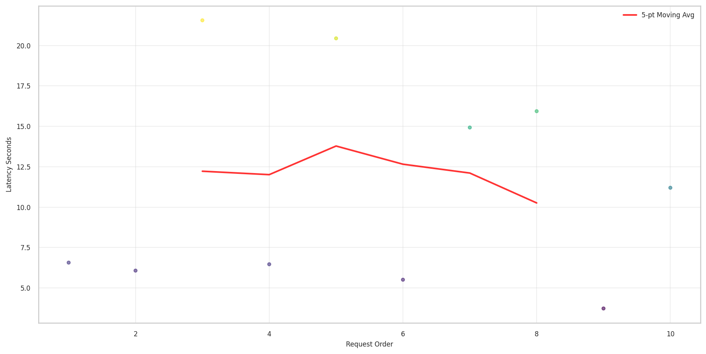](report_assets_20260305_194902/seq_agent_model_adk_documentation_agent_gemini-2_5-flash_4K.png)
<br>


**adk_documentation_agent via gemini-2.5-pro Latency Sequence**<br>

[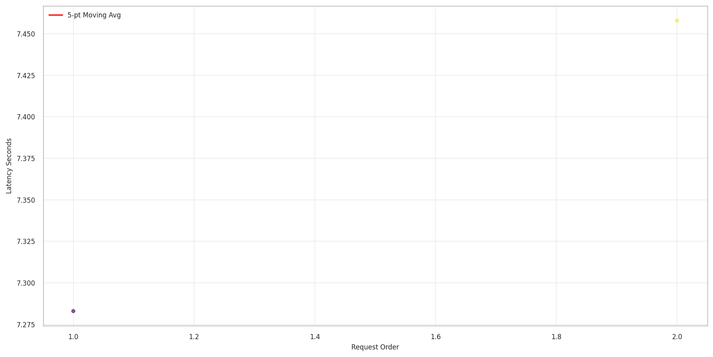](report_assets_20260305_194902/seq_agent_model_adk_documentation_agent_gemini-2_5-pro_4K.png)
<br>


**adk_documentation_agent via gemini-3-pro-preview Latency Sequence**<br>

[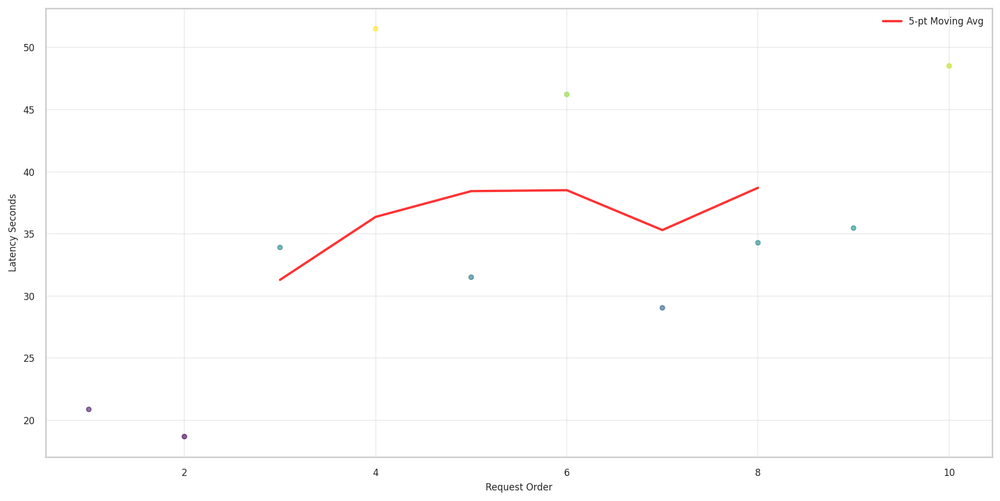](report_assets_20260305_194902/seq_agent_model_adk_documentation_agent_gemini-3-pro-preview_4K.png)
<br>


**adk_documentation_agent via gemini-3.1-pro-preview Latency Sequence**<br>

[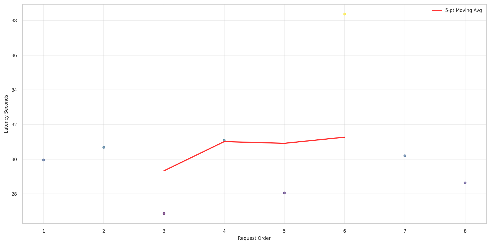](report_assets_20260305_194902/seq_agent_model_adk_documentation_agent_gemini-3_1-pro-preview_4K.png)
<br>


#### ai_observability_agent


**ai_observability_agent via gemini-2.5-flash Latency Sequence**<br>

[](report_assets_20260305_194902/seq_agent_model_ai_observability_agent_gemini-2_5-flash_4K.png)
<br>


**ai_observability_agent via gemini-2.5-pro Latency Sequence**<br>

[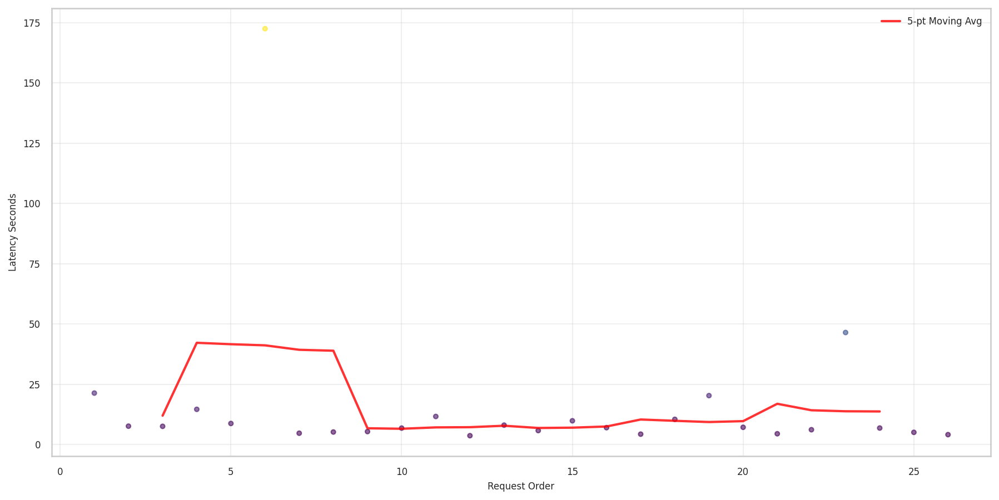](report_assets_20260305_194902/seq_agent_model_ai_observability_agent_gemini-2_5-pro_4K.png)
<br>


**ai_observability_agent via gemini-3-pro-preview Latency Sequence**<br>

[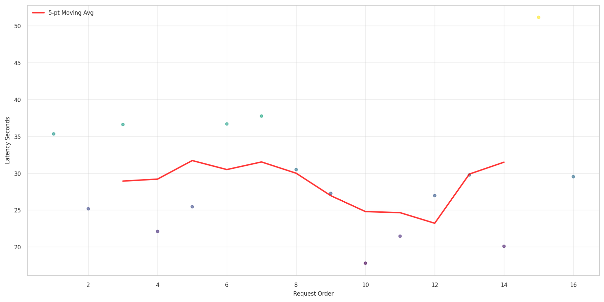](report_assets_20260305_194902/seq_agent_model_ai_observability_agent_gemini-3-pro-preview_4K.png)
<br>


**ai_observability_agent via gemini-3.1-pro-preview Latency Sequence**<br>

[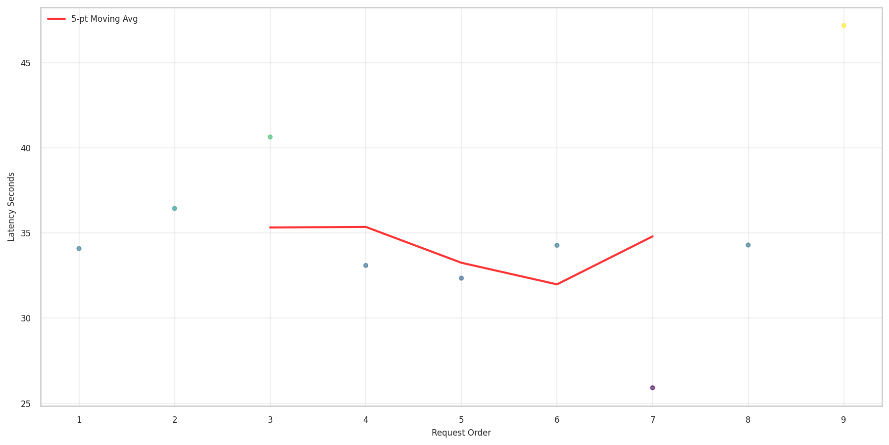](report_assets_20260305_194902/seq_agent_model_ai_observability_agent_gemini-3_1-pro-preview_4K.png)
<br>


#### bigquery_data_agent


**bigquery_data_agent via gemini-2.5-flash Latency Sequence**<br>

[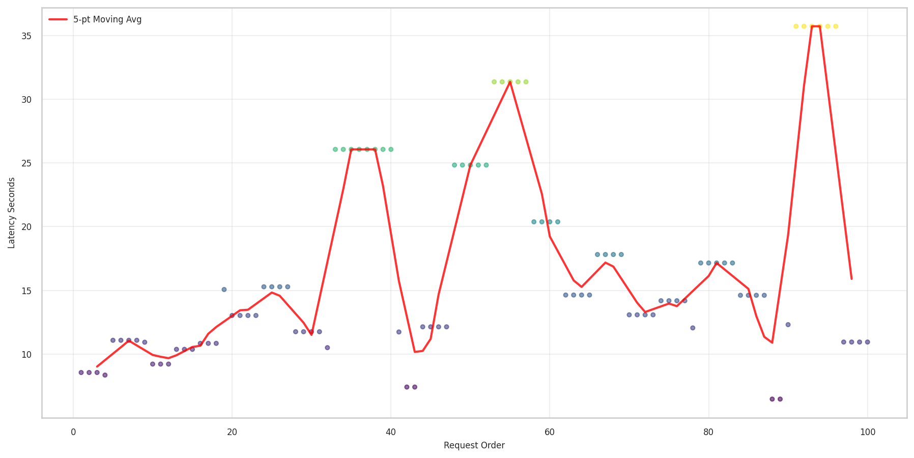](report_assets_20260305_194902/seq_agent_model_bigquery_data_agent_gemini-2_5-flash_4K.png)
<br>


**bigquery_data_agent via gemini-2.5-pro Latency Sequence**<br>

[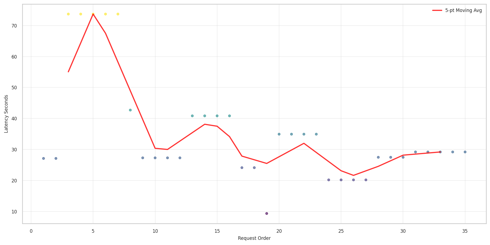](report_assets_20260305_194902/seq_agent_model_bigquery_data_agent_gemini-2_5-pro_4K.png)
<br>


**bigquery_data_agent via gemini-3-pro-preview Latency Sequence**<br>

[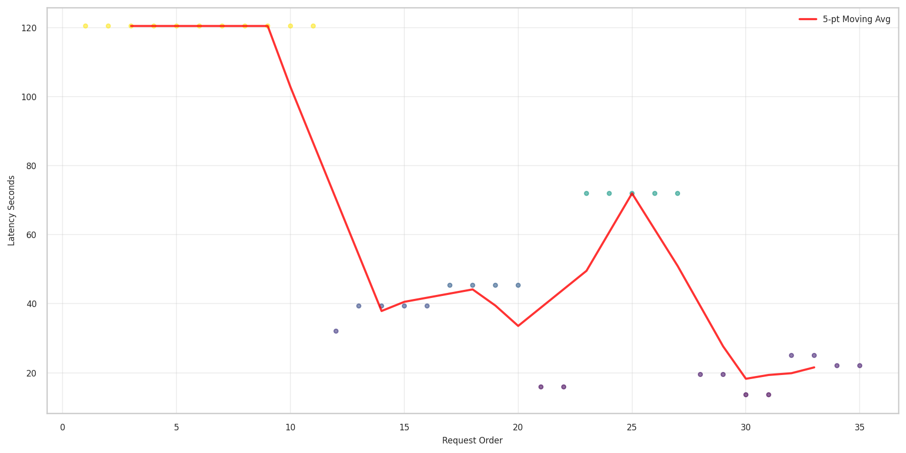](report_assets_20260305_194902/seq_agent_model_bigquery_data_agent_gemini-3-pro-preview_4K.png)
<br>


**bigquery_data_agent via gemini-3.1-pro-preview Latency Sequence**<br>

[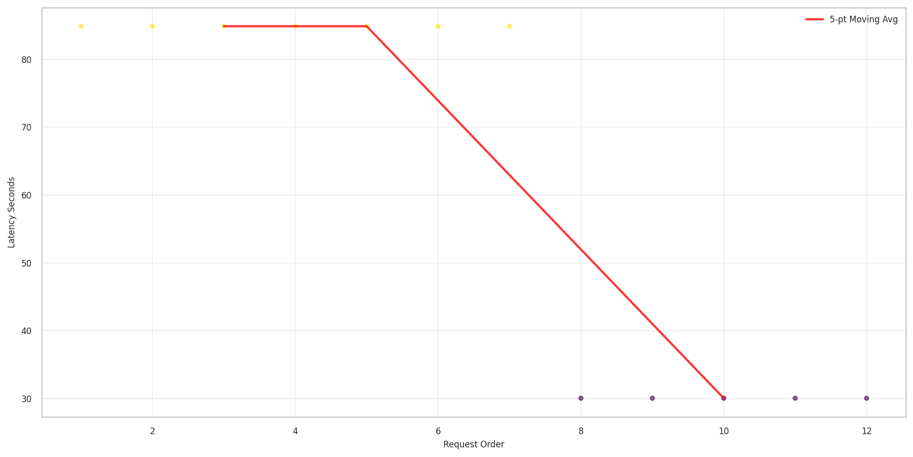](report_assets_20260305_194902/seq_agent_model_bigquery_data_agent_gemini-3_1-pro-preview_4K.png)
<br>


#### config_test_agent_high_temp


**config_test_agent_high_temp via gemini-3.1-pro-preview Latency Sequence**<br>

[](report_assets_20260305_194902/seq_agent_model_config_test_agent_high_temp_gemini-3_1-pro-preview_4K.png)
<br>


#### config_test_agent_wrong_candidate_count_config


**config_test_agent_wrong_candidate_count_config via gemini-2.5-flash Latency Sequence**<br>

[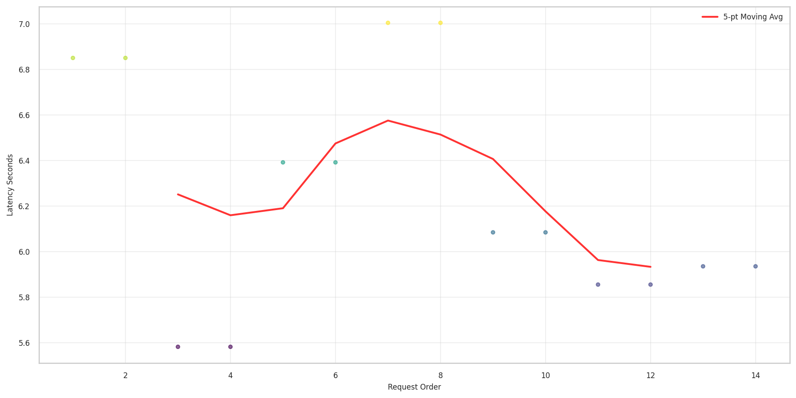](report_assets_20260305_194902/seq_agent_model_config_test_agent_wrong_candidate_count_config_gemini-2_5-flash_4K.png)
<br>


**config_test_agent_wrong_candidate_count_config via gemini-2.5-pro Latency Sequence**<br>

[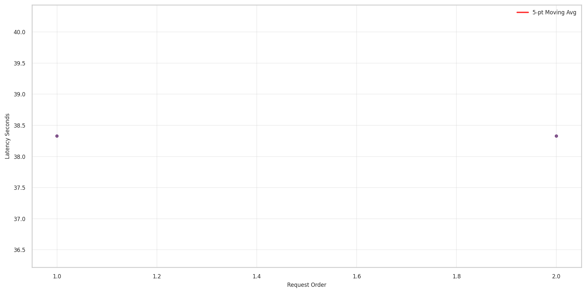](report_assets_20260305_194902/seq_agent_model_config_test_agent_wrong_candidate_count_config_gemini-2_5-pro_4K.png)
<br>


**config_test_agent_wrong_candidate_count_config via gemini-3-pro-preview Latency Sequence**<br>

[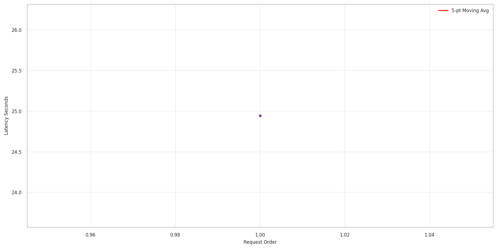](report_assets_20260305_194902/seq_agent_model_config_test_agent_wrong_candidate_count_config_gemini-3-pro-preview_4K.png)
<br>


#### config_test_agent_wrong_candidates


**config_test_agent_wrong_candidates via gemini-2.5-flash Latency Sequence**<br>

[](report_assets_20260305_194902/seq_agent_model_config_test_agent_wrong_candidates_gemini-2_5-flash_4K.png)
<br>


#### google_search_agent


**google_search_agent via gemini-2.5-flash Latency Sequence**<br>

[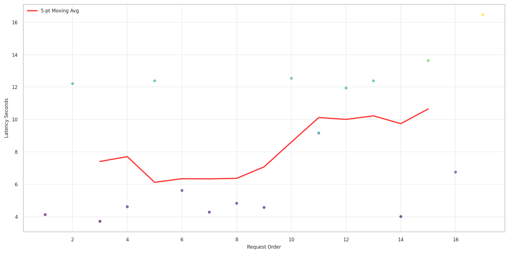](report_assets_20260305_194902/seq_agent_model_google_search_agent_gemini-2_5-flash_4K.png)
<br>


**google_search_agent via gemini-2.5-pro Latency Sequence**<br>

[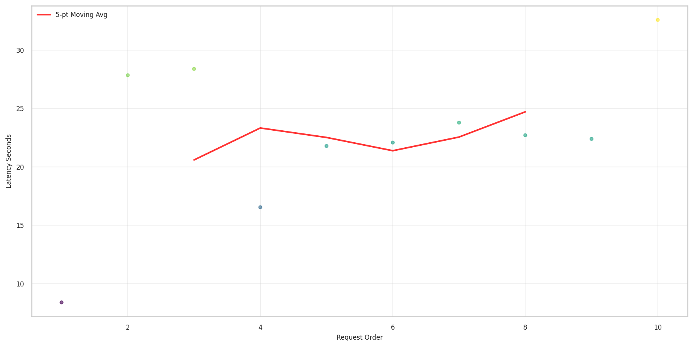](report_assets_20260305_194902/seq_agent_model_google_search_agent_gemini-2_5-pro_4K.png)
<br>


**google_search_agent via gemini-3-pro-preview Latency Sequence**<br>

[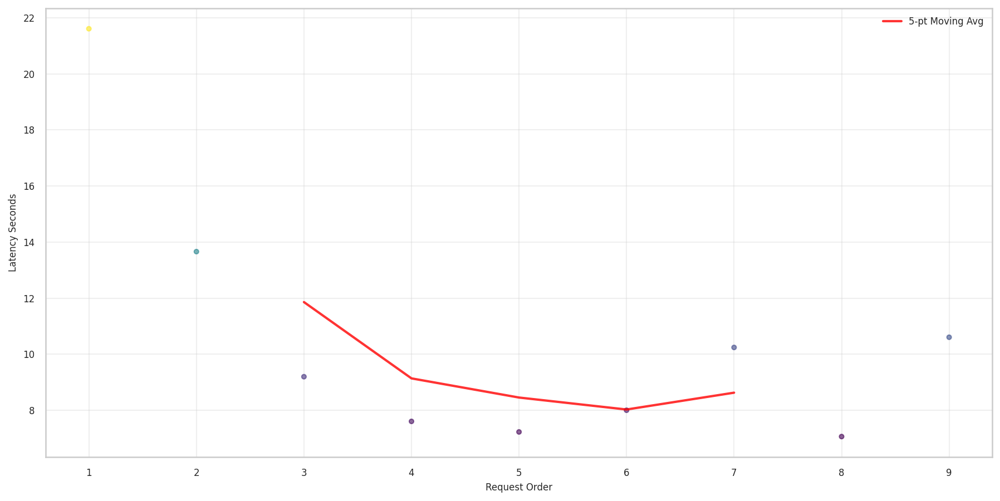](report_assets_20260305_194902/seq_agent_model_google_search_agent_gemini-3-pro-preview_4K.png)
<br>


**google_search_agent via gemini-3.1-pro-preview Latency Sequence**<br>

[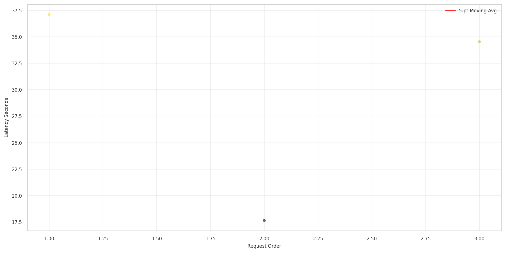](report_assets_20260305_194902/seq_agent_model_google_search_agent_gemini-3_1-pro-preview_4K.png)
<br>


#### lookup_worker_1


**lookup_worker_1 via gemini-2.5-flash Latency Sequence**<br>

[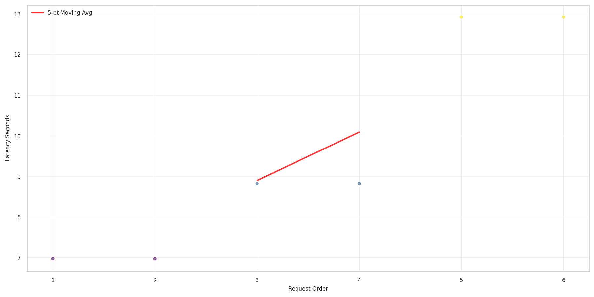](report_assets_20260305_194902/seq_agent_model_lookup_worker_1_gemini-2_5-flash_4K.png)
<br>


**lookup_worker_1 via gemini-2.5-pro Latency Sequence**<br>

[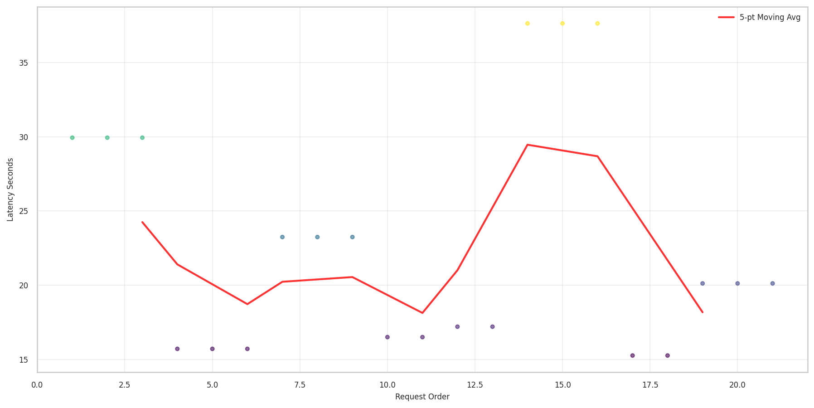](report_assets_20260305_194902/seq_agent_model_lookup_worker_1_gemini-2_5-pro_4K.png)
<br>


**lookup_worker_1 via gemini-3.1-pro-preview Latency Sequence**<br>

[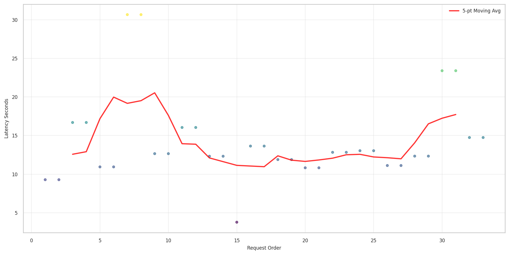](report_assets_20260305_194902/seq_agent_model_lookup_worker_1_gemini-3_1-pro-preview_4K.png)
<br>


#### lookup_worker_2


**lookup_worker_2 via gemini-2.5-flash Latency Sequence**<br>

[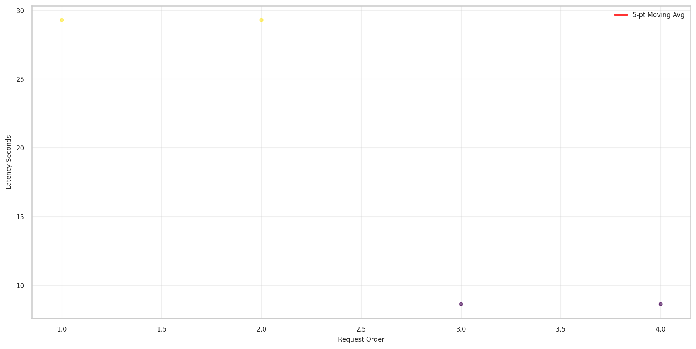](report_assets_20260305_194902/seq_agent_model_lookup_worker_2_gemini-2_5-flash_4K.png)
<br>


**lookup_worker_2 via gemini-2.5-pro Latency Sequence**<br>

[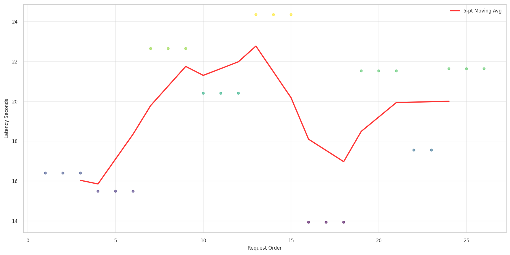](report_assets_20260305_194902/seq_agent_model_lookup_worker_2_gemini-2_5-pro_4K.png)
<br>


**lookup_worker_2 via gemini-3.1-pro-preview Latency Sequence**<br>

[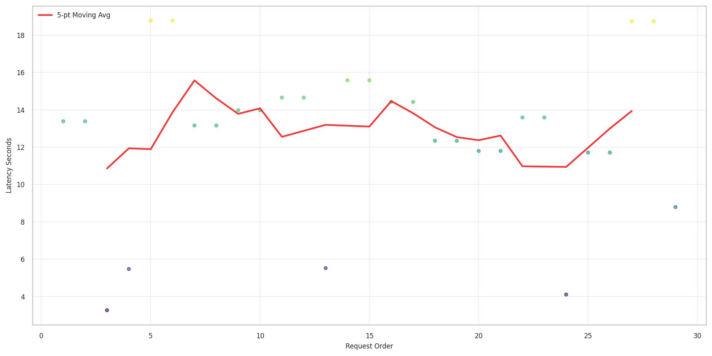](report_assets_20260305_194902/seq_agent_model_lookup_worker_2_gemini-3_1-pro-preview_4K.png)
<br>


#### lookup_worker_3


**lookup_worker_3 via gemini-2.5-flash Latency Sequence**<br>

[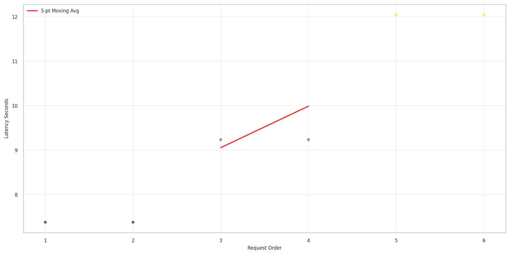](report_assets_20260305_194902/seq_agent_model_lookup_worker_3_gemini-2_5-flash_4K.png)
<br>


**lookup_worker_3 via gemini-2.5-pro Latency Sequence**<br>

[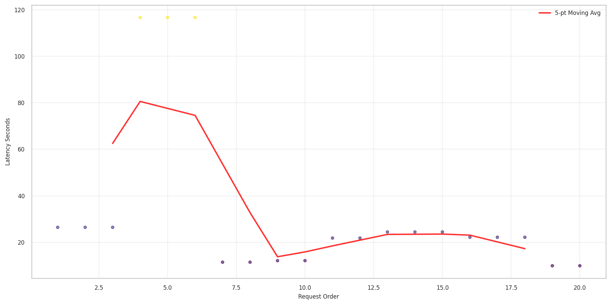](report_assets_20260305_194902/seq_agent_model_lookup_worker_3_gemini-2_5-pro_4K.png)
<br>


**lookup_worker_3 via gemini-3.1-pro-preview Latency Sequence**<br>

[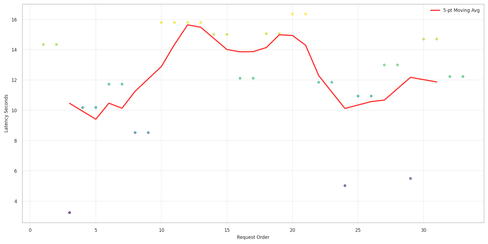](report_assets_20260305_194902/seq_agent_model_lookup_worker_3_gemini-3_1-pro-preview_4K.png)
<br>


#### parallel_db_lookup


#### unreliable_tool_agent


**unreliable_tool_agent via gemini-2.5-flash Latency Sequence**<br>

[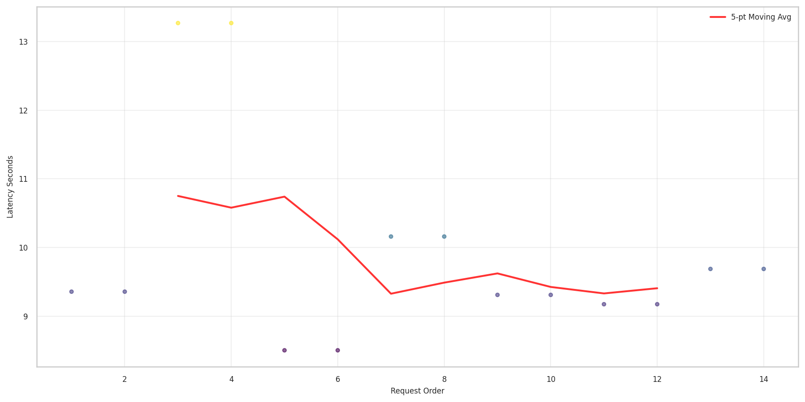](report_assets_20260305_194902/seq_agent_model_unreliable_tool_agent_gemini-2_5-flash_4K.png)
<br>


**unreliable_tool_agent via gemini-2.5-pro Latency Sequence**<br>

[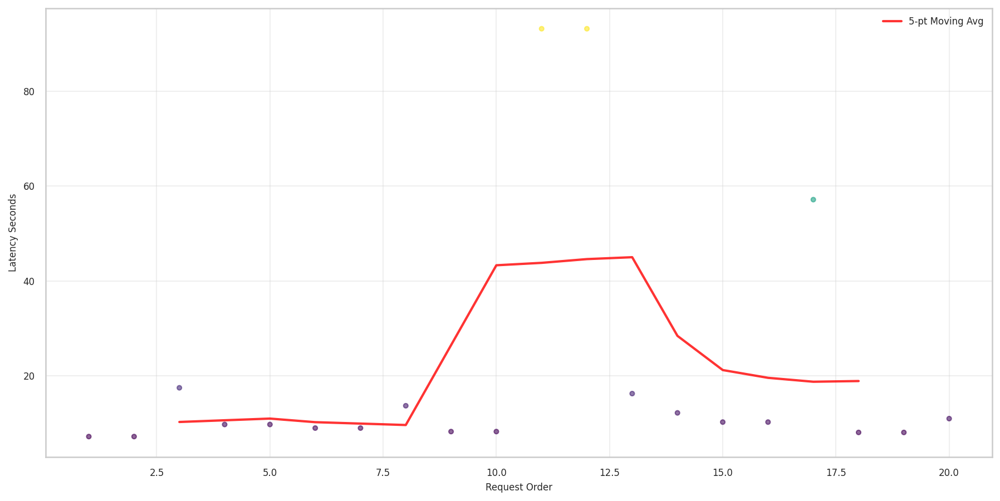](report_assets_20260305_194902/seq_agent_model_unreliable_tool_agent_gemini-2_5-pro_4K.png)
<br>


### Token Usage Over Time

The charts below display the chronological token consumption (Input, Thought, Output) for each Agent-Model combination over the test run. This helps identify context window growth or token ballooning over time.


**adk_documentation_agent via gemini-2.5-flash Token Sequence**<br>

[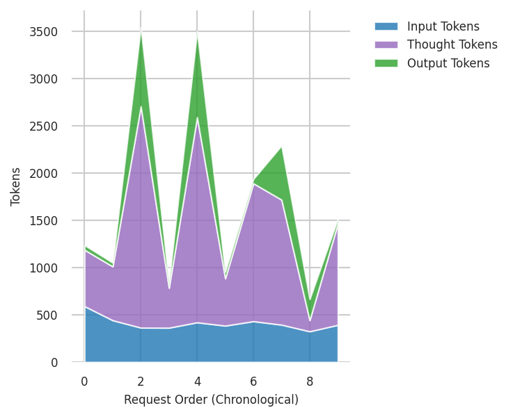](report_assets_20260305_194902/token_seq_adk_documentation_agent_gemini-2_5-flash_4K.png)
<br>


**bigquery_data_agent via gemini-2.5-flash Token Sequence**<br>

[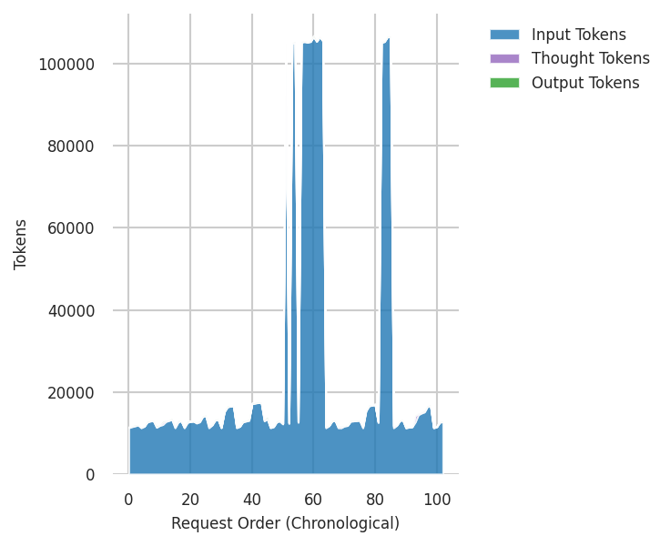](report_assets_20260305_194902/token_seq_bigquery_data_agent_gemini-2_5-flash_4K.png)
<br>


**config_test_agent_wrong_candidate_count_config via gemini-2.5-flash Token Sequence**<br>

[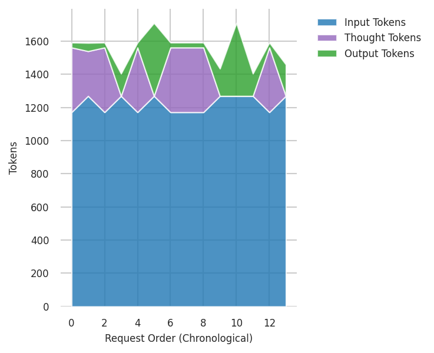](report_assets_20260305_194902/token_seq_config_test_agent_wrong_candidate_count_config_gemini-2_5-flash_4K.png)
<br>


**google_search_agent via gemini-2.5-flash Token Sequence**<br>

[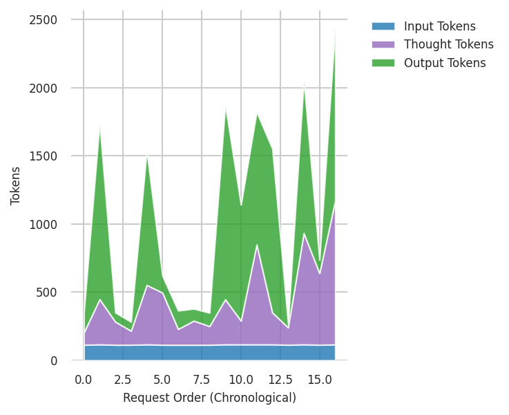](report_assets_20260305_194902/token_seq_google_search_agent_gemini-2_5-flash_4K.png)
<br>


**knowledge_qa_supervisor via gemini-2.5-flash Token Sequence**<br>

[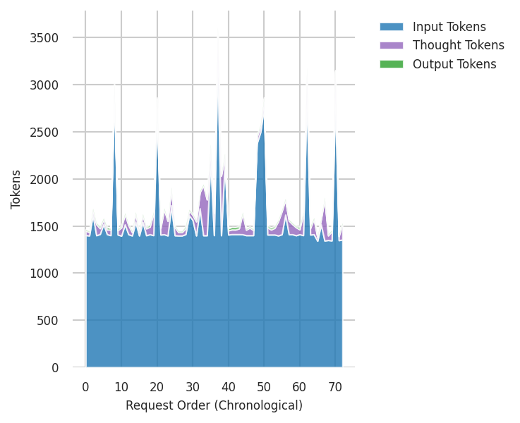](report_assets_20260305_194902/token_seq_knowledge_qa_supervisor_gemini-2_5-flash_4K.png)
<br>


**lookup_worker_1 via gemini-2.5-flash Token Sequence**<br>

[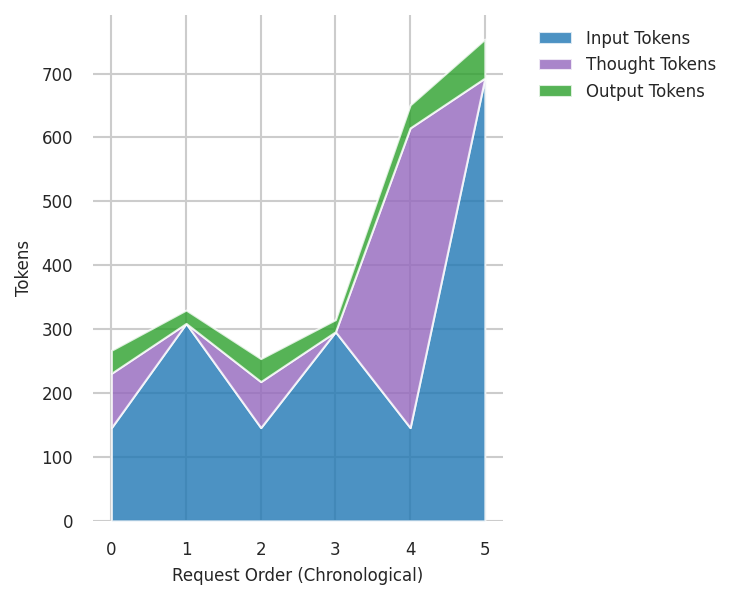](report_assets_20260305_194902/token_seq_lookup_worker_1_gemini-2_5-flash_4K.png)
<br>


**lookup_worker_3 via gemini-2.5-flash Token Sequence**<br>

[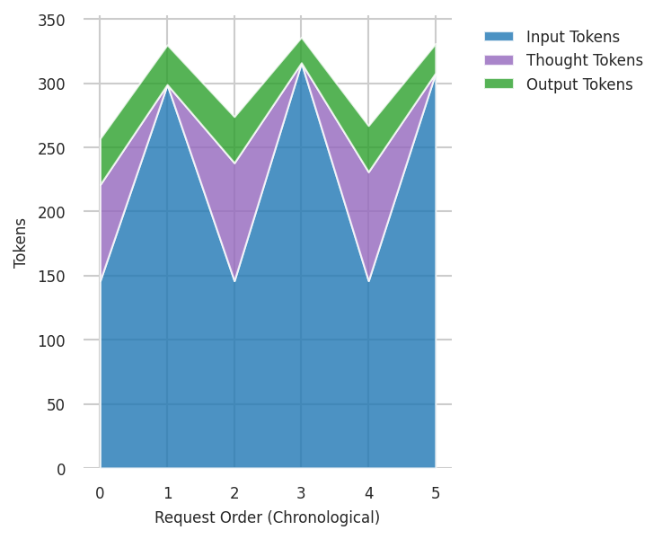](report_assets_20260305_194902/token_seq_lookup_worker_3_gemini-2_5-flash_4K.png)
<br>


**unreliable_tool_agent via gemini-2.5-flash Token Sequence**<br>

[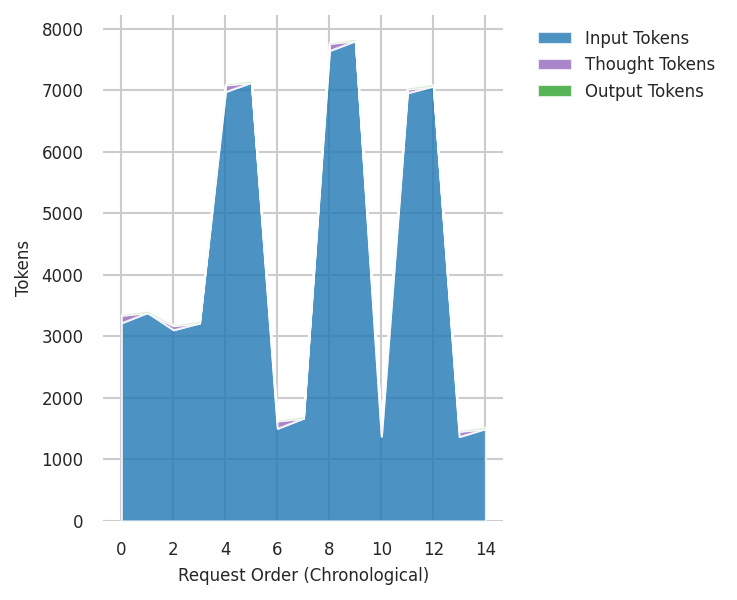](report_assets_20260305_194902/token_seq_unreliable_tool_agent_gemini-2_5-flash_4K.png)
<br>


**ai_observability_agent via gemini-2.5-pro Token Sequence**<br>

[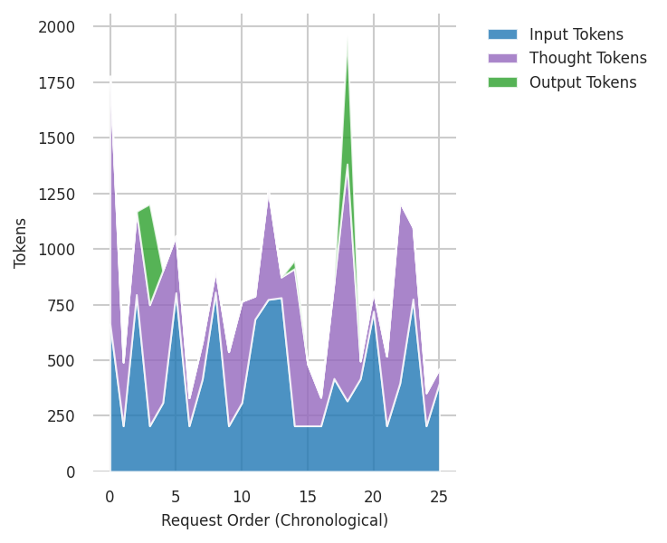](report_assets_20260305_194902/token_seq_ai_observability_agent_gemini-2_5-pro_4K.png)
<br>


**bigquery_data_agent via gemini-2.5-pro Token Sequence**<br>

[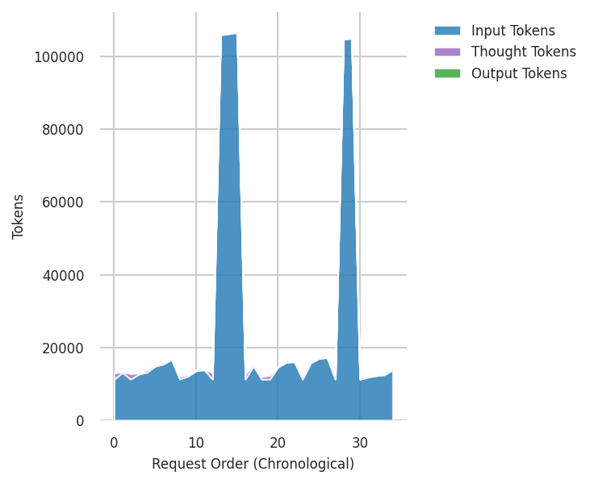](report_assets_20260305_194902/token_seq_bigquery_data_agent_gemini-2_5-pro_4K.png)
<br>


**google_search_agent via gemini-2.5-pro Token Sequence**<br>

[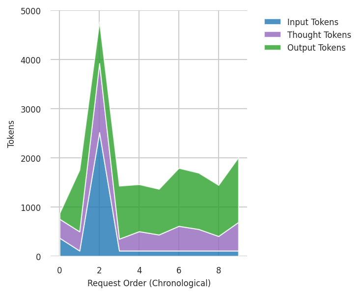](report_assets_20260305_194902/token_seq_google_search_agent_gemini-2_5-pro_4K.png)
<br>


**knowledge_qa_supervisor via gemini-2.5-pro Token Sequence**<br>

[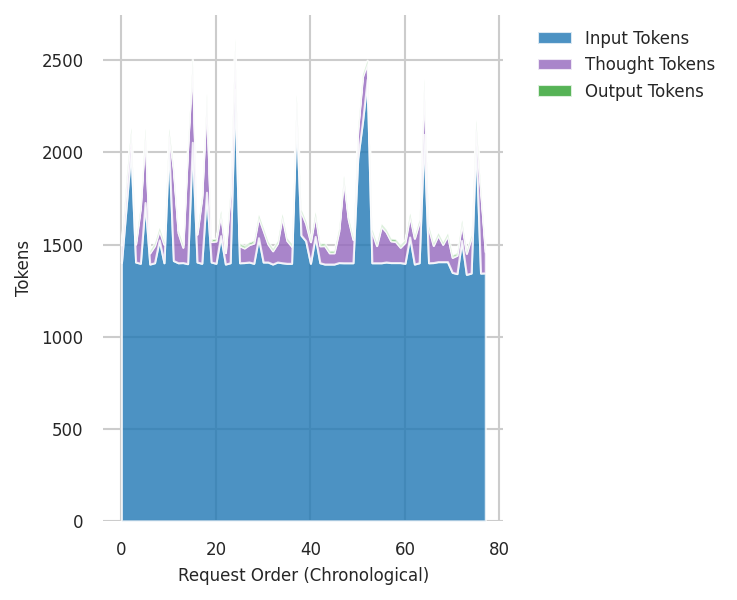](report_assets_20260305_194902/token_seq_knowledge_qa_supervisor_gemini-2_5-pro_4K.png)
<br>


**lookup_worker_1 via gemini-2.5-pro Token Sequence**<br>

[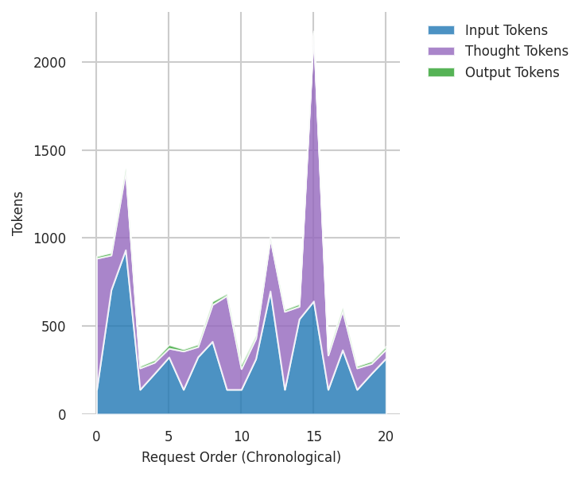](report_assets_20260305_194902/token_seq_lookup_worker_1_gemini-2_5-pro_4K.png)
<br>


**lookup_worker_2 via gemini-2.5-pro Token Sequence**<br>

[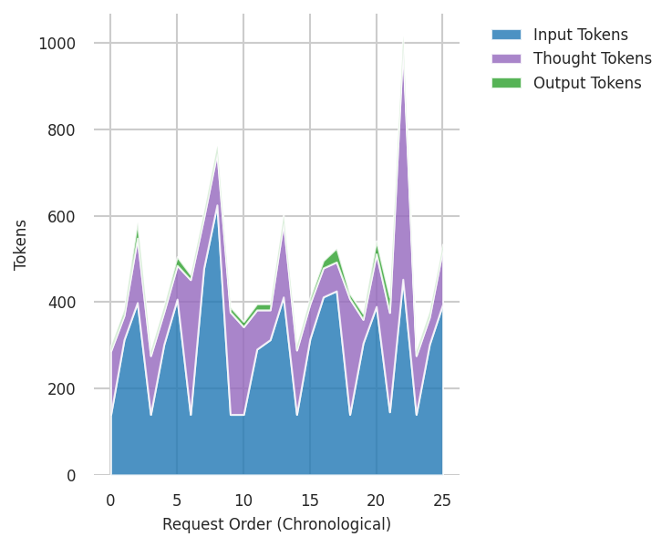](report_assets_20260305_194902/token_seq_lookup_worker_2_gemini-2_5-pro_4K.png)
<br>


**lookup_worker_3 via gemini-2.5-pro Token Sequence**<br>

[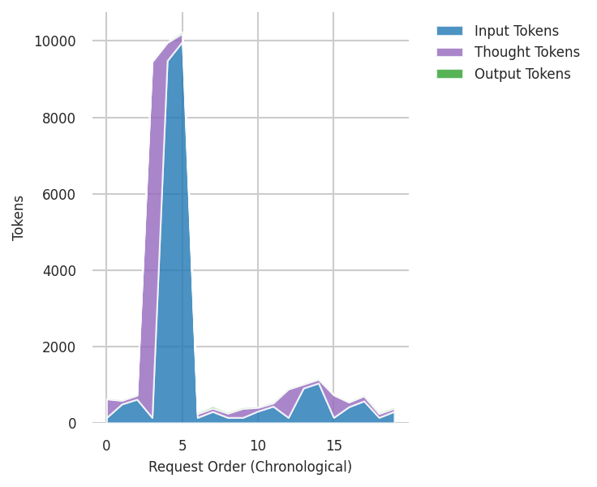](report_assets_20260305_194902/token_seq_lookup_worker_3_gemini-2_5-pro_4K.png)
<br>


**unreliable_tool_agent via gemini-2.5-pro Token Sequence**<br>

[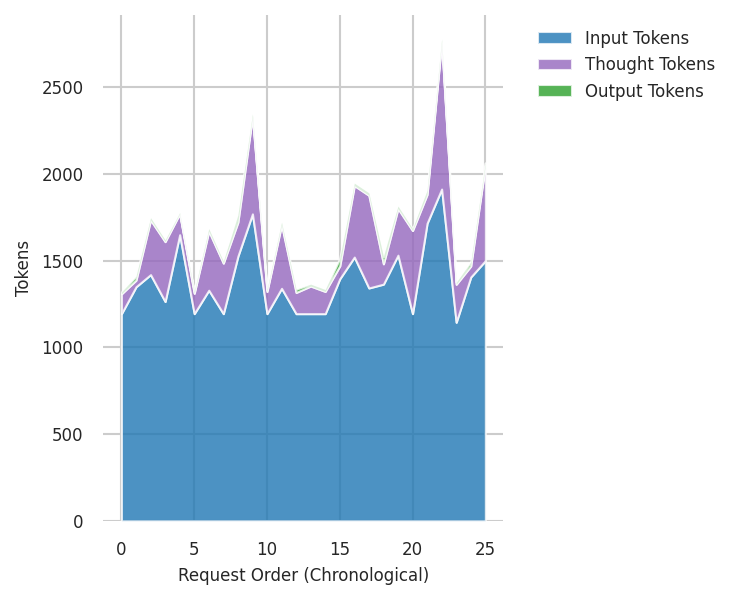](report_assets_20260305_194902/token_seq_unreliable_tool_agent_gemini-2_5-pro_4K.png)
<br>


**adk_documentation_agent via gemini-3-pro-preview Token Sequence**<br>

[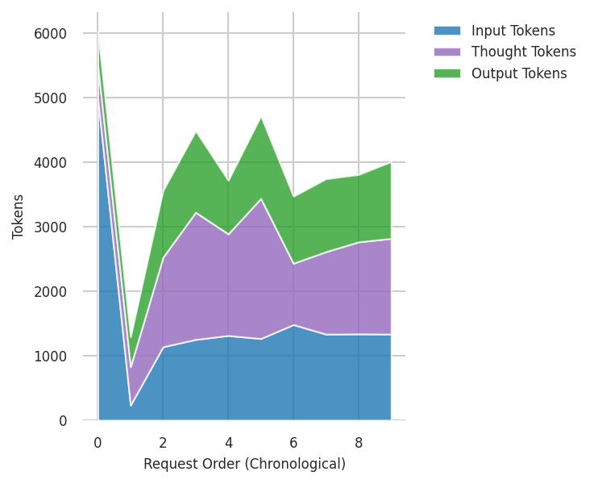](report_assets_20260305_194902/token_seq_adk_documentation_agent_gemini-3-pro-preview_4K.png)
<br>


**ai_observability_agent via gemini-3-pro-preview Token Sequence**<br>

[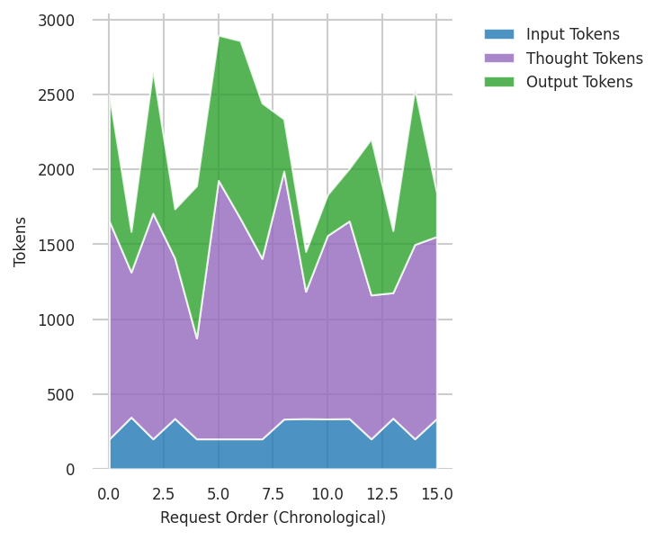](report_assets_20260305_194902/token_seq_ai_observability_agent_gemini-3-pro-preview_4K.png)
<br>


**bigquery_data_agent via gemini-3-pro-preview Token Sequence**<br>

[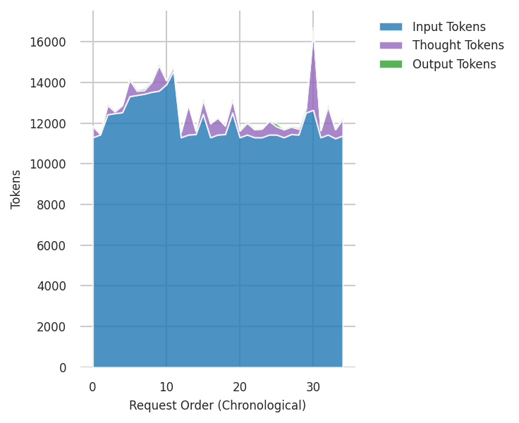](report_assets_20260305_194902/token_seq_bigquery_data_agent_gemini-3-pro-preview_4K.png)
<br>


**google_search_agent via gemini-3-pro-preview Token Sequence**<br>

[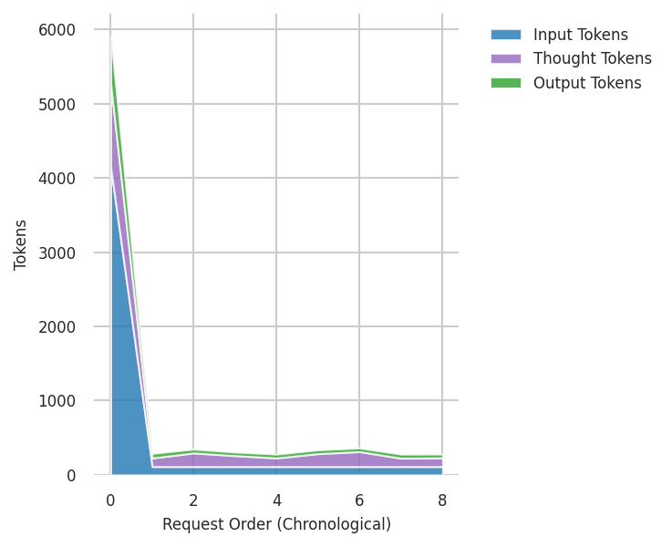](report_assets_20260305_194902/token_seq_google_search_agent_gemini-3-pro-preview_4K.png)
<br>


**knowledge_qa_supervisor via gemini-3-pro-preview Token Sequence**<br>

[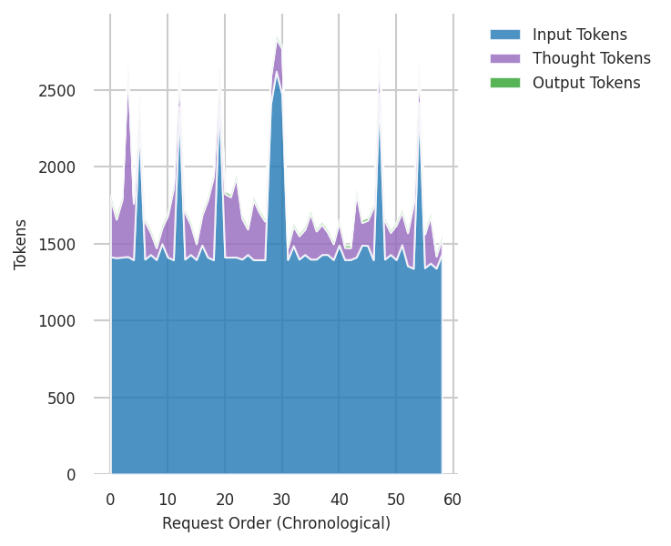](report_assets_20260305_194902/token_seq_knowledge_qa_supervisor_gemini-3-pro-preview_4K.png)
<br>


**adk_documentation_agent via gemini-3.1-pro-preview Token Sequence**<br>

[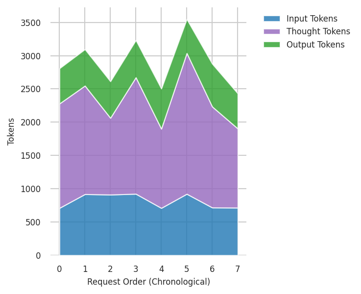](report_assets_20260305_194902/token_seq_adk_documentation_agent_gemini-3_1-pro-preview_4K.png)
<br>


**ai_observability_agent via gemini-3.1-pro-preview Token Sequence**<br>

[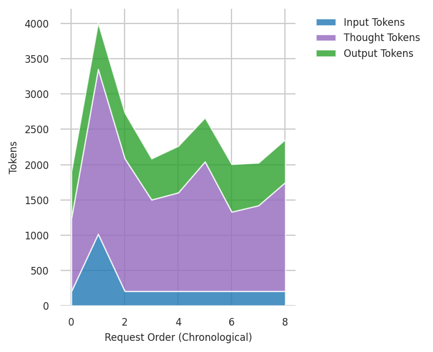](report_assets_20260305_194902/token_seq_ai_observability_agent_gemini-3_1-pro-preview_4K.png)
<br>


**bigquery_data_agent via gemini-3.1-pro-preview Token Sequence**<br>

[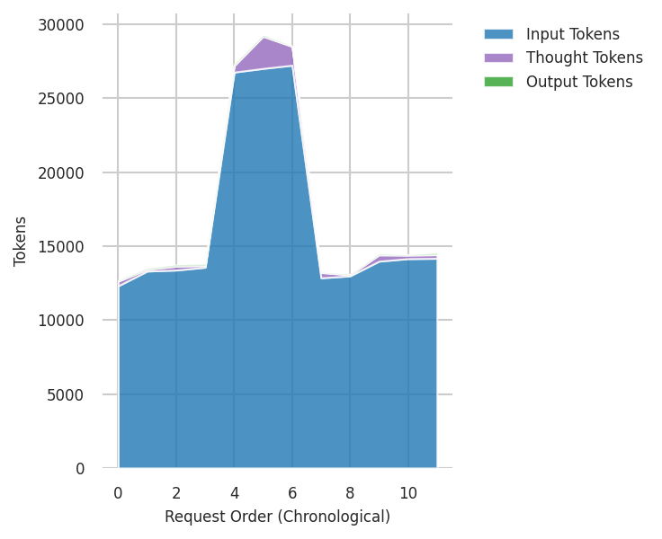](report_assets_20260305_194902/token_seq_bigquery_data_agent_gemini-3_1-pro-preview_4K.png)
<br>


**config_test_agent_high_temp via gemini-3.1-pro-preview Token Sequence**<br>

[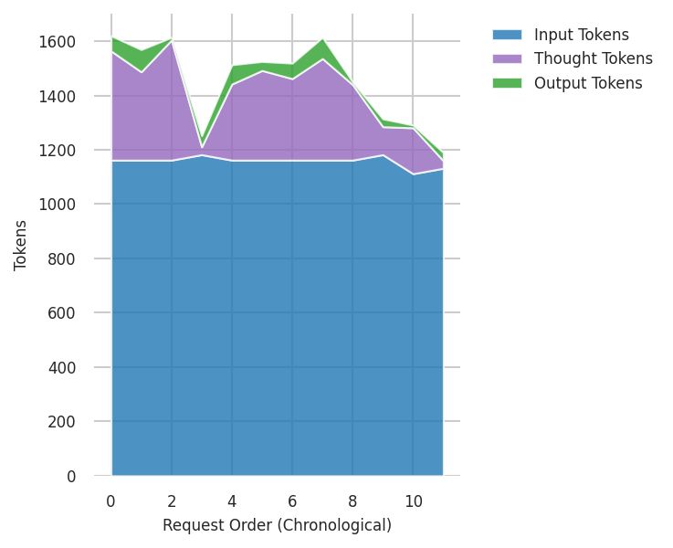](report_assets_20260305_194902/token_seq_config_test_agent_high_temp_gemini-3_1-pro-preview_4K.png)
<br>


**knowledge_qa_supervisor via gemini-3.1-pro-preview Token Sequence**<br>

[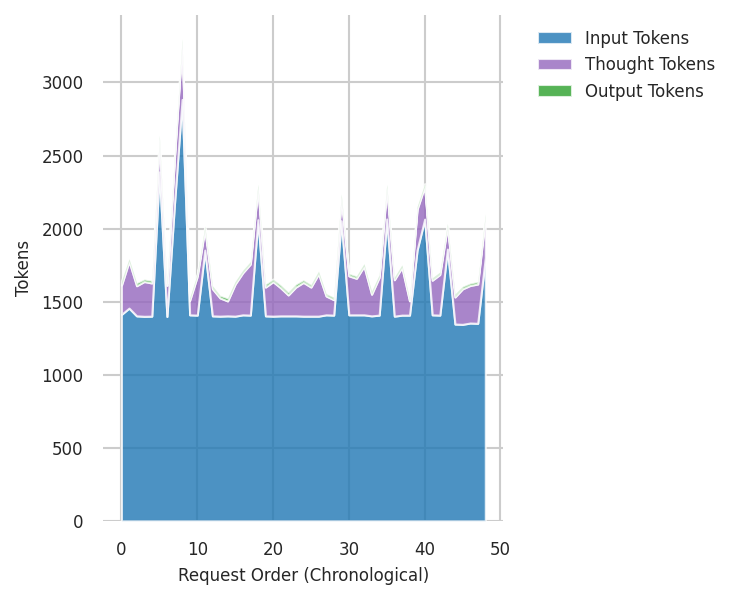](report_assets_20260305_194902/token_seq_knowledge_qa_supervisor_gemini-3_1-pro-preview_4K.png)
<br>


**lookup_worker_1 via gemini-3.1-pro-preview Token Sequence**<br>

[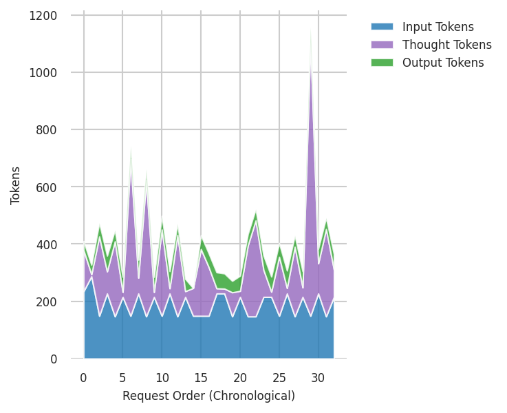](report_assets_20260305_194902/token_seq_lookup_worker_1_gemini-3_1-pro-preview_4K.png)
<br>


**lookup_worker_2 via gemini-3.1-pro-preview Token Sequence**<br>

[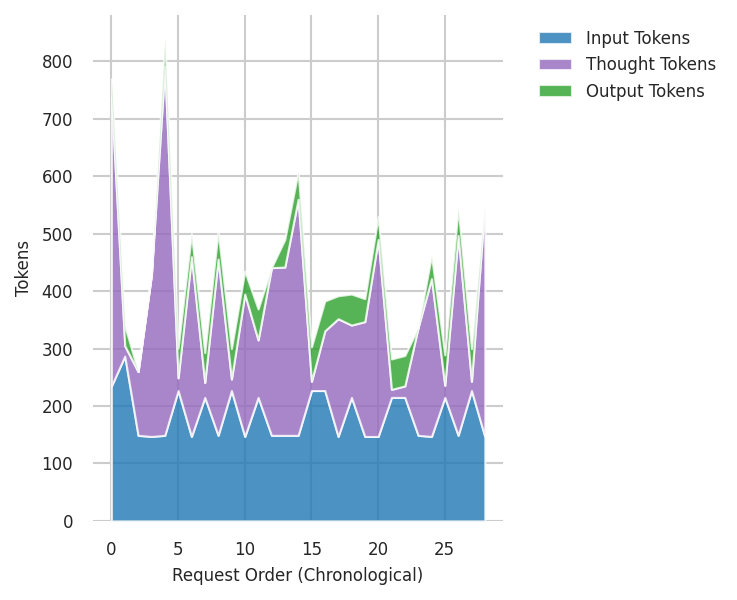](report_assets_20260305_194902/token_seq_lookup_worker_2_gemini-3_1-pro-preview_4K.png)
<br>


**lookup_worker_3 via gemini-3.1-pro-preview Token Sequence**<br>

[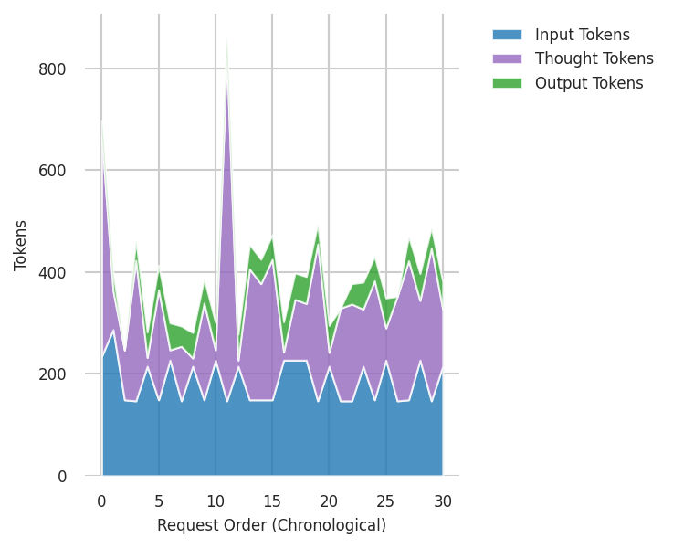](report_assets_20260305_194902/token_seq_lookup_worker_3_gemini-3_1-pro-preview_4K.png)
<br>


### Hypothesis Testing: Latency & Tokens

These scatter plots illustrate the relationship between generated token count and LLM latency on a granular, per-agent and per-model basis, utilizing the raw underlying llm_events tracking data.

This granularity helps isolate correlation behaviors where an Agent's complex prompt might cause a specific model to degrade more linearly with output size.


#### adk_documentation_agent


**gemini-2.5-flash**

- **Number of Requests**: 10


- **Correlation**: 0.977 (Very Strong)


**Latency vs Tokens (adk_documentation_agent via gemini-2.5-flash)**<br>

[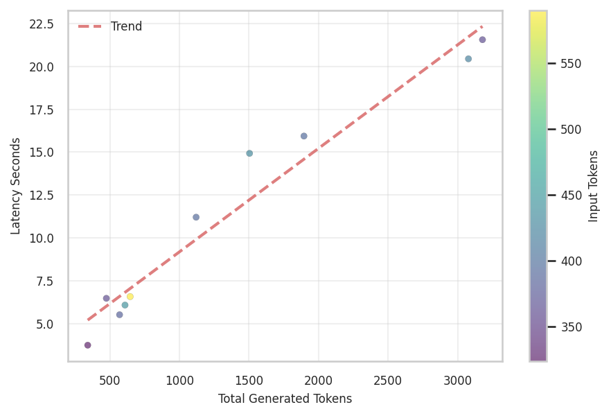](report_assets_20260305_194902/latency_scatter_adk_documentation_agent_gemini-2_5-flash_4K.png)
<br>

**gemini-3-pro-preview**

- **Number of Requests**: 10


- **Correlation**: 0.927 (Very Strong)


**Latency vs Tokens (adk_documentation_agent via gemini-3-pro-preview)**<br>

[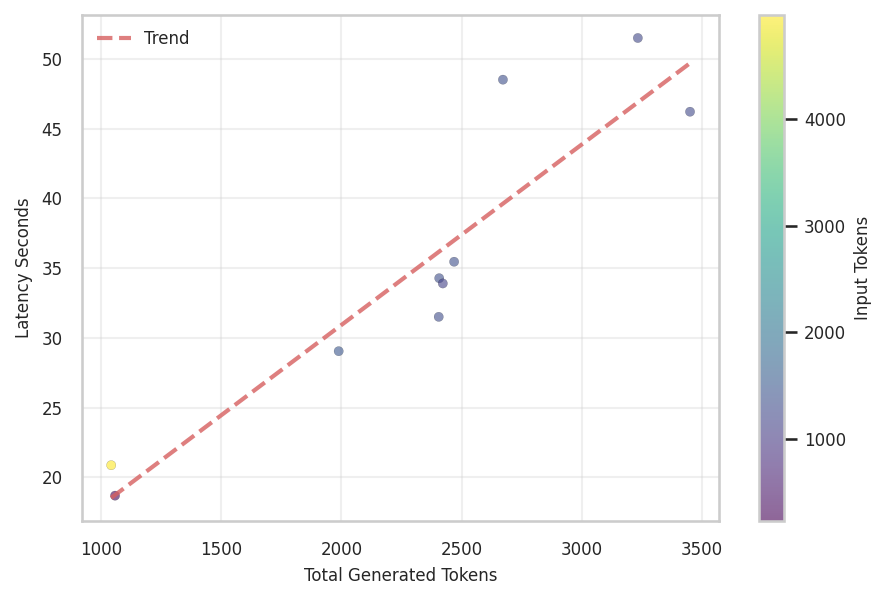](report_assets_20260305_194902/latency_scatter_adk_documentation_agent_gemini-3-pro-preview_4K.png)
<br>

**gemini-3.1-pro-preview**

- **Number of Requests**: 8


- **Correlation**: 0.912 (Very Strong)


**Latency vs Tokens (adk_documentation_agent via gemini-3.1-pro-preview)**<br>

[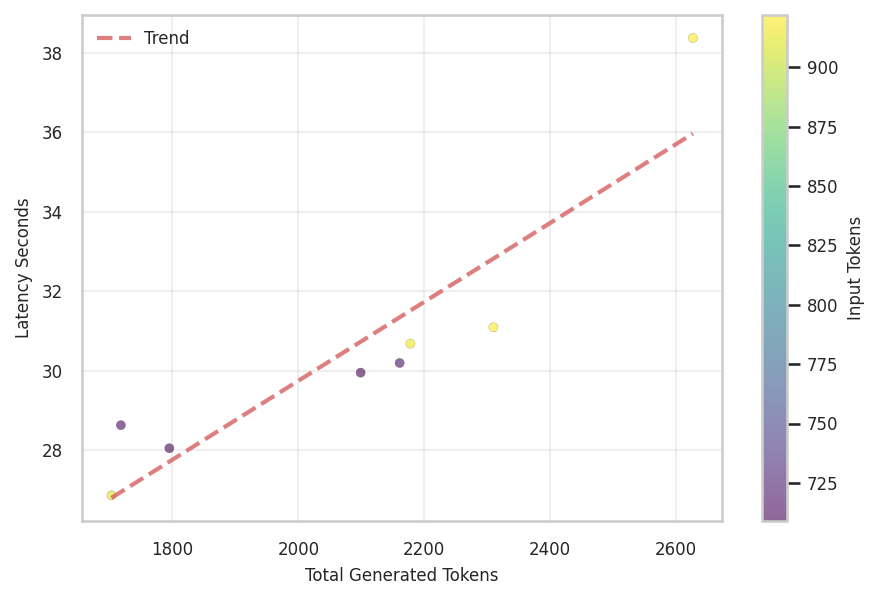](report_assets_20260305_194902/latency_scatter_adk_documentation_agent_gemini-3_1-pro-preview_4K.png)
<br>

#### ai_observability_agent


**gemini-3-pro-preview**

- **Number of Requests**: 16


- **Correlation**: 0.819 (Very Strong)


**Latency vs Tokens (ai_observability_agent via gemini-3-pro-preview)**<br>

[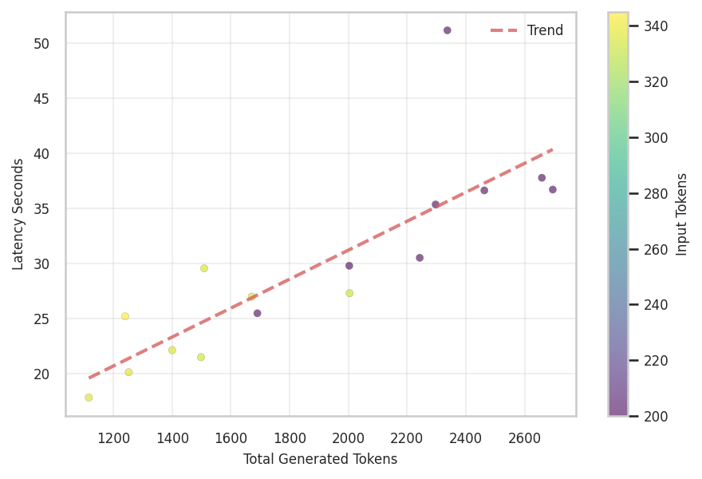](report_assets_20260305_194902/latency_scatter_ai_observability_agent_gemini-3-pro-preview_4K.png)
<br>

**gemini-3.1-pro-preview**

- **Number of Requests**: 9


- **Correlation**: 0.382 (Weak)


**Latency vs Tokens (ai_observability_agent via gemini-3.1-pro-preview)**<br>

[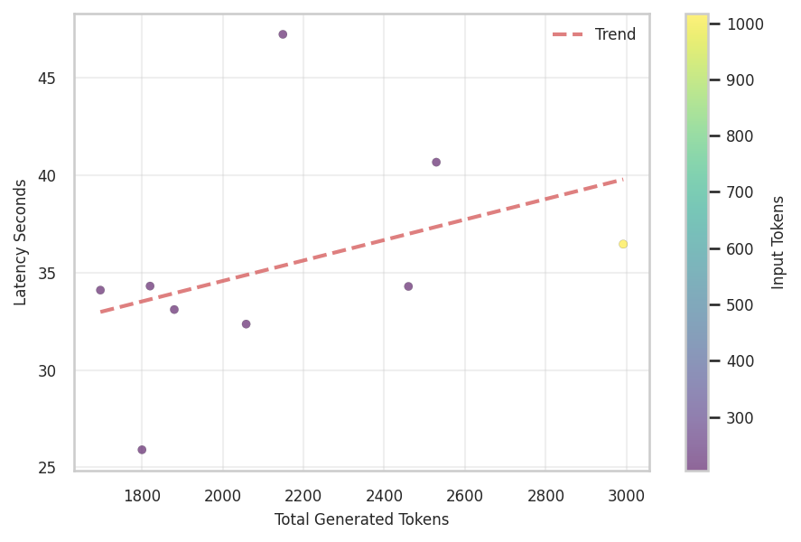](report_assets_20260305_194902/latency_scatter_ai_observability_agent_gemini-3_1-pro-preview_4K.png)
<br>

#### bigquery_data_agent


**gemini-2.5-flash**

- **Number of Requests**: 103


- **Correlation**: 0.591 (Moderate)


**Latency vs Tokens (bigquery_data_agent via gemini-2.5-flash)**<br>

[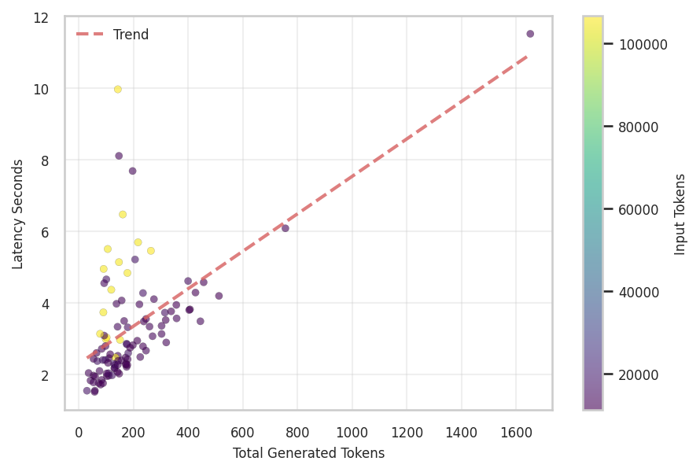](report_assets_20260305_194902/latency_scatter_bigquery_data_agent_gemini-2_5-flash_4K.png)
<br>

**gemini-2.5-pro**

- **Number of Requests**: 35


- **Correlation**: 0.909 (Very Strong)


**Latency vs Tokens (bigquery_data_agent via gemini-2.5-pro)**<br>

[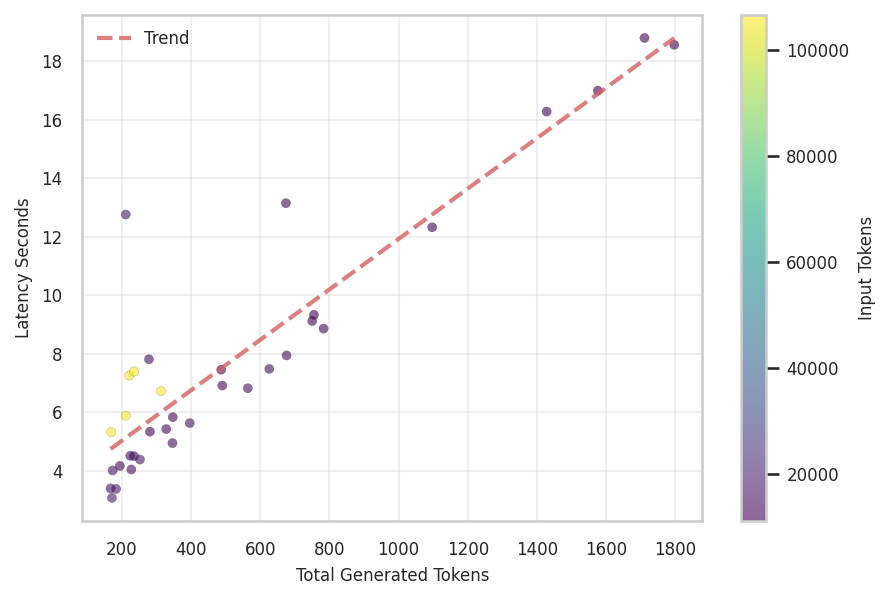](report_assets_20260305_194902/latency_scatter_bigquery_data_agent_gemini-2_5-pro_4K.png)
<br>

**gemini-3-pro-preview**

- **Number of Requests**: 35


- **Correlation**: 0.974 (Very Strong)


**Latency vs Tokens (bigquery_data_agent via gemini-3-pro-preview)**<br>

[](report_assets_20260305_194902/latency_scatter_bigquery_data_agent_gemini-3-pro-preview_4K.png)
<br>

**gemini-3.1-pro-preview**

- **Number of Requests**: 12


- **Correlation**: 0.998 (Very Strong)


**Latency vs Tokens (bigquery_data_agent via gemini-3.1-pro-preview)**<br>

[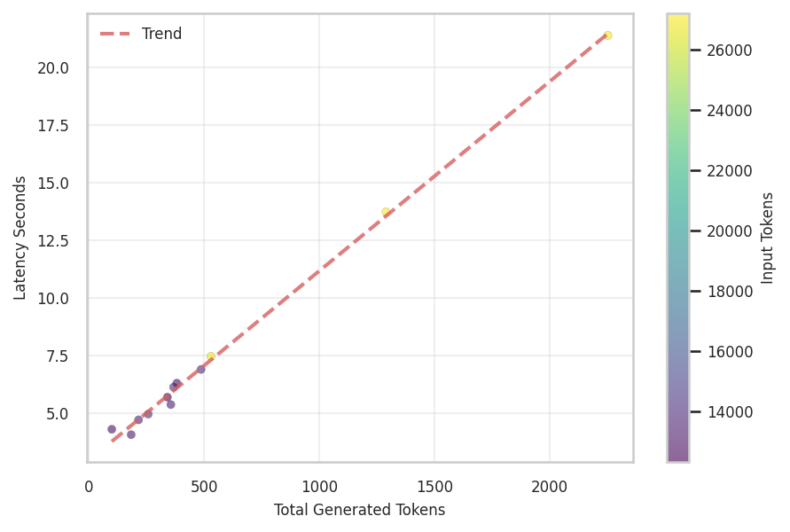](report_assets_20260305_194902/latency_scatter_bigquery_data_agent_gemini-3_1-pro-preview_4K.png)
<br>

#### config_test_agent_high_temp


**gemini-3.1-pro-preview**

- **Number of Requests**: 12


- **Correlation**: 0.651 (Strong)


**Latency vs Tokens (config_test_agent_high_temp via gemini-3.1-pro-preview)**<br>

[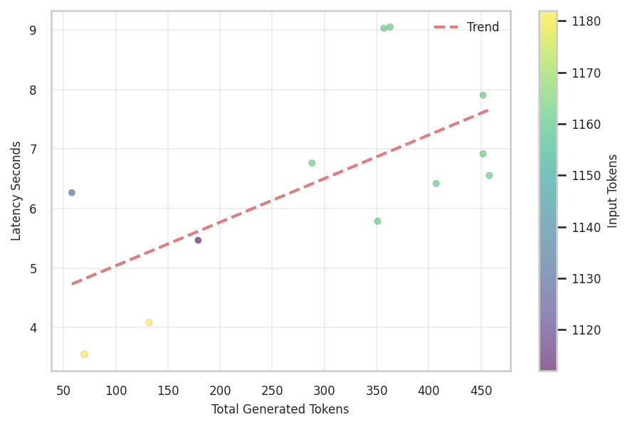](report_assets_20260305_194902/latency_scatter_config_test_agent_high_temp_gemini-3_1-pro-preview_4K.png)
<br>

#### config_test_agent_wrong_candidate_count_config


**gemini-2.5-flash**

- **Number of Requests**: 14


- **Correlation**: 0.226 (Weak)


**Latency vs Tokens (config_test_agent_wrong_candidate_count_config via gemini-2.5-flash)**<br>

[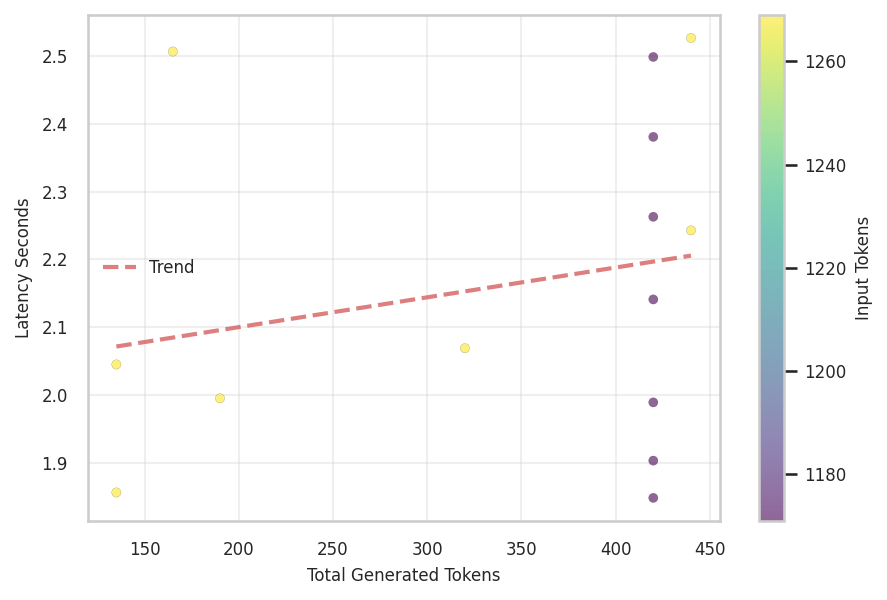](report_assets_20260305_194902/latency_scatter_config_test_agent_wrong_candidate_count_config_gemini-2_5-flash_4K.png)
<br>

#### google_search_agent


**gemini-2.5-flash**

- **Number of Requests**: 17


- **Correlation**: 0.991 (Very Strong)


**Latency vs Tokens (google_search_agent via gemini-2.5-flash)**<br>

[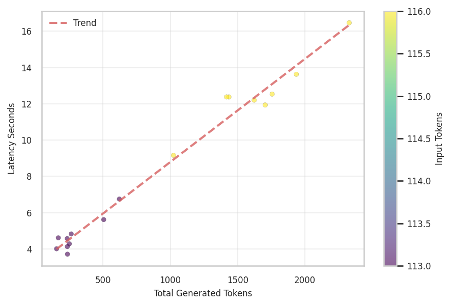](report_assets_20260305_194902/latency_scatter_google_search_agent_gemini-2_5-flash_4K.png)
<br>

**gemini-2.5-pro**

- **Number of Requests**: 10


- **Correlation**: 0.896 (Very Strong)


**Latency vs Tokens (google_search_agent via gemini-2.5-pro)**<br>

[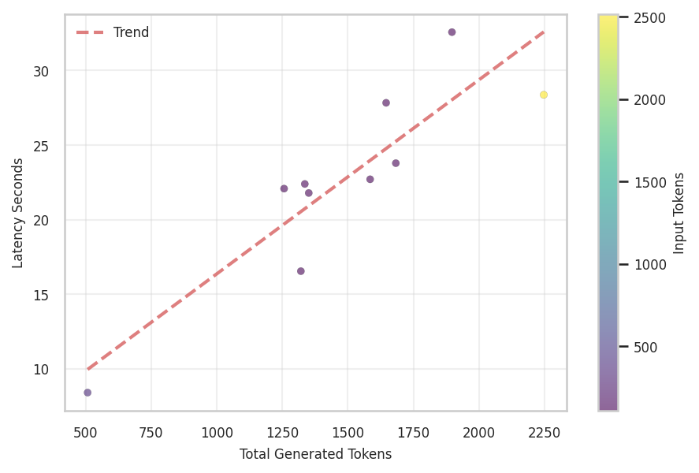](report_assets_20260305_194902/latency_scatter_google_search_agent_gemini-2_5-pro_4K.png)
<br>

**gemini-3-pro-preview**

- **Number of Requests**: 9


- **Correlation**: 0.891 (Very Strong)


**Latency vs Tokens (google_search_agent via gemini-3-pro-preview)**<br>

[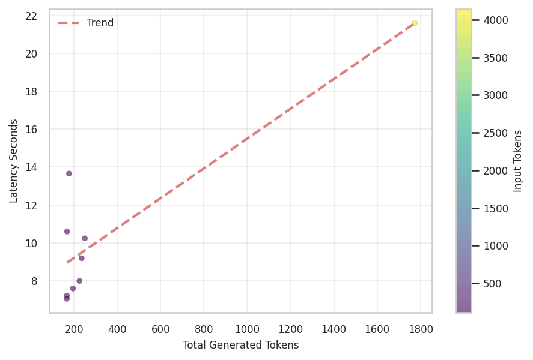](report_assets_20260305_194902/latency_scatter_google_search_agent_gemini-3-pro-preview_4K.png)
<br>

#### knowledge_qa_supervisor


**gemini-2.5-flash**

- **Number of Requests**: 73


- **Correlation**: 0.761 (Strong)


**Latency vs Tokens (knowledge_qa_supervisor via gemini-2.5-flash)**<br>

[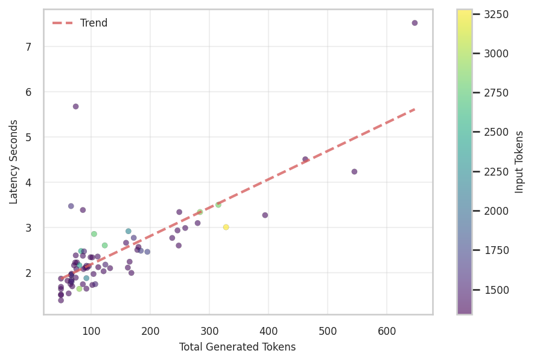](report_assets_20260305_194902/latency_scatter_knowledge_qa_supervisor_gemini-2_5-flash_4K.png)
<br>

**gemini-2.5-pro**

- **Number of Requests**: 78


- **Correlation**: 0.400 (Moderate)


**Latency vs Tokens (knowledge_qa_supervisor via gemini-2.5-pro)**<br>

[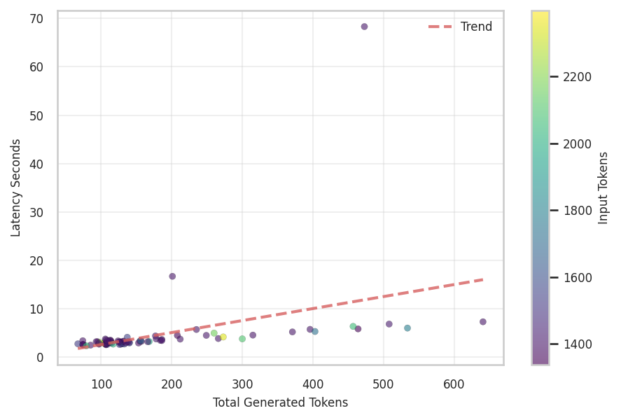](report_assets_20260305_194902/latency_scatter_knowledge_qa_supervisor_gemini-2_5-pro_4K.png)
<br>

**gemini-3-pro-preview**

- **Number of Requests**: 59


- **Correlation**: 0.734 (Strong)


**Latency vs Tokens (knowledge_qa_supervisor via gemini-3-pro-preview)**<br>

[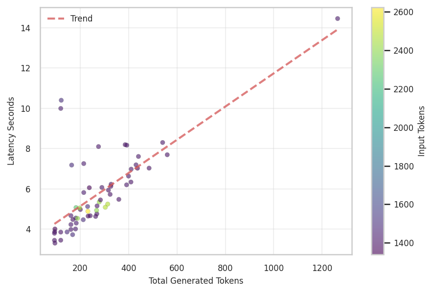](report_assets_20260305_194902/latency_scatter_knowledge_qa_supervisor_gemini-3-pro-preview_4K.png)
<br>

**gemini-3.1-pro-preview**

- **Number of Requests**: 49


- **Correlation**: 0.470 (Moderate)


**Latency vs Tokens (knowledge_qa_supervisor via gemini-3.1-pro-preview)**<br>

[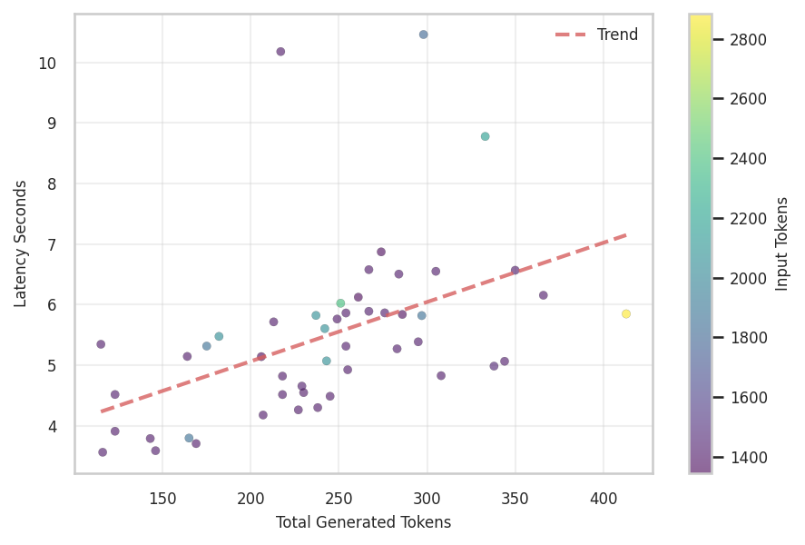](report_assets_20260305_194902/latency_scatter_knowledge_qa_supervisor_gemini-3_1-pro-preview_4K.png)
<br>

#### lookup_worker_1


**gemini-2.5-flash**

- **Number of Requests**: 6


- **Correlation**: 0.965 (Very Strong)


**Latency vs Tokens (lookup_worker_1 via gemini-2.5-flash)**<br>

[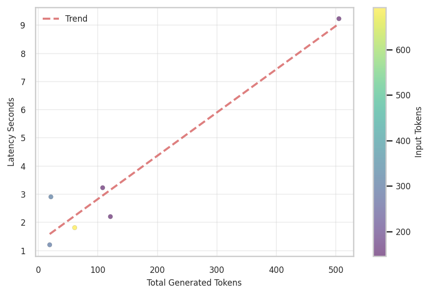](report_assets_20260305_194902/latency_scatter_lookup_worker_1_gemini-2_5-flash_4K.png)
<br>

**gemini-2.5-pro**

- **Number of Requests**: 21


- **Correlation**: 0.876 (Very Strong)


**Latency vs Tokens (lookup_worker_1 via gemini-2.5-pro)**<br>

[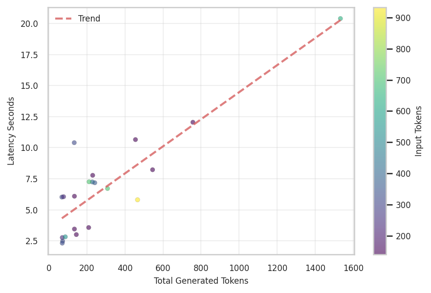](report_assets_20260305_194902/latency_scatter_lookup_worker_1_gemini-2_5-pro_4K.png)
<br>

**gemini-3.1-pro-preview**

- **Number of Requests**: 32


- **Correlation**: 0.784 (Strong)


**Latency vs Tokens (lookup_worker_1 via gemini-3.1-pro-preview)**<br>

[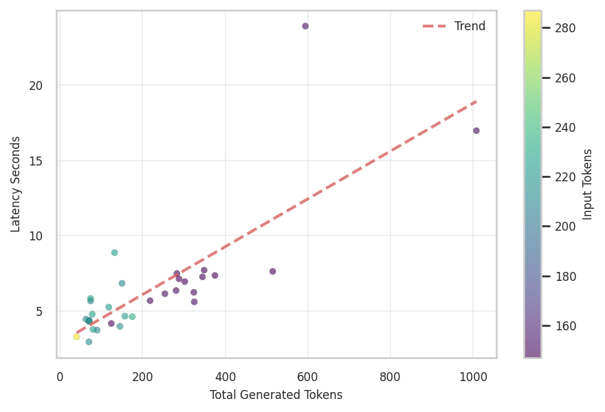](report_assets_20260305_194902/latency_scatter_lookup_worker_1_gemini-3_1-pro-preview_4K.png)
<br>

#### lookup_worker_2


**gemini-2.5-pro**

- **Number of Requests**: 26


- **Correlation**: 0.750 (Strong)


**Latency vs Tokens (lookup_worker_2 via gemini-2.5-pro)**<br>

[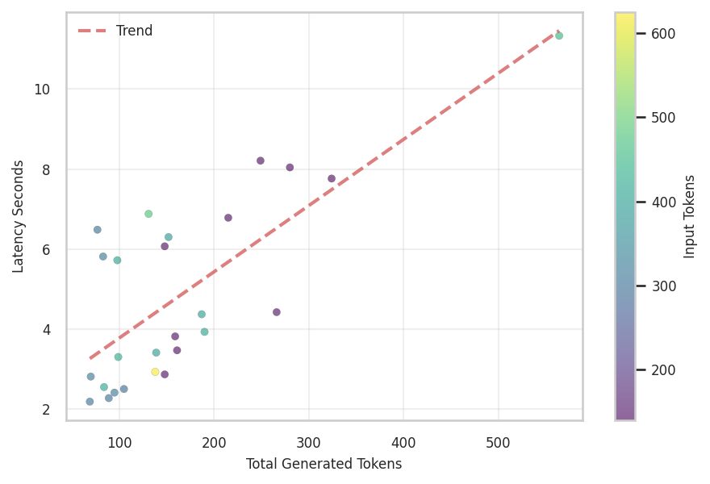](report_assets_20260305_194902/latency_scatter_lookup_worker_2_gemini-2_5-pro_4K.png)
<br>

**gemini-3.1-pro-preview**

- **Number of Requests**: 24


- **Correlation**: 0.846 (Very Strong)


**Latency vs Tokens (lookup_worker_2 via gemini-3.1-pro-preview)**<br>

[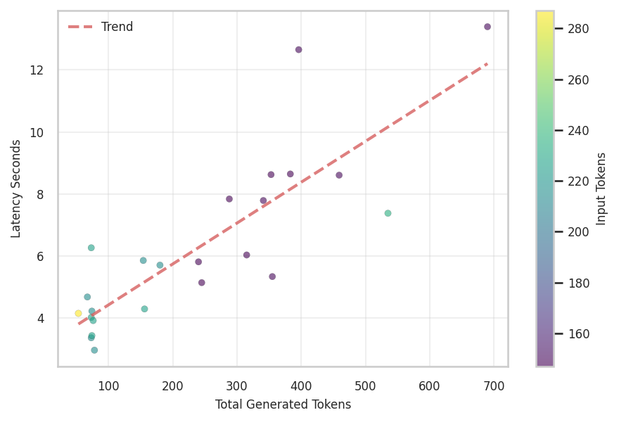](report_assets_20260305_194902/latency_scatter_lookup_worker_2_gemini-3_1-pro-preview_4K.png)
<br>

#### lookup_worker_3


**gemini-2.5-flash**

- **Number of Requests**: 6


- **Correlation**: 0.683 (Strong)


**Latency vs Tokens (lookup_worker_3 via gemini-2.5-flash)**<br>

[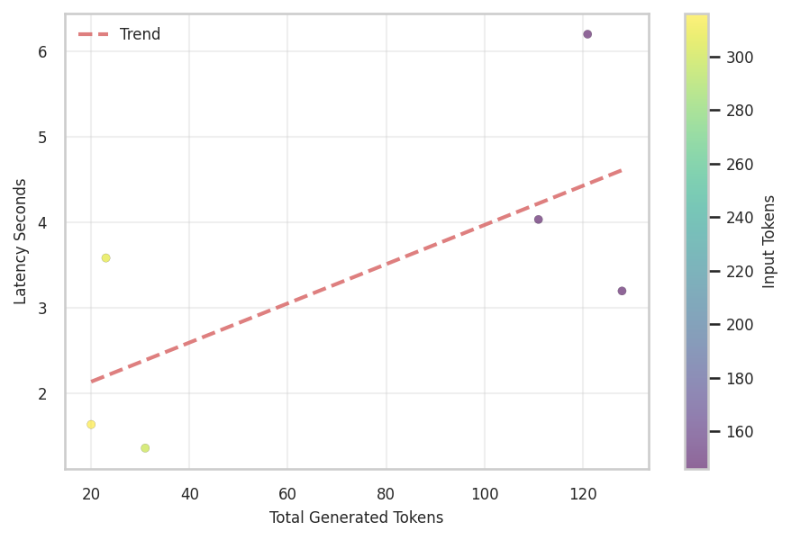](report_assets_20260305_194902/latency_scatter_lookup_worker_3_gemini-2_5-flash_4K.png)
<br>

**gemini-2.5-pro**

- **Number of Requests**: 20


- **Correlation**: 0.996 (Very Strong)


**Latency vs Tokens (lookup_worker_3 via gemini-2.5-pro)**<br>

[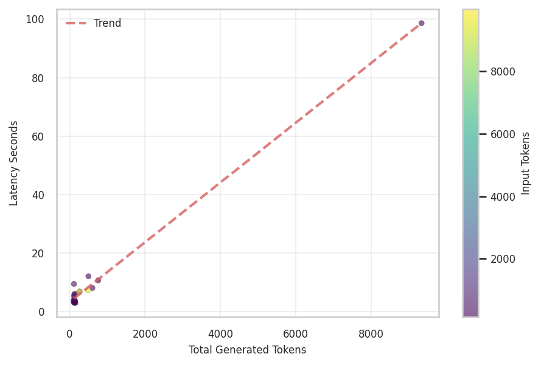](report_assets_20260305_194902/latency_scatter_lookup_worker_3_gemini-2_5-pro_4K.png)
<br>

**gemini-3.1-pro-preview**

- **Number of Requests**: 28


- **Correlation**: 0.880 (Very Strong)


**Latency vs Tokens (lookup_worker_3 via gemini-3.1-pro-preview)**<br>

[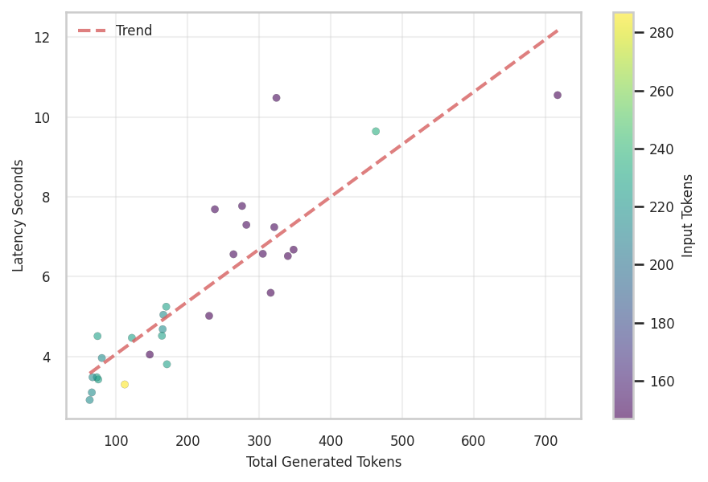](report_assets_20260305_194902/latency_scatter_lookup_worker_3_gemini-3_1-pro-preview_4K.png)
<br>

#### unreliable_tool_agent


**gemini-2.5-flash**

- **Number of Requests**: 15


- **Correlation**: 0.146 (Very Weak / None)


**Latency vs Tokens (unreliable_tool_agent via gemini-2.5-flash)**<br>

[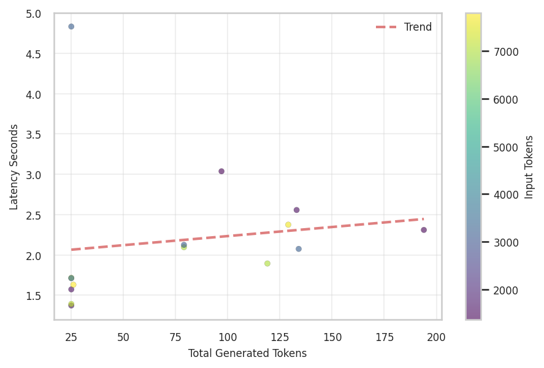](report_assets_20260305_194902/latency_scatter_unreliable_tool_agent_gemini-2_5-flash_4K.png)
<br>

**gemini-2.5-pro**

- **Number of Requests**: 26


- **Correlation**: -0.046 (Very Weak / None)


**Latency vs Tokens (unreliable_tool_agent via gemini-2.5-pro)**<br>

[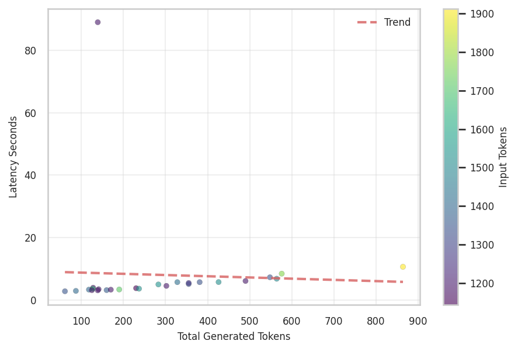](report_assets_20260305_194902/latency_scatter_unreliable_tool_agent_gemini-2_5-pro_4K.png)
<br>
