# Agents Observability Report

| **Property**        | **Value**                 |
|:--------------------|:--------------------------|
| **Project ID**      | `agent-operations-ek-05`  |
| **Playbook**        | `overview`                |
| **Time Range**      | `all`                     |
| **Analysis Window** | `All Available History`   |
| **Datastore ID**    | `logging`                 |
| **Table ID**        | `agent_events_demo_v2`    |
| **Generated**       | `2026-03-09 16:27:50 UTC` |
| **Agent Version**   | `0.0.2`                   |

---


## Executive Summary


The agent ecosystem is in a critical state, with every level—End-to-End, Agent, Tool, and LLM—breaching its defined Service Level Objectives (SLOs). The root of this systemic failure is not a single faulty component but a cascade of interconnected issues. The primary bottleneck is a system-level resource starvation in the agent orchestration layer, causing the most-used agents (`bigquery_data_agent` and `ai_observability_agent`) to time out with error rates of 66.37% and 87.85% respectively before they can even execute. Compounding this, agents like `config_test_agent_normal` exhibit astronomical internal code overhead (over 200 seconds), indicating severe architectural inefficiency. Downstream dependencies are also unstable, with `unreliable_tool_agent` failing 34.33% of the time due to tool timeouts, and all LLM models underperforming due to excessive 'thought token' generation. The system is failing due to scheduling bottlenecks, inefficient agent code, and unreliable downstream dependencies.


---


## Performance


Overall system performance is critical, with a 🔴 status across all monitored levels. The root agent `knowledge_qa_supervisor` has an overall 🔴 status, failing both latency and error targets. All sub-agents and LLM models also have an overall 🔴 status due to widespread SLO breaches.

This section provides a high-level scorecard for End to End, Sub Agent, Tool, and LLM levels, assessing compliance against defined Service Level Objectives (SLOs).


---


### End to End


The single root agent, `knowledge_qa_supervisor`, is severely underperforming with an overall 🔴 status. It has a P95.5 latency of 88.357s, far exceeding the 10s target, and an error rate of 43.55%, drastically missing the 5% error target. The mean latency is 30.656s. These failures are driven by a combination of sub-agent timeouts, high orchestration overhead, and tool errors.

This shows user-facing performance from start to end of an invocation.

| **Name**                    |   **Requests** | **%**   |   **Mean (s)** |   **P95.5 (s)** |   **Target (s)** | **Status**   |   **Err %** |   **Target (%)** | **Status**   | **Input Tok (Avg/P95)**   | **Output Tok (Avg/P95)**   | **Thought Tok (Avg/P95)**   | **Tokens Consumed (Avg/P95)**   | **Overall**   |
|:----------------------------|---------------:|:--------|---------------:|----------------:|-----------------:|:-------------|------------:|-----------------:|:-------------|:--------------------------|:---------------------------|:----------------------------|:--------------------------------|:--------------|
| **knowledge_qa_supervisor** |           1922 | 100.0%  |         30.656 |          88.357 |               10 | 🔴           |       43.55 |                5 | 🔴           | 20093 / 106839            | 109 / 709                  | 417 / 1366                  | 20649 / 107292                  | 🔴            |

<br>


**Root Agent Execution**

The following charts display the end-to-end execution latency for each top-level Root Agent over the course of the test run, plotted in the order the requests were received. This helps identify degradation in overall system performance over time.


**knowledge_qa_supervisor Latency (Request Order)**<br>

[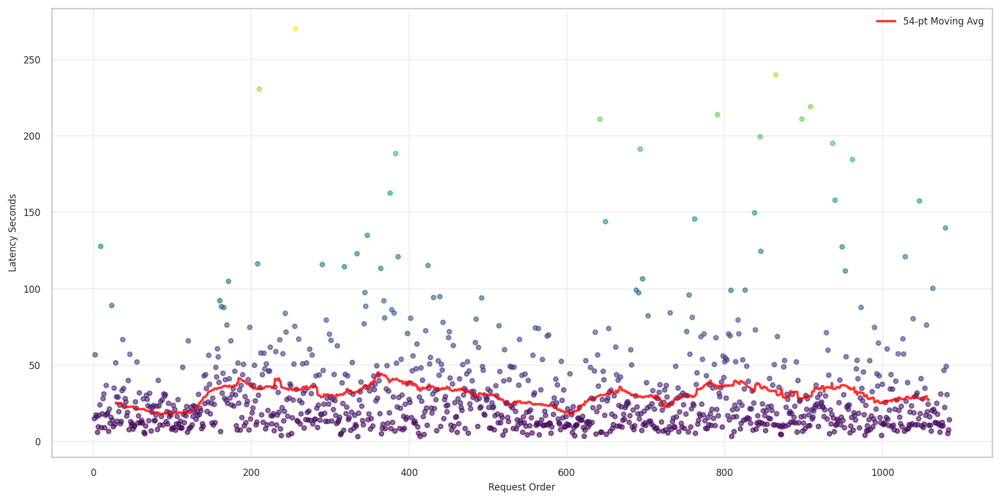](report_assets_20260309_162639/e2e_sequence_knowledge_qa_supervisor_4K.png)
<br>

**knowledge_qa_supervisor Latency Histogram**<br>

[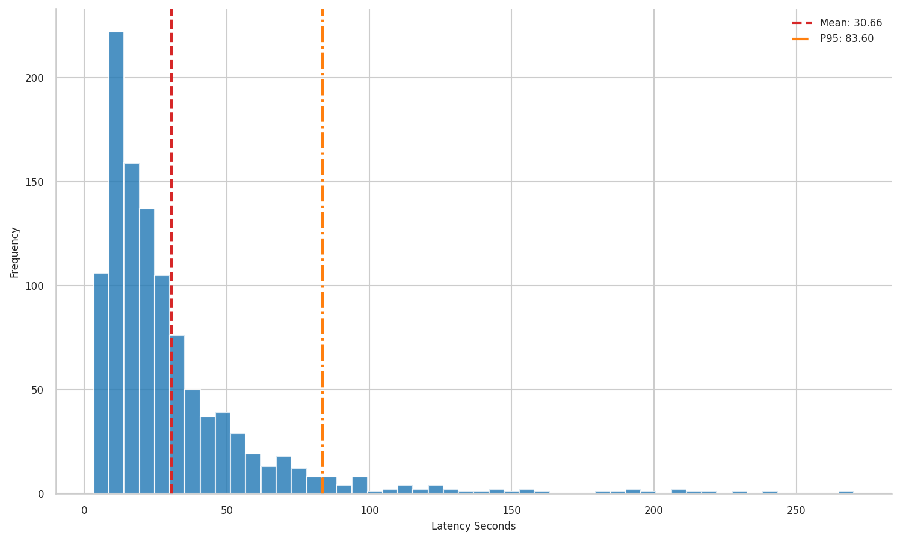](report_assets_20260309_162639/e2e_histogram_knowledge_qa_supervisor_4K.png)
<br>


---


### Agent Level


All sub-agents have a 🔴 overall status. Critical failures include `config_test_agent_wrong_max_tokens` with a 100% error rate due to misconfiguration. `ai_observability_agent` has an 87.85% error rate, and `bigquery_data_agent` has a 66.37% error rate, primarily due to system-level timeouts. `unreliable_tool_agent` shows a 34.33% error rate from cascading tool failures. The slowest agent by mean latency is `config_test_agent_normal` at 71.568s, massively exceeding its 8s target.

| Name                                   |   Requests | %     | Mean (s)   | P95.5 (s)   |   Target (s) | Status   |   Err % |   Target (%) | Err Status   | Overall   |
|:---------------------------------------|-----------:|:------|:-----------|:------------|-------------:|:---------|--------:|-------------:|:-------------|:----------|
| **config_test_agent_normal**           |         82 | 2.9%  | 71.568     | 220.386     |            8 | 🔴       |    0    |            5 | 🟢           | 🔴        |
| **bigquery_data_agent**                |        672 | 24.0% | 46.678     | 144.883     |            8 | 🔴       |   66.37 |            5 | 🔴           | 🔴        |
| **config_test_agent_wrong_candidates** |         39 | 1.4%  | 32.642     | 83.928      |            8 | 🔴       |    0    |            5 | 🟢           | 🔴        |
| **adk_documentation_agent**            |        373 | 13.3% | 26.856     | 66.41       |            8 | 🔴       |   13.94 |            5 | 🔴           | 🔴        |
| **google_search_agent**                |        162 | 5.8%  | 19.346     | 45.503      |            8 | 🔴       |    0    |            5 | 🟢           | 🔴        |
| **parallel_db_lookup**                 |        122 | 4.4%  | 18.808     | 44.752      |            8 | 🔴       |    3.28 |            5 | 🟢           | 🔴        |
| **ai_observability_agent**             |        724 | 25.9% | 17.671     | 34.271      |            8 | 🔴       |   87.85 |            5 | 🔴           | 🔴        |
| **config_test_agent_high_temp**        |         37 | 1.3%  | 17.202     | 58.117      |            8 | 🔴       |    0    |            5 | 🟢           | 🔴        |
| **config_test_agent_over_provisioned** |         46 | 1.6%  | 16.594     | 50.294      |            8 | 🔴       |    4.35 |            5 | 🟢           | 🔴        |
| **unreliable_tool_agent**              |         67 | 2.4%  | 15.908     | 101.719     |            8 | 🔴       |   34.33 |            5 | 🔴           | 🔴        |
| **lookup_worker_1**                    |        122 | 4.4%  | 15.73      | 43.665      |            8 | 🔴       |    1.64 |            5 | 🟢           | 🔴        |
| **lookup_worker_3**                    |        122 | 4.4%  | 14.402     | 31.704      |            8 | 🔴       |    2.46 |            5 | 🟢           | 🔴        |
| **lookup_worker_2**                    |        122 | 4.4%  | 14.022     | 30.333      |            8 | 🔴       |    2.46 |            5 | 🟢           | 🔴        |
| **config_test_agent_wrong_max_tokens** |        108 | 3.9%  | -          | -           |            8 | ⚪       |  100    |            5 | 🔴           | 🔴        |

<br>

**Agent Level Usage**<br>

[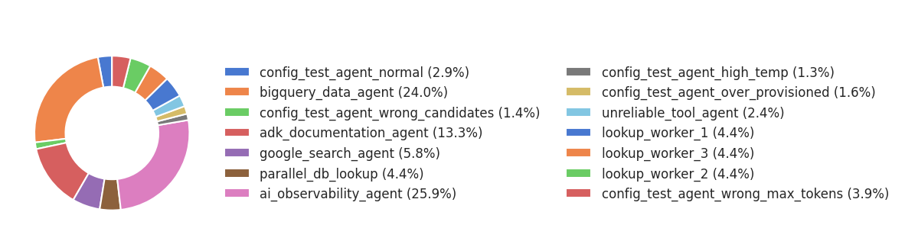](report_assets_20260309_162639/agent__usage_4K.png)
<br>

**Agent Level Latency (Target: 8.0s)**<br>

[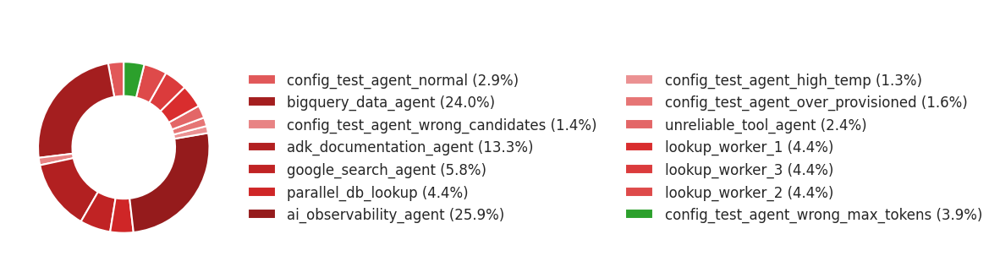](report_assets_20260309_162639/agent__lat_status_4K.png)
<br>

**Agent Level Error (Target: 5.0%)**<br>

[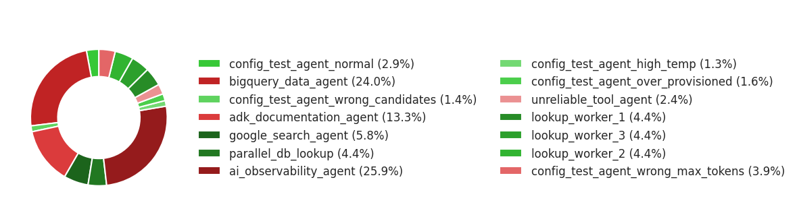](report_assets_20260309_162639/agent__err_status_4K.png)
<br>


---


### Tool Level


While most tools perform within their latency targets, `flaky_tool_simulation` has a critical 17.46% error rate, breaching the 5% target and causing instability in its parent agent. The most frequently used tools are `simulated_db_lookup` (37.1% of requests) and `execute_sql` (33.9% of requests), both of which are stable. The slowest tool by mean latency is `complex_calculation` at 2.008s, which is still within its 3s target.

| Name                      |   Requests | %     |   Mean (s) |   P95.5 (s) |   Target (s) | Status   |   Err % |   Target (%) | Err Status   | Overall   |
|:--------------------------|-----------:|:------|-----------:|------------:|-------------:|:---------|--------:|-------------:|:-------------|:----------|
| **complex_calculation**   |         48 | 2.2%  |      2.008 |       2.866 |            3 | 🟢       |    0    |            5 | 🟢           | 🟢        |
| **flaky_tool_simulation** |         63 | 2.9%  |      1.177 |       1.897 |            3 | 🟢       |   17.46 |            5 | 🔴           | 🔴        |
| **execute_sql**           |        742 | 33.9% |      0.727 |       1.336 |            3 | 🟢       |    0    |            5 | 🟢           | 🟢        |
| **simulated_db_lookup**   |        812 | 37.1% |      0.598 |       0.963 |            3 | 🟢       |    0    |            5 | 🟢           | 🟢        |
| **list_dataset_ids**      |         73 | 3.3%  |      0.31  |       0.243 |            3 | 🟢       |    0    |            5 | 🟢           | 🟢        |
| **get_dataset_info**      |          3 | 0.1%  |      0.223 |       0.282 |            3 | 🟢       |    0    |            5 | 🟢           | 🟢        |
| **list_table_ids**        |        166 | 7.6%  |      0.163 |       0.277 |            3 | 🟢       |    0    |            5 | 🟢           | 🟢        |
| **get_table_info**        |        277 | 12.6% |      0.151 |       0.197 |            3 | 🟢       |    0    |            5 | 🟢           | 🟢        |
| **ask_data_insights**     |          4 | 0.2%  |      0.059 |       0.072 |            3 | 🟢       |    0    |            5 | 🟢           | 🟢        |
| **detect_anomalies**      |          2 | 0.1%  |      0     |       0.001 |            3 | 🟢       |    0    |            5 | 🟢           | 🟢        |

<br>

**Tool Level Usage**<br>

[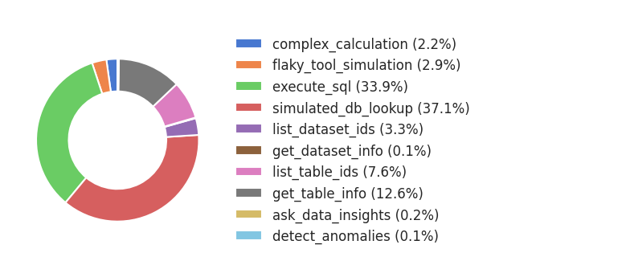](report_assets_20260309_162639/tool__usage_4K.png)
<br>

**Tool Level Latency (Target: 3.0s)**<br>

[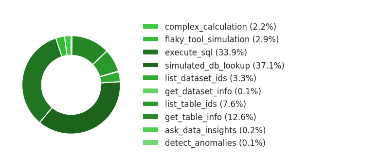](report_assets_20260309_162639/tool__lat_status_4K.png)
<br>

**Tool Level Error (Target: 5.0%)**<br>

[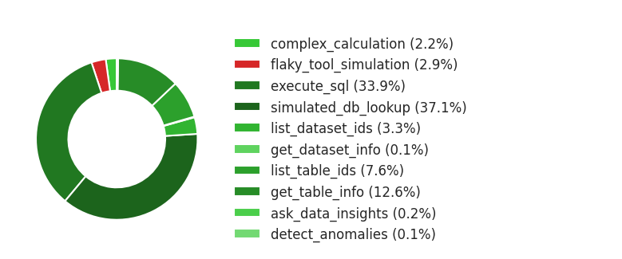](report_assets_20260309_162639/tool__err_status_4K.png)
<br>


---


### Model Level


All models exhibit a 🔴 overall status, failing to meet either latency or error rate targets. The most used model is `gemini-2.5-flash` (41.8% of requests). The models with the highest P95.5 latency are `gemini-3.1-pro-preview` (46.902s) and `gemini-3-pro-preview` (36.473s), both well above the 5.0s target. All models show error rates above the 5% SLO, with `gemini-2.5-pro` being the highest at 11.08%.

| Name                       |   Requests | %     |   Mean (s) |   P95.5 (s) |   Target (s) | Status   |   Err % |   Target (%) | Err Status   | Input Tok (Avg/P95)   | Output Tok (Avg/P95)   | Thought Tok (Avg/P95)   | Tokens Consumed (Avg/P95)   | Overall   |
|:---------------------------|-----------:|:------|-----------:|------------:|-------------:|:---------|--------:|-------------:|:-------------|:----------------------|:-----------------------|:------------------------|:----------------------------|:----------|
| **gemini-3-pro-preview**   |        976 | 15.1% |     11.666 |      36.473 |            5 | 🔴       |    9.32 |            5 | 🔴           | 13636 / 96469         | 118 / 760              | 710 / 2256              | 14410 / 96871               | 🔴        |
| **gemini-3.1-pro-preview** |        954 | 14.8% |     11.563 |      46.902 |            5 | 🔴       |    6.71 |            5 | 🔴           | 22565 / 126498        | 142 / 713              | 605 / 2585              | 23312 / 126650              | 🔴        |
| **gemini-2.5-pro**         |       1832 | 28.3% |      7.166 |      23.488 |            5 | 🔴       |   11.08 |            5 | 🔴           | 19315 / 108417        | 138 / 844              | 381 / 1225              | 19914 / 108864              | 🔴        |
| **gemini-2.5-flash**       |       2701 | 41.8% |      3.64  |      10.735 |            5 | 🔴       |    8.29 |            5 | 🔴           | 22024 / 104510        | 76 / 440               | 270 / 856               | 22404 / 104754              | 🔴        |

<br>

**Model Level Usage**<br>

[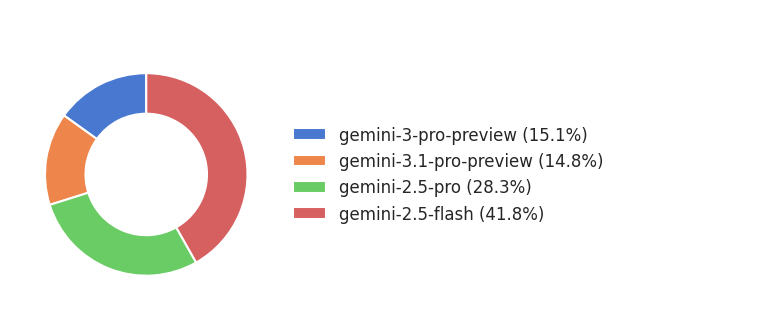](report_assets_20260309_162639/model__usage_4K.png)
<br>

**Model Level Latency (Target: 5.0s)**<br>

[](report_assets_20260309_162639/model__lat_status_4K.png)
<br>

**Model Level Error (Target: 5.0%)**<br>

[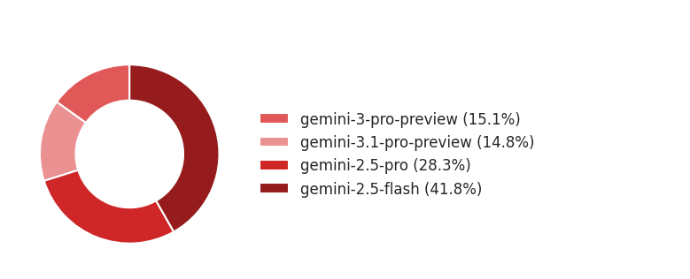](report_assets_20260309_162639/model__err_status_4K.png)
<br>


---


## Agent Details


The most frequently invoked sub-agents are `ai_observability_agent` (25.9%) and `bigquery_data_agent` (24.0%), which are also the two agents with the highest error rates. `knowledge_qa_supervisor`, despite being a supervisor, makes the most LLM calls, followed by `bigquery_data_agent`, indicating these two are the most LLM-intensive components.


### Root Agents Summary

A high-level cross-report summary for each root workflow.


**`knowledge_qa_supervisor`**
- **Requests:** 1922 (100.0%)
- **Status:** 🔴 Overall (Lat: 🔴, Err: 🔴)
- **Latency (Mean / P95.5):** 30.656s / 88.357s
- **Errors:** 43.55%
- **Total Tokens (Avg/P95.5):** 20649 / 107292
- **Input:** 20093 / 106839 | **Output:** 109 / 709 | **Thought:** 417 / 1366


### Sub-Agents Summary

A high-level cross-report summary for each sub-agent.


**`config_test_agent_normal`**
- **Requests:** 82 (2.9%)
- **Status:** 🔴 Overall (Lat: 🔴, Err: 🟢)
- **Latency (Mean / P95.5):** 71.568s / 220.386s
- **Errors:** 0.0%
- **Total Tokens (Avg/P95.5):** 9011 / 18523
- **Input:** 8574 / 18182 | **Output:** 85 / 490 | **Thought:** 350 / 653


**`bigquery_data_agent`**
- **Requests:** 672 (24.0%)
- **Status:** 🔴 Overall (Lat: 🔴, Err: 🔴)
- **Latency (Mean / P95.5):** 46.678s / 144.883s
- **Errors:** 66.37%
- **Total Tokens (Avg/P95.5):** 47583 / 113406
- **Input:** 47182 / 112314 | **Output:** 65 / 165 | **Thought:** 336 / 977


**`config_test_agent_wrong_candidates`**
- **Requests:** 39 (1.4%)
- **Status:** 🔴 Overall (Lat: 🔴, Err: 🟢)
- **Latency (Mean / P95.5):** 32.642s / 83.928s
- **Errors:** 0.0%
- **Total Tokens (Avg/P95.5):** 8015 / 20971
- **Input:** 2023 / 3693 | **Output:** 828 / 2505 | **Thought:** 5884 / 17050


**`adk_documentation_agent`**
- **Requests:** 373 (13.3%)
- **Status:** 🔴 Overall (Lat: 🔴, Err: 🔴)
- **Latency (Mean / P95.5):** 26.856s / 66.41s
- **Errors:** 13.94%
- **Total Tokens (Avg/P95.5):** 4173 / 5349
- **Input:** 1586 / 526 | **Output:** 602 / 1122 | **Thought:** 1452 / 3223


**`google_search_agent`**
- **Requests:** 162 (5.8%)
- **Status:** 🔴 Overall (Lat: 🔴, Err: 🟢)
- **Latency (Mean / P95.5):** 19.346s / 45.503s
- **Errors:** 0.0%
- **Total Tokens (Avg/P95.5):** 11291 / 99923
- **Input:** 9652 / 98454 | **Output:** 755 / 1326 | **Thought:** 676 / 1806


**`parallel_db_lookup`**
- **Requests:** 122 (4.4%)
- **Status:** 🔴 Overall (Lat: 🔴, Err: 🟢)
- **Latency (Mean / P95.5):** 18.808s / 44.752s
- **Errors:** 3.28%
- **Total Tokens (Avg/P95.5):** -
- **Input:** - | **Output:** - | **Thought:** -


**`ai_observability_agent`**
- **Requests:** 724 (25.9%)
- **Status:** 🔴 Overall (Lat: 🔴, Err: 🔴)
- **Latency (Mean / P95.5):** 17.671s / 34.271s
- **Errors:** 87.85%
- **Total Tokens (Avg/P95.5):** 2166 / 4000
- **Input:** 278 / 379 | **Output:** 514 / 1014 | **Thought:** 862 / 2039


**`config_test_agent_high_temp`**
- **Requests:** 37 (1.3%)
- **Status:** 🔴 Overall (Lat: 🔴, Err: 🟢)
- **Latency (Mean / P95.5):** 17.202s / 58.117s
- **Errors:** 0.0%
- **Total Tokens (Avg/P95.5):** 2874 / 5380
- **Input:** 1799 / 2727 | **Output:** 483 / 1925 | **Thought:** 606 / 2043


**`config_test_agent_over_provisioned`**
- **Requests:** 46 (1.6%)
- **Status:** 🔴 Overall (Lat: 🔴, Err: 🟢)
- **Latency (Mean / P95.5):** 16.594s / 50.294s
- **Errors:** 4.35%
- **Total Tokens (Avg/P95.5):** 8025 / 5325
- **Input:** 7492 / 3827 | **Output:** 191 / 1129 | **Thought:** 406 / 1091


**`unreliable_tool_agent`**
- **Requests:** 67 (2.4%)
- **Status:** 🔴 Overall (Lat: 🔴, Err: 🔴)
- **Latency (Mean / P95.5):** 15.908s / 101.719s
- **Errors:** 34.33%
- **Total Tokens (Avg/P95.5):** 2190 / 3052
- **Input:** 1949 / 2686 | **Output:** 30 / 65 | **Thought:** 264 / 547


**`lookup_worker_1`**
- **Requests:** 122 (4.4%)
- **Status:** 🔴 Overall (Lat: 🔴, Err: 🟢)
- **Latency (Mean / P95.5):** 15.73s / 43.665s
- **Errors:** 1.64%
- **Total Tokens (Avg/P95.5):** 2216 / 3429
- **Input:** 1844 / 2257 | **Output:** 46 / 86 | **Thought:** 408 / 1458


**`lookup_worker_3`**
- **Requests:** 122 (4.4%)
- **Status:** 🔴 Overall (Lat: 🔴, Err: 🟢)
- **Latency (Mean / P95.5):** 14.402s / 31.704s
- **Errors:** 2.46%
- **Total Tokens (Avg/P95.5):** 2162 / 3276
- **Input:** 1830 / 1968 | **Output:** 46 / 86 | **Thought:** 367 / 1484


**`lookup_worker_2`**
- **Requests:** 122 (4.4%)
- **Status:** 🔴 Overall (Lat: 🔴, Err: 🟢)
- **Latency (Mean / P95.5):** 14.022s / 30.333s
- **Errors:** 2.46%
- **Total Tokens (Avg/P95.5):** 2195 / 3145
- **Input:** 1829 / 1983 | **Output:** 42 / 82 | **Thought:** 384 / 1411


**`config_test_agent_wrong_max_tokens`**
- **Requests:** 108 (3.9%)
- **Status:** 🔴 Overall (Lat: ⚪, Err: 🔴)
- **Latency (Mean / P95.5):** -s / -s
- **Errors:** 100.0%
- **Total Tokens (Avg/P95.5):** -
- **Input:** - | **Output:** - | **Thought:** -


### Distribution

**Total Requests:** 2798

| **Name**                               |   **Requests** |   **%** |
|:---------------------------------------|---------------:|--------:|
| **config_test_agent_normal**           |             82 |    2.93 |
| **bigquery_data_agent**                |            672 |   24.02 |
| **config_test_agent_wrong_candidates** |             39 |    1.39 |
| **adk_documentation_agent**            |            373 |   13.33 |
| **google_search_agent**                |            162 |    5.79 |
| **parallel_db_lookup**                 |            122 |    4.36 |
| **ai_observability_agent**             |            724 |   25.88 |
| **config_test_agent_high_temp**        |             37 |    1.32 |
| **config_test_agent_over_provisioned** |             46 |    1.64 |
| **unreliable_tool_agent**              |             67 |    2.39 |
| **lookup_worker_1**                    |            122 |    4.36 |
| **lookup_worker_3**                    |            122 |    4.36 |
| **lookup_worker_2**                    |            122 |    4.36 |
| **config_test_agent_wrong_max_tokens** |            108 |    3.86 |

<br>

**Agent Composition**<br>

[](report_assets_20260309_162639/agent_composition_pie_4K.png)
<br>

**Total LLM Calls per Agent**<br>

[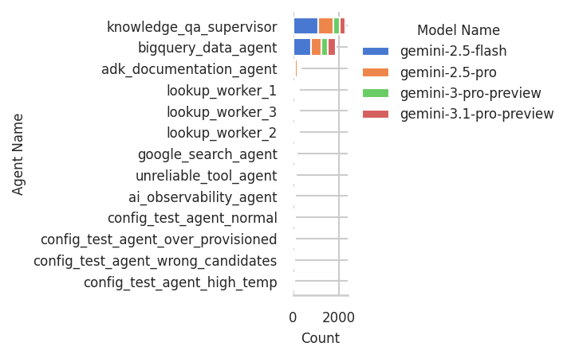](report_assets_20260309_162639/agent_calls_stacked_4K.png)
<br>


### Model Traffic

| **Agent Name**                         | **gemini-2.5-flash**   | **gemini-2.5-pro**   | **gemini-3-pro-preview**   | **gemini-3.1-pro-preview**   |
|:---------------------------------------|:-----------------------|:---------------------|:---------------------------|:-----------------------------|
| **adk_documentation_agent**            | 102 (28%)              | 125 (35%)            | 76 (21%)                   | 58 (16%)                     |
| **ai_observability_agent**             | 248 (46%)              | 209 (39%)            | 50 (9%)                    | 32 (6%)                      |
| **bigquery_data_agent**                | 794 (42%)              | 448 (24%)            | 299 (16%)                  | 364 (19%)                    |
| **config_test_agent_high_temp**        | 14 (34%)               | 9 (22%)              | 10 (24%)                   | 8 (20%)                      |
| **config_test_agent_normal**           | 55 (65%)               | 10 (12%)             | 9 (11%)                    | 10 (12%)                     |
| **config_test_agent_over_provisioned** | 18 (24%)               | 25 (33%)             | 13 (17%)                   | 19 (25%)                     |
| **config_test_agent_wrong_candidates** | 20 (41%)               | 13 (27%)             | 7 (14%)                    | 9 (18%)                      |
| **config_test_agent_wrong_max_tokens** | 16 (22%)               | 20 (28%)             | 12 (17%)                   | 24 (33%)                     |
| **google_search_agent**                | 50 (31%)               | 77 (48%)             | 15 (9%)                    | 20 (12%)                     |
| **knowledge_qa_supervisor**            | 1105 (48%)             | 669 (29%)            | 274 (12%)                  | 240 (10%)                    |
| **lookup_worker_1**                    | 84 (32%)               | 56 (22%)             | 64 (25%)                   | 56 (22%)                     |
| **lookup_worker_2**                    | 84 (33%)               | 52 (21%)             | 60 (24%)                   | 55 (22%)                     |
| **lookup_worker_3**                    | 87 (34%)               | 52 (20%)             | 61 (24%)                   | 57 (22%)                     |
| **unreliable_tool_agent**              | 24 (20%)               | 67 (56%)             | 26 (22%)                   | 2 (2%)                       |

<br>


### Model Performance (Agent End-to-End)

This table compares how specific agents perform when running on different models. **Values represent Agent End-to-End Latency** (including tool execution and overhead), not just LLM generation time.

> [!NOTE]
> **KPI Settings:** Latency Target = `8.0s`, Error Target = `5.0%`
> **Cell Format:** `[Status] [P95.5 Latency]s ([Error Rate]%)`. For example, `🔴 21.558s (16.67%)` means the Agent had a P95.5 latency of 21.558 seconds and an error rate of 16.67%, and received a failing 🔴 status because it breached either the latency or error target.

| **Agent Name**                         | **gemini-2.5-flash**   | **gemini-2.5-pro**   | **gemini-3-pro-preview**   | **gemini-3.1-pro-preview**   |
|:---------------------------------------|:-----------------------|:---------------------|:---------------------------|:-----------------------------|
| **adk_documentation_agent**            | 🔴 21.269s (5.88%)     | 🔴 32.856s (9.6%)    | 🔴 89.345s (23.68%)        | 🔴 109.564s (6.9%)           |
| **ai_observability_agent**             | 🔴 26.633s (79.84%)    | 🔴 36.817s (81.82%)  | -                          | -                            |
| **bigquery_data_agent**                | 🔴 54.513s (82.96%)    | 🔴 109.035s (15.22%) | 🔴 187.519s (38.1%)        | 🔴 205.96s (22.0%)           |
| **config_test_agent_high_temp**        | 🔴 19.379s (0.0%)      | 🔴 29.039s (0.0%)    | 🔴 135.376s (0.0%)         | 🔴 58.117s (0.0%)            |
| **config_test_agent_normal**           | 🔴 225.848s (0.0%)     | 🔴 40.256s (0.0%)    | 🔴 17.965s (0.0%)          | 🔴 35.263s (0.0%)            |
| **config_test_agent_over_provisioned** | 🔴 25.233s (0.0%)      | 🔴 17.408s (0.0%)    | 🔴 21.329s (22.22%)        | 🔴 136.016s (0.0%)           |
| **config_test_agent_wrong_candidates** | 🔴 55.247s (0.0%)      | 🔴 83.928s (0.0%)    | 🔴 92.99s (0.0%)           | 🔴 82.637s (0.0%)            |
| **config_test_agent_wrong_max_tokens** | -                      | -                    | -                          | -                            |
| **google_search_agent**                | 🔴 16.62s (0.0%)       | 🔴 52.331s (0.0%)    | 🔴 64.451s (0.0%)          | 🔴 83.123s (0.0%)            |
| **knowledge_qa_supervisor**            | 🔴 156.513s (67.42%)   | 🔴 71.65s (50.97%)   | 🔴 143.92s (50.36%)        | 🔴 157.932s (36.67%)         |
| **lookup_worker_1**                    | 🔴 11.351s (0.0%)      | 🔴 33.191s (0.0%)    | 🔴 47.38s (3.33%)          | 🔴 34.507s (0.0%)            |
| **lookup_worker_2**                    | 🔴 11.931s (0.0%)      | 🔴 19.264s (0.0%)    | 🔴 35.373s (6.67%)         | 🔴 30.176s (0.0%)            |
| **lookup_worker_3**                    | 🔴 12.216s (0.0%)      | 🔴 16.008s (4.17%)   | 🔴 46.602s (3.33%)         | 🔴 24.881s (3.45%)           |
| **unreliable_tool_agent**              | 🔴 7.536s (30.77%)     | 🔴 10.547s (44.74%)  | 🔴 116.314s (13.33%)       | 🔴 15.857s (0.0%)            |

<br>


### LLM Generation Performance

This table compares the raw LLM generation time for specific agents and models. **Values represent Pure LLM Latency** (excluding agent overhead).

> [!NOTE]
> **KPI Settings:** Latency Target = `5.0s`, Error Target = `5.0%`
> **Cell Format:** `[Status] [P95.5 Latency]s ([Error Rate]%)`.

| **Agent Name**                         | **gemini-2.5-flash**   | **gemini-2.5-pro**   | **gemini-3-pro-preview**   | **gemini-3.1-pro-preview**   |
|:---------------------------------------|:-----------------------|:---------------------|:---------------------------|:-----------------------------|
| **adk_documentation_agent**            | 🔴 21.268s (5.88%)     | 🔴 32.854s (9.6%)    | 🔴 89.344s (23.68%)        | 🔴 109.563s (6.9%)           |
| **ai_observability_agent**             | 🔴 26.631s (79.84%)    | 🔴 36.816s (81.82%)  | -                          | -                            |
| **bigquery_data_agent**                | 🔴 7.303s (0.25%)      | 🔴 13.927s (0.0%)    | 🔴 19.711s (3.01%)         | 🔴 16.683s (0.82%)           |
| **config_test_agent_high_temp**        | 🔴 13.824s (0.0%)      | 🔴 23.622s (0.0%)    | 🔴 26.067s (0.0%)          | 🔴 58.115s (0.0%)            |
| **config_test_agent_normal**           | 🟢 3.815s (0.0%)       | 🔴 12.457s (0.0%)    | 🔴 17.963s (0.0%)          | 🔴 27.563s (0.0%)            |
| **config_test_agent_over_provisioned** | 🔴 10.041s (0.0%)      | 🔴 11.419s (0.0%)    | 🔴 22.897s (0.0%)          | 🔴 50.292s (0.0%)            |
| **config_test_agent_wrong_candidates** | 🔴 14.826s (0.0%)      | 🔴 32.014s (0.0%)    | 🔴 92.988s (0.0%)          | 🔴 82.635s (0.0%)            |
| **config_test_agent_wrong_max_tokens** | -                      | -                    | -                          | -                            |
| **google_search_agent**                | 🔴 16.618s (0.0%)      | 🔴 52.328s (0.0%)    | 🔴 64.448s (0.0%)          | 🔴 83.121s (0.0%)            |
| **knowledge_qa_supervisor**            | 🟢 4.506s (0.18%)      | 🔴 5.545s (0.0%)     | 🔴 19.756s (0.0%)          | 🔴 12.721s (0.0%)            |
| **lookup_worker_1**                    | 🔴 5.032s (0.0%)       | 🔴 17.586s (0.0%)    | 🔴 33.588s (0.0%)          | 🔴 24.288s (0.0%)            |
| **lookup_worker_2**                    | 🟢 4.616s (0.0%)       | 🔴 9.096s (0.0%)     | 🔴 28.252s (1.67%)         | 🔴 20.515s (0.0%)            |
| **lookup_worker_3**                    | 🔴 5.013s (0.0%)       | 🔴 9.553s (0.0%)     | 🔴 30.555s (1.64%)         | 🔴 14.786s (1.75%)           |
| **unreliable_tool_agent**              | 🟢 2.64s (0.0%)        | 🔴 5.885s (0.0%)     | 🔴 20.434s (0.0%)          | 🔴 9.659s (0.0%)             |

<br>


### Agent Overhead Analysis

This chart breaks down the internal execution time of an Agent into **LLM Time**, **Tool Time**, and its own **Code Overhead** (the remaining time).

> [!NOTE]
> The data below is calculated using the **P95.5 execution latency** metrics across all events for each agent to illustrate worst-case internal overheads.


#### Overhead Data Summary

| **Agent Name**                         | **Total Agent Latency (s)**   | **Pure LLM Latency (s)**   | **Agent Overhead (s)**   |
|:---------------------------------------|:------------------------------|:---------------------------|:-------------------------|
| **config_test_agent_normal**           | 215.901s                      | 12.467s                    | 203.434s                 |
| **bigquery_data_agent**                | 203.741s                      | 14.124s                    | 189.617s                 |
| **config_test_agent_wrong_candidates** | 81.222s                       | 73.599s                    | 7.623s                   |
| **adk_documentation_agent**            | 66.279s                       | 66.277s                    | 0.002s                   |
| **unreliable_tool_agent**              | 57.925s                       | 11.824s                    | 46.101s                  |
| **google_search_agent**                | 45.092s                       | 45.09s                     | 0.002s                   |
| **lookup_worker_1**                    | 43.665s                       | 20.996s                    | 22.669s                  |
| **config_test_agent_high_temp**        | 36.691s                       | 27.12s                     | 9.572s                   |
| **ai_observability_agent**             | 33.833s                       | 33.832s                    | 0.001s                   |
| **lookup_worker_3**                    | 31.704s                       | 18.838s                    | 12.866s                  |

<br>

**Agent Overhead Comparison**<br>

[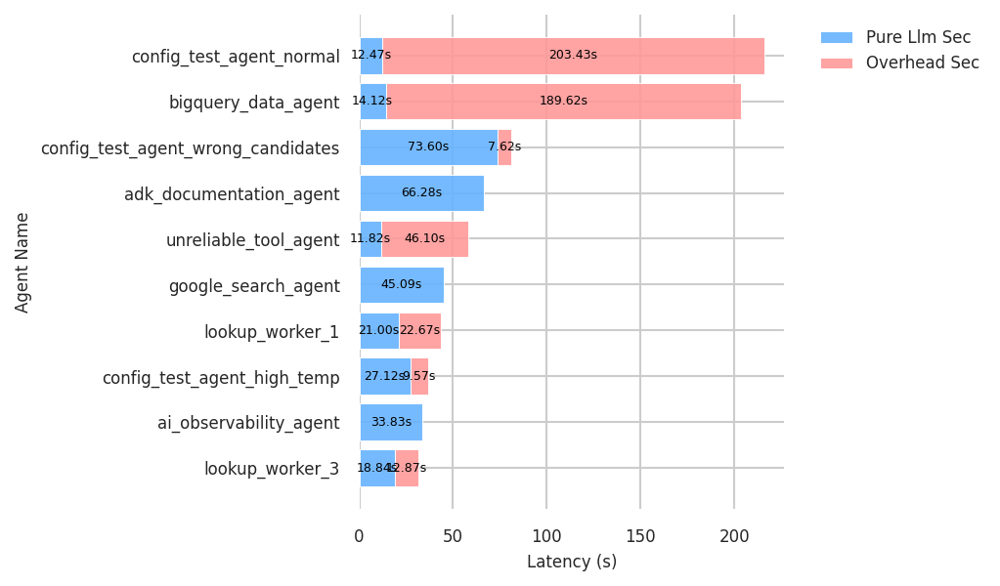](report_assets_20260309_162639/agent_overhead_composition_4K.png)
<br>


---


### Agent Execution Latency (Request Order)

The following charts display the end-to-end latency for each specific Agent over time, highlighting performance trends and potential internal degradation.


**adk_documentation_agent Execution Latency Sequence (Request Order)**<br>
**Total Requests:** 321<br>

[](report_assets_20260309_162639/seq_agent_overall_adk_documentation_agent_4K.png)
<br>

**ai_observability_agent Execution Latency Sequence (Request Order)**<br>
**Total Requests:** 88<br>

[](report_assets_20260309_162639/seq_agent_overall_ai_observability_agent_4K.png)
<br>

**bigquery_data_agent Execution Latency Sequence (Request Order)**<br>
**Total Requests:** 1337<br>

[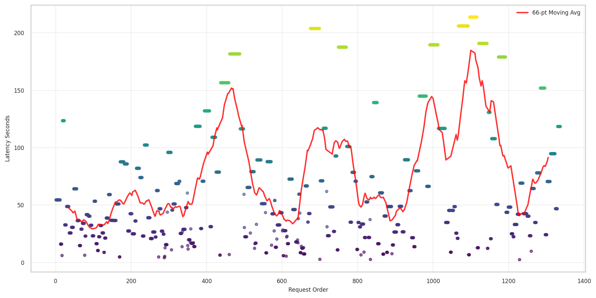](report_assets_20260309_162639/seq_agent_overall_bigquery_data_agent_4K.png)
<br>

**config_test_agent_high_temp Execution Latency Sequence (Request Order)**<br>
**Total Requests:** 41<br>

[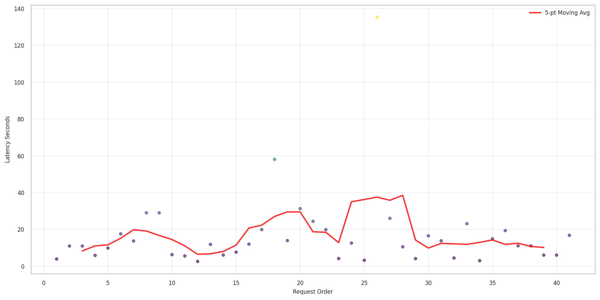](report_assets_20260309_162639/seq_agent_overall_config_test_agent_high_temp_4K.png)
<br>

**config_test_agent_normal Execution Latency Sequence (Request Order)**<br>
**Total Requests:** 84<br>

[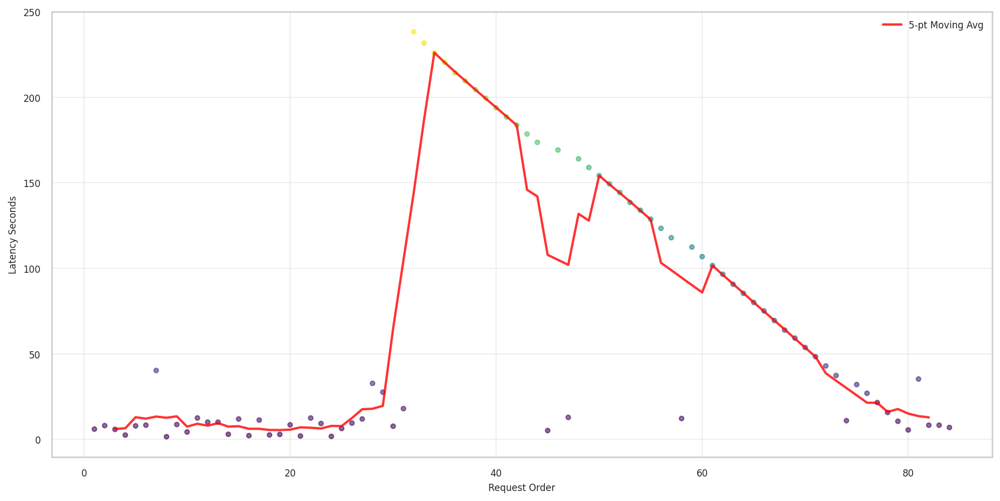](report_assets_20260309_162639/seq_agent_overall_config_test_agent_normal_4K.png)
<br>

**config_test_agent_over_provisioned Execution Latency Sequence (Request Order)**<br>
**Total Requests:** 73<br>

[](report_assets_20260309_162639/seq_agent_overall_config_test_agent_over_provisioned_4K.png)
<br>

**config_test_agent_wrong_candidates Execution Latency Sequence (Request Order)**<br>
**Total Requests:** 49<br>

[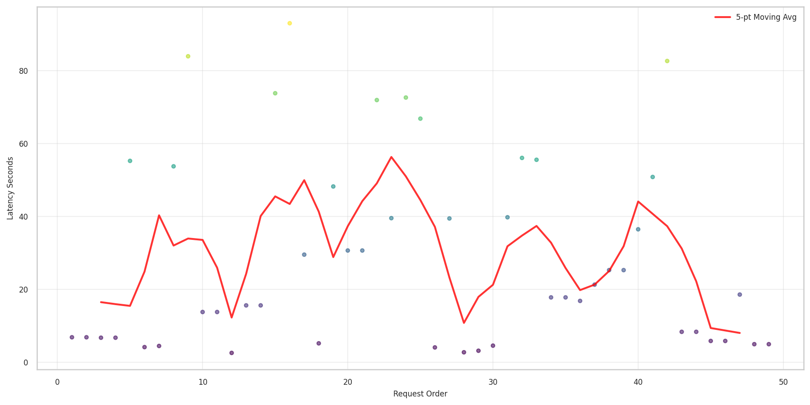](report_assets_20260309_162639/seq_agent_overall_config_test_agent_wrong_candidates_4K.png)
<br>

**google_search_agent Execution Latency Sequence (Request Order)**<br>
**Total Requests:** 162<br>

[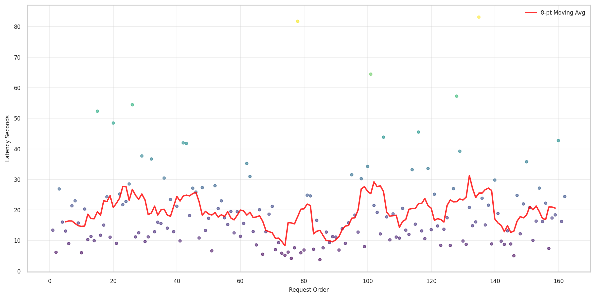](report_assets_20260309_162639/seq_agent_overall_google_search_agent_4K.png)
<br>

**lookup_worker_1 Execution Latency Sequence (Request Order)**<br>
**Total Requests:** 259<br>

[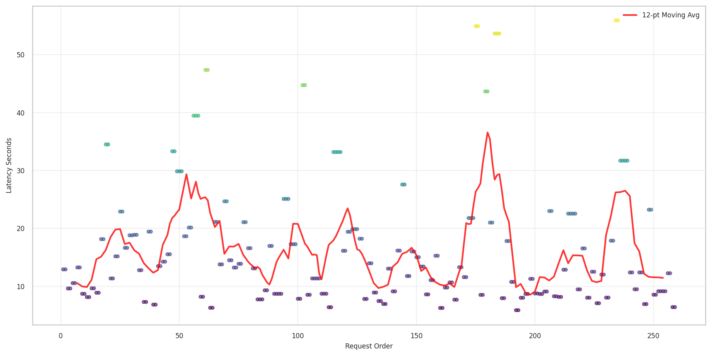](report_assets_20260309_162639/seq_agent_overall_lookup_worker_1_4K.png)
<br>

**lookup_worker_2 Execution Latency Sequence (Request Order)**<br>
**Total Requests:** 247<br>

[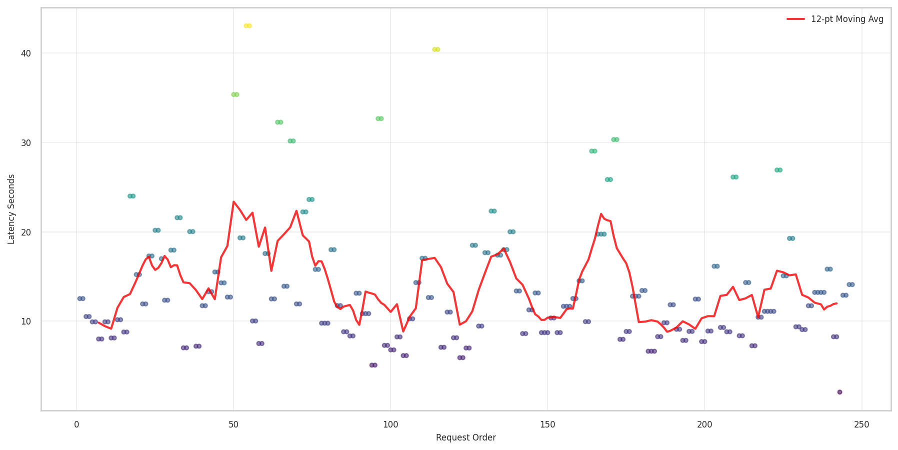](report_assets_20260309_162639/seq_agent_overall_lookup_worker_2_4K.png)
<br>

**lookup_worker_3 Execution Latency Sequence (Request Order)**<br>
**Total Requests:** 251<br>

[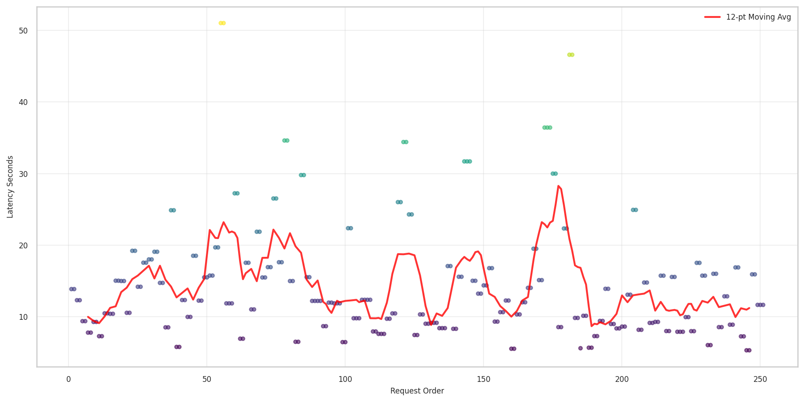](report_assets_20260309_162639/seq_agent_overall_lookup_worker_3_4K.png)
<br>

**parallel_db_lookup Execution Latency Sequence (Request Order)**<br>
**Total Requests:** 118<br>

[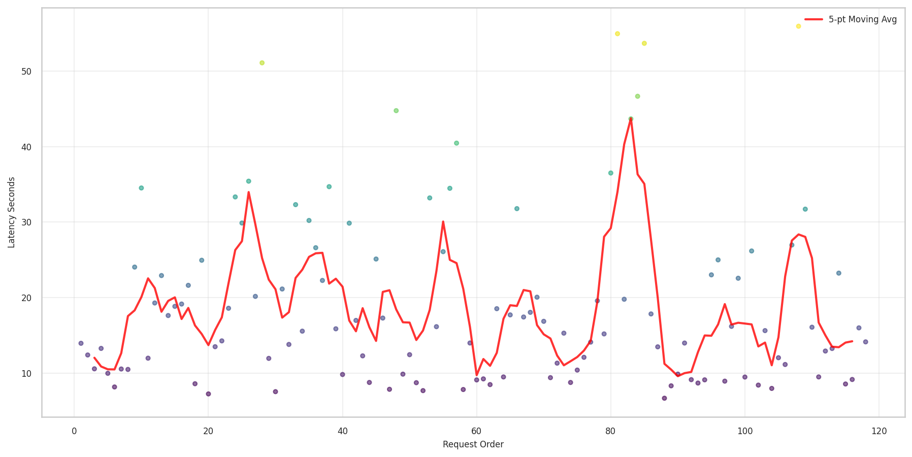](report_assets_20260309_162639/seq_agent_overall_parallel_db_lookup_4K.png)
<br>

**unreliable_tool_agent Execution Latency Sequence (Request Order)**<br>
**Total Requests:** 85<br>

[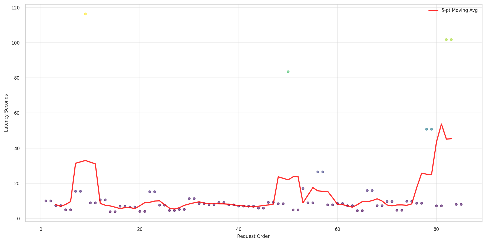](report_assets_20260309_162639/seq_agent_overall_unreliable_tool_agent_4K.png)
<br>


---


### Token Statistics


Token consumption analysis reveals significant inefficiencies. `bigquery_data_agent` shows symptoms of context bloat with an extremely high average of 47,583 total tokens per request, primarily driven by large inputs. `config_test_agent_wrong_candidates` exhibits high 'thought' token consumption (average 5,884), suggesting the model is spending too much time on internal reasoning.


**adk_documentation_agent**

| **Metric**                           | **gemini-2.5-flash**   | **gemini-2.5-pro**   | **gemini-3-pro-preview**   | **gemini-3.1-pro-preview**   |
|:-------------------------------------|:-----------------------|:---------------------|:---------------------------|:-----------------------------|
| **Amount of Requests**               | 102                    | 125                  | 76                         | 58                           |
| **Mean Input Tokens**                | 2041.57                | 297.53               | 254.53                     | 4904.00                      |
| **P95 Input Tokens**                 | 1133.00                | 572.00               | 303.00                     | 309.00                       |
| **Mean Thought Tokens**              | 946.88                 | 1060.88              | 2007.60                    | 2597.04                      |
| **P95 Thought Tokens**               | 2063.00                | 2022.00              | 5304.00                    | 4663.00                      |
| **Mean Output Tokens**               | 490.70                 | 621.34               | 741.10                     | 615.40                       |
| **P95 Output Tokens**                | 1277.00                | 1212.00              | 1059.00                    | 879.00                       |
| **Median Output Tokens**             | 481.00                 | 618.00               | 741.00                     | 619.00                       |
| **Min Output Tokens**                | 40.00                  | 19.00                | 390.00                     | 271.00                       |
| **Max Output Tokens**                | 1716.00                | 1964.00              | 1122.00                    | 1059.00                      |
| **Mean Total Tokens**                | 4300.66                | 2809.22              | 3003.24                    | 8056.94                      |
| **Latency vs Output Corr.**          | 0.679                  | 0.618                | -0.082                     | 0.212                        |
| **Latency vs Output+Thinking Corr.** | 0.916                  | 0.874                | 0.832                      | 0.763                        |
| **Correlation Strength**             | 🟧 **Strong**          | 🟧 **Strong**        | 🟨 **Moderate**            | 🟨 **Moderate**              |

<br>


**ai_observability_agent**

| **Metric**                           | **gemini-2.5-flash**   | **gemini-2.5-pro**   | **gemini-3-pro-preview**   | **gemini-3.1-pro-preview**   |
|:-------------------------------------|:-----------------------|:---------------------|:---------------------------|:-----------------------------|
| **Amount of Requests**               | 248                    | 209                  | 50                         | 32                           |
| **Mean Input Tokens**                | 282.80                 | 273.63               | N/A                        | N/A                          |
| **P95 Input Tokens**                 | 379.00                 | 391.00               | N/A                        | N/A                          |
| **Mean Thought Tokens**              | 804.04                 | 939.37               | N/A                        | N/A                          |
| **P95 Thought Tokens**               | 2049.00                | 2039.00              | N/A                        | N/A                          |
| **Mean Output Tokens**               | 365.86                 | 705.53               | N/A                        | N/A                          |
| **P95 Output Tokens**                | 1063.00                | 1014.00              | N/A                        | N/A                          |
| **Median Output Tokens**             | 78.00                  | 747.00               | N/A                        | N/A                          |
| **Min Output Tokens**                | 41.00                  | 23.00                | N/A                        | N/A                          |
| **Max Output Tokens**                | 1293.00                | 1357.00              | N/A                        | N/A                          |
| **Mean Total Tokens**                | 2049.72                | 2320.50              | N/A                        | N/A                          |
| **Latency vs Output Corr.**          | 0.639                  | 0.205                | N/A                        | N/A                          |
| **Latency vs Output+Thinking Corr.** | 0.706                  | 0.604                | N/A                        | N/A                          |
| **Correlation Strength**             | 🟨 **Moderate**        | 🟨 **Moderate**      | N/A                        | N/A                          |

<br>


**bigquery_data_agent**

| **Metric**                           | **gemini-2.5-flash**   | **gemini-2.5-pro**   | **gemini-3-pro-preview**   | **gemini-3.1-pro-preview**   |
|:-------------------------------------|:-----------------------|:---------------------|:---------------------------|:-----------------------------|
| **Amount of Requests**               | 794                    | 448                  | 299                        | 364                          |
| **Mean Input Tokens**                | 40625.08               | 64462.78             | 37536.27                   | 47872.44                     |
| **P95 Input Tokens**                 | 106840.00              | 111832.00            | 110412.00                  | 201311.00                    |
| **Mean Thought Tokens**              | 257.14                 | 414.41               | 498.39                     | 284.32                       |
| **P95 Thought Tokens**               | 766.00                 | 977.00               | 1330.00                    | 826.00                       |
| **Mean Output Tokens**               | 50.99                  | 67.90                | 70.16                      | 90.91                        |
| **P95 Output Tokens**                | 140.00                 | 173.00               | 193.00                     | 174.00                       |
| **Median Output Tokens**             | 51.00                  | 53.00                | 55.00                      | 55.00                        |
| **Min Output Tokens**                | 13.00                  | 13.00                | 17.00                      | 17.00                        |
| **Max Output Tokens**                | 478.00                 | 983.00               | 721.00                     | 7963.00                      |
| **Mean Total Tokens**                | 40932.43               | 64943.86             | 38104.81                   | 48247.67                     |
| **Latency vs Output Corr.**          | 0.349                  | 0.318                | 0.220                      | 0.442                        |
| **Latency vs Output+Thinking Corr.** | 0.810                  | 0.836                | 0.817                      | 0.632                        |
| **Correlation Strength**             | 🟨 **Moderate**        | 🟨 **Moderate**      | 🟨 **Moderate**            | 🟨 **Moderate**              |

<br>


**config_test_agent_high_temp**

| **Metric**                           | **gemini-2.5-flash**   | **gemini-2.5-pro**   | **gemini-3-pro-preview**   | **gemini-3.1-pro-preview**   |
|:-------------------------------------|:-----------------------|:---------------------|:---------------------------|:-----------------------------|
| **Amount of Requests**               | 14                     | 9                    | 10                         | 8                            |
| **Mean Input Tokens**                | 1497.50                | 1466.44              | 2307.40                    | 2068.12                      |
| **P95 Input Tokens**                 | 2606.00                | 2211.00              | 4006.00                    | 2596.00                      |
| **Mean Thought Tokens**              | 203.23                 | 451.78               | 769.40                     | 1231.00                      |
| **P95 Thought Tokens**               | 706.00                 | 1311.00              | 1777.00                    | 2921.00                      |
| **Mean Output Tokens**               | 344.93                 | 500.78               | 490.50                     | 698.12                       |
| **P95 Output Tokens**                | 1925.00                | 1969.00              | 1551.00                    | 2799.00                      |
| **Median Output Tokens**             | 157.00                 | 126.00               | 215.00                     | 248.00                       |
| **Min Output Tokens**                | 13.00                  | 13.00                | 18.00                      | 23.00                        |
| **Max Output Tokens**                | 1925.00                | 1969.00              | 1551.00                    | 2799.00                      |
| **Mean Total Tokens**                | 2031.14                | 2419.00              | 3567.30                    | 3997.25                      |
| **Latency vs Output Corr.**          | 0.925                  | 0.809                | 0.814                      | 0.917                        |
| **Latency vs Output+Thinking Corr.** | 0.958                  | 0.990                | 0.981                      | 0.948                        |
| **Correlation Strength**             | 🟧 **Strong**          | 🟧 **Strong**        | 🟧 **Strong**              | 🟧 **Strong**                |

<br>


**config_test_agent_normal**

| **Metric**                           | **gemini-2.5-flash**   | **gemini-2.5-pro**   | **gemini-3-pro-preview**   | **gemini-3.1-pro-preview**   |
|:-------------------------------------|:-----------------------|:---------------------|:---------------------------|:-----------------------------|
| **Amount of Requests**               | 55                     | 10                   | 9                          | 10                           |
| **Mean Input Tokens**                | 8943.04                | 2236.50              | 1866.67                    | 18925.50                     |
| **P95 Input Tokens**                 | 18592.00               | 3075.00              | 2694.00                    | 171420.00                    |
| **Mean Thought Tokens**              | 291.33                 | 329.10               | 601.22                     | 471.70                       |
| **P95 Thought Tokens**               | 382.00                 | 673.00               | 984.00                     | 1649.00                      |
| **Mean Output Tokens**               | 38.82                  | 125.40               | 255.89                     | 150.50                       |
| **P95 Output Tokens**                | 216.00                 | 473.00               | 614.00                     | 605.00                       |
| **Median Output Tokens**             | 13.00                  | 19.00                | 314.00                     | 68.00                        |
| **Min Output Tokens**                | 10.00                  | 7.00                 | 7.00                       | 18.00                        |
| **Max Output Tokens**                | 534.00                 | 473.00               | 614.00                     | 605.00                       |
| **Mean Total Tokens**                | 9273.18                | 2691.00              | 2723.78                    | 19547.70                     |
| **Latency vs Output Corr.**          | 0.744                  | 0.945                | 0.636                      | 0.926                        |
| **Latency vs Output+Thinking Corr.** | 0.830                  | 0.996                | 0.687                      | 0.985                        |
| **Correlation Strength**             | 🟨 **Moderate**        | 🟧 **Strong**        | 🟨 **Moderate**            | 🟧 **Strong**                |

<br>


**config_test_agent_over_provisioned**

| **Metric**                           | **gemini-2.5-flash**   | **gemini-2.5-pro**   | **gemini-3-pro-preview**   | **gemini-3.1-pro-preview**   |
|:-------------------------------------|:-----------------------|:---------------------|:---------------------------|:-----------------------------|
| **Amount of Requests**               | 18                     | 25                   | 13                         | 19                           |
| **Mean Input Tokens**                | 1954.72                | 1403.56              | 1965.69                    | 24531.42                     |
| **P95 Input Tokens**                 | 4022.00                | 2443.00              | 2497.00                    | 216074.00                    |
| **Mean Thought Tokens**              | 204.30                 | 274.48               | 980.44                     | 416.11                       |
| **P95 Thought Tokens**               | 615.00                 | 807.00               | 2299.00                    | 1028.00                      |
| **Mean Output Tokens**               | 133.67                 | 46.28                | 53.77                      | 530.21                       |
| **P95 Output Tokens**                | 1477.00                | 66.00                | 233.00                     | 2855.00                      |
| **Median Output Tokens**             | 29.00                  | 23.00                | 26.00                      | 49.00                        |
| **Min Output Tokens**                | 11.00                  | 8.00                 | 17.00                      | 14.00                        |
| **Max Output Tokens**                | 1477.00                | 603.00               | 233.00                     | 2855.00                      |
| **Mean Total Tokens**                | 2201.89                | 1724.32              | 2698.23                    | 25477.74                     |
| **Latency vs Output Corr.**          | 0.912                  | 0.720                | 0.220                      | 0.940                        |
| **Latency vs Output+Thinking Corr.** | 0.962                  | 0.993                | 0.912                      | 0.976                        |
| **Correlation Strength**             | 🟧 **Strong**          | 🟧 **Strong**        | 🟧 **Strong**              | 🟧 **Strong**                |

<br>


**config_test_agent_wrong_candidates**

| **Metric**                           | **gemini-2.5-flash**   | **gemini-2.5-pro**   | **gemini-3-pro-preview**   | **gemini-3.1-pro-preview**   |
|:-------------------------------------|:-----------------------|:---------------------|:---------------------------|:-----------------------------|
| **Amount of Requests**               | 20                     | 13                   | 7                          | 9                            |
| **Mean Input Tokens**                | 1763.80                | 2339.08              | 2121.00                    | 2066.44                      |
| **P95 Input Tokens**                 | 3045.00                | 4371.00              | 2706.00                    | 3156.00                      |
| **Mean Thought Tokens**              | 1164.69                | 3747.73              | 10174.00                   | 13552.78                     |
| **P95 Thought Tokens**               | 4225.00                | 9733.00              | 34325.00                   | 17900.00                     |
| **Mean Output Tokens**               | 478.75                 | 581.00               | 1155.71                    | 1707.78                      |
| **P95 Output Tokens**                | 1500.00                | 1595.00              | 2690.00                    | 2750.00                      |
| **Median Output Tokens**             | 150.00                 | 325.00               | 965.00                     | 1820.00                      |
| **Min Output Tokens**                | 40.00                  | 68.00                | 300.00                     | 435.00                       |
| **Max Output Tokens**                | 2310.00                | 1595.00              | 2690.00                    | 2750.00                      |
| **Mean Total Tokens**                | 3174.30                | 6091.23              | 13450.71                   | 17327.00                     |
| **Latency vs Output Corr.**          | 0.143                  | 0.061                | 0.209                      | 0.884                        |
| **Latency vs Output+Thinking Corr.** | 0.848                  | 0.928                | 0.674                      | 0.631                        |
| **Correlation Strength**             | 🟨 **Moderate**        | 🟧 **Strong**        | 🟨 **Moderate**            | 🟨 **Moderate**              |

<br>


**config_test_agent_wrong_max_tokens**

| **Metric**                           | **gemini-2.5-flash**   | **gemini-2.5-pro**   | **gemini-3-pro-preview**   | **gemini-3.1-pro-preview**   |
|:-------------------------------------|:-----------------------|:---------------------|:---------------------------|:-----------------------------|
| **Amount of Requests**               | 16                     | 20                   | 12                         | 24                           |
| **Mean Input Tokens**                | N/A                    | N/A                  | N/A                        | N/A                          |
| **P95 Input Tokens**                 | N/A                    | N/A                  | N/A                        | N/A                          |
| **Mean Thought Tokens**              | N/A                    | N/A                  | N/A                        | N/A                          |
| **P95 Thought Tokens**               | N/A                    | N/A                  | N/A                        | N/A                          |
| **Mean Output Tokens**               | N/A                    | N/A                  | N/A                        | N/A                          |
| **P95 Output Tokens**                | N/A                    | N/A                  | N/A                        | N/A                          |
| **Median Output Tokens**             | N/A                    | N/A                  | N/A                        | N/A                          |
| **Min Output Tokens**                | N/A                    | N/A                  | N/A                        | N/A                          |
| **Max Output Tokens**                | N/A                    | N/A                  | N/A                        | N/A                          |
| **Mean Total Tokens**                | N/A                    | N/A                  | N/A                        | N/A                          |
| **Latency vs Output Corr.**          | N/A                    | N/A                  | N/A                        | N/A                          |
| **Latency vs Output+Thinking Corr.** | N/A                    | N/A                  | N/A                        | N/A                          |
| **Correlation Strength**             | N/A                    | N/A                  | N/A                        | N/A                          |

<br>


**google_search_agent**

| **Metric**                           | **gemini-2.5-flash**   | **gemini-2.5-pro**   | **gemini-3-pro-preview**   | **gemini-3.1-pro-preview**   |
|:-------------------------------------|:-----------------------|:---------------------|:---------------------------|:-----------------------------|
| **Amount of Requests**               | 50                     | 77                   | 15                         | 20                           |
| **Mean Input Tokens**                | 3394.18                | 12277.81             | 14536.33                   | 11530.05                     |
| **P95 Input Tokens**                 | 11285.00               | 102595.00            | 98454.00                   | 93942.00                     |
| **Mean Thought Tokens**              | 564.60                 | 526.38               | 1153.67                    | 1177.25                      |
| **P95 Thought Tokens**               | 1509.00                | 1320.00              | 2340.00                    | 2049.00                      |
| **Mean Output Tokens**               | 707.54                 | 785.19               | 863.20                     | 683.70                       |
| **P95 Output Tokens**                | 1338.00                | 1332.00              | 1389.00                    | 1019.00                      |
| **Median Output Tokens**             | 653.00                 | 782.00               | 770.00                     | 761.00                       |
| **Min Output Tokens**                | 117.00                 | 165.00               | 370.00                     | 116.00                       |
| **Max Output Tokens**                | 1769.00                | 2078.00              | 1389.00                    | 1137.00                      |
| **Mean Total Tokens**                | 4737.34                | 13977.38             | 16553.20                   | 13391.00                     |
| **Latency vs Output Corr.**          | 0.771                  | 0.622                | 0.529                      | 0.420                        |
| **Latency vs Output+Thinking Corr.** | 0.951                  | 0.743                | 0.768                      | 0.957                        |
| **Correlation Strength**             | 🟧 **Strong**          | 🟨 **Moderate**      | 🟨 **Moderate**            | 🟧 **Strong**                |

<br>


**knowledge_qa_supervisor**

| **Metric**                           | **gemini-2.5-flash**   | **gemini-2.5-pro**   | **gemini-3-pro-preview**   | **gemini-3.1-pro-preview**   |
|:-------------------------------------|:-----------------------|:---------------------|:---------------------------|:-----------------------------|
| **Amount of Requests**               | 1105                   | 669                  | 274                        | 240                          |
| **Mean Input Tokens**                | 19236.38               | 1895.17              | 2300.24                    | 2688.37                      |
| **P95 Input Tokens**                 | 99597.00               | 2541.00              | 2643.00                    | 2701.00                      |
| **Mean Thought Tokens**              | 201.87                 | 165.97               | 295.61                     | 316.67                       |
| **P95 Thought Tokens**               | 413.00                 | 413.00               | 1260.00                    | 667.00                       |
| **Mean Output Tokens**               | 14.33                  | 20.73                | 18.47                      | 18.84                        |
| **P95 Output Tokens**                | 17.00                  | 19.00                | 23.00                      | 23.00                        |
| **Median Output Tokens**             | 14.00                  | 14.00                | 18.00                      | 18.00                        |
| **Min Output Tokens**                | 13.00                  | 13.00                | 17.00                      | 17.00                        |
| **Max Output Tokens**                | 171.00                 | 1089.00              | 23.00                      | 23.00                        |
| **Mean Total Tokens**                | 19452.56               | 2081.87              | 2614.32                    | 3023.89                      |
| **Latency vs Output Corr.**          | 0.143                  | 0.717                | -0.083                     | -0.201                       |
| **Latency vs Output+Thinking Corr.** | 0.872                  | 0.956                | 0.577                      | 0.813                        |
| **Correlation Strength**             | 🟧 **Strong**          | 🟧 **Strong**        | 🟨 **Moderate**            | 🟨 **Moderate**              |

<br>


**lookup_worker_1**

| **Metric**                           | **gemini-2.5-flash**   | **gemini-2.5-pro**   | **gemini-3-pro-preview**   | **gemini-3.1-pro-preview**   |
|:-------------------------------------|:-----------------------|:---------------------|:---------------------------|:-----------------------------|
| **Amount of Requests**               | 84                     | 56                   | 64                         | 56                           |
| **Mean Input Tokens**                | 646.21                 | 751.91               | 938.88                     | 5770.75                      |
| **P95 Input Tokens**                 | 1807.00                | 2388.00              | 1277.00                    | 19500.00                     |
| **Mean Thought Tokens**              | 98.79                  | 499.41               | 871.41                     | 287.46                       |
| **P95 Thought Tokens**               | 168.00                 | 1631.00              | 2313.00                    | 1123.00                      |
| **Mean Output Tokens**               | 45.67                  | 40.00                | 40.56                      | 62.30                        |
| **P95 Output Tokens**                | 87.00                  | 90.00                | 81.00                      | 79.00                        |
| **Median Output Tokens**             | 45.00                  | 37.00                | 37.00                      | 59.00                        |
| **Min Output Tokens**                | 7.00                   | 14.00                | 11.00                      | 16.00                        |
| **Max Output Tokens**                | 121.00                 | 115.00               | 150.00                     | 407.00                       |
| **Mean Total Tokens**                | 759.56                 | 1226.04              | 1577.89                    | 6120.52                      |
| **Latency vs Output Corr.**          | -0.045                 | -0.123               | -0.225                     | 0.062                        |
| **Latency vs Output+Thinking Corr.** | 0.403                  | 0.962                | 0.824                      | 0.557                        |
| **Correlation Strength**             | 🟦 **Weak**            | 🟧 **Strong**        | 🟨 **Moderate**            | 🟨 **Moderate**              |

<br>


**lookup_worker_2**

| **Metric**                           | **gemini-2.5-flash**   | **gemini-2.5-pro**   | **gemini-3-pro-preview**   | **gemini-3.1-pro-preview**   |
|:-------------------------------------|:-----------------------|:---------------------|:---------------------------|:-----------------------------|
| **Amount of Requests**               | 84                     | 52                   | 60                         | 55                           |
| **Mean Input Tokens**                | 607.42                 | 557.77               | 939.93                     | 5853.53                      |
| **P95 Input Tokens**                 | 1807.00                | 1501.00              | 1315.00                    | 19500.00                     |
| **Mean Thought Tokens**              | 86.18                  | 250.92               | 1035.33                    | 386.53                       |
| **P95 Thought Tokens**               | 139.00                 | 648.00               | 2707.00                    | 1266.00                      |
| **Mean Output Tokens**               | 45.57                  | 40.46                | 28.86                      | 55.85                        |
| **P95 Output Tokens**                | 86.00                  | 70.00                | 60.00                      | 78.00                        |
| **Median Output Tokens**             | 40.00                  | 43.00                | 22.00                      | 51.00                        |
| **Min Output Tokens**                | 14.00                  | 14.00                | 2.00                       | 16.00                        |
| **Max Output Tokens**                | 125.00                 | 79.00                | 108.00                     | 340.00                       |
| **Mean Total Tokens**                | 719.68                 | 839.50               | 1670.22                    | 6294.89                      |
| **Latency vs Output Corr.**          | 0.193                  | -0.063               | -0.160                     | -0.118                       |
| **Latency vs Output+Thinking Corr.** | 0.284                  | 0.873                | 0.951                      | 0.958                        |
| **Correlation Strength**             | 🟦 **Weak**            | 🟧 **Strong**        | 🟧 **Strong**              | 🟧 **Strong**                |

<br>


**lookup_worker_3**

| **Metric**                           | **gemini-2.5-flash**   | **gemini-2.5-pro**   | **gemini-3-pro-preview**   | **gemini-3.1-pro-preview**   |
|:-------------------------------------|:-----------------------|:---------------------|:---------------------------|:-----------------------------|
| **Amount of Requests**               | 87                     | 52                   | 61                         | 57                           |
| **Mean Input Tokens**                | 650.14                 | 582.37               | 949.18                     | 5769.52                      |
| **P95 Input Tokens**                 | 1807.00                | 1475.00              | 1277.00                    | 19500.00                     |
| **Mean Thought Tokens**              | 89.19                  | 289.90               | 929.15                     | 286.02                       |
| **P95 Thought Tokens**               | 158.00                 | 854.00               | 2904.00                    | 772.00                       |
| **Mean Output Tokens**               | 48.40                  | 37.26                | 40.17                      | 60.73                        |
| **P95 Output Tokens**                | 107.00                 | 75.00                | 67.00                      | 77.00                        |
| **Median Output Tokens**             | 46.00                  | 36.00                | 40.00                      | 58.00                        |
| **Min Output Tokens**                | 16.00                  | 11.00                | 11.00                      | 16.00                        |
| **Max Output Tokens**                | 118.00                 | 90.00                | 81.00                      | 433.00                       |
| **Mean Total Tokens**                | 752.87                 | 885.79               | 1624.27                    | 6116.27                      |
| **Latency vs Output Corr.**          | 0.088                  | 0.139                | -0.266                     | 0.122                        |
| **Latency vs Output+Thinking Corr.** | 0.117                  | 0.973                | 0.943                      | 0.843                        |
| **Correlation Strength**             | 🟦 **Weak**            | 🟧 **Strong**        | 🟧 **Strong**              | 🟨 **Moderate**              |

<br>


**unreliable_tool_agent**

| **Metric**                           | **gemini-2.5-flash**   | **gemini-2.5-pro**   | **gemini-3-pro-preview**   | **gemini-3.1-pro-preview**   |
|:-------------------------------------|:-----------------------|:---------------------|:---------------------------|:-----------------------------|
| **Amount of Requests**               | 24                     | 67                   | 26                         | 2                            |
| **Mean Input Tokens**                | 1519.08                | 1881.73              | 2580.27                    | 1168.50                      |
| **P95 Input Tokens**                 | 2122.00                | 2700.00              | 2107.00                    | 1196.00                      |
| **Mean Thought Tokens**              | 114.94                 | 232.93               | 492.84                     | 193.00                       |
| **P95 Thought Tokens**               | 310.00                 | 449.00               | 1628.00                    | 321.00                       |
| **Mean Output Tokens**               | 26.79                  | 30.52                | 31.54                      | 41.00                        |
| **P95 Output Tokens**                | 57.00                  | 65.00                | 106.00                     | 57.00                        |
| **Median Output Tokens**             | 24.00                  | 21.00                | 20.00                      | 25.00                        |
| **Min Output Tokens**                | 12.00                  | 12.00                | 16.00                      | 25.00                        |
| **Max Output Tokens**                | 64.00                  | 73.00                | 106.00                     | 57.00                        |
| **Mean Total Tokens**                | 1622.50                | 2113.90              | 2971.96                    | 1402.50                      |
| **Latency vs Output Corr.**          | -0.220                 | -0.107               | 0.156                      | -1.000                       |
| **Latency vs Output+Thinking Corr.** | 0.884                  | 0.958                | 0.634                      | 1.000                        |
| **Correlation Strength**             | 🟧 **Strong**          | 🟧 **Strong**        | 🟨 **Moderate**            | 🟧 **Strong**                |

<br>

<br>

---


## Tool Details


(AI_SUMMARY: Tool Details)


### Tool Summaries

A high-level cross-report summary for each tool.


**`complex_calculation`**
- **Requests:** 48 (2.2%)
- **Status:** 🟢 Overall (Lat: 🟢, Err: 🟢)
- **Latency (Mean / P95.5):** 2.008s / 2.866s
- **Errors:** 0.0%


**`flaky_tool_simulation`**
- **Requests:** 63 (2.9%)
- **Status:** 🔴 Overall (Lat: 🟢, Err: 🔴)
- **Latency (Mean / P95.5):** 1.177s / 1.897s
- **Errors:** 17.46%


**`execute_sql`**
- **Requests:** 742 (33.9%)
- **Status:** 🟢 Overall (Lat: 🟢, Err: 🟢)
- **Latency (Mean / P95.5):** 0.727s / 1.336s
- **Errors:** 0.0%


**`simulated_db_lookup`**
- **Requests:** 812 (37.1%)
- **Status:** 🟢 Overall (Lat: 🟢, Err: 🟢)
- **Latency (Mean / P95.5):** 0.598s / 0.963s
- **Errors:** 0.0%


**`list_dataset_ids`**
- **Requests:** 73 (3.3%)
- **Status:** 🟢 Overall (Lat: 🟢, Err: 🟢)
- **Latency (Mean / P95.5):** 0.31s / 0.243s
- **Errors:** 0.0%


**`get_dataset_info`**
- **Requests:** 3 (0.1%)
- **Status:** 🟢 Overall (Lat: 🟢, Err: 🟢)
- **Latency (Mean / P95.5):** 0.223s / 0.282s
- **Errors:** 0.0%


**`list_table_ids`**
- **Requests:** 166 (7.6%)
- **Status:** 🟢 Overall (Lat: 🟢, Err: 🟢)
- **Latency (Mean / P95.5):** 0.163s / 0.277s
- **Errors:** 0.0%


**`get_table_info`**
- **Requests:** 277 (12.6%)
- **Status:** 🟢 Overall (Lat: 🟢, Err: 🟢)
- **Latency (Mean / P95.5):** 0.151s / 0.197s
- **Errors:** 0.0%


**`ask_data_insights`**
- **Requests:** 4 (0.2%)
- **Status:** 🟢 Overall (Lat: 🟢, Err: 🟢)
- **Latency (Mean / P95.5):** 0.059s / 0.072s
- **Errors:** 0.0%


**`detect_anomalies`**
- **Requests:** 2 (0.1%)
- **Status:** 🟢 Overall (Lat: 🟢, Err: 🟢)
- **Latency (Mean / P95.5):** 0.0s / 0.001s
- **Errors:** 0.0%


### Distribution

**Total Requests:** 2190

| **Name**                  |   **Requests** |   **%** |
|:--------------------------|---------------:|--------:|
| **complex_calculation**   |             48 |    2.19 |
| **flaky_tool_simulation** |             63 |    2.88 |
| **execute_sql**           |            742 |   33.88 |
| **simulated_db_lookup**   |            812 |   37.08 |
| **list_dataset_ids**      |             73 |    3.33 |
| **get_dataset_info**      |              3 |    0.14 |
| **list_table_ids**        |            166 |    7.58 |
| **get_table_info**        |            277 |   12.65 |
| **ask_data_insights**     |              4 |    0.18 |
| **detect_anomalies**      |              2 |    0.09 |

<br>


---


## Model Details


Performance varies significantly when agents use different models. For `bigquery_data_agent`, using `gemini-3.1-pro-preview` results in a catastrophic P95.5 latency of 205.96s, compared to a much lower (but still failing) 54.513s on `gemini-2.5-flash`. This suggests that certain model-agent pairings are highly inefficient. `gemini-2.5-flash` is generally the fastest model but still fails its P95.5 latency target across the board.


### Model Summaries

A high-level cross-report summary for each model.


**`gemini-3-pro-preview`**
- **Requests:** 976 (15.1%)
- **Status:** 🔴 Overall (Lat: 🔴, Err: 🔴)
- **Latency (Mean / P95.5):** 11.666s / 36.473s
- **Errors:** 9.32%
- **Total Tokens (Avg/P95.5):** 14410 / 96871
- **Input:** 13636 / 96469 | **Output:** 118 / 760 | **Thought:** 710 / 2256


**`gemini-3.1-pro-preview`**
- **Requests:** 954 (14.8%)
- **Status:** 🔴 Overall (Lat: 🔴, Err: 🔴)
- **Latency (Mean / P95.5):** 11.563s / 46.902s
- **Errors:** 6.71%
- **Total Tokens (Avg/P95.5):** 23312 / 126650
- **Input:** 22565 / 126498 | **Output:** 142 / 713 | **Thought:** 605 / 2585


**`gemini-2.5-pro`**
- **Requests:** 1832 (28.3%)
- **Status:** 🔴 Overall (Lat: 🔴, Err: 🔴)
- **Latency (Mean / P95.5):** 7.166s / 23.488s
- **Errors:** 11.08%
- **Total Tokens (Avg/P95.5):** 19914 / 108864
- **Input:** 19315 / 108417 | **Output:** 138 / 844 | **Thought:** 381 / 1225


**`gemini-2.5-flash`**
- **Requests:** 2701 (41.8%)
- **Status:** 🔴 Overall (Lat: 🔴, Err: 🔴)
- **Latency (Mean / P95.5):** 3.64s / 10.735s
- **Errors:** 8.29%
- **Total Tokens (Avg/P95.5):** 22404 / 104754
- **Input:** 22024 / 104510 | **Output:** 76 / 440 | **Thought:** 270 / 856


### Distribution

**Total Requests:** 6463

| **Name**                   |   **Requests** |   **%** |
|:---------------------------|---------------:|--------:|
| **gemini-3-pro-preview**   |            976 |   15.1  |
| **gemini-3.1-pro-preview** |            954 |   14.76 |
| **gemini-2.5-pro**         |           1832 |   28.35 |
| **gemini-2.5-flash**       |           2701 |   41.79 |

<br>

**Model Usage**<br>

[](report_assets_20260309_162639/model_usage_pie_4K.png)
<br>

**Latency Distribution by Category**<br>

[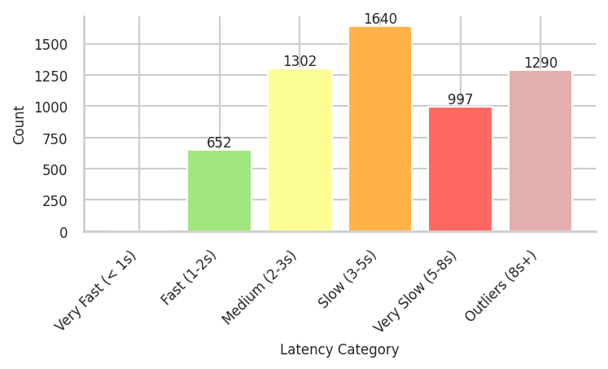](report_assets_20260309_162639/latency_category_dist_4K.png)
<br>


### Model Performance

| **Metric**                     | **gemini-3-pro-preview**   | **gemini-3.1-pro-preview**   | **gemini-2.5-pro**   | **gemini-2.5-flash**   |
|:-------------------------------|:---------------------------|:-----------------------------|:---------------------|:-----------------------|
| Total Requests                 | 976                        | 954                          | 1832                 | 2701                   |
| Mean Latency (s)               | 11.666                     | 11.563                       | 7.166                | 3.64                   |
| Std Deviation (s)              | 14.626                     | 14.385                       | 7.63                 | 3.205                  |
| Median Latency (s)             | 6.822                      | 6.643                        | 4.133                | 2.698                  |
| P95 Latency (s)                | 34.07                      | 45.953                       | 22.696               | 10.244                 |
| P99 Latency (s)                | 66.08                      | 73.787                       | 36.816               | 17.671                 |
| Max Latency (s)                | 266.501                    | 121.779                      | 81.746               | 33.816                 |
| Outliers 2 STD Count (Percent) | 28 (2.9%)                  | 54 (5.7%)                    | 83 (4.5%)            | 130 (4.8%)             |
| Outliers 3 STD Count (Percent) | 13 (1.3%)                  | 30 (3.1%)                    | 34 (1.9%)            | 76 (2.8%)              |

<br>


### Model Latency Sequences

The following charts display the pure LLM execution latency (excluding agent overhead) for each generated response throughout the test run.


**gemini-2.5-flash LLM Latency Sequence (Request Order)**<br>
**Total Requests:** 2477<br>

[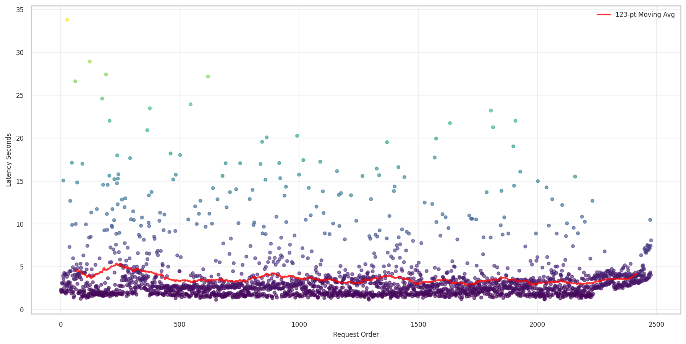](report_assets_20260309_162639/seq_model_gemini-2_5-flash_4K.png)
<br>

**gemini-2.5-pro LLM Latency Sequence (Request Order)**<br>
**Total Requests:** 1629<br>

[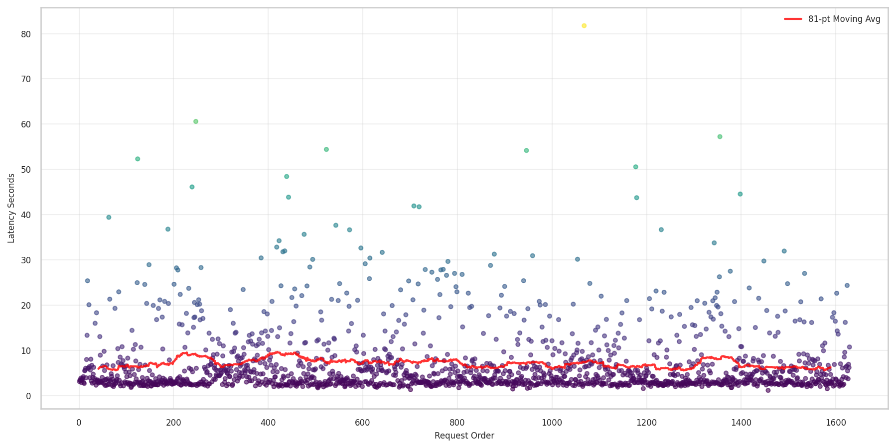](report_assets_20260309_162639/seq_model_gemini-2_5-pro_4K.png)
<br>

**gemini-3-pro-preview LLM Latency Sequence (Request Order)**<br>
**Total Requests:** 885<br>

[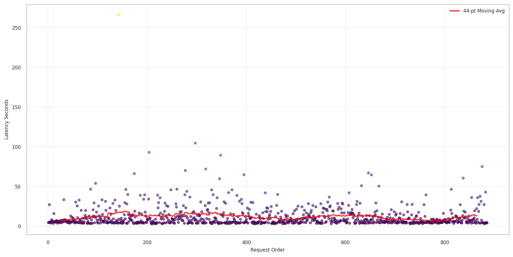](report_assets_20260309_162639/seq_model_gemini-3-pro-preview_4K.png)
<br>

**gemini-3.1-pro-preview LLM Latency Sequence (Request Order)**<br>
**Total Requests:** 890<br>

[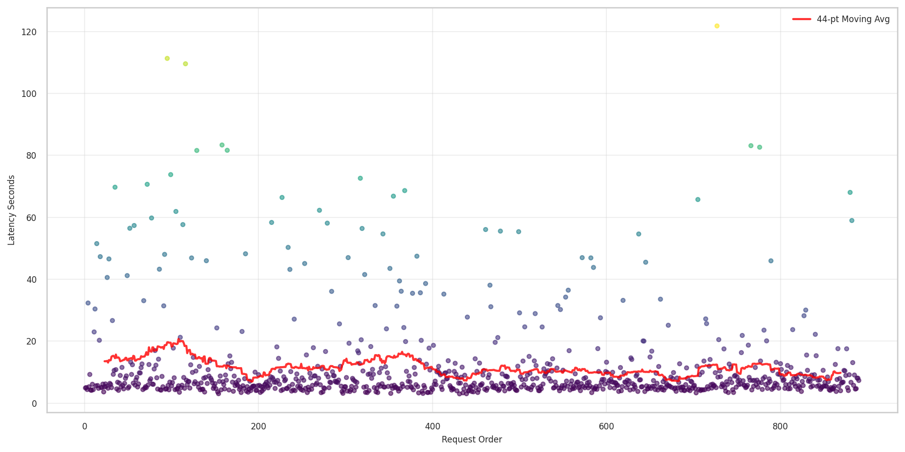](report_assets_20260309_162639/seq_model_gemini-3_1-pro-preview_4K.png)
<br>


### Token Statistics


There is a strong positive correlation between latency and the combined total of output and thought tokens for most models and agents, confirming that generation length is a primary latency driver (H1). For example, `unreliable_tool_agent` shows a 'Strong' correlation of 0.958 with `gemini-2.5-pro`. Similarly, `google_search_agent` shows a correlation of 0.951 with `gemini-2.5-flash`. This indicates that reducing the number of generated tokens (both for reasoning and final output) is key to improving performance.

| **Metric**                           | **gemini-2.5-flash**   | **gemini-2.5-pro**   | **gemini-3-pro-preview**   | **gemini-3.1-pro-preview**   |
|:-------------------------------------|:-----------------------|:---------------------|:---------------------------|:-----------------------------|
| **Amount of Requests**               | 2701                   | 1832                 | 976                        | 954                          |
| **Mean Input Tokens**                | 22024.32               | 19315.62             | 13636.67                   | 22565.85                     |
| **P95 Input Tokens**                 | 104510.00              | 108417.00            | 96469.00                   | 126498.00                    |
| **Mean Thought Tokens**              | 270.47                 | 381.71               | 710.34                     | 605.21                       |
| **P95 Thought Tokens**               | 856.00                 | 1225.00              | 2256.00                    | 2585.00                      |
| **Mean Output Tokens**               | 76.01                  | 138.31               | 118.68                     | 142.06                       |
| **P95 Output Tokens**                | 440.00                 | 844.00               | 760.00                     | 713.00                       |
| **Median Output Tokens**             | 14.00                  | 20.00                | 28.00                      | 44.00                        |
| **Min Output Tokens**                | 7.00                   | 7.00                 | 2.00                       | 14.00                        |
| **Max Output Tokens**                | 2310.00                | 2078.00              | 2690.00                    | 7963.00                      |
| **Mean Total Tokens**                | 22404.99               | 19914.35             | 14410.03                   | 23312.13                     |
| **Latency vs Output Corr.**          | 0.681                  | 0.784                | 0.574                      | 0.597                        |
| **Latency vs Output+Thinking Corr.** | 0.866                  | 0.812                | 0.653                      | 0.728                        |
| **Correlation Strength**             | 🟧 **Strong**          | 🟨 **Moderate**      | 🟨 **Moderate**            | 🟨 **Moderate**              |

<br>


### Token Usage Breakdown per Model

The charts below display the average token consumption per request, broken down by **Input**, **Thought**, and **Output** tokens for each Agent using a specific Model.

> [!NOTE]
> This data is aggregated by calculating the mean token counts across all raw LLM events for the given Agent and Model combination.


**Token Breakdown for gemini-2.5-flash**<br>

[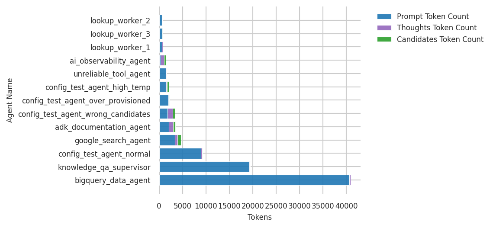](report_assets_20260309_162639/token_usage_gemini-2_5-flash_4K.png)
<br>

**Token Breakdown for gemini-2.5-pro**<br>

[](report_assets_20260309_162639/token_usage_gemini-2_5-pro_4K.png)
<br>

**Token Breakdown for gemini-3-pro-preview**<br>

[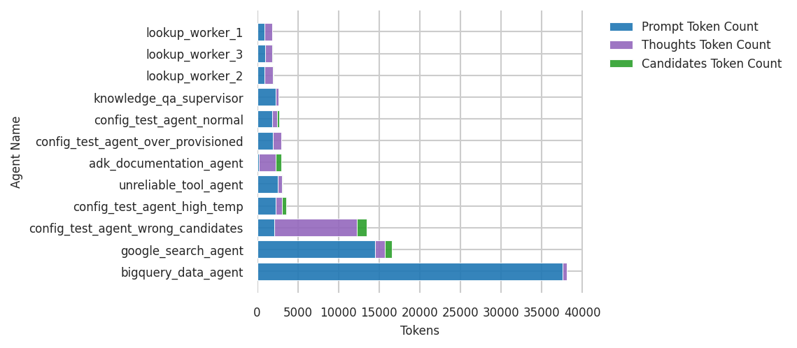](report_assets_20260309_162639/token_usage_gemini-3-pro-preview_4K.png)
<br>

**Token Breakdown for gemini-3.1-pro-preview**<br>

[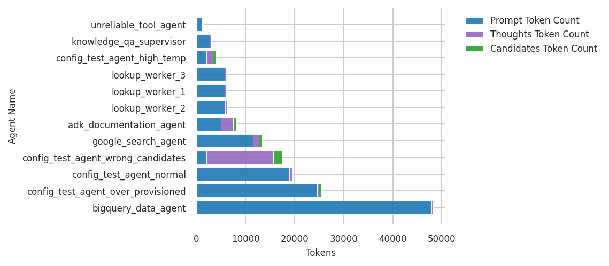](report_assets_20260309_162639/token_usage_gemini-3_1-pro-preview_4K.png)
<br>


### Requests Distribution

**Model Latency Distribution**<br>

[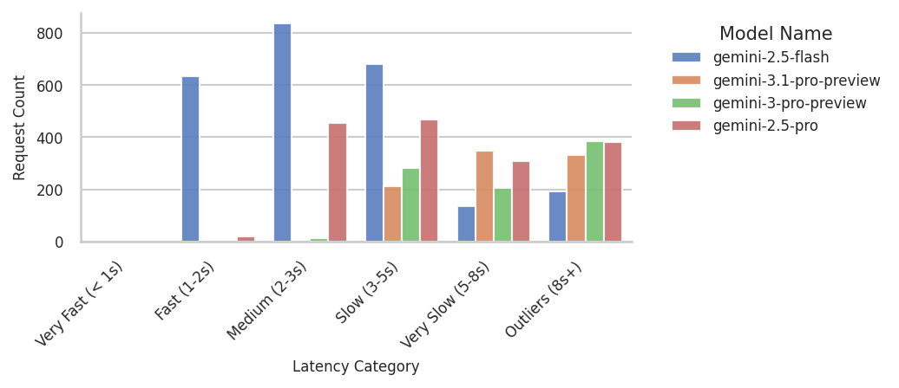](report_assets_20260309_162639/model_latency_bucketed_4K.png)
<br>


**gemini-2.5-flash**

| **Category**         |   **Count** | **Percentage**   |
|:---------------------|------------:|:-----------------|
| **Very Fast (< 1s)** |           0 | 0.0%             |
| **Fast (1-2s)**      |         634 | 25.6%            |
| **Medium (2-3s)**    |         836 | 33.8%            |
| **Slow (3-5s)**      |         680 | 27.5%            |
| **Very Slow (5-8s)** |         135 | 5.5%             |
| **Outliers (8s+)**   |         192 | 7.8%             |

<br>


**gemini-2.5-pro**

| **Category**         |   **Count** | **Percentage**   |
|:---------------------|------------:|:-----------------|
| **Very Fast (< 1s)** |           0 | 0.0%             |
| **Fast (1-2s)**      |          18 | 1.1%             |
| **Medium (2-3s)**    |         454 | 27.9%            |
| **Slow (3-5s)**      |         467 | 28.7%            |
| **Very Slow (5-8s)** |         308 | 18.9%            |
| **Outliers (8s+)**   |         382 | 23.4%            |

<br>


**gemini-3-pro-preview**

| **Category**         |   **Count** | **Percentage**   |
|:---------------------|------------:|:-----------------|
| **Very Fast (< 1s)** |           0 | 0.0%             |
| **Fast (1-2s)**      |           0 | 0.0%             |
| **Medium (2-3s)**    |          12 | 1.4%             |
| **Slow (3-5s)**      |         282 | 31.9%            |
| **Very Slow (5-8s)** |         206 | 23.3%            |
| **Outliers (8s+)**   |         385 | 43.5%            |

<br>


**gemini-3.1-pro-preview**

| **Category**         |   **Count** | **Percentage**   |
|:---------------------|------------:|:-----------------|
| **Very Fast (< 1s)** |           0 | 0.0%             |
| **Fast (1-2s)**      |           0 | 0.0%             |
| **Medium (2-3s)**    |           0 | 0.0%             |
| **Slow (3-5s)**      |         211 | 23.7%            |
| **Very Slow (5-8s)** |         348 | 39.1%            |
| **Outliers (8s+)**   |         331 | 37.2%            |

<br>


---


## System Bottlenecks & Impact


The #1 bottleneck is a systemic task scheduling failure in the agent orchestration layer. The two most-used agents, `bigquery_data_agent` and `ai_observability_agent`, are frequently stuck in a `PENDING` state for over 5 minutes and timing out, indicating the system cannot provide compute resources to execute them. This accounts for the majority of errors and significantly contributes to the high end-to-end latency.


### Slowest Invocations

| Rank                 | Timestamp           | Root Agent                  |   Duration (s) | Status   | User Message                                                                                                                                                                                                                                                              | Session ID                           | Trace ID                                                                                                                                                       |
|:---------------------|:--------------------|:----------------------------|---------------:|:---------|:--------------------------------------------------------------------------------------------------------------------------------------------------------------------------------------------------------------------------------------------------------------------------|:-------------------------------------|:---------------------------------------------------------------------------------------------------------------------------------------------------------------|
| **[1](#rca-root-1)** | 2026-03-07 21:11:51 | **knowledge_qa_supervisor** |        219.075 | 🟢       | Find the most expensive BigQuery jobs run by service account 'ai-agent-svc' in the last quarter.                                                                                                                                                                          | f8d0e465-d99e-4e6d-8f3b-023acc184feb | [`ddc2f74662a5df15b3eb46c7c2379070`](https://console.cloud.google.com/traces/explorer;traceId=ddc2f74662a5df15b3eb46c7c2379070?project=agent-operations-ek-05) |
| **[2](#rca-root-2)** | 2026-03-07 21:10:27 | **knowledge_qa_supervisor** |        239.895 | 🟢       | Generate a unique product description for an 'AI-powered gardening robot' using a NORMAL config. Then, search Google for similar existing products to ensure differentiation, and log the generated description and comparison notes into `product_development_bigquery`. | e009ed61-070f-4437-8928-e143cb72e24d | [`6f50bd38c47ec8d925ab957bbe86413c`](https://console.cloud.google.com/traces/explorer;traceId=6f50bd38c47ec8d925ab957bbe86413c?project=agent-operations-ek-05) |
| **[3](#rca-root-3)** | 2026-03-07 21:07:31 | **knowledge_qa_supervisor** |        213.883 | 🟢       | List the top 10 `product_ids` associated with agent `200` interactions in `product_inquiries`.                                                                                                                                                                            | 263a9415-91f5-4a9f-b1ad-98797914a40e | [`901fd8c0c9653ff18865625e1d4a0916`](https://console.cloud.google.com/traces/explorer;traceId=901fd8c0c9653ff18865625e1d4a0916?project=agent-operations-ek-05) |
| **[4](#rca-root-4)** | 2026-03-07 20:51:56 | **knowledge_qa_supervisor** |        270.083 | 🟢       | How does error handling differ between synchronous and asynchronous operations in the ADK framework?                                                                                                                                                                      | 3aa755b3-9b5f-4a25-9a5c-f30a4f91c722 | [`0eef485489704876ef8d70b9da0d870c`](https://console.cloud.google.com/traces/explorer;traceId=0eef485489704876ef8d70b9da0d870c?project=agent-operations-ek-05) |
| **[5](#rca-root-5)** | 2026-03-07 20:50:10 | **knowledge_qa_supervisor** |        230.593 | 🟢       | Calculate the average number of intermediate_steps for Complex/Chained agent requests in agent_step_logs?                                                                                                                                                                 | eed8753e-2c56-4ea1-becf-1f24e204efed | [`5795fac3ac4ce5254d26a34f16ff882d`](https://console.cloud.google.com/traces/explorer;traceId=5795fac3ac4ce5254d26a34f16ff882d?project=agent-operations-ek-05) |

<br>

**Detailed RCA Analysis:**

- <a id="rca-root-1"></a>**Rank 1**: The root cause is an inherently slow, computationally expensive query against a large dataset ('last quarter' of BigQuery jobs), resulting in extreme execution latency (219s) which degrades user experience and risks future timeouts.

- <a id="rca-root-2"></a>**Rank 2**: The trace succeeded but exhibited excessive latency (~240s) due to the cumulative execution time of a complex, multi-step agent plan involving sequential tool calls for generation, web search, and database logging. This indicates a performance bottleneck in the orchestration of chained tool executions, not a functional error.

- <a id="rca-root-3"></a>**Rank 3**: The `bigquery_data_agent` took over 213 seconds to process the request, indicating a highly inefficient or complex generated query that led to a long-running job in the underlying data warehouse. This severe latency resulted in a functional timeout, preventing a timely response to the user and consuming excessive system resources.

- <a id="rca-root-4"></a>**Rank 4**: The agent completed with an 'OK' status but exhibited extreme latency (270 seconds), indicating a severe performance bottleneck or a dependent service/tool hang. This de-facto timeout suggests the agent was stuck waiting for a downstream process that was either non-responsive or extremely slow, violating latency SLOs and resulting in a user-facing failure.

- <a id="rca-root-5"></a>**Rank 5**: The `bigquery_data_agent` took an excessive amount of time (~230s) to execute a query, likely due to an inefficient SQL plan or large table scan. This extreme latency resulted in a functional timeout for the user-facing request, despite the underlying span eventually completing with an 'OK' status.

<br>


### Slowest Agent queries

| **Rank**              | **Timestamp**       | **Name**                     |   **Latency (s)** | **Status**   | **User Message**                                                                                                                                                                                                                                              | **Root Agent**              |   **E2E (s)** | **Root Status**   | **Impact (%)**   | **Session ID**                       | **Trace ID**                                                                                                                                                   | **Span ID**                                                                                                                                                            |
|:----------------------|:--------------------|:-----------------------------|------------------:|:-------------|:--------------------------------------------------------------------------------------------------------------------------------------------------------------------------------------------------------------------------------------------------------------|:----------------------------|--------------:|:------------------|:-----------------|:-------------------------------------|:---------------------------------------------------------------------------------------------------------------------------------------------------------------|:-----------------------------------------------------------------------------------------------------------------------------------------------------------------------|
| **[1](#rca-agent-1)** | 2026-03-07 21:10:47 | **config_test_agent_normal** |           220.386 | 🟢           | Generate a unique product description for an 'AI-powered gardening robot' using a NORMAL config. Then, search Google for similar existing products to ensure differentiation, and log the generated description and comparison notes into `product_develop... | **knowledge_qa_supervisor** |       239.895 | 🟢                | 91.9%            | e009ed61-070f-4437-8928-e143cb72e24d | [`6f50bd38c47ec8d925ab957bbe86413c`](https://console.cloud.google.com/traces/explorer;traceId=6f50bd38c47ec8d925ab957bbe86413c?project=agent-operations-ek-05) | [`3f846a378d227204`](https://console.cloud.google.com/traces/explorer;traceId=6f50bd38c47ec8d925ab957bbe86413c;spanId=3f846a378d227204?project=agent-operations-ek-05) |
| **[2](#rca-agent-2)** | 2026-03-07 21:10:41 | **config_test_agent_normal** |           225.848 | 🟢           | Generate a unique product description for an 'AI-powered gardening robot' using a NORMAL config. Then, search Google for similar existing products to ensure differentiation, and log the generated description and comparison notes into `product_develop... | **knowledge_qa_supervisor** |       239.895 | 🟢                | 94.1%            | e009ed61-070f-4437-8928-e143cb72e24d | [`6f50bd38c47ec8d925ab957bbe86413c`](https://console.cloud.google.com/traces/explorer;traceId=6f50bd38c47ec8d925ab957bbe86413c?project=agent-operations-ek-05) | [`dff8e881d45342fd`](https://console.cloud.google.com/traces/explorer;traceId=6f50bd38c47ec8d925ab957bbe86413c;spanId=dff8e881d45342fd?project=agent-operations-ek-05) |
| **[3](#rca-agent-3)** | 2026-03-07 21:10:35 | **config_test_agent_normal** |           231.668 | 🟢           | Generate a unique product description for an 'AI-powered gardening robot' using a NORMAL config. Then, search Google for similar existing products to ensure differentiation, and log the generated description and comparison notes into `product_develop... | **knowledge_qa_supervisor** |       239.895 | 🟢                | 96.6%            | e009ed61-070f-4437-8928-e143cb72e24d | [`6f50bd38c47ec8d925ab957bbe86413c`](https://console.cloud.google.com/traces/explorer;traceId=6f50bd38c47ec8d925ab957bbe86413c?project=agent-operations-ek-05) | [`d8f83895e654721e`](https://console.cloud.google.com/traces/explorer;traceId=6f50bd38c47ec8d925ab957bbe86413c;spanId=d8f83895e654721e?project=agent-operations-ek-05) |
| **[4](#rca-agent-4)** | 2026-03-07 21:10:29 | **config_test_agent_normal** |           238.204 | 🟢           | Generate a unique product description for an 'AI-powered gardening robot' using a NORMAL config. Then, search Google for similar existing products to ensure differentiation, and log the generated description and comparison notes into `product_develop... | **knowledge_qa_supervisor** |       239.895 | 🟢                | 99.3%            | e009ed61-070f-4437-8928-e143cb72e24d | [`6f50bd38c47ec8d925ab957bbe86413c`](https://console.cloud.google.com/traces/explorer;traceId=6f50bd38c47ec8d925ab957bbe86413c?project=agent-operations-ek-05) | [`ab87c20e4ca4799e`](https://console.cloud.google.com/traces/explorer;traceId=6f50bd38c47ec8d925ab957bbe86413c;spanId=ab87c20e4ca4799e?project=agent-operations-ek-05) |
| **[5](#rca-agent-5)** | 2026-03-07 20:52:00 | **adk_documentation_agent**  |           266.502 | 🟢           | How does error handling differ between synchronous and asynchronous operations in the ADK framework?                                                                                                                                                          | **knowledge_qa_supervisor** |       270.083 | 🟢                | 98.7%            | 3aa755b3-9b5f-4a25-9a5c-f30a4f91c722 | [`0eef485489704876ef8d70b9da0d870c`](https://console.cloud.google.com/traces/explorer;traceId=0eef485489704876ef8d70b9da0d870c?project=agent-operations-ek-05) | [`23fc72b2654294b4`](https://console.cloud.google.com/traces/explorer;traceId=0eef485489704876ef8d70b9da0d870c;spanId=23fc72b2654294b4?project=agent-operations-ek-05) |

<br>

**Detailed RCA Analysis:**

- <a id="rca-agent-1"></a>**Rank 1**: The agent span completed with an 'OK' status but took 220.4 seconds, indicating a severe performance failure rather than a functional error, which constitutes a de-facto timeout. This extreme latency likely originates from an inefficient or stalled t...

- <a id="rca-agent-2"></a>**Rank 2**: This span is not a functional failure (status: OK) but a severe performance degradation, consuming 226 seconds which accounts for 94% of the entire trace's 240-second duration. The root cause is an extreme latency bottleneck within the `config_test_a...

- <a id="rca-agent-3"></a>**Rank 3**: The `config_test_agent_normal` agent's monolithic execution of a multi-step task (generation, search, logging) resulted in an excessive end-to-end latency of 231.6 seconds, creating a severe performance bottleneck despite the successful 'OK' status. ...

- <a id="rca-agent-4"></a>**Rank 4**: The `config_test_agent_normal` span consumed 99.2% (~238s) of the total trace duration, indicating a severe performance bottleneck within its execution of a complex instruction (generation, search, database write). This excessive latency, despite the...

- <a id="rca-agent-5"></a>**Rank 5**: The agent trace succeeded but experienced extreme end-to-end latency (266s), indicating a severe performance degradation or near-timeout condition in the call to the external Vertex AI Search datastore dependency. This high latency renders the agent ...

<br>


### Slowest LLM queries

| **Rank**            | **Timestamp**       |   **LLM (s)** |   **TTFT (s)** | **Model Name**             | **LLM Status**   |   **Input** |   **Output** |   **Thought** |   **Total Tokens** | **Response Text**                                                                                                                                                                                                                                             | **Agent Name**              |   **Agent (s)** | **Agent Status impact**   | **Root Agent Name**         |   **E2E (s)** | **Root Status**   | **Impact %**   | **User Message**                                                                                         | **Session ID**                       | **Trace ID**                                                                                                                                                   | **Span ID**                                                                                                                                                            |
|:--------------------|:--------------------|--------------:|---------------:|:---------------------------|:-----------------|------------:|-------------:|--------------:|-------------------:|:--------------------------------------------------------------------------------------------------------------------------------------------------------------------------------------------------------------------------------------------------------------|:----------------------------|----------------:|:--------------------------|:----------------------------|--------------:|:------------------|:---------------|:---------------------------------------------------------------------------------------------------------|:-------------------------------------|:---------------------------------------------------------------------------------------------------------------------------------------------------------------|:-----------------------------------------------------------------------------------------------------------------------------------------------------------------------|
| **[1](#rca-llm-1)** | 2026-03-07 21:13:10 |       121.779 |        121.779 | **gemini-3.1-pro-preview** | 🟢               |         221 |          431 |          4394 |               5046 | text: 'Based on the Agent Development Kit (ADK) documentation, ADK agents are designed to be deployment-agnostic, meaning the core agent logic is decoupled from the underlying serving infrastructure.   Here is how resource management and requirements... | **adk_documentation_agent** |         121.781 | 🟢                        | **knowledge_qa_supervisor** |       127.365 | 🟢                | 95.6%          | How to specify resource requirements for an ADK agent deployed on Vertex AI?                             | e95f1040-0e2c-4df0-8a9e-2238239826e4 | [`027586e59151d305ae6584fbe04a277f`](https://console.cloud.google.com/traces/explorer;traceId=027586e59151d305ae6584fbe04a277f?project=agent-operations-ek-05) | [`b2e01a22c7489e59`](https://console.cloud.google.com/traces/explorer;traceId=027586e59151d305ae6584fbe04a277f;spanId=b2e01a22c7489e59?project=agent-operations-ek-05) |
| **[2](#rca-llm-2)** | 2026-03-07 20:57:53 |       104.674 |        104.674 | **gemini-3-pro-preview**   | 🟢               |         225 |          853 |          5304 |               6382 | text: 'To create a custom callback for tracking token usage in an ADK agent (specifically using the Python SDK), you generally need to define a function that intercepts the model's response and extracts the usage metadata. This allows you to log the ... | **adk_documentation_agent** |         104.675 | 🟢                        | **knowledge_qa_supervisor** |       115.207 | 🟢                | 90.9%          | How to create a custom callback to track token usage in an ADK agent for cost optimization?              | c29b2457-d444-4b3b-867d-4ad3ea5e677d | [`25c6049560b0145d08c11571a405646f`](https://console.cloud.google.com/traces/explorer;traceId=25c6049560b0145d08c11571a405646f?project=agent-operations-ek-05) | [`07cf23ff5249c862`](https://console.cloud.google.com/traces/explorer;traceId=25c6049560b0145d08c11571a405646f;spanId=07cf23ff5249c862?project=agent-operations-ek-05) |
| **[3](#rca-llm-3)** | 2026-03-07 20:54:03 |       109.563 |        109.563 | **gemini-3.1-pro-preview** | 🟢               |         219 |          607 |          3223 |               4049 | text: 'Based on the Agent Development Kit (ADK) documentation, there are several ways to log specific events and capture operational data, ranging from dedicated lifecycle callbacks to custom agent implementations and native observability tools.   He... | **adk_documentation_agent** |         109.564 | 🟢                        | **knowledge_qa_supervisor** |       114.39  | 🟢                | 95.8%          | How to define custom callbacks in ADK to log specific events?                                            | 037fff10-2218-4000-9980-dff9d696f9d3 | [`49445fae81784263ad0a1bde0afed0cc`](https://console.cloud.google.com/traces/explorer;traceId=49445fae81784263ad0a1bde0afed0cc?project=agent-operations-ek-05) | [`70efa5006c454c8e`](https://console.cloud.google.com/traces/explorer;traceId=49445fae81784263ad0a1bde0afed0cc;spanId=70efa5006c454c8e?project=agent-operations-ek-05) |
| **[4](#rca-llm-4)** | 2026-03-07 20:53:09 |       111.3   |        111.3   | **gemini-3.1-pro-preview** | 🟢               |         224 |          652 |          3520 |               4396 | text: 'While the Python Agent Development Kit (ADK) does not impose a strict, hardcoded technical limit on the number of tools an agent can have, **performance degradation typically occurs when a single agent is overloaded with too many tools.**   Th... | **adk_documentation_agent** |         111.302 | 🟢                        | **knowledge_qa_supervisor** |       115.829 | 🟢                | 96.1%          | What is the maximum number of tools an ADK agent can effectively manage without performance degradation? | 7cf9dd00-c174-4306-b2d3-b8ec41e229db | [`3d3fe56bbb2e45d8dfb9cd9107becaeb`](https://console.cloud.google.com/traces/explorer;traceId=3d3fe56bbb2e45d8dfb9cd9107becaeb?project=agent-operations-ek-05) | [`ba23c064b78c2fee`](https://console.cloud.google.com/traces/explorer;traceId=3d3fe56bbb2e45d8dfb9cd9107becaeb;spanId=ba23c064b78c2fee?project=agent-operations-ek-05) |
| **[5](#rca-llm-5)** | 2026-03-07 20:52:00 |       266.501 |        266.501 | **gemini-3-pro-preview**   | 🟢               |         222 |          584 |          7729 |               8535 | text: 'Based on the ADK documentation and best practices, error handling in the ADK framework differs between synchronous and asynchronous operations primarily in how exceptions are propagated and managed within the agent's execution loop.  ### **Cor... | **adk_documentation_agent** |         266.502 | 🟢                        | **knowledge_qa_supervisor** |       270.083 | 🟢                | 98.7%          | How does error handling differ between synchronous and asynchronous operations in the ADK framework?     | 3aa755b3-9b5f-4a25-9a5c-f30a4f91c722 | [`0eef485489704876ef8d70b9da0d870c`](https://console.cloud.google.com/traces/explorer;traceId=0eef485489704876ef8d70b9da0d870c?project=agent-operations-ek-05) | [`6527dca5155cb4b7`](https://console.cloud.google.com/traces/explorer;traceId=0eef485489704876ef8d70b9da0d870c;spanId=6527dca5155cb4b7?project=agent-operations-ek-05) |

<br>

**Detailed RCA Analysis:**

- <a id="rca-llm-1"></a>**Rank 1**: The `time_to_first_token_ms` of 121,779ms accounts for nearly the entire span duration, indicating a severe performance bottleneck within the LLM generation step. This extreme latency was likely caused by the model generating an extensive internal th...

- <a id="rca-llm-2"></a>**Rank 2**: The root cause of the severe performance degradation is an extremely high time-to-first-token (~104.7s), driven by the model generating an excessive number of internal thought tokens (5,304) relative to the final output (853). This high computational...

- <a id="rca-llm-3"></a>**Rank 3**: The `time_to_first_token_ms` (109,563ms) accounts for nearly the entire span duration, indicating a severe upstream latency issue with the `gemini-3.1-pro-preview` model. This resulted in an unacceptable end-user response time of ~110 seconds, as the...

- <a id="rca-llm-4"></a>**Rank 4**: The `time_to_first_token_ms` (111.3s) is almost identical to the total `duration_ms`, indicating the entire latency was incurred during upstream processing before the LLM began generation. This is characteristic of a severe infrastructure cold start ...

- <a id="rca-llm-5"></a>**Rank 5**: Extreme latency (266s time-to-first-token) was caused by the model generating an excessive internal monologue before responding, indicated by a `thoughts_token_count` (7,729) that dwarfed the prompt and candidate token counts. This inefficient reason...

<br>


### Slowest Tools Queries

| **Rank**             | **Timestamp**       |   **Tool (s)** | **Tool Name**             | **Tool Status**   | **Arguments**                                                             | **Result**   | **Agent Name**            |   **Agent (s)** | **Agent Status**   |   **Impact %** | **Root Agent**          |   **E2E (s)** | **Root Status**   |   **Impact %** | **User Message**                                                                        | **Session ID**                       | **Trace ID**                                                                                                                                                   | **Span ID**                                                                                                                                                            |
|:---------------------|:--------------------|---------------:|:--------------------------|:------------------|:--------------------------------------------------------------------------|:-------------|:--------------------------|----------------:|:-------------------|---------------:|:------------------------|--------------:|:------------------|---------------:|:----------------------------------------------------------------------------------------|:-------------------------------------|:---------------------------------------------------------------------------------------------------------------------------------------------------------------|:-----------------------------------------------------------------------------------------------------------------------------------------------------------------------|
| **[1](#rca-tool-1)** | 2026-03-07 21:10:37 |          8.552 | **flaky_tool_simulation** | 🔴                | `{"query":"user lookup with ID 'U9876'","tool_name":"slow_response_api"}` | None         | **unreliable_tool_agent** |             nan | 🔴                 |              0 | knowledge_qa_supervisor |       nan     | 🔴                |           0    | Invoke the 'slow_response_api' for a user lookup with ID 'U9876'.                       | 7a297dcb-a957-42f3-b5f1-81b15b3134c4 | [`bf8934f24cc04b0e1b168060a1eefa93`](https://console.cloud.google.com/traces/explorer;traceId=bf8934f24cc04b0e1b168060a1eefa93?project=agent-operations-ek-05) | [`ce043bf0229726d1`](https://console.cloud.google.com/traces/explorer;traceId=bf8934f24cc04b0e1b168060a1eefa93;spanId=ce043bf0229726d1?project=agent-operations-ek-05) |
| **[2](#rca-tool-2)** | 2026-03-07 21:02:50 |          9.868 | **flaky_tool_simulation** | 🔴                | `{"query":"complex_calculation_task_v100"}`                               | None         | **unreliable_tool_agent** |             nan | 🔴                 |              0 | knowledge_qa_supervisor |       nan     | 🔴                |           0    | Execute the unreliable tool with 'complex_calculation_task_v100' and note success rate. | b19fcc11-1b1a-4e84-9b60-d1b0138a65e6 | [`9dc356751e83f8510c7836f3fce1b2c4`](https://console.cloud.google.com/traces/explorer;traceId=9dc356751e83f8510c7836f3fce1b2c4?project=agent-operations-ek-05) | [`a4ed62d48b3f9a51`](https://console.cloud.google.com/traces/explorer;traceId=9dc356751e83f8510c7836f3fce1b2c4;spanId=a4ed62d48b3f9a51?project=agent-operations-ek-05) |
| **[3](#rca-tool-3)** | 2026-03-07 21:02:50 |          9.868 | **flaky_tool_simulation** | 🔴                | `{"query":"complex_calculation_task_v100"}`                               | None         | **unreliable_tool_agent** |             nan | 🔴                 |              0 | knowledge_qa_supervisor |        19.657 | 🟢                |          50.2  | Execute the unreliable tool with 'complex_calculation_task_v100' and note success rate. | b19fcc11-1b1a-4e84-9b60-d1b0138a65e6 | [`9dc356751e83f8510c7836f3fce1b2c4`](https://console.cloud.google.com/traces/explorer;traceId=9dc356751e83f8510c7836f3fce1b2c4?project=agent-operations-ek-05) | [`a4ed62d48b3f9a51`](https://console.cloud.google.com/traces/explorer;traceId=9dc356751e83f8510c7836f3fce1b2c4;spanId=a4ed62d48b3f9a51?project=agent-operations-ek-05) |
| **[4](#rca-tool-4)** | 2026-03-07 20:59:45 |          9.404 | **flaky_tool_simulation** | 🔴                | `{"query":"high_concurrency_test_100"}`                                   | None         | **unreliable_tool_agent** |             nan | 🔴                 |              0 | knowledge_qa_supervisor |       nan     | 🔴                |           0    | Execute the unreliable tool with 'high_concurrency_test_100' and observe its stability. | a253191b-dcea-4d05-8945-2a6ffb748260 | [`a53ee1002477fdb10bf870aeb5a7f99f`](https://console.cloud.google.com/traces/explorer;traceId=a53ee1002477fdb10bf870aeb5a7f99f?project=agent-operations-ek-05) | [`ab3fbf05be8fdd94`](https://console.cloud.google.com/traces/explorer;traceId=a53ee1002477fdb10bf870aeb5a7f99f;spanId=ab3fbf05be8fdd94?project=agent-operations-ek-05) |
| **[5](#rca-tool-5)** | 2026-03-07 20:59:45 |          9.404 | **flaky_tool_simulation** | 🔴                | `{"query":"high_concurrency_test_100"}`                                   | None         | **unreliable_tool_agent** |             nan | 🔴                 |              0 | knowledge_qa_supervisor |         9.949 | 🟢                |          94.52 | Execute the unreliable tool with 'high_concurrency_test_100' and observe its stability. | a253191b-dcea-4d05-8945-2a6ffb748260 | [`a53ee1002477fdb10bf870aeb5a7f99f`](https://console.cloud.google.com/traces/explorer;traceId=a53ee1002477fdb10bf870aeb5a7f99f?project=agent-operations-ek-05) | [`ab3fbf05be8fdd94`](https://console.cloud.google.com/traces/explorer;traceId=a53ee1002477fdb10bf870aeb5a7f99f;spanId=ab3fbf05be8fdd94?project=agent-operations-ek-05) |

<br>

**Detailed RCA Analysis:**

- <a id="rca-tool-1"></a>**Rank 1**: The `slow_response_api` tool call exceeded its configured execution timeout threshold of approximately 8.5 seconds, causing the `flaky_tool_simulation` wrapper to terminate the request. This prevented the `unreliable_tool_agent` from completing the u...

- <a id="rca-tool-2"></a>**Rank 2**: The `flaky_tool_simulation` tool failed to respond within the configured timeout threshold when executing the 'complex_calculation_task_v100' query, indicated by the explicit timeout error message and ~10s duration. This tool failure caused the `unre...

- <a id="rca-tool-3"></a>**Rank 3**: The `flaky_tool_simulation` tool invocation exceeded its execution timeout threshold while processing the `complex_calculation_task_v100` query. This timeout exception caused the `unreliable_tool_agent`'s span to terminate with an error, preventing i...

- <a id="rca-tool-4"></a>**Rank 4**: The RPC call to the `flaky_tool_simulation` tool exceeded the client-side timeout threshold of ~9.4 seconds while processing the query. This failure prevented the `unreliable_tool_agent` from receiving a response, causing the span to error out and ha...

- <a id="rca-tool-5"></a>**Rank 5**: The `flaky_tool_simulation` tool call exceeded its configured timeout threshold, failing to respond within the 9.4-second execution window. This timeout prevented the `unreliable_tool_agent` from receiving a response for the 'high_concurrency_test_10...

<br>


## Error Analysis


A severe error cascade is crippling the system. The primary source is platform-level `PENDING` timeouts affecting `ai_observability_agent` (87.85% errors) and `bigquery_data_agent` (66.37% errors). A secondary cascade originates from the `flaky_tool_simulation` tool (17.46% error rate), which directly causes failures in the `unreliable_tool_agent` (34.33% error rate). These sub-agent failures propagate up, contributing to the `knowledge_qa_supervisor`'s high 43.55% end-to-end error rate (H3). Additionally, `config_test_agent_wrong_max_tokens` fails 100% of the time due to a configuration error.


### Root Errors

| **Rank**                 | **Timestamp**       | **Category**                 | **Root Agent**              | **Error Message**                              | **User Message**                                                                | **Trace ID**                                                                                                                                                   | **Invocation ID**                        |
|:-------------------------|:--------------------|:-----------------------------|:----------------------------|:-----------------------------------------------|:--------------------------------------------------------------------------------|:---------------------------------------------------------------------------------------------------------------------------------------------------------------|:-----------------------------------------|
| **[1](#rca-err-root-1)** | 2026-03-07 21:23:49 | Timeout / Pending            | **knowledge_qa_supervisor** | Invocation PENDING for > 5 minutes (Timed Out) | Export the contents of `processed_events_table` to a GCS bucket.                | [`d0ddedbe54e33294894d6edc693a2fee`](https://console.cloud.google.com/traces/explorer;traceId=d0ddedbe54e33294894d6edc693a2fee?project=agent-operations-ek-05) | `e-444385d8-4e56-4853-8492-7375b8f8362f` |
| **[2](#rca-err-root-2)** | 2026-03-07 21:18:32 | Invocation Timeout / Pending | **knowledge_qa_supervisor** | Invocation PENDING for > 5 minutes (Timed Out) | How do you measure the effectiveness of new agent features using observability? | [`e3447d63d8f9e9312aae1892b5660910`](https://console.cloud.google.com/traces/explorer;traceId=e3447d63d8f9e9312aae1892b5660910?project=agent-operations-ek-05) | `e-3a7e1354-583e-47bc-bb51-f58fbcccd21c` |
| **[3](#rca-err-root-3)** | 2026-03-07 21:18:27 | Timeout / Pending            | **knowledge_qa_supervisor** | Invocation PENDING for > 5 minutes (Timed Out) | What are the challenges in visualizing complex agent reasoning graphs?          | [`83765cf6f889ce482a5025a75d104237`](https://console.cloud.google.com/traces/explorer;traceId=83765cf6f889ce482a5025a75d104237?project=agent-operations-ek-05) | `e-c5bf38c3-7731-4fea-8a0d-48beb36d1550` |
| **[4](#rca-err-root-4)** | 2026-03-07 21:18:13 | Timeout / Pending            | **knowledge_qa_supervisor** | Invocation PENDING for > 5 minutes (Timed Out) | Explain how to track agent performance across different user segments.          | [`4e6a3be89fbca792d33a866b1b188013`](https://console.cloud.google.com/traces/explorer;traceId=4e6a3be89fbca792d33a866b1b188013?project=agent-operations-ek-05) | `e-81793299-5e5c-43b7-9a1a-46d344fef1da` |
| **[5](#rca-err-root-5)** | 2026-03-07 21:18:10 | Timeout / Pending            | **knowledge_qa_supervisor** | Invocation PENDING for > 5 minutes (Timed Out) | How do you measure the effectiveness of new agent features using observability? | [`177edbc13b789944ae99be4cd60fb829`](https://console.cloud.google.com/traces/explorer;traceId=177edbc13b789944ae99be4cd60fb829?project=agent-operations-ek-05) | `e-ec8ab76d-e853-4f80-9d4f-35ca42909da2` |

<br>

**Detailed RCA Analysis:**

- <a id="rca-err-root-1"></a>**Rank 1**: The agent invocation remained in a PENDING state for over 5 minutes without being dequeued and assigned to an available compute worker, indicating resource starvation or a scheduler/dispatcher failure. This resulted in a hard timeout before execution could begin, causing the agent's assigned task to fail.

- <a id="rca-err-root-2"></a>**Rank 2**: The agent invocation remained in a PENDING state for over five minutes, triggering a system-level timeout; this indicates a resource bottleneck or scheduling failure in the agent orchestration layer, which prevented a worker from ever being assigned to start the execution.

- <a id="rca-err-root-3"></a>**Rank 3**: The invocation remained in a PENDING state for over 5 minutes and timed out, indicating a resource starvation issue where no worker was available to accept and process the agent execution request.

- <a id="rca-err-root-4"></a>**Rank 4**: The `knowledge_qa_supervisor` agent invocation timed out after remaining in a PENDING state for over 5 minutes, indicating a resource allocation failure or scheduling deadlock within the agent orchestration system. This prevented a worker from ever being assigned to the queued task, resulting in a complete failure to process the user's request.

- <a id="rca-err-root-5"></a>**Rank 5**: The `knowledge_qa_supervisor` agent invocation timed out after remaining in a PENDING state for over 5 minutes without being dequeued by the execution environment. This indicates a systemic issue with worker capacity or the task scheduler, preventing the agent from ever starting its work and resulting in total request failure.

<br>


---


### Agent Errors

| **Rank**                  | **Timestamp**       | **Category**            | **Agent Name**          | **Error Message**                              | **Root Agent**              | **Root Status**   | **User Message**   | **Trace ID**                                                                                                                                                   | **Span ID**                                                                                                                                                            |
|:--------------------------|:--------------------|:------------------------|:------------------------|:-----------------------------------------------|:----------------------------|:------------------|:-------------------|:---------------------------------------------------------------------------------------------------------------------------------------------------------------|:-----------------------------------------------------------------------------------------------------------------------------------------------------------------------|
| **[1](#rca-err-agent-1)** | 2026-03-07 21:34:29 | Timeout / Pending State | **bigquery_data_agent** | Agent span PENDING for > 5 minutes (Timed Out) | **knowledge_qa_supervisor** | 🔴                | None               | [`e97b92d4c19ef7adc25baecda5674913`](https://console.cloud.google.com/traces/explorer;traceId=e97b92d4c19ef7adc25baecda5674913?project=agent-operations-ek-05) | [`9c1657fad988e8ec`](https://console.cloud.google.com/traces/explorer;traceId=e97b92d4c19ef7adc25baecda5674913;spanId=9c1657fad988e8ec?project=agent-operations-ek-05) |
| **[2](#rca-err-agent-2)** | 2026-03-07 21:34:17 | Timeout / Pending       | **bigquery_data_agent** | Agent span PENDING for > 5 minutes (Timed Out) | **knowledge_qa_supervisor** | 🔴                | None               | [`e97b92d4c19ef7adc25baecda5674913`](https://console.cloud.google.com/traces/explorer;traceId=e97b92d4c19ef7adc25baecda5674913?project=agent-operations-ek-05) | [`cce7bf1264da23f3`](https://console.cloud.google.com/traces/explorer;traceId=e97b92d4c19ef7adc25baecda5674913;spanId=cce7bf1264da23f3?project=agent-operations-ek-05) |
| **[3](#rca-err-agent-3)** | 2026-03-07 21:34:05 | Timeout / Pending       | **bigquery_data_agent** | Agent span PENDING for > 5 minutes (Timed Out) | **knowledge_qa_supervisor** | 🔴                | None               | [`e97b92d4c19ef7adc25baecda5674913`](https://console.cloud.google.com/traces/explorer;traceId=e97b92d4c19ef7adc25baecda5674913?project=agent-operations-ek-05) | [`d796f6f9497e504a`](https://console.cloud.google.com/traces/explorer;traceId=e97b92d4c19ef7adc25baecda5674913;spanId=d796f6f9497e504a?project=agent-operations-ek-05) |
| **[4](#rca-err-agent-4)** | 2026-03-07 21:33:50 | Timeout / Pending       | **bigquery_data_agent** | Agent span PENDING for > 5 minutes (Timed Out) | **knowledge_qa_supervisor** | 🔴                | None               | [`e97b92d4c19ef7adc25baecda5674913`](https://console.cloud.google.com/traces/explorer;traceId=e97b92d4c19ef7adc25baecda5674913?project=agent-operations-ek-05) | [`399ccc8d445838f5`](https://console.cloud.google.com/traces/explorer;traceId=e97b92d4c19ef7adc25baecda5674913;spanId=399ccc8d445838f5?project=agent-operations-ek-05) |
| **[5](#rca-err-agent-5)** | 2026-03-07 21:33:39 | Timeout / Pending       | **bigquery_data_agent** | Agent span PENDING for > 5 minutes (Timed Out) | **knowledge_qa_supervisor** | 🔴                | None               | [`e97b92d4c19ef7adc25baecda5674913`](https://console.cloud.google.com/traces/explorer;traceId=e97b92d4c19ef7adc25baecda5674913?project=agent-operations-ek-05) | [`a16b97233d14f6ed`](https://console.cloud.google.com/traces/explorer;traceId=e97b92d4c19ef7adc25baecda5674913;spanId=a16b97233d14f6ed?project=agent-operations-ek-05) |

<br>

**Detailed RCA Analysis:**

- <a id="rca-err-agent-1"></a>**Rank 1**: The `bigquery_data_agent` span was terminated after remaining in a PENDING state for over 5 minutes, indicating it was never picked up by a worker for execution. This points to a failure in the task dispatching/queuing system or a complete saturation of the agent worker pool, preventing the agent's lifecycle from ever progressing to a running state.

- <a id="rca-err-agent-2"></a>**Rank 2**: The `bigquery_data_agent` span timed out after remaining in a `PENDING` state for over 5 minutes, indicating the agent execution framework failed to schedule or dispatch the task, possibly due to resource contention or a queuing system deadlock. This failure prevented the agent's logic from ever executing, causing the parent agent's workflow to stall and fail.

- <a id="rca-err-agent-3"></a>**Rank 3**: The `bigquery_data_agent` span failed because it remained in a PENDING state for over five minutes without being dequeued and executed, triggering a system timeout. This indicates the agent execution worker pool was saturated or the scheduling/dispatching mechanism failed to allocate resources, preventing the sub-agent from ever starting its task.

- <a id="rca-err-agent-4"></a>**Rank 4**: The `bigquery_data_agent` span was created and enqueued but never dequeued and executed by a worker, causing it to remain in a PENDING state for over 5 minutes until a system-level timeout forcibly terminated the span. This points to a failure in the task dispatching/worker consumption layer, not an error within the agent's logic itself.

- <a id="rca-err-agent-5"></a>**Rank 5**: The `bigquery_data_agent` failed because it remained in a 'PENDING' state for over 5 minutes, indicating the dispatched task was never picked up by an available agent worker. This is likely due to worker pool saturation, a crashed worker process, or a breakdown in the task queueing system, preventing the execution of the BigQuery instruction.

<br>


### Tool Errors

| **Rank**                 | **Timestamp**       | **Category**           | **Tool Name**             | **Tool Args**                                                                                   | **Error Message**                                                                        | **Agent Name**            | **Agent Status**   | **Root Agent**              | **Root Status**   | **User Message**                                                                    | **Trace ID**                                                                                                                                                   | **Span ID**                                                                                                                                                            |
|:-------------------------|:--------------------|:-----------------------|:--------------------------|:------------------------------------------------------------------------------------------------|:-----------------------------------------------------------------------------------------|:--------------------------|:-------------------|:----------------------------|:------------------|:------------------------------------------------------------------------------------|:---------------------------------------------------------------------------------------------------------------------------------------------------------------|:-----------------------------------------------------------------------------------------------------------------------------------------------------------------------|
| **[1](#rca-err-tool-1)** | 2026-03-07 21:17:51 | Timeout / Pending      | **flaky_tool_simulation** | `{"query":"Simulate data_serialization_error for data_stream_X","tool_name":"unreliable_tool"}` | unreliable_tool timed out for query: Simulate data_serialization_error for data_stream_X | **unreliable_tool_agent** | 🔴                 | **knowledge_qa_supervisor** | 🟢                | Simulate 'data_serialization_error' for `data_stream_X` using the unreliable agent. | [`946ecfcaa9a2bbb354a36b40c501c15d`](https://console.cloud.google.com/traces/explorer;traceId=946ecfcaa9a2bbb354a36b40c501c15d?project=agent-operations-ek-05) | [`8a53f30439ad8c3a`](https://console.cloud.google.com/traces/explorer;traceId=946ecfcaa9a2bbb354a36b40c501c15d;spanId=8a53f30439ad8c3a?project=agent-operations-ek-05) |
| **[2](#rca-err-tool-2)** | 2026-03-07 21:17:51 | Tool Execution Timeout | **flaky_tool_simulation** | `{"query":"Simulate data_serialization_error for data_stream_X","tool_name":"unreliable_tool"}` | unreliable_tool timed out for query: Simulate data_serialization_error for data_stream_X | **unreliable_tool_agent** | 🔴                 | **knowledge_qa_supervisor** | 🔴                | Simulate 'data_serialization_error' for `data_stream_X` using the unreliable agent. | [`946ecfcaa9a2bbb354a36b40c501c15d`](https://console.cloud.google.com/traces/explorer;traceId=946ecfcaa9a2bbb354a36b40c501c15d?project=agent-operations-ek-05) | [`8a53f30439ad8c3a`](https://console.cloud.google.com/traces/explorer;traceId=946ecfcaa9a2bbb354a36b40c501c15d;spanId=8a53f30439ad8c3a?project=agent-operations-ek-05) |
| **[3](#rca-err-tool-3)** | 2026-03-07 21:16:19 | Rate Limit             | **flaky_tool_simulation** | `{"query":"random_network_failure_test","tool_name":"unreliable_tool"}`                         | Quota exceeded for unreliable_tool for query: random_network_failure_test                | **unreliable_tool_agent** | 🔴                 | **knowledge_qa_supervisor** | 🔴                | Initiate a 'random_network_failure_test' using the unreliable tool.                 | [`fba989b15c32e57e4afedf7c34a3f5a0`](https://console.cloud.google.com/traces/explorer;traceId=fba989b15c32e57e4afedf7c34a3f5a0?project=agent-operations-ek-05) | [`d2babdf2716fe771`](https://console.cloud.google.com/traces/explorer;traceId=fba989b15c32e57e4afedf7c34a3f5a0;spanId=d2babdf2716fe771?project=agent-operations-ek-05) |
| **[4](#rca-err-tool-4)** | 2026-03-07 21:16:19 | Rate Limit / Quota     | **flaky_tool_simulation** | `{"query":"random_network_failure_test","tool_name":"unreliable_tool"}`                         | Quota exceeded for unreliable_tool for query: random_network_failure_test                | **unreliable_tool_agent** | 🔴                 | **knowledge_qa_supervisor** | 🟢                | Initiate a 'random_network_failure_test' using the unreliable tool.                 | [`fba989b15c32e57e4afedf7c34a3f5a0`](https://console.cloud.google.com/traces/explorer;traceId=fba989b15c32e57e4afedf7c34a3f5a0?project=agent-operations-ek-05) | [`d2babdf2716fe771`](https://console.cloud.google.com/traces/explorer;traceId=fba989b15c32e57e4afedf7c34a3f5a0;spanId=d2babdf2716fe771?project=agent-operations-ek-05) |
| **[5](#rca-err-tool-5)** | 2026-03-07 21:14:47 | Rate Limit             | **flaky_tool_simulation** | `{"query":"network_timeout_sim"}`                                                               | Quota exceeded for unreliable_tool for query: network_timeout_sim                        | **unreliable_tool_agent** | 🔴                 | **knowledge_qa_supervisor** | 🟢                | Trigger the intermittent failure scenario for 'network_timeout_sim'.                | [`f31d4dafd823b5195ce51bd806c6b389`](https://console.cloud.google.com/traces/explorer;traceId=f31d4dafd823b5195ce51bd806c6b389?project=agent-operations-ek-05) | [`80526ea075b847af`](https://console.cloud.google.com/traces/explorer;traceId=f31d4dafd823b5195ce51bd806c6b389;spanId=80526ea075b847af?project=agent-operations-ek-05) |

<br>

**Detailed RCA Analysis:**

- <a id="rca-err-tool-1"></a>**Rank 1**: The `unreliable_tool_agent` failed because its underlying tool, `unreliable_tool`, did not respond within the configured timeout threshold of ~8 seconds. This timeout prevented the agent from completing its execution and returning a result for the query, causing the span to error out.

- <a id="rca-err-tool-2"></a>**Rank 2**: The `unreliable_tool` failed to return a response within the configured timeout threshold (~8s), causing the `unreliable_tool_agent` span to terminate with an error. This prevented the agent from completing its task, propagating the ERROR status up the call stack to the root agent.

- <a id="rca-err-tool-3"></a>**Rank 3**: The agent's call to the `unreliable_tool` was rejected with an explicit 'Quota exceeded' error, indicating that a pre-configured usage limit for the downstream tool was enforced, which terminated the agent's operation.

- <a id="rca-err-tool-4"></a>**Rank 4**: The `unreliable_tool` call failed due to its usage quota being exhausted, causing an immediate execution failure for the `unreliable_tool_agent` and preventing completion of the 'random_network_failure_test' query.

- <a id="rca-err-tool-5"></a>**Rank 5**: The `flaky_tool_simulation` tool invocation failed due to its internal usage quota being exceeded, as explicitly stated by the 'Quota exceeded' error message. This hard-coded limit prevented the `unreliable_tool_agent` from executing its task, causing an immediate failure of the span and halting the agent's workflow.

<br>


### LLM Errors

| **Rank**                | **Timestamp**       | **Category**         | **Model Name**           | **LLM Config**               | **Error Message**                                                                                                                                                                                                                                             |   **Latency (s)** | **Parent Agent**       | **Agent Status**   | **Root Agent**              | **Root Status**   | **User Message**                                                                       | **Trace ID**                                                                                                                                                   | **Span ID**                                                                                                                                                            |
|:------------------------|:--------------------|:---------------------|:-------------------------|:-----------------------------|:--------------------------------------------------------------------------------------------------------------------------------------------------------------------------------------------------------------------------------------------------------------|------------------:|:-----------------------|:-------------------|:----------------------------|:------------------|:---------------------------------------------------------------------------------------|:---------------------------------------------------------------------------------------------------------------------------------------------------------------|:-----------------------------------------------------------------------------------------------------------------------------------------------------------------------|
| **[1](#rca-err-llm-1)** | 2026-03-07 21:23:38 | Agent Routing Loop   | **gemini-2.5-flash**     | `{"max_output_tokens":8192}` | maximum recursion depth exceeded                                                                                                                                                                                                                              |             0.025 | bigquery_data_agent    | 🔴                 | **knowledge_qa_supervisor** | 🔴                | Export the contents of `processed_events_table` to a GCS bucket.                       | [`d0ddedbe54e33294894d6edc693a2fee`](https://console.cloud.google.com/traces/explorer;traceId=d0ddedbe54e33294894d6edc693a2fee?project=agent-operations-ek-05) | [`c23bf46890d1245b`](https://console.cloud.google.com/traces/explorer;traceId=d0ddedbe54e33294894d6edc693a2fee;spanId=c23bf46890d1245b?project=agent-operations-ek-05) |
| **[2](#rca-err-llm-2)** | 2026-03-07 21:18:14 | Tool Execution Error | **gemini-3-pro-preview** | N/A                          | 500 INTERNAL. {'error': {'code': 500, 'message': 'Internal error encountered.', 'status': 'INTERNAL', 'details': [{'@type': 'type.googleapis.com/google.rpc.DebugInfo', 'detail': '[ORIGINAL ERROR] generic::internal: MM API Generate Multi Modal failed ... |            14.013 | ai_observability_agent | 🔴                 | **knowledge_qa_supervisor** | 🔴                | How do you measure the effectiveness of new agent features using observability?        | [`e3447d63d8f9e9312aae1892b5660910`](https://console.cloud.google.com/traces/explorer;traceId=e3447d63d8f9e9312aae1892b5660910?project=agent-operations-ek-05) | [`4305fad3f8929c8e`](https://console.cloud.google.com/traces/explorer;traceId=e3447d63d8f9e9312aae1892b5660910;spanId=4305fad3f8929c8e?project=agent-operations-ek-05) |
| **[3](#rca-err-llm-3)** | 2026-03-07 21:18:10 | Tool Execution Error | **gemini-2.5-flash**     | N/A                          | 500 INTERNAL. {'error': {'code': 500, 'message': 'Internal error encountered.', 'status': 'INTERNAL', 'details': [{'@type': 'type.googleapis.com/google.rpc.DebugInfo', 'detail': '[ORIGINAL ERROR] generic::internal: MM API Generate Multi Modal failed ... |            13.201 | ai_observability_agent | 🔴                 | **knowledge_qa_supervisor** | 🔴                | What are the challenges in visualizing complex agent reasoning graphs?                 | [`83765cf6f889ce482a5025a75d104237`](https://console.cloud.google.com/traces/explorer;traceId=83765cf6f889ce482a5025a75d104237?project=agent-operations-ek-05) | [`e76d1701c4b79f12`](https://console.cloud.google.com/traces/explorer;traceId=83765cf6f889ce482a5025a75d104237;spanId=e76d1701c4b79f12?project=agent-operations-ek-05) |
| **[4](#rca-err-llm-4)** | 2026-03-07 21:18:01 | Tool Execution Error | **gemini-2.5-pro**       | N/A                          | 500 INTERNAL. {'error': {'code': 500, 'message': 'Internal error encountered.', 'status': 'INTERNAL', 'details': [{'@type': 'type.googleapis.com/google.rpc.DebugInfo', 'detail': '[ORIGINAL ERROR] generic::internal: MM API Generate Multi Modal failed ... |             4.269 | ai_observability_agent | 🔴                 | **knowledge_qa_supervisor** | 🔴                | What are the open-source alternatives to Langfuse for AI agent tracing and evaluation? | [`448dd6eb4182b9ab7255660805a18bf7`](https://console.cloud.google.com/traces/explorer;traceId=448dd6eb4182b9ab7255660805a18bf7?project=agent-operations-ek-05) | [`92ef46b41678d83c`](https://console.cloud.google.com/traces/explorer;traceId=448dd6eb4182b9ab7255660805a18bf7;spanId=92ef46b41678d83c?project=agent-operations-ek-05) |
| **[5](#rca-err-llm-5)** | 2026-03-07 21:17:59 | Tool Execution Error | **gemini-2.5-flash**     | N/A                          | 500 INTERNAL. {'error': {'code': 500, 'message': 'Internal error encountered.', 'status': 'INTERNAL', 'details': [{'@type': 'type.googleapis.com/google.rpc.DebugInfo', 'detail': '[ORIGINAL ERROR] generic::internal: MM API Generate Multi Modal failed ... |            10.589 | ai_observability_agent | 🔴                 | **knowledge_qa_supervisor** | 🔴                | Explain how to track agent performance across different user segments.                 | [`4e6a3be89fbca792d33a866b1b188013`](https://console.cloud.google.com/traces/explorer;traceId=4e6a3be89fbca792d33a866b1b188013?project=agent-operations-ek-05) | [`1d32dc6a2f4de977`](https://console.cloud.google.com/traces/explorer;traceId=4e6a3be89fbca792d33a866b1b188013;spanId=1d32dc6a2f4de977?project=agent-operations-ek-05) |

<br>

**Detailed RCA Analysis:**

- <a id="rca-err-llm-1"></a>**Rank 1**: The `knowledge_qa_supervisor` agent incorrectly routed a data export request to `bigquery_data_agent`, which lacks export tools and is prompted to transfer back, creating an infinite recursive loop that exhausted the call stack.

- <a id="rca-err-llm-2"></a>**Rank 2**: The `ai_observability_agent` failed due to a 500 Internal Server Error from the downstream Vertex AI Search service during the execution of the `search_web_data_tool`. The error message, 'An internal error has occurred with site search for data_store_id: adk-web-docs', indicates a backend failure within the specific data store dependency, which prevented the model from completing its retrieval-augmented generation (RAG) task.

- <a id="rca-err-llm-3"></a>**Rank 3**: A 500 INTERNAL error was raised by the downstream Google GroundedGenerationService during a `RetrievalAugment` call against the `adk-web-docs` datastore, causing the `search_web_data_tool` execution to fail. This prevented the agent from performing its required RAG operation, leading to a multi-modal generation failure for the `gemini-2.5-flash` model.

- <a id="rca-err-llm-4"></a>**Rank 4**: The `ai_observability_agent` failed because its attempt to use the `search_web_data_tool` resulted in a 500 INTERNAL error from the downstream Google `GroundedGenerationService`. The error originated during the `RetrievalAugment` step when querying the `adk-web-docs` datastore, indicating a backend infrastructure failure, not an agent logic or model issue.

- <a id="rca-err-llm-5"></a>**Rank 5**: The agent's tool call to `search_web_data_tool` failed due to a `500 INTERNAL` error returned by the downstream Vertex AI Search service (`GroundedGenerationService`) when attempting to execute a search against the `adk-web-docs` datastore. This underlying service failure during the retrieval step prevented the RAG process from completing, causing the agent to error out.

<br>


## Empty LLM Responses


### Summary

| Agent Name                             | Model Name                 |   Empty Response Count |
|:---------------------------------------|:---------------------------|-----------------------:|
| **ai_observability_agent**             | **gemini-2.5-flash**       |                    199 |
| **ai_observability_agent**             | **gemini-2.5-pro**         |                    171 |
| **ai_observability_agent**             | **gemini-3-pro-preview**   |                     50 |
| **ai_observability_agent**             | **gemini-3.1-pro-preview** |                     32 |
| **config_test_agent_wrong_max_tokens** | **gemini-3.1-pro-preview** |                     24 |
| **config_test_agent_wrong_max_tokens** | **gemini-2.5-pro**         |                     20 |
| **adk_documentation_agent**            | **gemini-3-pro-preview**   |                     18 |
| **config_test_agent_wrong_max_tokens** | **gemini-2.5-flash**       |                     16 |
| **adk_documentation_agent**            | **gemini-2.5-pro**         |                     12 |
| **config_test_agent_wrong_max_tokens** | **gemini-3-pro-preview**   |                     12 |
| **bigquery_data_agent**                | **gemini-3-pro-preview**   |                      9 |
| **adk_documentation_agent**            | **gemini-2.5-flash**       |                      6 |
| **adk_documentation_agent**            | **gemini-3.1-pro-preview** |                      5 |
| **bigquery_data_agent**                | **gemini-2.5-flash**       |                      4 |
| **lookup_worker_1**                    | **gemini-2.5-pro**         |                      4 |
| **bigquery_data_agent**                | **gemini-3.1-pro-preview** |                      3 |
| **knowledge_qa_supervisor**            | **gemini-2.5-flash**       |                      3 |
| **bigquery_data_agent**                | **gemini-2.5-pro**         |                      2 |
| **lookup_worker_2**                    | **gemini-3-pro-preview**   |                      2 |
| **lookup_worker_3**                    | **gemini-2.5-pro**         |                      2 |
| **lookup_worker_1**                    | **gemini-2.5-flash**       |                      1 |
| **lookup_worker_1**                    | **gemini-3-pro-preview**   |                      1 |
| **lookup_worker_2**                    | **gemini-3.1-pro-preview** |                      1 |
| **lookup_worker_3**                    | **gemini-3-pro-preview**   |                      1 |
| **lookup_worker_3**                    | **gemini-3.1-pro-preview** |                      1 |

<br>


### Details

|   **Rank** | **Timestamp**       | **Agent Name**             | **Model Name**           | **User Message**                                                                                          |   **Prompt Tokens** |   **Latency (s)** | **Trace ID**                                                                                                                                                   | **Span ID**                                                                                                                                                            |
|-----------:|:--------------------|:---------------------------|:-------------------------|:----------------------------------------------------------------------------------------------------------|--------------------:|------------------:|:---------------------------------------------------------------------------------------------------------------------------------------------------------------|:-----------------------------------------------------------------------------------------------------------------------------------------------------------------------|
|          1 | 2026-03-07 21:23:38 | **bigquery_data_agent**    | **gemini-2.5-flash**     | Export the contents of `processed_events_table` to a GCS bucket.                                          |                   0 |             0.025 | [`d0ddedbe54e33294894d6edc693a2fee`](https://console.cloud.google.com/traces/explorer;traceId=d0ddedbe54e33294894d6edc693a2fee?project=agent-operations-ek-05) | [`c23bf46890d1245b`](https://console.cloud.google.com/traces/explorer;traceId=d0ddedbe54e33294894d6edc693a2fee;spanId=c23bf46890d1245b?project=agent-operations-ek-05) |
|          2 | 2026-03-07 21:18:14 | **ai_observability_agent** | **gemini-3-pro-preview** | How do you measure the effectiveness of new agent features using observability?                           |                   0 |            14.013 | [`e3447d63d8f9e9312aae1892b5660910`](https://console.cloud.google.com/traces/explorer;traceId=e3447d63d8f9e9312aae1892b5660910?project=agent-operations-ek-05) | [`4305fad3f8929c8e`](https://console.cloud.google.com/traces/explorer;traceId=e3447d63d8f9e9312aae1892b5660910;spanId=4305fad3f8929c8e?project=agent-operations-ek-05) |
|          3 | 2026-03-07 21:18:10 | **ai_observability_agent** | **gemini-2.5-flash**     | What are the challenges in visualizing complex agent reasoning graphs?                                    |                   0 |            13.201 | [`83765cf6f889ce482a5025a75d104237`](https://console.cloud.google.com/traces/explorer;traceId=83765cf6f889ce482a5025a75d104237?project=agent-operations-ek-05) | [`e76d1701c4b79f12`](https://console.cloud.google.com/traces/explorer;traceId=83765cf6f889ce482a5025a75d104237;spanId=e76d1701c4b79f12?project=agent-operations-ek-05) |
|          4 | 2026-03-07 21:18:01 | **ai_observability_agent** | **gemini-2.5-pro**       | What are the open-source alternatives to Langfuse for AI agent tracing and evaluation?                    |                   0 |             4.269 | [`448dd6eb4182b9ab7255660805a18bf7`](https://console.cloud.google.com/traces/explorer;traceId=448dd6eb4182b9ab7255660805a18bf7?project=agent-operations-ek-05) | [`92ef46b41678d83c`](https://console.cloud.google.com/traces/explorer;traceId=448dd6eb4182b9ab7255660805a18bf7;spanId=92ef46b41678d83c?project=agent-operations-ek-05) |
|          5 | 2026-03-07 21:17:59 | **ai_observability_agent** | **gemini-2.5-flash**     | Explain how to track agent performance across different user segments.                                    |                   0 |            10.589 | [`4e6a3be89fbca792d33a866b1b188013`](https://console.cloud.google.com/traces/explorer;traceId=4e6a3be89fbca792d33a866b1b188013?project=agent-operations-ek-05) | [`1d32dc6a2f4de977`](https://console.cloud.google.com/traces/explorer;traceId=4e6a3be89fbca792d33a866b1b188013;spanId=1d32dc6a2f4de977?project=agent-operations-ek-05) |
|          6 | 2026-03-07 21:17:57 | **ai_observability_agent** | **gemini-2.5-flash**     | Discuss the privacy and security challenges of collecting sensitive data for AI observability.            |                   0 |            16.679 | [`559128ad31803b5ef7c2b98acff8952c`](https://console.cloud.google.com/traces/explorer;traceId=559128ad31803b5ef7c2b98acff8952c?project=agent-operations-ek-05) | [`fe7cc9f86aa9733a`](https://console.cloud.google.com/traces/explorer;traceId=559128ad31803b5ef7c2b98acff8952c;spanId=fe7cc9f86aa9733a?project=agent-operations-ek-05) |
|          7 | 2026-03-07 21:17:54 | **ai_observability_agent** | **gemini-2.5-flash**     | What insights can be gained from analyzing agent tool usage patterns through observability?               |                   0 |            10.876 | [`3610a0c57851edd5839bae847567e880`](https://console.cloud.google.com/traces/explorer;traceId=3610a0c57851edd5839bae847567e880?project=agent-operations-ek-05) | [`71407b76c70fbbfa`](https://console.cloud.google.com/traces/explorer;traceId=3610a0c57851edd5839bae847567e880;spanId=71407b76c70fbbfa?project=agent-operations-ek-05) |
|          8 | 2026-03-07 21:17:53 | **ai_observability_agent** | **gemini-3-pro-preview** | How do you measure the effectiveness of new agent features using observability?                           |                   0 |            14.499 | [`177edbc13b789944ae99be4cd60fb829`](https://console.cloud.google.com/traces/explorer;traceId=177edbc13b789944ae99be4cd60fb829?project=agent-operations-ek-05) | [`4becbc115add4c61`](https://console.cloud.google.com/traces/explorer;traceId=177edbc13b789944ae99be4cd60fb829;spanId=4becbc115add4c61?project=agent-operations-ek-05) |
|          9 | 2026-03-07 21:17:53 | **ai_observability_agent** | **gemini-3-pro-preview** | How do you measure the effectiveness of new agent features using observability?                           |                   0 |            14.499 | [`177edbc13b789944ae99be4cd60fb829`](https://console.cloud.google.com/traces/explorer;traceId=177edbc13b789944ae99be4cd60fb829?project=agent-operations-ek-05) | [`4becbc115add4c61`](https://console.cloud.google.com/traces/explorer;traceId=177edbc13b789944ae99be4cd60fb829;spanId=4becbc115add4c61?project=agent-operations-ek-05) |
|         10 | 2026-03-07 21:17:52 | **ai_observability_agent** | **gemini-2.5-pro**       | What are the open-source alternatives to Langfuse for AI agent tracing and evaluation?                    |                   0 |             3.359 | [`b38c213ac62bc87591bc6e5b9df1072a`](https://console.cloud.google.com/traces/explorer;traceId=b38c213ac62bc87591bc6e5b9df1072a?project=agent-operations-ek-05) | [`32eed03fe8d88a4f`](https://console.cloud.google.com/traces/explorer;traceId=b38c213ac62bc87591bc6e5b9df1072a;spanId=32eed03fe8d88a4f?project=agent-operations-ek-05) |
|         11 | 2026-03-07 21:17:52 | **ai_observability_agent** | **gemini-2.5-pro**       | What are the open-source alternatives to Langfuse for AI agent tracing and evaluation?                    |                   0 |             3.359 | [`b38c213ac62bc87591bc6e5b9df1072a`](https://console.cloud.google.com/traces/explorer;traceId=b38c213ac62bc87591bc6e5b9df1072a?project=agent-operations-ek-05) | [`32eed03fe8d88a4f`](https://console.cloud.google.com/traces/explorer;traceId=b38c213ac62bc87591bc6e5b9df1072a;spanId=32eed03fe8d88a4f?project=agent-operations-ek-05) |
|         12 | 2026-03-07 21:17:52 | **ai_observability_agent** | **gemini-2.5-flash**     | What are the challenges in visualizing complex agent reasoning graphs?                                    |                   0 |            14.996 | [`ce90762d85ebc22b45216d59516ba327`](https://console.cloud.google.com/traces/explorer;traceId=ce90762d85ebc22b45216d59516ba327?project=agent-operations-ek-05) | [`083a190aaf462fd0`](https://console.cloud.google.com/traces/explorer;traceId=ce90762d85ebc22b45216d59516ba327;spanId=083a190aaf462fd0?project=agent-operations-ek-05) |
|         13 | 2026-03-07 21:17:52 | **ai_observability_agent** | **gemini-2.5-flash**     | What are the challenges in visualizing complex agent reasoning graphs?                                    |                   0 |            14.996 | [`ce90762d85ebc22b45216d59516ba327`](https://console.cloud.google.com/traces/explorer;traceId=ce90762d85ebc22b45216d59516ba327?project=agent-operations-ek-05) | [`083a190aaf462fd0`](https://console.cloud.google.com/traces/explorer;traceId=ce90762d85ebc22b45216d59516ba327;spanId=083a190aaf462fd0?project=agent-operations-ek-05) |
|         14 | 2026-03-07 21:17:49 | **ai_observability_agent** | **gemini-2.5-flash**     | How can observability help in understanding the 'black box' nature of deep learning models?               |                   0 |            14.512 | [`74bacc14dffc11bf860ade02ba2ae3ce`](https://console.cloud.google.com/traces/explorer;traceId=74bacc14dffc11bf860ade02ba2ae3ce?project=agent-operations-ek-05) | [`8fbf96ef3b50b596`](https://console.cloud.google.com/traces/explorer;traceId=74bacc14dffc11bf860ade02ba2ae3ce;spanId=8fbf96ef3b50b596?project=agent-operations-ek-05) |
|         15 | 2026-03-07 21:17:49 | **ai_observability_agent** | **gemini-2.5-flash**     | How can observability help in understanding the 'black box' nature of deep learning models?               |                   0 |            14.512 | [`74bacc14dffc11bf860ade02ba2ae3ce`](https://console.cloud.google.com/traces/explorer;traceId=74bacc14dffc11bf860ade02ba2ae3ce?project=agent-operations-ek-05) | [`8fbf96ef3b50b596`](https://console.cloud.google.com/traces/explorer;traceId=74bacc14dffc11bf860ade02ba2ae3ce;spanId=8fbf96ef3b50b596?project=agent-operations-ek-05) |
|         16 | 2026-03-07 21:17:48 | **ai_observability_agent** | **gemini-2.5-flash**     | Describe techniques for detecting and mitigating data quality issues in agent inputs using observability. |                   0 |            12.908 | [`7f62fa25973132db76f1b9134ad991a0`](https://console.cloud.google.com/traces/explorer;traceId=7f62fa25973132db76f1b9134ad991a0?project=agent-operations-ek-05) | [`97d0c1145bc4a449`](https://console.cloud.google.com/traces/explorer;traceId=7f62fa25973132db76f1b9134ad991a0;spanId=97d0c1145bc4a449?project=agent-operations-ek-05) |
|         17 | 2026-03-07 21:17:45 | **ai_observability_agent** | **gemini-2.5-flash**     | Explain how to track agent performance across different user segments.                                    |                   0 |             9.537 | [`339fd14dd853f288d7d988669b3c7a86`](https://console.cloud.google.com/traces/explorer;traceId=339fd14dd853f288d7d988669b3c7a86?project=agent-operations-ek-05) | [`bffa671874316762`](https://console.cloud.google.com/traces/explorer;traceId=339fd14dd853f288d7d988669b3c7a86;spanId=bffa671874316762?project=agent-operations-ek-05) |
|         18 | 2026-03-07 21:17:45 | **ai_observability_agent** | **gemini-2.5-flash**     | Explain how to track agent performance across different user segments.                                    |                   0 |             9.537 | [`339fd14dd853f288d7d988669b3c7a86`](https://console.cloud.google.com/traces/explorer;traceId=339fd14dd853f288d7d988669b3c7a86?project=agent-operations-ek-05) | [`bffa671874316762`](https://console.cloud.google.com/traces/explorer;traceId=339fd14dd853f288d7d988669b3c7a86;spanId=bffa671874316762?project=agent-operations-ek-05) |
|         19 | 2026-03-07 21:17:40 | **ai_observability_agent** | **gemini-2.5-flash**     | What insights can be gained from analyzing agent tool usage patterns through observability?               |                   0 |            10.127 | [`837a359aae6206eb003702076ef7f4e2`](https://console.cloud.google.com/traces/explorer;traceId=837a359aae6206eb003702076ef7f4e2?project=agent-operations-ek-05) | [`0373895e6b662087`](https://console.cloud.google.com/traces/explorer;traceId=837a359aae6206eb003702076ef7f4e2;spanId=0373895e6b662087?project=agent-operations-ek-05) |
|         20 | 2026-03-07 21:17:40 | **ai_observability_agent** | **gemini-2.5-flash**     | What insights can be gained from analyzing agent tool usage patterns through observability?               |                   0 |            10.127 | [`837a359aae6206eb003702076ef7f4e2`](https://console.cloud.google.com/traces/explorer;traceId=837a359aae6206eb003702076ef7f4e2?project=agent-operations-ek-05) | [`0373895e6b662087`](https://console.cloud.google.com/traces/explorer;traceId=837a359aae6206eb003702076ef7f4e2;spanId=0373895e6b662087?project=agent-operations-ek-05) |

<br>


---


## Root Cause Insights

**H2: Agent Orchestration Overhead:** The `Agent Overhead Analysis` confirms that agent-internal code is a massive bottleneck. For `config_test_agent_normal`, orchestration and code execution account for 203.4s of its 215.9s P95.5 latency, indicating the true bottleneck is inefficient, blocking code, not LLM or tool time.
**Resource Starvation:** The most prevalent error across the system is `Agent span PENDING for > 5 minutes (Timed Out)`, especially for `bigquery_data_agent` and `ai_observability_agent`. This indicates a critical failure in the task scheduling/dispatching system or a saturated worker pool, preventing agents from even starting.
**H3: Cascading Tool Failures:** The `unreliable_tool_agent`'s 34.33% error rate is a direct result of its dependency, `flaky_tool_simulation`, which has a 17.46% error rate from timeouts. This failure chain propagates up to the root agent, highlighting a lack of resilience to tool failures.
**H4: Context Bloat (Prefill vs Decode):** Analysis of the slowest LLM queries shows that extreme Time-to-First-Token (TTFT), often matching total latency, is caused by excessive 'thought token' generation (e.g., 7,729 thought tokens in trace `0eef485489704876ef8d70b9da0d870c`). This indicates the prefill phase is slowed by inefficient reasoning loops. Additionally, agents like `bigquery_data_agent` suffer from massive input payloads (avg 47,182 tokens), slowing down prefill.
**H1: Token Size Drives Latency:** For nearly all agent/model combinations, the `Latency vs Output+Thinking Corr.` is 'Strong' (>0.7), confirming that latency is directly proportional to the number of tokens the LLM is asked to generate, including internal thoughts.
**Agent Misconfiguration:** The `config_test_agent_wrong_max_tokens` agent suffers a 100% error rate, correlated with a high volume of empty LLM responses. This points to a misconfigured `max_output_tokens` parameter set too low, causing the model to return empty strings and the agent to fail.
**Recursive Routing Loop:** An architectural flaw was identified where `knowledge_qa_supervisor` incorrectly routes a data export task to `bigquery_data_agent`. The agent, lacking the right tool, routes back, creating an infinite `maximum recursion depth exceeded` error loop.


## Hypothesis Testing: Latency & Tokens

These scatter plots illustrate the relationship between generated token count and LLM latency on a granular, per-agent and per-model basis, utilizing the raw underlying llm_events tracking data.

This granularity helps isolate correlation behaviors where an Agent's complex prompt might cause a specific model to degrade more linearly with output size.


#### adk_documentation_agent


**gemini-2.5-flash**

- **Number of Requests**: 96


- **Correlation**: 0.916 (Very Strong)


**Latency vs Tokens (adk_documentation_agent via gemini-2.5-flash)**<br>

[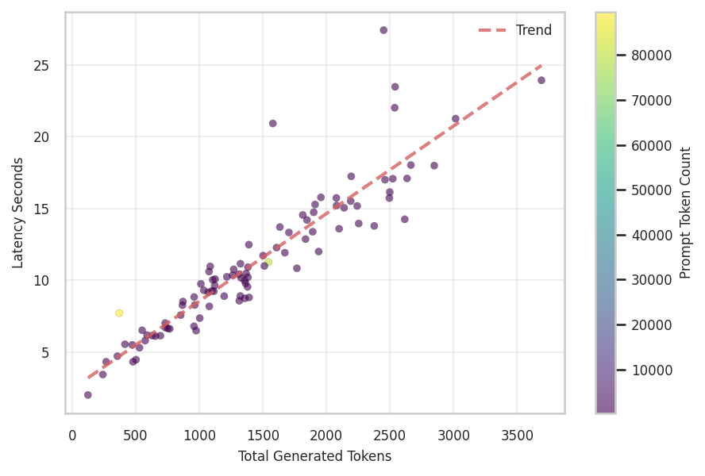](report_assets_20260309_162639/latency_scatter_adk_documentation_agent_gemini-2_5-flash_4K.png)
<br>

**gemini-2.5-pro**

- **Number of Requests**: 113


- **Correlation**: 0.874 (Very Strong)


**Latency vs Tokens (adk_documentation_agent via gemini-2.5-pro)**<br>

[](report_assets_20260309_162639/latency_scatter_adk_documentation_agent_gemini-2_5-pro_4K.png)
<br>

**gemini-3-pro-preview**

- **Number of Requests**: 58


- **Correlation**: 0.832 (Very Strong)


**Latency vs Tokens (adk_documentation_agent via gemini-3-pro-preview)**<br>

[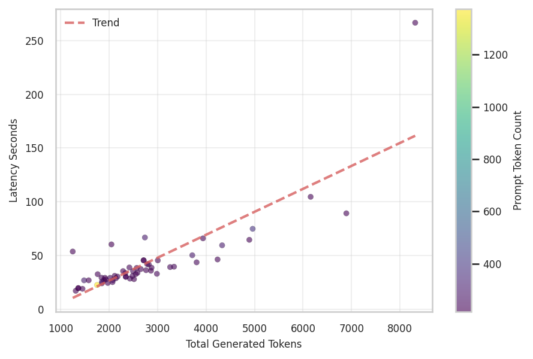](report_assets_20260309_162639/latency_scatter_adk_documentation_agent_gemini-3-pro-preview_4K.png)
<br>

**gemini-3.1-pro-preview**

- **Number of Requests**: 53


- **Correlation**: 0.763 (Strong)


**Latency vs Tokens (adk_documentation_agent via gemini-3.1-pro-preview)**<br>

[](report_assets_20260309_162639/latency_scatter_adk_documentation_agent_gemini-3_1-pro-preview_4K.png)
<br>

#### ai_observability_agent


**gemini-2.5-flash**

- **Number of Requests**: 49


- **Correlation**: 0.706 (Strong)


**Latency vs Tokens (ai_observability_agent via gemini-2.5-flash)**<br>

[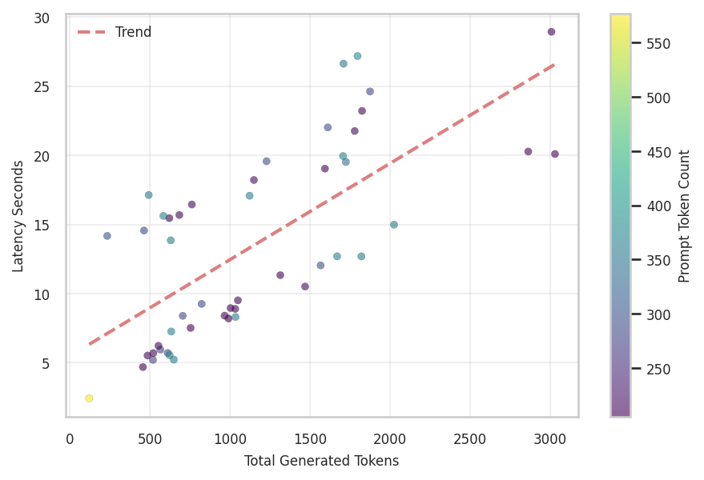](report_assets_20260309_162639/latency_scatter_ai_observability_agent_gemini-2_5-flash_4K.png)
<br>

**gemini-2.5-pro**

- **Number of Requests**: 38


- **Correlation**: 0.604 (Strong)


**Latency vs Tokens (ai_observability_agent via gemini-2.5-pro)**<br>

[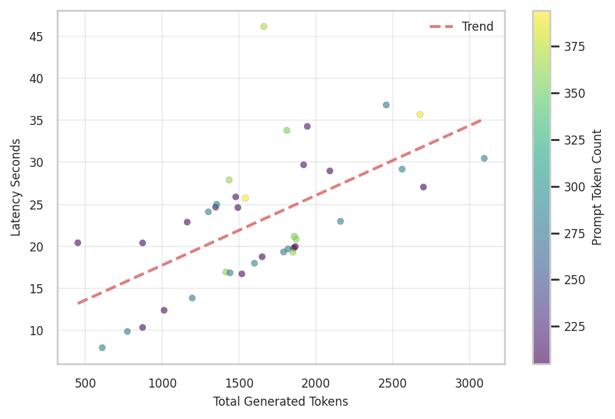](report_assets_20260309_162639/latency_scatter_ai_observability_agent_gemini-2_5-pro_4K.png)
<br>

#### bigquery_data_agent


**gemini-2.5-flash**

- **Number of Requests**: 790


- **Correlation**: 0.810 (Very Strong)


**Latency vs Tokens (bigquery_data_agent via gemini-2.5-flash)**<br>

[](report_assets_20260309_162639/latency_scatter_bigquery_data_agent_gemini-2_5-flash_4K.png)
<br>

**gemini-2.5-pro**

- **Number of Requests**: 446


- **Correlation**: 0.836 (Very Strong)


**Latency vs Tokens (bigquery_data_agent via gemini-2.5-pro)**<br>

[](report_assets_20260309_162639/latency_scatter_bigquery_data_agent_gemini-2_5-pro_4K.png)
<br>

**gemini-3-pro-preview**

- **Number of Requests**: 290


- **Correlation**: 0.817 (Very Strong)


**Latency vs Tokens (bigquery_data_agent via gemini-3-pro-preview)**<br>

[](report_assets_20260309_162639/latency_scatter_bigquery_data_agent_gemini-3-pro-preview_4K.png)
<br>

**gemini-3.1-pro-preview**

- **Number of Requests**: 361


- **Correlation**: 0.632 (Strong)


**Latency vs Tokens (bigquery_data_agent via gemini-3.1-pro-preview)**<br>

[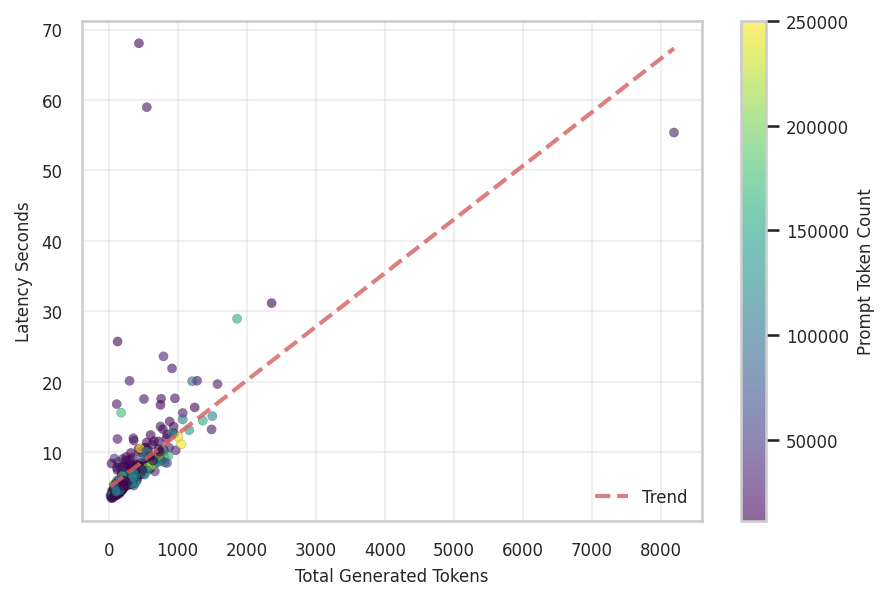](report_assets_20260309_162639/latency_scatter_bigquery_data_agent_gemini-3_1-pro-preview_4K.png)
<br>

#### config_test_agent_high_temp


**gemini-2.5-flash**

- **Number of Requests**: 14


- **Correlation**: 0.958 (Very Strong)


**Latency vs Tokens (config_test_agent_high_temp via gemini-2.5-flash)**<br>

[](report_assets_20260309_162639/latency_scatter_config_test_agent_high_temp_gemini-2_5-flash_4K.png)
<br>

**gemini-2.5-pro**

- **Number of Requests**: 9


- **Correlation**: 0.990 (Very Strong)


**Latency vs Tokens (config_test_agent_high_temp via gemini-2.5-pro)**<br>

[](report_assets_20260309_162639/latency_scatter_config_test_agent_high_temp_gemini-2_5-pro_4K.png)
<br>

**gemini-3-pro-preview**

- **Number of Requests**: 10


- **Correlation**: 0.981 (Very Strong)


**Latency vs Tokens (config_test_agent_high_temp via gemini-3-pro-preview)**<br>

[](report_assets_20260309_162639/latency_scatter_config_test_agent_high_temp_gemini-3-pro-preview_4K.png)
<br>

**gemini-3.1-pro-preview**

- **Number of Requests**: 8


- **Correlation**: 0.948 (Very Strong)


**Latency vs Tokens (config_test_agent_high_temp via gemini-3.1-pro-preview)**<br>

[](report_assets_20260309_162639/latency_scatter_config_test_agent_high_temp_gemini-3_1-pro-preview_4K.png)
<br>

#### config_test_agent_normal


**gemini-2.5-flash**

- **Number of Requests**: 55


- **Correlation**: 0.830 (Very Strong)


**Latency vs Tokens (config_test_agent_normal via gemini-2.5-flash)**<br>

[](report_assets_20260309_162639/latency_scatter_config_test_agent_normal_gemini-2_5-flash_4K.png)
<br>

**gemini-2.5-pro**

- **Number of Requests**: 10


- **Correlation**: 0.996 (Very Strong)


**Latency vs Tokens (config_test_agent_normal via gemini-2.5-pro)**<br>

[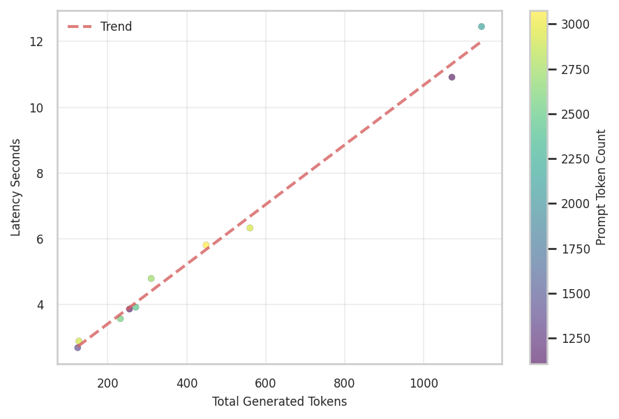](report_assets_20260309_162639/latency_scatter_config_test_agent_normal_gemini-2_5-pro_4K.png)
<br>

**gemini-3-pro-preview**

- **Number of Requests**: 9


- **Correlation**: 0.687 (Strong)


**Latency vs Tokens (config_test_agent_normal via gemini-3-pro-preview)**<br>

[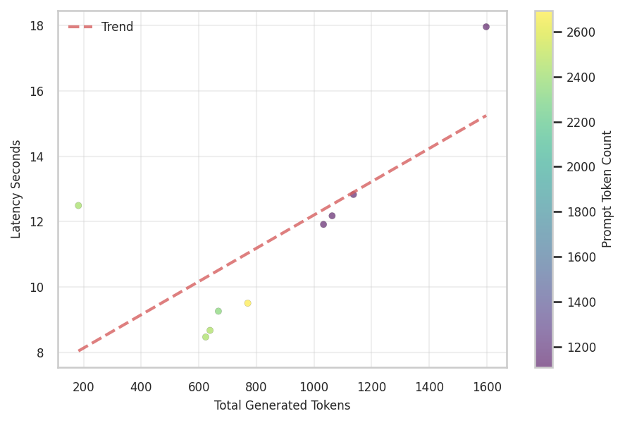](report_assets_20260309_162639/latency_scatter_config_test_agent_normal_gemini-3-pro-preview_4K.png)
<br>

**gemini-3.1-pro-preview**

- **Number of Requests**: 10


- **Correlation**: 0.985 (Very Strong)


**Latency vs Tokens (config_test_agent_normal via gemini-3.1-pro-preview)**<br>

[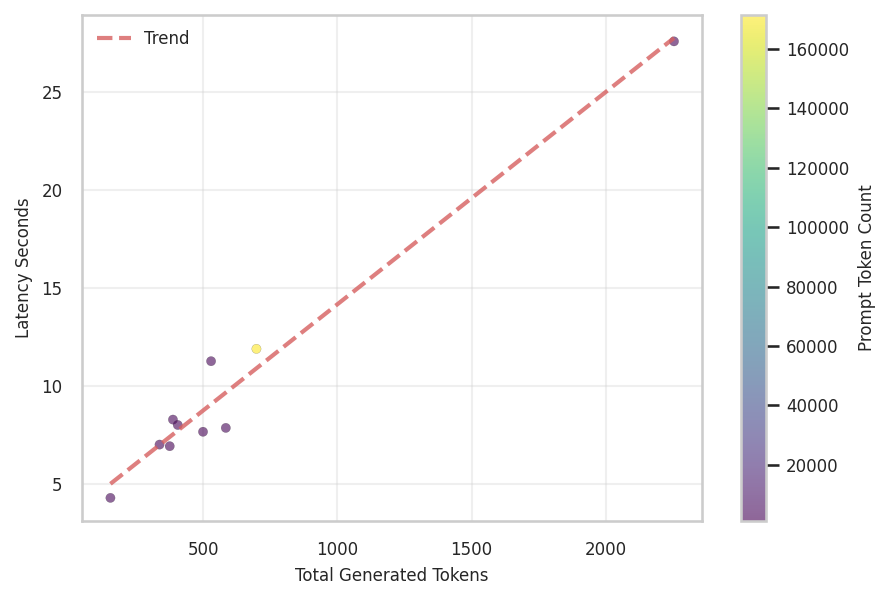](report_assets_20260309_162639/latency_scatter_config_test_agent_normal_gemini-3_1-pro-preview_4K.png)
<br>

#### config_test_agent_over_provisioned


**gemini-2.5-flash**

- **Number of Requests**: 18


- **Correlation**: 0.962 (Very Strong)


**Latency vs Tokens (config_test_agent_over_provisioned via gemini-2.5-flash)**<br>

[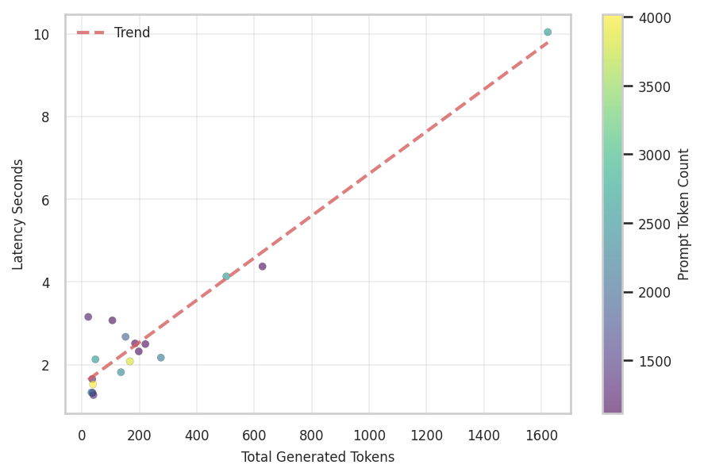](report_assets_20260309_162639/latency_scatter_config_test_agent_over_provisioned_gemini-2_5-flash_4K.png)
<br>

**gemini-2.5-pro**

- **Number of Requests**: 25


- **Correlation**: 0.993 (Very Strong)


**Latency vs Tokens (config_test_agent_over_provisioned via gemini-2.5-pro)**<br>

[](report_assets_20260309_162639/latency_scatter_config_test_agent_over_provisioned_gemini-2_5-pro_4K.png)
<br>

**gemini-3-pro-preview**

- **Number of Requests**: 13


- **Correlation**: 0.912 (Very Strong)


**Latency vs Tokens (config_test_agent_over_provisioned via gemini-3-pro-preview)**<br>

[](report_assets_20260309_162639/latency_scatter_config_test_agent_over_provisioned_gemini-3-pro-preview_4K.png)
<br>

**gemini-3.1-pro-preview**

- **Number of Requests**: 19


- **Correlation**: 0.976 (Very Strong)


**Latency vs Tokens (config_test_agent_over_provisioned via gemini-3.1-pro-preview)**<br>

[](report_assets_20260309_162639/latency_scatter_config_test_agent_over_provisioned_gemini-3_1-pro-preview_4K.png)
<br>

#### config_test_agent_wrong_candidates


**gemini-2.5-flash**

- **Number of Requests**: 20


- **Correlation**: 0.848 (Very Strong)


**Latency vs Tokens (config_test_agent_wrong_candidates via gemini-2.5-flash)**<br>

[](report_assets_20260309_162639/latency_scatter_config_test_agent_wrong_candidates_gemini-2_5-flash_4K.png)
<br>

**gemini-2.5-pro**

- **Number of Requests**: 13


- **Correlation**: 0.928 (Very Strong)


**Latency vs Tokens (config_test_agent_wrong_candidates via gemini-2.5-pro)**<br>

[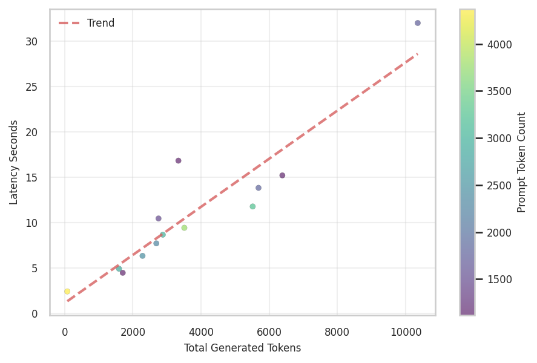](report_assets_20260309_162639/latency_scatter_config_test_agent_wrong_candidates_gemini-2_5-pro_4K.png)
<br>

**gemini-3-pro-preview**

- **Number of Requests**: 7


- **Correlation**: 0.674 (Strong)


**Latency vs Tokens (config_test_agent_wrong_candidates via gemini-3-pro-preview)**<br>

[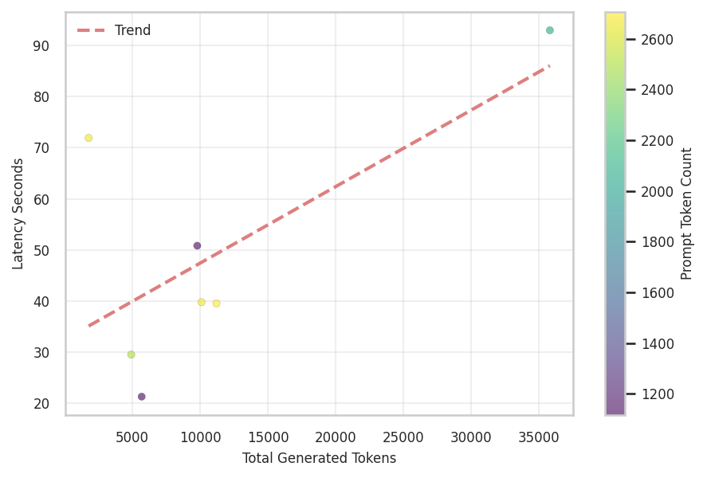](report_assets_20260309_162639/latency_scatter_config_test_agent_wrong_candidates_gemini-3-pro-preview_4K.png)
<br>

**gemini-3.1-pro-preview**

- **Number of Requests**: 9


- **Correlation**: 0.631 (Strong)


**Latency vs Tokens (config_test_agent_wrong_candidates via gemini-3.1-pro-preview)**<br>

[](report_assets_20260309_162639/latency_scatter_config_test_agent_wrong_candidates_gemini-3_1-pro-preview_4K.png)
<br>

#### google_search_agent


**gemini-2.5-flash**

- **Number of Requests**: 50


- **Correlation**: 0.951 (Very Strong)


**Latency vs Tokens (google_search_agent via gemini-2.5-flash)**<br>

[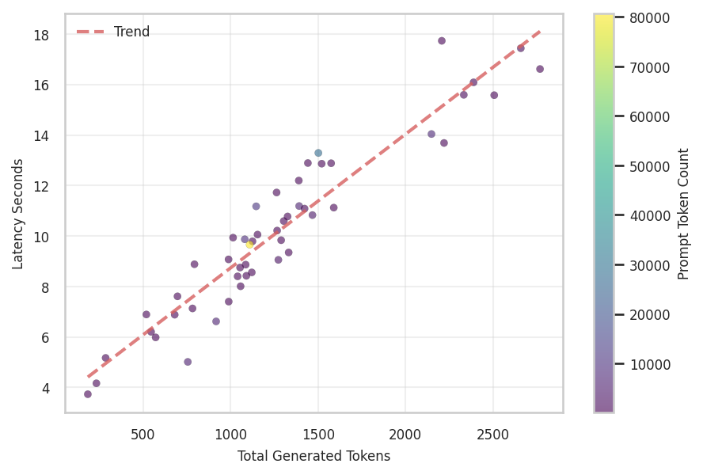](report_assets_20260309_162639/latency_scatter_google_search_agent_gemini-2_5-flash_4K.png)
<br>

**gemini-2.5-pro**

- **Number of Requests**: 77


- **Correlation**: 0.743 (Strong)


**Latency vs Tokens (google_search_agent via gemini-2.5-pro)**<br>

[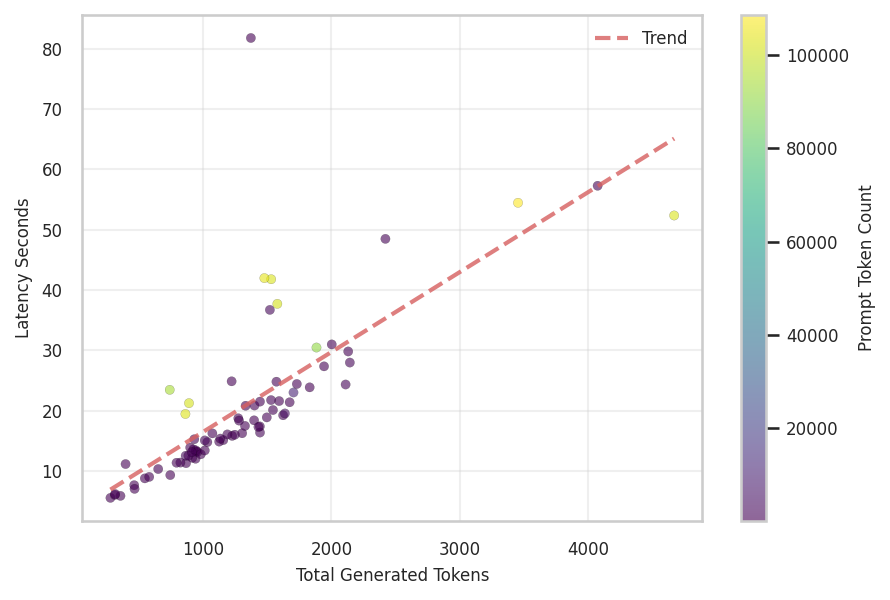](report_assets_20260309_162639/latency_scatter_google_search_agent_gemini-2_5-pro_4K.png)
<br>

**gemini-3-pro-preview**

- **Number of Requests**: 15


- **Correlation**: 0.768 (Strong)


**Latency vs Tokens (google_search_agent via gemini-3-pro-preview)**<br>

[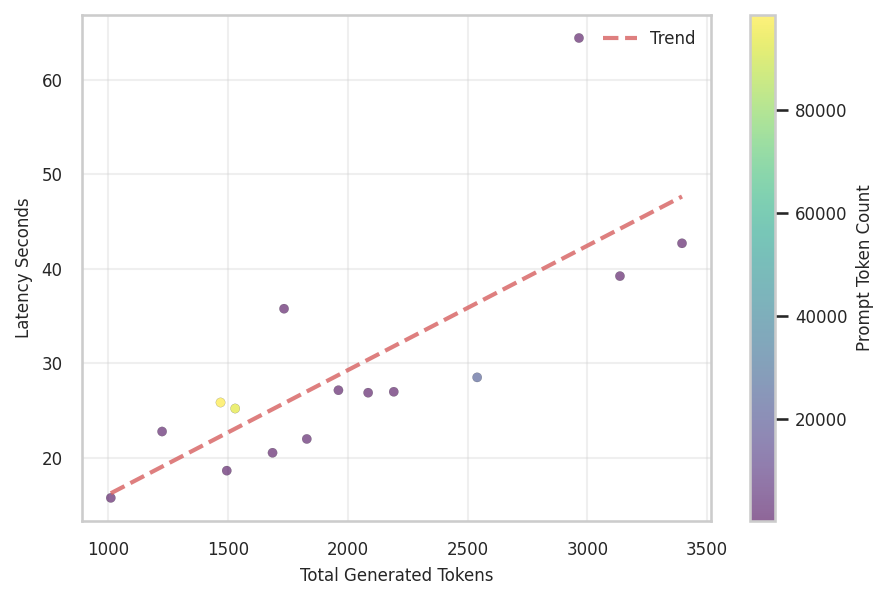](report_assets_20260309_162639/latency_scatter_google_search_agent_gemini-3-pro-preview_4K.png)
<br>

**gemini-3.1-pro-preview**

- **Number of Requests**: 20


- **Correlation**: 0.957 (Very Strong)


**Latency vs Tokens (google_search_agent via gemini-3.1-pro-preview)**<br>

[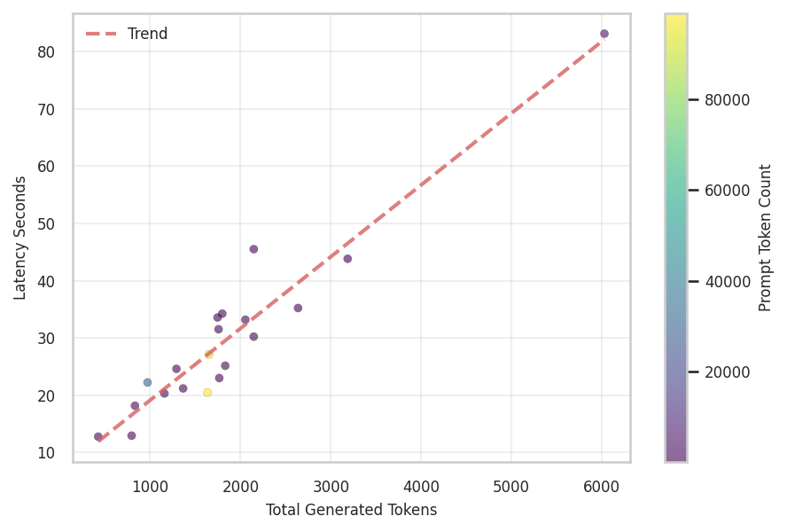](report_assets_20260309_162639/latency_scatter_google_search_agent_gemini-3_1-pro-preview_4K.png)
<br>

#### knowledge_qa_supervisor


**gemini-2.5-flash**

- **Number of Requests**: 1102


- **Correlation**: 0.872 (Very Strong)


**Latency vs Tokens (knowledge_qa_supervisor via gemini-2.5-flash)**<br>

[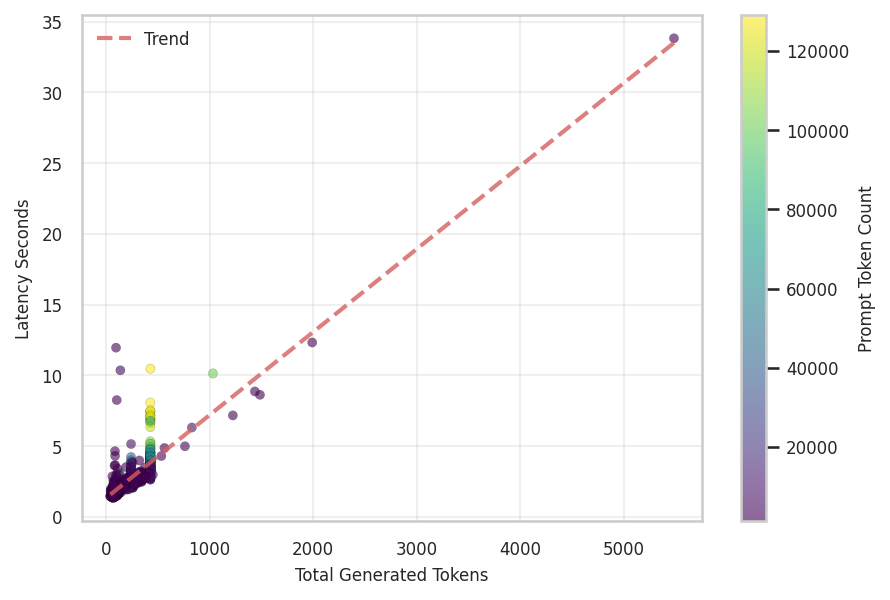](report_assets_20260309_162639/latency_scatter_knowledge_qa_supervisor_gemini-2_5-flash_4K.png)
<br>

**gemini-2.5-pro**

- **Number of Requests**: 669


- **Correlation**: 0.956 (Very Strong)


**Latency vs Tokens (knowledge_qa_supervisor via gemini-2.5-pro)**<br>

[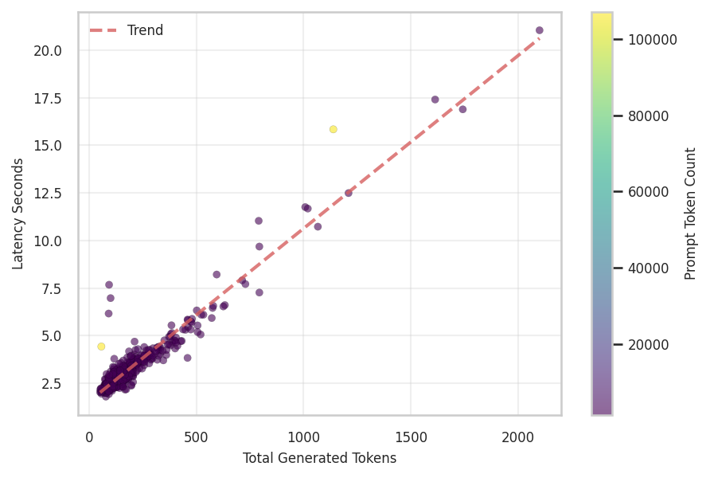](report_assets_20260309_162639/latency_scatter_knowledge_qa_supervisor_gemini-2_5-pro_4K.png)
<br>

**gemini-3-pro-preview**

- **Number of Requests**: 274


- **Correlation**: 0.577 (Moderate)


**Latency vs Tokens (knowledge_qa_supervisor via gemini-3-pro-preview)**<br>

[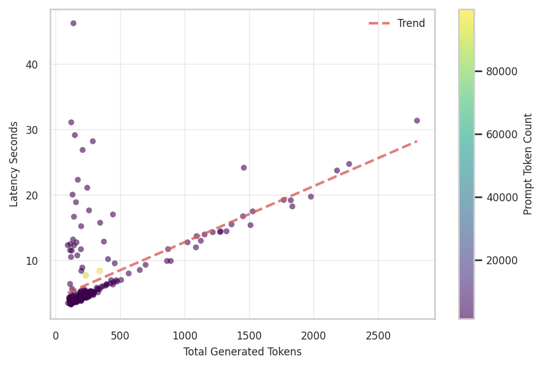](report_assets_20260309_162639/latency_scatter_knowledge_qa_supervisor_gemini-3-pro-preview_4K.png)
<br>

**gemini-3.1-pro-preview**

- **Number of Requests**: 240


- **Correlation**: 0.813 (Very Strong)


**Latency vs Tokens (knowledge_qa_supervisor via gemini-3.1-pro-preview)**<br>

[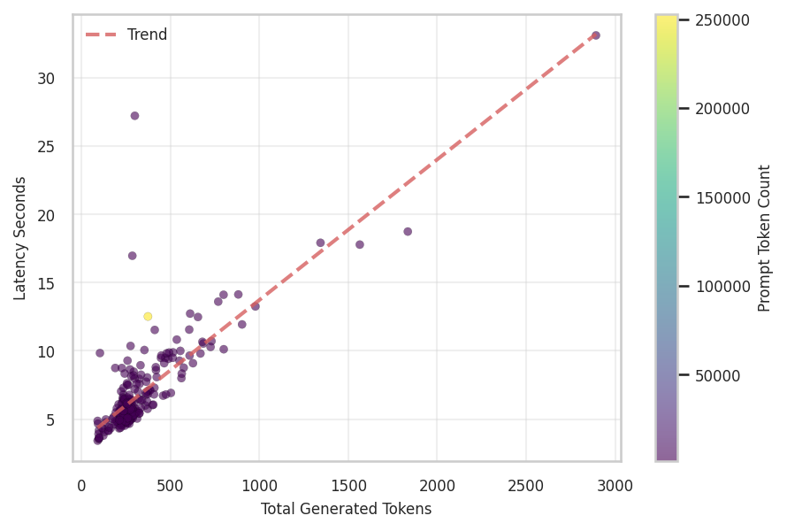](report_assets_20260309_162639/latency_scatter_knowledge_qa_supervisor_gemini-3_1-pro-preview_4K.png)
<br>

#### lookup_worker_1


**gemini-2.5-flash**

- **Number of Requests**: 83


- **Correlation**: 0.403 (Moderate)


**Latency vs Tokens (lookup_worker_1 via gemini-2.5-flash)**<br>

[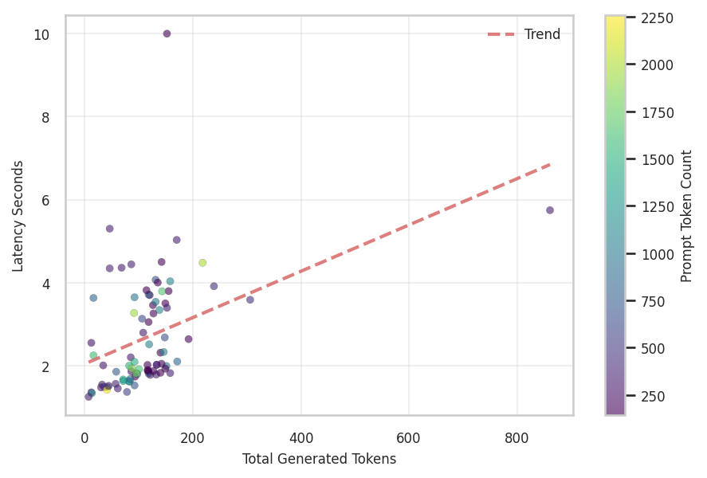](report_assets_20260309_162639/latency_scatter_lookup_worker_1_gemini-2_5-flash_4K.png)
<br>

**gemini-2.5-pro**

- **Number of Requests**: 52


- **Correlation**: 0.962 (Very Strong)


**Latency vs Tokens (lookup_worker_1 via gemini-2.5-pro)**<br>

[](report_assets_20260309_162639/latency_scatter_lookup_worker_1_gemini-2_5-pro_4K.png)
<br>

**gemini-3-pro-preview**

- **Number of Requests**: 63


- **Correlation**: 0.824 (Very Strong)


**Latency vs Tokens (lookup_worker_1 via gemini-3-pro-preview)**<br>

[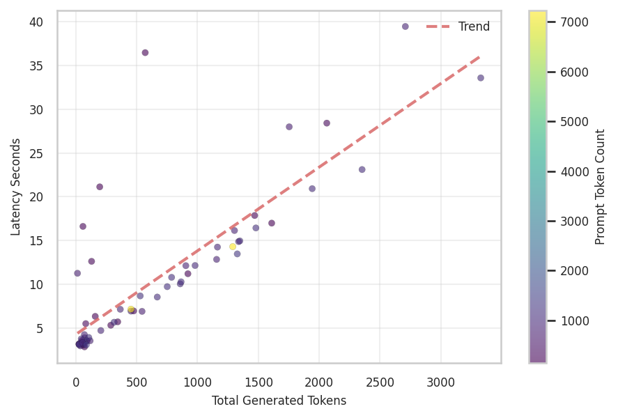](report_assets_20260309_162639/latency_scatter_lookup_worker_1_gemini-3-pro-preview_4K.png)
<br>

**gemini-3.1-pro-preview**

- **Number of Requests**: 56


- **Correlation**: 0.557 (Moderate)


**Latency vs Tokens (lookup_worker_1 via gemini-3.1-pro-preview)**<br>

[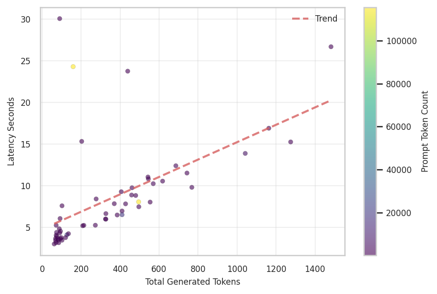](report_assets_20260309_162639/latency_scatter_lookup_worker_1_gemini-3_1-pro-preview_4K.png)
<br>

#### lookup_worker_2


**gemini-2.5-flash**

- **Number of Requests**: 84


- **Correlation**: 0.284 (Weak)


**Latency vs Tokens (lookup_worker_2 via gemini-2.5-flash)**<br>

[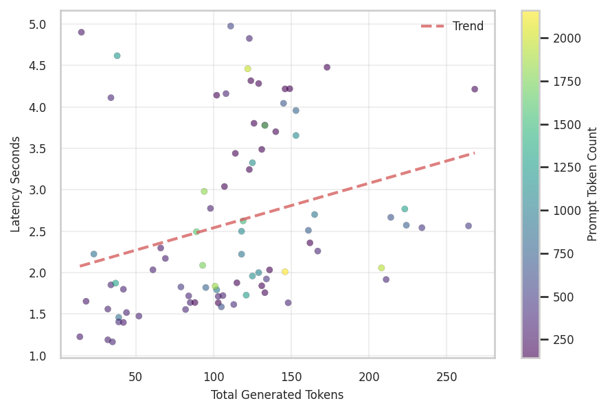](report_assets_20260309_162639/latency_scatter_lookup_worker_2_gemini-2_5-flash_4K.png)
<br>

**gemini-2.5-pro**

- **Number of Requests**: 52


- **Correlation**: 0.873 (Very Strong)


**Latency vs Tokens (lookup_worker_2 via gemini-2.5-pro)**<br>

[](report_assets_20260309_162639/latency_scatter_lookup_worker_2_gemini-2_5-pro_4K.png)
<br>

**gemini-3-pro-preview**

- **Number of Requests**: 58


- **Correlation**: 0.951 (Very Strong)


**Latency vs Tokens (lookup_worker_2 via gemini-3-pro-preview)**<br>

[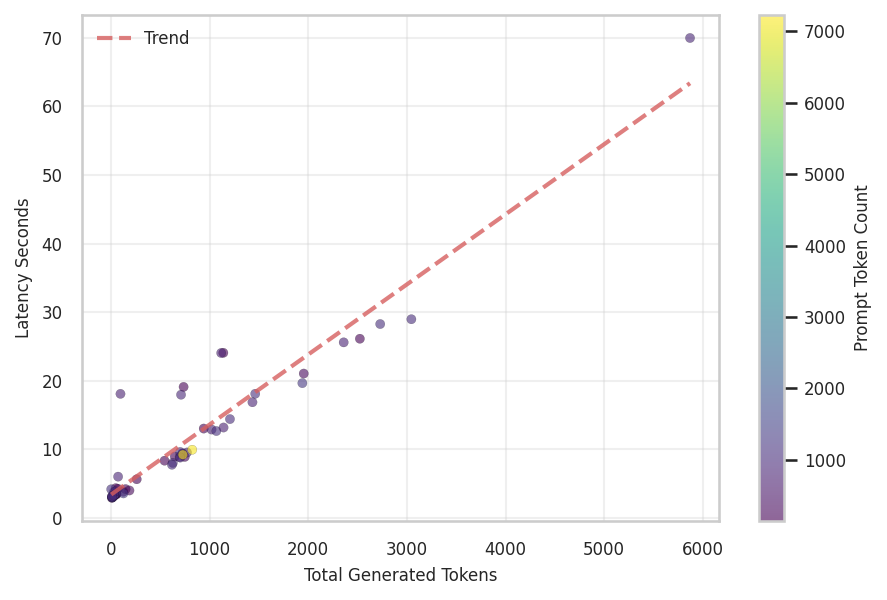](report_assets_20260309_162639/latency_scatter_lookup_worker_2_gemini-3-pro-preview_4K.png)
<br>

**gemini-3.1-pro-preview**

- **Number of Requests**: 54


- **Correlation**: 0.958 (Very Strong)


**Latency vs Tokens (lookup_worker_2 via gemini-3.1-pro-preview)**<br>

[](report_assets_20260309_162639/latency_scatter_lookup_worker_2_gemini-3_1-pro-preview_4K.png)
<br>

#### lookup_worker_3


**gemini-2.5-flash**

- **Number of Requests**: 87


- **Correlation**: 0.117 (Very Weak / None)


**Latency vs Tokens (lookup_worker_3 via gemini-2.5-flash)**<br>

[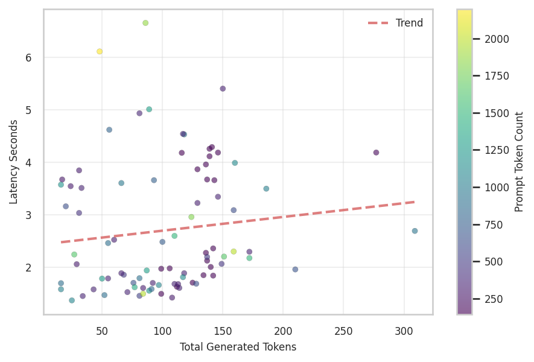](report_assets_20260309_162639/latency_scatter_lookup_worker_3_gemini-2_5-flash_4K.png)
<br>

**gemini-2.5-pro**

- **Number of Requests**: 50


- **Correlation**: 0.973 (Very Strong)


**Latency vs Tokens (lookup_worker_3 via gemini-2.5-pro)**<br>

[](report_assets_20260309_162639/latency_scatter_lookup_worker_3_gemini-2_5-pro_4K.png)
<br>

**gemini-3-pro-preview**

- **Number of Requests**: 60


- **Correlation**: 0.943 (Very Strong)


**Latency vs Tokens (lookup_worker_3 via gemini-3-pro-preview)**<br>

[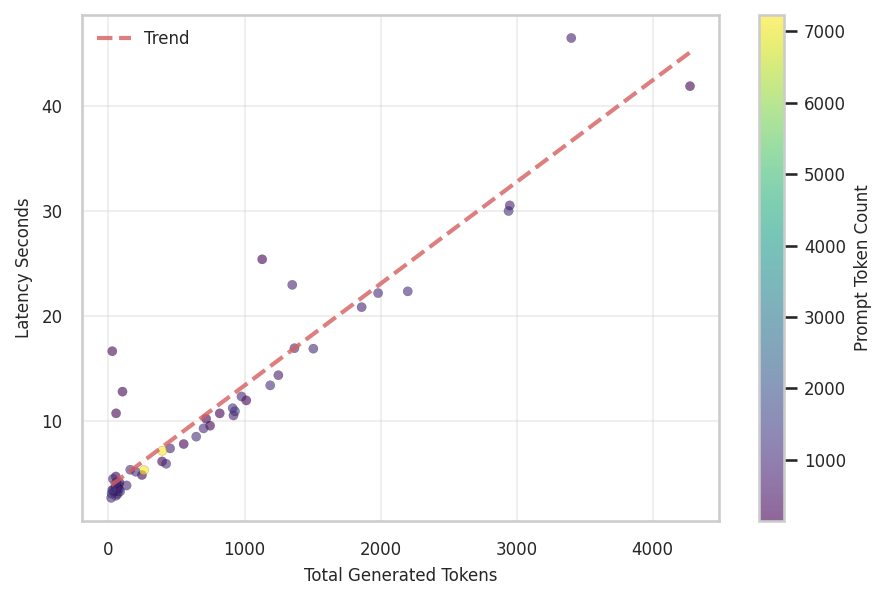](report_assets_20260309_162639/latency_scatter_lookup_worker_3_gemini-3-pro-preview_4K.png)
<br>

**gemini-3.1-pro-preview**

- **Number of Requests**: 56


- **Correlation**: 0.843 (Very Strong)


**Latency vs Tokens (lookup_worker_3 via gemini-3.1-pro-preview)**<br>

[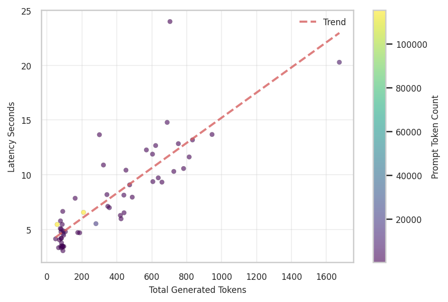](report_assets_20260309_162639/latency_scatter_lookup_worker_3_gemini-3_1-pro-preview_4K.png)
<br>

#### unreliable_tool_agent


**gemini-2.5-flash**

- **Number of Requests**: 24


- **Correlation**: 0.884 (Very Strong)


**Latency vs Tokens (unreliable_tool_agent via gemini-2.5-flash)**<br>

[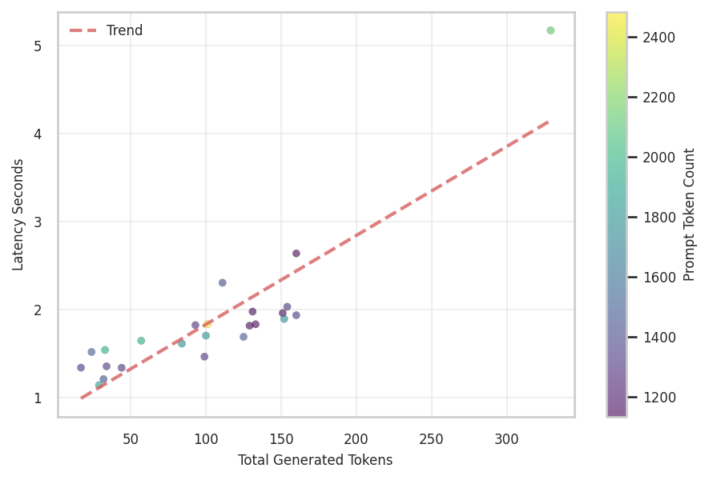](report_assets_20260309_162639/latency_scatter_unreliable_tool_agent_gemini-2_5-flash_4K.png)
<br>

**gemini-2.5-pro**

- **Number of Requests**: 67


- **Correlation**: 0.958 (Very Strong)


**Latency vs Tokens (unreliable_tool_agent via gemini-2.5-pro)**<br>

[](report_assets_20260309_162639/latency_scatter_unreliable_tool_agent_gemini-2_5-pro_4K.png)
<br>

**gemini-3-pro-preview**

- **Number of Requests**: 26


- **Correlation**: 0.634 (Strong)


**Latency vs Tokens (unreliable_tool_agent via gemini-3-pro-preview)**<br>

[](report_assets_20260309_162639/latency_scatter_unreliable_tool_agent_gemini-3-pro-preview_4K.png)
<br>


## Recommendations

1. **Triage Systemic Task Scheduling:** The highest priority is to investigate and resolve the `PENDING` state timeouts. The platform team must immediately analyze worker pool capacity, auto-scaling configurations, and the task queueing system to ensure agents are dequeued and executed promptly.
2. **Re-architect Inefficient Agents for Asynchronous Operation:** The `config_test_agent_normal` and `bigquery_data_agent` must be refactored to eliminate their massive internal overhead (203s and 189s respectively). Convert blocking, synchronous operations to an asynchronous model to improve concurrency and reduce wait times.
3. **Implement Robust Tool Failure Handling:** Introduce resilience patterns for agents calling external tools. For `unreliable_tool_agent`, implement configurable retry mechanisms with exponential backoff for transient errors and a circuit breaker pattern for the `flaky_tool_simulation` tool to prevent cascading failures.
4. **Optimize LLM Prompts to Reduce 'Thought' Tokens:** For agents with high LLM latency due to excessive 'thought token' generation like `adk_documentation_agent`, re-engineer prompts to be more direct and less ambiguous. This will guide the model to a faster conclusion by reducing long internal reasoning chains.
5. **Audit and Validate Agent Configurations:** Conduct a full audit of all agent configurations. Implement pre-deployment validation checks to catch misconfigurations like in `config_test_agent_wrong_max_tokens`, ensuring parameters like `max_output_tokens` are set to sensible values that do not guarantee failure.


### Holistic Cross-Section Analysis
The entire agent ecosystem is critically underperforming, with every level—End-to-End, Agent, Tool, and LLM—breaching its defined Service Level Objectives (SLOs). The root of this systemic failure is not a single faulty component but a cascade of interconnected issues spanning resource starvation, inefficient agent architecture, and downstream service unreliability.

The most severe issue is a system-level bottleneck in the agent orchestration layer. The two most frequently used sub-agents, `bigquery_data_agent` (24% of requests) and `ai_observability_agent` (26% of requests), are crippled by extremely high error rates (66.37% and 87.85%, respectively). Investigation reveals their failures are overwhelmingly due to `Agent span PENDING for > 5 minutes (Timed Out)` errors. This indicates a critical inability of the system to schedule and assign tasks to available workers, pointing to either a saturated worker pool or a malfunctioning dispatcher. This single root cause is responsible for a significant portion of the 43.55% end-to-end error rate for the `knowledge_qa_supervisor`.

Compounding this are severe inefficiencies within the agents themselves. The `config_test_agent_normal` and `bigquery_data_agent` exhibit astronomical P95.5 agent overhead of **203 and 189 seconds**, respectively. This means the vast majority of their execution time is spent within the agent's own internal logic, not waiting on LLM responses or tool calls. This points to highly inefficient, blocking code within the agent's implementation that is exacerbating the already long end-to-end latency.

Furthermore, downstream dependencies, both simulated and real, are contributing to the instability. The `unreliable_tool_agent`'s 34.33% error rate is directly caused by timeouts in its `flaky_tool_simulation` tool. Similarly, the `ai_observability_agent` suffers from `500 INTERNAL` errors from its downstream Vertex AI Search datastore, indicating that even when agent tasks do get scheduled, they are vulnerable to failures in external dependencies.

Finally, the LLM layer itself is underperforming. All models fail to meet their 5-second latency target, with the `gemini-3-pro-preview` and `gemini-3.1-pro-preview` models showing the highest P95.5 latencies. This is strongly correlated with high "thought token" counts, where the model spends excessive time generating internal reasoning steps before producing an output, as seen in the slowest LLM queries.

In summary, the ecosystem is in a precarious state. A core scheduling bottleneck prevents agents from even starting, inefficient agent code creates massive internal delays, and unreliable downstream tools and underperforming LLMs add further latency and errors, resulting in a system that is failing at every level.

## Critical Workflow Failures
*   **Systemic Task Scheduling Failure:** The most critical failure is the widespread `Agent span PENDING for > 5 minutes (Timed Out)` error affecting a majority of `bigquery_data_agent` and `ai_observability_agent` executions. This is not an agent logic error but a platform-level failure to allocate resources, rendering a large portion of the system non-operational. An example of this is trace [`e97b92d4c19ef7adc25baecda5674913`](https://console.cloud.google.com/traces/explorer;traceId=e97b92d4c19ef7adc25baecda5674913?project=agent-operations-ek-05), where the agent timed out before a single line of its own code could be executed.

*   **Tool-Induced Agent Failure:** The `unreliable_tool_agent` consistently fails due to timeouts from its dependency, the `flaky_tool_simulation`. In trace [`9dc356751e83f8510c7836f3fce1b2c4`](https://console.cloud.google.com/traces/explorer;traceId=9dc356751e83f8510c7836f3fce1b2c4?project=agent-operations-ek-05), the tool call failed with the error `unreliable_tool timed out for query: complex_calculation_task_v100`, which directly caused the parent agent to fail, which in turn caused the root `knowledge_qa_supervisor` to fail. This highlights a lack of graceful error handling or retry mechanisms for tool failures.

*   **Recursive Routing Loop:** The error `maximum recursion depth exceeded` in trace [`d0ddedbe54e33294894d6edc693a2fee`](https://console.cloud.google.com/traces/explorer;traceId=d0ddedbe54e33294894d6edc693a2fee?project=agent-operations-ek-05) reveals a critical agent routing flaw. The `knowledge_qa_supervisor` incorrectly delegates a data export task to `bigquery_data_agent`, which lacks the necessary tools. The `bigquery_data_agent` then attempts to route back to the supervisor, creating an infinite loop that crashes the session.

*   **Misconfigured Agent Leading to 100% Failure:** The `config_test_agent_wrong_max_tokens` agent fails in 100% of its requests. The high volume of empty LLM responses associated with this agent strongly indicates that its `max_output_tokens` parameter is configured too low. This causes the LLM to generate a truncated, empty response, leading to a hard failure in the agent's parsing logic every time it is invoked.

## Architectural Recommendations
1.  **Address the Systemic Task Scheduling Failure:** The highest priority is to investigate and resolve the `PENDING` state timeouts. The agent orchestration platform team must analyze the worker pool capacity, auto-scaling configurations, and the task dispatching/queueing system to ensure agents are dequeued and executed promptly.

2.  **Re-architect Inefficient Agents to Reduce Overhead:** The `config_test_agent_normal` and `bigquery_data_agent` must be refactored. Their massive internal overhead suggests blocking, synchronous code. These agents should be redesigned to use asynchronous operations, especially for I/O-bound tasks, to yield control and improve concurrency.

3.  **Implement Robust Tool Failure Handling:** Agents that rely on external or fallible tools, such as `unreliable_tool_agent`, must incorporate more robust error handling. This should include configurable retry mechanisms with exponential backoff for transient errors and circuit breaker patterns for tools that are consistently failing.

4.  **Optimize LLM "Thought" Generation:** For agents exhibiting high LLM latency due to excessive "thought tokens" (e.g., `adk_documentation_agent`), the prompts should be re-engineered to be more direct and less conducive to long internal monologues. Experiment with providing more structured examples or reducing the ambiguity of the request to guide the model to a quicker conclusion.

5.  **Audit and Correct Agent Configurations:** A full audit of all agent configurations is necessary to catch issues like the one with `config_test_agent_wrong_max_tokens`. Implement pre-deployment validation checks to ensure that LLM configurations (e.g., `max_output_tokens`) are set to sensible values that will not automatically cause failures.

# Appendix


### Agent Latency (By Model)

These charts breakdown the Agent execution sequences further by the underlying LLM model used for that request. This helps isolate whether an Agent's latency spike is tied to a specific model's degradation.


#### adk_documentation_agent

**Total Requests:** 96


**adk_documentation_agent via gemini-2.5-flash Latency Sequence**<br>
**Total Requests:** 96<br>

[](report_assets_20260309_162639/seq_agent_model_adk_documentation_agent_gemini-2_5-flash_4K.png)
<br>

**Total Requests:** 113


**adk_documentation_agent via gemini-2.5-pro Latency Sequence**<br>
**Total Requests:** 113<br>

[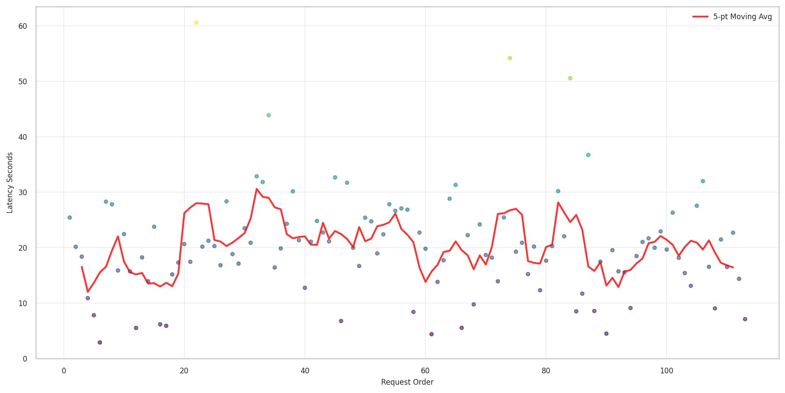](report_assets_20260309_162639/seq_agent_model_adk_documentation_agent_gemini-2_5-pro_4K.png)
<br>

**Total Requests:** 58


**adk_documentation_agent via gemini-3-pro-preview Latency Sequence**<br>
**Total Requests:** 58<br>

[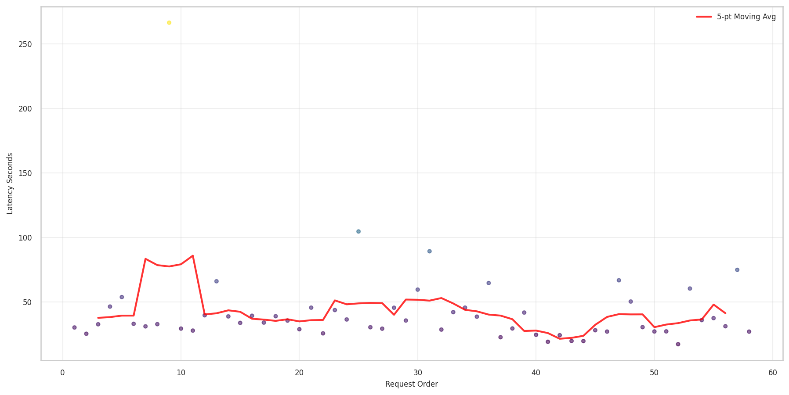](report_assets_20260309_162639/seq_agent_model_adk_documentation_agent_gemini-3-pro-preview_4K.png)
<br>

**Total Requests:** 54


**adk_documentation_agent via gemini-3.1-pro-preview Latency Sequence**<br>
**Total Requests:** 54<br>

[](report_assets_20260309_162639/seq_agent_model_adk_documentation_agent_gemini-3_1-pro-preview_4K.png)
<br>


#### ai_observability_agent

**Total Requests:** 50


**ai_observability_agent via gemini-2.5-flash Latency Sequence**<br>
**Total Requests:** 50<br>

[](report_assets_20260309_162639/seq_agent_model_ai_observability_agent_gemini-2_5-flash_4K.png)
<br>

**Total Requests:** 38


**ai_observability_agent via gemini-2.5-pro Latency Sequence**<br>
**Total Requests:** 38<br>

[](report_assets_20260309_162639/seq_agent_model_ai_observability_agent_gemini-2_5-pro_4K.png)
<br>


#### bigquery_data_agent

**Total Requests:** 388


**bigquery_data_agent via gemini-2.5-flash Latency Sequence**<br>
**Total Requests:** 388<br>

[](report_assets_20260309_162639/seq_agent_model_bigquery_data_agent_gemini-2_5-flash_4K.png)
<br>

**Total Requests:** 427


**bigquery_data_agent via gemini-2.5-pro Latency Sequence**<br>
**Total Requests:** 427<br>

[](report_assets_20260309_162639/seq_agent_model_bigquery_data_agent_gemini-2_5-pro_4K.png)
<br>

**Total Requests:** 180


**bigquery_data_agent via gemini-3-pro-preview Latency Sequence**<br>
**Total Requests:** 180<br>

[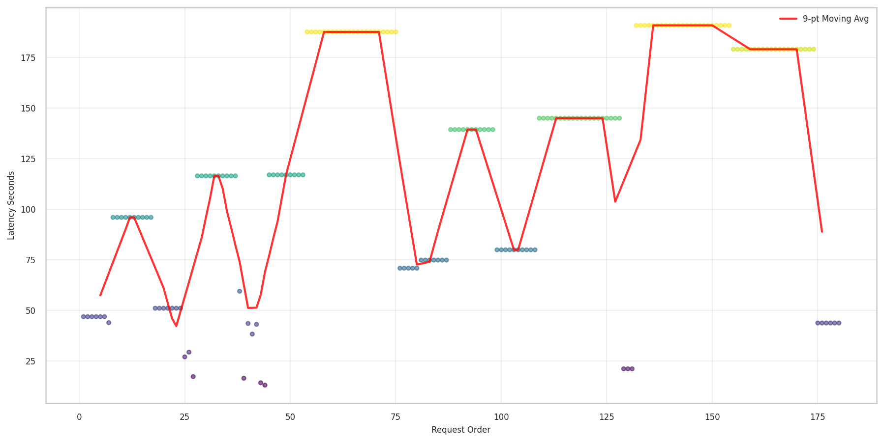](report_assets_20260309_162639/seq_agent_model_bigquery_data_agent_gemini-3-pro-preview_4K.png)
<br>

**Total Requests:** 342


**bigquery_data_agent via gemini-3.1-pro-preview Latency Sequence**<br>
**Total Requests:** 342<br>

[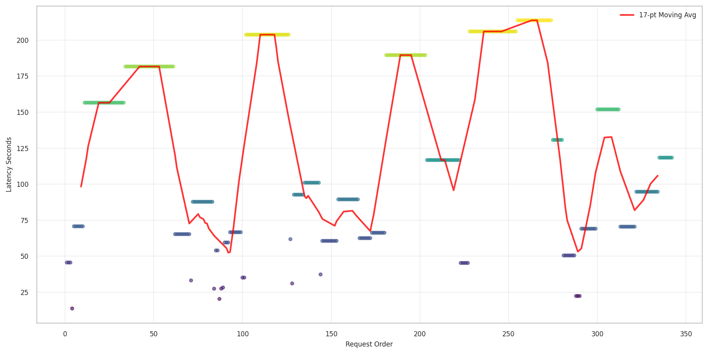](report_assets_20260309_162639/seq_agent_model_bigquery_data_agent_gemini-3_1-pro-preview_4K.png)
<br>


#### config_test_agent_high_temp

**Total Requests:** 14


**config_test_agent_high_temp via gemini-2.5-flash Latency Sequence**<br>
**Total Requests:** 14<br>

[](report_assets_20260309_162639/seq_agent_model_config_test_agent_high_temp_gemini-2_5-flash_4K.png)
<br>

**Total Requests:** 9


**config_test_agent_high_temp via gemini-2.5-pro Latency Sequence**<br>
**Total Requests:** 9<br>

[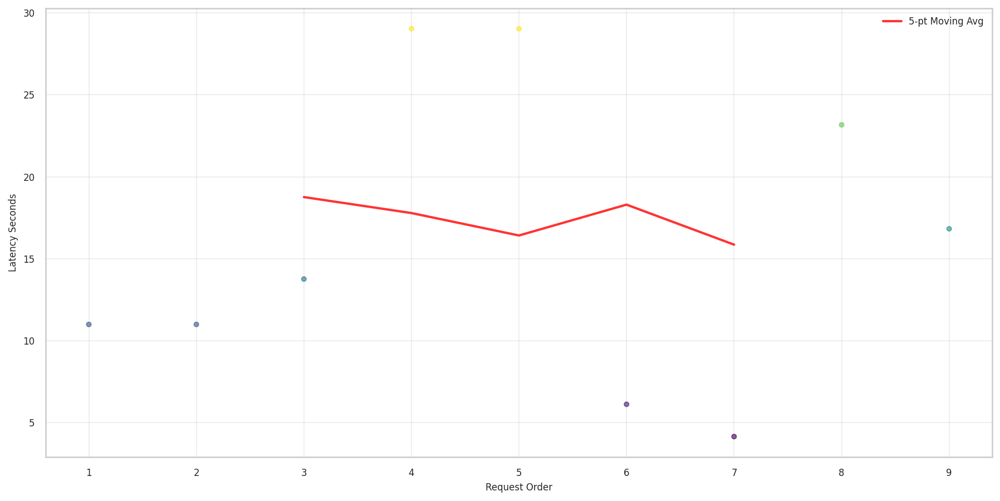](report_assets_20260309_162639/seq_agent_model_config_test_agent_high_temp_gemini-2_5-pro_4K.png)
<br>

**Total Requests:** 10


**config_test_agent_high_temp via gemini-3-pro-preview Latency Sequence**<br>
**Total Requests:** 10<br>

[](report_assets_20260309_162639/seq_agent_model_config_test_agent_high_temp_gemini-3-pro-preview_4K.png)
<br>

**Total Requests:** 8


**config_test_agent_high_temp via gemini-3.1-pro-preview Latency Sequence**<br>
**Total Requests:** 8<br>

[](report_assets_20260309_162639/seq_agent_model_config_test_agent_high_temp_gemini-3_1-pro-preview_4K.png)
<br>


#### config_test_agent_normal

**Total Requests:** 55


**config_test_agent_normal via gemini-2.5-flash Latency Sequence**<br>
**Total Requests:** 55<br>

[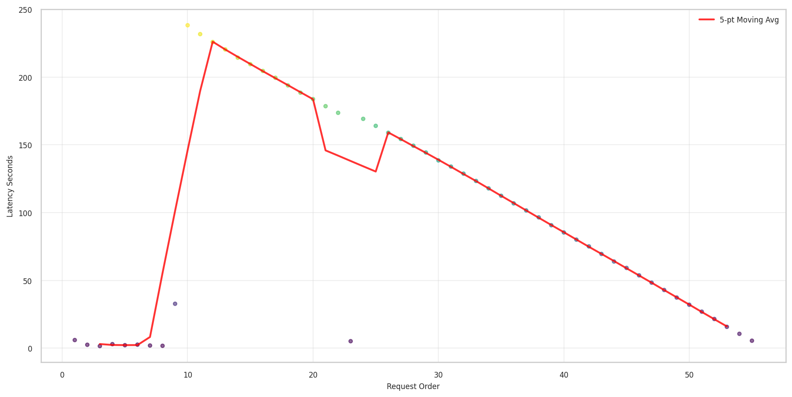](report_assets_20260309_162639/seq_agent_model_config_test_agent_normal_gemini-2_5-flash_4K.png)
<br>

**Total Requests:** 10


**config_test_agent_normal via gemini-2.5-pro Latency Sequence**<br>
**Total Requests:** 10<br>

[](report_assets_20260309_162639/seq_agent_model_config_test_agent_normal_gemini-2_5-pro_4K.png)
<br>

**Total Requests:** 9


**config_test_agent_normal via gemini-3-pro-preview Latency Sequence**<br>
**Total Requests:** 9<br>

[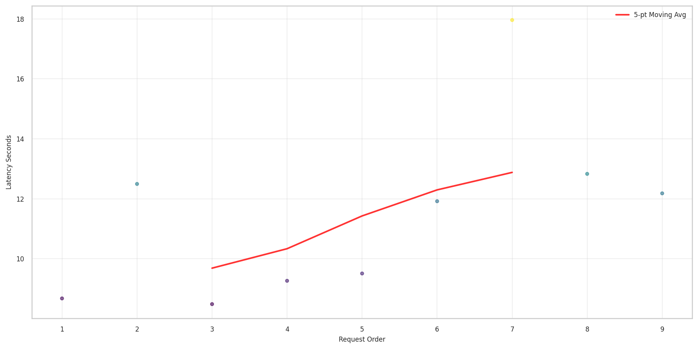](report_assets_20260309_162639/seq_agent_model_config_test_agent_normal_gemini-3-pro-preview_4K.png)
<br>

**Total Requests:** 10


**config_test_agent_normal via gemini-3.1-pro-preview Latency Sequence**<br>
**Total Requests:** 10<br>

[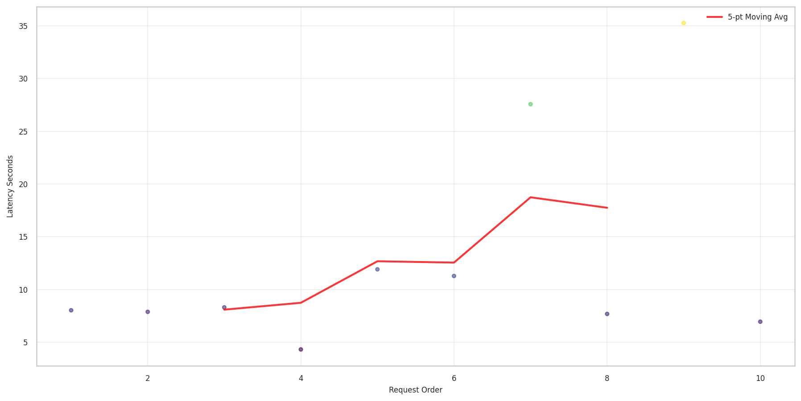](report_assets_20260309_162639/seq_agent_model_config_test_agent_normal_gemini-3_1-pro-preview_4K.png)
<br>


#### config_test_agent_over_provisioned

**Total Requests:** 18


**config_test_agent_over_provisioned via gemini-2.5-flash Latency Sequence**<br>
**Total Requests:** 18<br>

[](report_assets_20260309_162639/seq_agent_model_config_test_agent_over_provisioned_gemini-2_5-flash_4K.png)
<br>

**Total Requests:** 25


**config_test_agent_over_provisioned via gemini-2.5-pro Latency Sequence**<br>
**Total Requests:** 25<br>

[](report_assets_20260309_162639/seq_agent_model_config_test_agent_over_provisioned_gemini-2_5-pro_4K.png)
<br>

**Total Requests:** 11


**config_test_agent_over_provisioned via gemini-3-pro-preview Latency Sequence**<br>
**Total Requests:** 11<br>

[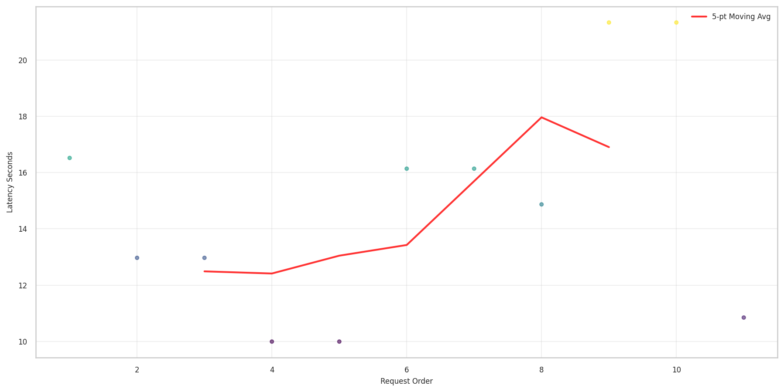](report_assets_20260309_162639/seq_agent_model_config_test_agent_over_provisioned_gemini-3-pro-preview_4K.png)
<br>

**Total Requests:** 19


**config_test_agent_over_provisioned via gemini-3.1-pro-preview Latency Sequence**<br>
**Total Requests:** 19<br>

[](report_assets_20260309_162639/seq_agent_model_config_test_agent_over_provisioned_gemini-3_1-pro-preview_4K.png)
<br>


#### config_test_agent_wrong_candidates

**Total Requests:** 20


**config_test_agent_wrong_candidates via gemini-2.5-flash Latency Sequence**<br>
**Total Requests:** 20<br>

[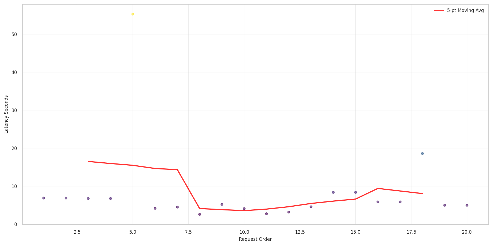](report_assets_20260309_162639/seq_agent_model_config_test_agent_wrong_candidates_gemini-2_5-flash_4K.png)
<br>

**Total Requests:** 13


**config_test_agent_wrong_candidates via gemini-2.5-pro Latency Sequence**<br>
**Total Requests:** 13<br>

[](report_assets_20260309_162639/seq_agent_model_config_test_agent_wrong_candidates_gemini-2_5-pro_4K.png)
<br>

**Total Requests:** 7


**config_test_agent_wrong_candidates via gemini-3-pro-preview Latency Sequence**<br>
**Total Requests:** 7<br>

[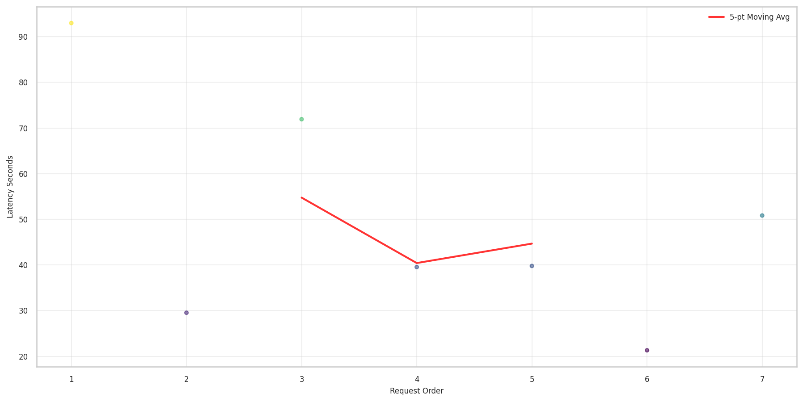](report_assets_20260309_162639/seq_agent_model_config_test_agent_wrong_candidates_gemini-3-pro-preview_4K.png)
<br>

**Total Requests:** 9


**config_test_agent_wrong_candidates via gemini-3.1-pro-preview Latency Sequence**<br>
**Total Requests:** 9<br>

[](report_assets_20260309_162639/seq_agent_model_config_test_agent_wrong_candidates_gemini-3_1-pro-preview_4K.png)
<br>


#### google_search_agent

**Total Requests:** 50


**google_search_agent via gemini-2.5-flash Latency Sequence**<br>
**Total Requests:** 50<br>

[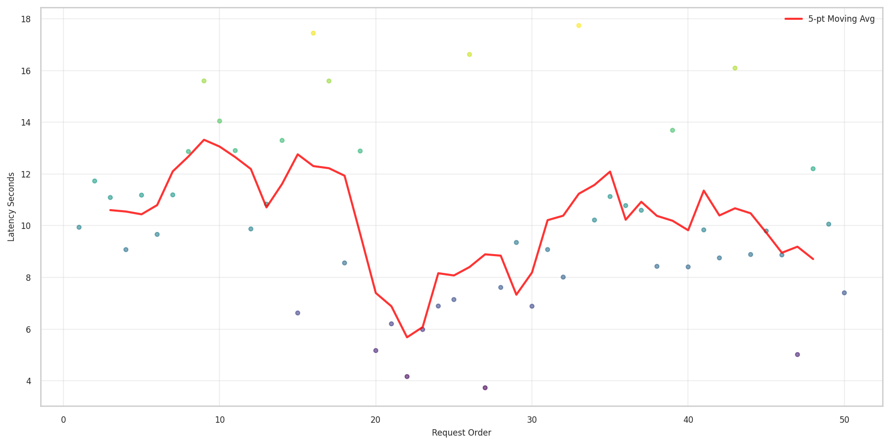](report_assets_20260309_162639/seq_agent_model_google_search_agent_gemini-2_5-flash_4K.png)
<br>

**Total Requests:** 77


**google_search_agent via gemini-2.5-pro Latency Sequence**<br>
**Total Requests:** 77<br>

[](report_assets_20260309_162639/seq_agent_model_google_search_agent_gemini-2_5-pro_4K.png)
<br>

**Total Requests:** 15


**google_search_agent via gemini-3-pro-preview Latency Sequence**<br>
**Total Requests:** 15<br>

[](report_assets_20260309_162639/seq_agent_model_google_search_agent_gemini-3-pro-preview_4K.png)
<br>

**Total Requests:** 20


**google_search_agent via gemini-3.1-pro-preview Latency Sequence**<br>
**Total Requests:** 20<br>

[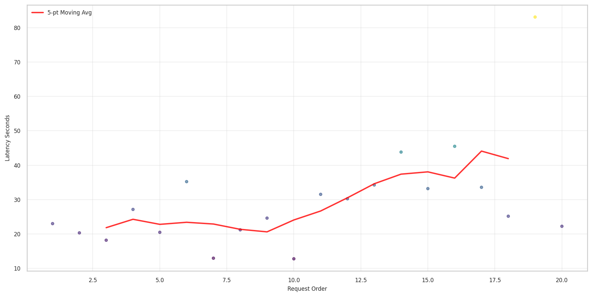](report_assets_20260309_162639/seq_agent_model_google_search_agent_gemini-3_1-pro-preview_4K.png)
<br>


#### lookup_worker_1

**Total Requests:** 84


**lookup_worker_1 via gemini-2.5-flash Latency Sequence**<br>
**Total Requests:** 84<br>

[](report_assets_20260309_162639/seq_agent_model_lookup_worker_1_gemini-2_5-flash_4K.png)
<br>

**Total Requests:** 56


**lookup_worker_1 via gemini-2.5-pro Latency Sequence**<br>
**Total Requests:** 56<br>

[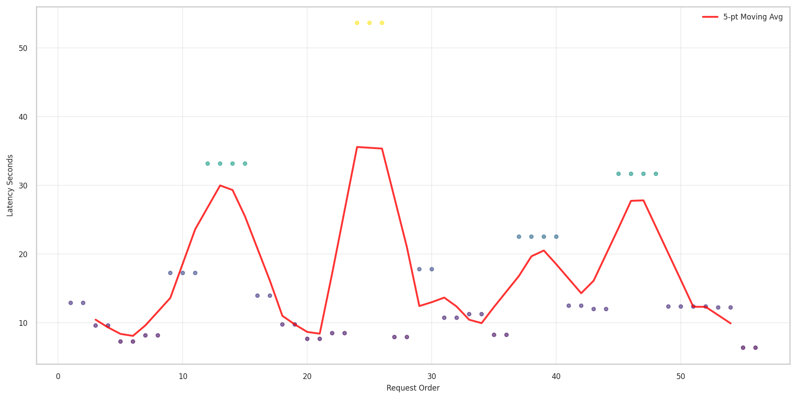](report_assets_20260309_162639/seq_agent_model_lookup_worker_1_gemini-2_5-pro_4K.png)
<br>

**Total Requests:** 63


**lookup_worker_1 via gemini-3-pro-preview Latency Sequence**<br>
**Total Requests:** 63<br>

[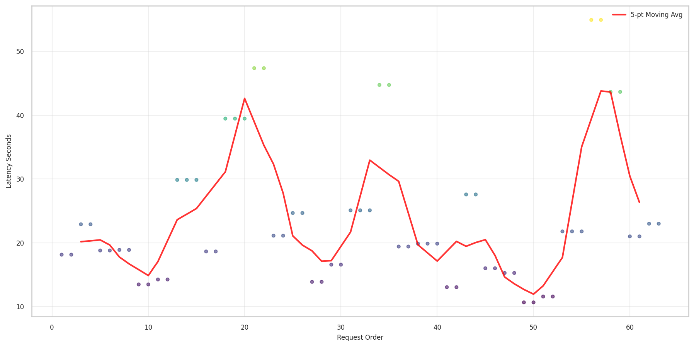](report_assets_20260309_162639/seq_agent_model_lookup_worker_1_gemini-3-pro-preview_4K.png)
<br>

**Total Requests:** 56


**lookup_worker_1 via gemini-3.1-pro-preview Latency Sequence**<br>
**Total Requests:** 56<br>

[](report_assets_20260309_162639/seq_agent_model_lookup_worker_1_gemini-3_1-pro-preview_4K.png)
<br>


#### lookup_worker_2

**Total Requests:** 84


**lookup_worker_2 via gemini-2.5-flash Latency Sequence**<br>
**Total Requests:** 84<br>

[](report_assets_20260309_162639/seq_agent_model_lookup_worker_2_gemini-2_5-flash_4K.png)
<br>

**Total Requests:** 52


**lookup_worker_2 via gemini-2.5-pro Latency Sequence**<br>
**Total Requests:** 52<br>

[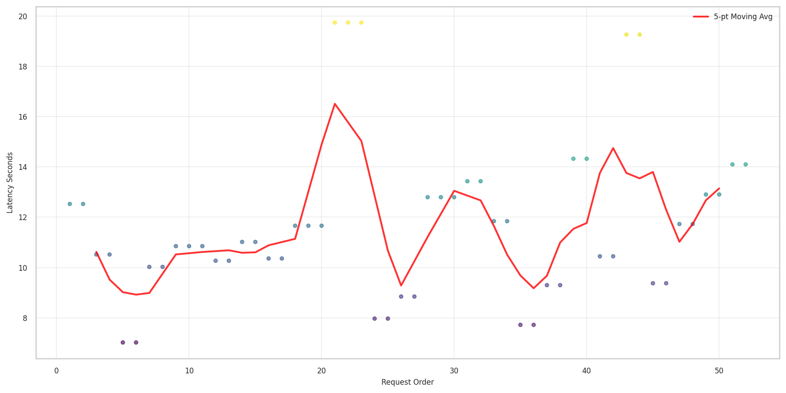](report_assets_20260309_162639/seq_agent_model_lookup_worker_2_gemini-2_5-pro_4K.png)
<br>

**Total Requests:** 56


**lookup_worker_2 via gemini-3-pro-preview Latency Sequence**<br>
**Total Requests:** 56<br>

[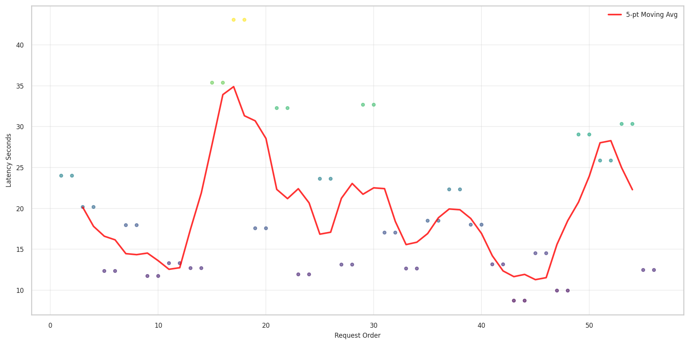](report_assets_20260309_162639/seq_agent_model_lookup_worker_2_gemini-3-pro-preview_4K.png)
<br>

**Total Requests:** 55


**lookup_worker_2 via gemini-3.1-pro-preview Latency Sequence**<br>
**Total Requests:** 55<br>

[](report_assets_20260309_162639/seq_agent_model_lookup_worker_2_gemini-3_1-pro-preview_4K.png)
<br>


#### lookup_worker_3

**Total Requests:** 87


**lookup_worker_3 via gemini-2.5-flash Latency Sequence**<br>
**Total Requests:** 87<br>

[](report_assets_20260309_162639/seq_agent_model_lookup_worker_3_gemini-2_5-flash_4K.png)
<br>

**Total Requests:** 48


**lookup_worker_3 via gemini-2.5-pro Latency Sequence**<br>
**Total Requests:** 48<br>

[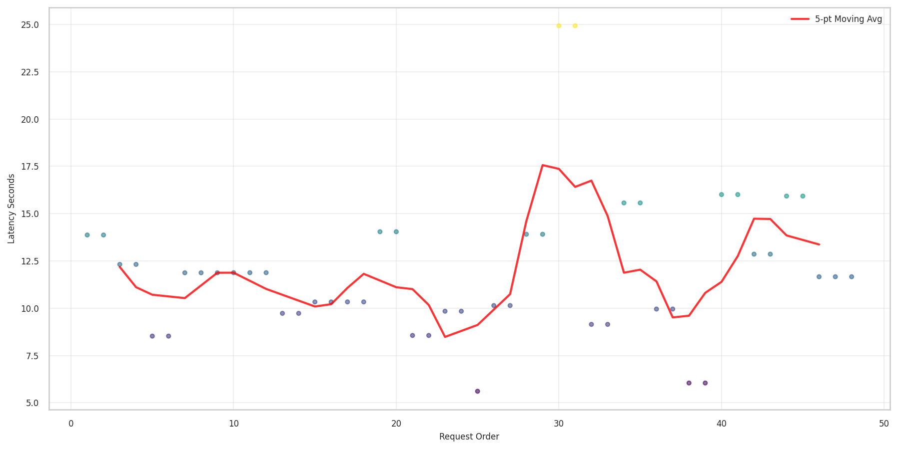](report_assets_20260309_162639/seq_agent_model_lookup_worker_3_gemini-2_5-pro_4K.png)
<br>

**Total Requests:** 60


**lookup_worker_3 via gemini-3-pro-preview Latency Sequence**<br>
**Total Requests:** 60<br>

[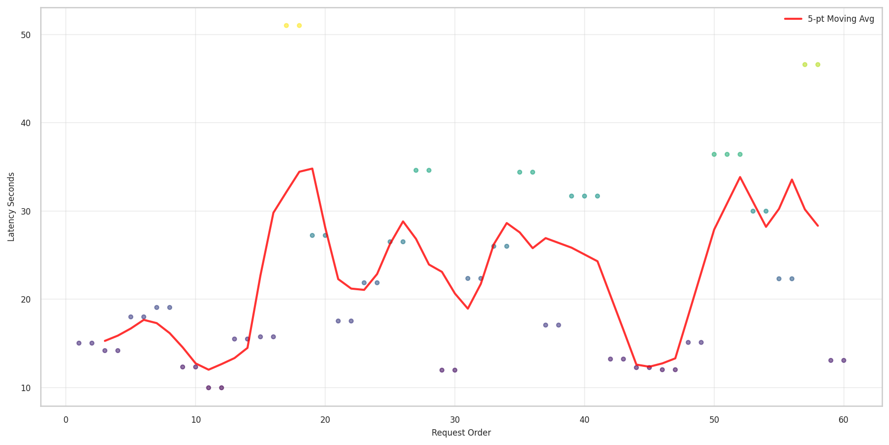](report_assets_20260309_162639/seq_agent_model_lookup_worker_3_gemini-3-pro-preview_4K.png)
<br>

**Total Requests:** 56


**lookup_worker_3 via gemini-3.1-pro-preview Latency Sequence**<br>
**Total Requests:** 56<br>

[](report_assets_20260309_162639/seq_agent_model_lookup_worker_3_gemini-3_1-pro-preview_4K.png)
<br>


#### parallel_db_lookup


#### unreliable_tool_agent

**Total Requests:** 18


**unreliable_tool_agent via gemini-2.5-flash Latency Sequence**<br>
**Total Requests:** 18<br>

[](report_assets_20260309_162639/seq_agent_model_unreliable_tool_agent_gemini-2_5-flash_4K.png)
<br>

**Total Requests:** 42


**unreliable_tool_agent via gemini-2.5-pro Latency Sequence**<br>
**Total Requests:** 42<br>

[](report_assets_20260309_162639/seq_agent_model_unreliable_tool_agent_gemini-2_5-pro_4K.png)
<br>

**Total Requests:** 23


**unreliable_tool_agent via gemini-3-pro-preview Latency Sequence**<br>
**Total Requests:** 23<br>

[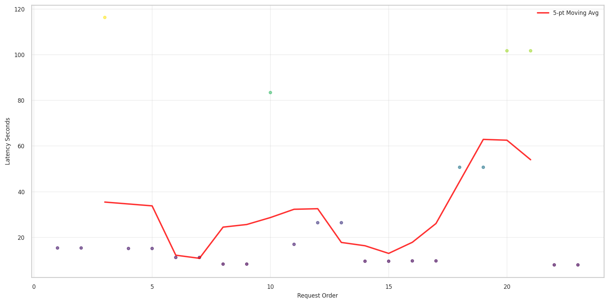](report_assets_20260309_162639/seq_agent_model_unreliable_tool_agent_gemini-3-pro-preview_4K.png)
<br>

**Total Requests:** 2


**unreliable_tool_agent via gemini-3.1-pro-preview Latency Sequence**<br>
**Total Requests:** 2<br>

[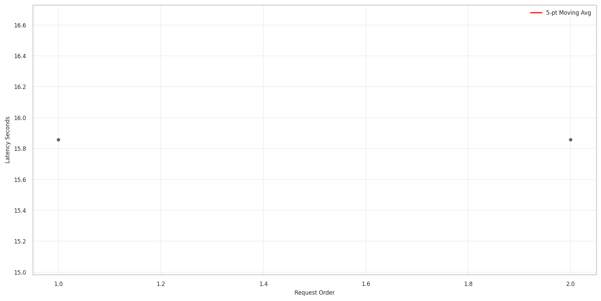](report_assets_20260309_162639/seq_agent_model_unreliable_tool_agent_gemini-3_1-pro-preview_4K.png)
<br>


### Token Usage Over Time

The charts below display the chronological token consumption (Input, Thought, Output) for each Agent-Model combination over the test run. This helps identify context window growth or token ballooning over time.


#### adk_documentation_agent

**Total Requests:** 96<br>

**adk_documentation_agent via gemini-2.5-flash Token Sequence**<br>

[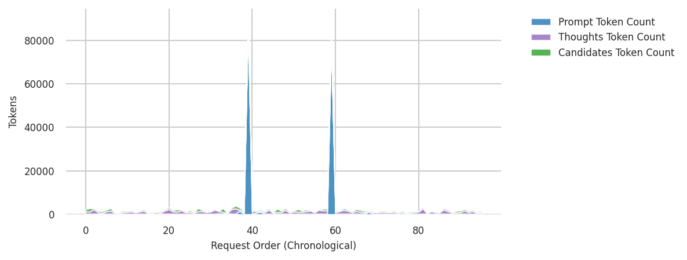](report_assets_20260309_162639/token_seq_adk_documentation_agent_gemini-2_5-flash_4K.png)
<br>

**Total Requests:** 113<br>

**adk_documentation_agent via gemini-2.5-pro Token Sequence**<br>

[](report_assets_20260309_162639/token_seq_adk_documentation_agent_gemini-2_5-pro_4K.png)
<br>

**Total Requests:** 58<br>

**adk_documentation_agent via gemini-3-pro-preview Token Sequence**<br>

[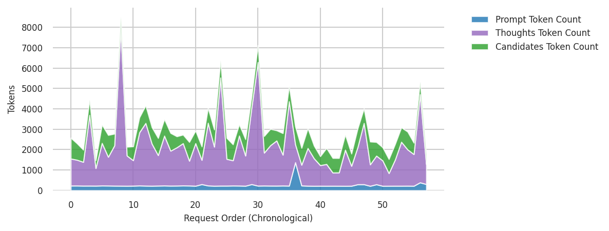](report_assets_20260309_162639/token_seq_adk_documentation_agent_gemini-3-pro-preview_4K.png)
<br>

**Total Requests:** 54<br>

**adk_documentation_agent via gemini-3.1-pro-preview Token Sequence**<br>

[](report_assets_20260309_162639/token_seq_adk_documentation_agent_gemini-3_1-pro-preview_4K.png)
<br>


#### ai_observability_agent

**Total Requests:** 50<br>

**ai_observability_agent via gemini-2.5-flash Token Sequence**<br>

[](report_assets_20260309_162639/token_seq_ai_observability_agent_gemini-2_5-flash_4K.png)
<br>

**Total Requests:** 38<br>

**ai_observability_agent via gemini-2.5-pro Token Sequence**<br>

[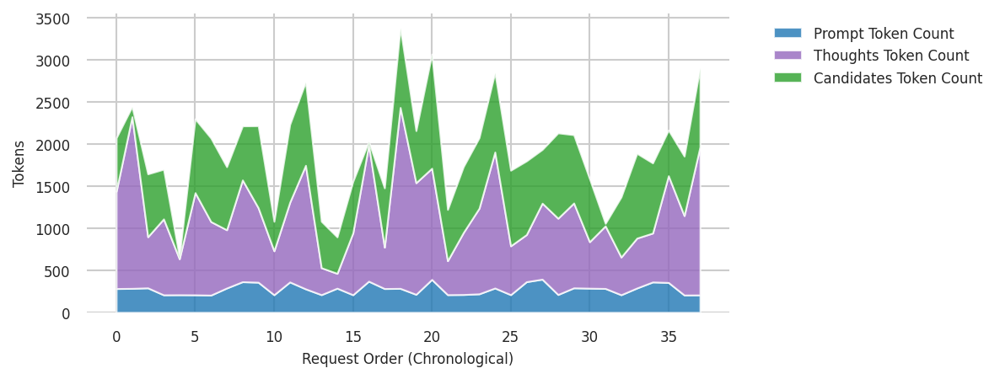](report_assets_20260309_162639/token_seq_ai_observability_agent_gemini-2_5-pro_4K.png)
<br>


#### bigquery_data_agent

**Total Requests:** 792<br>

**bigquery_data_agent via gemini-2.5-flash Token Sequence**<br>

[](report_assets_20260309_162639/token_seq_bigquery_data_agent_gemini-2_5-flash_4K.png)
<br>

**Total Requests:** 448<br>

**bigquery_data_agent via gemini-2.5-pro Token Sequence**<br>

[](report_assets_20260309_162639/token_seq_bigquery_data_agent_gemini-2_5-pro_4K.png)
<br>

**Total Requests:** 290<br>

**bigquery_data_agent via gemini-3-pro-preview Token Sequence**<br>

[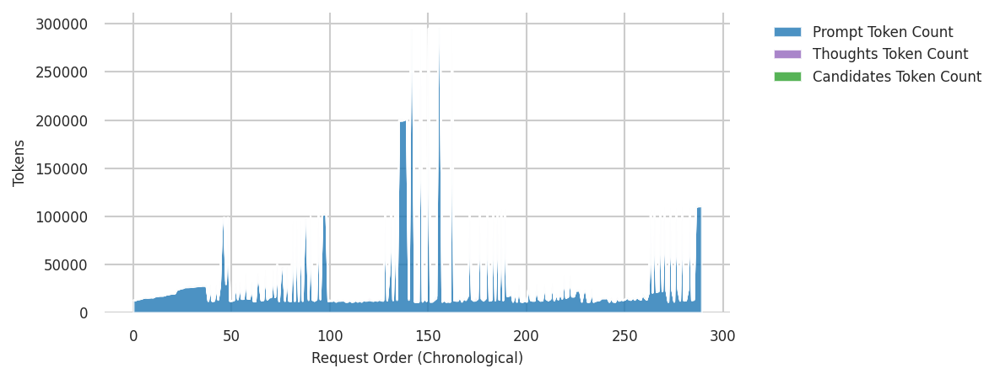](report_assets_20260309_162639/token_seq_bigquery_data_agent_gemini-3-pro-preview_4K.png)
<br>

**Total Requests:** 361<br>

**bigquery_data_agent via gemini-3.1-pro-preview Token Sequence**<br>

[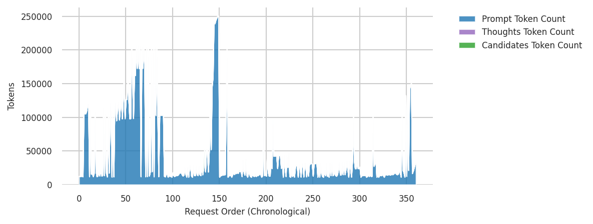](report_assets_20260309_162639/token_seq_bigquery_data_agent_gemini-3_1-pro-preview_4K.png)
<br>


#### config_test_agent_high_temp

**Total Requests:** 14<br>

**config_test_agent_high_temp via gemini-2.5-flash Token Sequence**<br>

[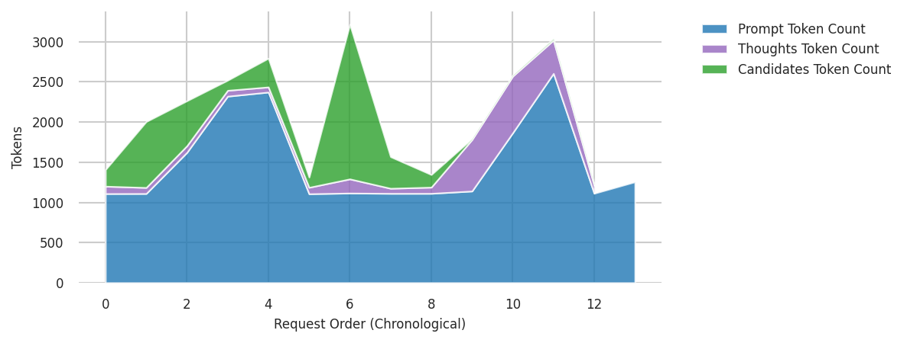](report_assets_20260309_162639/token_seq_config_test_agent_high_temp_gemini-2_5-flash_4K.png)
<br>

**Total Requests:** 9<br>

**config_test_agent_high_temp via gemini-2.5-pro Token Sequence**<br>

[](report_assets_20260309_162639/token_seq_config_test_agent_high_temp_gemini-2_5-pro_4K.png)
<br>

**Total Requests:** 10<br>

**config_test_agent_high_temp via gemini-3-pro-preview Token Sequence**<br>

[](report_assets_20260309_162639/token_seq_config_test_agent_high_temp_gemini-3-pro-preview_4K.png)
<br>

**Total Requests:** 8<br>

**config_test_agent_high_temp via gemini-3.1-pro-preview Token Sequence**<br>

[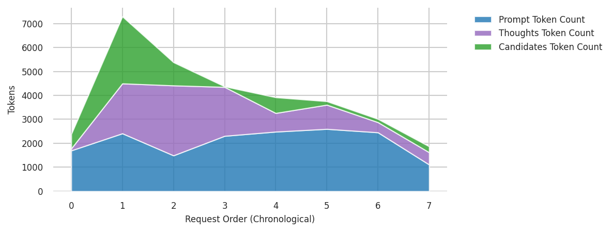](report_assets_20260309_162639/token_seq_config_test_agent_high_temp_gemini-3_1-pro-preview_4K.png)
<br>


#### config_test_agent_normal

**Total Requests:** 55<br>

**config_test_agent_normal via gemini-2.5-flash Token Sequence**<br>

[](report_assets_20260309_162639/token_seq_config_test_agent_normal_gemini-2_5-flash_4K.png)
<br>

**Total Requests:** 10<br>

**config_test_agent_normal via gemini-2.5-pro Token Sequence**<br>

[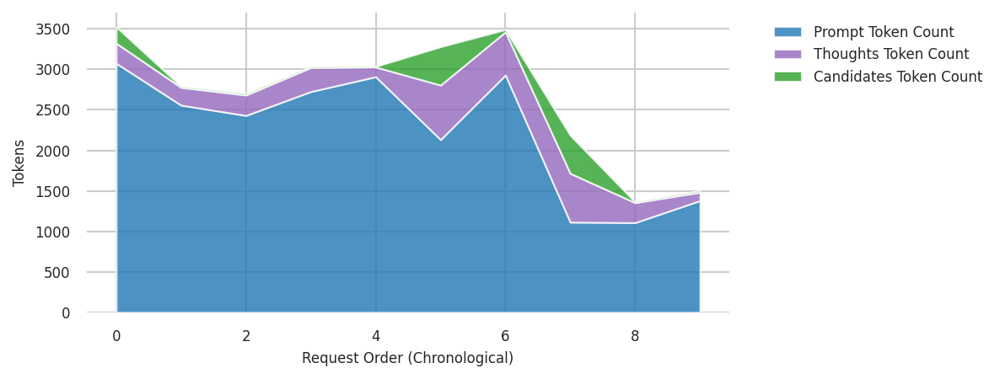](report_assets_20260309_162639/token_seq_config_test_agent_normal_gemini-2_5-pro_4K.png)
<br>

**Total Requests:** 9<br>

**config_test_agent_normal via gemini-3-pro-preview Token Sequence**<br>

[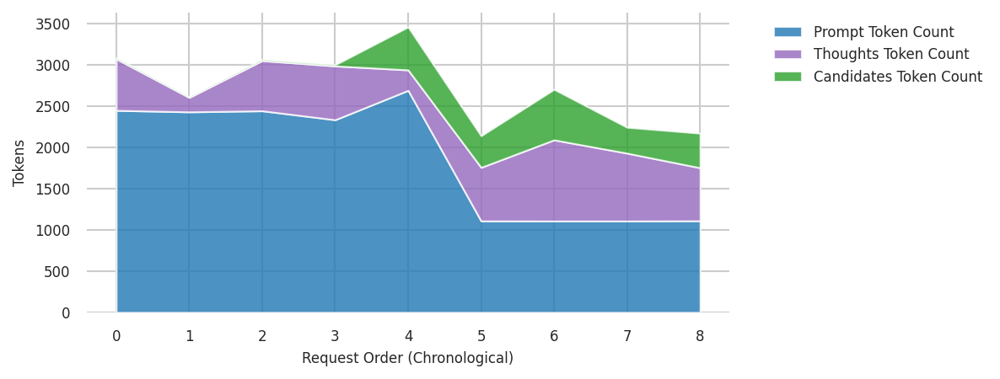](report_assets_20260309_162639/token_seq_config_test_agent_normal_gemini-3-pro-preview_4K.png)
<br>

**Total Requests:** 10<br>

**config_test_agent_normal via gemini-3.1-pro-preview Token Sequence**<br>

[](report_assets_20260309_162639/token_seq_config_test_agent_normal_gemini-3_1-pro-preview_4K.png)
<br>


#### config_test_agent_over_provisioned

**Total Requests:** 18<br>

**config_test_agent_over_provisioned via gemini-2.5-flash Token Sequence**<br>

[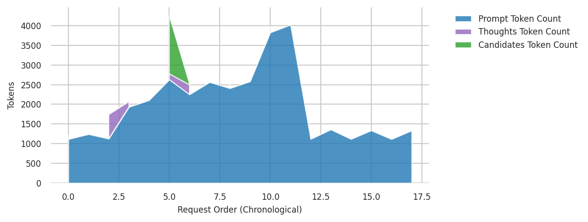](report_assets_20260309_162639/token_seq_config_test_agent_over_provisioned_gemini-2_5-flash_4K.png)
<br>

**Total Requests:** 25<br>

**config_test_agent_over_provisioned via gemini-2.5-pro Token Sequence**<br>

[](report_assets_20260309_162639/token_seq_config_test_agent_over_provisioned_gemini-2_5-pro_4K.png)
<br>

**Total Requests:** 13<br>

**config_test_agent_over_provisioned via gemini-3-pro-preview Token Sequence**<br>

[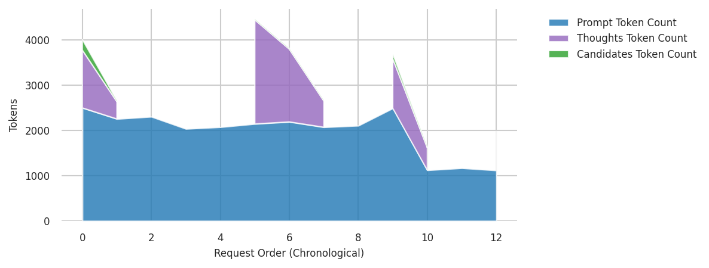](report_assets_20260309_162639/token_seq_config_test_agent_over_provisioned_gemini-3-pro-preview_4K.png)
<br>

**Total Requests:** 19<br>

**config_test_agent_over_provisioned via gemini-3.1-pro-preview Token Sequence**<br>

[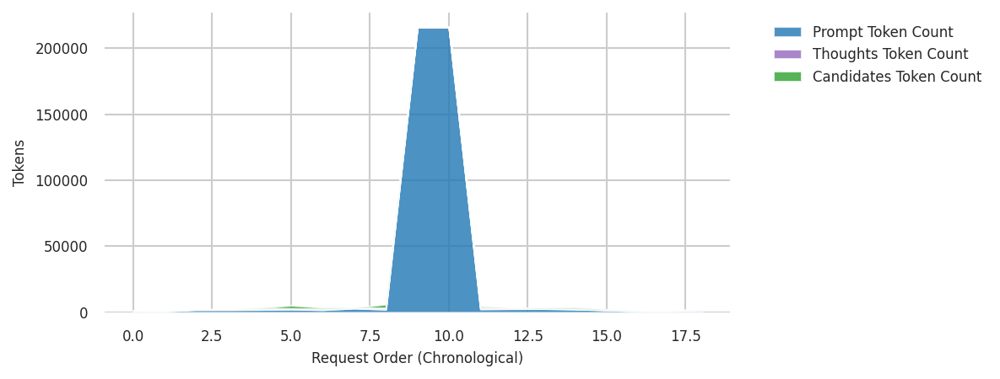](report_assets_20260309_162639/token_seq_config_test_agent_over_provisioned_gemini-3_1-pro-preview_4K.png)
<br>


#### config_test_agent_wrong_candidates

**Total Requests:** 20<br>

**config_test_agent_wrong_candidates via gemini-2.5-flash Token Sequence**<br>

[](report_assets_20260309_162639/token_seq_config_test_agent_wrong_candidates_gemini-2_5-flash_4K.png)
<br>

**Total Requests:** 13<br>

**config_test_agent_wrong_candidates via gemini-2.5-pro Token Sequence**<br>

[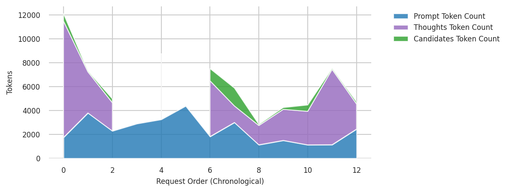](report_assets_20260309_162639/token_seq_config_test_agent_wrong_candidates_gemini-2_5-pro_4K.png)
<br>

**Total Requests:** 7<br>

**config_test_agent_wrong_candidates via gemini-3-pro-preview Token Sequence**<br>

[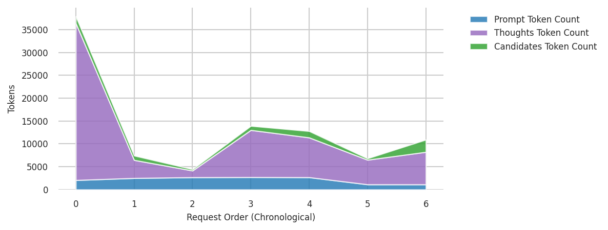](report_assets_20260309_162639/token_seq_config_test_agent_wrong_candidates_gemini-3-pro-preview_4K.png)
<br>

**Total Requests:** 9<br>

**config_test_agent_wrong_candidates via gemini-3.1-pro-preview Token Sequence**<br>

[](report_assets_20260309_162639/token_seq_config_test_agent_wrong_candidates_gemini-3_1-pro-preview_4K.png)
<br>


#### google_search_agent

**Total Requests:** 50<br>

**google_search_agent via gemini-2.5-flash Token Sequence**<br>

[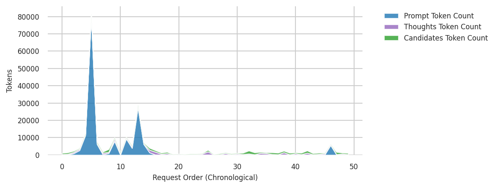](report_assets_20260309_162639/token_seq_google_search_agent_gemini-2_5-flash_4K.png)
<br>

**Total Requests:** 77<br>

**google_search_agent via gemini-2.5-pro Token Sequence**<br>

[](report_assets_20260309_162639/token_seq_google_search_agent_gemini-2_5-pro_4K.png)
<br>

**Total Requests:** 15<br>

**google_search_agent via gemini-3-pro-preview Token Sequence**<br>

[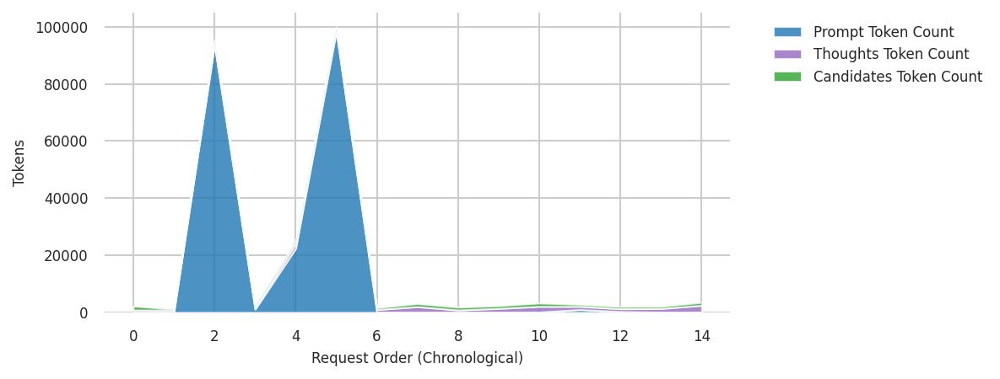](report_assets_20260309_162639/token_seq_google_search_agent_gemini-3-pro-preview_4K.png)
<br>

**Total Requests:** 20<br>

**google_search_agent via gemini-3.1-pro-preview Token Sequence**<br>

[](report_assets_20260309_162639/token_seq_google_search_agent_gemini-3_1-pro-preview_4K.png)
<br>


#### lookup_worker_1

**Total Requests:** 84<br>

**lookup_worker_1 via gemini-2.5-flash Token Sequence**<br>

[](report_assets_20260309_162639/token_seq_lookup_worker_1_gemini-2_5-flash_4K.png)
<br>

**Total Requests:** 56<br>

**lookup_worker_1 via gemini-2.5-pro Token Sequence**<br>

[](report_assets_20260309_162639/token_seq_lookup_worker_1_gemini-2_5-pro_4K.png)
<br>

**Total Requests:** 64<br>

**lookup_worker_1 via gemini-3-pro-preview Token Sequence**<br>

[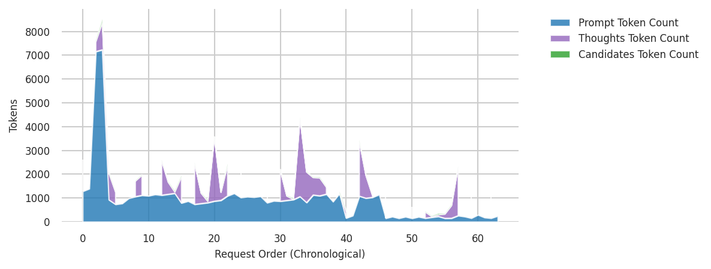](report_assets_20260309_162639/token_seq_lookup_worker_1_gemini-3-pro-preview_4K.png)
<br>

**Total Requests:** 56<br>

**lookup_worker_1 via gemini-3.1-pro-preview Token Sequence**<br>

[](report_assets_20260309_162639/token_seq_lookup_worker_1_gemini-3_1-pro-preview_4K.png)
<br>


#### lookup_worker_2

**Total Requests:** 84<br>

**lookup_worker_2 via gemini-2.5-flash Token Sequence**<br>

[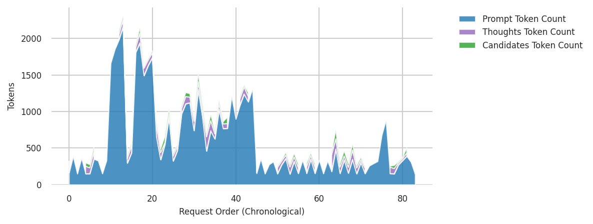](report_assets_20260309_162639/token_seq_lookup_worker_2_gemini-2_5-flash_4K.png)
<br>

**Total Requests:** 52<br>

**lookup_worker_2 via gemini-2.5-pro Token Sequence**<br>

[](report_assets_20260309_162639/token_seq_lookup_worker_2_gemini-2_5-pro_4K.png)
<br>

**Total Requests:** 59<br>

**lookup_worker_2 via gemini-3-pro-preview Token Sequence**<br>

[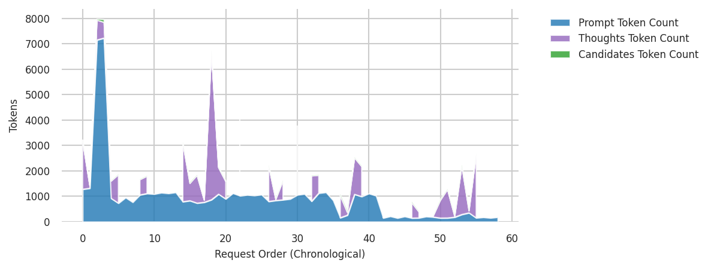](report_assets_20260309_162639/token_seq_lookup_worker_2_gemini-3-pro-preview_4K.png)
<br>

**Total Requests:** 55<br>

**lookup_worker_2 via gemini-3.1-pro-preview Token Sequence**<br>

[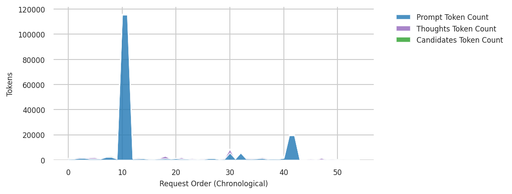](report_assets_20260309_162639/token_seq_lookup_worker_2_gemini-3_1-pro-preview_4K.png)
<br>


#### lookup_worker_3

**Total Requests:** 87<br>

**lookup_worker_3 via gemini-2.5-flash Token Sequence**<br>

[](report_assets_20260309_162639/token_seq_lookup_worker_3_gemini-2_5-flash_4K.png)
<br>

**Total Requests:** 52<br>

**lookup_worker_3 via gemini-2.5-pro Token Sequence**<br>

[](report_assets_20260309_162639/token_seq_lookup_worker_3_gemini-2_5-pro_4K.png)
<br>

**Total Requests:** 60<br>

**lookup_worker_3 via gemini-3-pro-preview Token Sequence**<br>

[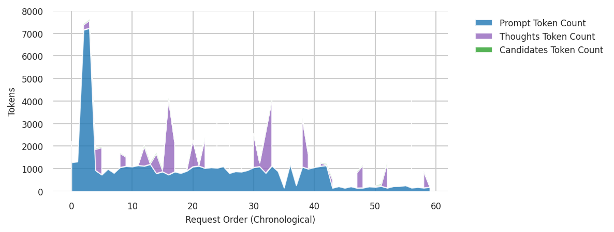](report_assets_20260309_162639/token_seq_lookup_worker_3_gemini-3-pro-preview_4K.png)
<br>

**Total Requests:** 56<br>

**lookup_worker_3 via gemini-3.1-pro-preview Token Sequence**<br>

[](report_assets_20260309_162639/token_seq_lookup_worker_3_gemini-3_1-pro-preview_4K.png)
<br>


#### unreliable_tool_agent

**Total Requests:** 24<br>

**unreliable_tool_agent via gemini-2.5-flash Token Sequence**<br>

[](report_assets_20260309_162639/token_seq_unreliable_tool_agent_gemini-2_5-flash_4K.png)
<br>

**Total Requests:** 67<br>

**unreliable_tool_agent via gemini-2.5-pro Token Sequence**<br>

[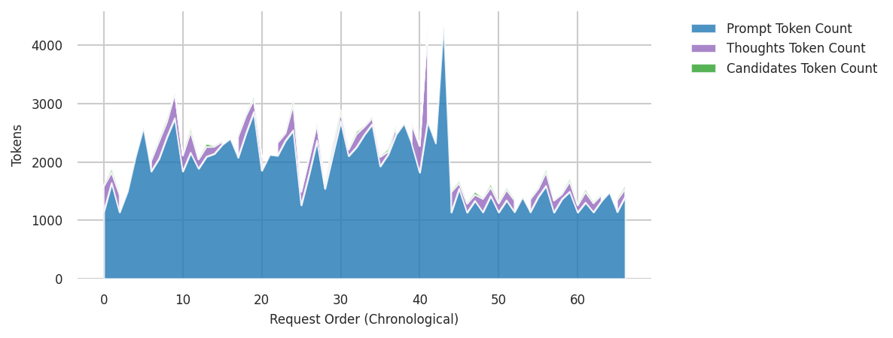](report_assets_20260309_162639/token_seq_unreliable_tool_agent_gemini-2_5-pro_4K.png)
<br>

**Total Requests:** 26<br>

**unreliable_tool_agent via gemini-3-pro-preview Token Sequence**<br>

[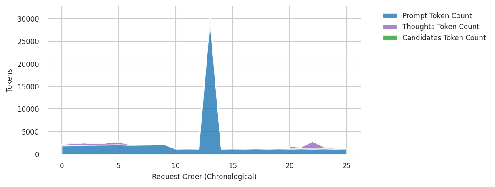](report_assets_20260309_162639/token_seq_unreliable_tool_agent_gemini-3-pro-preview_4K.png)
<br>


## Report Parameters

```json
{
  "config": {
    "playbook": "overview",
    "data_retrieval": {
      "time_period": "all",
      "num_slowest_queries": 50,
      "num_error_queries": 200,
      "num_empty_llm_responses": 20,
      "num_queries_to_analyze_rca": 5
    },
    "data_presentation": {
      "chart_scale": 0.5,
      "max_column_width_chars": 250,
      "num_error_queries": 5,
      "num_slowest_queries": 5
    },
    "kpis": {
      "end_to_end": {
        "latency_target": 10.0,
        "percentile_target": 95.5,
        "error_target": 5.0
      },
      "agent": {
        "latency_target": 8.0,
        "percentile_target": 95.5,
        "error_target": 5.0
      },
      "llm": {
        "latency_target": 5.0,
        "percentile_target": 95.5,
        "error_target": 5.0
      },
      "tool": {
        "latency_target": 3.0,
        "percentile_target": 95.5,
        "error_target": 5.0
      }
    }
  },
  "queries": [
    "Some additional instructions to add to the prompt."
  ]
}
```

---

## Configuration
```json
{
  "time_period": "all",
  "baseline_period": "7d",
  "bucket_size": "1d",
  "playbook": "overview",
  "kpis": {
    "end_to_end": {
      "latency_target": 10.0,
      "percentile_target": 95.5,
      "error_target": 5.0
    },
    "agent": {
      "latency_target": 8.0,
      "percentile_target": 95.5,
      "error_target": 5.0
    },
    "llm": {
      "latency_target": 5.0,
      "percentile_target": 95.5,
      "error_target": 5.0
    },
    "tool": {
      "latency_target": 3.0,
      "percentile_target": 95.5,
      "error_target": 5.0
    }
  },
  "data_retrieval": {
    "time_period": "all",
    "num_slowest_queries": 50,
    "num_error_queries": 200,
    "num_empty_llm_responses": 20,
    "num_queries_to_analyze_rca": 5
  },
  "data_presentation": {
    "chart_scale": 0.5,
    "max_column_width_chars": 250,
    "num_error_queries": 5,
    "num_slowest_queries": 5
  },
  "report_timestamp": "20260309_162639"
}
```


---
**Report Generation Time:** 441.68 seconds
