# Agents Observability Report

| **Property**        | **Value**                 |
|:--------------------|:--------------------------|
| **Project ID**      | `agent-operations-ek-05`  |
| **Playbook**        | `overview`                |
| **Time Range**      | `all`                     |
| **Analysis Window** | `All Available History`   |
| **Datastore ID**    | `logging`                 |
| **Table ID**        | `agent_events_demo_v2`    |
| **Generated**       | `2026-03-10 06:48:57 UTC` |
| **Agent Version**   | `0.0.3`                   |

---
<!-- TOC -->
* [Agents Observability Report](#agents-observability-report)
  * [Executive Summary](#executive-summary)
  * [Performance](#performance)
    * [End to End](#end-to-end)
    * [Agent Level](#agent-level)
    * [Tool Level](#tool-level)
    * [Model Level](#model-level)
  * [Agent Details](#agent-details)
    * [Root Agents Summary](#root-agents-summary)
    * [Sub-Agents Summary](#sub-agents-summary)
    * [Distribution](#distribution)
    * [Model Traffic](#model-traffic)
    * [Model Performance (Agent End-to-End)](#model-performance-agent-end-to-end)
    * [LLM Generation Performance](#llm-generation-performance)
    * [Agent Overhead Analysis](#agent-overhead-analysis)
      * [Overhead Data Summary](#overhead-data-summary)
    * [Agent Execution Latency (Request Order)](#agent-execution-latency-request-order)
    * [Token Statistics](#token-statistics)
  * [Tool Details](#tool-details)
    * [Tool Summaries](#tool-summaries)
    * [Distribution](#distribution-1)
  * [Model Details](#model-details)
    * [Model Summaries](#model-summaries)
    * [Distribution](#distribution-2)
    * [Model Performance](#model-performance)
    * [Model Latency Sequences](#model-latency-sequences)
    * [Token Statistics](#token-statistics-1)
    * [Token Usage Breakdown per Model](#token-usage-breakdown-per-model)
    * [Requests Distribution](#requests-distribution)
  * [System Bottlenecks & Impact](#system-bottlenecks--impact)
    * [Slowest Invocations](#slowest-invocations)
    * [Slowest Agent queries](#slowest-agent-queries)
    * [Slowest LLM queries](#slowest-llm-queries)
    * [Slowest Tools Queries](#slowest-tools-queries)
  * [Error Analysis](#error-analysis)
    * [Root Errors](#root-errors)
    * [Agent Errors](#agent-errors)
    * [Tool Errors](#tool-errors)
    * [LLM Errors](#llm-errors)
  * [Empty LLM Responses](#empty-llm-responses)
    * [Summary](#summary)
    * [Details](#details)
  * [Root Cause Insights](#root-cause-insights)
  * [Hypothesis Testing: Latency & Tokens](#hypothesis-testing-latency--tokens)
  * [Recommendations](#recommendations)
    * [Holistic Cross-Section Analysis](#holistic-cross-section-analysis)
  * [Critical Workflow Failures](#critical-workflow-failures)
  * [Architectural Recommendations](#architectural-recommendations)
* [Appendix](#appendix)
    * [Agent Latency (By Model)](#agent-latency-by-model)
    * [Token Usage Over Time](#token-usage-over-time)
  * [Report Parameters](#report-parameters)
<!-- TOC -->

## Executive Summary


The system's health is critically compromised, with the sole root agent `knowledge_qa_supervisor` exhibiting a 43.55% error rate and a mean latency of 30.8s, massively breaching the 5% error and 10s latency targets. These top-level failures are symptomatic of cascading issues across all layers. The primary drivers are severe agent unreliability and performance degradation. `ai_observability_agent` (87.85% error) and `bigquery_data_agent` (66.27% error) are the worst offenders, suffering from misconfigurations (non-existent datastores, quota exhaustion) and consistent LLM tool-name hallucinations. A major contributor to the high error rate is a systemic orchestration failure, where 100% of root errors are `TIMEOUT`s due to agents remaining in a PENDING state, indicating worker pool saturation or scheduling deadlocks. Furthermore, extreme latency is driven not by model or tool execution, but by massive agent code overhead (up to 203s in `config_test_agent_normal`) and LLM 'thought bloat' where models generate excessive internal thought tokens before responding.


---


## Performance


Overall system performance is rated '🔴' (Critical). The end-to-end workflow `knowledge_qa_supervisor` is in a '🔴' state, failing both latency (P95.5 of 88.3s vs 10s target) and error rate (43.55% vs 5.0% target) SLOs. At the sub-level, every single agent has a '🔴' Overall status due to missing latency targets. All models are also in a '🔴' state, failing either latency or error rate targets.

This section provides a high-level scorecard for End to End, Sub Agent, Tool, and LLM levels, assessing compliance against defined Service Level Objectives (SLOs).


---


### End to End


The single root agent, `knowledge_qa_supervisor`, is performing critically poorly. It processed 1929 requests with a mean latency of 30.8s and a P95.5 latency of 88.357s, far exceeding the 10s target. Its error rate is an alarming 43.55%, drastically missing the 5% target.

This shows user-facing performance from start to end of an invocation.

| **Name**                    |   **Requests** | **%**   |   **Mean (s)** |   **P95.5 (s)** |   **Target (s)** | **Status**   |   **Err %** |   **Target (%)** | **Status**   | **Input Tok (Avg/P95)**   | **Output Tok (Avg/P95)**   | **Thought Tok (Avg/P95)**   | **Tokens Consumed (Avg/P95)**   | **Overall**   |
|:----------------------------|---------------:|:--------|---------------:|----------------:|-----------------:|:-------------|------------:|-----------------:|:-------------|:--------------------------|:---------------------------|:----------------------------|:--------------------------------|:--------------|
| **knowledge_qa_supervisor** |           1929 | 100.0%  |           30.8 |          88.357 |               10 | 🔴           |       43.55 |                5 | 🔴           | 20151 / 106880            | 109 / 709                  | 416 / 1366                  | 20706 / 107393                  | 🔴            |

<br>


**Root Agent Execution**

The following charts display the end-to-end execution latency for each top-level Root Agent over the course of the test run, plotted in the order the requests were received. This helps identify degradation in overall system performance over time.


**knowledge_qa_supervisor Latency (Request Order)**<br>

[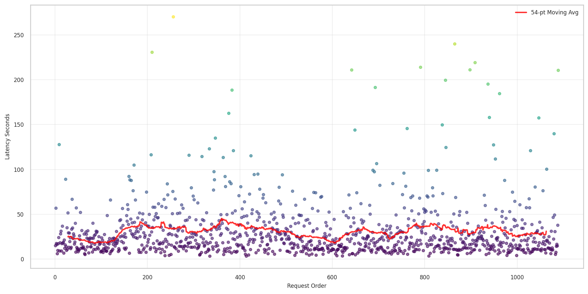](report_assets_20260310_064740/e2e_sequence_knowledge_qa_supervisor_4K.png)
<br>

**knowledge_qa_supervisor Latency Histogram**<br>

[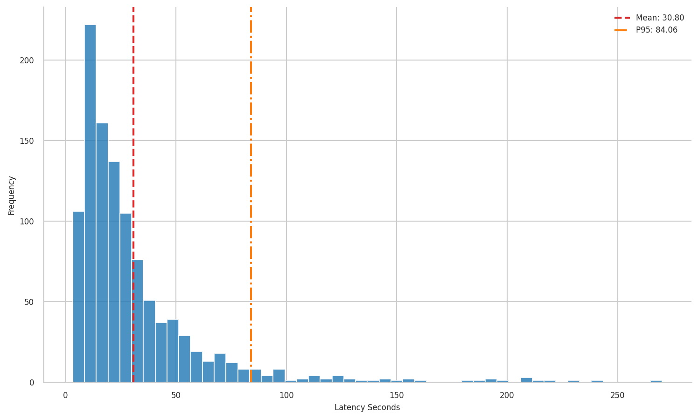](report_assets_20260310_064740/e2e_histogram_knowledge_qa_supervisor_4K.png)
<br>


---


### Agent Level


Agent-level performance is catastrophic. Every agent is in a 🔴 state for latency. Several agents have critical error rates: `config_test_agent_wrong_max_tokens` has a **100% Error Rate** across 111 requests due to a model configuration error. `ai_observability_agent` is the most used agent (724 requests) but has an **87.85% Error Rate**. `bigquery_data_agent`, the second most used agent (673 requests), has a **66.27% Error Rate**. `unreliable_tool_agent` shows a **33.82% Error Rate**. The slowest agents are `config_test_agent_normal` (mean latency 70.8s) and `bigquery_data_agent` (mean latency 47.1s), both massively over the 8s target.

| Name                                   |   Requests | %     | Mean (s)   | P95.5 (s)   |   Target (s) | Status   |   Err % |   Target (%) | Err Status   | Overall   |
|:---------------------------------------|-----------:|:------|:-----------|:------------|-------------:|:---------|--------:|-------------:|:-------------|:----------|
| **config_test_agent_normal**           |         83 | 3.0%  | 70.832     | 220.386     |            8 | 🔴       |    0    |            5 | 🟢           | 🔴        |
| **bigquery_data_agent**                |        673 | 24.0% | 47.088     | 144.883     |            8 | 🔴       |   66.27 |            5 | 🔴           | 🔴        |
| **config_test_agent_wrong_candidates** |         39 | 1.4%  | 32.642     | 83.928      |            8 | 🔴       |    0    |            5 | 🟢           | 🔴        |
| **adk_documentation_agent**            |        373 | 13.3% | 26.856     | 66.41       |            8 | 🔴       |   13.94 |            5 | 🔴           | 🔴        |
| **unreliable_tool_agent**              |         68 | 2.4%  | 19.377     | 101.719     |            8 | 🔴       |   33.82 |            5 | 🔴           | 🔴        |
| **google_search_agent**                |        163 | 5.8%  | 19.318     | 45.503      |            8 | 🔴       |    0    |            5 | 🟢           | 🔴        |
| **parallel_db_lookup**                 |        123 | 4.4%  | 18.909     | 44.752      |            8 | 🔴       |    3.25 |            5 | 🟢           | 🔴        |
| **ai_observability_agent**             |        724 | 25.8% | 17.671     | 34.271      |            8 | 🔴       |   87.85 |            5 | 🔴           | 🔴        |
| **config_test_agent_high_temp**        |         37 | 1.3%  | 17.202     | 58.117      |            8 | 🔴       |    0    |            5 | 🟢           | 🔴        |
| **config_test_agent_over_provisioned** |         46 | 1.6%  | 16.594     | 50.294      |            8 | 🔴       |    4.35 |            5 | 🟢           | 🔴        |
| **lookup_worker_1**                    |        123 | 4.4%  | 15.719     | 43.665      |            8 | 🔴       |    1.63 |            5 | 🟢           | 🔴        |
| **lookup_worker_3**                    |        123 | 4.4%  | 14.539     | 31.704      |            8 | 🔴       |    2.44 |            5 | 🟢           | 🔴        |
| **lookup_worker_2**                    |        123 | 4.4%  | 14.094     | 30.333      |            8 | 🔴       |    2.44 |            5 | 🟢           | 🔴        |
| **config_test_agent_wrong_max_tokens** |        111 | 4.0%  | -          | -           |            8 | ⚪       |  100    |            5 | 🔴           | 🔴        |

<br>

**Agent Level Usage**<br>

[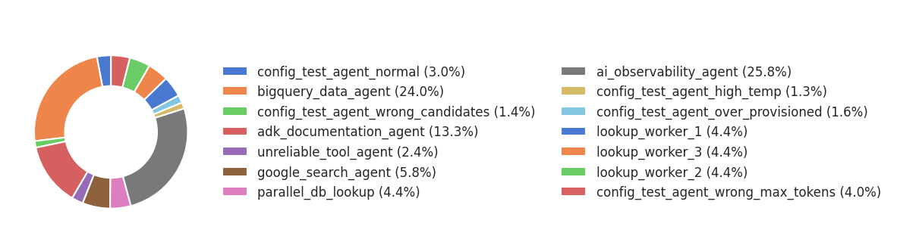](report_assets_20260310_064740/agent__usage_4K.png)
<br>

**Agent Level Latency (Target: 8.0s)**<br>

[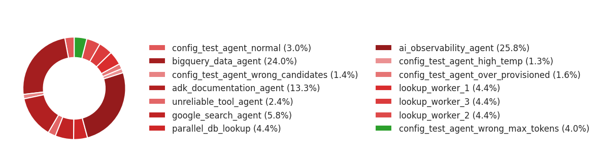](report_assets_20260310_064740/agent__lat_status_4K.png)
<br>

**Agent Level Error (Target: 5.0%)**<br>

[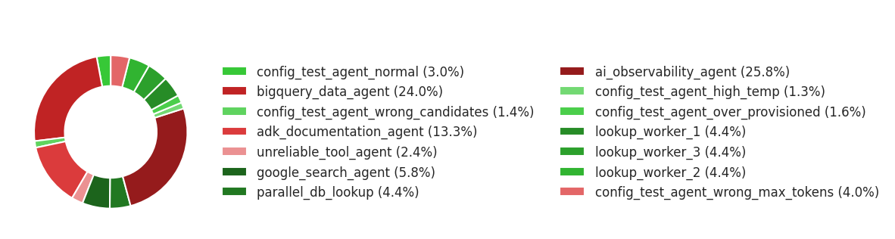](report_assets_20260310_064740/agent__err_status_4K.png)
<br>


---


### Tool Level


Tool-level errors are a significant contributor to agent failures. `flaky_tool_simulation` has a high error rate of 17.46%, impacting its parent agent. More critically, several tools show a 100% error rate, including `search_web`, `list_tables`, and `search_adk_docs`, often due to LLM hallucination where an agent calls a non-existent tool. The slowest successful tool is `complex_calculation` with a mean latency of 2.008s, which is within its 3.0s target.

| Name                      |   Requests | %     | Mean (s)   | P95.5 (s)   |   Target (s) | Status   |   Err % |   Target (%) | Err Status   | Overall   |
|:--------------------------|-----------:|:------|:-----------|:------------|-------------:|:---------|--------:|-------------:|:-------------|:----------|
| **complex_calculation**   |         48 | 2.2%  | 2.008      | 2.866       |            3 | 🟢       |    0    |            5 | 🟢           | 🟢        |
| **flaky_tool_simulation** |         63 | 2.8%  | 1.177      | 1.897       |            3 | 🟢       |   17.46 |            5 | 🔴           | 🔴        |
| **execute_sql**           |        757 | 34.1% | 0.729      | 1.338       |            3 | 🟢       |    0    |            5 | 🟢           | 🟢        |
| **simulated_db_lookup**   |        819 | 36.9% | 0.599      | 0.963       |            3 | 🟢       |    0    |            5 | 🟢           | 🟢        |
| **list_dataset_ids**      |         73 | 3.3%  | 0.31       | 0.243       |            3 | 🟢       |    0    |            5 | 🟢           | 🟢        |
| **get_dataset_info**      |          3 | 0.1%  | 0.223      | 0.282       |            3 | 🟢       |    0    |            5 | 🟢           | 🟢        |
| **list_table_ids**        |        167 | 7.5%  | 0.163      | 0.277       |            3 | 🟢       |    0    |            5 | 🟢           | 🟢        |
| **get_table_info**        |        278 | 12.5% | 0.152      | 0.199       |            3 | 🟢       |    0    |            5 | 🟢           | 🟢        |
| **ask_data_insights**     |          4 | 0.2%  | 0.059      | 0.072       |            3 | 🟢       |    0    |            5 | 🟢           | 🟢        |
| **detect_anomalies**      |          2 | 0.1%  | 0.0        | 0.001       |            3 | 🟢       |    0    |            5 | 🟢           | 🟢        |
| **search_web**            |          3 | 0.1%  | -          | -           |            3 | ⚪       |  100    |            5 | 🔴           | 🔴        |
| **list_tables**           |          2 | 0.1%  | -          | -           |            3 | ⚪       |  100    |            5 | 🔴           | 🔴        |
| **search_adk_docs**       |          1 | 0.0%  | -          | -           |            3 | ⚪       |  100    |            5 | 🔴           | 🔴        |
| **send_handoff_response** |          1 | 0.0%  | -          | -           |            3 | ⚪       |  100    |            5 | 🔴           | 🔴        |
| **vertex_ai_search**      |          1 | 0.0%  | -          | -           |            3 | ⚪       |  100    |            5 | 🔴           | 🔴        |

<br>

**Tool Level Usage**<br>

[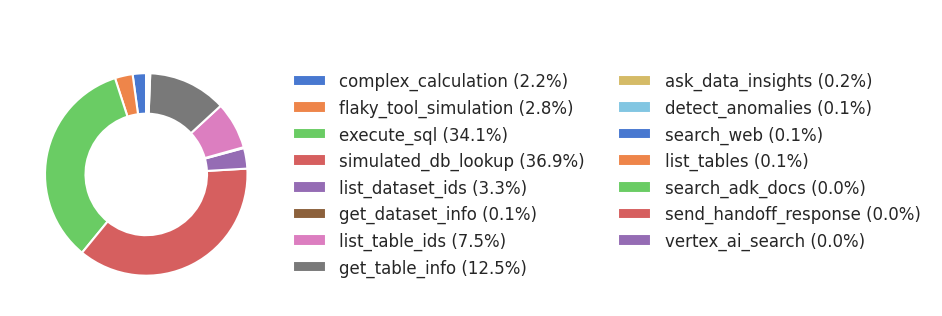](report_assets_20260310_064740/tool__usage_4K.png)
<br>

**Tool Level Latency (Target: 3.0s)**<br>

[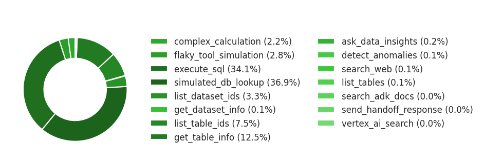](report_assets_20260310_064740/tool__lat_status_4K.png)
<br>

**Tool Level Error (Target: 5.0%)**<br>

[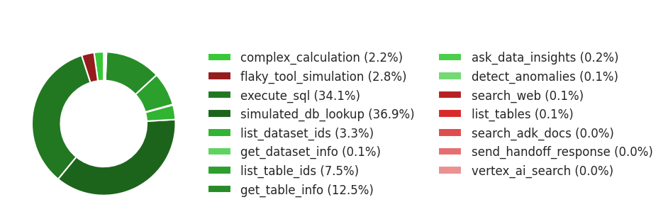](report_assets_20260310_064740/tool__err_status_4K.png)
<br>


---


### Model Level


All models are in a '🔴' Overall state. The most used model is `gemini-2.5-flash` (2708 requests), which is also the fastest (mean latency 3.64s) but still misses its P95.5 latency target. `gemini-2.5-pro` is the second most used (1832 requests) but has the highest error rate at 11.08%. The slowest models are `gemini-3-pro-preview` (mean latency 11.6s) and `gemini-3.1-pro-preview` (mean latency 11.5s), both more than double the 5s target.

| Name                       |   Requests | %     |   Mean (s) |   P95.5 (s) |   Target (s) | Status   |   Err % |   Target (%) | Err Status   | Input Tok (Avg/P95)   | Output Tok (Avg/P95)   | Thought Tok (Avg/P95)   | Tokens Consumed (Avg/P95)   | Overall   |
|:---------------------------|-----------:|:------|-----------:|------------:|-------------:|:---------|--------:|-------------:|:-------------|:----------------------|:-----------------------|:------------------------|:----------------------------|:----------|
| **gemini-3-pro-preview**   |        985 | 15.2% |     11.644 |      35.98  |            5 | 🔴       |    9.24 |            5 | 🔴           | 13505 / 96469         | 118 / 760              | 706 / 2215              | 14275 / 96871               | 🔴        |
| **gemini-3.1-pro-preview** |        975 | 15.0% |     11.514 |      46.902 |            5 | 🔴       |    6.56 |            5 | 🔴           | 23180 / 126689        | 140 / 700              | 600 / 2585              | 23920 / 126826              | 🔴        |
| **gemini-2.5-pro**         |       1832 | 28.2% |      7.166 |      23.488 |            5 | 🔴       |   11.08 |            5 | 🔴           | 19315 / 108417        | 138 / 844              | 381 / 1225              | 19914 / 108864              | 🔴        |
| **gemini-2.5-flash**       |       2708 | 41.7% |      3.642 |      10.765 |            5 | 🔴       |    8.35 |            5 | 🔴           | 21982 / 104493        | 76 / 442               | 270 / 853               | 22362 / 104718              | 🔴        |

<br>

**Model Level Usage**<br>

[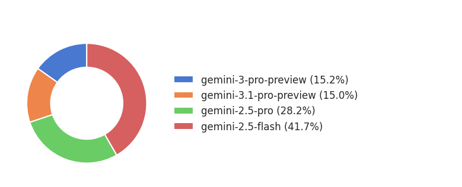](report_assets_20260310_064740/model__usage_4K.png)
<br>

**Model Level Latency (Target: 5.0s)**<br>

[](report_assets_20260310_064740/model__lat_status_4K.png)
<br>

**Model Level Error (Target: 5.0%)**<br>

[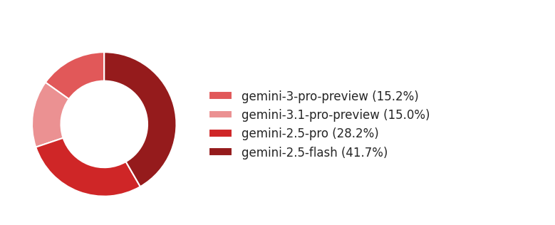](report_assets_20260310_064740/model__err_status_4K.png)
<br>


---


## Agent Details


The `knowledge_qa_supervisor` and `bigquery_data_agent` are the primary drivers of model traffic, together accounting for over 50% of all LLM calls. They heavily utilize `gemini-2.5-flash` (48% and 41% of their calls, respectively). This indicates that optimizations for these two agents and their interaction with `gemini-2.5-flash` would have the largest system-wide impact.


### Root Agents Summary

A high-level cross-report summary for each root workflow.


**`knowledge_qa_supervisor`**
- **Requests:** 1929 (100.0%)
- **Status:** 🔴 Overall (Lat: 🔴, Err: 🔴)
- **Latency (Mean / P95.5):** 30.8s / 88.357s
- **Errors:** 43.55%
- **Total Tokens (Avg/P95.5):** 20706 / 107393
- **Input:** 20151 / 106880 | **Output:** 109 / 709 | **Thought:** 416 / 1366


### Sub-Agents Summary

A high-level cross-report summary for each sub-agent.


**`config_test_agent_normal`**
- **Requests:** 83 (3.0%)
- **Status:** 🔴 Overall (Lat: 🔴, Err: 🟢)
- **Latency (Mean / P95.5):** 70.832s / 220.386s
- **Errors:** 0.0%
- **Total Tokens (Avg/P95.5):** 8927 / 18523
- **Input:** 8486 / 18182 | **Output:** 90 / 490 | **Thought:** 349 / 653


**`bigquery_data_agent`**
- **Requests:** 673 (24.0%)
- **Status:** 🔴 Overall (Lat: 🔴, Err: 🔴)
- **Latency (Mean / P95.5):** 47.088s / 144.883s
- **Errors:** 66.27%
- **Total Tokens (Avg/P95.5):** 47676 / 115333
- **Input:** 47276 / 114376 | **Output:** 65 / 165 | **Thought:** 334 / 971


**`config_test_agent_wrong_candidates`**
- **Requests:** 39 (1.4%)
- **Status:** 🔴 Overall (Lat: 🔴, Err: 🟢)
- **Latency (Mean / P95.5):** 32.642s / 83.928s
- **Errors:** 0.0%
- **Total Tokens (Avg/P95.5):** 8015 / 20971
- **Input:** 2023 / 3693 | **Output:** 828 / 2505 | **Thought:** 5884 / 17050


**`adk_documentation_agent`**
- **Requests:** 373 (13.3%)
- **Status:** 🔴 Overall (Lat: 🔴, Err: 🔴)
- **Latency (Mean / P95.5):** 26.856s / 66.41s
- **Errors:** 13.94%
- **Total Tokens (Avg/P95.5):** 4173 / 5349
- **Input:** 1586 / 526 | **Output:** 602 / 1122 | **Thought:** 1452 / 3223


**`unreliable_tool_agent`**
- **Requests:** 68 (2.4%)
- **Status:** 🔴 Overall (Lat: 🔴, Err: 🔴)
- **Latency (Mean / P95.5):** 19.377s / 101.719s
- **Errors:** 33.82%
- **Total Tokens (Avg/P95.5):** 2194 / 2890
- **Input:** 1942 / 2659 | **Output:** 30 / 64 | **Thought:** 277 / 1014


**`google_search_agent`**
- **Requests:** 163 (5.8%)
- **Status:** 🔴 Overall (Lat: 🔴, Err: 🟢)
- **Latency (Mean / P95.5):** 19.318s / 45.503s
- **Errors:** 0.0%
- **Total Tokens (Avg/P95.5):** 11231 / 99923
- **Input:** 9594 / 98454 | **Output:** 757 / 1326 | **Thought:** 674 / 1806


**`parallel_db_lookup`**
- **Requests:** 123 (4.4%)
- **Status:** 🔴 Overall (Lat: 🔴, Err: 🟢)
- **Latency (Mean / P95.5):** 18.909s / 44.752s
- **Errors:** 3.25%
- **Total Tokens (Avg/P95.5):** -
- **Input:** - | **Output:** - | **Thought:** -


**`ai_observability_agent`**
- **Requests:** 724 (25.8%)
- **Status:** 🔴 Overall (Lat: 🔴, Err: 🔴)
- **Latency (Mean / P95.5):** 17.671s / 34.271s
- **Errors:** 87.85%
- **Total Tokens (Avg/P95.5):** 2166 / 4000
- **Input:** 278 / 379 | **Output:** 514 / 1014 | **Thought:** 862 / 2039


**`config_test_agent_high_temp`**
- **Requests:** 37 (1.3%)
- **Status:** 🔴 Overall (Lat: 🔴, Err: 🟢)
- **Latency (Mean / P95.5):** 17.202s / 58.117s
- **Errors:** 0.0%
- **Total Tokens (Avg/P95.5):** 2874 / 5380
- **Input:** 1799 / 2727 | **Output:** 483 / 1925 | **Thought:** 606 / 2043


**`config_test_agent_over_provisioned`**
- **Requests:** 46 (1.6%)
- **Status:** 🔴 Overall (Lat: 🔴, Err: 🟢)
- **Latency (Mean / P95.5):** 16.594s / 50.294s
- **Errors:** 4.35%
- **Total Tokens (Avg/P95.5):** 8025 / 5325
- **Input:** 7492 / 3827 | **Output:** 191 / 1129 | **Thought:** 406 / 1091


**`lookup_worker_1`**
- **Requests:** 123 (4.4%)
- **Status:** 🔴 Overall (Lat: 🔴, Err: 🟢)
- **Latency (Mean / P95.5):** 15.719s / 43.665s
- **Errors:** 1.63%
- **Total Tokens (Avg/P95.5):** 2204 / 3429
- **Input:** 1832 / 2257 | **Output:** 47 / 86 | **Thought:** 408 / 1458


**`lookup_worker_3`**
- **Requests:** 123 (4.4%)
- **Status:** 🔴 Overall (Lat: 🔴, Err: 🟢)
- **Latency (Mean / P95.5):** 14.539s / 31.704s
- **Errors:** 2.44%
- **Total Tokens (Avg/P95.5):** 2151 / 3276
- **Input:** 1818 / 1968 | **Output:** 47 / 87 | **Thought:** 368 / 1347


**`lookup_worker_2`**
- **Requests:** 123 (4.4%)
- **Status:** 🔴 Overall (Lat: 🔴, Err: 🟢)
- **Latency (Mean / P95.5):** 14.094s / 30.333s
- **Errors:** 2.44%
- **Total Tokens (Avg/P95.5):** 2183 / 3145
- **Input:** 1816 / 1983 | **Output:** 42 / 82 | **Thought:** 385 / 1411


**`config_test_agent_wrong_max_tokens`**
- **Requests:** 111 (4.0%)
- **Status:** 🔴 Overall (Lat: ⚪, Err: 🔴)
- **Latency (Mean / P95.5):** -s / -s
- **Errors:** 100.0%
- **Total Tokens (Avg/P95.5):** -
- **Input:** - | **Output:** - | **Thought:** -


### Distribution

**Total Requests:** 2809

| **Name**                               |   **Requests** |   **%** |
|:---------------------------------------|---------------:|--------:|
| **config_test_agent_normal**           |             83 |    2.95 |
| **bigquery_data_agent**                |            673 |   23.96 |
| **config_test_agent_wrong_candidates** |             39 |    1.39 |
| **adk_documentation_agent**            |            373 |   13.28 |
| **unreliable_tool_agent**              |             68 |    2.42 |
| **google_search_agent**                |            163 |    5.8  |
| **parallel_db_lookup**                 |            123 |    4.38 |
| **ai_observability_agent**             |            724 |   25.77 |
| **config_test_agent_high_temp**        |             37 |    1.32 |
| **config_test_agent_over_provisioned** |             46 |    1.64 |
| **lookup_worker_1**                    |            123 |    4.38 |
| **lookup_worker_3**                    |            123 |    4.38 |
| **lookup_worker_2**                    |            123 |    4.38 |
| **config_test_agent_wrong_max_tokens** |            111 |    3.95 |

<br>

**Agent Composition**<br>

[](report_assets_20260310_064740/agent_composition_pie_4K.png)
<br>

**Total LLM Calls per Agent**<br>

[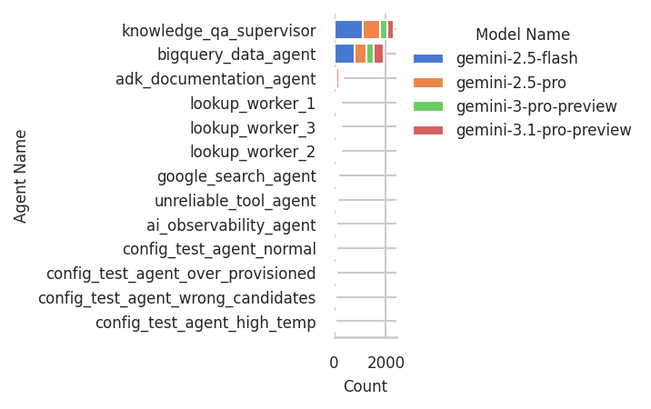](report_assets_20260310_064740/agent_calls_stacked_4K.png)
<br>


### Model Traffic

| **Agent Name**                         | **gemini-2.5-flash**   | **gemini-2.5-pro**   | **gemini-3-pro-preview**   | **gemini-3.1-pro-preview**   |
|:---------------------------------------|:-----------------------|:---------------------|:---------------------------|:-----------------------------|
| **adk_documentation_agent**            | 102 (28%)              | 125 (35%)            | 76 (21%)                   | 58 (16%)                     |
| **ai_observability_agent**             | 248 (46%)              | 209 (39%)            | 50 (9%)                    | 32 (6%)                      |
| **bigquery_data_agent**                | 794 (41%)              | 448 (23%)            | 299 (16%)                  | 382 (20%)                    |
| **config_test_agent_high_temp**        | 14 (34%)               | 9 (22%)              | 10 (24%)                   | 8 (20%)                      |
| **config_test_agent_normal**           | 55 (65%)               | 10 (12%)             | 10 (12%)                   | 10 (12%)                     |
| **config_test_agent_over_provisioned** | 18 (24%)               | 25 (33%)             | 13 (17%)                   | 19 (25%)                     |
| **config_test_agent_wrong_candidates** | 20 (41%)               | 13 (27%)             | 7 (14%)                    | 9 (18%)                      |
| **config_test_agent_wrong_max_tokens** | 18 (24%)               | 20 (27%)             | 12 (16%)                   | 24 (32%)                     |
| **google_search_agent**                | 51 (31%)               | 77 (47%)             | 15 (9%)                    | 20 (12%)                     |
| **knowledge_qa_supervisor**            | 1109 (48%)             | 669 (29%)            | 276 (12%)                  | 242 (11%)                    |
| **lookup_worker_1**                    | 84 (32%)               | 56 (21%)             | 66 (25%)                   | 56 (21%)                     |
| **lookup_worker_2**                    | 84 (33%)               | 52 (21%)             | 62 (25%)                   | 55 (22%)                     |
| **lookup_worker_3**                    | 87 (34%)               | 52 (20%)             | 63 (24%)                   | 57 (22%)                     |
| **unreliable_tool_agent**              | 24 (20%)               | 67 (56%)             | 26 (22%)                   | 3 (2%)                       |

<br>


### Model Performance (Agent End-to-End)

This table compares how specific agents perform when running on different models. **Values represent Agent End-to-End Latency** (including tool execution and overhead), not just LLM generation time.

> [!NOTE]
> **KPI Settings:** Latency Target = `8.0s`, Error Target = `5.0%`
> **Cell Format:** `[Status] [P95.5 Latency]s ([Error Rate]%)`. For example, `🔴 21.558s (16.67%)` means the Agent had a P95.5 latency of 21.558 seconds and an error rate of 16.67%, and received a failing 🔴 status because it breached either the latency or error target.

| **Agent Name**                         | **gemini-2.5-flash**   | **gemini-2.5-pro**   | **gemini-3-pro-preview**   | **gemini-3.1-pro-preview**   |
|:---------------------------------------|:-----------------------|:---------------------|:---------------------------|:-----------------------------|
| **adk_documentation_agent**            | 🔴 21.269s (5.88%)     | 🔴 32.856s (9.6%)    | 🔴 89.345s (23.68%)        | 🔴 109.564s (6.9%)           |
| **ai_observability_agent**             | 🔴 26.633s (79.84%)    | 🔴 36.817s (81.82%)  | -                          | -                            |
| **bigquery_data_agent**                | 🔴 54.513s (82.96%)    | 🔴 109.035s (15.22%) | 🔴 187.519s (38.1%)        | 🔴 205.96s (21.57%)          |
| **config_test_agent_high_temp**        | 🔴 19.379s (0.0%)      | 🔴 29.039s (0.0%)    | 🔴 135.376s (0.0%)         | 🔴 58.117s (0.0%)            |
| **config_test_agent_normal**           | 🔴 225.848s (0.0%)     | 🔴 40.256s (0.0%)    | 🔴 17.965s (0.0%)          | 🔴 35.263s (0.0%)            |
| **config_test_agent_over_provisioned** | 🔴 25.233s (0.0%)      | 🔴 17.408s (0.0%)    | 🔴 21.329s (22.22%)        | 🔴 136.016s (0.0%)           |
| **config_test_agent_wrong_candidates** | 🔴 55.247s (0.0%)      | 🔴 83.928s (0.0%)    | 🔴 92.99s (0.0%)           | 🔴 82.637s (0.0%)            |
| **config_test_agent_wrong_max_tokens** | -                      | -                    | -                          | -                            |
| **google_search_agent**                | 🔴 16.62s (0.0%)       | 🔴 52.331s (0.0%)    | 🔴 64.451s (0.0%)          | 🔴 83.123s (0.0%)            |
| **knowledge_qa_supervisor**            | 🔴 156.513s (67.45%)   | 🔴 71.65s (50.97%)   | 🔴 143.92s (50.0%)         | 🔴 162.571s (36.36%)         |
| **lookup_worker_1**                    | 🔴 11.351s (0.0%)      | 🔴 33.191s (0.0%)    | 🔴 47.38s (3.23%)          | 🔴 34.507s (0.0%)            |
| **lookup_worker_2**                    | 🔴 11.931s (0.0%)      | 🔴 19.264s (0.0%)    | 🔴 35.373s (6.45%)         | 🔴 30.176s (0.0%)            |
| **lookup_worker_3**                    | 🔴 12.216s (0.0%)      | 🔴 16.008s (4.17%)   | 🔴 46.602s (3.23%)         | 🔴 24.881s (3.45%)           |
| **unreliable_tool_agent**              | 🔴 7.536s (30.77%)     | 🔴 10.547s (44.74%)  | 🔴 116.314s (13.33%)       | 🔴 172.017s (0.0%)           |

<br>


### LLM Generation Performance

This table compares the raw LLM generation time for specific agents and models. **Values represent Pure LLM Latency** (excluding agent overhead).

> [!NOTE]
> **KPI Settings:** Latency Target = `5.0s`, Error Target = `5.0%`
> **Cell Format:** `[Status] [P95.5 Latency]s ([Error Rate]%)`.

| **Agent Name**                         | **gemini-2.5-flash**   | **gemini-2.5-pro**   | **gemini-3-pro-preview**   | **gemini-3.1-pro-preview**   |
|:---------------------------------------|:-----------------------|:---------------------|:---------------------------|:-----------------------------|
| **adk_documentation_agent**            | 🔴 21.268s (5.88%)     | 🔴 32.854s (9.6%)    | 🔴 89.344s (23.68%)        | 🔴 109.563s (6.9%)           |
| **ai_observability_agent**             | 🔴 26.631s (79.84%)    | 🔴 36.816s (81.82%)  | -                          | -                            |
| **bigquery_data_agent**                | 🔴 7.303s (0.25%)      | 🔴 13.927s (0.0%)    | 🔴 19.711s (3.01%)         | 🔴 16.583s (0.79%)           |
| **config_test_agent_high_temp**        | 🔴 13.824s (0.0%)      | 🔴 23.622s (0.0%)    | 🔴 26.067s (0.0%)          | 🔴 58.115s (0.0%)            |
| **config_test_agent_normal**           | 🟢 3.815s (0.0%)       | 🔴 12.457s (0.0%)    | 🔴 17.963s (0.0%)          | 🔴 27.563s (0.0%)            |
| **config_test_agent_over_provisioned** | 🔴 10.041s (0.0%)      | 🔴 11.419s (0.0%)    | 🔴 22.897s (0.0%)          | 🔴 50.292s (0.0%)            |
| **config_test_agent_wrong_candidates** | 🔴 14.826s (0.0%)      | 🔴 32.014s (0.0%)    | 🔴 92.988s (0.0%)          | 🔴 82.635s (0.0%)            |
| **config_test_agent_wrong_max_tokens** | -                      | -                    | -                          | -                            |
| **google_search_agent**                | 🔴 16.618s (0.0%)      | 🔴 52.328s (0.0%)    | 🔴 64.448s (0.0%)          | 🔴 83.121s (0.0%)            |
| **knowledge_qa_supervisor**            | 🟢 4.506s (0.18%)      | 🔴 5.545s (0.0%)     | 🔴 19.756s (0.0%)          | 🔴 13.247s (0.0%)            |
| **lookup_worker_1**                    | 🔴 5.032s (0.0%)       | 🔴 17.586s (0.0%)    | 🔴 33.588s (0.0%)          | 🔴 24.288s (0.0%)            |
| **lookup_worker_2**                    | 🟢 4.616s (0.0%)       | 🔴 9.096s (0.0%)     | 🔴 28.252s (1.61%)         | 🔴 20.515s (0.0%)            |
| **lookup_worker_3**                    | 🔴 5.013s (0.0%)       | 🔴 9.553s (0.0%)     | 🔴 30.555s (1.59%)         | 🔴 14.786s (1.75%)           |
| **unreliable_tool_agent**              | 🟢 2.64s (0.0%)        | 🔴 5.885s (0.0%)     | 🔴 20.434s (0.0%)          | 🔴 21.204s (0.0%)            |

<br>


### Agent Overhead Analysis

This chart breaks down the internal execution time of an Agent into **LLM Time**, **Tool Time**, and its own **Code Overhead** (the remaining time).

> [!NOTE]
> The data below is calculated using the **P95.5 execution latency** metrics across all events for each agent to illustrate worst-case internal overheads.


#### Overhead Data Summary

| **Agent Name**                         | **Total Agent Latency (s)**   | **Pure LLM Latency (s)**   | **Agent Overhead (s)**   |
|:---------------------------------------|:------------------------------|:---------------------------|:-------------------------|
| **config_test_agent_normal**           | 215.626s                      | 12.465s                    | 203.162s                 |
| **bigquery_data_agent**                | 203.741s                      | 14.203s                    | 189.538s                 |
| **unreliable_tool_agent**              | 86.633s                       | 15.291s                    | 71.342s                  |
| **config_test_agent_wrong_candidates** | 81.222s                       | 73.599s                    | 7.623s                   |
| **adk_documentation_agent**            | 66.279s                       | 66.277s                    | 0.002s                   |
| **google_search_agent**                | 45.016s                       | 45.014s                    | 0.002s                   |
| **lookup_worker_1**                    | 43.665s                       | 20.977s                    | 22.688s                  |
| **config_test_agent_high_temp**        | 36.691s                       | 27.12s                     | 9.572s                   |
| **ai_observability_agent**             | 33.833s                       | 33.832s                    | 0.001s                   |
| **lookup_worker_3**                    | 31.704s                       | 20.366s                    | 11.338s                  |

<br>

**Agent Overhead Comparison**<br>

[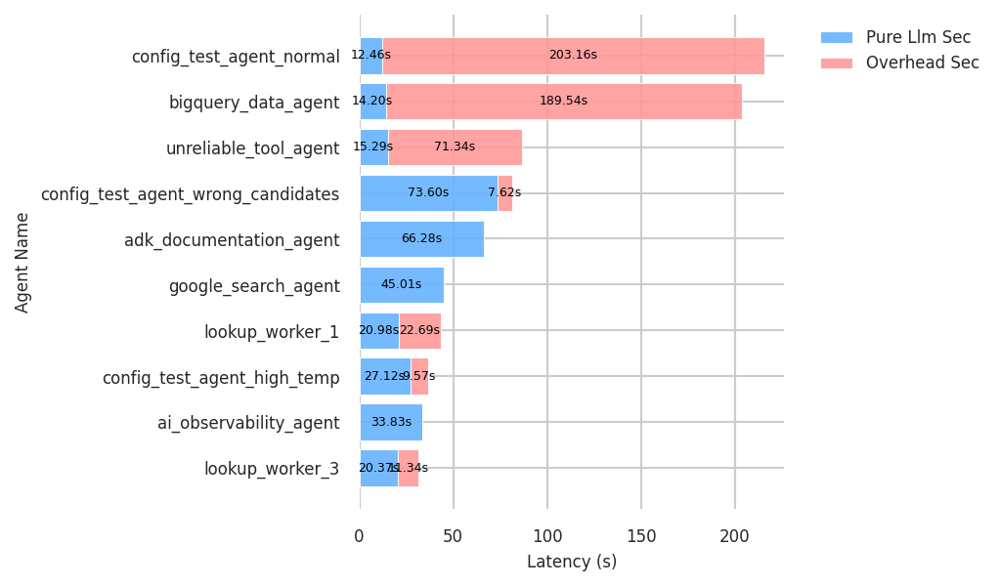](report_assets_20260310_064740/agent_overhead_composition_4K.png)
<br>


---


### Agent Execution Latency (Request Order)

The following charts display the end-to-end latency for each specific Agent over time, highlighting performance trends and potential internal degradation.


**adk_documentation_agent Execution Latency Sequence (Request Order)**<br>
**Total Requests:** 321<br>

[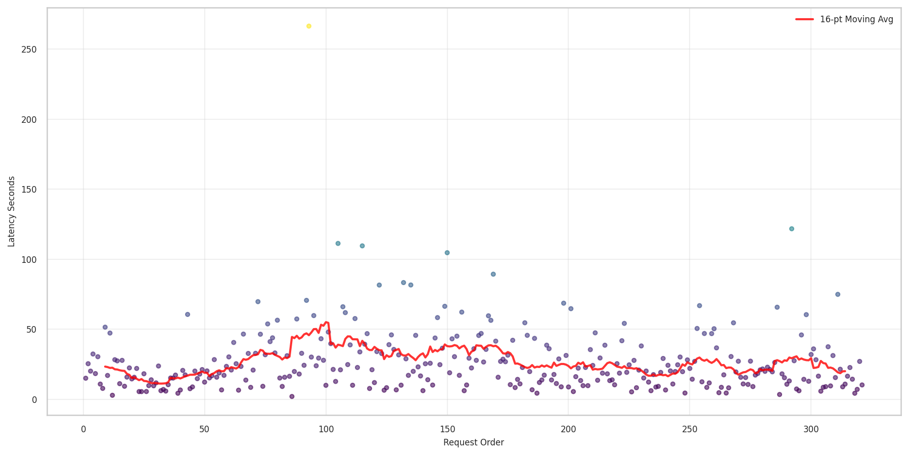](report_assets_20260310_064740/seq_agent_overall_adk_documentation_agent_4K.png)
<br>

**ai_observability_agent Execution Latency Sequence (Request Order)**<br>
**Total Requests:** 88<br>

[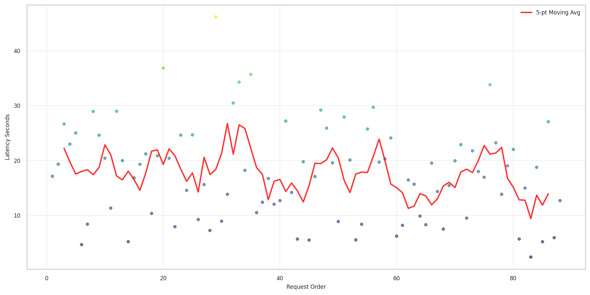](report_assets_20260310_064740/seq_agent_overall_ai_observability_agent_4K.png)
<br>

**bigquery_data_agent Execution Latency Sequence (Request Order)**<br>
**Total Requests:** 1355<br>

[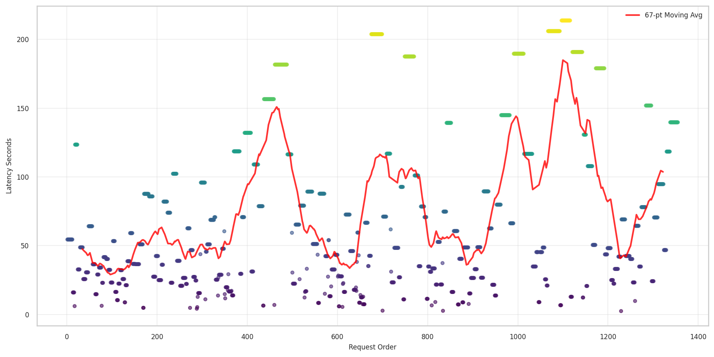](report_assets_20260310_064740/seq_agent_overall_bigquery_data_agent_4K.png)
<br>

**config_test_agent_high_temp Execution Latency Sequence (Request Order)**<br>
**Total Requests:** 41<br>

[](report_assets_20260310_064740/seq_agent_overall_config_test_agent_high_temp_4K.png)
<br>

**config_test_agent_normal Execution Latency Sequence (Request Order)**<br>
**Total Requests:** 85<br>

[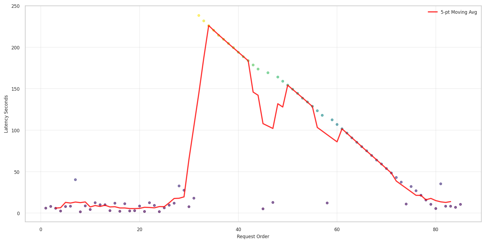](report_assets_20260310_064740/seq_agent_overall_config_test_agent_normal_4K.png)
<br>

**config_test_agent_over_provisioned Execution Latency Sequence (Request Order)**<br>
**Total Requests:** 73<br>

[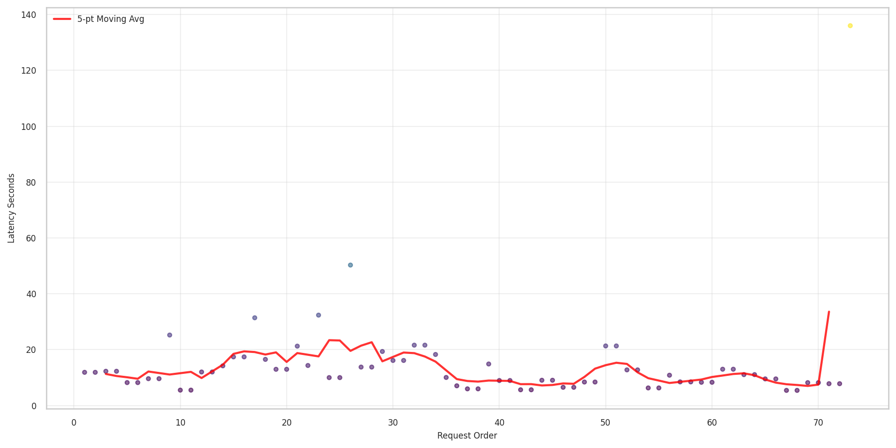](report_assets_20260310_064740/seq_agent_overall_config_test_agent_over_provisioned_4K.png)
<br>

**config_test_agent_wrong_candidates Execution Latency Sequence (Request Order)**<br>
**Total Requests:** 49<br>

[](report_assets_20260310_064740/seq_agent_overall_config_test_agent_wrong_candidates_4K.png)
<br>

**google_search_agent Execution Latency Sequence (Request Order)**<br>
**Total Requests:** 163<br>

[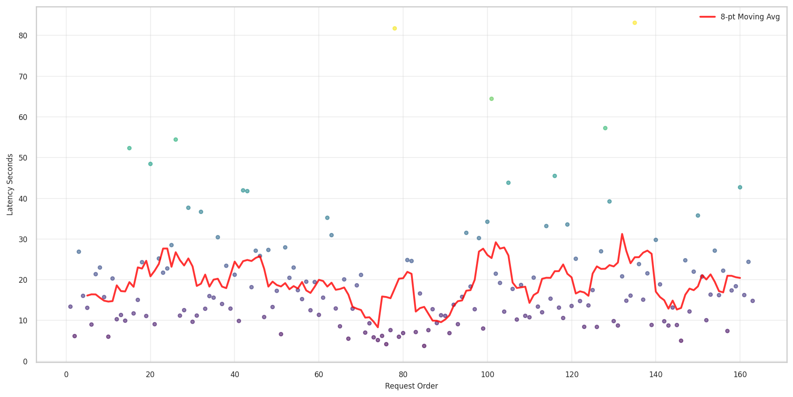](report_assets_20260310_064740/seq_agent_overall_google_search_agent_4K.png)
<br>

**lookup_worker_1 Execution Latency Sequence (Request Order)**<br>
**Total Requests:** 261<br>

[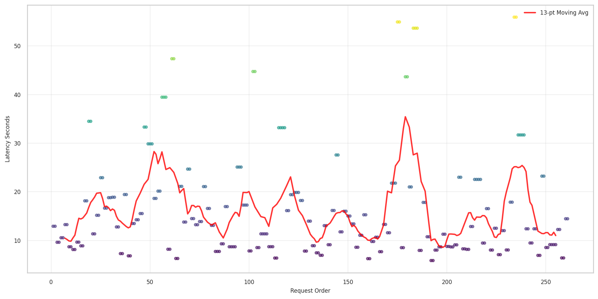](report_assets_20260310_064740/seq_agent_overall_lookup_worker_1_4K.png)
<br>

**lookup_worker_2 Execution Latency Sequence (Request Order)**<br>
**Total Requests:** 249<br>

[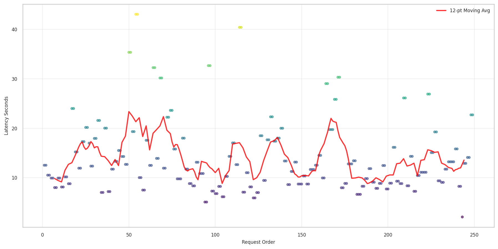](report_assets_20260310_064740/seq_agent_overall_lookup_worker_2_4K.png)
<br>

**lookup_worker_3 Execution Latency Sequence (Request Order)**<br>
**Total Requests:** 253<br>

[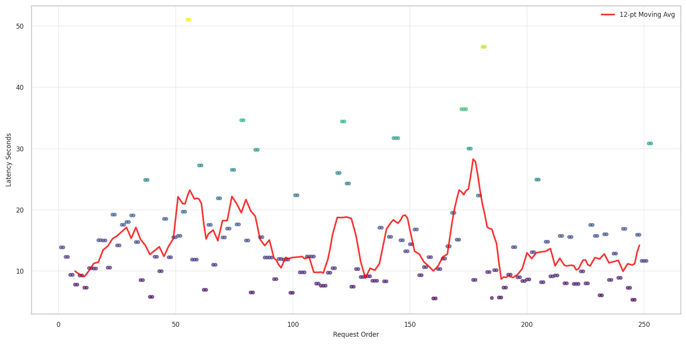](report_assets_20260310_064740/seq_agent_overall_lookup_worker_3_4K.png)
<br>

**parallel_db_lookup Execution Latency Sequence (Request Order)**<br>
**Total Requests:** 119<br>

[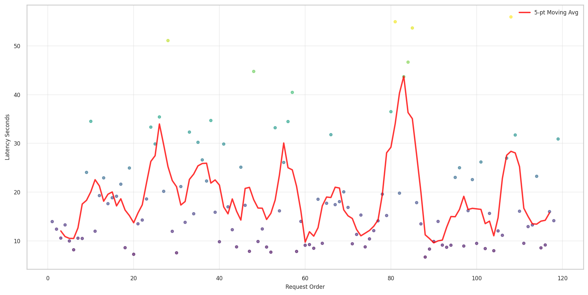](report_assets_20260310_064740/seq_agent_overall_parallel_db_lookup_4K.png)
<br>

**unreliable_tool_agent Execution Latency Sequence (Request Order)**<br>
**Total Requests:** 86<br>

[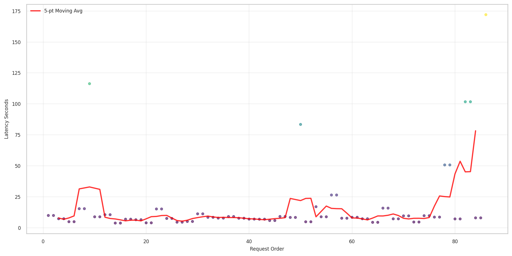](report_assets_20260310_064740/seq_agent_overall_unreliable_tool_agent_4K.png)
<br>


---


### Token Statistics


Token consumption varies wildly between agents. `bigquery_data_agent` shows massive average input tokens (47k), indicating it processes large contexts. In contrast, `config_test_agent_wrong_candidates` has a very high average of thought tokens (5884), suggesting complex or inefficient internal reasoning. `adk_documentation_agent` also shows a high thought-to-output token ratio, pointing to 'thought bloat'.


**adk_documentation_agent**

| **Metric**                           | **gemini-2.5-flash**   | **gemini-2.5-pro**   | **gemini-3-pro-preview**   | **gemini-3.1-pro-preview**   |
|:-------------------------------------|:-----------------------|:---------------------|:---------------------------|:-----------------------------|
| **Amount of Requests**               | 102                    | 125                  | 76                         | 58                           |
| **Mean Input Tokens**                | 2041.57                | 297.53               | 254.53                     | 4904.00                      |
| **P95 Input Tokens**                 | 1133.00                | 572.00               | 303.00                     | 309.00                       |
| **Mean Thought Tokens**              | 946.88                 | 1060.88              | 2007.60                    | 2597.04                      |
| **P95 Thought Tokens**               | 2063.00                | 2022.00              | 5304.00                    | 4663.00                      |
| **Mean Output Tokens**               | 490.70                 | 621.34               | 741.10                     | 615.40                       |
| **P95 Output Tokens**                | 1277.00                | 1212.00              | 1059.00                    | 879.00                       |
| **Median Output Tokens**             | 481.00                 | 618.00               | 741.00                     | 619.00                       |
| **Min Output Tokens**                | 40.00                  | 19.00                | 390.00                     | 271.00                       |
| **Max Output Tokens**                | 1716.00                | 1964.00              | 1122.00                    | 1059.00                      |
| **Mean Total Tokens**                | 4300.66                | 2809.22              | 3003.24                    | 8056.94                      |
| **Latency vs Output Corr.**          | 0.679                  | 0.618                | -0.082                     | 0.212                        |
| **Latency vs Output+Thinking Corr.** | 0.916                  | 0.874                | 0.832                      | 0.763                        |
| **Correlation Strength**             | 🟧 **Strong**          | 🟧 **Strong**        | 🟨 **Moderate**            | 🟨 **Moderate**              |

<br>


**ai_observability_agent**

| **Metric**                           | **gemini-2.5-flash**   | **gemini-2.5-pro**   | **gemini-3-pro-preview**   | **gemini-3.1-pro-preview**   |
|:-------------------------------------|:-----------------------|:---------------------|:---------------------------|:-----------------------------|
| **Amount of Requests**               | 248                    | 209                  | 50                         | 32                           |
| **Mean Input Tokens**                | 282.80                 | 273.63               | N/A                        | N/A                          |
| **P95 Input Tokens**                 | 379.00                 | 391.00               | N/A                        | N/A                          |
| **Mean Thought Tokens**              | 804.04                 | 939.37               | N/A                        | N/A                          |
| **P95 Thought Tokens**               | 2049.00                | 2039.00              | N/A                        | N/A                          |
| **Mean Output Tokens**               | 365.86                 | 705.53               | N/A                        | N/A                          |
| **P95 Output Tokens**                | 1063.00                | 1014.00              | N/A                        | N/A                          |
| **Median Output Tokens**             | 78.00                  | 747.00               | N/A                        | N/A                          |
| **Min Output Tokens**                | 41.00                  | 23.00                | N/A                        | N/A                          |
| **Max Output Tokens**                | 1293.00                | 1357.00              | N/A                        | N/A                          |
| **Mean Total Tokens**                | 2049.72                | 2320.50              | N/A                        | N/A                          |
| **Latency vs Output Corr.**          | 0.639                  | 0.205                | N/A                        | N/A                          |
| **Latency vs Output+Thinking Corr.** | 0.706                  | 0.604                | N/A                        | N/A                          |
| **Correlation Strength**             | 🟨 **Moderate**        | 🟨 **Moderate**      | N/A                        | N/A                          |

<br>


**bigquery_data_agent**

| **Metric**                           | **gemini-2.5-flash**   | **gemini-2.5-pro**   | **gemini-3-pro-preview**   | **gemini-3.1-pro-preview**   |
|:-------------------------------------|:-----------------------|:---------------------|:---------------------------|:-----------------------------|
| **Amount of Requests**               | 794                    | 448                  | 299                        | 382                          |
| **Mean Input Tokens**                | 40625.08               | 64462.78             | 37536.27                   | 48315.22                     |
| **P95 Input Tokens**                 | 106840.00              | 111832.00            | 110412.00                  | 201311.00                    |
| **Mean Thought Tokens**              | 257.14                 | 414.41               | 498.39                     | 277.23                       |
| **P95 Thought Tokens**               | 766.00                 | 977.00               | 1330.00                    | 826.00                       |
| **Mean Output Tokens**               | 50.99                  | 67.90                | 70.16                      | 91.06                        |
| **P95 Output Tokens**                | 140.00                 | 173.00               | 193.00                     | 177.00                       |
| **Median Output Tokens**             | 51.00                  | 53.00                | 55.00                      | 59.00                        |
| **Min Output Tokens**                | 13.00                  | 13.00                | 17.00                      | 17.00                        |
| **Max Output Tokens**                | 478.00                 | 983.00               | 721.00                     | 7963.00                      |
| **Mean Total Tokens**                | 40932.43               | 64943.86             | 38104.81                   | 48683.51                     |
| **Latency vs Output Corr.**          | 0.349                  | 0.318                | 0.220                      | 0.440                        |
| **Latency vs Output+Thinking Corr.** | 0.810                  | 0.836                | 0.817                      | 0.631                        |
| **Correlation Strength**             | 🟨 **Moderate**        | 🟨 **Moderate**      | 🟨 **Moderate**            | 🟨 **Moderate**              |

<br>


**config_test_agent_high_temp**

| **Metric**                           | **gemini-2.5-flash**   | **gemini-2.5-pro**   | **gemini-3-pro-preview**   | **gemini-3.1-pro-preview**   |
|:-------------------------------------|:-----------------------|:---------------------|:---------------------------|:-----------------------------|
| **Amount of Requests**               | 14                     | 9                    | 10                         | 8                            |
| **Mean Input Tokens**                | 1497.50                | 1466.44              | 2307.40                    | 2068.12                      |
| **P95 Input Tokens**                 | 2606.00                | 2211.00              | 4006.00                    | 2596.00                      |
| **Mean Thought Tokens**              | 203.23                 | 451.78               | 769.40                     | 1231.00                      |
| **P95 Thought Tokens**               | 706.00                 | 1311.00              | 1777.00                    | 2921.00                      |
| **Mean Output Tokens**               | 344.93                 | 500.78               | 490.50                     | 698.12                       |
| **P95 Output Tokens**                | 1925.00                | 1969.00              | 1551.00                    | 2799.00                      |
| **Median Output Tokens**             | 157.00                 | 126.00               | 215.00                     | 248.00                       |
| **Min Output Tokens**                | 13.00                  | 13.00                | 18.00                      | 23.00                        |
| **Max Output Tokens**                | 1925.00                | 1969.00              | 1551.00                    | 2799.00                      |
| **Mean Total Tokens**                | 2031.14                | 2419.00              | 3567.30                    | 3997.25                      |
| **Latency vs Output Corr.**          | 0.925                  | 0.809                | 0.814                      | 0.917                        |
| **Latency vs Output+Thinking Corr.** | 0.958                  | 0.990                | 0.981                      | 0.948                        |
| **Correlation Strength**             | 🟧 **Strong**          | 🟧 **Strong**        | 🟧 **Strong**              | 🟧 **Strong**                |

<br>


**config_test_agent_normal**

| **Metric**                           | **gemini-2.5-flash**   | **gemini-2.5-pro**   | **gemini-3-pro-preview**   | **gemini-3.1-pro-preview**   |
|:-------------------------------------|:-----------------------|:---------------------|:---------------------------|:-----------------------------|
| **Amount of Requests**               | 55                     | 10                   | 10                         | 10                           |
| **Mean Input Tokens**                | 8943.04                | 2236.50              | 1790.70                    | 18925.50                     |
| **P95 Input Tokens**                 | 18592.00               | 3075.00              | 2694.00                    | 171420.00                    |
| **Mean Thought Tokens**              | 291.33                 | 329.10               | 570.80                     | 471.70                       |
| **P95 Thought Tokens**               | 382.00                 | 673.00               | 984.00                     | 1649.00                      |
| **Mean Output Tokens**               | 38.82                  | 125.40               | 278.70                     | 150.50                       |
| **P95 Output Tokens**                | 216.00                 | 473.00               | 614.00                     | 605.00                       |
| **Median Output Tokens**             | 13.00                  | 19.00                | 314.00                     | 68.00                        |
| **Min Output Tokens**                | 10.00                  | 7.00                 | 7.00                       | 18.00                        |
| **Max Output Tokens**                | 534.00                 | 473.00               | 614.00                     | 605.00                       |
| **Mean Total Tokens**                | 9273.18                | 2691.00              | 2640.20                    | 19547.70                     |
| **Latency vs Output Corr.**          | 0.744                  | 0.945                | 0.572                      | 0.926                        |
| **Latency vs Output+Thinking Corr.** | 0.830                  | 0.996                | 0.689                      | 0.985                        |
| **Correlation Strength**             | 🟨 **Moderate**        | 🟧 **Strong**        | 🟨 **Moderate**            | 🟧 **Strong**                |

<br>


**config_test_agent_over_provisioned**

| **Metric**                           | **gemini-2.5-flash**   | **gemini-2.5-pro**   | **gemini-3-pro-preview**   | **gemini-3.1-pro-preview**   |
|:-------------------------------------|:-----------------------|:---------------------|:---------------------------|:-----------------------------|
| **Amount of Requests**               | 18                     | 25                   | 13                         | 19                           |
| **Mean Input Tokens**                | 1954.72                | 1403.56              | 1965.69                    | 24531.42                     |
| **P95 Input Tokens**                 | 4022.00                | 2443.00              | 2497.00                    | 216074.00                    |
| **Mean Thought Tokens**              | 204.30                 | 274.48               | 980.44                     | 416.11                       |
| **P95 Thought Tokens**               | 615.00                 | 807.00               | 2299.00                    | 1028.00                      |
| **Mean Output Tokens**               | 133.67                 | 46.28                | 53.77                      | 530.21                       |
| **P95 Output Tokens**                | 1477.00                | 66.00                | 233.00                     | 2855.00                      |
| **Median Output Tokens**             | 29.00                  | 23.00                | 26.00                      | 49.00                        |
| **Min Output Tokens**                | 11.00                  | 8.00                 | 17.00                      | 14.00                        |
| **Max Output Tokens**                | 1477.00                | 603.00               | 233.00                     | 2855.00                      |
| **Mean Total Tokens**                | 2201.89                | 1724.32              | 2698.23                    | 25477.74                     |
| **Latency vs Output Corr.**          | 0.912                  | 0.720                | 0.220                      | 0.940                        |
| **Latency vs Output+Thinking Corr.** | 0.962                  | 0.993                | 0.912                      | 0.976                        |
| **Correlation Strength**             | 🟧 **Strong**          | 🟧 **Strong**        | 🟧 **Strong**              | 🟧 **Strong**                |

<br>


**config_test_agent_wrong_candidates**

| **Metric**                           | **gemini-2.5-flash**   | **gemini-2.5-pro**   | **gemini-3-pro-preview**   | **gemini-3.1-pro-preview**   |
|:-------------------------------------|:-----------------------|:---------------------|:---------------------------|:-----------------------------|
| **Amount of Requests**               | 20                     | 13                   | 7                          | 9                            |
| **Mean Input Tokens**                | 1763.80                | 2339.08              | 2121.00                    | 2066.44                      |
| **P95 Input Tokens**                 | 3045.00                | 4371.00              | 2706.00                    | 3156.00                      |
| **Mean Thought Tokens**              | 1164.69                | 3747.73              | 10174.00                   | 13552.78                     |
| **P95 Thought Tokens**               | 4225.00                | 9733.00              | 34325.00                   | 17900.00                     |
| **Mean Output Tokens**               | 478.75                 | 581.00               | 1155.71                    | 1707.78                      |
| **P95 Output Tokens**                | 1500.00                | 1595.00              | 2690.00                    | 2750.00                      |
| **Median Output Tokens**             | 150.00                 | 325.00               | 965.00                     | 1820.00                      |
| **Min Output Tokens**                | 40.00                  | 68.00                | 300.00                     | 435.00                       |
| **Max Output Tokens**                | 2310.00                | 1595.00              | 2690.00                    | 2750.00                      |
| **Mean Total Tokens**                | 3174.30                | 6091.23              | 13450.71                   | 17327.00                     |
| **Latency vs Output Corr.**          | 0.143                  | 0.061                | 0.209                      | 0.884                        |
| **Latency vs Output+Thinking Corr.** | 0.848                  | 0.928                | 0.674                      | 0.631                        |
| **Correlation Strength**             | 🟨 **Moderate**        | 🟧 **Strong**        | 🟨 **Moderate**            | 🟨 **Moderate**              |

<br>


**config_test_agent_wrong_max_tokens**

| **Metric**                           | **gemini-2.5-flash**   | **gemini-2.5-pro**   | **gemini-3-pro-preview**   | **gemini-3.1-pro-preview**   |
|:-------------------------------------|:-----------------------|:---------------------|:---------------------------|:-----------------------------|
| **Amount of Requests**               | 18                     | 20                   | 12                         | 24                           |
| **Mean Input Tokens**                | N/A                    | N/A                  | N/A                        | N/A                          |
| **P95 Input Tokens**                 | N/A                    | N/A                  | N/A                        | N/A                          |
| **Mean Thought Tokens**              | N/A                    | N/A                  | N/A                        | N/A                          |
| **P95 Thought Tokens**               | N/A                    | N/A                  | N/A                        | N/A                          |
| **Mean Output Tokens**               | N/A                    | N/A                  | N/A                        | N/A                          |
| **P95 Output Tokens**                | N/A                    | N/A                  | N/A                        | N/A                          |
| **Median Output Tokens**             | N/A                    | N/A                  | N/A                        | N/A                          |
| **Min Output Tokens**                | N/A                    | N/A                  | N/A                        | N/A                          |
| **Max Output Tokens**                | N/A                    | N/A                  | N/A                        | N/A                          |
| **Mean Total Tokens**                | N/A                    | N/A                  | N/A                        | N/A                          |
| **Latency vs Output Corr.**          | N/A                    | N/A                  | N/A                        | N/A                          |
| **Latency vs Output+Thinking Corr.** | N/A                    | N/A                  | N/A                        | N/A                          |
| **Correlation Strength**             | N/A                    | N/A                  | N/A                        | N/A                          |

<br>


**google_search_agent**

| **Metric**                           | **gemini-2.5-flash**   | **gemini-2.5-pro**   | **gemini-3-pro-preview**   | **gemini-3.1-pro-preview**   |
|:-------------------------------------|:-----------------------|:---------------------|:---------------------------|:-----------------------------|
| **Amount of Requests**               | 51                     | 77                   | 15                         | 20                           |
| **Mean Input Tokens**                | 3329.98                | 12277.81             | 14536.33                   | 11530.05                     |
| **P95 Input Tokens**                 | 11285.00               | 102595.00            | 98454.00                   | 93942.00                     |
| **Mean Thought Tokens**              | 560.47                 | 526.38               | 1153.67                    | 1177.25                      |
| **P95 Thought Tokens**               | 1509.00                | 1320.00              | 2340.00                    | 2049.00                      |
| **Mean Output Tokens**               | 713.92                 | 785.19               | 863.20                     | 683.70                       |
| **P95 Output Tokens**                | 1338.00                | 1332.00              | 1389.00                    | 1019.00                      |
| **Median Output Tokens**             | 667.00                 | 782.00               | 770.00                     | 761.00                       |
| **Min Output Tokens**                | 117.00                 | 165.00               | 370.00                     | 116.00                       |
| **Max Output Tokens**                | 1769.00                | 2078.00              | 1389.00                    | 1137.00                      |
| **Mean Total Tokens**                | 4675.00                | 13977.38             | 16553.20                   | 13391.00                     |
| **Latency vs Output Corr.**          | 0.775                  | 0.622                | 0.529                      | 0.420                        |
| **Latency vs Output+Thinking Corr.** | 0.938                  | 0.743                | 0.768                      | 0.957                        |
| **Correlation Strength**             | 🟧 **Strong**          | 🟨 **Moderate**      | 🟨 **Moderate**            | 🟧 **Strong**                |

<br>


**knowledge_qa_supervisor**

| **Metric**                           | **gemini-2.5-flash**   | **gemini-2.5-pro**   | **gemini-3-pro-preview**   | **gemini-3.1-pro-preview**   |
|:-------------------------------------|:-----------------------|:---------------------|:---------------------------|:-----------------------------|
| **Amount of Requests**               | 1109                   | 669                  | 276                        | 242                          |
| **Mean Input Tokens**                | 19171.97               | 1895.17              | 2293.38                    | 2677.79                      |
| **P95 Input Tokens**                 | 99597.00               | 2541.00              | 2643.00                    | 2701.00                      |
| **Mean Thought Tokens**              | 201.30                 | 165.97               | 294.70                     | 333.47                       |
| **P95 Thought Tokens**               | 413.00                 | 413.00               | 1260.00                    | 714.00                       |
| **Mean Output Tokens**               | 14.34                  | 20.73                | 18.46                      | 18.83                        |
| **P95 Output Tokens**                | 17.00                  | 19.00                | 23.00                      | 23.00                        |
| **Median Output Tokens**             | 14.00                  | 14.00                | 18.00                      | 18.00                        |
| **Min Output Tokens**                | 13.00                  | 13.00                | 17.00                      | 17.00                        |
| **Max Output Tokens**                | 171.00                 | 1089.00              | 23.00                      | 23.00                        |
| **Mean Total Tokens**                | 19387.59               | 2081.87              | 2606.54                    | 3030.09                      |
| **Latency vs Output Corr.**          | 0.141                  | 0.717                | -0.084                     | -0.187                       |
| **Latency vs Output+Thinking Corr.** | 0.872                  | 0.956                | 0.578                      | 0.866                        |
| **Correlation Strength**             | 🟧 **Strong**          | 🟧 **Strong**        | 🟨 **Moderate**            | 🟧 **Strong**                |

<br>


**lookup_worker_1**

| **Metric**                           | **gemini-2.5-flash**   | **gemini-2.5-pro**   | **gemini-3-pro-preview**   | **gemini-3.1-pro-preview**   |
|:-------------------------------------|:-----------------------|:---------------------|:---------------------------|:-----------------------------|
| **Amount of Requests**               | 84                     | 56                   | 66                         | 56                           |
| **Mean Input Tokens**                | 646.21                 | 751.91               | 917.12                     | 5770.75                      |
| **P95 Input Tokens**                 | 1807.00                | 2388.00              | 1277.00                    | 19500.00                     |
| **Mean Thought Tokens**              | 98.79                  | 499.41               | 848.72                     | 287.46                       |
| **P95 Thought Tokens**               | 168.00                 | 1631.00              | 2313.00                    | 1123.00                      |
| **Mean Output Tokens**               | 45.67                  | 40.00                | 41.85                      | 62.30                        |
| **P95 Output Tokens**                | 87.00                  | 90.00                | 86.00                      | 79.00                        |
| **Median Output Tokens**             | 45.00                  | 37.00                | 38.00                      | 59.00                        |
| **Min Output Tokens**                | 7.00                   | 14.00                | 11.00                      | 16.00                        |
| **Max Output Tokens**                | 121.00                 | 115.00               | 150.00                     | 407.00                       |
| **Mean Total Tokens**                | 759.56                 | 1226.04              | 1549.86                    | 6120.52                      |
| **Latency vs Output Corr.**          | -0.045                 | -0.123               | -0.239                     | 0.062                        |
| **Latency vs Output+Thinking Corr.** | 0.403                  | 0.962                | 0.824                      | 0.557                        |
| **Correlation Strength**             | 🟦 **Weak**            | 🟧 **Strong**        | 🟨 **Moderate**            | 🟨 **Moderate**              |

<br>


**lookup_worker_2**

| **Metric**                           | **gemini-2.5-flash**   | **gemini-2.5-pro**   | **gemini-3-pro-preview**   | **gemini-3.1-pro-preview**   |
|:-------------------------------------|:-----------------------|:---------------------|:---------------------------|:-----------------------------|
| **Amount of Requests**               | 84                     | 52                   | 62                         | 55                           |
| **Mean Input Tokens**                | 607.42                 | 557.77               | 915.11                     | 5853.53                      |
| **P95 Input Tokens**                 | 1807.00                | 1501.00              | 1277.00                    | 19500.00                     |
| **Mean Thought Tokens**              | 86.18                  | 250.92               | 1008.07                    | 386.53                       |
| **P95 Thought Tokens**               | 139.00                 | 648.00               | 2707.00                    | 1266.00                      |
| **Mean Output Tokens**               | 45.57                  | 40.46                | 28.92                      | 55.85                        |
| **P95 Output Tokens**                | 86.00                  | 70.00                | 55.00                      | 78.00                        |
| **Median Output Tokens**             | 40.00                  | 43.00                | 22.00                      | 51.00                        |
| **Min Output Tokens**                | 14.00                  | 14.00                | 2.00                       | 16.00                        |
| **Max Output Tokens**                | 125.00                 | 79.00                | 108.00                     | 340.00                       |
| **Mean Total Tokens**                | 719.68                 | 839.50               | 1637.64                    | 6294.89                      |
| **Latency vs Output Corr.**          | 0.193                  | -0.063               | -0.166                     | -0.118                       |
| **Latency vs Output+Thinking Corr.** | 0.284                  | 0.873                | 0.949                      | 0.958                        |
| **Correlation Strength**             | 🟦 **Weak**            | 🟧 **Strong**        | 🟧 **Strong**              | 🟧 **Strong**                |

<br>


**lookup_worker_3**

| **Metric**                           | **gemini-2.5-flash**   | **gemini-2.5-pro**   | **gemini-3-pro-preview**   | **gemini-3.1-pro-preview**   |
|:-------------------------------------|:-----------------------|:---------------------|:---------------------------|:-----------------------------|
| **Amount of Requests**               | 87                     | 52                   | 63                         | 57                           |
| **Mean Input Tokens**                | 650.14                 | 582.37               | 925.69                     | 5769.52                      |
| **P95 Input Tokens**                 | 1807.00                | 1475.00              | 1277.00                    | 19500.00                     |
| **Mean Thought Tokens**              | 89.19                  | 289.90               | 907.47                     | 286.02                       |
| **P95 Thought Tokens**               | 158.00                 | 854.00               | 2904.00                    | 772.00                       |
| **Mean Output Tokens**               | 48.40                  | 37.26                | 41.48                      | 60.73                        |
| **P95 Output Tokens**                | 107.00                 | 75.00                | 68.00                      | 77.00                        |
| **Median Output Tokens**             | 46.00                  | 36.00                | 40.00                      | 58.00                        |
| **Min Output Tokens**                | 16.00                  | 11.00                | 11.00                      | 16.00                        |
| **Max Output Tokens**                | 118.00                 | 90.00                | 94.00                      | 433.00                       |
| **Mean Total Tokens**                | 752.87                 | 885.79               | 1596.55                    | 6116.27                      |
| **Latency vs Output Corr.**          | 0.088                  | 0.139                | -0.232                     | 0.122                        |
| **Latency vs Output+Thinking Corr.** | 0.117                  | 0.973                | 0.931                      | 0.843                        |
| **Correlation Strength**             | 🟦 **Weak**            | 🟧 **Strong**        | 🟧 **Strong**              | 🟨 **Moderate**              |

<br>


**unreliable_tool_agent**

| **Metric**                           | **gemini-2.5-flash**   | **gemini-2.5-pro**   | **gemini-3-pro-preview**   | **gemini-3.1-pro-preview**   |
|:-------------------------------------|:-----------------------|:---------------------|:---------------------------|:-----------------------------|
| **Amount of Requests**               | 24                     | 67                   | 26                         | 3                            |
| **Mean Input Tokens**                | 1519.08                | 1881.73              | 2580.27                    | 1165.00                      |
| **P95 Input Tokens**                 | 2122.00                | 2700.00              | 2107.00                    | 1196.00                      |
| **Mean Thought Tokens**              | 114.94                 | 232.93               | 492.84                     | 647.00                       |
| **P95 Thought Tokens**               | 310.00                 | 449.00               | 1628.00                    | 1555.00                      |
| **Mean Output Tokens**               | 26.79                  | 30.52                | 31.54                      | 33.00                        |
| **P95 Output Tokens**                | 57.00                  | 65.00                | 106.00                     | 57.00                        |
| **Median Output Tokens**             | 24.00                  | 21.00                | 20.00                      | 25.00                        |
| **Min Output Tokens**                | 12.00                  | 12.00                | 16.00                      | 17.00                        |
| **Max Output Tokens**                | 64.00                  | 73.00                | 106.00                     | 57.00                        |
| **Mean Total Tokens**                | 1622.50                | 2113.90              | 2971.96                    | 1845.00                      |
| **Latency vs Output Corr.**          | -0.220                 | -0.107               | 0.156                      | -0.855                       |
| **Latency vs Output+Thinking Corr.** | 0.884                  | 0.958                | 0.634                      | 0.986                        |
| **Correlation Strength**             | 🟧 **Strong**          | 🟧 **Strong**        | 🟨 **Moderate**            | 🟧 **Strong**                |

<br>

<br>

---


## Tool Details


(AI_SUMMARY: Tool Details)


### Tool Summaries

A high-level cross-report summary for each tool.


**`complex_calculation`**
- **Requests:** 48 (2.2%)
- **Status:** 🟢 Overall (Lat: 🟢, Err: 🟢)
- **Latency (Mean / P95.5):** 2.008s / 2.866s
- **Errors:** 0.0%


**`flaky_tool_simulation`**
- **Requests:** 63 (2.8%)
- **Status:** 🔴 Overall (Lat: 🟢, Err: 🔴)
- **Latency (Mean / P95.5):** 1.177s / 1.897s
- **Errors:** 17.46%


**`execute_sql`**
- **Requests:** 757 (34.1%)
- **Status:** 🟢 Overall (Lat: 🟢, Err: 🟢)
- **Latency (Mean / P95.5):** 0.729s / 1.338s
- **Errors:** 0.0%


**`simulated_db_lookup`**
- **Requests:** 819 (36.9%)
- **Status:** 🟢 Overall (Lat: 🟢, Err: 🟢)
- **Latency (Mean / P95.5):** 0.599s / 0.963s
- **Errors:** 0.0%


**`list_dataset_ids`**
- **Requests:** 73 (3.3%)
- **Status:** 🟢 Overall (Lat: 🟢, Err: 🟢)
- **Latency (Mean / P95.5):** 0.31s / 0.243s
- **Errors:** 0.0%


**`get_dataset_info`**
- **Requests:** 3 (0.1%)
- **Status:** 🟢 Overall (Lat: 🟢, Err: 🟢)
- **Latency (Mean / P95.5):** 0.223s / 0.282s
- **Errors:** 0.0%


**`list_table_ids`**
- **Requests:** 167 (7.5%)
- **Status:** 🟢 Overall (Lat: 🟢, Err: 🟢)
- **Latency (Mean / P95.5):** 0.163s / 0.277s
- **Errors:** 0.0%


**`get_table_info`**
- **Requests:** 278 (12.5%)
- **Status:** 🟢 Overall (Lat: 🟢, Err: 🟢)
- **Latency (Mean / P95.5):** 0.152s / 0.199s
- **Errors:** 0.0%


**`ask_data_insights`**
- **Requests:** 4 (0.2%)
- **Status:** 🟢 Overall (Lat: 🟢, Err: 🟢)
- **Latency (Mean / P95.5):** 0.059s / 0.072s
- **Errors:** 0.0%


**`detect_anomalies`**
- **Requests:** 2 (0.1%)
- **Status:** 🟢 Overall (Lat: 🟢, Err: 🟢)
- **Latency (Mean / P95.5):** 0.0s / 0.001s
- **Errors:** 0.0%


**`search_web`**
- **Requests:** 3 (0.1%)
- **Status:** 🔴 Overall (Lat: ⚪, Err: 🔴)
- **Latency (Mean / P95.5):** -s / -s
- **Errors:** 100.0%


**`list_tables`**
- **Requests:** 2 (0.1%)
- **Status:** 🔴 Overall (Lat: ⚪, Err: 🔴)
- **Latency (Mean / P95.5):** -s / -s
- **Errors:** 100.0%


**`search_adk_docs`**
- **Requests:** 1 (0.0%)
- **Status:** 🔴 Overall (Lat: ⚪, Err: 🔴)
- **Latency (Mean / P95.5):** -s / -s
- **Errors:** 100.0%


**`send_handoff_response`**
- **Requests:** 1 (0.0%)
- **Status:** 🔴 Overall (Lat: ⚪, Err: 🔴)
- **Latency (Mean / P95.5):** -s / -s
- **Errors:** 100.0%


**`vertex_ai_search`**
- **Requests:** 1 (0.0%)
- **Status:** 🔴 Overall (Lat: ⚪, Err: 🔴)
- **Latency (Mean / P95.5):** -s / -s
- **Errors:** 100.0%


### Distribution

**Total Requests:** 2222

| **Name**                  |   **Requests** |   **%** |
|:--------------------------|---------------:|--------:|
| **complex_calculation**   |             48 |    2.16 |
| **flaky_tool_simulation** |             63 |    2.84 |
| **execute_sql**           |            757 |   34.07 |
| **simulated_db_lookup**   |            819 |   36.86 |
| **list_dataset_ids**      |             73 |    3.29 |
| **get_dataset_info**      |              3 |    0.14 |
| **list_table_ids**        |            167 |    7.52 |
| **get_table_info**        |            278 |   12.51 |
| **ask_data_insights**     |              4 |    0.18 |
| **detect_anomalies**      |              2 |    0.09 |
| **search_web**            |              3 |    0.14 |
| **list_tables**           |              2 |    0.09 |
| **search_adk_docs**       |              1 |    0.05 |
| **send_handoff_response** |              1 |    0.05 |
| **vertex_ai_search**      |              1 |    0.05 |

<br>


---


## Model Details


Model performance varies significantly. `gemini-2.5-flash` is consistently the fastest model in terms of both pure LLM latency and end-to-end agent latency across almost all agents. For example, for `bigquery_data_agent`, `gemini-2.5-flash` has a P95.5 agent latency of 54.5s, while `gemini-3.1-pro-preview` is nearly 4x slower at 205.9s. This suggests that for latency-sensitive tasks, `gemini-2.5-flash` is the superior choice, whereas the more advanced `gemini-3.x` models introduce significant latency overhead.


### Model Summaries

A high-level cross-report summary for each model.


**`gemini-3-pro-preview`**
- **Requests:** 985 (15.2%)
- **Status:** 🔴 Overall (Lat: 🔴, Err: 🔴)
- **Latency (Mean / P95.5):** 11.644s / 35.98s
- **Errors:** 9.24%
- **Total Tokens (Avg/P95.5):** 14275 / 96871
- **Input:** 13505 / 96469 | **Output:** 118 / 760 | **Thought:** 706 / 2215


**`gemini-3.1-pro-preview`**
- **Requests:** 975 (15.0%)
- **Status:** 🔴 Overall (Lat: 🔴, Err: 🔴)
- **Latency (Mean / P95.5):** 11.514s / 46.902s
- **Errors:** 6.56%
- **Total Tokens (Avg/P95.5):** 23920 / 126826
- **Input:** 23180 / 126689 | **Output:** 140 / 700 | **Thought:** 600 / 2585


**`gemini-2.5-pro`**
- **Requests:** 1832 (28.2%)
- **Status:** 🔴 Overall (Lat: 🔴, Err: 🔴)
- **Latency (Mean / P95.5):** 7.166s / 23.488s
- **Errors:** 11.08%
- **Total Tokens (Avg/P95.5):** 19914 / 108864
- **Input:** 19315 / 108417 | **Output:** 138 / 844 | **Thought:** 381 / 1225


**`gemini-2.5-flash`**
- **Requests:** 2708 (41.7%)
- **Status:** 🔴 Overall (Lat: 🔴, Err: 🔴)
- **Latency (Mean / P95.5):** 3.642s / 10.765s
- **Errors:** 8.35%
- **Total Tokens (Avg/P95.5):** 22362 / 104718
- **Input:** 21982 / 104493 | **Output:** 76 / 442 | **Thought:** 270 / 853


### Distribution

**Total Requests:** 6500

| **Name**                   |   **Requests** |   **%** |
|:---------------------------|---------------:|--------:|
| **gemini-3-pro-preview**   |            985 |   15.15 |
| **gemini-3.1-pro-preview** |            975 |   15    |
| **gemini-2.5-pro**         |           1832 |   28.18 |
| **gemini-2.5-flash**       |           2708 |   41.66 |

<br>

**Model Usage**<br>

[](report_assets_20260310_064740/model_usage_pie_4K.png)
<br>

**Latency Distribution by Category**<br>

[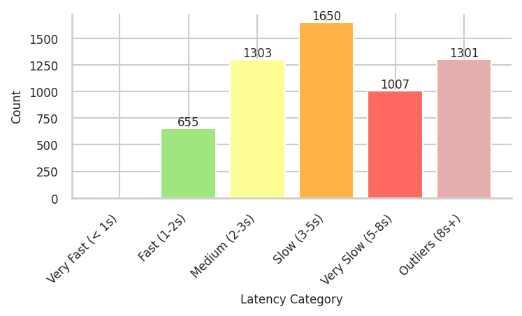](report_assets_20260310_064740/latency_category_dist_4K.png)
<br>


### Model Performance

| **Metric**                     | **gemini-3-pro-preview**   | **gemini-3.1-pro-preview**   | **gemini-2.5-pro**   | **gemini-2.5-flash**   |
|:-------------------------------|:---------------------------|:-----------------------------|:---------------------|:-----------------------|
| Total Requests                 | 985                        | 975                          | 1832                 | 2708                   |
| Mean Latency (s)               | 11.644                     | 11.514                       | 7.166                | 3.642                  |
| Std Deviation (s)              | 14.57                      | 14.272                       | 7.63                 | 3.21                   |
| Median Latency (s)             | 6.822                      | 6.623                        | 4.133                | 2.698                  |
| P95 Latency (s)                | 34.07                      | 45.501                       | 22.696               | 10.244                 |
| P99 Latency (s)                | 66.08                      | 72.612                       | 36.816               | 17.671                 |
| Max Latency (s)                | 266.501                    | 121.779                      | 81.746               | 33.816                 |
| Outliers 2 STD Count (Percent) | 28 (2.8%)                  | 54 (5.5%)                    | 83 (4.5%)            | 130 (4.8%)             |
| Outliers 3 STD Count (Percent) | 13 (1.3%)                  | 32 (3.3%)                    | 34 (1.9%)            | 77 (2.8%)              |

<br>


### Model Latency Sequences

The following charts display the pure LLM execution latency (excluding agent overhead) for each generated response throughout the test run.


**gemini-2.5-flash LLM Latency Sequence (Request Order)**<br>
**Total Requests:** 2482<br>

[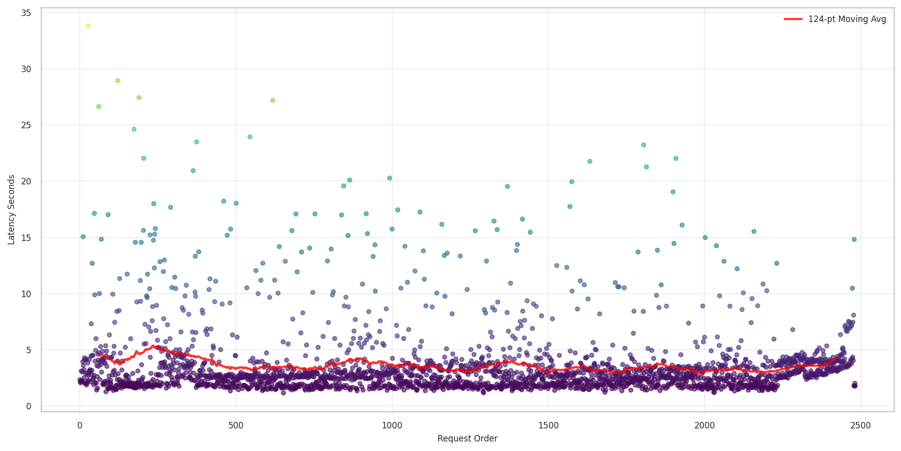](report_assets_20260310_064740/seq_model_gemini-2_5-flash_4K.png)
<br>

**gemini-2.5-pro LLM Latency Sequence (Request Order)**<br>
**Total Requests:** 1629<br>

[](report_assets_20260310_064740/seq_model_gemini-2_5-pro_4K.png)
<br>

**gemini-3-pro-preview LLM Latency Sequence (Request Order)**<br>
**Total Requests:** 894<br>

[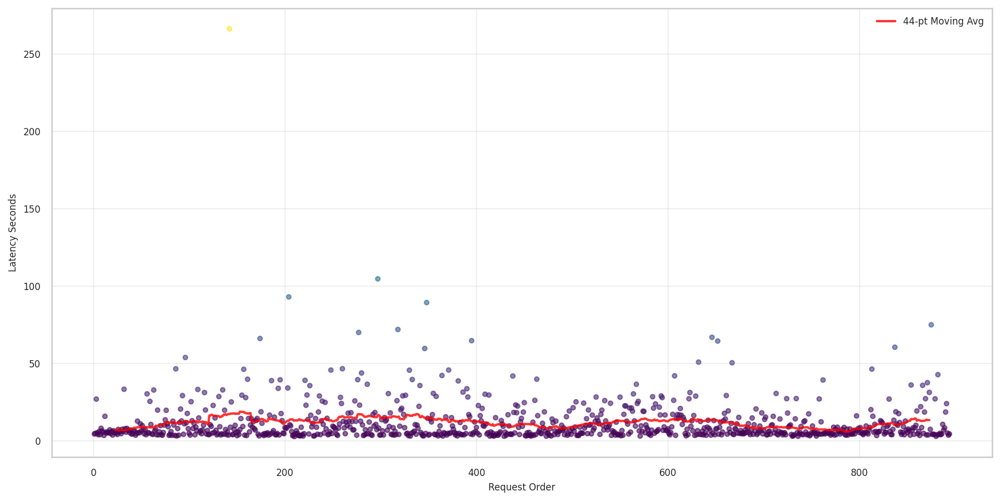](report_assets_20260310_064740/seq_model_gemini-3-pro-preview_4K.png)
<br>

**gemini-3.1-pro-preview LLM Latency Sequence (Request Order)**<br>
**Total Requests:** 911<br>

[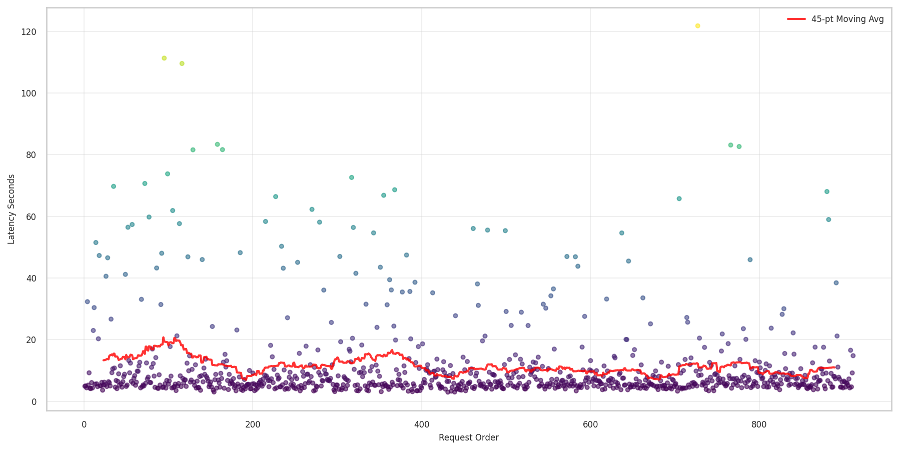](report_assets_20260310_064740/seq_model_gemini-3_1-pro-preview_4K.png)
<br>


### Token Statistics


For `gemini-2.5-flash`, there is a 'Strong' correlation (0.866) between latency and the sum of output and thinking tokens, confirming Hypothesis H1: generation length is a primary latency driver for this model. All models show massive average input tokens (13k-23k), with `bigquery_data_agent` being a major contributor, indicating a system-wide pattern of context bloat which likely increases prefill times.

| **Metric**                           | **gemini-2.5-flash**   | **gemini-2.5-pro**   | **gemini-3-pro-preview**   | **gemini-3.1-pro-preview**   |
|:-------------------------------------|:-----------------------|:---------------------|:---------------------------|:-----------------------------|
| **Amount of Requests**               | 2708                   | 1832                 | 985                        | 975                          |
| **Mean Input Tokens**                | 21982.28               | 19315.62             | 13505.05                   | 23180.13                     |
| **P95 Input Tokens**                 | 104493.00              | 108417.00            | 96469.00                   | 126689.00                    |
| **Mean Thought Tokens**              | 270.13                 | 381.71               | 706.45                     | 600.79                       |
| **P95 Thought Tokens**               | 853.00                 | 1225.00              | 2215.00                    | 2585.00                      |
| **Mean Output Tokens**               | 76.30                  | 138.31               | 118.50                     | 140.70                       |
| **P95 Output Tokens**                | 442.00                 | 844.00               | 760.00                     | 700.00                       |
| **Median Output Tokens**             | 15.00                  | 20.00                | 29.00                      | 45.00                        |
| **Min Output Tokens**                | 7.00                   | 7.00                 | 2.00                       | 14.00                        |
| **Max Output Tokens**                | 2310.00                | 2078.00              | 2690.00                    | 7963.00                      |
| **Mean Total Tokens**                | 22362.85               | 19914.35             | 14275.21                   | 23920.65                     |
| **Latency vs Output Corr.**          | 0.683                  | 0.784                | 0.572                      | 0.594                        |
| **Latency vs Output+Thinking Corr.** | 0.866                  | 0.812                | 0.653                      | 0.729                        |
| **Correlation Strength**             | 🟧 **Strong**          | 🟨 **Moderate**      | 🟨 **Moderate**            | 🟨 **Moderate**              |

<br>


### Token Usage Breakdown per Model

The charts below display the average token consumption per request, broken down by **Input**, **Thought**, and **Output** tokens for each Agent using a specific Model.

> [!NOTE]
> This data is aggregated by calculating the mean token counts across all raw LLM events for the given Agent and Model combination.


**Token Breakdown for gemini-2.5-flash**<br>

[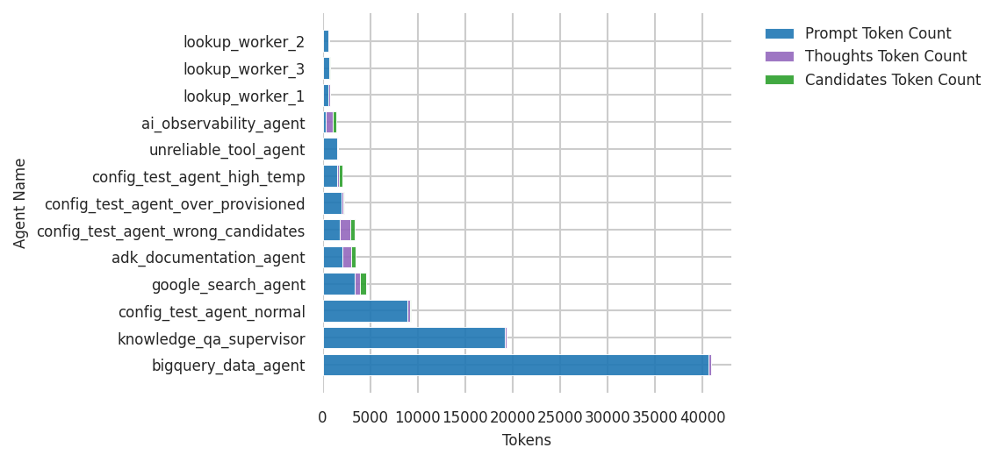](report_assets_20260310_064740/token_usage_gemini-2_5-flash_4K.png)
<br>

**Token Breakdown for gemini-2.5-pro**<br>

[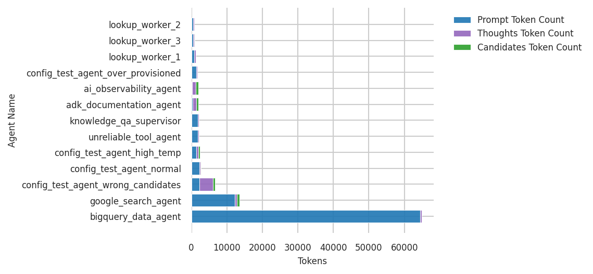](report_assets_20260310_064740/token_usage_gemini-2_5-pro_4K.png)
<br>

**Token Breakdown for gemini-3-pro-preview**<br>

[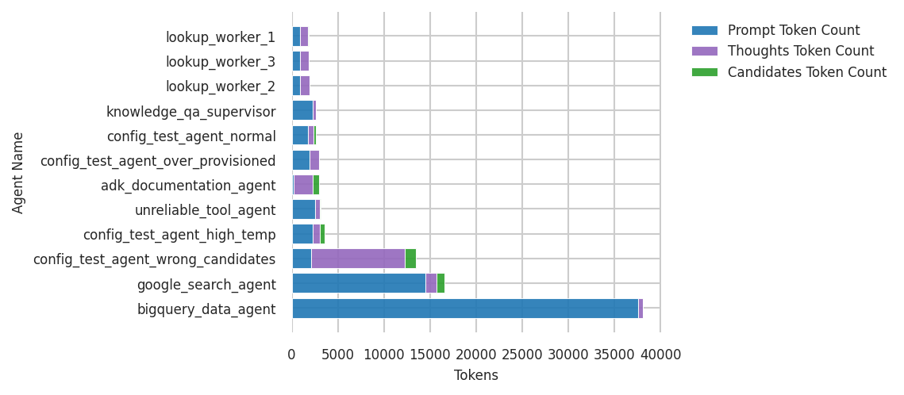](report_assets_20260310_064740/token_usage_gemini-3-pro-preview_4K.png)
<br>

**Token Breakdown for gemini-3.1-pro-preview**<br>

[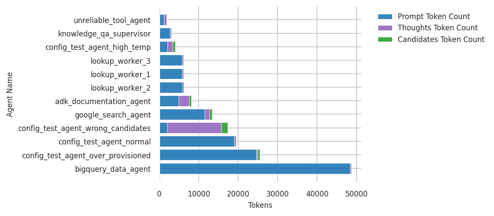](report_assets_20260310_064740/token_usage_gemini-3_1-pro-preview_4K.png)
<br>


### Requests Distribution

**Model Latency Distribution**<br>

[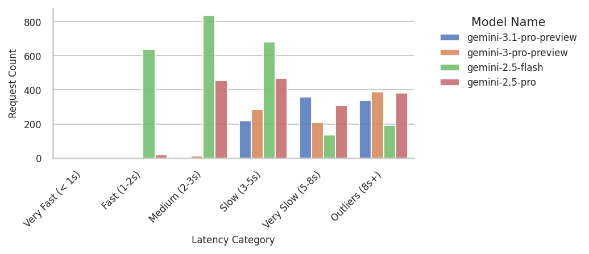](report_assets_20260310_064740/model_latency_bucketed_4K.png)
<br>


**gemini-2.5-flash**

| **Category**         |   **Count** | **Percentage**   |
|:---------------------|------------:|:-----------------|
| **Very Fast (< 1s)** |           0 | 0.0%             |
| **Fast (1-2s)**      |         637 | 25.7%            |
| **Medium (2-3s)**    |         837 | 33.7%            |
| **Slow (3-5s)**      |         680 | 27.4%            |
| **Very Slow (5-8s)** |         135 | 5.4%             |
| **Outliers (8s+)**   |         193 | 7.8%             |

<br>


**gemini-2.5-pro**

| **Category**         |   **Count** | **Percentage**   |
|:---------------------|------------:|:-----------------|
| **Very Fast (< 1s)** |           0 | 0.0%             |
| **Fast (1-2s)**      |          18 | 1.1%             |
| **Medium (2-3s)**    |         454 | 27.9%            |
| **Slow (3-5s)**      |         467 | 28.7%            |
| **Very Slow (5-8s)** |         308 | 18.9%            |
| **Outliers (8s+)**   |         382 | 23.4%            |

<br>


**gemini-3-pro-preview**

| **Category**         |   **Count** | **Percentage**   |
|:---------------------|------------:|:-----------------|
| **Very Fast (< 1s)** |           0 | 0.0%             |
| **Fast (1-2s)**      |           0 | 0.0%             |
| **Medium (2-3s)**    |          12 | 1.3%             |
| **Slow (3-5s)**      |         286 | 32.0%            |
| **Very Slow (5-8s)** |         207 | 23.2%            |
| **Outliers (8s+)**   |         389 | 43.5%            |

<br>


**gemini-3.1-pro-preview**

| **Category**         |   **Count** | **Percentage**   |
|:---------------------|------------:|:-----------------|
| **Very Fast (< 1s)** |           0 | 0.0%             |
| **Fast (1-2s)**      |           0 | 0.0%             |
| **Medium (2-3s)**    |           0 | 0.0%             |
| **Slow (3-5s)**      |         217 | 23.8%            |
| **Very Slow (5-8s)** |         357 | 39.2%            |
| **Outliers (8s+)**   |         337 | 37.0%            |

<br>


---


## System Bottlenecks & Impact


The #1 bottleneck is a tie between Agent Orchestration Failures and inefficient Agent Code Overhead. Orchestration failures, manifesting as `PENDING` timeouts, account for 100% of root-level errors and indicate a systemic inability to schedule and execute tasks. For tasks that do run, agent overhead is the primary latency driver, with agents like `config_test_agent_normal` spending 203s (94% of total time) in their own code, dwarfing the 12s spent on LLM processing.


### Slowest Invocations

| Rank                 | Timestamp           | Root Agent                  |   Duration (s) | Status   | User Message                                                                                                                                                                                                                                                              | Session ID                           | Trace ID                                                                                                                                                       |
|:---------------------|:--------------------|:----------------------------|---------------:|:---------|:--------------------------------------------------------------------------------------------------------------------------------------------------------------------------------------------------------------------------------------------------------------------------|:-------------------------------------|:---------------------------------------------------------------------------------------------------------------------------------------------------------------|
| **[1](#rca-root-1)** | 2026-03-07 21:11:51 | **knowledge_qa_supervisor** |        219.075 | 🟢       | Find the most expensive BigQuery jobs run by service account 'ai-agent-svc' in the last quarter.                                                                                                                                                                          | f8d0e465-d99e-4e6d-8f3b-023acc184feb | [`ddc2f74662a5df15b3eb46c7c2379070`](https://console.cloud.google.com/traces/explorer;traceId=ddc2f74662a5df15b3eb46c7c2379070?project=agent-operations-ek-05) |
| **[2](#rca-root-2)** | 2026-03-07 21:10:27 | **knowledge_qa_supervisor** |        239.895 | 🟢       | Generate a unique product description for an 'AI-powered gardening robot' using a NORMAL config. Then, search Google for similar existing products to ensure differentiation, and log the generated description and comparison notes into `product_development_bigquery`. | e009ed61-070f-4437-8928-e143cb72e24d | [`6f50bd38c47ec8d925ab957bbe86413c`](https://console.cloud.google.com/traces/explorer;traceId=6f50bd38c47ec8d925ab957bbe86413c?project=agent-operations-ek-05) |
| **[3](#rca-root-3)** | 2026-03-07 21:07:31 | **knowledge_qa_supervisor** |        213.883 | 🟢       | List the top 10 `product_ids` associated with agent `200` interactions in `product_inquiries`.                                                                                                                                                                            | 263a9415-91f5-4a9f-b1ad-98797914a40e | [`901fd8c0c9653ff18865625e1d4a0916`](https://console.cloud.google.com/traces/explorer;traceId=901fd8c0c9653ff18865625e1d4a0916?project=agent-operations-ek-05) |
| **[4](#rca-root-4)** | 2026-03-07 20:51:56 | **knowledge_qa_supervisor** |        270.083 | 🟢       | How does error handling differ between synchronous and asynchronous operations in the ADK framework?                                                                                                                                                                      | 3aa755b3-9b5f-4a25-9a5c-f30a4f91c722 | [`0eef485489704876ef8d70b9da0d870c`](https://console.cloud.google.com/traces/explorer;traceId=0eef485489704876ef8d70b9da0d870c?project=agent-operations-ek-05) |
| **[5](#rca-root-5)** | 2026-03-07 20:50:10 | **knowledge_qa_supervisor** |        230.593 | 🟢       | Calculate the average number of intermediate_steps for Complex/Chained agent requests in agent_step_logs?                                                                                                                                                                 | eed8753e-2c56-4ea1-becf-1f24e204efed | [`5795fac3ac4ce5254d26a34f16ff882d`](https://console.cloud.google.com/traces/explorer;traceId=5795fac3ac4ce5254d26a34f16ff882d?project=agent-operations-ek-05) |

<br>

**Detailed RCA Analysis:**

- <a id="rca-root-1"></a>**Rank 1**: The trace exhibits extreme P99 latency (219s), indicating a performance bottleneck where the `knowledge_qa_supervisor` agent executed an expensive, unbounded analytical query against a large dataset, causing a severe latency SLO breach despite the successful 'OK' status.

- <a id="rca-root-2"></a>**Rank 2**: The supervisor agent's reasoning logic for the complex, multi-step prompt resulted in an excessively long execution chain, leading to an extreme latency of ~240 seconds. Although the trace status is 'OK', this duration constitutes a de facto timeout, violating system performance SLOs and causing a functional failure from a client perspective.

- <a id="rca-root-3"></a>**Rank 3**: Extreme latency (213s) occurred because the `bigquery_data_agent` executed an unoptimized query, likely causing a full table scan on `product_inquiries` instead of utilizing partitioning or clustering on the `agent` column, resulting in severe performance degradation and high compute cost.

- <a id="rca-root-4"></a>**Rank 4**: The trace did not fail but exhibited extreme latency (270s), indicating a severe performance degradation in the `knowledge_qa_supervisor` agent. This latency likely stems from a bottleneck in downstream tool execution or an inefficient internal orchestration loop, impacting the user experience by exceeding acceptable response time thresholds despite the successful `OK` status.

- <a id="rca-root-5"></a>**Rank 5**: The excessive latency (230.6s) for the `bigquery_data_agent`, despite the 'OK' status, indicates a severe performance failure, not a functional one. The root cause is an inefficient, agent-generated BigQuery aggregation query that likely triggered a full table scan on a large log table, bypassing necessary partitions or indexes.

<br>


### Slowest Agent queries

| **Rank**              | **Timestamp**       | **Name**                     |   **Latency (s)** | **Status**   | **User Message**                                                                                                                                                                                                                                              | **Root Agent**              |   **E2E (s)** | **Root Status**   | **Impact (%)**   | **Session ID**                       | **Trace ID**                                                                                                                                                   | **Span ID**                                                                                                                                                            |
|:----------------------|:--------------------|:-----------------------------|------------------:|:-------------|:--------------------------------------------------------------------------------------------------------------------------------------------------------------------------------------------------------------------------------------------------------------|:----------------------------|--------------:|:------------------|:-----------------|:-------------------------------------|:---------------------------------------------------------------------------------------------------------------------------------------------------------------|:-----------------------------------------------------------------------------------------------------------------------------------------------------------------------|
| **[1](#rca-agent-1)** | 2026-03-07 21:10:47 | **config_test_agent_normal** |           220.386 | 🟢           | Generate a unique product description for an 'AI-powered gardening robot' using a NORMAL config. Then, search Google for similar existing products to ensure differentiation, and log the generated description and comparison notes into `product_develop... | **knowledge_qa_supervisor** |       239.895 | 🟢                | 91.9%            | e009ed61-070f-4437-8928-e143cb72e24d | [`6f50bd38c47ec8d925ab957bbe86413c`](https://console.cloud.google.com/traces/explorer;traceId=6f50bd38c47ec8d925ab957bbe86413c?project=agent-operations-ek-05) | [`3f846a378d227204`](https://console.cloud.google.com/traces/explorer;traceId=6f50bd38c47ec8d925ab957bbe86413c;spanId=3f846a378d227204?project=agent-operations-ek-05) |
| **[2](#rca-agent-2)** | 2026-03-07 21:10:41 | **config_test_agent_normal** |           225.848 | 🟢           | Generate a unique product description for an 'AI-powered gardening robot' using a NORMAL config. Then, search Google for similar existing products to ensure differentiation, and log the generated description and comparison notes into `product_develop... | **knowledge_qa_supervisor** |       239.895 | 🟢                | 94.1%            | e009ed61-070f-4437-8928-e143cb72e24d | [`6f50bd38c47ec8d925ab957bbe86413c`](https://console.cloud.google.com/traces/explorer;traceId=6f50bd38c47ec8d925ab957bbe86413c?project=agent-operations-ek-05) | [`dff8e881d45342fd`](https://console.cloud.google.com/traces/explorer;traceId=6f50bd38c47ec8d925ab957bbe86413c;spanId=dff8e881d45342fd?project=agent-operations-ek-05) |
| **[3](#rca-agent-3)** | 2026-03-07 21:10:35 | **config_test_agent_normal** |           231.668 | 🟢           | Generate a unique product description for an 'AI-powered gardening robot' using a NORMAL config. Then, search Google for similar existing products to ensure differentiation, and log the generated description and comparison notes into `product_develop... | **knowledge_qa_supervisor** |       239.895 | 🟢                | 96.6%            | e009ed61-070f-4437-8928-e143cb72e24d | [`6f50bd38c47ec8d925ab957bbe86413c`](https://console.cloud.google.com/traces/explorer;traceId=6f50bd38c47ec8d925ab957bbe86413c?project=agent-operations-ek-05) | [`d8f83895e654721e`](https://console.cloud.google.com/traces/explorer;traceId=6f50bd38c47ec8d925ab957bbe86413c;spanId=d8f83895e654721e?project=agent-operations-ek-05) |
| **[4](#rca-agent-4)** | 2026-03-07 21:10:29 | **config_test_agent_normal** |           238.204 | 🟢           | Generate a unique product description for an 'AI-powered gardening robot' using a NORMAL config. Then, search Google for similar existing products to ensure differentiation, and log the generated description and comparison notes into `product_develop... | **knowledge_qa_supervisor** |       239.895 | 🟢                | 99.3%            | e009ed61-070f-4437-8928-e143cb72e24d | [`6f50bd38c47ec8d925ab957bbe86413c`](https://console.cloud.google.com/traces/explorer;traceId=6f50bd38c47ec8d925ab957bbe86413c?project=agent-operations-ek-05) | [`ab87c20e4ca4799e`](https://console.cloud.google.com/traces/explorer;traceId=6f50bd38c47ec8d925ab957bbe86413c;spanId=ab87c20e4ca4799e?project=agent-operations-ek-05) |
| **[5](#rca-agent-5)** | 2026-03-07 20:52:00 | **adk_documentation_agent**  |           266.502 | 🟢           | How does error handling differ between synchronous and asynchronous operations in the ADK framework?                                                                                                                                                          | **knowledge_qa_supervisor** |       270.083 | 🟢                | 98.7%            | 3aa755b3-9b5f-4a25-9a5c-f30a4f91c722 | [`0eef485489704876ef8d70b9da0d870c`](https://console.cloud.google.com/traces/explorer;traceId=0eef485489704876ef8d70b9da0d870c?project=agent-operations-ek-05) | [`23fc72b2654294b4`](https://console.cloud.google.com/traces/explorer;traceId=0eef485489704876ef8d70b9da0d870c;spanId=23fc72b2654294b4?project=agent-operations-ek-05) |

<br>

**Detailed RCA Analysis:**

- <a id="rca-agent-1"></a>**Rank 1**: The span succeeded but experienced severe performance degradation with a 220-second latency, which is the primary contributor to the total trace time; this latency is caused by the agent's 'NORMAL' configuration inefficiently executing multiple seque...

- <a id="rca-agent-2"></a>**Rank 2**: Severe latency (226s) in the `config_test_agent_normal` span, despite its 'OK' status, was caused by an overly permissive timeout configuration that masked a slow downstream dependency instead of failing fast.

- <a id="rca-agent-3"></a>**Rank 3**: While the trace status is 'OK', the excessive latency (231.7s) constitutes a performance failure, likely caused by a bottleneck in the sequential, multi-step agent trajectory which includes LLM generation, an external Google search, and a BigQuery da...

- <a id="rca-agent-4"></a>**Rank 4**: The trace status is 'OK', but the p99 latency is violated due to the `config_test_agent_normal` span consuming 238 seconds, which accounts for 99.2% of the entire trace duration. This indicates a severe performance bottleneck or inefficient sequentia...

- <a id="rca-agent-5"></a>**Rank 5**: The trace succeeded with an OK status but exhibited extreme P99 latency (266.5s), indicating a severe performance degradation in the `adk_documentation_agent`. This excessive duration, which consumed nearly the entire root trace time, was likely caus...

<br>


### Slowest LLM queries

| **Rank**            | **Timestamp**       |   **LLM (s)** |   **TTFT (s)** | **Model Name**             | **LLM Status**   |   **Input** |   **Output** |   **Thought** |   **Total Tokens** | **Response Text**                                                                                                                                                                                                                                             | **Agent Name**              |   **Agent (s)** | **Agent Status impact**   | **Root Agent Name**         |   **E2E (s)** | **Root Status**   | **Impact %**   | **User Message**                                                                                         | **Session ID**                       | **Trace ID**                                                                                                                                                   | **Span ID**                                                                                                                                                            |
|:--------------------|:--------------------|--------------:|---------------:|:---------------------------|:-----------------|------------:|-------------:|--------------:|-------------------:|:--------------------------------------------------------------------------------------------------------------------------------------------------------------------------------------------------------------------------------------------------------------|:----------------------------|----------------:|:--------------------------|:----------------------------|--------------:|:------------------|:---------------|:---------------------------------------------------------------------------------------------------------|:-------------------------------------|:---------------------------------------------------------------------------------------------------------------------------------------------------------------|:-----------------------------------------------------------------------------------------------------------------------------------------------------------------------|
| **[1](#rca-llm-1)** | 2026-03-07 21:13:10 |       121.779 |        121.779 | **gemini-3.1-pro-preview** | 🟢               |         221 |          431 |          4394 |               5046 | text: 'Based on the Agent Development Kit (ADK) documentation, ADK agents are designed to be deployment-agnostic, meaning the core agent logic is decoupled from the underlying serving infrastructure.   Here is how resource management and requirements... | **adk_documentation_agent** |         121.781 | 🟢                        | **knowledge_qa_supervisor** |       127.365 | 🟢                | 95.6%          | How to specify resource requirements for an ADK agent deployed on Vertex AI?                             | e95f1040-0e2c-4df0-8a9e-2238239826e4 | [`027586e59151d305ae6584fbe04a277f`](https://console.cloud.google.com/traces/explorer;traceId=027586e59151d305ae6584fbe04a277f?project=agent-operations-ek-05) | [`b2e01a22c7489e59`](https://console.cloud.google.com/traces/explorer;traceId=027586e59151d305ae6584fbe04a277f;spanId=b2e01a22c7489e59?project=agent-operations-ek-05) |
| **[2](#rca-llm-2)** | 2026-03-07 20:57:53 |       104.674 |        104.674 | **gemini-3-pro-preview**   | 🟢               |         225 |          853 |          5304 |               6382 | text: 'To create a custom callback for tracking token usage in an ADK agent (specifically using the Python SDK), you generally need to define a function that intercepts the model's response and extracts the usage metadata. This allows you to log the ... | **adk_documentation_agent** |         104.675 | 🟢                        | **knowledge_qa_supervisor** |       115.207 | 🟢                | 90.9%          | How to create a custom callback to track token usage in an ADK agent for cost optimization?              | c29b2457-d444-4b3b-867d-4ad3ea5e677d | [`25c6049560b0145d08c11571a405646f`](https://console.cloud.google.com/traces/explorer;traceId=25c6049560b0145d08c11571a405646f?project=agent-operations-ek-05) | [`07cf23ff5249c862`](https://console.cloud.google.com/traces/explorer;traceId=25c6049560b0145d08c11571a405646f;spanId=07cf23ff5249c862?project=agent-operations-ek-05) |
| **[3](#rca-llm-3)** | 2026-03-07 20:54:03 |       109.563 |        109.563 | **gemini-3.1-pro-preview** | 🟢               |         219 |          607 |          3223 |               4049 | text: 'Based on the Agent Development Kit (ADK) documentation, there are several ways to log specific events and capture operational data, ranging from dedicated lifecycle callbacks to custom agent implementations and native observability tools.   He... | **adk_documentation_agent** |         109.564 | 🟢                        | **knowledge_qa_supervisor** |       114.39  | 🟢                | 95.8%          | How to define custom callbacks in ADK to log specific events?                                            | 037fff10-2218-4000-9980-dff9d696f9d3 | [`49445fae81784263ad0a1bde0afed0cc`](https://console.cloud.google.com/traces/explorer;traceId=49445fae81784263ad0a1bde0afed0cc?project=agent-operations-ek-05) | [`70efa5006c454c8e`](https://console.cloud.google.com/traces/explorer;traceId=49445fae81784263ad0a1bde0afed0cc;spanId=70efa5006c454c8e?project=agent-operations-ek-05) |
| **[4](#rca-llm-4)** | 2026-03-07 20:53:09 |       111.3   |        111.3   | **gemini-3.1-pro-preview** | 🟢               |         224 |          652 |          3520 |               4396 | text: 'While the Python Agent Development Kit (ADK) does not impose a strict, hardcoded technical limit on the number of tools an agent can have, **performance degradation typically occurs when a single agent is overloaded with too many tools.**   Th... | **adk_documentation_agent** |         111.302 | 🟢                        | **knowledge_qa_supervisor** |       115.829 | 🟢                | 96.1%          | What is the maximum number of tools an ADK agent can effectively manage without performance degradation? | 7cf9dd00-c174-4306-b2d3-b8ec41e229db | [`3d3fe56bbb2e45d8dfb9cd9107becaeb`](https://console.cloud.google.com/traces/explorer;traceId=3d3fe56bbb2e45d8dfb9cd9107becaeb?project=agent-operations-ek-05) | [`ba23c064b78c2fee`](https://console.cloud.google.com/traces/explorer;traceId=3d3fe56bbb2e45d8dfb9cd9107becaeb;spanId=ba23c064b78c2fee?project=agent-operations-ek-05) |
| **[5](#rca-llm-5)** | 2026-03-07 20:52:00 |       266.501 |        266.501 | **gemini-3-pro-preview**   | 🟢               |         222 |          584 |          7729 |               8535 | text: 'Based on the ADK documentation and best practices, error handling in the ADK framework differs between synchronous and asynchronous operations primarily in how exceptions are propagated and managed within the agent's execution loop.  ### **Cor... | **adk_documentation_agent** |         266.502 | 🟢                        | **knowledge_qa_supervisor** |       270.083 | 🟢                | 98.7%          | How does error handling differ between synchronous and asynchronous operations in the ADK framework?     | 3aa755b3-9b5f-4a25-9a5c-f30a4f91c722 | [`0eef485489704876ef8d70b9da0d870c`](https://console.cloud.google.com/traces/explorer;traceId=0eef485489704876ef8d70b9da0d870c?project=agent-operations-ek-05) | [`6527dca5155cb4b7`](https://console.cloud.google.com/traces/explorer;traceId=0eef485489704876ef8d70b9da0d870c;spanId=6527dca5155cb4b7?project=agent-operations-ek-05) |

<br>

**Detailed RCA Analysis:**

- <a id="rca-llm-1"></a>**Rank 1**: The `gemini-3.1-pro-preview` model API returned inconsistent usage metadata, where the reported `total_token_count` (5046) erroneously includes internal `thoughts_token_count` (4394) and does not equal the sum of `prompt_token_count` (221) and `candi...

- <a id="rca-llm-2"></a>**Rank 2**: An excessive number of tokens were consumed by the agent's internal 'Chain of Thought' process (thoughts_token_count: 5304), which accounted for ~83% of the total tokens and resulted in severe performance degradation, evidenced by the ~105-second Tim...

- <a id="rca-llm-3"></a>**Rank 3**: The agent experienced a severe performance failure due to an extremely high Time-To-First-Token (TTFT) of ~110 seconds from the `gemini-3.1-pro-preview` model, which consumed the entire span duration and resulted in a user-perceived timeout despite t...

- <a id="rca-llm-4"></a>**Rank 4**: Extreme latency (111.3s) was caused by the model generating an excessively large internal 'thought' block (3520 tokens) before the final response, resulting in a critically high Time To First Token (111.3s) that consumed the entire span duration and ...

- <a id="rca-llm-5"></a>**Rank 5**: The extreme latency (266.5s) is a performance failure caused by the model generating an excessive number of internal 'thought' tokens (7729) before producing a final answer, consuming the entire request duration and leading to a 'thought bloat' issue...

<br>


### Slowest Tools Queries

| **Rank**             | **Timestamp**       |   **Tool (s)** | **Tool Name**             | **Tool Status**   | **Arguments**   | **Result**   | **Agent Name**          |   **Agent (s)** | **Agent Status**   |   **Impact %** | **Root Agent**          |   **E2E (s)** | **Root Status**   |   **Impact %** | **User Message**                                                                                     | **Session ID**                       | **Trace ID**                                                                                                                                                   | **Span ID**                                                                                                                                                            |
|:---------------------|:--------------------|---------------:|:--------------------------|:------------------|:----------------|:-------------|:------------------------|----------------:|:-------------------|---------------:|:------------------------|--------------:|:------------------|---------------:|:-----------------------------------------------------------------------------------------------------|:-------------------------------------|:---------------------------------------------------------------------------------------------------------------------------------------------------------------|:-----------------------------------------------------------------------------------------------------------------------------------------------------------------------|
| **[1](#rca-tool-1)** | 2026-03-07 21:10:03 |         17.542 | **list_tables**           | 🔴                | None            | None         | **bigquery_data_agent** |             nan | None               |              0 | knowledge_qa_supervisor |       nan     | 🔴                |           0    | Find the earliest and latest timestamp entries in the `inference_requests_prod` table.               | 84c8d1dc-380a-4928-b672-5425ddd42266 | [`538157a3ad7579d425e2dae69730d4b8`](https://console.cloud.google.com/traces/explorer;traceId=538157a3ad7579d425e2dae69730d4b8?project=agent-operations-ek-05) | [`0e78d68865758f4a`](https://console.cloud.google.com/traces/explorer;traceId=538157a3ad7579d425e2dae69730d4b8;spanId=0e78d68865758f4a?project=agent-operations-ek-05) |
| **[2](#rca-tool-2)** | 2026-03-07 21:10:03 |         17.542 | **list_tables**           | 🔴                | None            | None         | **bigquery_data_agent** |             nan | None               |              0 | knowledge_qa_supervisor |        20.236 | 🟢                |          86.69 | Find the earliest and latest timestamp entries in the `inference_requests_prod` table.               | 84c8d1dc-380a-4928-b672-5425ddd42266 | [`538157a3ad7579d425e2dae69730d4b8`](https://console.cloud.google.com/traces/explorer;traceId=538157a3ad7579d425e2dae69730d4b8?project=agent-operations-ek-05) | [`0e78d68865758f4a`](https://console.cloud.google.com/traces/explorer;traceId=538157a3ad7579d425e2dae69730d4b8;spanId=0e78d68865758f4a?project=agent-operations-ek-05) |
| **[3](#rca-tool-3)** | 2026-03-07 21:08:26 |         13.634 | **send_handoff_response** | 🔴                | None            | None         | **lookup_worker_3**     |             nan | 🔴                 |              0 | knowledge_qa_supervisor |       nan     | 🔴                |           0    | Retrieve 'ticket_details_T1', 'agent_assignment_AA1', 'SLA_compliance_SC1'.                          | b639d005-a941-4f0e-9158-741ed3bf21a6 | [`2c24cf461db6462794015a25129ce94e`](https://console.cloud.google.com/traces/explorer;traceId=2c24cf461db6462794015a25129ce94e?project=agent-operations-ek-05) | [`3a0e94714d354ffe`](https://console.cloud.google.com/traces/explorer;traceId=2c24cf461db6462794015a25129ce94e;spanId=3a0e94714d354ffe?project=agent-operations-ek-05) |
| **[4](#rca-tool-4)** | 2026-03-07 21:06:34 |         22.632 | **list_tables**           | 🔴                | None            | None         | **bigquery_data_agent** |             nan | None               |              0 | knowledge_qa_supervisor |       nan     | 🔴                |           0    | What are the average `sentiment_score` for interactions labeled 'positive' in `agent_feedback_data`? | 2798edbf-159d-464f-a09a-d0fdc73a8991 | [`2101a3c8b810d882bf20590082719cbc`](https://console.cloud.google.com/traces/explorer;traceId=2101a3c8b810d882bf20590082719cbc?project=agent-operations-ek-05) | [`3ad0be0a8581cee9`](https://console.cloud.google.com/traces/explorer;traceId=2101a3c8b810d882bf20590082719cbc;spanId=3ad0be0a8581cee9?project=agent-operations-ek-05) |
| **[5](#rca-tool-5)** | 2026-03-07 21:06:34 |         22.632 | **list_tables**           | 🔴                | None            | None         | **bigquery_data_agent** |             nan | None               |              0 | knowledge_qa_supervisor |        45.009 | 🟢                |          50.28 | What are the average `sentiment_score` for interactions labeled 'positive' in `agent_feedback_data`? | 2798edbf-159d-464f-a09a-d0fdc73a8991 | [`2101a3c8b810d882bf20590082719cbc`](https://console.cloud.google.com/traces/explorer;traceId=2101a3c8b810d882bf20590082719cbc?project=agent-operations-ek-05) | [`3ad0be0a8581cee9`](https://console.cloud.google.com/traces/explorer;traceId=2101a3c8b810d882bf20590082719cbc;spanId=3ad0be0a8581cee9?project=agent-operations-ek-05) |

<br>

**Detailed RCA Analysis:**

- <a id="rca-tool-1"></a>**Rank 1**: The `bigquery_data_agent` failed due to a tool invocation error; the LLM hallucinated the non-existent `list_tables` tool instead of selecting the correctly registered `list_table_ids` tool from its available toolset, causing the execution plan to te...

- <a id="rca-tool-2"></a>**Rank 2**: The `bigquery_data_agent` experienced a tool dispatch failure because its backing LLM generated a call to a hallucinated function ('list_tables') that is not registered in the agent's available toolset. This agent planning error prevented the intende...

- <a id="rca-tool-3"></a>**Rank 3**: The `lookup_worker_3` agent failed by attempting to invoke the `send_handoff_response` tool, which was not registered in its available toolset (`simulated_db_lookup`), indicating a critical configuration mismatch or an LLM hallucination preventing ta...

- <a id="rca-tool-4"></a>**Rank 4**: The `bigquery_data_agent` failed due to an LLM hallucination, invoking the non-existent `list_tables` tool instead of the available `list_table_ids` tool. This tool schema mismatch prevented the agent from discovering database tables, thus blocking i...

- <a id="rca-tool-5"></a>**Rank 5**: The `bigquery_data_agent` experienced a fatal tool-not-found error by hallucinating a call to the non-existent `list_tables` tool, likely intending to use the available `list_table_ids` tool instead. This LLM function-calling failure prevented the ag...

<br>


## Error Analysis


Error cascades are prevalent. The `config_test_agent_wrong_max_tokens` agent fails with a 100% rate due to a `MODEL_ERROR` (`INVALID_ARGUMENT` for `max_output_tokens`), which prevents it from ever running and causes the parent `knowledge_qa_supervisor` to time out. This is a direct cascade from a misconfiguration. Similarly, `TOOL_NOT_FOUND` errors in `bigquery_data_agent` (66.27% error) and `QUOTA_EXCEEDED` errors in `flaky_tool_simulation` (17.46% error) directly cause failures in their parent agents, `knowledge_qa_supervisor` and `unreliable_tool_agent` (33.82% error), demonstrating H3: Cascading Tool Failures.


### Root Errors

**Total Root Errors in Analysis Window:** 840

**Error Categorization Summary:**
| **Category**   |   **Count** | **%**   |
|:---------------|------------:|:--------|
| **TIMEOUT**    |         840 | 100.0%  |

**Sample Details (Limited to 5):**

| **Rank**                 | **Timestamp**       | **Category**   | **Root Agent**              | **Error Message**                              | **User Message**                                                                | **Trace ID**                                                                                                                                                   | **Invocation ID**                        |
|:-------------------------|:--------------------|:---------------|:----------------------------|:-----------------------------------------------|:--------------------------------------------------------------------------------|:---------------------------------------------------------------------------------------------------------------------------------------------------------------|:-----------------------------------------|
| **[1](#rca-err-root-1)** | 2026-03-09 22:11:42 | TIMEOUT        | **knowledge_qa_supervisor** | Invocation PENDING for > 5 minutes (Timed Out) | Test `WRONG_MAX_TOKENS` by asking for a complete biography of Marie Curie.      | [`bd3cde8417a87d2068a7b0da49dec2d0`](https://console.cloud.google.com/traces/explorer;traceId=bd3cde8417a87d2068a7b0da49dec2d0?project=agent-operations-ek-05) | `e-90573341-bf95-41a2-96da-649f4ffe0bbe` |
| **[2](#rca-err-root-2)** | 2026-03-09 22:11:35 | TIMEOUT        | **knowledge_qa_supervisor** | Invocation PENDING for > 5 minutes (Timed Out) | Test `WRONG_MAX_TOKENS` by asking for a complete biography of Marie Curie.      | [`72145e4b64033cb33f1ee6abaae68cef`](https://console.cloud.google.com/traces/explorer;traceId=72145e4b64033cb33f1ee6abaae68cef?project=agent-operations-ek-05) | `e-2af99011-f1ad-461b-a41a-f8a50e4ffa29` |
| **[3](#rca-err-root-3)** | 2026-03-09 22:11:30 | TIMEOUT        | **knowledge_qa_supervisor** | Invocation PENDING for > 5 minutes (Timed Out) | Test `WRONG_MAX_TOKENS` by asking for a complete biography of Marie Curie.      | [`72145e4b64033cb33f1ee6abaae68cef`](https://console.cloud.google.com/traces/explorer;traceId=72145e4b64033cb33f1ee6abaae68cef?project=agent-operations-ek-05) | `e-df96d272-ac89-4330-9cfa-e4c7b45d4ba3` |
| **[4](#rca-err-root-4)** | 2026-03-07 21:23:49 | TIMEOUT        | **knowledge_qa_supervisor** | Invocation PENDING for > 5 minutes (Timed Out) | Export the contents of `processed_events_table` to a GCS bucket.                | [`d0ddedbe54e33294894d6edc693a2fee`](https://console.cloud.google.com/traces/explorer;traceId=d0ddedbe54e33294894d6edc693a2fee?project=agent-operations-ek-05) | `e-444385d8-4e56-4853-8492-7375b8f8362f` |
| **[5](#rca-err-root-5)** | 2026-03-07 21:18:32 | TIMEOUT        | **knowledge_qa_supervisor** | Invocation PENDING for > 5 minutes (Timed Out) | How do you measure the effectiveness of new agent features using observability? | [`e3447d63d8f9e9312aae1892b5660910`](https://console.cloud.google.com/traces/explorer;traceId=e3447d63d8f9e9312aae1892b5660910?project=agent-operations-ek-05) | `e-3a7e1354-583e-47bc-bb51-f58fbcccd21c` |

<br>

**Detailed RCA Analysis:**

- <a id="rca-err-root-1"></a>**Rank 1**: The agent invocation timed out after remaining in a `PENDING` state for over 5 minutes, indicating a failure within the agent orchestration and scheduling layer, not the agent's runtime logic. This suggests the worker pool was saturated or the message queue failed to dispatch the task, preventing the agent from ever being picked up for execution.

- <a id="rca-err-root-2"></a>**Rank 2**: The `knowledge_qa_supervisor` agent invocation timed out after remaining in a PENDING state for over 5 minutes, indicating the task was never picked up by an execution worker. This was likely caused by a pre-flight validation or scheduling rejection due to an invalid `max_tokens` parameter being passed as part of the test, preventing the task from being accepted into the work queue.

- <a id="rca-err-root-3"></a>**Rank 3**: The invocation for agent `knowledge_qa_supervisor` timed out after remaining in a PENDING state for over 5 minutes, indicating a failure in the orchestration layer to assign a worker to execute the task, likely due to resource starvation or a stalled task queue consumer.

- <a id="rca-err-root-4"></a>**Rank 4**: The agent invocation remained in a PENDING state for over 5 minutes without being picked up for execution, indicating a critical resource allocation failure or worker pool saturation. This failure to acquire compute resources prevented the entire task workflow from initiating, pointing to a systemic capacity or scaling issue.

- <a id="rca-err-root-5"></a>**Rank 5**: The `knowledge_qa_supervisor` invocation timed out after remaining in the PENDING state for over 5 minutes, indicating a resource allocation failure where no worker was available to dequeue and execute the task, likely due to worker pool saturation or a scheduler deadlock.

<br>


---


### Agent Errors

**Total Agent Errors in Analysis Window:** 1282

**Error Categorization Summary:**
| **Category**   |   **Count** | **%**   |
|:---------------|------------:|:--------|
| **TIMEOUT**    |        1282 | 100.0%  |

**Sample Details (Limited to 5):**

| **Rank**                  | **Timestamp**       | **Category**   | **Agent Name**                         | **Error Message**                              | **Root Agent**              | **Root Status**   | **User Message**                                                           | **Trace ID**                                                                                                                                                   | **Span ID**                                                                                                                                                            |
|:--------------------------|:--------------------|:---------------|:---------------------------------------|:-----------------------------------------------|:----------------------------|:------------------|:---------------------------------------------------------------------------|:---------------------------------------------------------------------------------------------------------------------------------------------------------------|:-----------------------------------------------------------------------------------------------------------------------------------------------------------------------|
| **[1](#rca-err-agent-1)** | 2026-03-09 22:11:44 | TIMEOUT        | **config_test_agent_wrong_max_tokens** | Agent span PENDING for > 5 minutes (Timed Out) | **knowledge_qa_supervisor** | 🔴                | None                                                                       | [`6eef87bce391c2211e9dd394c8244b3f`](https://console.cloud.google.com/traces/explorer;traceId=6eef87bce391c2211e9dd394c8244b3f?project=agent-operations-ek-05) | [`d050c360ca27697f`](https://console.cloud.google.com/traces/explorer;traceId=6eef87bce391c2211e9dd394c8244b3f;spanId=d050c360ca27697f?project=agent-operations-ek-05) |
| **[2](#rca-err-agent-2)** | 2026-03-09 22:11:37 | TIMEOUT        | **config_test_agent_wrong_max_tokens** | Agent span PENDING for > 5 minutes (Timed Out) | **knowledge_qa_supervisor** | 🔴                | Test `WRONG_MAX_TOKENS` by asking for a complete biography of Marie Curie. | [`bd3cde8417a87d2068a7b0da49dec2d0`](https://console.cloud.google.com/traces/explorer;traceId=bd3cde8417a87d2068a7b0da49dec2d0?project=agent-operations-ek-05) | [`8699914f107c6936`](https://console.cloud.google.com/traces/explorer;traceId=bd3cde8417a87d2068a7b0da49dec2d0;spanId=8699914f107c6936?project=agent-operations-ek-05) |
| **[3](#rca-err-agent-3)** | 2026-03-09 22:11:32 | TIMEOUT        | **config_test_agent_wrong_max_tokens** | Agent span PENDING for > 5 minutes (Timed Out) | **knowledge_qa_supervisor** | 🔴                | Test `WRONG_MAX_TOKENS` by asking for a complete biography of Marie Curie. | [`72145e4b64033cb33f1ee6abaae68cef`](https://console.cloud.google.com/traces/explorer;traceId=72145e4b64033cb33f1ee6abaae68cef?project=agent-operations-ek-05) | [`d233173f67a290d4`](https://console.cloud.google.com/traces/explorer;traceId=72145e4b64033cb33f1ee6abaae68cef;spanId=d233173f67a290d4?project=agent-operations-ek-05) |
| **[4](#rca-err-agent-4)** | 2026-03-09 22:11:32 | TIMEOUT        | **config_test_agent_wrong_max_tokens** | Agent span PENDING for > 5 minutes (Timed Out) | **knowledge_qa_supervisor** | 🔴                | Test `WRONG_MAX_TOKENS` by asking for a complete biography of Marie Curie. | [`72145e4b64033cb33f1ee6abaae68cef`](https://console.cloud.google.com/traces/explorer;traceId=72145e4b64033cb33f1ee6abaae68cef?project=agent-operations-ek-05) | [`d233173f67a290d4`](https://console.cloud.google.com/traces/explorer;traceId=72145e4b64033cb33f1ee6abaae68cef;spanId=d233173f67a290d4?project=agent-operations-ek-05) |
| **[5](#rca-err-agent-5)** | 2026-03-07 21:34:29 | TIMEOUT        | **bigquery_data_agent**                | Agent span PENDING for > 5 minutes (Timed Out) | **knowledge_qa_supervisor** | 🔴                | None                                                                       | [`e97b92d4c19ef7adc25baecda5674913`](https://console.cloud.google.com/traces/explorer;traceId=e97b92d4c19ef7adc25baecda5674913?project=agent-operations-ek-05) | [`9c1657fad988e8ec`](https://console.cloud.google.com/traces/explorer;traceId=e97b92d4c19ef7adc25baecda5674913;spanId=9c1657fad988e8ec?project=agent-operations-ek-05) |

<br>

**Detailed RCA Analysis:**

- <a id="rca-err-agent-1"></a>**Rank 1**: The agent failed to initialize due to an invalid `max_tokens` configuration parameter, as indicated by the agent's name and instruction, causing it to stall in a PENDING state until a 5-minute supervisory timeout terminated the span.

- <a id="rca-err-agent-2"></a>**Rank 2**: The agent timed out in a PENDING state because an invalid `max_tokens` configuration parameter caused the underlying LLM client to hang or fail initialization, preventing the agent's execution from ever starting and leading to a 5-minute watchdog timeout.

- <a id="rca-err-agent-3"></a>**Rank 3**: The agent failed to initialize and start execution due to an invalid `WRONG_MAX_TOKENS` configuration parameter, causing it to remain in a PENDING state until the supervising orchestrator terminated the span via a 5-minute timeout.

- <a id="rca-err-agent-4"></a>**Rank 4**: The `config_test_agent_wrong_max_tokens` agent failed pre-execution validation due to an invalid `max_tokens` parameter, preventing the span from transitioning out of the PENDING state and resulting in a system timeout.

- <a id="rca-err-agent-5"></a>**Rank 5**: The `bigquery_data_agent` span timed out after remaining in a 'PENDING' state for over 5 minutes, indicating it was never dequeued and executed by a worker process. This points to a systemic resource contention or scheduling failure within the agent's execution environment, preventing the task from being processed and causing the entire user-facing operation to fail.

<br>


### Tool Errors

**Total Tool Errors in Analysis Window:** 19

**Error Categorization Summary:**
| **Category**       |   **Count** | **%**   |
|:-------------------|------------:|:--------|
| **TOOL_NOT_FOUND** |           8 | 42.11%  |
| **QUOTA_EXCEEDED** |           6 | 31.58%  |
| **TIMEOUT**        |           5 | 26.32%  |

**Sample Details (Limited to 5):**

| **Rank**                 | **Timestamp**       | **Category**   | **Tool Name**             | **Tool Args**                                                                                   | **Error Message**                                                                                                                                                                                                                                             | **Agent Name**            | **Agent Status**   | **Root Agent**              | **Root Status**   | **User Message**                                                                       | **Trace ID**                                                                                                                                                   | **Span ID**                                                                                                                                                            |
|:-------------------------|:--------------------|:---------------|:--------------------------|:------------------------------------------------------------------------------------------------|:--------------------------------------------------------------------------------------------------------------------------------------------------------------------------------------------------------------------------------------------------------------|:--------------------------|:-------------------|:----------------------------|:------------------|:---------------------------------------------------------------------------------------|:---------------------------------------------------------------------------------------------------------------------------------------------------------------|:-----------------------------------------------------------------------------------------------------------------------------------------------------------------------|
| **[1](#rca-err-tool-1)** | 2026-03-07 21:17:51 | TIMEOUT        | **flaky_tool_simulation** | `{"query":"Simulate data_serialization_error for data_stream_X","tool_name":"unreliable_tool"}` | unreliable_tool timed out for query: Simulate data_serialization_error for data_stream_X                                                                                                                                                                      | **unreliable_tool_agent** | 🔴                 | **knowledge_qa_supervisor** | 🟢                | Simulate 'data_serialization_error' for `data_stream_X` using the unreliable agent.    | [`946ecfcaa9a2bbb354a36b40c501c15d`](https://console.cloud.google.com/traces/explorer;traceId=946ecfcaa9a2bbb354a36b40c501c15d?project=agent-operations-ek-05) | [`8a53f30439ad8c3a`](https://console.cloud.google.com/traces/explorer;traceId=946ecfcaa9a2bbb354a36b40c501c15d;spanId=8a53f30439ad8c3a?project=agent-operations-ek-05) |
| **[2](#rca-err-tool-2)** | 2026-03-07 21:16:19 | QUOTA_EXCEEDED | **flaky_tool_simulation** | `{"query":"random_network_failure_test","tool_name":"unreliable_tool"}`                         | Quota exceeded for unreliable_tool for query: random_network_failure_test                                                                                                                                                                                     | **unreliable_tool_agent** | 🔴                 | **knowledge_qa_supervisor** | 🟢                | Initiate a 'random_network_failure_test' using the unreliable tool.                    | [`fba989b15c32e57e4afedf7c34a3f5a0`](https://console.cloud.google.com/traces/explorer;traceId=fba989b15c32e57e4afedf7c34a3f5a0?project=agent-operations-ek-05) | [`d2babdf2716fe771`](https://console.cloud.google.com/traces/explorer;traceId=fba989b15c32e57e4afedf7c34a3f5a0;spanId=d2babdf2716fe771?project=agent-operations-ek-05) |
| **[3](#rca-err-tool-3)** | 2026-03-07 21:14:47 | QUOTA_EXCEEDED | **flaky_tool_simulation** | `{"query":"network_timeout_sim"}`                                                               | Quota exceeded for unreliable_tool for query: network_timeout_sim                                                                                                                                                                                             | **unreliable_tool_agent** | 🔴                 | **knowledge_qa_supervisor** | 🟢                | Trigger the intermittent failure scenario for 'network_timeout_sim'.                   | [`f31d4dafd823b5195ce51bd806c6b389`](https://console.cloud.google.com/traces/explorer;traceId=f31d4dafd823b5195ce51bd806c6b389?project=agent-operations-ek-05) | [`80526ea075b847af`](https://console.cloud.google.com/traces/explorer;traceId=f31d4dafd823b5195ce51bd806c6b389;spanId=80526ea075b847af?project=agent-operations-ek-05) |
| **[4](#rca-err-tool-4)** | 2026-03-07 21:10:37 | TIMEOUT        | **flaky_tool_simulation** | `{"query":"user lookup with ID 'U9876'","tool_name":"slow_response_api"}`                       | slow_response_api timed out for query: user lookup with ID 'U9876'                                                                                                                                                                                            | **unreliable_tool_agent** | 🔴                 | **knowledge_qa_supervisor** | 🟢                | Invoke the 'slow_response_api' for a user lookup with ID 'U9876'.                      | [`bf8934f24cc04b0e1b168060a1eefa93`](https://console.cloud.google.com/traces/explorer;traceId=bf8934f24cc04b0e1b168060a1eefa93?project=agent-operations-ek-05) | [`ce043bf0229726d1`](https://console.cloud.google.com/traces/explorer;traceId=bf8934f24cc04b0e1b168060a1eefa93;spanId=ce043bf0229726d1?project=agent-operations-ek-05) |
| **[5](#rca-err-tool-5)** | 2026-03-07 21:10:03 | TOOL_NOT_FOUND | **list_tables**           | N/A                                                                                             | Tool 'list_tables' not found. Available tools: transfer_to_agent, get_dataset_info, get_table_info, list_dataset_ids, list_table_ids, get_job_info, execute_sql, forecast, analyze_contribution, detect_anomalies, ask_data_insights  Possible causes:   1... | **bigquery_data_agent**   | 🔴                 | **knowledge_qa_supervisor** | 🟢                | Find the earliest and latest timestamp entries in the `inference_requests_prod` table. | [`538157a3ad7579d425e2dae69730d4b8`](https://console.cloud.google.com/traces/explorer;traceId=538157a3ad7579d425e2dae69730d4b8?project=agent-operations-ek-05) | [`0e78d68865758f4a`](https://console.cloud.google.com/traces/explorer;traceId=538157a3ad7579d425e2dae69730d4b8;spanId=0e78d68865758f4a?project=agent-operations-ek-05) |

<br>

**Detailed RCA Analysis:**

- <a id="rca-err-tool-1"></a>**Rank 1**: The `unreliable_tool_agent`'s call to the `flaky_tool_simulation` tool failed due to an 8.1-second execution timeout, which pre-empted the requested `data_serialization_error` simulation. This caused the agent to fail with an unexpected timeout instead of handling the intended, simulated application-level error.

- <a id="rca-err-tool-2"></a>**Rank 2**: The `unreliable_tool_agent`'s API call to the `unreliable_tool` was rejected immediately due to exceeding a pre-configured usage quota, preventing the agent's execution. This is an API gateway or service-side rate-limiting failure, not a transient network error or a fault within the tool's core logic.

- <a id="rca-err-tool-3"></a>**Rank 3**: The `unreliable_tool_agent` received an immediate 'Quota exceeded' error upon invoking the `flaky_tool_simulation` tool, indicating the request was rejected by the tool's rate-limiting or quota enforcement layer before execution could begin. This failure prevented the agent's operation from completing and caused an immediate error state within the trace, evidenced by the 0ms duration.

- <a id="rca-err-tool-4"></a>**Rank 4**: The 'unreliable_tool_agent' failed due to a client-side timeout after 8.55 seconds while invoking the 'slow_response_api' tool, indicating the downstream service failed to respond within the configured timeout threshold, thus preventing the user lookup task from completing.

- <a id="rca-err-tool-5"></a>**Rank 5**: The `bigquery_data_agent` failed due to an LLM hallucination, invoking the non-existent tool `list_tables` instead of the available `list_table_ids` tool, which prevented it from discovering the necessary table to complete the user's request.

<br>


### LLM Errors

**Total Llm Errors in Analysis Window:** 584

**Error Categorization Summary:**
| **Category**          |   **Count** | **%**   |
|:----------------------|------------:|:--------|
| **MODEL_ERROR**       |         547 | 93.66%  |
| **PERMISSION_DENIED** |          19 | 3.25%   |
| **QUOTA_EXCEEDED**    |          11 | 1.88%   |
| **TIMEOUT**           |           4 | 0.68%   |
| **OTHER_ERROR**       |           2 | 0.34%   |
| **ROUTING_LOOP**      |           1 | 0.17%   |

**Sample Details (Limited to 5):**

| **Rank**                | **Timestamp**       | **Category**      | **Model Name**       | **LLM Config**                                                                                 | **Error Message**                                                                                                                                                                                                                                             |   **Latency (s)** | **Parent Agent**                   | **Agent Status**   | **Root Agent**              | **Root Status**   | **User Message**                                                                                  | **Trace ID**                                                                                                                                                   | **Span ID**                                                                                                                                                            |
|:------------------------|:--------------------|:------------------|:---------------------|:-----------------------------------------------------------------------------------------------|:--------------------------------------------------------------------------------------------------------------------------------------------------------------------------------------------------------------------------------------------------------------|------------------:|:-----------------------------------|:-------------------|:----------------------------|:------------------|:--------------------------------------------------------------------------------------------------|:---------------------------------------------------------------------------------------------------------------------------------------------------------------|:-----------------------------------------------------------------------------------------------------------------------------------------------------------------------|
| **[1](#rca-err-llm-1)** | 2026-03-09 22:11:37 | MODEL_ERROR       | **gemini-2.5-flash** | `{"candidate_count":1,"max_output_tokens":65538,"presence_penalty":0.1,"top_k":5,"top_p":0.1}` | 400 INVALID_ARGUMENT. {'error': {'code': 400, 'message': 'Unable to submit request because it has a maxOutputTokens value of 65538 but the supported range is from 1 (inclusive) to 65537 (exclusive). Update the value and try again.', 'status': 'INVALI... |             1.091 | config_test_agent_wrong_max_tokens | 🔴                 | **knowledge_qa_supervisor** | 🔴                | Test `WRONG_MAX_TOKENS` by asking for a complete biography of Marie Curie.                        | [`bd3cde8417a87d2068a7b0da49dec2d0`](https://console.cloud.google.com/traces/explorer;traceId=bd3cde8417a87d2068a7b0da49dec2d0?project=agent-operations-ek-05) | [`eb716c0e82e03bb4`](https://console.cloud.google.com/traces/explorer;traceId=bd3cde8417a87d2068a7b0da49dec2d0;spanId=eb716c0e82e03bb4?project=agent-operations-ek-05) |
| **[2](#rca-err-llm-2)** | 2026-03-07 21:23:38 | ROUTING_LOOP      | **gemini-2.5-flash** | `{"max_output_tokens":8192}`                                                                   | maximum recursion depth exceeded                                                                                                                                                                                                                              |             0.025 | bigquery_data_agent                | 🔴                 | **knowledge_qa_supervisor** | 🔴                | Export the contents of `processed_events_table` to a GCS bucket.                                  | [`d0ddedbe54e33294894d6edc693a2fee`](https://console.cloud.google.com/traces/explorer;traceId=d0ddedbe54e33294894d6edc693a2fee?project=agent-operations-ek-05) | [`c23bf46890d1245b`](https://console.cloud.google.com/traces/explorer;traceId=d0ddedbe54e33294894d6edc693a2fee;spanId=c23bf46890d1245b?project=agent-operations-ek-05) |
| **[3](#rca-err-llm-3)** | 2026-03-07 21:17:14 | PERMISSION_DENIED | **gemini-2.5-flash** | N/A                                                                                            | 404 NOT_FOUND. {'error': {'code': 404, 'message': 'DataStore projects/350016513569/locations/global/collections/default_collection/dataStores/invalid-obs-ds not found.', 'status': 'NOT_FOUND', 'details': [{'@type': 'type.googleapis.com/google.rpc.Deb... |             2.179 | ai_observability_agent             | 🔴                 | **knowledge_qa_supervisor** | 🔴                | What role does anomaly detection play in AI observability for agents?                             | [`6d7a5e25bd4bd37d8f82391d5eeb86a6`](https://console.cloud.google.com/traces/explorer;traceId=6d7a5e25bd4bd37d8f82391d5eeb86a6?project=agent-operations-ek-05) | [`35ca4f3e67885a80`](https://console.cloud.google.com/traces/explorer;traceId=6d7a5e25bd4bd37d8f82391d5eeb86a6;spanId=35ca4f3e67885a80?project=agent-operations-ek-05) |
| **[4](#rca-err-llm-4)** | 2026-03-07 20:54:22 | QUOTA_EXCEEDED    | **gemini-2.5-pro**   | N/A                                                                                            | On how to mitigate this issue, please refer to:  https://google.github.io/adk-docs/agents/models/#error-code-429-resource_exhausted   429 RESOURCE_EXHAUSTED. {'error': {'code': 429, 'message': 'Quota exceeded for one of the following metrics: discov...  |            14.872 | ai_observability_agent             | 🔴                 | **knowledge_qa_supervisor** | 🔴                | What data points should be captured to debug agent interactions with external, volatile services? | [`20fef339469669e03b8c0805e9c5abdd`](https://console.cloud.google.com/traces/explorer;traceId=20fef339469669e03b8c0805e9c5abdd?project=agent-operations-ek-05) | [`2b31747bb5391189`](https://console.cloud.google.com/traces/explorer;traceId=20fef339469669e03b8c0805e9c5abdd;spanId=2b31747bb5391189?project=agent-operations-ek-05) |
| **[5](#rca-err-llm-5)** | 2026-03-07 20:50:06 | TIMEOUT           | **gemini-2.5-flash** | N/A                                                                                            | On how to mitigate this issue, please refer to:  https://google.github.io/adk-docs/agents/models/#error-code-429-resource_exhausted   429 RESOURCE_EXHAUSTED. {'error': {'code': 429, 'message': 'Resource exhausted. Please try again later. Please refe...  |            14.366 | ai_observability_agent             | 🔴                 | **knowledge_qa_supervisor** | 🔴                | What are the challenges of observing agents that interact with external, unreliable APIs?         | [`8aba3f74ddb7c696b68982f46bbdb857`](https://console.cloud.google.com/traces/explorer;traceId=8aba3f74ddb7c696b68982f46bbdb857?project=agent-operations-ek-05) | [`bef304419bbfa044`](https://console.cloud.google.com/traces/explorer;traceId=8aba3f74ddb7c696b68982f46bbdb857;spanId=bef304419bbfa044?project=agent-operations-ek-05) |

<br>

**Detailed RCA Analysis:**

- <a id="rca-err-llm-1"></a>**Rank 1**: A `400 INVALID_ARGUMENT` error occurred because the LLM call to `gemini-2.5-flash` specified `max_output_tokens` as 65538, which exceeds the model's supported range of [1, 65537), causing the API to reject the request. This invalid parameter within the agent's configuration directly resulted in the generation failure.

- <a id="rca-err-llm-2"></a>**Rank 2**: A recursive routing loop between the `knowledge_qa_supervisor` and `bigquery_data_agent` caused a `maximum recursion depth exceeded` error. The supervisor incorrectly delegated a GCS export task to the BigQuery agent which, lacking that capability, is prompted to escalate back to the supervisor, creating an infinite delegation cycle that exhausted the call stack.

- <a id="rca-err-llm-3"></a>**Rank 3**: The 'ai_observability_agent' failed with a 404 NOT_FOUND error because its system prompt directs it to use a Vertex AI Search datastore ('invalid-obs-ds') that does not exist at the specified path. This configuration error makes the agent's core 'search_web_data_tool' inoperable, preventing it from performing its retrieval-augmented generation task.

- <a id="rca-err-llm-4"></a>**Rank 4**: The `ai_observability_agent` failed with a `429 RESOURCE_EXHAUSTED` error when calling its `search_web_data_tool`, which is backed by `discoveryengine.googleapis.com`. The project exceeded its configured quota of 300 regional search requests per minute, preventing the agent from retrieving data and causing the trace to fail.

- <a id="rca-err-llm-5"></a>**Rank 5**: The request to the gemini-2.5-flash model failed with a `429 RESOURCE_EXHAUSTED` error after the client-side retry mechanism was exhausted. The underlying cause was a transient `generic::unavailable` status from the model backend, where the inference task was preempted from the decode queue by a higher priority request, indicating resource contention.

<br>


## Empty LLM Responses


### Summary

| Agent Name                             | Model Name                 |   Empty Response Count |
|:---------------------------------------|:---------------------------|-----------------------:|
| **ai_observability_agent**             | **gemini-2.5-flash**       |                    199 |
| **ai_observability_agent**             | **gemini-2.5-pro**         |                    171 |
| **ai_observability_agent**             | **gemini-3-pro-preview**   |                     50 |
| **ai_observability_agent**             | **gemini-3.1-pro-preview** |                     32 |
| **config_test_agent_wrong_max_tokens** | **gemini-3.1-pro-preview** |                     24 |
| **config_test_agent_wrong_max_tokens** | **gemini-2.5-pro**         |                     20 |
| **adk_documentation_agent**            | **gemini-3-pro-preview**   |                     18 |
| **config_test_agent_wrong_max_tokens** | **gemini-2.5-flash**       |                     18 |
| **adk_documentation_agent**            | **gemini-2.5-pro**         |                     12 |
| **config_test_agent_wrong_max_tokens** | **gemini-3-pro-preview**   |                     12 |
| **bigquery_data_agent**                | **gemini-3-pro-preview**   |                      9 |
| **adk_documentation_agent**            | **gemini-2.5-flash**       |                      6 |
| **adk_documentation_agent**            | **gemini-3.1-pro-preview** |                      5 |
| **bigquery_data_agent**                | **gemini-2.5-flash**       |                      4 |
| **lookup_worker_1**                    | **gemini-2.5-pro**         |                      4 |
| **bigquery_data_agent**                | **gemini-3.1-pro-preview** |                      3 |
| **knowledge_qa_supervisor**            | **gemini-2.5-flash**       |                      3 |
| **bigquery_data_agent**                | **gemini-2.5-pro**         |                      2 |
| **lookup_worker_2**                    | **gemini-3-pro-preview**   |                      2 |
| **lookup_worker_3**                    | **gemini-2.5-pro**         |                      2 |
| **lookup_worker_1**                    | **gemini-2.5-flash**       |                      1 |
| **lookup_worker_1**                    | **gemini-3-pro-preview**   |                      1 |
| **lookup_worker_2**                    | **gemini-3.1-pro-preview** |                      1 |
| **lookup_worker_3**                    | **gemini-3-pro-preview**   |                      1 |
| **lookup_worker_3**                    | **gemini-3.1-pro-preview** |                      1 |

<br>


### Details

|   **Rank** | **Timestamp**       | **Agent Name**                         | **Model Name**           | **User Message**                                                                                          |   **Prompt Tokens** |   **Latency (s)** | **Trace ID**                                                                                                                                                   | **Span ID**                                                                                                                                                            |
|-----------:|:--------------------|:---------------------------------------|:-------------------------|:----------------------------------------------------------------------------------------------------------|--------------------:|------------------:|:---------------------------------------------------------------------------------------------------------------------------------------------------------------|:-----------------------------------------------------------------------------------------------------------------------------------------------------------------------|
|          1 | 2026-03-09 22:11:37 | **config_test_agent_wrong_max_tokens** | **gemini-2.5-flash**     | Test `WRONG_MAX_TOKENS` by asking for a complete biography of Marie Curie.                                |                   0 |             1.091 | [`bd3cde8417a87d2068a7b0da49dec2d0`](https://console.cloud.google.com/traces/explorer;traceId=bd3cde8417a87d2068a7b0da49dec2d0?project=agent-operations-ek-05) | [`eb716c0e82e03bb4`](https://console.cloud.google.com/traces/explorer;traceId=bd3cde8417a87d2068a7b0da49dec2d0;spanId=eb716c0e82e03bb4?project=agent-operations-ek-05) |
|          2 | 2026-03-09 22:11:32 | **config_test_agent_wrong_max_tokens** | **gemini-2.5-flash**     | Test `WRONG_MAX_TOKENS` by asking for a complete biography of Marie Curie.                                |                   0 |             1.108 | [`72145e4b64033cb33f1ee6abaae68cef`](https://console.cloud.google.com/traces/explorer;traceId=72145e4b64033cb33f1ee6abaae68cef?project=agent-operations-ek-05) | [`8bb0cbdef309187a`](https://console.cloud.google.com/traces/explorer;traceId=72145e4b64033cb33f1ee6abaae68cef;spanId=8bb0cbdef309187a?project=agent-operations-ek-05) |
|          3 | 2026-03-09 22:11:32 | **config_test_agent_wrong_max_tokens** | **gemini-2.5-flash**     | Test `WRONG_MAX_TOKENS` by asking for a complete biography of Marie Curie.                                |                   0 |             1.108 | [`72145e4b64033cb33f1ee6abaae68cef`](https://console.cloud.google.com/traces/explorer;traceId=72145e4b64033cb33f1ee6abaae68cef?project=agent-operations-ek-05) | [`8bb0cbdef309187a`](https://console.cloud.google.com/traces/explorer;traceId=72145e4b64033cb33f1ee6abaae68cef;spanId=8bb0cbdef309187a?project=agent-operations-ek-05) |
|          4 | 2026-03-07 21:23:38 | **bigquery_data_agent**                | **gemini-2.5-flash**     | Export the contents of `processed_events_table` to a GCS bucket.                                          |                   0 |             0.025 | [`d0ddedbe54e33294894d6edc693a2fee`](https://console.cloud.google.com/traces/explorer;traceId=d0ddedbe54e33294894d6edc693a2fee?project=agent-operations-ek-05) | [`c23bf46890d1245b`](https://console.cloud.google.com/traces/explorer;traceId=d0ddedbe54e33294894d6edc693a2fee;spanId=c23bf46890d1245b?project=agent-operations-ek-05) |
|          5 | 2026-03-07 21:18:14 | **ai_observability_agent**             | **gemini-3-pro-preview** | How do you measure the effectiveness of new agent features using observability?                           |                   0 |            14.013 | [`e3447d63d8f9e9312aae1892b5660910`](https://console.cloud.google.com/traces/explorer;traceId=e3447d63d8f9e9312aae1892b5660910?project=agent-operations-ek-05) | [`4305fad3f8929c8e`](https://console.cloud.google.com/traces/explorer;traceId=e3447d63d8f9e9312aae1892b5660910;spanId=4305fad3f8929c8e?project=agent-operations-ek-05) |
|          6 | 2026-03-07 21:18:10 | **ai_observability_agent**             | **gemini-2.5-flash**     | What are the challenges in visualizing complex agent reasoning graphs?                                    |                   0 |            13.201 | [`83765cf6f889ce482a5025a75d104237`](https://console.cloud.google.com/traces/explorer;traceId=83765cf6f889ce482a5025a75d104237?project=agent-operations-ek-05) | [`e76d1701c4b79f12`](https://console.cloud.google.com/traces/explorer;traceId=83765cf6f889ce482a5025a75d104237;spanId=e76d1701c4b79f12?project=agent-operations-ek-05) |
|          7 | 2026-03-07 21:18:01 | **ai_observability_agent**             | **gemini-2.5-pro**       | What are the open-source alternatives to Langfuse for AI agent tracing and evaluation?                    |                   0 |             4.269 | [`448dd6eb4182b9ab7255660805a18bf7`](https://console.cloud.google.com/traces/explorer;traceId=448dd6eb4182b9ab7255660805a18bf7?project=agent-operations-ek-05) | [`92ef46b41678d83c`](https://console.cloud.google.com/traces/explorer;traceId=448dd6eb4182b9ab7255660805a18bf7;spanId=92ef46b41678d83c?project=agent-operations-ek-05) |
|          8 | 2026-03-07 21:17:59 | **ai_observability_agent**             | **gemini-2.5-flash**     | Explain how to track agent performance across different user segments.                                    |                   0 |            10.589 | [`4e6a3be89fbca792d33a866b1b188013`](https://console.cloud.google.com/traces/explorer;traceId=4e6a3be89fbca792d33a866b1b188013?project=agent-operations-ek-05) | [`1d32dc6a2f4de977`](https://console.cloud.google.com/traces/explorer;traceId=4e6a3be89fbca792d33a866b1b188013;spanId=1d32dc6a2f4de977?project=agent-operations-ek-05) |
|          9 | 2026-03-07 21:17:57 | **ai_observability_agent**             | **gemini-2.5-flash**     | Discuss the privacy and security challenges of collecting sensitive data for AI observability.            |                   0 |            16.679 | [`559128ad31803b5ef7c2b98acff8952c`](https://console.cloud.google.com/traces/explorer;traceId=559128ad31803b5ef7c2b98acff8952c?project=agent-operations-ek-05) | [`fe7cc9f86aa9733a`](https://console.cloud.google.com/traces/explorer;traceId=559128ad31803b5ef7c2b98acff8952c;spanId=fe7cc9f86aa9733a?project=agent-operations-ek-05) |
|         10 | 2026-03-07 21:17:54 | **ai_observability_agent**             | **gemini-2.5-flash**     | What insights can be gained from analyzing agent tool usage patterns through observability?               |                   0 |            10.876 | [`3610a0c57851edd5839bae847567e880`](https://console.cloud.google.com/traces/explorer;traceId=3610a0c57851edd5839bae847567e880?project=agent-operations-ek-05) | [`71407b76c70fbbfa`](https://console.cloud.google.com/traces/explorer;traceId=3610a0c57851edd5839bae847567e880;spanId=71407b76c70fbbfa?project=agent-operations-ek-05) |
|         11 | 2026-03-07 21:17:53 | **ai_observability_agent**             | **gemini-3-pro-preview** | How do you measure the effectiveness of new agent features using observability?                           |                   0 |            14.499 | [`177edbc13b789944ae99be4cd60fb829`](https://console.cloud.google.com/traces/explorer;traceId=177edbc13b789944ae99be4cd60fb829?project=agent-operations-ek-05) | [`4becbc115add4c61`](https://console.cloud.google.com/traces/explorer;traceId=177edbc13b789944ae99be4cd60fb829;spanId=4becbc115add4c61?project=agent-operations-ek-05) |
|         12 | 2026-03-07 21:17:53 | **ai_observability_agent**             | **gemini-3-pro-preview** | How do you measure the effectiveness of new agent features using observability?                           |                   0 |            14.499 | [`177edbc13b789944ae99be4cd60fb829`](https://console.cloud.google.com/traces/explorer;traceId=177edbc13b789944ae99be4cd60fb829?project=agent-operations-ek-05) | [`4becbc115add4c61`](https://console.cloud.google.com/traces/explorer;traceId=177edbc13b789944ae99be4cd60fb829;spanId=4becbc115add4c61?project=agent-operations-ek-05) |
|         13 | 2026-03-07 21:17:52 | **ai_observability_agent**             | **gemini-2.5-pro**       | What are the open-source alternatives to Langfuse for AI agent tracing and evaluation?                    |                   0 |             3.359 | [`b38c213ac62bc87591bc6e5b9df1072a`](https://console.cloud.google.com/traces/explorer;traceId=b38c213ac62bc87591bc6e5b9df1072a?project=agent-operations-ek-05) | [`32eed03fe8d88a4f`](https://console.cloud.google.com/traces/explorer;traceId=b38c213ac62bc87591bc6e5b9df1072a;spanId=32eed03fe8d88a4f?project=agent-operations-ek-05) |
|         14 | 2026-03-07 21:17:52 | **ai_observability_agent**             | **gemini-2.5-pro**       | What are the open-source alternatives to Langfuse for AI agent tracing and evaluation?                    |                   0 |             3.359 | [`b38c213ac62bc87591bc6e5b9df1072a`](https://console.cloud.google.com/traces/explorer;traceId=b38c213ac62bc87591bc6e5b9df1072a?project=agent-operations-ek-05) | [`32eed03fe8d88a4f`](https://console.cloud.google.com/traces/explorer;traceId=b38c213ac62bc87591bc6e5b9df1072a;spanId=32eed03fe8d88a4f?project=agent-operations-ek-05) |
|         15 | 2026-03-07 21:17:52 | **ai_observability_agent**             | **gemini-2.5-flash**     | What are the challenges in visualizing complex agent reasoning graphs?                                    |                   0 |            14.996 | [`ce90762d85ebc22b45216d59516ba327`](https://console.cloud.google.com/traces/explorer;traceId=ce90762d85ebc22b45216d59516ba327?project=agent-operations-ek-05) | [`083a190aaf462fd0`](https://console.cloud.google.com/traces/explorer;traceId=ce90762d85ebc22b45216d59516ba327;spanId=083a190aaf462fd0?project=agent-operations-ek-05) |
|         16 | 2026-03-07 21:17:52 | **ai_observability_agent**             | **gemini-2.5-flash**     | What are the challenges in visualizing complex agent reasoning graphs?                                    |                   0 |            14.996 | [`ce90762d85ebc22b45216d59516ba327`](https://console.cloud.google.com/traces/explorer;traceId=ce90762d85ebc22b45216d59516ba327?project=agent-operations-ek-05) | [`083a190aaf462fd0`](https://console.cloud.google.com/traces/explorer;traceId=ce90762d85ebc22b45216d59516ba327;spanId=083a190aaf462fd0?project=agent-operations-ek-05) |
|         17 | 2026-03-07 21:17:49 | **ai_observability_agent**             | **gemini-2.5-flash**     | How can observability help in understanding the 'black box' nature of deep learning models?               |                   0 |            14.512 | [`74bacc14dffc11bf860ade02ba2ae3ce`](https://console.cloud.google.com/traces/explorer;traceId=74bacc14dffc11bf860ade02ba2ae3ce?project=agent-operations-ek-05) | [`8fbf96ef3b50b596`](https://console.cloud.google.com/traces/explorer;traceId=74bacc14dffc11bf860ade02ba2ae3ce;spanId=8fbf96ef3b50b596?project=agent-operations-ek-05) |
|         18 | 2026-03-07 21:17:49 | **ai_observability_agent**             | **gemini-2.5-flash**     | How can observability help in understanding the 'black box' nature of deep learning models?               |                   0 |            14.512 | [`74bacc14dffc11bf860ade02ba2ae3ce`](https://console.cloud.google.com/traces/explorer;traceId=74bacc14dffc11bf860ade02ba2ae3ce?project=agent-operations-ek-05) | [`8fbf96ef3b50b596`](https://console.cloud.google.com/traces/explorer;traceId=74bacc14dffc11bf860ade02ba2ae3ce;spanId=8fbf96ef3b50b596?project=agent-operations-ek-05) |
|         19 | 2026-03-07 21:17:48 | **ai_observability_agent**             | **gemini-2.5-flash**     | Describe techniques for detecting and mitigating data quality issues in agent inputs using observability. |                   0 |            12.908 | [`7f62fa25973132db76f1b9134ad991a0`](https://console.cloud.google.com/traces/explorer;traceId=7f62fa25973132db76f1b9134ad991a0?project=agent-operations-ek-05) | [`97d0c1145bc4a449`](https://console.cloud.google.com/traces/explorer;traceId=7f62fa25973132db76f1b9134ad991a0;spanId=97d0c1145bc4a449?project=agent-operations-ek-05) |
|         20 | 2026-03-07 21:17:45 | **ai_observability_agent**             | **gemini-2.5-flash**     | Explain how to track agent performance across different user segments.                                    |                   0 |             9.537 | [`339fd14dd853f288d7d988669b3c7a86`](https://console.cloud.google.com/traces/explorer;traceId=339fd14dd853f288d7d988669b3c7a86?project=agent-operations-ek-05) | [`bffa671874316762`](https://console.cloud.google.com/traces/explorer;traceId=339fd14dd853f288d7d988669b3c7a86;spanId=bffa671874316762?project=agent-operations-ek-05) |

<br>


---


## Root Cause Insights

* **H2: Agent Orchestration Overhead is the True Bottleneck**: This hypothesis is strongly confirmed. The 'Agent Overhead Comparison' shows `config_test_agent_normal` has a P95.5 agent latency of 215.6s, but only 12.5s is spent in the LLM. The remaining 203.1s is pure code overhead, indicating massively inefficient orchestration, context building, or internal logic, not AI inference.
* **H4: Context Bloat and Thought Bloat are Crippling Performance**: This hypothesis is confirmed. Extreme latency in successful traces is caused by two forms of bloat. The slowest LLM query ([`0eef485489704876ef8d70b9da0d870c`](https://console.cloud.google.com/traces/explorer;traceId=0eef485489704876ef8d70b9da0d870c?project=agent-operations-ek-05)) shows a Time-to-First-Token (TTFT) of 266.5s, with the model generating 7,729 'thought' tokens before the final answer, a clear case of 'thought bloat'. Separately, agents like `bigquery_data_agent` process massive input payloads (avg 47k tokens), indicating 'context bloat' is slowing down the prefill phase.
* **H1: Token Size Drives Latency**: This hypothesis is confirmed for most agent/model combinations. The 'Hypothesis Testing' scatter plots show 'Very Strong' correlations (>0.8) for `adk_documentation_agent` and `config_test_agent_high_temp` across almost all models. This indicates that for these agents, the number of generated tokens (output + thought) is the primary driver of pure LLM latency.
* **H3: Cascading Tool Failures Cause Agent Unreliability**: This is strongly confirmed. The `flaky_tool_simulation` tool has a 17.46% error rate (due to timeouts and quotas), which directly contributes to the 33.82% error rate of its parent `unreliable_tool_agent`. Even more critically, the `bigquery_data_agent` has a 66.27% error rate, primarily because the LLM hallucinates the non-existent `list_tables` tool, causing a `TOOL_NOT_FOUND` error that fails the entire agent task, as seen in trace [`538157a3ad7579d425e2dae69730d4b8`](https://console.cloud.google.com/traces/explorer;traceId=538157a3ad7579d425e2dae69730d4b8?project=agent-operations-ek-05).
* **Systemic Orchestration Failure**: The entire system is plagued by `PENDING` timeouts, which make up 100% of all root-level errors. This is not an agent logic failure but a fundamental problem with the task scheduling and worker allocation layer, suggesting resource starvation.


## Hypothesis Testing: Latency & Tokens

These scatter plots illustrate the relationship between generated token count and LLM latency on a granular, per-agent and per-model basis, utilizing the raw underlying llm_events tracking data.

This granularity helps isolate correlation behaviors where an Agent's complex prompt might cause a specific model to degrade more linearly with output size.


#### adk_documentation_agent


**gemini-2.5-flash**

- **Number of Requests**: 96


- **Correlation**: 0.916 (Very Strong)


**Latency vs Tokens (adk_documentation_agent via gemini-2.5-flash)**<br>

[](report_assets_20260310_064740/latency_scatter_adk_documentation_agent_gemini-2_5-flash_4K.png)
<br>

**gemini-2.5-pro**

- **Number of Requests**: 113


- **Correlation**: 0.874 (Very Strong)


**Latency vs Tokens (adk_documentation_agent via gemini-2.5-pro)**<br>

[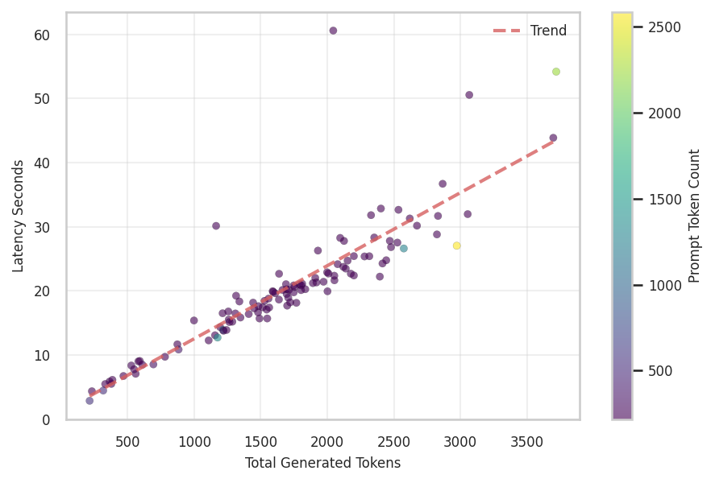](report_assets_20260310_064740/latency_scatter_adk_documentation_agent_gemini-2_5-pro_4K.png)
<br>

**gemini-3-pro-preview**

- **Number of Requests**: 58


- **Correlation**: 0.832 (Very Strong)


**Latency vs Tokens (adk_documentation_agent via gemini-3-pro-preview)**<br>

[](report_assets_20260310_064740/latency_scatter_adk_documentation_agent_gemini-3-pro-preview_4K.png)
<br>

**gemini-3.1-pro-preview**

- **Number of Requests**: 53


- **Correlation**: 0.763 (Strong)


**Latency vs Tokens (adk_documentation_agent via gemini-3.1-pro-preview)**<br>

[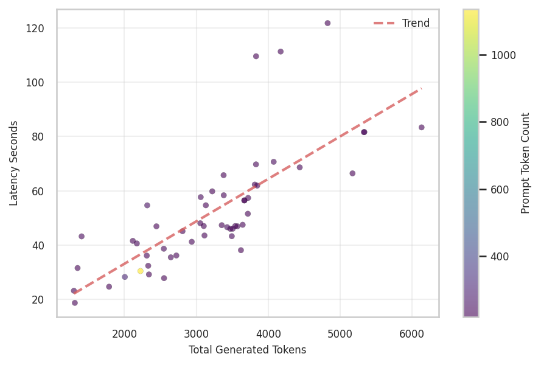](report_assets_20260310_064740/latency_scatter_adk_documentation_agent_gemini-3_1-pro-preview_4K.png)
<br>

#### ai_observability_agent


**gemini-2.5-flash**

- **Number of Requests**: 49


- **Correlation**: 0.706 (Strong)


**Latency vs Tokens (ai_observability_agent via gemini-2.5-flash)**<br>

[](report_assets_20260310_064740/latency_scatter_ai_observability_agent_gemini-2_5-flash_4K.png)
<br>

**gemini-2.5-pro**

- **Number of Requests**: 38


- **Correlation**: 0.604 (Strong)


**Latency vs Tokens (ai_observability_agent via gemini-2.5-pro)**<br>

[](report_assets_20260310_064740/latency_scatter_ai_observability_agent_gemini-2_5-pro_4K.png)
<br>

#### bigquery_data_agent


**gemini-2.5-flash**

- **Number of Requests**: 790


- **Correlation**: 0.810 (Very Strong)


**Latency vs Tokens (bigquery_data_agent via gemini-2.5-flash)**<br>

[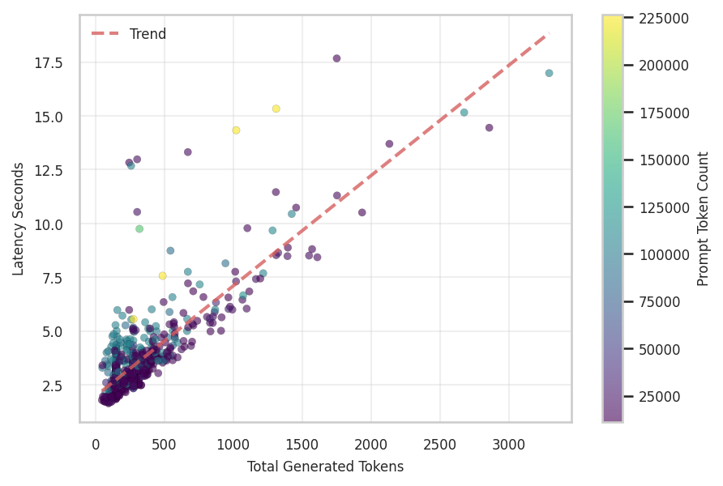](report_assets_20260310_064740/latency_scatter_bigquery_data_agent_gemini-2_5-flash_4K.png)
<br>

**gemini-2.5-pro**

- **Number of Requests**: 446


- **Correlation**: 0.836 (Very Strong)


**Latency vs Tokens (bigquery_data_agent via gemini-2.5-pro)**<br>

[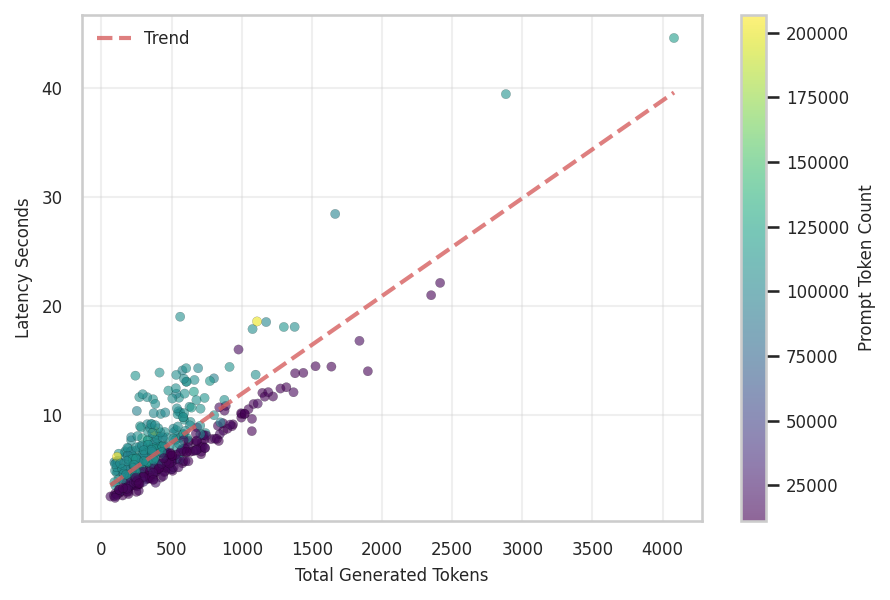](report_assets_20260310_064740/latency_scatter_bigquery_data_agent_gemini-2_5-pro_4K.png)
<br>

**gemini-3-pro-preview**

- **Number of Requests**: 290


- **Correlation**: 0.817 (Very Strong)


**Latency vs Tokens (bigquery_data_agent via gemini-3-pro-preview)**<br>

[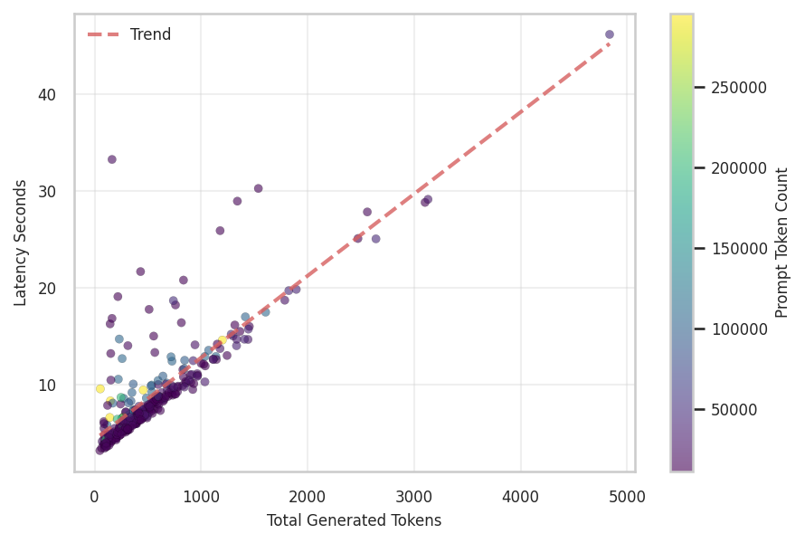](report_assets_20260310_064740/latency_scatter_bigquery_data_agent_gemini-3-pro-preview_4K.png)
<br>

**gemini-3.1-pro-preview**

- **Number of Requests**: 379


- **Correlation**: 0.631 (Strong)


**Latency vs Tokens (bigquery_data_agent via gemini-3.1-pro-preview)**<br>

[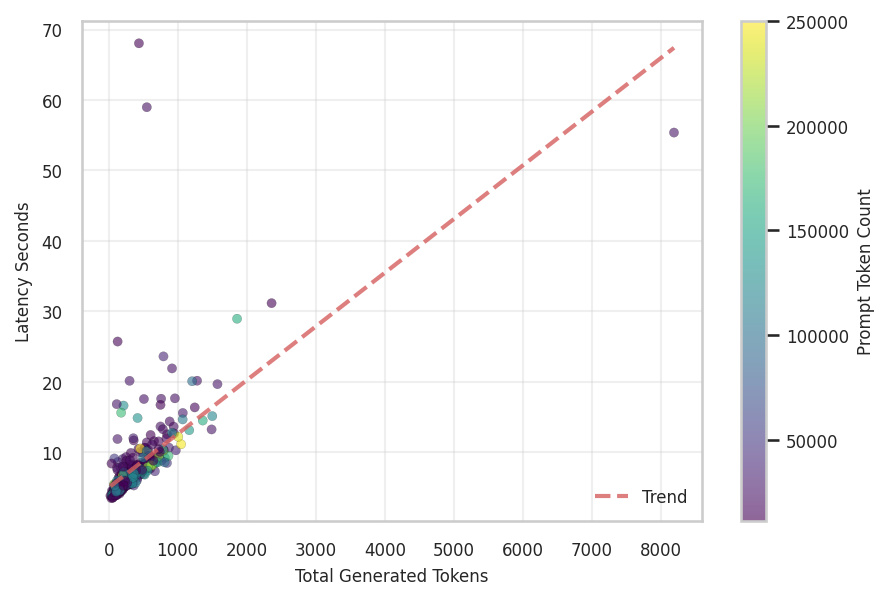](report_assets_20260310_064740/latency_scatter_bigquery_data_agent_gemini-3_1-pro-preview_4K.png)
<br>

#### config_test_agent_high_temp


**gemini-2.5-flash**

- **Number of Requests**: 14


- **Correlation**: 0.958 (Very Strong)


**Latency vs Tokens (config_test_agent_high_temp via gemini-2.5-flash)**<br>

[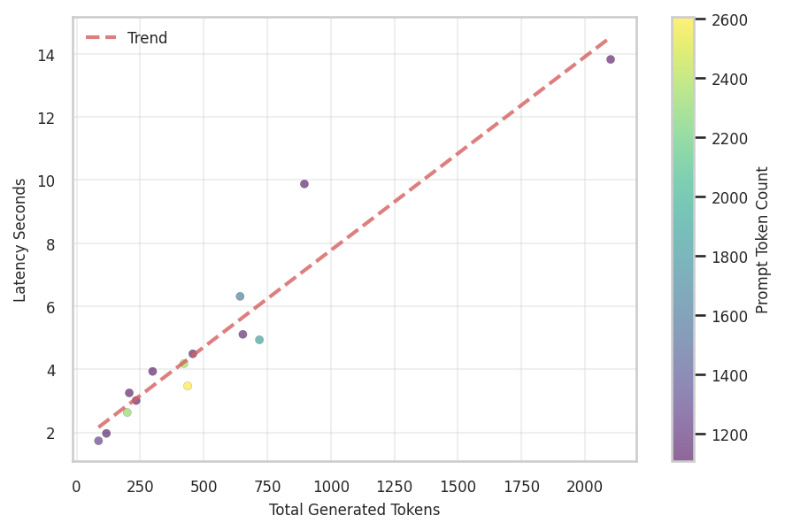](report_assets_20260310_064740/latency_scatter_config_test_agent_high_temp_gemini-2_5-flash_4K.png)
<br>

**gemini-2.5-pro**

- **Number of Requests**: 9


- **Correlation**: 0.990 (Very Strong)


**Latency vs Tokens (config_test_agent_high_temp via gemini-2.5-pro)**<br>

[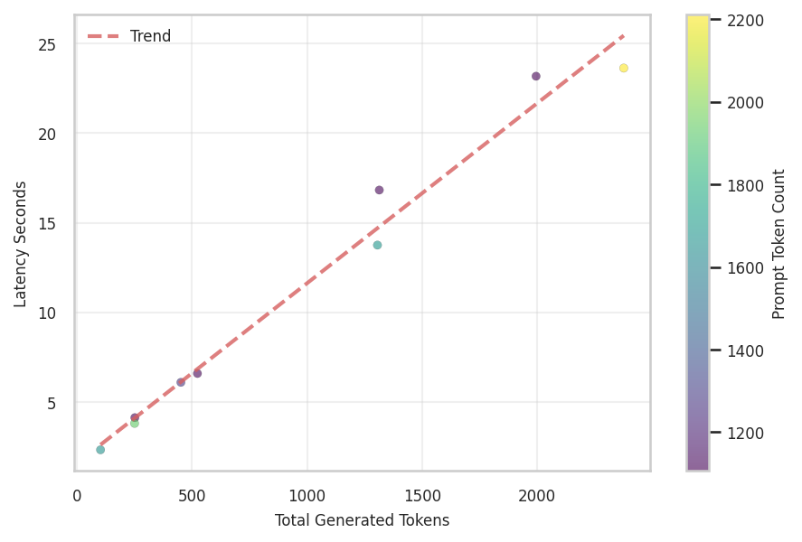](report_assets_20260310_064740/latency_scatter_config_test_agent_high_temp_gemini-2_5-pro_4K.png)
<br>

**gemini-3-pro-preview**

- **Number of Requests**: 10


- **Correlation**: 0.981 (Very Strong)


**Latency vs Tokens (config_test_agent_high_temp via gemini-3-pro-preview)**<br>

[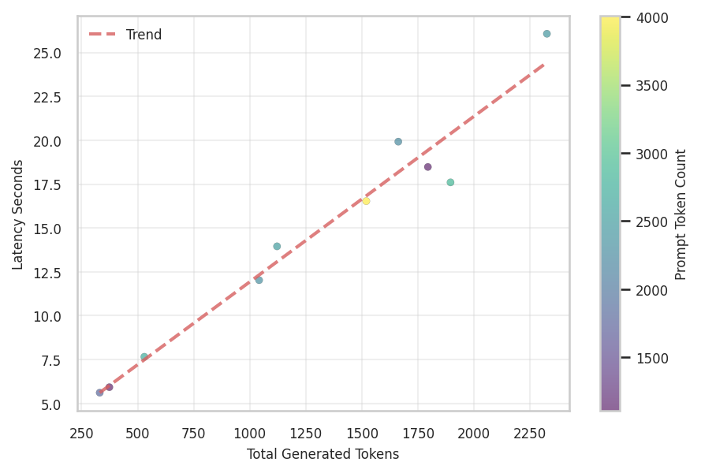](report_assets_20260310_064740/latency_scatter_config_test_agent_high_temp_gemini-3-pro-preview_4K.png)
<br>

**gemini-3.1-pro-preview**

- **Number of Requests**: 8


- **Correlation**: 0.948 (Very Strong)


**Latency vs Tokens (config_test_agent_high_temp via gemini-3.1-pro-preview)**<br>

[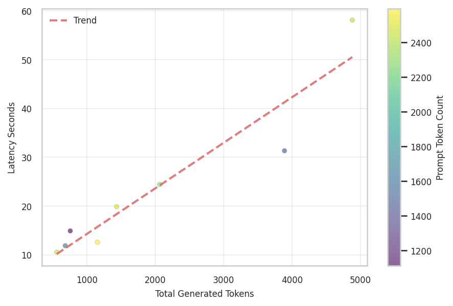](report_assets_20260310_064740/latency_scatter_config_test_agent_high_temp_gemini-3_1-pro-preview_4K.png)
<br>

#### config_test_agent_normal


**gemini-2.5-flash**

- **Number of Requests**: 55


- **Correlation**: 0.830 (Very Strong)


**Latency vs Tokens (config_test_agent_normal via gemini-2.5-flash)**<br>

[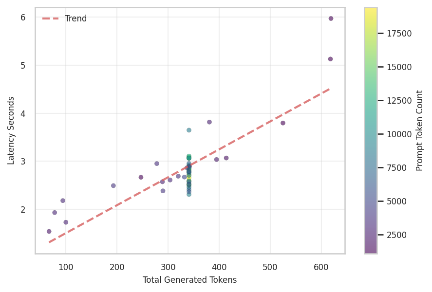](report_assets_20260310_064740/latency_scatter_config_test_agent_normal_gemini-2_5-flash_4K.png)
<br>

**gemini-2.5-pro**

- **Number of Requests**: 10


- **Correlation**: 0.996 (Very Strong)


**Latency vs Tokens (config_test_agent_normal via gemini-2.5-pro)**<br>

[](report_assets_20260310_064740/latency_scatter_config_test_agent_normal_gemini-2_5-pro_4K.png)
<br>

**gemini-3-pro-preview**

- **Number of Requests**: 10


- **Correlation**: 0.689 (Strong)


**Latency vs Tokens (config_test_agent_normal via gemini-3-pro-preview)**<br>

[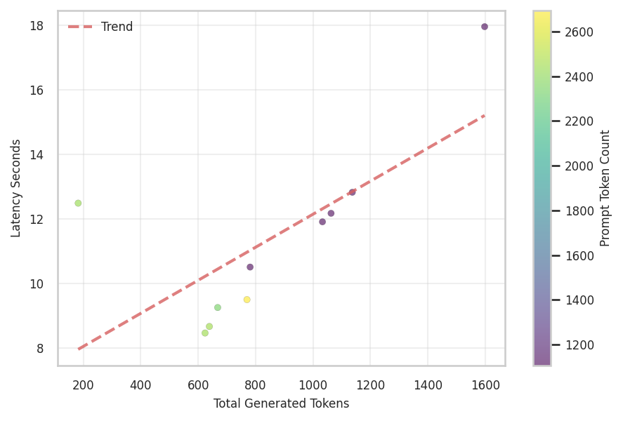](report_assets_20260310_064740/latency_scatter_config_test_agent_normal_gemini-3-pro-preview_4K.png)
<br>

**gemini-3.1-pro-preview**

- **Number of Requests**: 10


- **Correlation**: 0.985 (Very Strong)


**Latency vs Tokens (config_test_agent_normal via gemini-3.1-pro-preview)**<br>

[](report_assets_20260310_064740/latency_scatter_config_test_agent_normal_gemini-3_1-pro-preview_4K.png)
<br>

#### config_test_agent_over_provisioned


**gemini-2.5-flash**

- **Number of Requests**: 18


- **Correlation**: 0.962 (Very Strong)


**Latency vs Tokens (config_test_agent_over_provisioned via gemini-2.5-flash)**<br>

[](report_assets_20260310_064740/latency_scatter_config_test_agent_over_provisioned_gemini-2_5-flash_4K.png)
<br>

**gemini-2.5-pro**

- **Number of Requests**: 25


- **Correlation**: 0.993 (Very Strong)


**Latency vs Tokens (config_test_agent_over_provisioned via gemini-2.5-pro)**<br>

[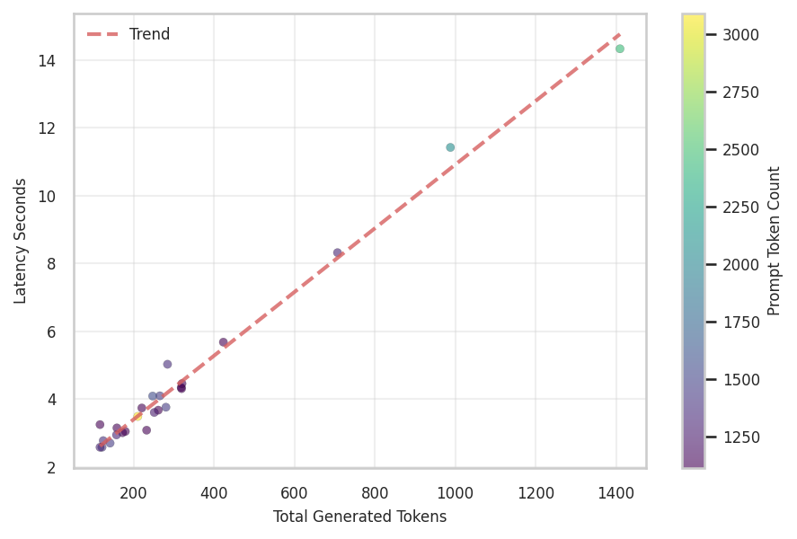](report_assets_20260310_064740/latency_scatter_config_test_agent_over_provisioned_gemini-2_5-pro_4K.png)
<br>

**gemini-3-pro-preview**

- **Number of Requests**: 13


- **Correlation**: 0.912 (Very Strong)


**Latency vs Tokens (config_test_agent_over_provisioned via gemini-3-pro-preview)**<br>

[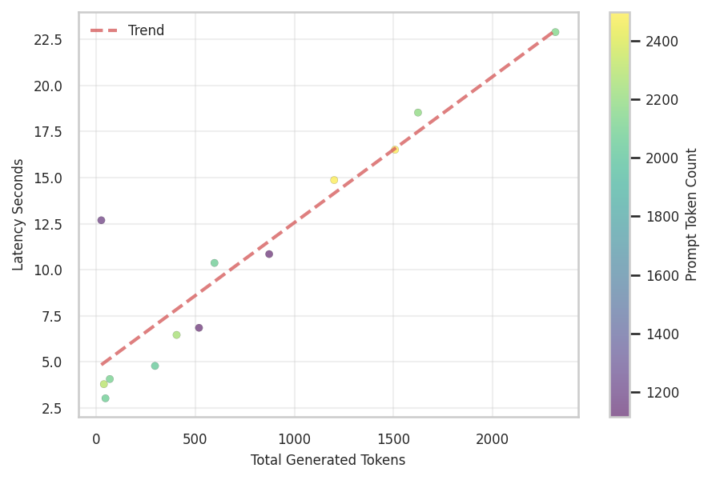](report_assets_20260310_064740/latency_scatter_config_test_agent_over_provisioned_gemini-3-pro-preview_4K.png)
<br>

**gemini-3.1-pro-preview**

- **Number of Requests**: 19


- **Correlation**: 0.976 (Very Strong)


**Latency vs Tokens (config_test_agent_over_provisioned via gemini-3.1-pro-preview)**<br>

[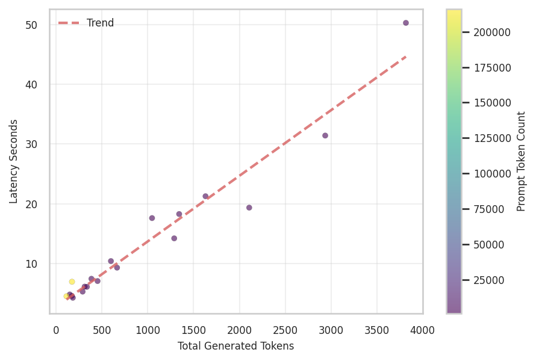](report_assets_20260310_064740/latency_scatter_config_test_agent_over_provisioned_gemini-3_1-pro-preview_4K.png)
<br>

#### config_test_agent_wrong_candidates


**gemini-2.5-flash**

- **Number of Requests**: 20


- **Correlation**: 0.848 (Very Strong)


**Latency vs Tokens (config_test_agent_wrong_candidates via gemini-2.5-flash)**<br>

[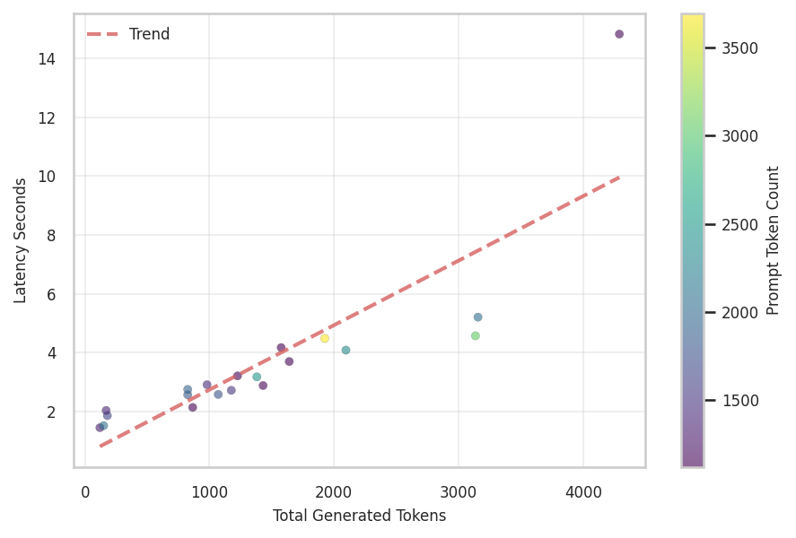](report_assets_20260310_064740/latency_scatter_config_test_agent_wrong_candidates_gemini-2_5-flash_4K.png)
<br>

**gemini-2.5-pro**

- **Number of Requests**: 13


- **Correlation**: 0.928 (Very Strong)


**Latency vs Tokens (config_test_agent_wrong_candidates via gemini-2.5-pro)**<br>

[](report_assets_20260310_064740/latency_scatter_config_test_agent_wrong_candidates_gemini-2_5-pro_4K.png)
<br>

**gemini-3-pro-preview**

- **Number of Requests**: 7


- **Correlation**: 0.674 (Strong)


**Latency vs Tokens (config_test_agent_wrong_candidates via gemini-3-pro-preview)**<br>

[](report_assets_20260310_064740/latency_scatter_config_test_agent_wrong_candidates_gemini-3-pro-preview_4K.png)
<br>

**gemini-3.1-pro-preview**

- **Number of Requests**: 9


- **Correlation**: 0.631 (Strong)


**Latency vs Tokens (config_test_agent_wrong_candidates via gemini-3.1-pro-preview)**<br>

[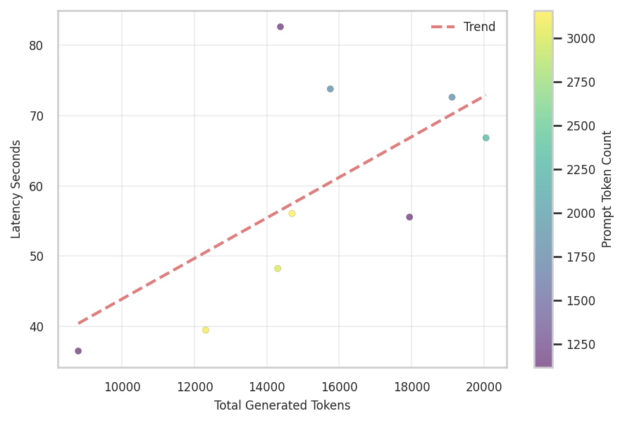](report_assets_20260310_064740/latency_scatter_config_test_agent_wrong_candidates_gemini-3_1-pro-preview_4K.png)
<br>

#### google_search_agent


**gemini-2.5-flash**

- **Number of Requests**: 51


- **Correlation**: 0.938 (Very Strong)


**Latency vs Tokens (google_search_agent via gemini-2.5-flash)**<br>

[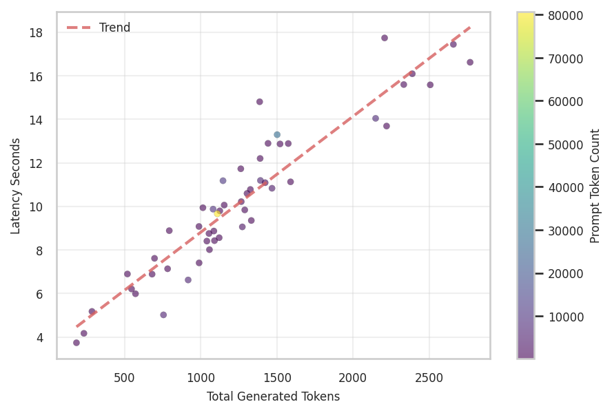](report_assets_20260310_064740/latency_scatter_google_search_agent_gemini-2_5-flash_4K.png)
<br>

**gemini-2.5-pro**

- **Number of Requests**: 77


- **Correlation**: 0.743 (Strong)


**Latency vs Tokens (google_search_agent via gemini-2.5-pro)**<br>

[](report_assets_20260310_064740/latency_scatter_google_search_agent_gemini-2_5-pro_4K.png)
<br>

**gemini-3-pro-preview**

- **Number of Requests**: 15


- **Correlation**: 0.768 (Strong)


**Latency vs Tokens (google_search_agent via gemini-3-pro-preview)**<br>

[](report_assets_20260310_064740/latency_scatter_google_search_agent_gemini-3-pro-preview_4K.png)
<br>

**gemini-3.1-pro-preview**

- **Number of Requests**: 20


- **Correlation**: 0.957 (Very Strong)


**Latency vs Tokens (google_search_agent via gemini-3.1-pro-preview)**<br>

[](report_assets_20260310_064740/latency_scatter_google_search_agent_gemini-3_1-pro-preview_4K.png)
<br>

#### knowledge_qa_supervisor


**gemini-2.5-flash**

- **Number of Requests**: 1106


- **Correlation**: 0.872 (Very Strong)


**Latency vs Tokens (knowledge_qa_supervisor via gemini-2.5-flash)**<br>

[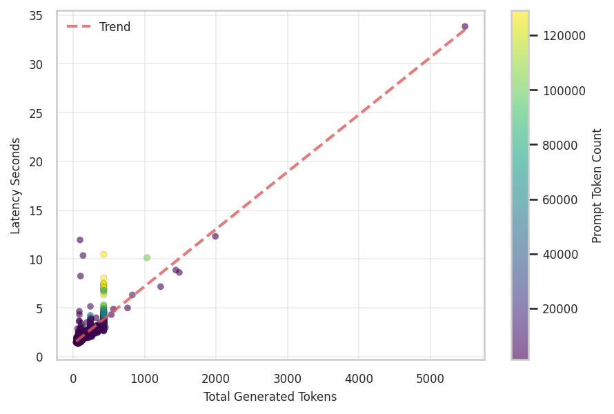](report_assets_20260310_064740/latency_scatter_knowledge_qa_supervisor_gemini-2_5-flash_4K.png)
<br>

**gemini-2.5-pro**

- **Number of Requests**: 669


- **Correlation**: 0.956 (Very Strong)


**Latency vs Tokens (knowledge_qa_supervisor via gemini-2.5-pro)**<br>

[](report_assets_20260310_064740/latency_scatter_knowledge_qa_supervisor_gemini-2_5-pro_4K.png)
<br>

**gemini-3-pro-preview**

- **Number of Requests**: 276


- **Correlation**: 0.578 (Moderate)


**Latency vs Tokens (knowledge_qa_supervisor via gemini-3-pro-preview)**<br>

[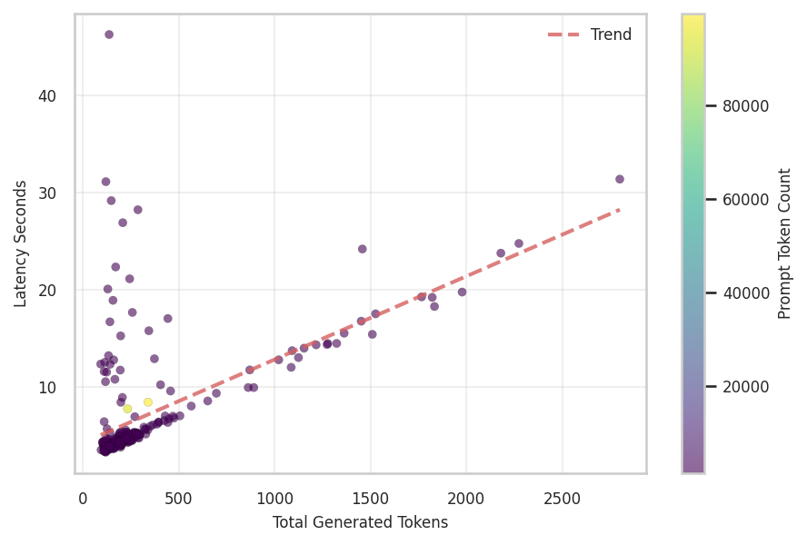](report_assets_20260310_064740/latency_scatter_knowledge_qa_supervisor_gemini-3-pro-preview_4K.png)
<br>

**gemini-3.1-pro-preview**

- **Number of Requests**: 242


- **Correlation**: 0.866 (Very Strong)


**Latency vs Tokens (knowledge_qa_supervisor via gemini-3.1-pro-preview)**<br>

[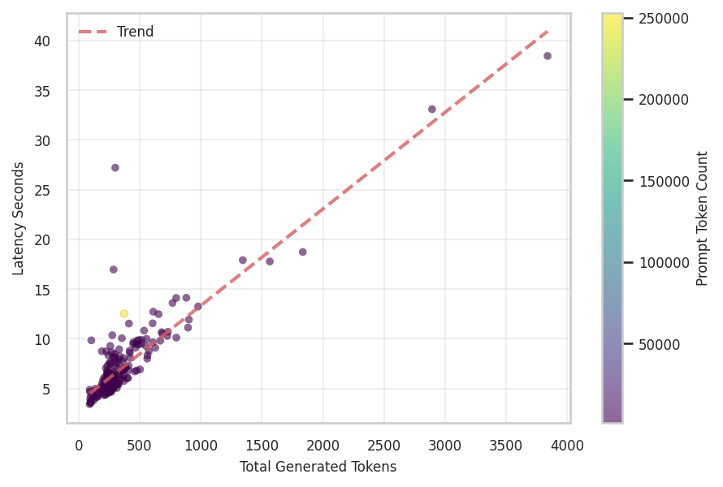](report_assets_20260310_064740/latency_scatter_knowledge_qa_supervisor_gemini-3_1-pro-preview_4K.png)
<br>

#### lookup_worker_1


**gemini-2.5-flash**

- **Number of Requests**: 83


- **Correlation**: 0.403 (Moderate)


**Latency vs Tokens (lookup_worker_1 via gemini-2.5-flash)**<br>

[](report_assets_20260310_064740/latency_scatter_lookup_worker_1_gemini-2_5-flash_4K.png)
<br>

**gemini-2.5-pro**

- **Number of Requests**: 52


- **Correlation**: 0.962 (Very Strong)


**Latency vs Tokens (lookup_worker_1 via gemini-2.5-pro)**<br>

[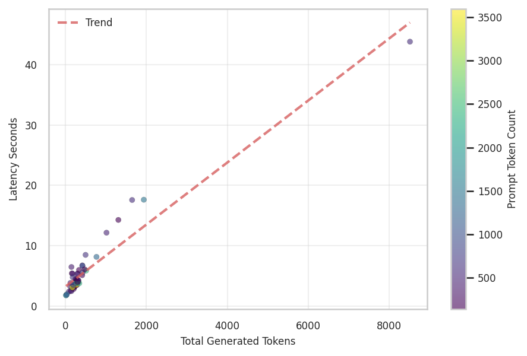](report_assets_20260310_064740/latency_scatter_lookup_worker_1_gemini-2_5-pro_4K.png)
<br>

**gemini-3-pro-preview**

- **Number of Requests**: 65


- **Correlation**: 0.824 (Very Strong)


**Latency vs Tokens (lookup_worker_1 via gemini-3-pro-preview)**<br>

[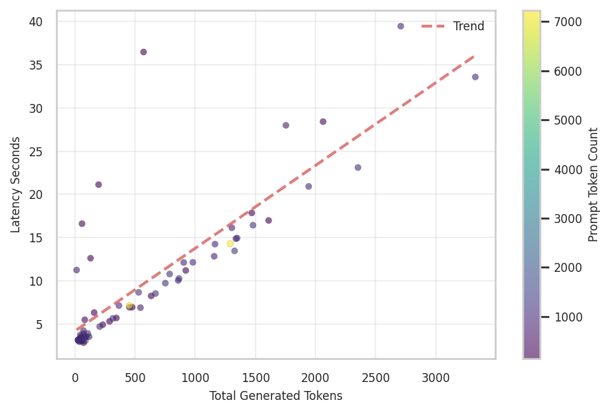](report_assets_20260310_064740/latency_scatter_lookup_worker_1_gemini-3-pro-preview_4K.png)
<br>

**gemini-3.1-pro-preview**

- **Number of Requests**: 56


- **Correlation**: 0.557 (Moderate)


**Latency vs Tokens (lookup_worker_1 via gemini-3.1-pro-preview)**<br>

[](report_assets_20260310_064740/latency_scatter_lookup_worker_1_gemini-3_1-pro-preview_4K.png)
<br>

#### lookup_worker_2


**gemini-2.5-flash**

- **Number of Requests**: 84


- **Correlation**: 0.284 (Weak)


**Latency vs Tokens (lookup_worker_2 via gemini-2.5-flash)**<br>

[](report_assets_20260310_064740/latency_scatter_lookup_worker_2_gemini-2_5-flash_4K.png)
<br>

**gemini-2.5-pro**

- **Number of Requests**: 52


- **Correlation**: 0.873 (Very Strong)


**Latency vs Tokens (lookup_worker_2 via gemini-2.5-pro)**<br>

[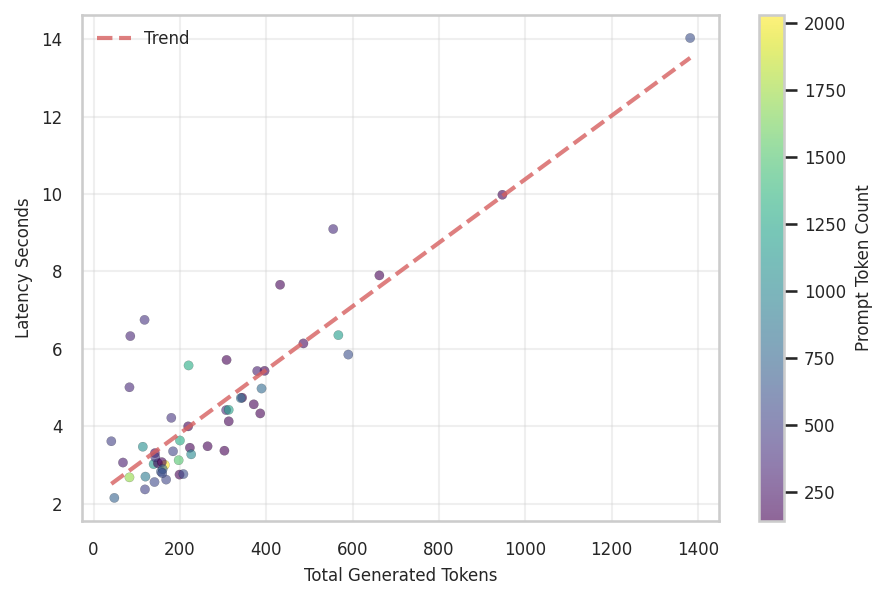](report_assets_20260310_064740/latency_scatter_lookup_worker_2_gemini-2_5-pro_4K.png)
<br>

**gemini-3-pro-preview**

- **Number of Requests**: 60


- **Correlation**: 0.949 (Very Strong)


**Latency vs Tokens (lookup_worker_2 via gemini-3-pro-preview)**<br>

[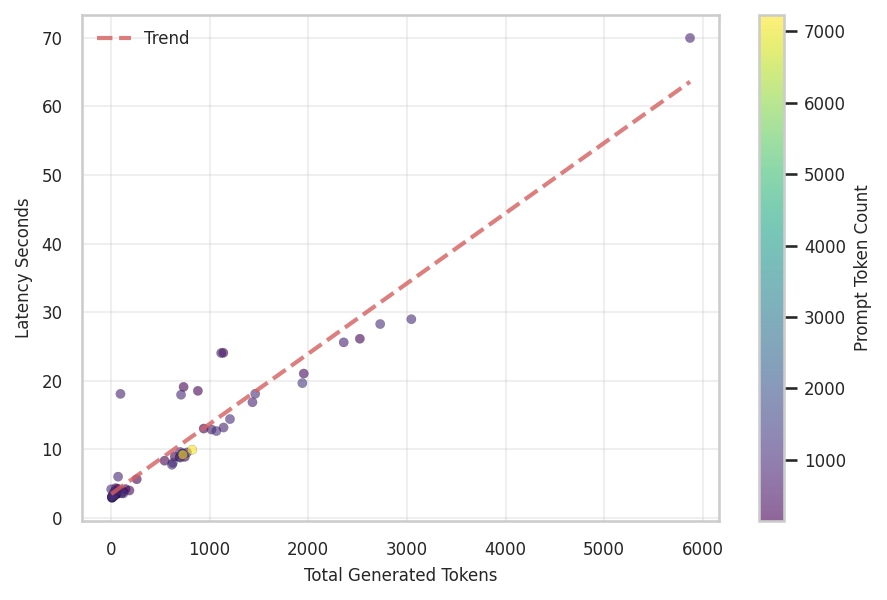](report_assets_20260310_064740/latency_scatter_lookup_worker_2_gemini-3-pro-preview_4K.png)
<br>

**gemini-3.1-pro-preview**

- **Number of Requests**: 54


- **Correlation**: 0.958 (Very Strong)


**Latency vs Tokens (lookup_worker_2 via gemini-3.1-pro-preview)**<br>

[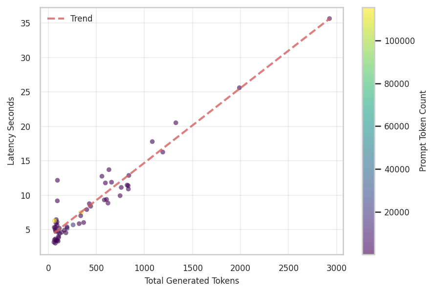](report_assets_20260310_064740/latency_scatter_lookup_worker_2_gemini-3_1-pro-preview_4K.png)
<br>

#### lookup_worker_3


**gemini-2.5-flash**

- **Number of Requests**: 87


- **Correlation**: 0.117 (Very Weak / None)


**Latency vs Tokens (lookup_worker_3 via gemini-2.5-flash)**<br>

[](report_assets_20260310_064740/latency_scatter_lookup_worker_3_gemini-2_5-flash_4K.png)
<br>

**gemini-2.5-pro**

- **Number of Requests**: 50


- **Correlation**: 0.973 (Very Strong)


**Latency vs Tokens (lookup_worker_3 via gemini-2.5-pro)**<br>

[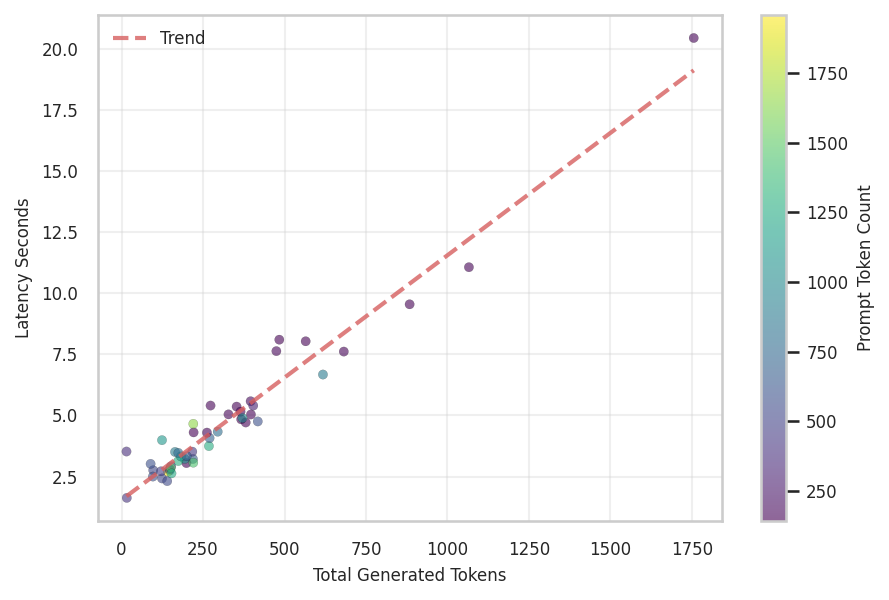](report_assets_20260310_064740/latency_scatter_lookup_worker_3_gemini-2_5-pro_4K.png)
<br>

**gemini-3-pro-preview**

- **Number of Requests**: 62


- **Correlation**: 0.931 (Very Strong)


**Latency vs Tokens (lookup_worker_3 via gemini-3-pro-preview)**<br>

[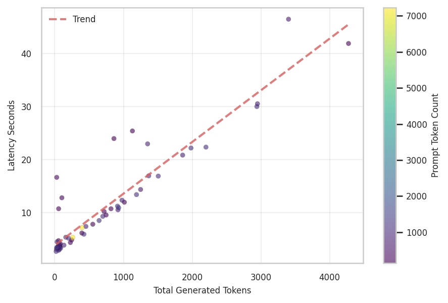](report_assets_20260310_064740/latency_scatter_lookup_worker_3_gemini-3-pro-preview_4K.png)
<br>

**gemini-3.1-pro-preview**

- **Number of Requests**: 56


- **Correlation**: 0.843 (Very Strong)


**Latency vs Tokens (lookup_worker_3 via gemini-3.1-pro-preview)**<br>

[](report_assets_20260310_064740/latency_scatter_lookup_worker_3_gemini-3_1-pro-preview_4K.png)
<br>

#### unreliable_tool_agent


**gemini-2.5-flash**

- **Number of Requests**: 24


- **Correlation**: 0.884 (Very Strong)


**Latency vs Tokens (unreliable_tool_agent via gemini-2.5-flash)**<br>

[](report_assets_20260310_064740/latency_scatter_unreliable_tool_agent_gemini-2_5-flash_4K.png)
<br>

**gemini-2.5-pro**

- **Number of Requests**: 67


- **Correlation**: 0.958 (Very Strong)


**Latency vs Tokens (unreliable_tool_agent via gemini-2.5-pro)**<br>

[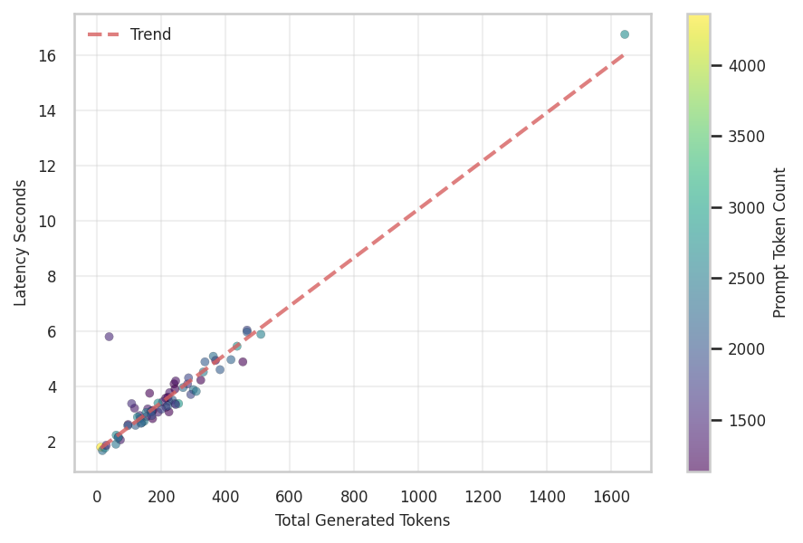](report_assets_20260310_064740/latency_scatter_unreliable_tool_agent_gemini-2_5-pro_4K.png)
<br>

**gemini-3-pro-preview**

- **Number of Requests**: 26


- **Correlation**: 0.634 (Strong)


**Latency vs Tokens (unreliable_tool_agent via gemini-3-pro-preview)**<br>

[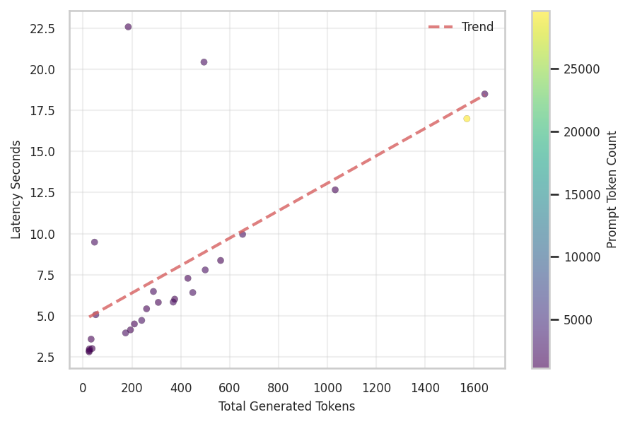](report_assets_20260310_064740/latency_scatter_unreliable_tool_agent_gemini-3-pro-preview_4K.png)
<br>


## Recommendations

1. **Correct Critical Agent Configurations:** Immediately fix the `max_output_tokens` parameter for the `config_test_agent_wrong_max_tokens` agent to a value within the model's supported range (e.g., 8192). For the `ai_observability_agent`, update its configuration to point to a valid Vertex AI Search datastore ID and significantly increase the `discoveryengine.googleapis.com` regional search requests quota to prevent `429` errors.
2. **Enhance LLM Prompt Engineering for Function Calling:** The system prompt for `bigquery_data_agent` must be revised to mitigate tool name hallucination. Provide explicit instructions and few-shot examples that reinforce the use of the correct `list_table_ids` function instead of the non-existent `list_tables`.
3. **Optimize for Agent Overhead:** The code for the `config_test_agent_normal` and `bigquery_data_agent` must be profiled to identify the source of the extreme (200s+) internal overhead. These agents are spending the vast majority of their time in their own code, not waiting on LLMs or tools, indicating a critical need for code optimization.
4. **Address Orchestration-Layer Timeouts:** The high volume of `PENDING` timeouts across the entire system points to a fundamental issue with resource allocation or task scheduling. The worker pool capacity and scaling policies for the agent execution environment must be investigated and likely increased to handle the request volume and prevent tasks from starving.
5. **Mitigate "Thought Bloat" in Prompts:** Review and revise the prompts for agents exhibiting high thought-to-output token ratios, particularly the `adk_documentation_agent`. Prompts should be engineered to be more concise and guide the model towards generating a direct answer with less internal monologue, which will drastically improve TTFT and reduce latency. Consider switching these agents to models like `gemini-2.5-flash`, which has shown lower latency and a weaker correlation between thought tokens and latency.


### Holistic Cross-Section Analysis
The ecosystem's health is critically compromised, with end-to-end invocations failing at a rate of 43.55% and exhibiting a mean latency of 30.8 seconds—more than triple the 10-second target. These top-level failures are not isolated but are symptomatic of cascading issues across all underlying layers: Sub-Agent, Model, and Tool.

The primary driver of these failures is a systemic breakdown in agent reliability and performance. The `ai_observability_agent` and `bigquery_data_agent` are the most severe offenders, with staggering error rates of 87.85% and 66.27%, respectively. The `ai_observability_agent`'s failures stem from a combination of misconfigurations, including a non-existent Vertex AI Search datastore (`invalid-obs-ds`) and consistent quota exhaustion errors from its underlying `discoveryengine.googleapis.com` dependency. The `bigquery_data_agent` failures are largely attributable to LLM hallucinations, where the model consistently attempts to invoke a non-existent `list_tables` tool instead of the correctly registered `list_table_ids`, causing an immediate `TOOL_NOT_FOUND` error.

Furthermore, a significant portion of the overall 43.55% end-to-end error rate is caused by `TIMEOUT` errors, where invocations remain `PENDING` for over 5 minutes. This indicates a critical failure in the task orchestration and scheduling layer, suggesting worker pool saturation or a stalled message queue that prevents agents from even starting execution. This is exemplified by the `config_test_agent_wrong_max_tokens`, which has a 100% error rate because its invalid model parameters cause it to be rejected by the model API, preventing it from ever running.

Performance degradation is equally alarming. Extreme latency in successful traces is not primarily due to slow tool or model execution but rather to massive, inefficient **Agent Overhead**. The `config_test_agent_normal` and `bigquery_data_agent` exhibit P95.5 overheads of 203 and 189 seconds, respectively, indicating that the agent's own code—likely inefficient loops or data processing—is the bottleneck. Concurrently, agents like `adk_documentation_agent` suffer from LLM "thought bloat," where models such as `gemini-3-pro-preview` generate an excessive number of internal "thought" tokens (up to 7,729 in one case), leading to extreme Time-To-First-Token (TTFT) and overall latency.

## Critical Workflow Failures
*   **Invalid Model Configuration Leading to Mass Failures:** The `config_test_agent_wrong_max_tokens` agent failed in 100% of its 111 requests. Deeper analysis of trace [`bd3cde8417a87d2068a7b0da49dec2d0`](https://console.cloud.google.com/traces/explorer;traceId=bd3cde8417a87d2068a7b0da49dec2d0?project=agent-operations-ek-05) reveals the root cause: the agent was configured with `max_output_tokens` set to 65538. This triggered a `400 INVALID_ARGUMENT` error from the `gemini-2.5-flash` model, which has a maximum supported value of 65537. The agent was never able to start, leading to a supervisory timeout. This single configuration error was responsible for over 13% of all agent-level errors.

*   **LLM Hallucination of Tool Names:** The `bigquery_data_agent` is the second most-used agent but has a 66% error rate, crippling many data-related workflows. The primary cause, seen in trace [`538157a3ad7579d425e2dae69730d4b8`](https://console.cloud.google.com/traces/explorer;traceId=538157a3ad7579d425e2dae69730d4b8?project=agent-operations-ek-05), is the LLM repeatedly calling the hallucinated tool `list_tables` instead of the correct `list_table_ids`. The error message is explicit: `Tool 'list_tables' not found`. This function-calling failure prevents the agent from discovering and querying tables, leading to immediate termination of the task.

*   **Recursive Routing Loops:** In trace [`d0ddedbe54e33294894d6edc693a2fee`](https://console.cloud.google.com/traces/explorer;traceId=d0ddedbe54e33294894d6edc693a2fee?project=agent-operations-ek-05), the system encountered a fatal `maximum recursion depth exceeded` error. The `knowledge_qa_supervisor` agent incorrectly delegated a GCS export task to `bigquery_data_agent`. The BigQuery agent, lacking the GCS tool, escalated back to the supervisor, which then re-delegated, creating an infinite loop that crashed the system.

*   **Excessive "Thought Bloat" Causing Timeouts:** The slowest successful query in the entire system, trace [`0eef485489704876ef8d70b9da0d870c`](https://console.cloud.google.com/traces/explorer;traceId=0eef485489704876ef8d70b9da0d870c?project=agent-operations-ek-05), took 270 seconds. The bottleneck was a single LLM call from the `adk_documentation_agent` that lasted 266.5 seconds. The model, `gemini-3-pro-preview`, generated 7,729 "thought" tokens before producing a 584-token answer. This extreme "thought bloat" consumed the entire request duration, resulting in a severe performance failure despite a successful status.

## Architectural Recommendations
1.  **Correct Critical Agent Configurations:** Immediately fix the `max_output_tokens` parameter for the `config_test_agent_wrong_max_tokens` agent to a value within the model's supported range (e.g., 8192). For the `ai_observability_agent`, update its configuration to point to a valid Vertex AI Search datastore ID and significantly increase the `discoveryengine.googleapis.com` regional search requests quota to prevent `429` errors.

2.  **Enhance LLM Prompt Engineering for Function Calling:** The system prompt for `bigquery_data_agent` must be revised to mitigate tool name hallucination. Provide explicit instructions and few-shot examples that reinforce the use of the correct `list_table_ids` function instead of the non-existent `list_tables`.

3.  **Optimize for Agent Overhead:** The code for the `config_test_agent_normal` and `bigquery_data_agent` must be profiled to identify the source of the extreme (200s+) internal overhead. These agents are spending the vast majority of their time in their own code, not waiting on LLMs or tools, indicating a critical need for code optimization.

4.  **Address Orchestration-Layer Timeouts:** The high volume of `PENDING` timeouts across the entire system points to a fundamental issue with resource allocation or task scheduling. The worker pool capacity and scaling policies for the agent execution environment must be investigated and likely increased to handle the request volume and prevent tasks from starving.

5.  **Mitigate "Thought Bloat" in Prompts:** Review and revise the prompts for agents exhibiting high thought-to-output token ratios, particularly the `adk_documentation_agent`. Prompts should be engineered to be more concise and guide the model towards generating a direct answer with less internal monologue, which will drastically improve TTFT and reduce latency. Consider switching these agents to models like `gemini-2.5-flash`, which has shown lower latency and a weaker correlation between thought tokens and latency.

# Appendix


### Agent Latency (By Model)

These charts breakdown the Agent execution sequences further by the underlying LLM model used for that request. This helps isolate whether an Agent's latency spike is tied to a specific model's degradation.


#### adk_documentation_agent

**Total Requests:** 96


**adk_documentation_agent via gemini-2.5-flash Latency Sequence**<br>
**Total Requests:** 96<br>

[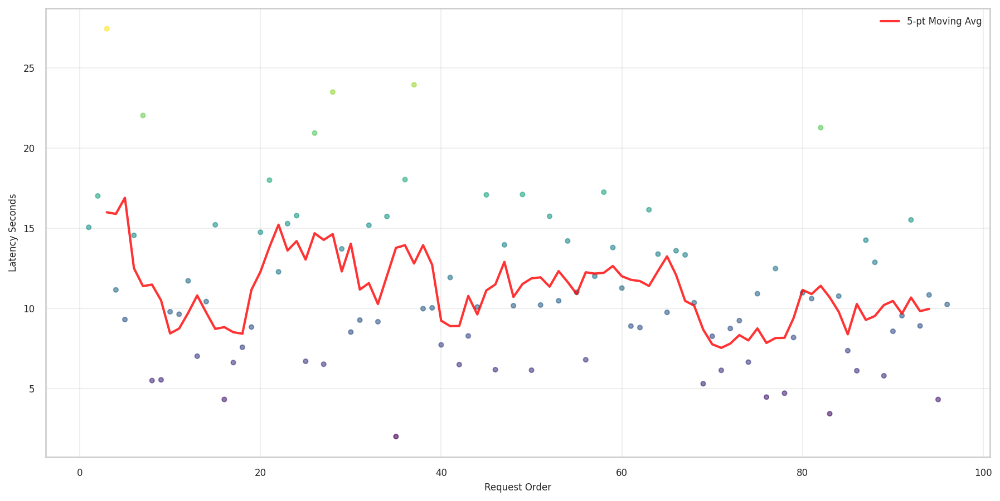](report_assets_20260310_064740/seq_agent_model_adk_documentation_agent_gemini-2_5-flash_4K.png)
<br>

**Total Requests:** 113


**adk_documentation_agent via gemini-2.5-pro Latency Sequence**<br>
**Total Requests:** 113<br>

[](report_assets_20260310_064740/seq_agent_model_adk_documentation_agent_gemini-2_5-pro_4K.png)
<br>

**Total Requests:** 58


**adk_documentation_agent via gemini-3-pro-preview Latency Sequence**<br>
**Total Requests:** 58<br>

[](report_assets_20260310_064740/seq_agent_model_adk_documentation_agent_gemini-3-pro-preview_4K.png)
<br>

**Total Requests:** 54


**adk_documentation_agent via gemini-3.1-pro-preview Latency Sequence**<br>
**Total Requests:** 54<br>

[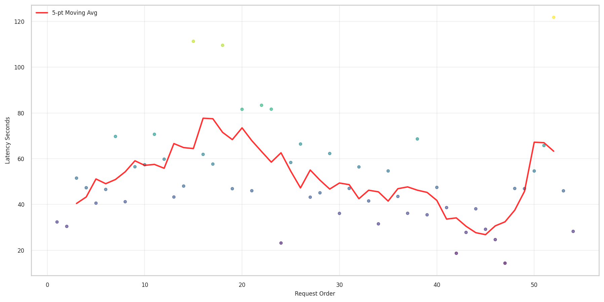](report_assets_20260310_064740/seq_agent_model_adk_documentation_agent_gemini-3_1-pro-preview_4K.png)
<br>


#### ai_observability_agent

**Total Requests:** 50


**ai_observability_agent via gemini-2.5-flash Latency Sequence**<br>
**Total Requests:** 50<br>

[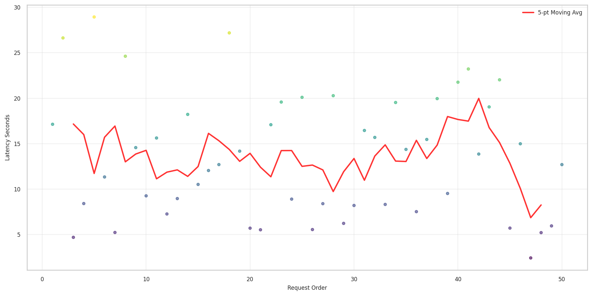](report_assets_20260310_064740/seq_agent_model_ai_observability_agent_gemini-2_5-flash_4K.png)
<br>

**Total Requests:** 38


**ai_observability_agent via gemini-2.5-pro Latency Sequence**<br>
**Total Requests:** 38<br>

[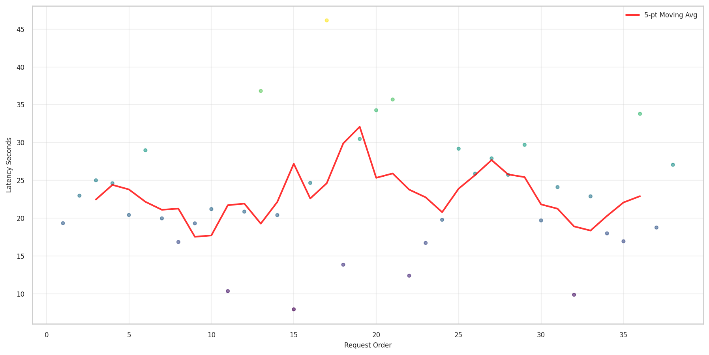](report_assets_20260310_064740/seq_agent_model_ai_observability_agent_gemini-2_5-pro_4K.png)
<br>


#### bigquery_data_agent

**Total Requests:** 388


**bigquery_data_agent via gemini-2.5-flash Latency Sequence**<br>
**Total Requests:** 388<br>

[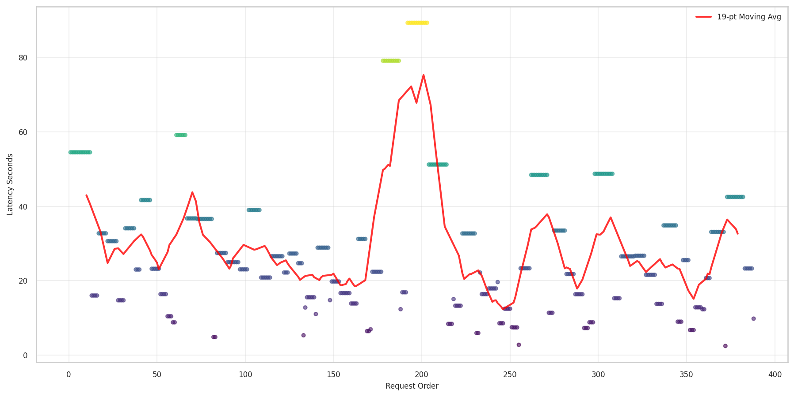](report_assets_20260310_064740/seq_agent_model_bigquery_data_agent_gemini-2_5-flash_4K.png)
<br>

**Total Requests:** 427


**bigquery_data_agent via gemini-2.5-pro Latency Sequence**<br>
**Total Requests:** 427<br>

[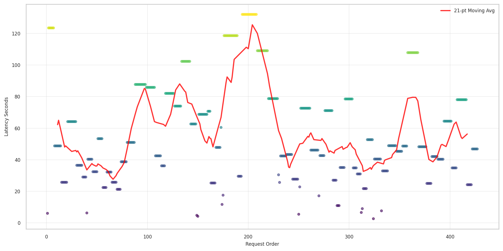](report_assets_20260310_064740/seq_agent_model_bigquery_data_agent_gemini-2_5-pro_4K.png)
<br>

**Total Requests:** 180


**bigquery_data_agent via gemini-3-pro-preview Latency Sequence**<br>
**Total Requests:** 180<br>

[](report_assets_20260310_064740/seq_agent_model_bigquery_data_agent_gemini-3-pro-preview_4K.png)
<br>

**Total Requests:** 360


**bigquery_data_agent via gemini-3.1-pro-preview Latency Sequence**<br>
**Total Requests:** 360<br>

[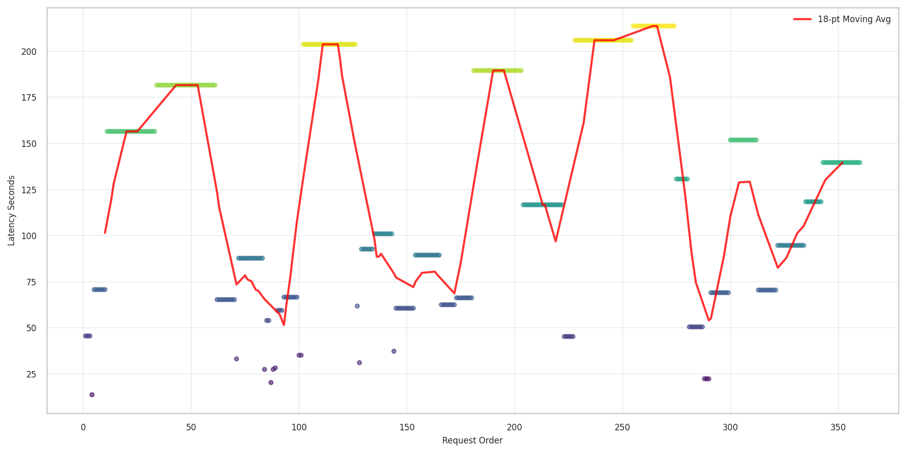](report_assets_20260310_064740/seq_agent_model_bigquery_data_agent_gemini-3_1-pro-preview_4K.png)
<br>


#### config_test_agent_high_temp

**Total Requests:** 14


**config_test_agent_high_temp via gemini-2.5-flash Latency Sequence**<br>
**Total Requests:** 14<br>

[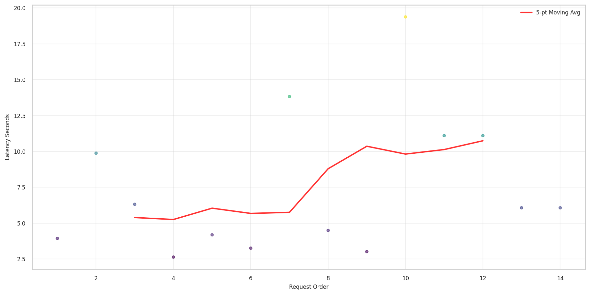](report_assets_20260310_064740/seq_agent_model_config_test_agent_high_temp_gemini-2_5-flash_4K.png)
<br>

**Total Requests:** 9


**config_test_agent_high_temp via gemini-2.5-pro Latency Sequence**<br>
**Total Requests:** 9<br>

[](report_assets_20260310_064740/seq_agent_model_config_test_agent_high_temp_gemini-2_5-pro_4K.png)
<br>

**Total Requests:** 10


**config_test_agent_high_temp via gemini-3-pro-preview Latency Sequence**<br>
**Total Requests:** 10<br>

[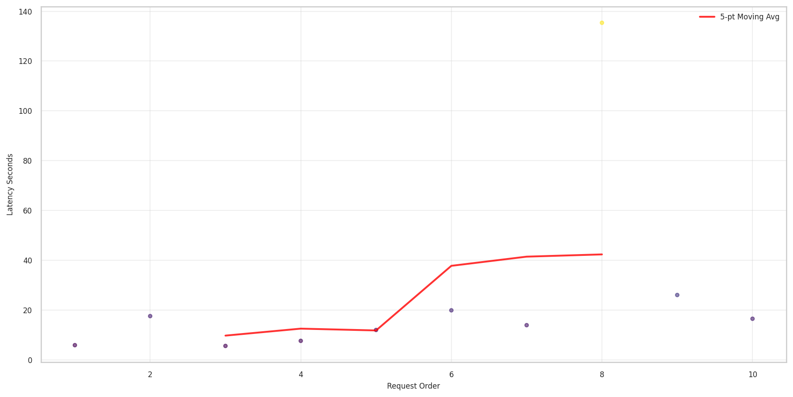](report_assets_20260310_064740/seq_agent_model_config_test_agent_high_temp_gemini-3-pro-preview_4K.png)
<br>

**Total Requests:** 8


**config_test_agent_high_temp via gemini-3.1-pro-preview Latency Sequence**<br>
**Total Requests:** 8<br>

[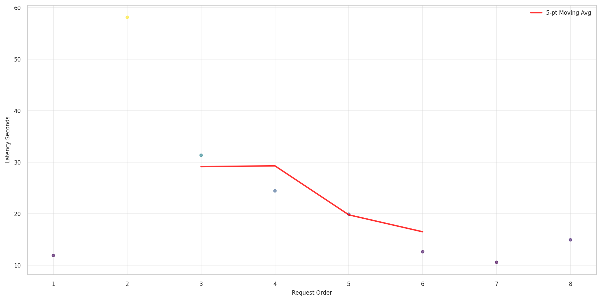](report_assets_20260310_064740/seq_agent_model_config_test_agent_high_temp_gemini-3_1-pro-preview_4K.png)
<br>


#### config_test_agent_normal

**Total Requests:** 55


**config_test_agent_normal via gemini-2.5-flash Latency Sequence**<br>
**Total Requests:** 55<br>

[](report_assets_20260310_064740/seq_agent_model_config_test_agent_normal_gemini-2_5-flash_4K.png)
<br>

**Total Requests:** 10


**config_test_agent_normal via gemini-2.5-pro Latency Sequence**<br>
**Total Requests:** 10<br>

[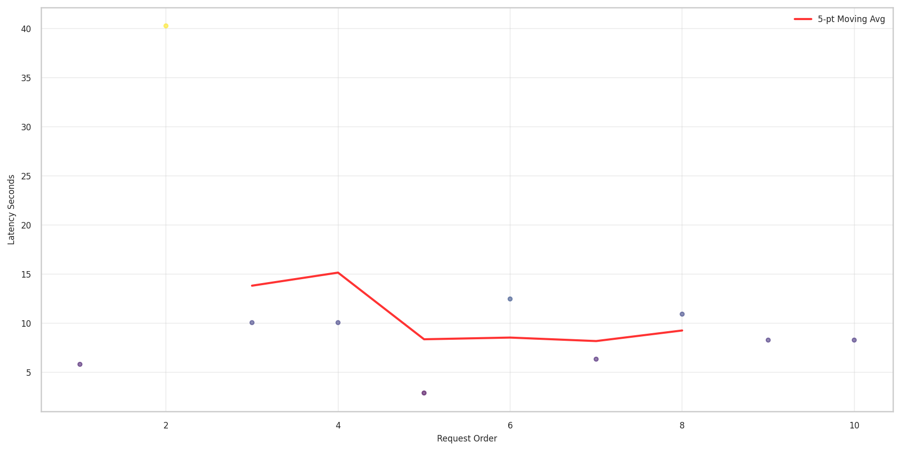](report_assets_20260310_064740/seq_agent_model_config_test_agent_normal_gemini-2_5-pro_4K.png)
<br>

**Total Requests:** 10


**config_test_agent_normal via gemini-3-pro-preview Latency Sequence**<br>
**Total Requests:** 10<br>

[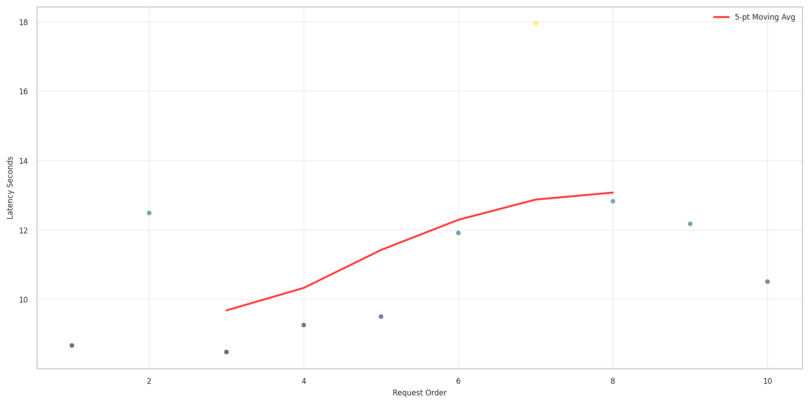](report_assets_20260310_064740/seq_agent_model_config_test_agent_normal_gemini-3-pro-preview_4K.png)
<br>

**Total Requests:** 10


**config_test_agent_normal via gemini-3.1-pro-preview Latency Sequence**<br>
**Total Requests:** 10<br>

[](report_assets_20260310_064740/seq_agent_model_config_test_agent_normal_gemini-3_1-pro-preview_4K.png)
<br>


#### config_test_agent_over_provisioned

**Total Requests:** 18


**config_test_agent_over_provisioned via gemini-2.5-flash Latency Sequence**<br>
**Total Requests:** 18<br>

[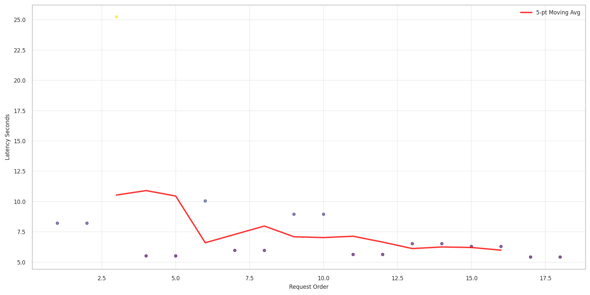](report_assets_20260310_064740/seq_agent_model_config_test_agent_over_provisioned_gemini-2_5-flash_4K.png)
<br>

**Total Requests:** 25


**config_test_agent_over_provisioned via gemini-2.5-pro Latency Sequence**<br>
**Total Requests:** 25<br>

[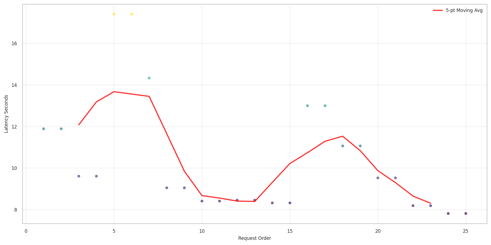](report_assets_20260310_064740/seq_agent_model_config_test_agent_over_provisioned_gemini-2_5-pro_4K.png)
<br>

**Total Requests:** 11


**config_test_agent_over_provisioned via gemini-3-pro-preview Latency Sequence**<br>
**Total Requests:** 11<br>

[](report_assets_20260310_064740/seq_agent_model_config_test_agent_over_provisioned_gemini-3-pro-preview_4K.png)
<br>

**Total Requests:** 19


**config_test_agent_over_provisioned via gemini-3.1-pro-preview Latency Sequence**<br>
**Total Requests:** 19<br>

[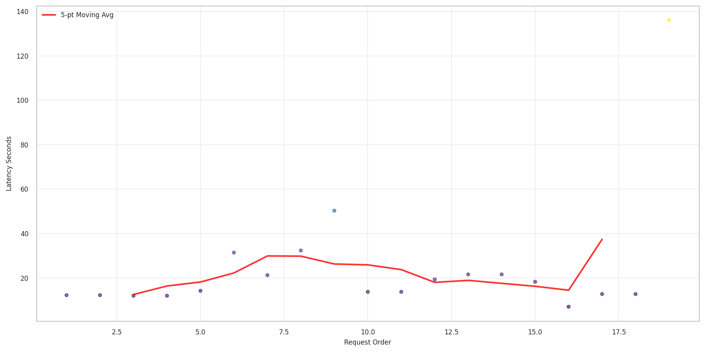](report_assets_20260310_064740/seq_agent_model_config_test_agent_over_provisioned_gemini-3_1-pro-preview_4K.png)
<br>


#### config_test_agent_wrong_candidates

**Total Requests:** 20


**config_test_agent_wrong_candidates via gemini-2.5-flash Latency Sequence**<br>
**Total Requests:** 20<br>

[](report_assets_20260310_064740/seq_agent_model_config_test_agent_wrong_candidates_gemini-2_5-flash_4K.png)
<br>

**Total Requests:** 13


**config_test_agent_wrong_candidates via gemini-2.5-pro Latency Sequence**<br>
**Total Requests:** 13<br>

[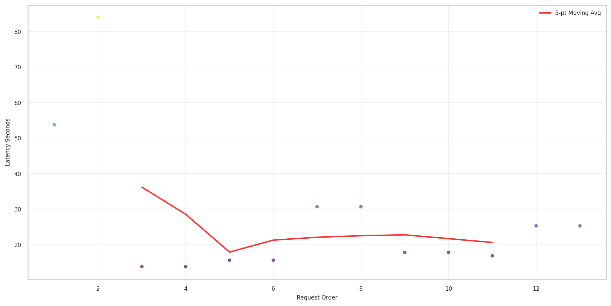](report_assets_20260310_064740/seq_agent_model_config_test_agent_wrong_candidates_gemini-2_5-pro_4K.png)
<br>

**Total Requests:** 7


**config_test_agent_wrong_candidates via gemini-3-pro-preview Latency Sequence**<br>
**Total Requests:** 7<br>

[](report_assets_20260310_064740/seq_agent_model_config_test_agent_wrong_candidates_gemini-3-pro-preview_4K.png)
<br>

**Total Requests:** 9


**config_test_agent_wrong_candidates via gemini-3.1-pro-preview Latency Sequence**<br>
**Total Requests:** 9<br>

[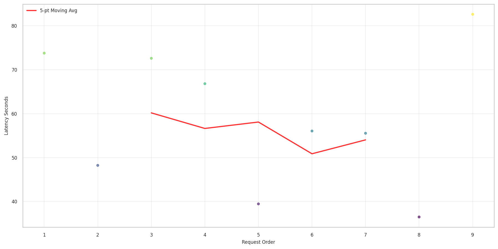](report_assets_20260310_064740/seq_agent_model_config_test_agent_wrong_candidates_gemini-3_1-pro-preview_4K.png)
<br>


#### google_search_agent

**Total Requests:** 51


**google_search_agent via gemini-2.5-flash Latency Sequence**<br>
**Total Requests:** 51<br>

[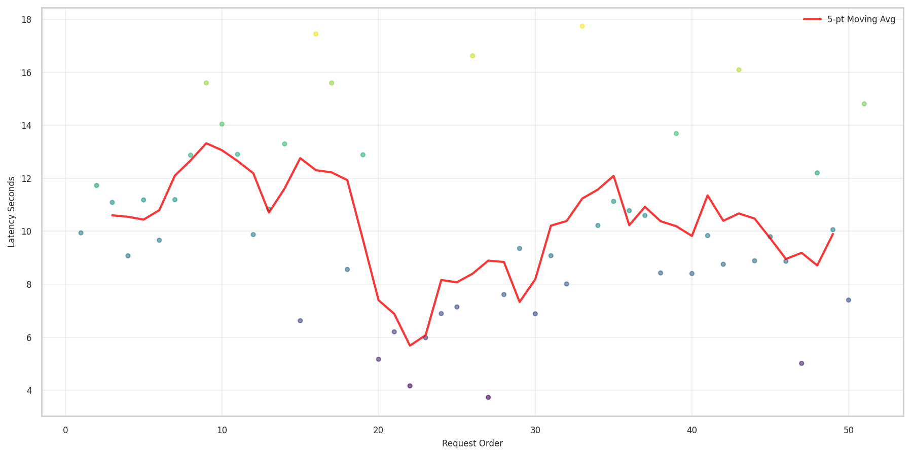](report_assets_20260310_064740/seq_agent_model_google_search_agent_gemini-2_5-flash_4K.png)
<br>

**Total Requests:** 77


**google_search_agent via gemini-2.5-pro Latency Sequence**<br>
**Total Requests:** 77<br>

[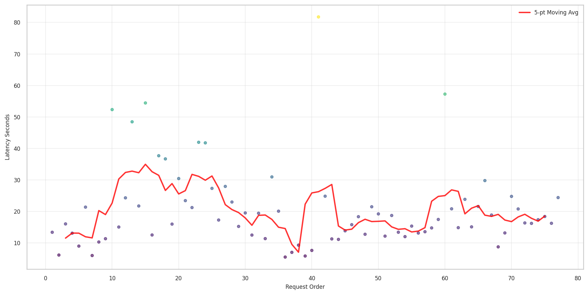](report_assets_20260310_064740/seq_agent_model_google_search_agent_gemini-2_5-pro_4K.png)
<br>

**Total Requests:** 15


**google_search_agent via gemini-3-pro-preview Latency Sequence**<br>
**Total Requests:** 15<br>

[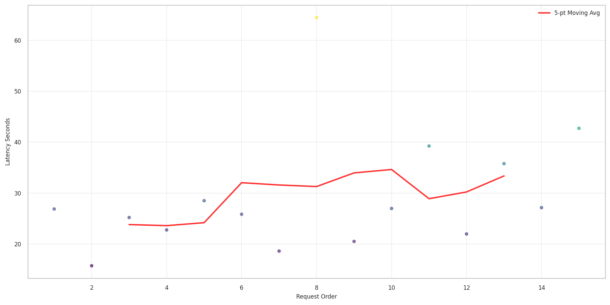](report_assets_20260310_064740/seq_agent_model_google_search_agent_gemini-3-pro-preview_4K.png)
<br>

**Total Requests:** 20


**google_search_agent via gemini-3.1-pro-preview Latency Sequence**<br>
**Total Requests:** 20<br>

[](report_assets_20260310_064740/seq_agent_model_google_search_agent_gemini-3_1-pro-preview_4K.png)
<br>


#### lookup_worker_1

**Total Requests:** 84


**lookup_worker_1 via gemini-2.5-flash Latency Sequence**<br>
**Total Requests:** 84<br>

[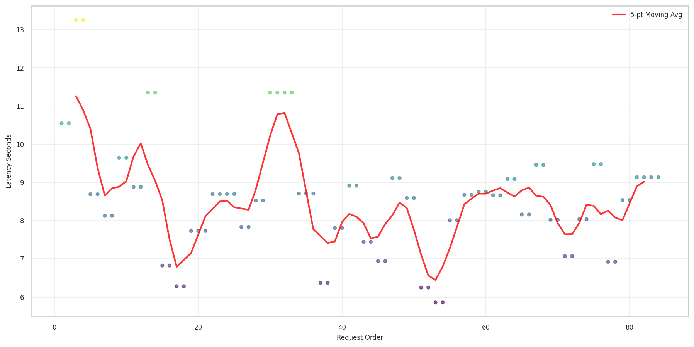](report_assets_20260310_064740/seq_agent_model_lookup_worker_1_gemini-2_5-flash_4K.png)
<br>

**Total Requests:** 56


**lookup_worker_1 via gemini-2.5-pro Latency Sequence**<br>
**Total Requests:** 56<br>

[](report_assets_20260310_064740/seq_agent_model_lookup_worker_1_gemini-2_5-pro_4K.png)
<br>

**Total Requests:** 65


**lookup_worker_1 via gemini-3-pro-preview Latency Sequence**<br>
**Total Requests:** 65<br>

[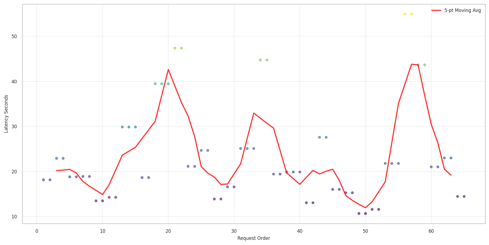](report_assets_20260310_064740/seq_agent_model_lookup_worker_1_gemini-3-pro-preview_4K.png)
<br>

**Total Requests:** 56


**lookup_worker_1 via gemini-3.1-pro-preview Latency Sequence**<br>
**Total Requests:** 56<br>

[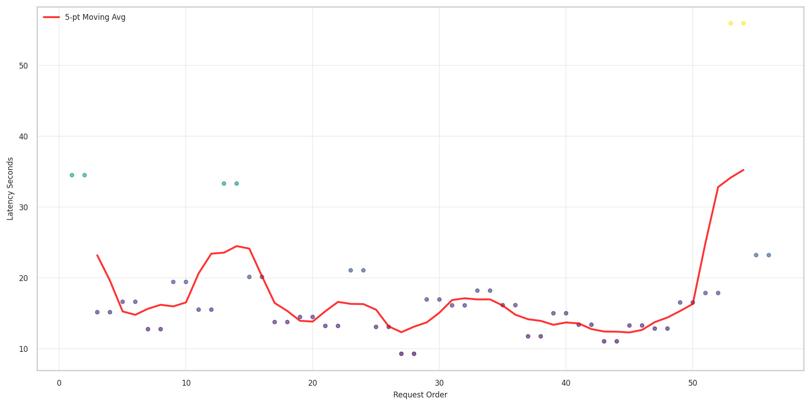](report_assets_20260310_064740/seq_agent_model_lookup_worker_1_gemini-3_1-pro-preview_4K.png)
<br>


#### lookup_worker_2

**Total Requests:** 84


**lookup_worker_2 via gemini-2.5-flash Latency Sequence**<br>
**Total Requests:** 84<br>

[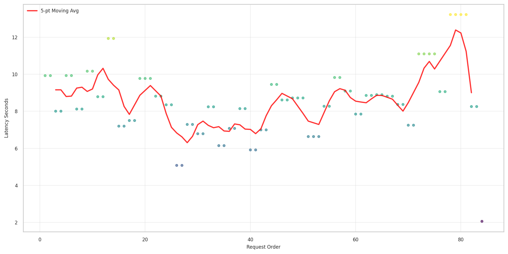](report_assets_20260310_064740/seq_agent_model_lookup_worker_2_gemini-2_5-flash_4K.png)
<br>

**Total Requests:** 52


**lookup_worker_2 via gemini-2.5-pro Latency Sequence**<br>
**Total Requests:** 52<br>

[](report_assets_20260310_064740/seq_agent_model_lookup_worker_2_gemini-2_5-pro_4K.png)
<br>

**Total Requests:** 58


**lookup_worker_2 via gemini-3-pro-preview Latency Sequence**<br>
**Total Requests:** 58<br>

[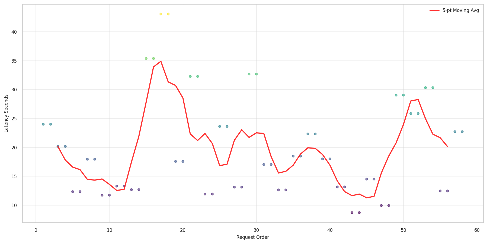](report_assets_20260310_064740/seq_agent_model_lookup_worker_2_gemini-3-pro-preview_4K.png)
<br>

**Total Requests:** 55


**lookup_worker_2 via gemini-3.1-pro-preview Latency Sequence**<br>
**Total Requests:** 55<br>

[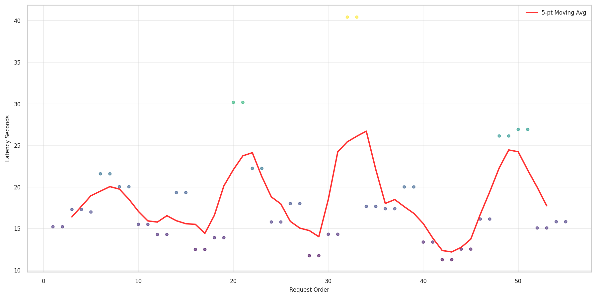](report_assets_20260310_064740/seq_agent_model_lookup_worker_2_gemini-3_1-pro-preview_4K.png)
<br>


#### lookup_worker_3

**Total Requests:** 87


**lookup_worker_3 via gemini-2.5-flash Latency Sequence**<br>
**Total Requests:** 87<br>

[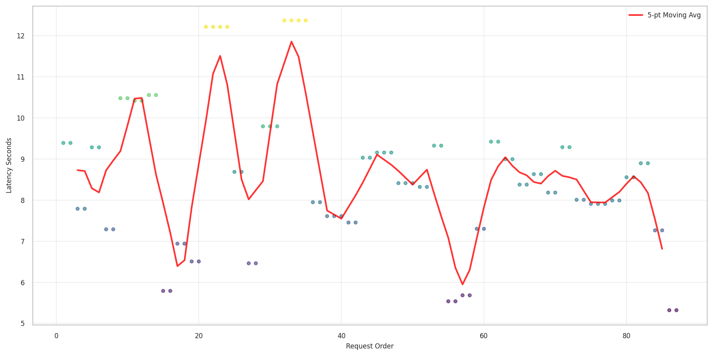](report_assets_20260310_064740/seq_agent_model_lookup_worker_3_gemini-2_5-flash_4K.png)
<br>

**Total Requests:** 48


**lookup_worker_3 via gemini-2.5-pro Latency Sequence**<br>
**Total Requests:** 48<br>

[](report_assets_20260310_064740/seq_agent_model_lookup_worker_3_gemini-2_5-pro_4K.png)
<br>

**Total Requests:** 62


**lookup_worker_3 via gemini-3-pro-preview Latency Sequence**<br>
**Total Requests:** 62<br>

[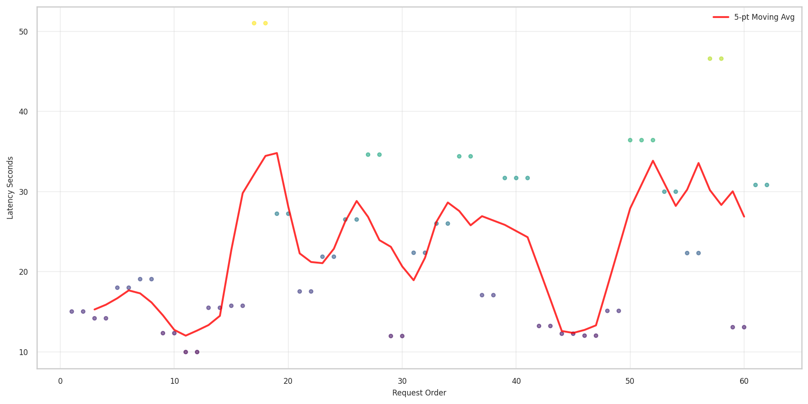](report_assets_20260310_064740/seq_agent_model_lookup_worker_3_gemini-3-pro-preview_4K.png)
<br>

**Total Requests:** 56


**lookup_worker_3 via gemini-3.1-pro-preview Latency Sequence**<br>
**Total Requests:** 56<br>

[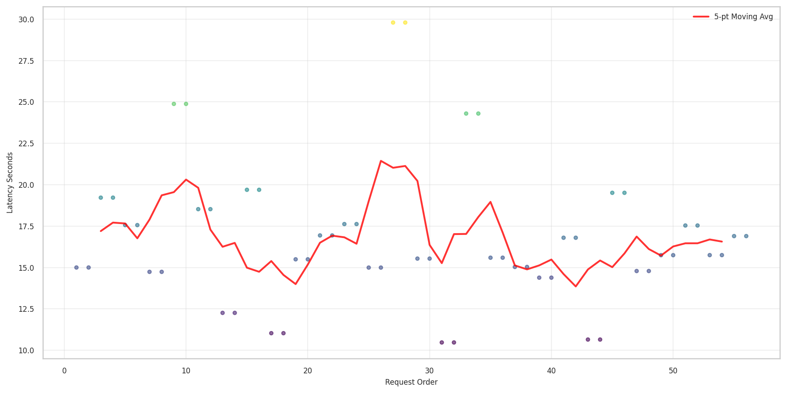](report_assets_20260310_064740/seq_agent_model_lookup_worker_3_gemini-3_1-pro-preview_4K.png)
<br>


#### parallel_db_lookup


#### unreliable_tool_agent

**Total Requests:** 18


**unreliable_tool_agent via gemini-2.5-flash Latency Sequence**<br>
**Total Requests:** 18<br>

[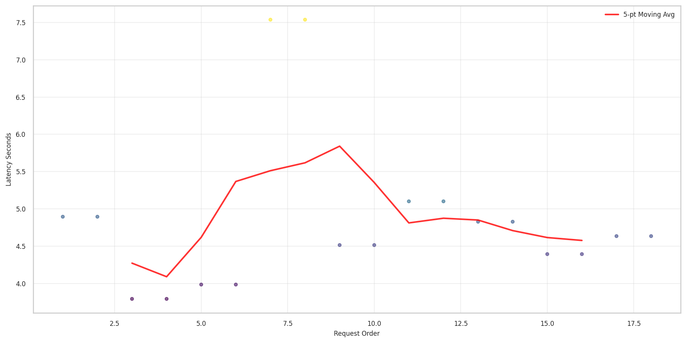](report_assets_20260310_064740/seq_agent_model_unreliable_tool_agent_gemini-2_5-flash_4K.png)
<br>

**Total Requests:** 42


**unreliable_tool_agent via gemini-2.5-pro Latency Sequence**<br>
**Total Requests:** 42<br>

[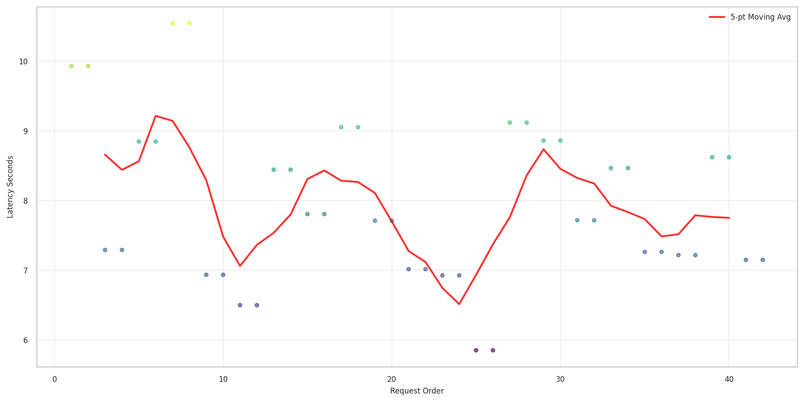](report_assets_20260310_064740/seq_agent_model_unreliable_tool_agent_gemini-2_5-pro_4K.png)
<br>

**Total Requests:** 23


**unreliable_tool_agent via gemini-3-pro-preview Latency Sequence**<br>
**Total Requests:** 23<br>

[](report_assets_20260310_064740/seq_agent_model_unreliable_tool_agent_gemini-3-pro-preview_4K.png)
<br>

**Total Requests:** 3


**unreliable_tool_agent via gemini-3.1-pro-preview Latency Sequence**<br>
**Total Requests:** 3<br>

[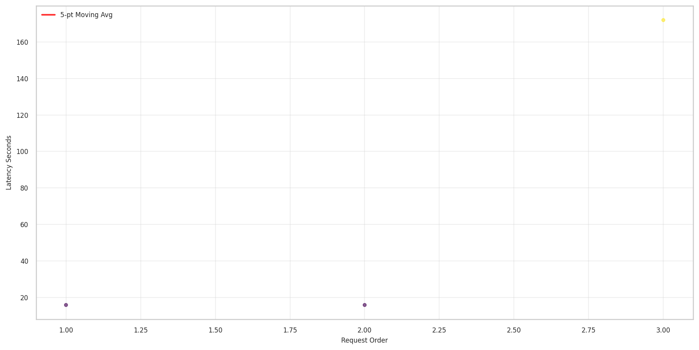](report_assets_20260310_064740/seq_agent_model_unreliable_tool_agent_gemini-3_1-pro-preview_4K.png)
<br>


### Token Usage Over Time

The charts below display the chronological token consumption (Input, Thought, Output) for each Agent-Model combination over the test run. This helps identify context window growth or token ballooning over time.


#### adk_documentation_agent

**Total Requests:** 96<br>

**adk_documentation_agent via gemini-2.5-flash Token Sequence**<br>

[](report_assets_20260310_064740/token_seq_adk_documentation_agent_gemini-2_5-flash_4K.png)
<br>

**Total Requests:** 113<br>

**adk_documentation_agent via gemini-2.5-pro Token Sequence**<br>

[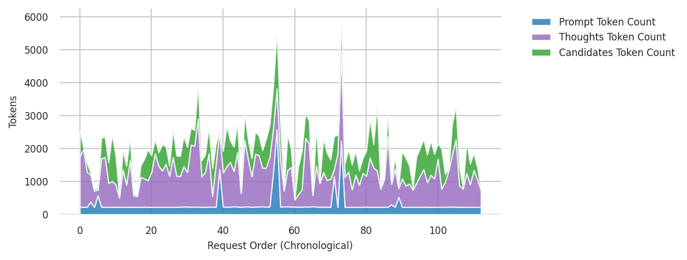](report_assets_20260310_064740/token_seq_adk_documentation_agent_gemini-2_5-pro_4K.png)
<br>

**Total Requests:** 58<br>

**adk_documentation_agent via gemini-3-pro-preview Token Sequence**<br>

[](report_assets_20260310_064740/token_seq_adk_documentation_agent_gemini-3-pro-preview_4K.png)
<br>

**Total Requests:** 54<br>

**adk_documentation_agent via gemini-3.1-pro-preview Token Sequence**<br>

[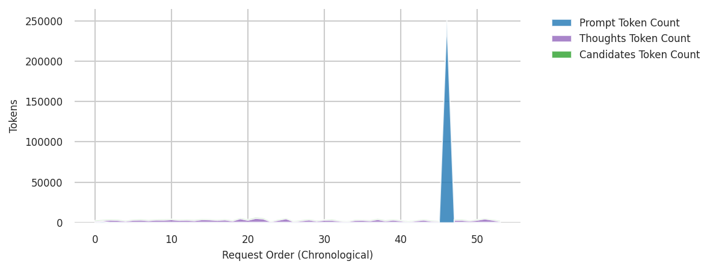](report_assets_20260310_064740/token_seq_adk_documentation_agent_gemini-3_1-pro-preview_4K.png)
<br>


#### ai_observability_agent

**Total Requests:** 50<br>

**ai_observability_agent via gemini-2.5-flash Token Sequence**<br>

[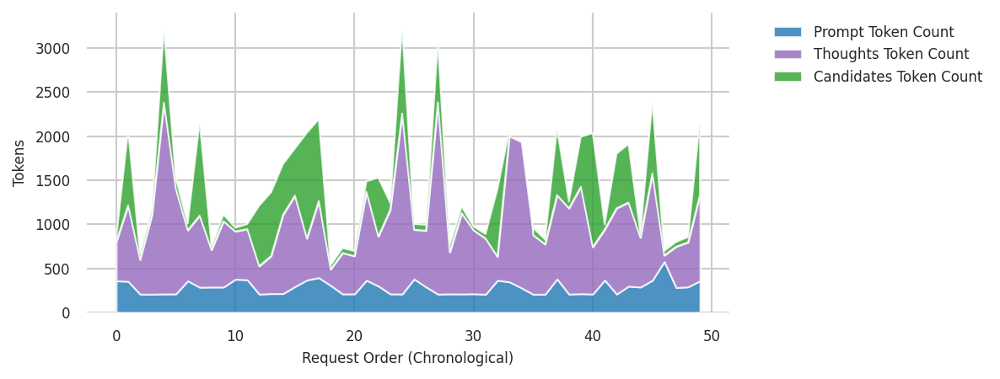](report_assets_20260310_064740/token_seq_ai_observability_agent_gemini-2_5-flash_4K.png)
<br>

**Total Requests:** 38<br>

**ai_observability_agent via gemini-2.5-pro Token Sequence**<br>

[](report_assets_20260310_064740/token_seq_ai_observability_agent_gemini-2_5-pro_4K.png)
<br>


#### bigquery_data_agent

**Total Requests:** 792<br>

**bigquery_data_agent via gemini-2.5-flash Token Sequence**<br>

[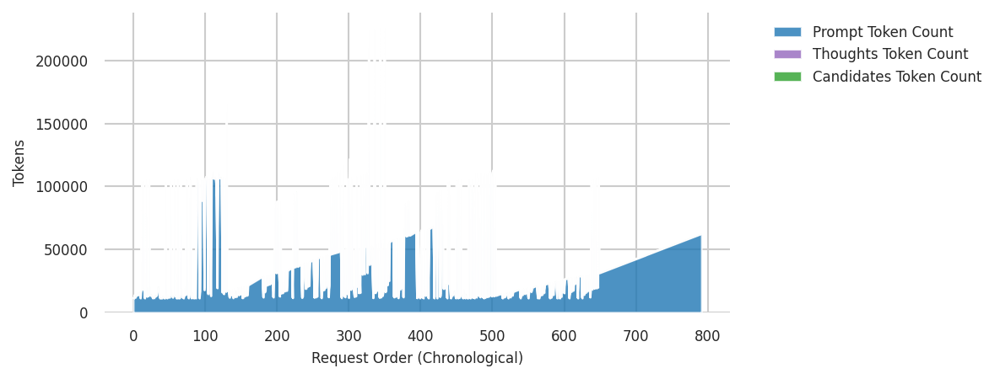](report_assets_20260310_064740/token_seq_bigquery_data_agent_gemini-2_5-flash_4K.png)
<br>

**Total Requests:** 448<br>

**bigquery_data_agent via gemini-2.5-pro Token Sequence**<br>

[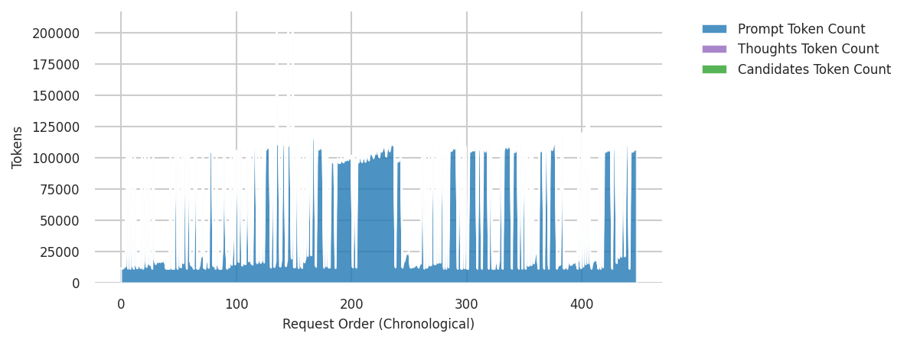](report_assets_20260310_064740/token_seq_bigquery_data_agent_gemini-2_5-pro_4K.png)
<br>

**Total Requests:** 290<br>

**bigquery_data_agent via gemini-3-pro-preview Token Sequence**<br>

[](report_assets_20260310_064740/token_seq_bigquery_data_agent_gemini-3-pro-preview_4K.png)
<br>

**Total Requests:** 379<br>

**bigquery_data_agent via gemini-3.1-pro-preview Token Sequence**<br>

[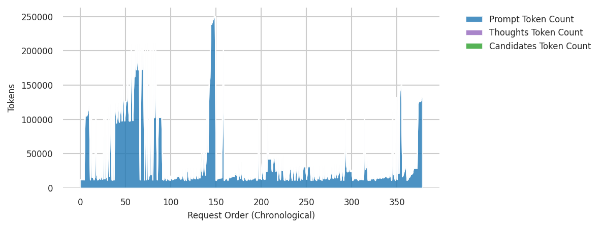](report_assets_20260310_064740/token_seq_bigquery_data_agent_gemini-3_1-pro-preview_4K.png)
<br>


#### config_test_agent_high_temp

**Total Requests:** 14<br>

**config_test_agent_high_temp via gemini-2.5-flash Token Sequence**<br>

[](report_assets_20260310_064740/token_seq_config_test_agent_high_temp_gemini-2_5-flash_4K.png)
<br>

**Total Requests:** 9<br>

**config_test_agent_high_temp via gemini-2.5-pro Token Sequence**<br>

[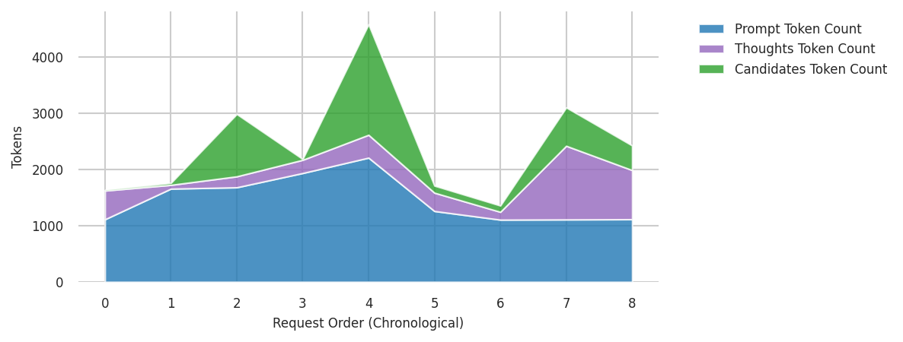](report_assets_20260310_064740/token_seq_config_test_agent_high_temp_gemini-2_5-pro_4K.png)
<br>

**Total Requests:** 10<br>

**config_test_agent_high_temp via gemini-3-pro-preview Token Sequence**<br>

[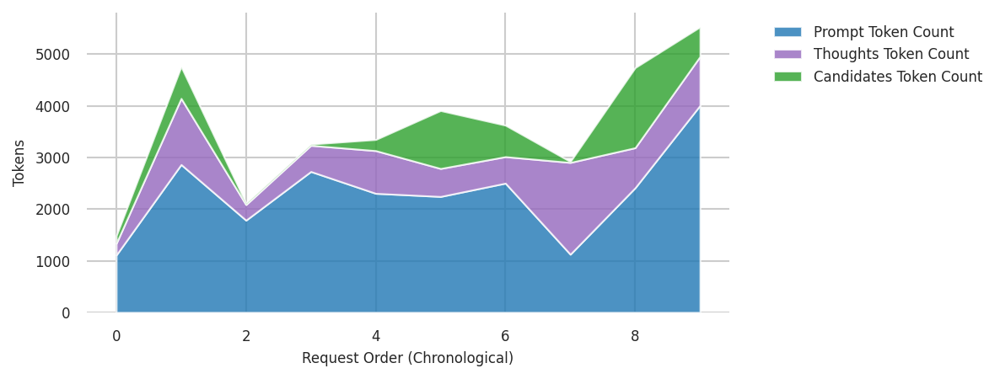](report_assets_20260310_064740/token_seq_config_test_agent_high_temp_gemini-3-pro-preview_4K.png)
<br>

**Total Requests:** 8<br>

**config_test_agent_high_temp via gemini-3.1-pro-preview Token Sequence**<br>

[](report_assets_20260310_064740/token_seq_config_test_agent_high_temp_gemini-3_1-pro-preview_4K.png)
<br>


#### config_test_agent_normal

**Total Requests:** 55<br>

**config_test_agent_normal via gemini-2.5-flash Token Sequence**<br>

[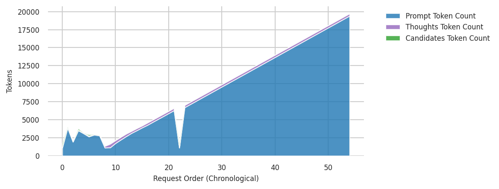](report_assets_20260310_064740/token_seq_config_test_agent_normal_gemini-2_5-flash_4K.png)
<br>

**Total Requests:** 10<br>

**config_test_agent_normal via gemini-2.5-pro Token Sequence**<br>

[](report_assets_20260310_064740/token_seq_config_test_agent_normal_gemini-2_5-pro_4K.png)
<br>

**Total Requests:** 10<br>

**config_test_agent_normal via gemini-3-pro-preview Token Sequence**<br>

[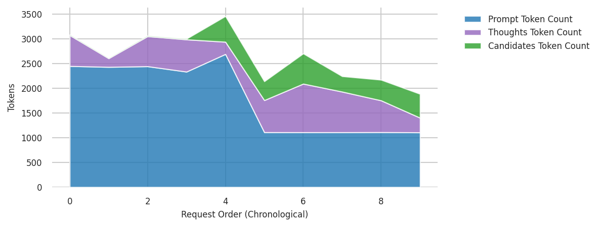](report_assets_20260310_064740/token_seq_config_test_agent_normal_gemini-3-pro-preview_4K.png)
<br>

**Total Requests:** 10<br>

**config_test_agent_normal via gemini-3.1-pro-preview Token Sequence**<br>

[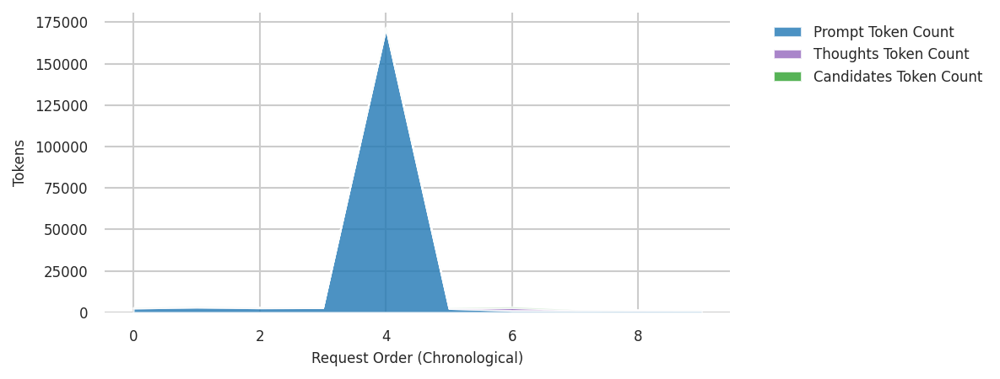](report_assets_20260310_064740/token_seq_config_test_agent_normal_gemini-3_1-pro-preview_4K.png)
<br>


#### config_test_agent_over_provisioned

**Total Requests:** 18<br>

**config_test_agent_over_provisioned via gemini-2.5-flash Token Sequence**<br>

[](report_assets_20260310_064740/token_seq_config_test_agent_over_provisioned_gemini-2_5-flash_4K.png)
<br>

**Total Requests:** 25<br>

**config_test_agent_over_provisioned via gemini-2.5-pro Token Sequence**<br>

[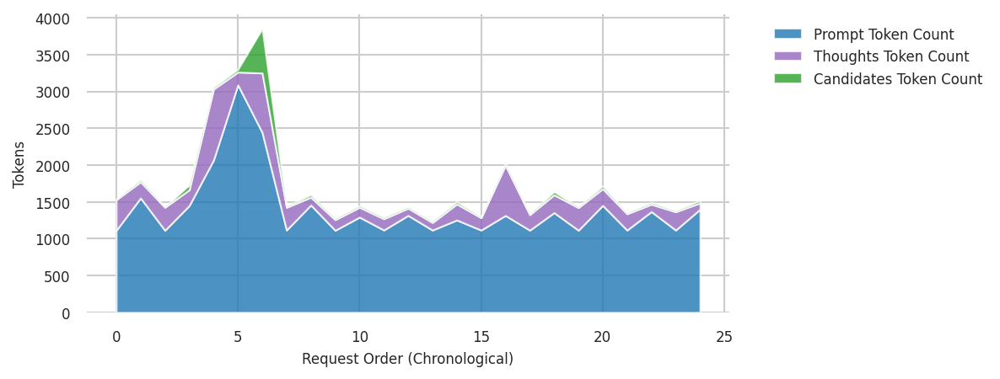](report_assets_20260310_064740/token_seq_config_test_agent_over_provisioned_gemini-2_5-pro_4K.png)
<br>

**Total Requests:** 13<br>

**config_test_agent_over_provisioned via gemini-3-pro-preview Token Sequence**<br>

[](report_assets_20260310_064740/token_seq_config_test_agent_over_provisioned_gemini-3-pro-preview_4K.png)
<br>

**Total Requests:** 19<br>

**config_test_agent_over_provisioned via gemini-3.1-pro-preview Token Sequence**<br>

[](report_assets_20260310_064740/token_seq_config_test_agent_over_provisioned_gemini-3_1-pro-preview_4K.png)
<br>


#### config_test_agent_wrong_candidates

**Total Requests:** 20<br>

**config_test_agent_wrong_candidates via gemini-2.5-flash Token Sequence**<br>

[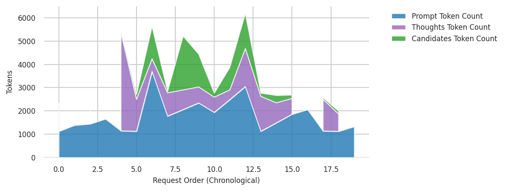](report_assets_20260310_064740/token_seq_config_test_agent_wrong_candidates_gemini-2_5-flash_4K.png)
<br>

**Total Requests:** 13<br>

**config_test_agent_wrong_candidates via gemini-2.5-pro Token Sequence**<br>

[](report_assets_20260310_064740/token_seq_config_test_agent_wrong_candidates_gemini-2_5-pro_4K.png)
<br>

**Total Requests:** 7<br>

**config_test_agent_wrong_candidates via gemini-3-pro-preview Token Sequence**<br>

[](report_assets_20260310_064740/token_seq_config_test_agent_wrong_candidates_gemini-3-pro-preview_4K.png)
<br>

**Total Requests:** 9<br>

**config_test_agent_wrong_candidates via gemini-3.1-pro-preview Token Sequence**<br>

[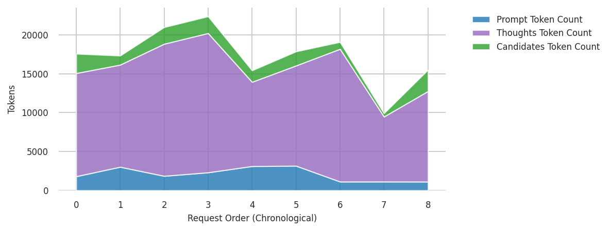](report_assets_20260310_064740/token_seq_config_test_agent_wrong_candidates_gemini-3_1-pro-preview_4K.png)
<br>


#### google_search_agent

**Total Requests:** 51<br>

**google_search_agent via gemini-2.5-flash Token Sequence**<br>

[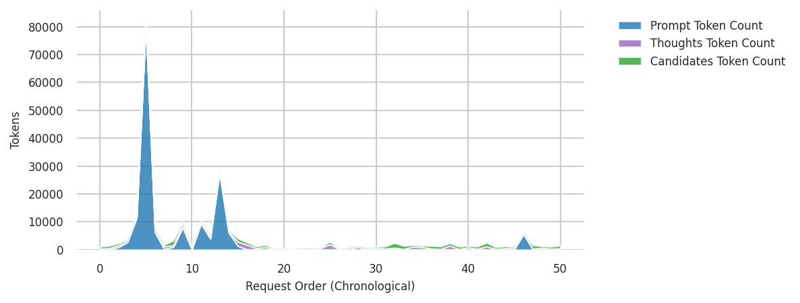](report_assets_20260310_064740/token_seq_google_search_agent_gemini-2_5-flash_4K.png)
<br>

**Total Requests:** 77<br>

**google_search_agent via gemini-2.5-pro Token Sequence**<br>

[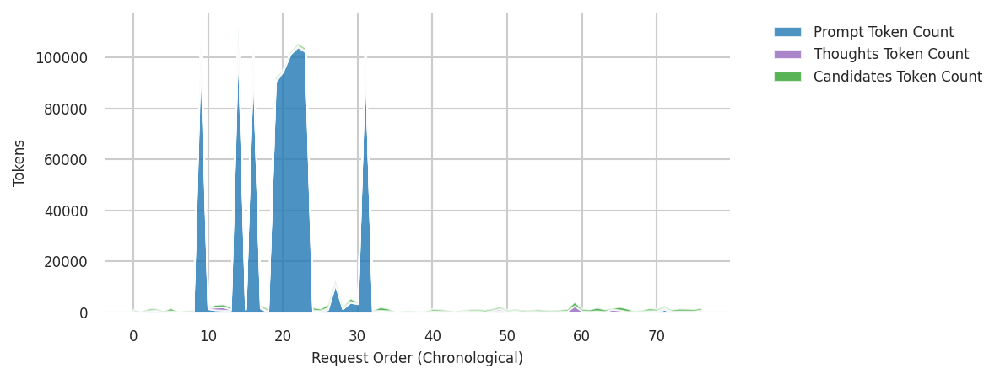](report_assets_20260310_064740/token_seq_google_search_agent_gemini-2_5-pro_4K.png)
<br>

**Total Requests:** 15<br>

**google_search_agent via gemini-3-pro-preview Token Sequence**<br>

[](report_assets_20260310_064740/token_seq_google_search_agent_gemini-3-pro-preview_4K.png)
<br>

**Total Requests:** 20<br>

**google_search_agent via gemini-3.1-pro-preview Token Sequence**<br>

[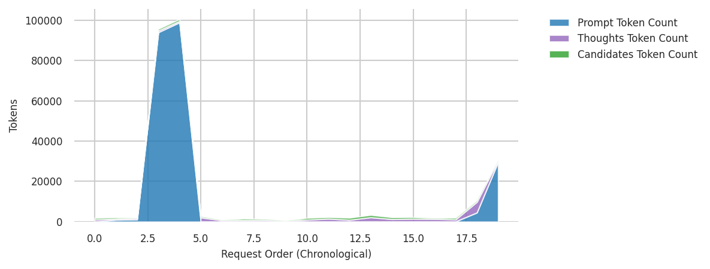](report_assets_20260310_064740/token_seq_google_search_agent_gemini-3_1-pro-preview_4K.png)
<br>


#### lookup_worker_1

**Total Requests:** 84<br>

**lookup_worker_1 via gemini-2.5-flash Token Sequence**<br>

[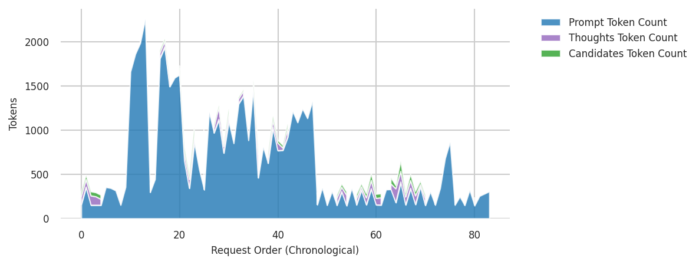](report_assets_20260310_064740/token_seq_lookup_worker_1_gemini-2_5-flash_4K.png)
<br>

**Total Requests:** 56<br>

**lookup_worker_1 via gemini-2.5-pro Token Sequence**<br>

[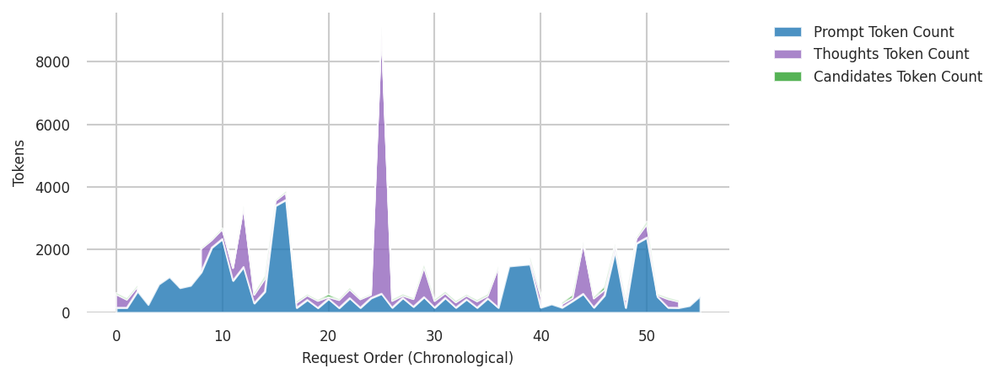](report_assets_20260310_064740/token_seq_lookup_worker_1_gemini-2_5-pro_4K.png)
<br>

**Total Requests:** 66<br>

**lookup_worker_1 via gemini-3-pro-preview Token Sequence**<br>

[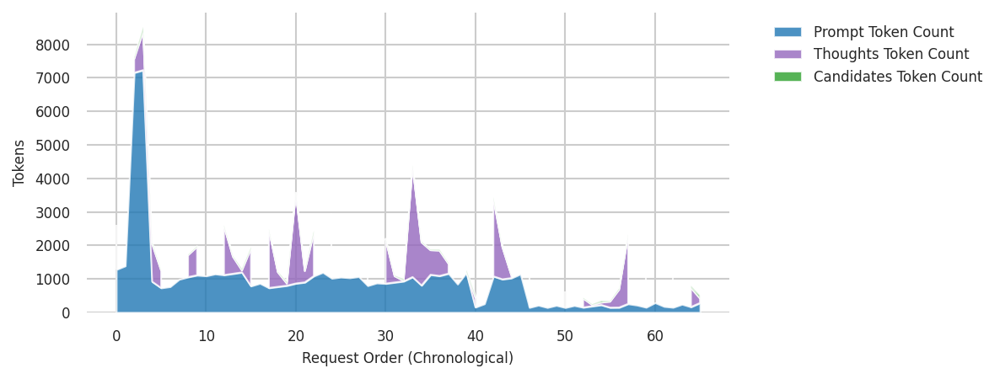](report_assets_20260310_064740/token_seq_lookup_worker_1_gemini-3-pro-preview_4K.png)
<br>

**Total Requests:** 56<br>

**lookup_worker_1 via gemini-3.1-pro-preview Token Sequence**<br>

[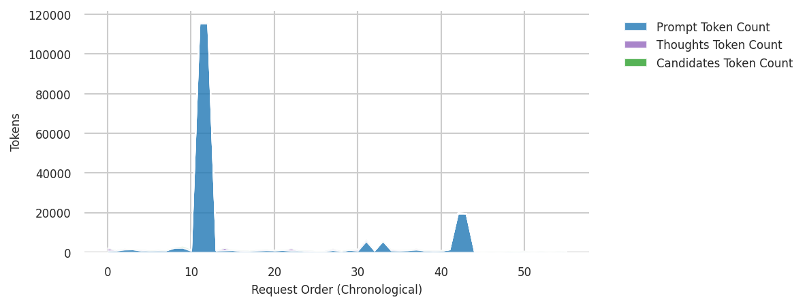](report_assets_20260310_064740/token_seq_lookup_worker_1_gemini-3_1-pro-preview_4K.png)
<br>


#### lookup_worker_2

**Total Requests:** 84<br>

**lookup_worker_2 via gemini-2.5-flash Token Sequence**<br>

[](report_assets_20260310_064740/token_seq_lookup_worker_2_gemini-2_5-flash_4K.png)
<br>

**Total Requests:** 52<br>

**lookup_worker_2 via gemini-2.5-pro Token Sequence**<br>

[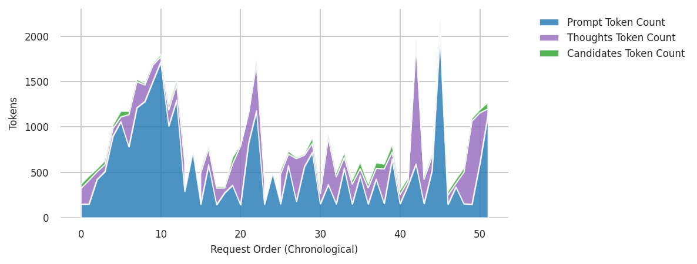](report_assets_20260310_064740/token_seq_lookup_worker_2_gemini-2_5-pro_4K.png)
<br>

**Total Requests:** 61<br>

**lookup_worker_2 via gemini-3-pro-preview Token Sequence**<br>

[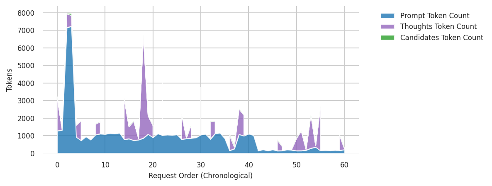](report_assets_20260310_064740/token_seq_lookup_worker_2_gemini-3-pro-preview_4K.png)
<br>

**Total Requests:** 55<br>

**lookup_worker_2 via gemini-3.1-pro-preview Token Sequence**<br>

[](report_assets_20260310_064740/token_seq_lookup_worker_2_gemini-3_1-pro-preview_4K.png)
<br>


#### lookup_worker_3

**Total Requests:** 87<br>

**lookup_worker_3 via gemini-2.5-flash Token Sequence**<br>

[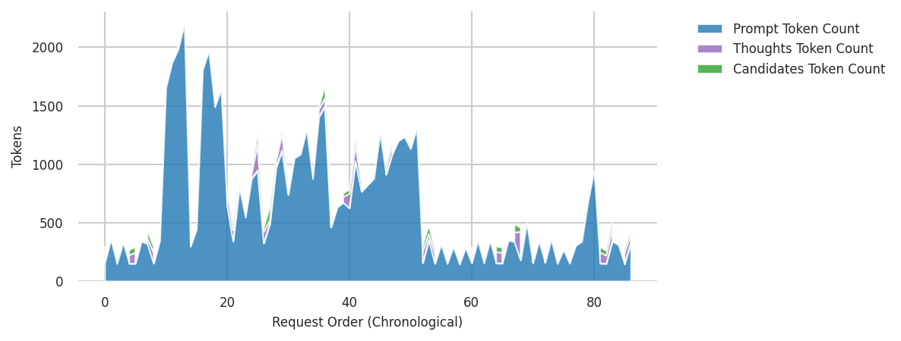](report_assets_20260310_064740/token_seq_lookup_worker_3_gemini-2_5-flash_4K.png)
<br>

**Total Requests:** 52<br>

**lookup_worker_3 via gemini-2.5-pro Token Sequence**<br>

[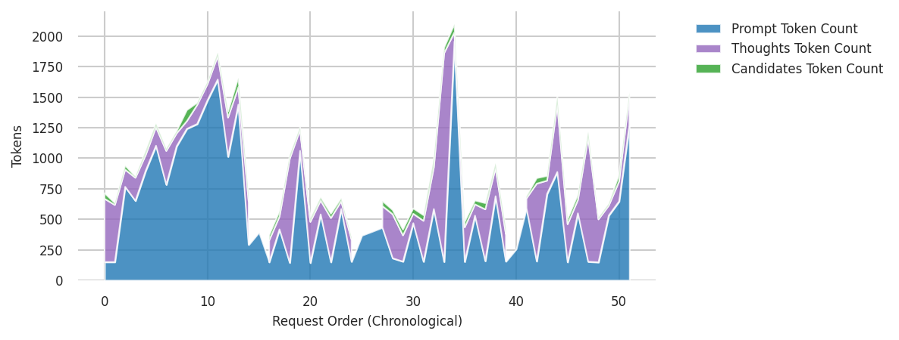](report_assets_20260310_064740/token_seq_lookup_worker_3_gemini-2_5-pro_4K.png)
<br>

**Total Requests:** 62<br>

**lookup_worker_3 via gemini-3-pro-preview Token Sequence**<br>

[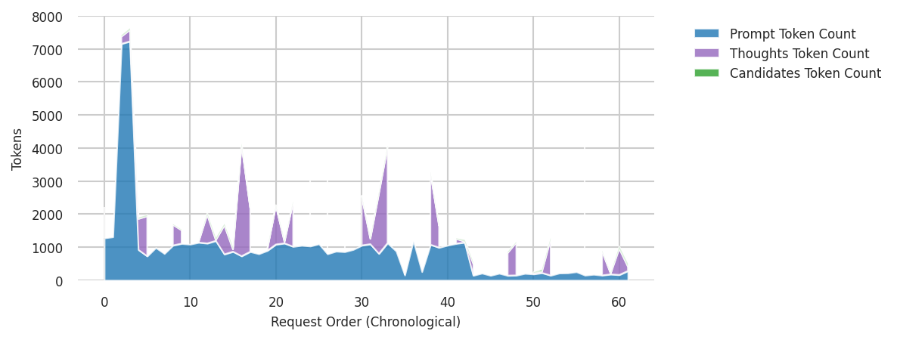](report_assets_20260310_064740/token_seq_lookup_worker_3_gemini-3-pro-preview_4K.png)
<br>

**Total Requests:** 56<br>

**lookup_worker_3 via gemini-3.1-pro-preview Token Sequence**<br>

[](report_assets_20260310_064740/token_seq_lookup_worker_3_gemini-3_1-pro-preview_4K.png)
<br>


#### unreliable_tool_agent

**Total Requests:** 24<br>

**unreliable_tool_agent via gemini-2.5-flash Token Sequence**<br>

[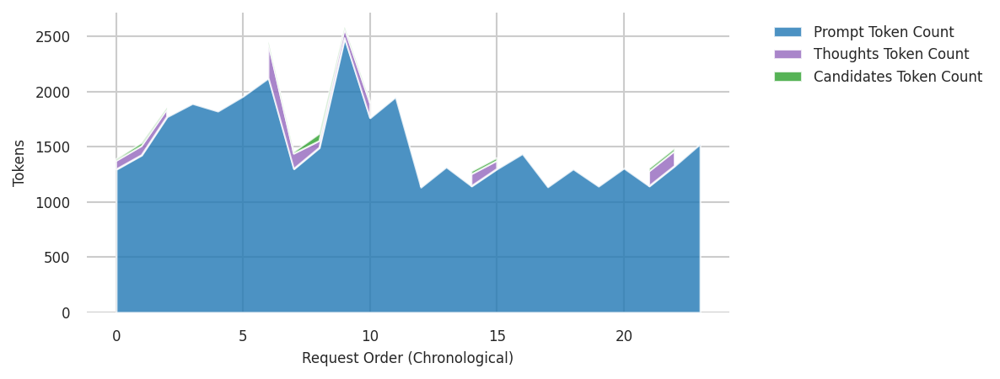](report_assets_20260310_064740/token_seq_unreliable_tool_agent_gemini-2_5-flash_4K.png)
<br>

**Total Requests:** 67<br>

**unreliable_tool_agent via gemini-2.5-pro Token Sequence**<br>

[](report_assets_20260310_064740/token_seq_unreliable_tool_agent_gemini-2_5-pro_4K.png)
<br>

**Total Requests:** 26<br>

**unreliable_tool_agent via gemini-3-pro-preview Token Sequence**<br>

[](report_assets_20260310_064740/token_seq_unreliable_tool_agent_gemini-3-pro-preview_4K.png)
<br>


## Report Parameters

```json
{
  "config": {
    "playbook": "overview",
    "data_retrieval": {
      "time_period": "all",
      "num_slowest_queries": 50,
      "num_error_queries": 200,
      "num_empty_llm_responses": 20,
      "num_queries_to_analyze_rca": 5
    },
    "data_presentation": {
      "chart_scale": 0.5,
      "max_column_width_chars": 250,
      "num_error_queries": 5,
      "num_slowest_queries": 5
    },
    "kpis": {
      "end_to_end": {
        "latency_target": 10.0,
        "percentile_target": 95.5,
        "error_target": 5.0
      },
      "agent": {
        "latency_target": 8.0,
        "percentile_target": 95.5,
        "error_target": 5.0
      },
      "llm": {
        "latency_target": 5.0,
        "percentile_target": 95.5,
        "error_target": 5.0
      },
      "tool": {
        "latency_target": 3.0,
        "percentile_target": 95.5,
        "error_target": 5.0
      }
    }
  },
  "queries": [
    "Some additional instructions to add to the prompt."
  ]
}
```

---
**Report Generation Time:** 352.91 seconds
